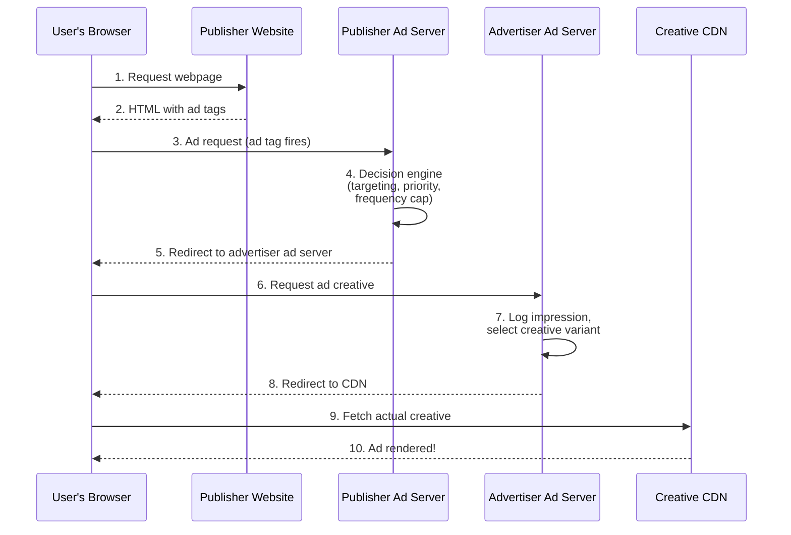
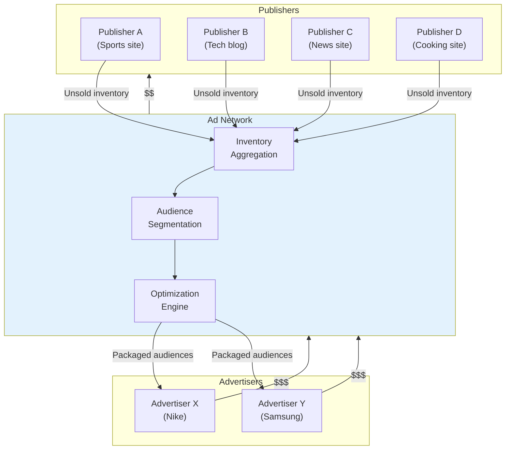

# Ad Servers & Ad Networks

Ad servers were the first piece of ad tech ever built. Ad networks were the second. Together, they solved the fundamental problem of digital advertising: **how do you efficiently match ads with ad space at scale?**

<Tip>
**Software engineering analogy**: If the ad tech ecosystem is a cloud platform, ad servers are the compute layer (they actually serve the ads), and ad networks are the first-generation marketplace layer (they match supply with demand). Everything that came later -- SSPs, DSPs, exchanges -- was built on top of these foundations.
</Tip>

## The First Banner Ad: Where It All Began

<Note>
**October 27, 1994**: HotWired.com (the digital arm of Wired magazine) published the first commercial banner ad on the web. AT&T paid to display a colorful 468x60 pixel banner that read:

**"Have you ever clicked your mouse right HERE? You will."**

The result? A **44% click-through rate**. Nearly half of everyone who saw it clicked on it. For context, the average display ad CTR today is about **0.1%**. That first banner ad performed 440x better than modern ads.

Why? Simple: it was the first one. Nobody had ever seen a clickable ad on a website before. The novelty alone drove engagement. This is a pattern that repeats across ad tech history -- every new format starts with incredible engagement that declines as users develop "ad blindness."
</Note>

That first banner ad created an industry. Within months, every major website wanted to sell ads, and every major brand wanted to buy them. But there was a problem: **how do you manage all those ads?**

## What Is an Ad Server?

An ad server is software that:

1. **Stores** ad creative (images, videos, HTML)
2. **Decides** which ad to show for a given request (targeting, frequency capping, pacing)
3. **Serves** the ad to the user's browser or app
4. **Tracks** impressions, clicks, and other interactions
5. **Reports** performance data back to buyers and sellers

<Tip>
**Software engineering analogy**: An ad server is essentially a **CDN with decision logic**. Like Cloudflare or Akamai, it serves content at the edge with low latency. But unlike a static CDN, it makes real-time decisions about *which* content to serve based on targeting rules, campaign budgets, and auction outcomes. Think of it as `nginx` with a built-in business logic layer.
</Tip>

### How Ad Serving Works

Here's what happens when you visit a webpage with ads:

<Accordion title="For the curious: Why so many redirects?">
You might notice the chain: publisher ad server --> advertiser ad server --> CDN. Why not just serve the ad directly?

Each redirect serves a purpose:

1. **Publisher ad server redirect**: The publisher needs to count the impression in *their* system for billing purposes. They need their own count.
2. **Advertiser ad server redirect**: The advertiser needs to count the impression in *their* system to verify the publisher's count and apply their own tracking. They don't trust the publisher's numbers alone.
3. **CDN fetch**: The actual creative asset (image/video) comes from a CDN for performance.

This multi-hop architecture exists because **neither side trusts the other's counting**. It's like a distributed system with no single source of truth -- each party maintains their own ledger. This is also why ad loading can be slow and why ad blockers work by intercepting these redirect chains.

This redirect chain happens in ~100-300ms on a good day. On a bad day, with multiple third-party tracking pixels also firing, it can take seconds -- which is why ads often load after the page content.
</Accordion>

### Publisher Ad Server vs. Advertiser Ad Server

There are two types of ad servers, and they serve different masters:

<Tabs>
  <Tab title="Publisher Ad Server (Supply Side)">
    **Also called**: First-party ad server

    **Purpose**: Manage and optimize the publisher's ad inventory

    **Key functions**:
    - Manage direct-sold campaigns (guaranteed deals with advertisers)
    - Set up ad slots and placements across the site
    - Apply targeting rules (geo, device, section, audience)
    - Enforce frequency capping (don't show the same ad 100 times)
    - Yield optimization (maximize revenue across direct and programmatic)
    - Fallback/passback logic (what to show if no ad is available)
    - Reporting for the publisher's sales team

    **Market leader**: **Google Ad Manager** (formerly DoubleClick for Publishers / DFP)
    **Alternatives**: Kevel (formerly Adzerk), Smart AdServer, Xandr (Microsoft)

    **Analogy**: Like a load balancer that routes incoming requests to the highest-value backend service, with fallback chains.
  </Tab>
  <Tab title="Advertiser Ad Server (Demand Side)">
    **Also called**: Third-party ad server

    **Purpose**: Track and verify ad delivery across all publishers and platforms

    **Key functions**:
    - Serve ad creatives to publisher sites
    - Independent impression/click counting (advertiser's source of truth)
    - Creative rotation and optimization (A/B testing)
    - Cross-publisher frequency capping
    - Viewability measurement
    - Brand safety verification
    - Attribution and conversion tracking
    - Cross-channel reporting (unified view across all publishers)

    **Market leader**: **Campaign Manager 360** (formerly DoubleClick Campaign Manager)
    **Alternatives**: Flashtalking (Mediaocean), Sizmek (Amazon), Innovid

    **Analogy**: Like a centralized logging and monitoring service (think Datadog) that provides an independent, unified view of what's happening across all your distributed deployments.
  </Tab>
</Tabs>

### The DoubleClick Story

The history of ad servers is essentially the history of **DoubleClick**, which became the foundation of Google's ad empire.

<Steps>
  <Step title="1996: DoubleClick Founded">
    Kevin O'Connor and Dwight Merriman founded DoubleClick in New York. Their key innovation: **DART (Dynamic Advertising Reporting and Targeting)** -- the first real ad server that could target and track ads at scale.
  </Step>
  <Step title="1998: DoubleClick IPO">
    DoubleClick went public and became the dominant ad server for both publishers and advertisers. By the early 2000s, it powered ad serving for the majority of major websites.
  </Step>
  <Step title="2000: Privacy Controversy">
    DoubleClick attempted to merge its ad tracking data with offline consumer data from Abacus Direct (which it acquired). The public backlash was enormous -- one of the first major internet privacy controversies. DoubleClick abandoned the plan. (Fun fact: Google later accomplished essentially the same thing with far less controversy.)
  </Step>
  <Step title="2005: Hellman & Friedman Acquisition">
    DoubleClick was taken private for $1.1B during the post-dot-com downturn.
  </Step>
  <Step title="2007: Google Acquires DoubleClick for $3.1B">
    This was the most consequential acquisition in ad tech history. Google -- already dominant in search advertising -- now controlled the infrastructure used by most of the display advertising ecosystem.
  </Step>
  <Step title="2018: Rebranded to Google Marketing Platform">
    DoubleClick products were rebranded: DFP became Google Ad Manager, DCM became Campaign Manager 360, DBM became Display & Video 360 (DV360).
  </Step>
  <Step title="2023-2024: DOJ Antitrust Trial">
    The U.S. Department of Justice sued Google, arguing that the DoubleClick acquisition and subsequent moves gave Google an illegal monopoly over the ad tech stack. The trial is one of the most significant antitrust cases in tech history.
  </Step>
</Steps>

<Warning>
**The monopoly concern**: After acquiring DoubleClick, Google controlled the dominant tool on the buy side (Google Ads / DV360), the dominant tool on the sell side (Google Ad Manager), AND the dominant exchange connecting them (Google Ad Exchange / AdX). Critics describe this as owning the NYSE, the largest broker, and the largest market maker simultaneously. The DOJ's antitrust case centers on exactly this vertical integration.
</Warning>

## What Are Ad Networks?

While ad servers solved the problem of *managing* ads, publishers still had a problem: **unsold inventory**. Premium publishers could sell their best placements through direct sales teams, but what about the rest? A human sales team can't sell billions of remnant impressions.

**Ad networks** emerged to solve this problem. An ad network is an intermediary that:

1. **Aggregates** unsold inventory from multiple publishers
2. **Packages** it into audience segments (e.g., "Sports fans," "Tech enthusiasts")
3. **Sells** it to advertisers at a higher price than the publishers could get individually

<Tip>
**Software engineering analogy**: An ad network is like an **API gateway** that aggregates multiple backend microservices into a single, unified API. Individual publishers (microservices) have limited reach on their own. The ad network (gateway) combines them into a product that's more valuable than the sum of its parts. The ad network makes money on the spread -- buying cheap, selling at a markup.
</Tip>

### How Ad Networks Work

### The Inventory Hierarchy

Ad networks primarily dealt with non-premium inventory. Here's how the industry categorizes ad space:

| Tier | Description | How It's Sold | Typical CPM |
|---|---|---|---|
| **Premium** | Homepage, above-the-fold, high-engagement placements | Direct sales (IO-based) | $10 - $50+ |
| **Remnant** | Good placements that weren't sold directly | Ad networks, programmatic | $1 - $10 |
| **Long-tail** | Small sites, below-the-fold, low-engagement | Programmatic only | $0.10 - $2 |

<Accordion title="For the curious: What's an IO (Insertion Order)?">
An **Insertion Order (IO)** is the advertising equivalent of a purchase order. It's a contract between an advertiser (or their agency) and a publisher that specifies:

- Campaign dates (start/end)
- Number of impressions purchased
- Pricing (CPM, CPC, or flat rate)
- Targeting requirements
- Creative specifications
- Payment terms

In the early days of digital advertising, *every* ad deal was IO-based -- negotiated over email and phone, signed on paper. This is called **direct buying** or **IO-based buying**. It still exists for premium inventory, but it's slow and doesn't scale.

Think of it like manually provisioning servers vs. using auto-scaling. IOs are the manual provisioning of the ad world -- sometimes necessary for critical workloads (premium campaigns), but you wouldn't want to do it for every single ad impression.
</Accordion>

### Major Ad Networks (Historical and Current)

| Network | Founded | Notes |
|---|---|---|
| **DoubleClick Ad Network** | 1996 | The first major ad network. Acquired by Google in 2007. |
| **Google AdSense** | 2003 | Google's ad network for publishers. Still the largest by far. |
| **ValueClick** | 1998 | Early performance ad network. Rebranded as Conversant. |
| **Advertising.com** | 1998 | Acquired by AOL in 2004, later became part of Verizon Media. |
| **Tribal Fusion** | 2001 | Premium ad network, later part of Exponential Interactive. |
| **AdMob** | 2006 | Mobile ad network. Acquired by Google in 2009 for $750M. |
| **InMobi** | 2007 | Leading independent mobile ad network. |
| **Unity Ads** | 2014 | Dominant in-game ad network for mobile games. |
| **ironSource** | 2010 | Mobile game ad network. Merged with Unity in 2022. |
| **AppLovin** | 2012 | Mobile app ad network, now one of the largest independent ad tech companies. |

### The Problem with Ad Networks

Ad networks improved upon direct sales, but they had fundamental limitations:

1. **Opacity**: Advertisers often didn't know *exactly* which sites their ads appeared on. Networks would sell "blind" inventory -- a package of impressions with no transparency about placement.

2. **Daisy-chaining**: If Network A couldn't fill an impression, it would pass it to Network B, which might pass it to Network C. Each hop added latency and took a margin. Publishers would sometimes have 10+ networks in a "waterfall" configuration.

3. **Pricing inefficiency**: Networks sold at fixed CPMs. There was no real-time market mechanism to discover the true price of an impression.

4. **Arbitrage**: Some networks bought cheap inventory from other networks and resold it at a markup without adding any value. This increased the "ad tech tax."

<Note>
In this waterfall example, the advertiser pays $2.00 CPM, but the publisher receives only $0.30 CPM. The three networks consume $1.70 in fees. This inefficiency drove the creation of **ad exchanges** and **real-time bidding** -- which we'll cover in the next sections.
</Note>

## IAB Ad Format Standards

The **Interactive Advertising Bureau (IAB)** is the industry body that standardizes ad formats. Without standards, every publisher would have different ad sizes, and advertisers would need custom creatives for every site.

### Standard Display Ad Sizes

| Format | Dimensions (px) | Common Name | Where You See It |
|---|---|---|---|
| Medium Rectangle | 300x250 | "The Workhorse" | Inline within content |
| Leaderboard | 728x90 | "The Header" | Top of page |
| Wide Skyscraper | 160x600 | "The Sidebar" | Page sidebar |
| Large Rectangle | 336x280 | "The Big Box" | Inline within content |
| Billboard | 970x250 | "The Statement" | Top of page, premium |
| Mobile Banner | 320x50 | "The Persistent Strip" | Bottom of mobile screen |
| Mobile Interstitial | 320x480 | "The Full Screen" | Between content/screens |

<Accordion title="For the curious: Why these specific sizes?">
The original IAB standard ad sizes were driven by practical constraints of early web design:

- **468x60** (the original banner): Fit the standard 640px-wide page layouts of the mid-1990s
- **728x90** (leaderboard): Designed for the 1024px-wide layouts that became standard in the 2000s
- **300x250** (medium rectangle): Fits perfectly in a two-column layout alongside content
- **160x600** (skyscraper): Designed for sidebar navigation areas

Over time, the industry converged on sizes that:
1. Balanced visibility (large enough to notice) with user experience (small enough not to dominate)
2. Worked across common page layouts
3. Were standardized enough for creative agencies to produce efficiently

The IAB updates these standards periodically. The most recent major update introduced "flexible" ad formats that can adapt to different screen sizes -- essentially responsive ads.
</Accordion>

### Modern Ad Formats

Beyond static banners, the industry has evolved to include:

<CardGroup cols={2}>
  <Card title="Native Ads">
    Ads that match the look and feel of the surrounding content. Think "sponsored posts" in a social feed or "recommended articles" at the bottom of a news story. These are powered by platforms like Taboola, Outbrain, and platform-native tools.
  </Card>
  <Card title="Video Ads">
    Pre-roll, mid-roll, and post-roll video ads (VAST/VPAID standards). The fastest-growing format, driven by YouTube, connected TV (CTV), and social video.
  </Card>
  <Card title="Rich Media">
    Interactive HTML5 ads that expand, animate, or include mini-games. Built using frameworks like Google Web Designer or Celtra. Higher engagement but more complex to produce.
  </Card>
  <Card title="Audio Ads">
    Ads in podcasts and music streaming (Spotify, Pandora). A rapidly growing format with its own programmatic ecosystem.
  </Card>
</CardGroup>

## From Ad Networks to Ad Exchanges

The limitations of ad networks led to the creation of **ad exchanges** -- open marketplaces where inventory could be bought and sold in real-time through auctions.

| Feature | Ad Network | Ad Exchange |
|---|---|---|
| Pricing | Fixed CPM | Auction-based (dynamic) |
| Transparency | Often "blind" (no site visibility) | Full transparency |
| Buying Method | Package deals | Per-impression bidding |
| Speed | Batch/near-real-time | Real-time (~100ms) |
| Who sets the price | The network | The market (supply & demand) |
| Analogy | A wholesaler/retailer | A stock exchange |

<Tip>
**Software engineering analogy**: The transition from ad networks to ad exchanges is like the transition from fixed-price cloud instances to spot instance auctions. Ad networks set prices and packaged inventory (like reserved instances). Ad exchanges introduced dynamic, auction-based pricing where the market determines the value of each impression (like spot pricing). The result: more efficient price discovery and better outcomes for both buyers and sellers.
</Tip>

The rise of ad exchanges led directly to **programmatic advertising** -- the automated, auction-based buying and selling of ads that now dominates the industry. That's what we'll cover next.

## Key Takeaways

1. **Ad servers are the foundational infrastructure** -- they store, decide, serve, and track ads. Google's dominance in ad serving (via the DoubleClick acquisition) is at the center of antitrust concerns.

2. **Publisher and advertiser ad servers serve different purposes** -- publishers optimize yield, advertisers verify delivery. Neither trusts the other's numbers.

3. **Ad networks solved the remnant inventory problem** but introduced opacity, latency (waterfalls), and margin stacking.

4. **IAB standards** ensure interoperability across the ecosystem -- without them, every publisher would need custom creative.

5. **The evolution from ad networks to ad exchanges** mirrors the broader tech trend from fixed-price services to dynamic, auction-based marketplaces.

---

**Next up**: [Programmatic Advertising](/adtech/programmatic) -- SSPs, DSPs, and the automated machinery that replaced human ad buyers.
