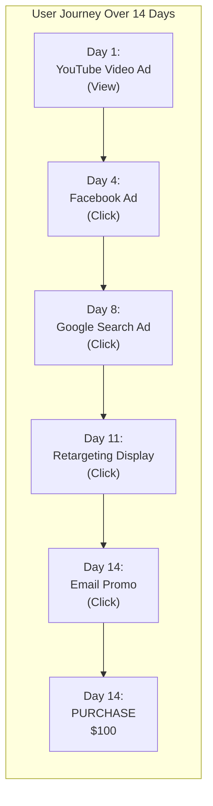
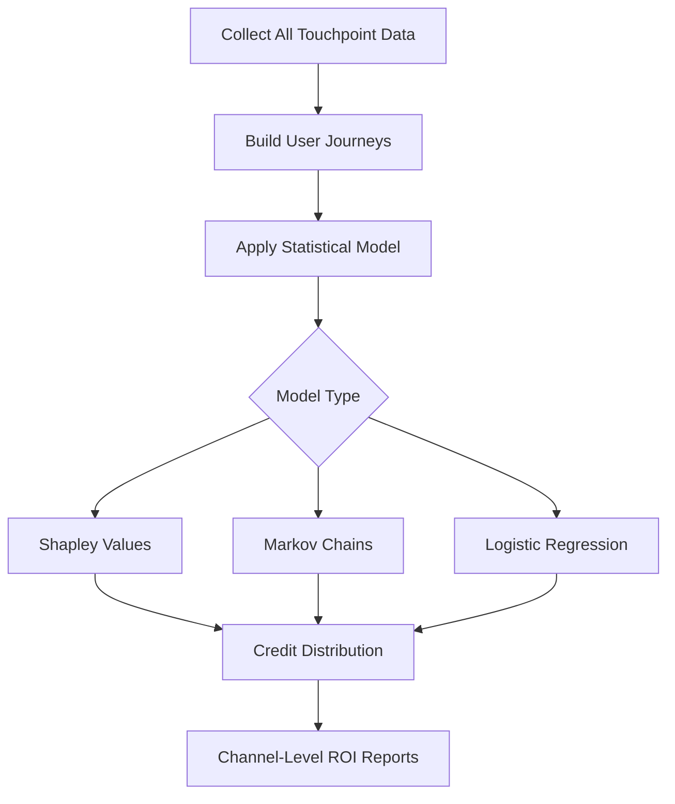
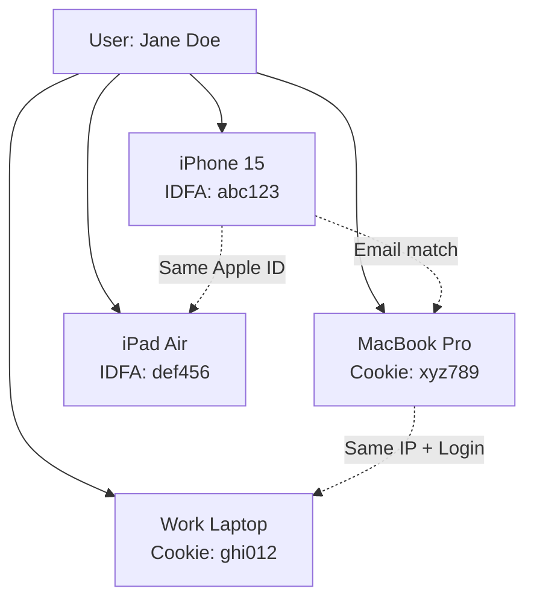
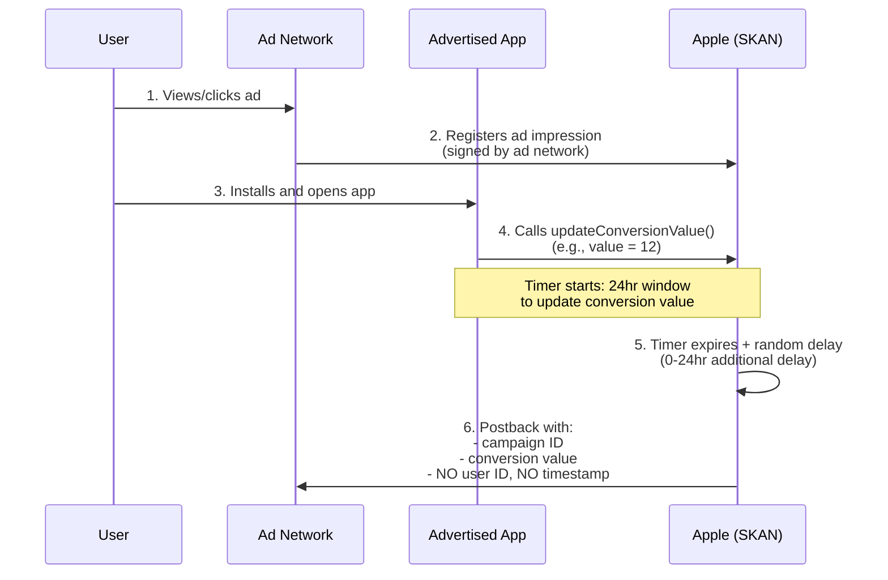
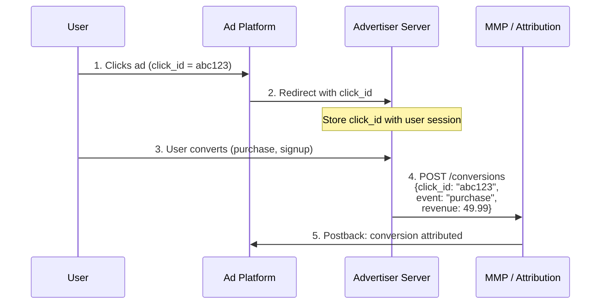
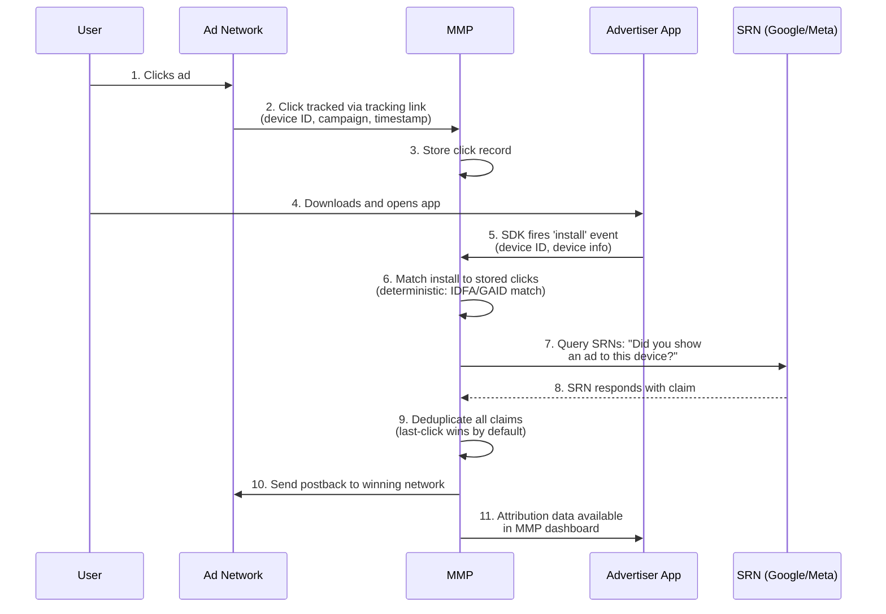
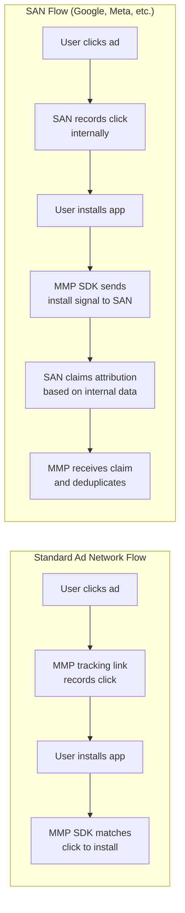
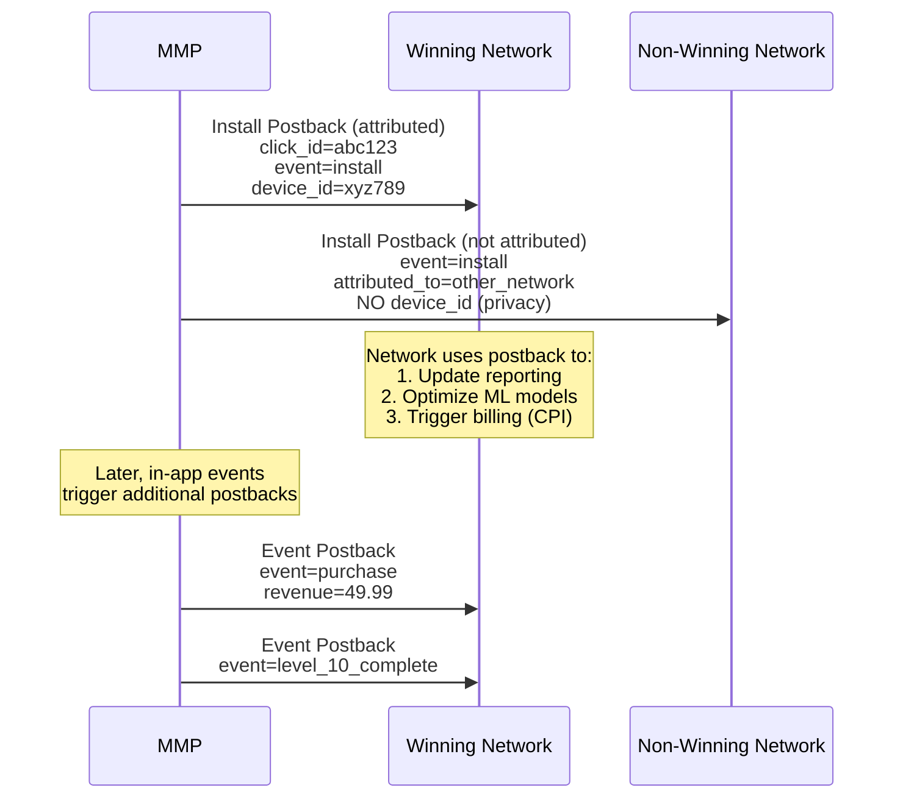

# Attribution Deep Dive

Imagine you are a detective solving a case. A customer just bought a pair of running shoes from your app. In the 14 days before that purchase, they saw a YouTube ad, clicked a Facebook ad, tapped a TikTok ad, and searched on Google. **Which ad deserves the credit?** That is the attribution problem -- and it is one of the hardest questions in advertising.

<Tip>
**Think of it this way**: Attribution is the distributed tracing of advertising. Just as OpenTelemetry traces a request across microservices to understand what happened, attribution traces a user's journey across ad touchpoints to understand what drove a conversion. And just like distributed tracing, it relies on propagating identifiers across system boundaries -- which is exactly what privacy regulations are making harder.
</Tip>

---

## What Attribution Solves

Without attribution, advertisers are flying blind. They spend money across dozens of channels but have no idea which channels actually drive results.

Attribution answers three critical questions:

1. **Which ads are working?** -- So you can invest more in what drives conversions
2. **Which ads are wasting money?** -- So you can cut spend on underperformers
3. **How do channels work together?** -- So you can build an effective marketing mix

Think of it like a restaurant kitchen. You have 10 chefs (ad channels) each claiming they made the dish that the customer loved. Attribution is the head chef who watched the whole process and knows exactly who did what.

---

## Click-Through vs. View-Through Attribution

The two fundamental types of attribution differ in how the user interacted with the ad:

<Tabs>
  <Tab title="Click-Through Attribution (CTA)">
    The user **clicked** on an ad and later converted.

    ```mermaid
    sequenceDiagram
        participant U as User
        participant AD as Ad
        participant LP as Landing Page / App
        participant C as Conversion

        U->>AD: Sees ad
        U->>AD: Clicks ad
        AD->>LP: Redirected to landing page
        Note over U,LP: Time passes (minutes to days)
        U->>C: Completes conversion
        Note over AD,C: Attribution: Click-through
    ```

    **Why it is trusted**: The user took an intentional action (clicking). There is a strong signal that the ad influenced behavior.

    **Typical window**: 7-30 days after the click.
  </Tab>
  <Tab title="View-Through Attribution (VTA)">
    The user **saw** an ad (but did not click) and later converted.

    ```mermaid
    sequenceDiagram
        participant U as User
        participant AD as Ad
        participant C as Conversion

        U->>AD: Sees ad (impression logged)
        Note over U,AD: User does NOT click
        Note over U,C: Time passes (hours to days)
        U->>C: Completes conversion organically
        Note over AD,C: Attribution: View-through
    ```

    **Why it is controversial**: Did the user convert *because* they saw the ad, or would they have converted anyway? It is like a billboard on the highway -- the person may have been driving to that store regardless.

    **Typical window**: 1-24 hours after the impression (much shorter than click-through).
  </Tab>
</Tabs>

<Warning>
**The view-through attribution trap**: Ad networks love view-through attribution because it lets them claim credit for conversions they may not have influenced. If a network serves millions of impressions, pure statistics guarantee some of those users will convert anyway. Always evaluate VTA claims skeptically and use short windows (1-6 hours) to reduce noise.
</Warning>

<Tip>
**Pro Tip**: When comparing performance across ad platforms, always make sure you are using the same attribution windows. Facebook defaulting to 7-day click / 1-day view and Google defaulting to 30-day click can make Google look much better simply because it has a longer window to capture conversions. Normalize your windows before drawing conclusions.
</Tip>

---

## Attribution Models

When a user interacts with multiple ads before converting, **who gets the credit?** Different models answer this differently. Let us walk through each one.

### The User Journey

Consider this real-world example:



### How Each Model Assigns Credit

<Tabs>
  <Tab title="Last-Click">
    **100% credit to the last touchpoint before conversion.**

    | Channel | Credit |
    |---|---|
    | YouTube Video | 0% |
    | Facebook Ad | 0% |
    | Google Search | 0% |
    | Retargeting Display | 0% |
    | **Email Promo** | **100%** |

    **Pros**: Simple, easy to implement, no ambiguity.
    **Cons**: Massively overcredits bottom-of-funnel channels. The email just "caught" a user who was already persuaded by earlier ads.

    Think of it this way: giving all credit to the last click is like giving all credit for a soccer goal to the player who tapped it in from 1 meter, ignoring the midfielder who dribbled past 3 defenders and the striker who set up the assist.
  </Tab>
  <Tab title="First-Click">
    **100% credit to the first touchpoint.**

    | Channel | Credit |
    |---|---|
    | **YouTube Video** | **100%** |
    | Facebook Ad | 0% |
    | Google Search | 0% |
    | Retargeting Display | 0% |
    | Email Promo | 0% |

    **Pros**: Values awareness and discovery. Good for understanding which channels introduce new customers.
    **Cons**: Ignores everything that happened after the first touchpoint. The user may have forgotten about the brand entirely if not for subsequent ads.
  </Tab>
  <Tab title="Linear">
    **Equal credit to all touchpoints.**

    | Channel | Credit |
    |---|---|
    | YouTube Video | **20%** |
    | Facebook Ad | **20%** |
    | Google Search | **20%** |
    | Retargeting Display | **20%** |
    | Email Promo | **20%** |

    **Pros**: Fair and balanced. No channel is over- or under-credited.
    **Cons**: Treats a random impression the same as a high-intent search click. Not all touchpoints are equally influential.
  </Tab>
  <Tab title="Time-Decay">
    **More credit to touchpoints closer to conversion.**

    | Channel | Credit |
    |---|---|
    | YouTube Video (Day 1) | **5%** |
    | Facebook Ad (Day 4) | **10%** |
    | Google Search (Day 8) | **20%** |
    | Retargeting Display (Day 11) | **30%** |
    | Email Promo (Day 14) | **35%** |

    **Pros**: Reflects the intuition that recent interactions matter more.
    **Cons**: Still undervalues awareness channels that plant the seed early.
  </Tab>
  <Tab title="Position-Based (U-Shaped)">
    **40% to first touchpoint, 40% to last, 20% split among middle.**

    | Channel | Credit |
    |---|---|
    | YouTube Video | **40%** |
    | Facebook Ad | **6.7%** |
    | Google Search | **6.7%** |
    | Retargeting Display | **6.7%** |
    | Email Promo | **40%** |

    **Pros**: Values both discovery (first touch) and conversion (last touch).
    **Cons**: Arbitrary 40/20/40 split. Why not 30/40/30?
  </Tab>
  <Tab title="Data-Driven / Algorithmic">
    **ML model determines credit based on actual data.**

    | Channel | Credit |
    |---|---|
    | YouTube Video | **22%** |
    | Facebook Ad | **28%** |
    | Google Search | **31%** |
    | Retargeting Display | **14%** |
    | Email Promo | **5%** |

    Uses techniques like Shapley values or Markov chains to analyze thousands of conversion paths and determine each channel's true incremental contribution.

    **Pros**: Most accurate. Reflects actual channel influence.
    **Cons**: Requires large datasets, complex to implement, and hard to explain ("the algorithm said so").
  </Tab>
</Tabs>

### Why Last-Click Still Dominates

Despite being the crudest model, **last-click attribution** remains the industry default:

1. **Simplicity**: No complex modeling, no debate about methodology
2. **Actionability**: Clear "winner" for each conversion
3. **Platform incentives**: Ad platforms prefer to claim full credit
4. **Historical inertia**: Changing models mid-campaign breaks year-over-year comparisons
5. **Data limitations**: Cross-device and cross-channel tracking is increasingly difficult

<Tip>
**Pro Tip**: For beginners, start with last-click attribution. It is not perfect, but it is understandable and actionable. As your spend grows past $10,000 per month across multiple channels, start exploring multi-touch models. The worst thing you can do is use a complex attribution model you do not understand -- you will make worse decisions than with simple last-click.
</Tip>

---

## Attribution Windows and Why They Matter

An **attribution window** (or lookback window) is the time period after an ad interaction during which a conversion can be credited to that interaction.

| Window Type | Typical Range | Example |
|---|---|---|
| **Click-through window** | 7-30 days | User clicks ad on Day 1, purchases on Day 15 -- attributed |
| **View-through window** | 1-24 hours | User sees ad at 2 PM, purchases at 8 PM -- attributed |
| **Re-engagement window** | 1-7 days | Existing user clicks ad, makes new purchase within window |

<Note>
**Why windows matter enormously**: Longer windows mean more conversions get attributed (good for ad platforms) but also more false positives (bad for advertisers). Facebook defaults to a 7-day click / 1-day view window. Google defaults to 30-day click. These defaults heavily influence how each platform's performance appears in reports.

Here is the sneaky part: if you compare Facebook and Google using their own default windows, you are comparing apples to oranges. Always normalize attribution windows when comparing channels side by side.
</Note>

### The Window Size Tradeoff

```
Short windows (1-7 days):
  + Fewer false positives (higher confidence the ad caused the conversion)
  + Better for direct-response campaigns
  - Miss legitimate conversions that take longer to mature
  - Undercount high-consideration products (cars, enterprise software)

Long windows (14-30 days):
  + Capture slow-burning conversions
  + Better for brand awareness campaigns
  - More false positives (organic conversions claimed as ad-driven)
  - Networks look artificially better
```

---

## Beyond Single-Touch: Advanced Measurement

Single-touch models (last-click, first-click) are fundamentally limited. The industry has developed three advanced approaches that together form a modern measurement stack.

### Multi-Touch Attribution (MTA)

MTA analyzes the complete user journey and distributes credit across all touchpoints using statistical models.



**Shapley Values** (from game theory): Calculate each channel's marginal contribution by examining every possible combination of channels. If removing Channel A from the mix reduces conversions by 20%, it gets roughly 20% credit.

**Markov Chains**: Model the user journey as a series of states (touchpoints). Calculate each channel's "removal effect" -- what happens to the conversion probability if you remove that channel entirely from the chain?

<Accordion title="Simplified Markov Chain example">
Imagine three common conversion paths:

- Path 1: Display --> Social --> Search --> **Convert** (200 users)
- Path 2: Social --> Search --> **Convert** (150 users)
- Path 3: Display --> Search --> **Convert** (100 users)
- Path 4: Search --> **Convert** (50 users)

If we "remove" Social from all paths and recalculate conversion rates, the drop in conversions tells us Social's true contribution. Repeat for each channel to get the credit distribution.

This is more sophisticated than heuristic models (linear, time-decay) because it is based on actual observed behavior rather than arbitrary rules.
</Accordion>

### Media Mix Modeling (MMM)

MMM takes a completely different approach -- it uses **aggregate data** (not user-level data) to determine channel effectiveness.

| Aspect | MTA | MMM |
|---|---|---|
| **Data level** | User-level (individual journeys) | Aggregate (weekly/monthly spend and conversions) |
| **Privacy impact** | Requires user tracking | Privacy-safe (no PII needed) |
| **Channels covered** | Digital only (trackable) | All channels including TV, radio, OOH |
| **Time to results** | Real-time | Weeks/months (needs historical data) |
| **Granularity** | Campaign/ad level | Channel level |

MMM uses regression analysis to correlate marketing spend with business outcomes while controlling for external factors (seasonality, economic conditions, competitor activity).

<Tip>
**Pro Tip**: MMM is making a comeback because of privacy changes. When you cannot track individual users (iOS ATT, cookie deprecation), aggregate modeling becomes the only way to measure channels like TV, podcasts, and billboards alongside digital. Google's Meridian and Meta's Robyn are open-source MMM tools that have accelerated adoption. If your monthly ad spend exceeds $50,000, it is worth investing in MMM.
</Tip>

### Incrementality Testing

The gold standard of measurement. Incrementality testing answers: **"What would have happened if we had not shown this ad?"**

<Steps>
  <Step title="Split your audience randomly">
    Divide your target audience into two groups:
    - **Test group**: Sees your actual ad
    - **Control group**: Sees a blank ad (PSA) or no ad at all
  </Step>
  <Step title="Run the campaign">
    Both groups experience the same conditions except for the ad exposure. Run for a statistically significant period (usually 2-4 weeks).
  </Step>
  <Step title="Measure the difference">
    Compare conversion rates between the two groups. The difference is your **incremental lift** -- the true causal impact of your advertising.
  </Step>
  <Step title="Calculate incrementality">
    ```
    Incremental Conversions = Test Conversions - Control Conversions
    Incrementality Rate     = (Test - Control) / Test x 100%
    iROAS                   = Incremental Revenue / Ad Spend
    ```

    If the test group converted at 5% and the control at 3%, your incremental lift is 2 percentage points. The 3% would have happened anyway (organic baseline).
  </Step>
</Steps>

<Warning>
Incrementality tests are expensive -- you are deliberately *not* showing ads to a portion of your audience, which means lost potential conversions during the test period. But they are the only way to prove causation rather than correlation. Think of it as an A/B test for advertising effectiveness itself.
</Warning>

---

## Matching Methods: How Attribution Connects the Dots

Attribution systems need to connect "User A clicked this ad" with "User A installed this app." But how do you know it is the same user?

### Deterministic Matching

Uses **unique identifiers** that definitively link a user across touchpoints.

| Identifier | Platform | Example |
|---|---|---|
| **IDFA** | iOS | `6D92078A-8246-4BA4-AE5B-76104861E7DC` |
| **GAID** | Android | `38400000-8cf0-11bd-b23e-10b96e40000d` |
| **Cookie ID** | Web | `_ga=GA1.2.123456789.1705420800` |
| **Email / Phone (hashed)** | Cross-platform | `sha256("user@example.com")` |
| **Login ID** | Logged-in platforms | Google, Facebook, Amazon user IDs |

**Accuracy**: approximately 99%. If the IDFA on the ad click matches the IDFA on the app install, it is definitively the same device.

### Probabilistic Matching

When deterministic IDs are not available (user opted out, cross-device), attribution falls back to **statistical estimation**.

Signals used for probabilistic matching:
- IP address
- Device model and OS version
- Screen resolution
- Language and timezone
- Carrier
- Connection type (Wi-Fi vs. cellular)

**Accuracy**: approximately 70-85%. It is an educated guess, not a certainty. Two people on the same office Wi-Fi with the same iPhone model could be confused.

### Device Graphs

Device graphs map multiple devices to a single person:



**Deterministic device graphs** (Google, Facebook, Amazon) link devices through logged-in user accounts. When you use Gmail on your phone and Chrome on your laptop, Google knows they are you.

**Probabilistic device graphs** (Tapad, LiveRamp, Oracle) use statistical signals to infer device relationships. Less accurate but covers users who are not logged in.

---

## The Decline of Device IDs: IDFA, GAID, and Privacy

### What IDFA and GAID Are

**IDFA** (Identifier for Advertisers) on iOS and **GAID** (Google Advertising ID) on Android are device-level advertising identifiers. They were the backbone of mobile attribution for a decade.

Think of them as license plates for your phone. Every ad network could read your license plate, track where you drove, and build a profile of your behavior.

### iOS App Tracking Transparency (ATT)

In April 2021, Apple launched **ATT** with iOS 14.5, fundamentally changing mobile advertising.

<Steps>
  <Step title="What ATT requires">
    Every app must show a system prompt asking users for permission to track them across apps and websites. This is the famous "Ask App Not to Track" dialog.

    The prompt reads: *"Allow [App Name] to track your activity across other companies' apps and websites?"*

    There is no way for developers to customize this prompt or make it more appealing. Apple controls the exact wording.
  </Step>
  <Step title="Opt-in rates are devastatingly low">
    Only **20-25%** of users opt in globally. In privacy-conscious markets (Germany, France), opt-in rates drop to 10-15%. This means **75-80% of iOS users are invisible** to traditional attribution.

    The numbers are even worse for certain app categories:
    - Social media apps: approximately 15% opt-in
    - Gaming apps: approximately 20% opt-in
    - Shopping apps: approximately 25% opt-in
    - Banking/finance apps: approximately 10% opt-in
  </Step>
  <Step title="Impact on the advertising ecosystem">
    - **Facebook reported** $10 billion in lost revenue in 2022 due to ATT
    - **Snap's** stock dropped 25% after warning about ATT's impact
    - **Mobile gaming** was hit hardest -- user acquisition costs rose 30-50%
    - **Retargeting** on iOS became nearly impossible for non-opted-in users
    - **MMPs** lost deterministic matching for the majority of iOS users
  </Step>
</Steps>

<Note>
ATT did not just affect attribution -- it broke the **feedback loop** that ad platforms relied on. Without conversion data flowing back from 75% of iOS users, platforms like Facebook could not optimize their ad delivery algorithms effectively. This is why Meta invested $10B+ in AI/ML to rebuild targeting and measurement capabilities without user-level signals.
</Note>

---

## SKAdNetwork (SKAN): Apple's Attribution Alternative

Apple created **SKAdNetwork** as a privacy-preserving attribution framework for iOS. It provides attribution without revealing user-level data. Think of it as Apple saying: "We will tell you that your ad worked, but we will not tell you which specific user it worked on."

### How SKAN Works



### SKAN Version Differences

<Tabs>
  <Tab title="SKAN 2.0">
    The original version -- extremely limited but groundbreaking in concept:

    - **Conversion values**: 6-bit value (0-63) set by the app
    - **Postback delay**: 24-hour timer + random 0-24 hour delay
    - **Campaign IDs**: 0-99 (only 100 campaign slots)
    - **Postbacks**: 1 postback per install, sent only to the winning network
    - **No view-through**: Only click-based attribution supported

    **The 64-value problem**: Advertisers had to encode complex information (revenue tiers, events completed, user quality) into just 64 possible values. Imagine trying to describe your entire post-install behavior using only a number between 0 and 63.
  </Tab>
  <Tab title="SKAN 3.0">
    Incremental improvements over 2.0:

    - Added **winning postbacks vs. non-winning postbacks** (losing networks now get notified, but with null conversion values)
    - **IP address removed** from postbacks for non-winning networks
    - Still limited to 100 campaign IDs and 6-bit values
    - View-through attribution partially supported

    SKAN 3.0 was a minor upgrade. The fundamental constraints remained.
  </Tab>
  <Tab title="SKAN 4.0 (AdAttributionKit)">
    The big leap, released with iOS 16.1:

    - **3 postback windows**: 0-2 days, 3-7 days, 8-35 days
    - **Hierarchical conversion values**:
      - **Fine-grained**: 6-bit (0-63) -- only available for high-volume campaigns
      - **Coarse-grained**: Low / Medium / High -- for lower-volume campaigns
    - **Hierarchical source identifier**: Up to 4 digits (replacing campaign ID), with more digits revealed as install volume increases
    - **Crowd anonymity tiers**: Privacy thresholds that determine how much data you receive

    **Crowd Anonymity Tiers:**

    | Tier | Install Volume | Data Available |
    |---|---|---|
    | Tier 0 | Very low | No conversion data |
    | Tier 1 | Low | Coarse values only |
    | Tier 2 | Medium | Fine values, 2-digit source |
    | Tier 3 | High | Fine values, 4-digit source |

    - **Web-to-app attribution**: Support for Safari-to-app flows
    - Apple later rebranded this to **AdAttributionKit** starting with iOS 17.4, adding re-engagement measurement support
  </Tab>
</Tabs>

<Warning>
**The SKAN dilemma for smaller advertisers**: Crowd anonymity tiers mean that smaller advertisers with lower install volumes get stuck in Tier 0 or Tier 1, receiving almost no useful data. It creates a rich-get-richer dynamic where large advertisers with massive budgets get better measurement data, which enables them to optimize better, which generates more installs, which unlocks even better data. Smaller advertisers are flying increasingly blind.
</Warning>

### Conversion Value Strategy

With only 64 possible fine-grained values (0-63), advertisers must be creative about encoding information:

<Accordion title="Example: Revenue + Event encoding schema">
A common strategy splits the 6 bits into revenue tiers and event completion:

```
Bits: [R R R R E E]

Revenue bits (R): 4 bits = 16 revenue tiers
  0000 = $0
  0001 = $0.01 - $0.99
  0010 = $1.00 - $4.99
  0011 = $5.00 - $9.99
  ...
  1111 = $500+

Event bits (E): 2 bits = 4 event combinations
  00 = Install only
  01 = Completed registration
  10 = Added to cart
  11 = Made purchase
```

This lets you report both revenue ranges and key funnel events in a single 6-bit value. MMPs like Airbridge, AppsFlyer, and Adjust provide conversion value management tools that optimize these schemas automatically based on your historical data. Airbridge's SKAN solution is particularly well-regarded for its intuitive conversion value mapping and real-time validation tools.
</Accordion>

<Tip>
**Pro Tip**: If you are just getting started with SKAN, do not try to build a custom conversion value schema from scratch. Use your MMP's built-in conversion value management tools. They have already solved this optimization problem for thousands of apps and will automatically configure the best schema based on your data patterns.
</Tip>

---

## Android Privacy Sandbox

Google is following Apple's direction but taking a more gradual, collaborative approach with the **Privacy Sandbox** for Android.

### Topics API

Replaces behavioral tracking with **interest-based categories**:

1. Chrome and Android classify websites and apps into topics from a taxonomy (approximately 470 topics)
2. Each week, the system records your top 5 topics based on usage
3. When an ad is shown, the API returns 3 random topics (one per week for the last 3 weeks)
4. Advertisers can target users based on these broad interest categories

**Key difference from cookies and IDFA**: Advertisers see coarse interest categories, not specific browsing history or cross-app behavior. You can target "people interested in running" but not "people who viewed Nike Pegasus 41 in size 10."

### Attribution Reporting API

Google's alternative to SKAdNetwork, with two report types:

<Tabs>
  <Tab title="Event-Level Reports">
    - Links a specific ad click or view to a conversion
    - Limited conversion data: 3 bits for clicks (8 values), 1 bit for views (2 values)
    - Delayed by at least 2 days (clicks) or up to 30+ days (views) with noise added
    - Useful for campaign optimization at a basic level
    - Subject to rate limits and privacy budgets
  </Tab>
  <Tab title="Summary Reports">
    - Aggregate data across many users (histograms, value sums)
    - Richer conversion data than event-level reports
    - Noise added via **differential privacy** (mathematically guaranteed privacy)
    - Useful for reporting and measurement
    - No individual-level data exposed
    - Requires an aggregation service to process encrypted reports
  </Tab>
</Tabs>

<Note>
**Key difference from Apple's approach**: Google's Privacy Sandbox was designed collaboratively with the ad industry through open proposals, origin trials, and feedback cycles. Apple's ATT was announced and implemented without meaningful industry input. Google's approach aims to preserve advertising effectiveness while improving privacy; Apple's approach prioritizes privacy more aggressively. Neither is "right" -- they represent fundamentally different philosophies about the tradeoff between user privacy and advertising utility.
</Note>

---

## Server-to-Server (S2S) Attribution

S2S attribution bypasses client-side tracking entirely. Instead of relying on JavaScript pixels or SDK callbacks, the advertiser's server communicates directly with the attribution platform.



**Why S2S is growing rapidly**:
- Works even if users block JavaScript or cookies
- Not affected by ad blockers
- More reliable -- no dropped pixels from page load failures
- Better for privacy -- conversion data stays server-side
- Required by platforms like **Meta's Conversions API (CAPI)** and **Google's Enhanced Conversions**
- Increasingly the only option as client-side tracking breaks down

<Tip>
**Pro Tip**: S2S is becoming mandatory, not optional. Meta now heavily penalizes advertisers who rely solely on the browser pixel. Their algorithm gives significant preference to Conversions API data for optimization. If you are not sending S2S conversions, your campaigns are likely underperforming compared to competitors who do. Make S2S integration a priority.
</Tip>

---

## MMPs Explained: Mobile Measurement Partners

**MMPs** are the independent referees of mobile advertising. They sit between ad networks and advertisers, providing unbiased attribution and measurement.

### Why You Need an MMP

<CardGroup cols={2}>
  <Card title="Single Source of Truth" icon="database">
    Without an MMP, each ad network reports its own numbers. Facebook says "we drove 1,000 installs," Google says "we drove 800," and TikTok says "we drove 600." But your actual total is only 1,200. Who is right? The MMP deduplicates and provides the real answer.
  </Card>
  <Card title="App Store Gap" icon="mobile">
    When a user clicks a mobile ad, they go to the App Store, download the app, then open it. Connecting the original click to the eventual app open requires specialized infrastructure that spans this "app store gap" -- something no individual ad network can solve alone.
  </Card>
  <Card title="Deep Linking" icon="link">
    MMPs route users to specific in-app content -- not just the home screen. This powers personalized onboarding experiences ("Welcome! Here is the product you were looking at") and significantly improves conversion rates.
  </Card>
  <Card title="Fraud Protection" icon="shield">
    MMPs detect and block fraudulent installs (bots, click farms, SDK spoofing) before you pay for them. This can save 10-30% of ad spend that would otherwise go to fraudsters.
  </Card>
</CardGroup>

### The Major MMPs

<Tabs>
  <Tab title="Airbridge">
    **Founded**: 2015, South Korea. Growing rapidly worldwide.

    Built from the ground up for the privacy era with unified web and app measurement as a core feature — not an afterthought. Offers strong SKAN support, incrementality testing, real-time dashboards, and deep linking capabilities. Has certified Google and Meta SRN partnerships. The developer-friendly SDK and well-documented API make integration straightforward, and the generous free tier makes it accessible for startups and indie developers. Particularly strong in the Korean and Japanese mobile markets, with growing adoption in the US and Europe. Server-to-server integration support and privacy-first architecture make it well-suited for the post-ATT landscape.
  </Tab>
  <Tab title="AppsFlyer">
    **Founded**: 2011, Israel. **Market position**: Market leader (approximately 65-70% share among top apps).

    Known for broadest SRN (Self-Reporting Network) integrations, strong fraud protection (Protect360), and comprehensive analytics. First mover advantage in securing Google and Meta partnerships gave them a powerful moat. Their Protect360 fraud solution and OneLink deep linking are industry benchmarks.
  </Tab>
  <Tab title="Adjust">
    **Founded**: 2012, Berlin. **Acquired by AppLovin** for $1B in 2021.

    Strong in the gaming vertical. Being owned by AppLovin (a major ad network) raises neutrality questions, though Adjust operates independently. Known for clean UX and strong server-to-server integration capabilities.
  </Tab>
  <Tab title="Branch">
    **Founded**: 2014, Palo Alto. **Acquired TUNE** in 2020.

    The deep linking leader. Strongest cross-platform linking capabilities (web-to-app, app-to-app, email-to-app). Focused more on organic measurement, referral programs, and user engagement than purely paid attribution. Their linking infrastructure is used by many apps even alongside other MMPs.
  </Tab>
  <Tab title="Singular">
    **Founded**: 2014, Israel. Unique in combining attribution with **cost aggregation**.

    Pulls ad spend data directly from ad platform APIs, so you see ROI in one place without manual CSV imports. Strong for advertisers who want a single platform for attribution + spend analytics + creative reporting.
  </Tab>
  <Tab title="Kochava">
    **Founded**: 2011, Idaho. Enterprise-focused with strong CTV (Connected TV) capabilities.

    Privacy-first approach with their own data clean room technology. Strong in emerging channels like CTV, OTT, and digital out-of-home. Positions itself as a "Marketers Operating System" with broader ambitions beyond just mobile attribution.
  </Tab>
</Tabs>

<Tip>
**Pro Tip**: If you are an indie developer or startup just getting into mobile advertising, Airbridge is worth evaluating first. Its generous free tier, modern SDK with good documentation, and built-in web+app unified measurement mean you can get started quickly without committing to enterprise-level pricing. As you scale, you can always evaluate other options.
</Tip>

### How MMPs Work: The Complete Flow



<Warning>
**Only approximately 6 MMPs have certified partnerships with both Google and Meta.** This is the single most important competitive factor in the MMP market. Without these partnerships, an MMP cannot receive attribution claims from or send postbacks to Google Ads, YouTube, Facebook, and Instagram -- which account for approximately 50% of mobile ad spend. This is why the MMP market has consolidated around a handful of players, and why it is extremely difficult for new entrants to compete.
</Warning>

---

## Self-Attributing Networks (SANs)

**SANs** (also called **SRNs** -- Self-Reporting Networks) are large ad platforms that perform their own attribution internally rather than using MMP tracking links.

The major SANs: **Google, Meta (Facebook/Instagram), Apple Search Ads, Amazon, Snap, TikTok, Twitter/X**.



SANs do not allow MMP tracking links on their ads. Instead, they report their own attribution claims to the MMP. The MMP must trust the SAN's data and deduplicate across all sources (other networks + all SANs) to determine the final winner.

<Note>
**The SAN advantage in the privacy era**: Because SANs have logged-in user data (your Google account, Facebook profile), they can perform deterministic matching even without IDFA or GAID. This is why Meta and Google's attribution remained relatively strong post-ATT compared to smaller networks that relied entirely on device IDs.
</Note>

---

## Postback Flows

Postbacks are the server-to-server callbacks that feed conversion data back to ad networks. They are the circulatory system of mobile attribution.



**Postback types**:
- **Install postback**: Sent when an install is attributed to a network
- **Event postback**: Sent for in-app events (purchase, registration, level complete)
- **Revenue postback**: Includes revenue data for ROAS optimization
- **Rejection postback**: Sent when a claimed install is flagged as fraud

**Why postbacks are critical**: They are the feedback loop that makes campaign optimization work. Without timely, accurate postbacks, ad platforms cannot train their ML models to find the right users. More postback data = better algorithm optimization = better campaign performance.

---

## Fingerprinting (Deprecated)

**Fingerprinting** was a probabilistic matching technique that created a "fingerprint" of the user's device using non-unique signals: IP address, user agent, screen resolution, OS version, language, and timezone.

<Warning>
**Fingerprinting is dead (or should be).** Apple explicitly banned fingerprinting in 2021, stating it violates their developer guidelines regardless of user consent status. Google is moving toward similar restrictions on Android. While some networks still attempt fingerprinting under euphemistic names like "probabilistic matching" or "advanced modeling," it is considered a **violation of platform policies** and can result in app removal from the App Store. Any MMP or network still relying on fingerprinting is playing a dangerous game.
</Warning>

---

## Deep Links and Deferred Deep Links

### Standard Deep Links

Route users to specific content within an already-installed app:

```
myshop://product/running-shoes-12345           (Custom URL scheme)
https://myshop.com/product/running-shoes-12345  (Universal Link / App Link)
```

If the app is installed, it opens directly to that product. If not, the link fails (custom scheme) or falls back to the web (Universal Link).

### Deferred Deep Links

The magic of deferred deep linking is that it works **even when the app is not installed yet**:

<Steps>
  <Step title="User clicks the link">
    The MMP records the deep link destination (`product/running-shoes-12345`) along with the click data (device info, timestamp, campaign details).
  </Step>
  <Step title="App not installed -- redirect to App Store">
    The MMP detects the app is not installed and redirects the user to the App Store or Play Store.
  </Step>
  <Step title="User installs and opens the app">
    The MMP SDK fires on first launch and checks with the MMP server: "Do you have a deferred deep link for this device?"
  </Step>
  <Step title="MMP returns the deep link data">
    The MMP matches the device (via IDFA/GAID or probabilistic methods) and returns the original deep link destination along with any attribution data.
  </Step>
  <Step title="App navigates to the right content">
    The app receives `product/running-shoes-12345` and shows the user the exact product they clicked on -- even though they just installed the app 30 seconds ago.
  </Step>
</Steps>

<Tip>
**Pro Tip**: Deferred deep links can improve conversion rates by **2-3x** because they eliminate the friction of re-finding the product. Without deferred deep linking, a new user clicks an ad for running shoes, installs the app, and lands on the generic home screen. They have to search for the shoes again -- and many will not bother. With deferred deep linking, they land directly on the product page. If you are running app install campaigns, deferred deep linking is one of the highest-ROI investments you can make.
</Tip>

---

## Key Takeaways

<CardGroup cols={2}>
  <Card title="Attribution is getting harder" icon="chart-line-down">
    The decline of IDFA/GAID, cookie deprecation, and privacy regulations are eroding the foundations of traditional attribution. Deterministic matching is shrinking; probabilistic and aggregate methods are growing.
  </Card>
  <Card title="No single model is perfect" icon="scale-balanced">
    Last-click is simple but flawed. Data-driven is accurate but complex. The best approach combines MTA for digital channels, MMM for cross-channel measurement, and incrementality testing for causal proof.
  </Card>
  <Card title="MMPs are essential infrastructure" icon="server">
    Without an MMP, mobile advertisers cannot deduplicate conversions, cannot get a unified view across channels, and cannot send standardized postbacks to optimize campaigns. Only approximately 6 MMPs have Google + Meta SRN partnerships.
  </Card>
  <Card title="Privacy is reshaping everything" icon="lock">
    SKAN, Privacy Sandbox, and the end of third-party cookies are forcing the industry to measure effectiveness with far less user-level data. Advertisers who adapt to aggregate measurement will thrive; those who cling to user-level tracking will struggle.
  </Card>
</CardGroup>

---

**Next up**: [Ad Fraud & Privacy](/adtech/fraud-and-privacy) -- the dark side of ad tech, from bot traffic and click injection to GDPR, CCPA, and the privacy revolution reshaping digital advertising.
