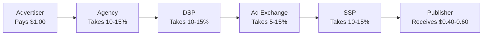
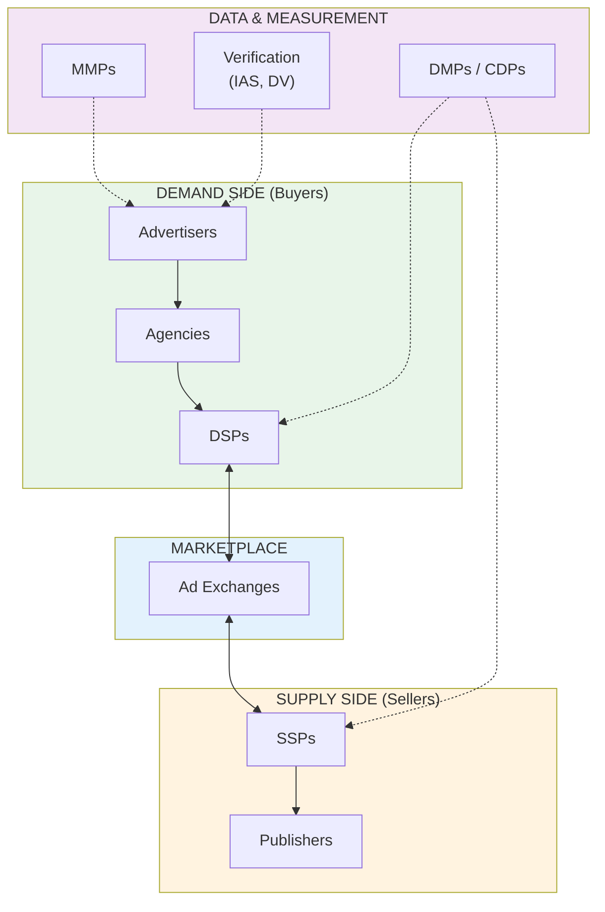

# The Ad Tech Ecosystem

Before we dive into how ad tech works technically, let's meet the people and companies involved. Digital advertising is an ecosystem — a complex web of players who each serve a different role. Understanding who does what (and who pays whom) is the foundation for everything that follows.

<Tip>
**Think of it like a city**: Advertisers are the businesses who want customers. Publishers are the real estate owners with space to rent. Agencies are the real estate agents. And ad tech companies are the infrastructure — the roads, power lines, and payment systems that make it all work. The "walled gardens" (Google, Meta, Amazon) are like mega-malls that own everything from the shops to the parking lots.
</Tip>

---

## The Core Players

### Advertisers (The Buyers)

**Advertisers** are the companies that pay to show ads. They want to reach potential customers and convince them to take an action — download an app, buy a product, sign up for a service.

Every company that runs ads is an advertiser: Nike, your local pizza shop, the indie developer promoting their meditation app, and the Fortune 500 brand launching a global campaign.

| Advertiser Type | Budget Range | How They Buy Ads |
|---|---|---|
| **Small business / indie developer** | $100 - $5,000/month | Self-service platforms (Meta Ads, Google Ads) |
| **Mid-market company** | $5,000 - $100,000/month | Self-service + sometimes an agency |
| **Enterprise / large brand** | $100,000 - $10M+/month | Agencies, trading desks, direct deals |
| **Performance marketer** | Varies | Self-service, data-driven, focused on ROI |

### Publishers (The Sellers)

**Publishers** are the owners of the digital real estate where ads appear. They have audiences and they monetize that attention by selling ad space.

| Publisher Type | Examples | How They Sell Ads |
|---|---|---|
| **Premium publishers** | NYT, ESPN, WSJ, Vogue | Direct sales teams + programmatic |
| **Social platforms** | Facebook, Instagram, TikTok, YouTube | Self-service ad platforms |
| **App developers** | Game studios, utility apps | Ad networks, mediation platforms |
| **Long-tail publishers** | Blogs, niche websites, small apps | Google AdSense, programmatic only |

### Agencies (The Middlemen)

**Agencies** help advertisers plan, create, buy, and manage their advertising. They exist because advertising is complex and many companies do not have in-house expertise.

| Agency Type | What They Do | Examples |
|---|---|---|
| **Creative agency** | Makes the ads (video, images, copy) | Wieden+Kennedy, BBDO, Ogilvy |
| **Media agency** | Plans where ads run and buys the media | GroupM, Omnicom Media, Publicis Media |
| **Performance agency** | Focuses on measurable results (CPI, ROAS) | Tinuiti, MuteSix, Jellyfish |
| **Full-service agency** | Does everything | Large holding companies (WPP, Omnicom, Publicis) |

---

## How Money Flows

This is one of the most important things to understand: **where does the advertiser's dollar actually go?**

### The Ad Tech Tax

A landmark study by PwC and ISBA (a UK advertiser trade body) in 2020 tracked where advertisers' money actually goes in the programmatic supply chain:

| Recipient | Share of $1.00 | What They Do |
|---|---|---|
| **Publisher** | ~$0.51 | Creates the content and serves the ad |
| **DSP fees** | ~$0.10 | Platform the advertiser uses to buy |
| **SSP fees** | ~$0.08 | Platform the publisher uses to sell |
| **Ad exchange fees** | ~$0.05 | Marketplace where the auction happens |
| **Agency/trading desk fees** | ~$0.12 | Manages campaigns for the advertiser |
| **Verification/data fees** | ~$0.03 | Fraud detection, viewability, targeting data |
| **Unknown / unattributable** | ~$0.11 | Could not be traced to any specific party |

<Tip>
**Pro Tip**: The fact that ~15% of ad spend was "unknown/unattributable" is alarming. This is the "ad tech tax" in action — money disappearing into the intermediary chain. This opacity is one of the biggest criticisms of programmatic advertising and a major reason why some brands are bringing ad buying in-house.
</Tip>

---

## The Walled Gardens

The most important concept in modern advertising is the **walled garden** — a platform that controls the entire advertising experience from start to finish: the content users see, the data about those users, the ad buying interface, and the measurement.

### The Big Four

| Walled Garden | Properties | Ad Revenue (2024) | Key Advantage |
|---|---|---|---|
| **Google** | Search, YouTube, Maps, Gmail, Android, Chrome | ~$250B+ | Search intent + massive data |
| **Meta** | Facebook, Instagram, WhatsApp, Messenger | ~$130B+ | Social graph + engagement data |
| **Amazon** | Amazon.com, Twitch, IMDb, Fire TV | ~$50B+ | Purchase data (knows what you actually buy) |
| **Apple** | App Store, Apple Search Ads, Apple News | ~$7B+ (growing fast) | Privacy-first positioning + iOS control |

### Rising Walled Gardens

| Platform | Ad Business | Why They Matter |
|---|---|---|
| **TikTok** | ~$20B+ and growing fast | Captures younger demographics, creative-driven |
| **Microsoft** | LinkedIn, Bing, Xbox | Professional audience (LinkedIn), gaming (Xbox) |
| **Spotify** | Audio ads in music and podcasts | Captive audio audience, mood-based targeting |
| **Netflix** | Ad-supported tier launched 2022 | Premium CTV inventory, brand-safe |
| **Uber** | Ads in the Uber and Uber Eats apps | Location + purchase intent data |
| **Retail Media** (Walmart, Instacart, Target) | Growing fast | Point-of-purchase advertising |

### Why Walled Gardens Dominate

1. **They own the user relationship**: Users are logged in, providing deterministic identity data
2. **They own the content**: Users come for the content (search results, social feed, videos), not the ads
3. **They own the measurement**: They report their own numbers — advertisers have limited ability to independently verify
4. **They own the data**: First-party data from billions of users gives targeting accuracy that open-internet players cannot match
5. **Privacy changes help them**: iOS ATT and cookie deprecation hurt smaller ad tech companies more than walled gardens because walled gardens have logged-in user data

<Tip>
**Pro Tip**: Approximately **70-80% of all digital ad spend** goes to walled gardens (primarily Google and Meta). The remaining 20-30% flows through the "open internet" via programmatic advertising. If you are an advertiser, you will almost certainly start by advertising within walled gardens before venturing into programmatic.
</Tip>

---

## Self-Reporting Networks (SRNs)

SRNs (also called SANs — Self-Attributing Networks) are platforms that perform their own attribution rather than relying on independent measurement. The major SRNs are: **Google, Meta, Apple Search Ads, Amazon, Snap, TikTok, and X (Twitter)**.

Why this matters: When you use an MMP to track your campaigns, SRNs report their own attribution claims to the MMP. The MMP then deduplicates across all sources. But each SRN sees only its own data — creating a built-in conflict of interest where every SRN wants to claim credit.

---

## The Open Internet

Everything outside the walled gardens is the "open internet" — the millions of websites, apps, and digital properties that monetize through programmatic advertising.

| Aspect | Walled Gardens | Open Internet |
|---|---|---|
| **Buying interface** | Platform's own tool (Meta Ads Manager, Google Ads) | DSPs (The Trade Desk, DV360) |
| **Inventory** | Only that platform's properties | Millions of websites and apps |
| **Data** | First-party data from logged-in users | Third-party data + contextual |
| **Measurement** | Self-reported | MMP, third-party verification |
| **Transparency** | Limited | Higher (but complex) |

---

## The Ad Tech Stack: Visual Overview

Here is how all the pieces fit together:

Each of these components is covered in detail in the subsequent pages of this section.

---

## Key Takeaways

1. **Advertisers pay, publishers receive** — but intermediaries take 40-60% of every dollar
2. **Walled gardens dominate** — Google, Meta, and Amazon capture 70-80% of all digital ad spend
3. **Agencies help navigate complexity** — but you can start without one using self-service platforms
4. **The ad tech tax is real** — money is lost to intermediaries and opacity in the supply chain
5. **SRNs self-report** — each platform wants to claim credit, which is why independent measurement (MMPs) matters
6. **Privacy changes favor walled gardens** — they have the most first-party data and are best positioned for a cookieless future

---

**Next up**: [Ad Servers & Ad Networks](/adtech/ad-servers-and-networks) — the foundational infrastructure that started it all, from the first banner ad to the DoubleClick acquisition that gave Google its ad tech empire.
