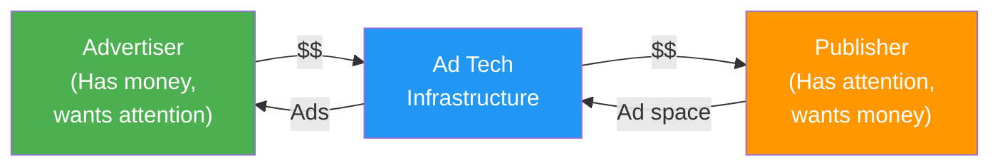
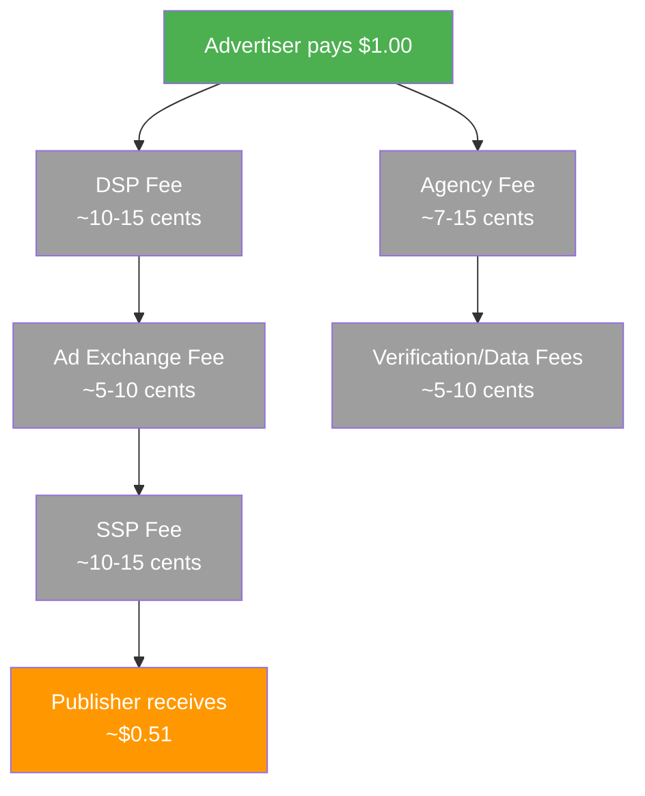
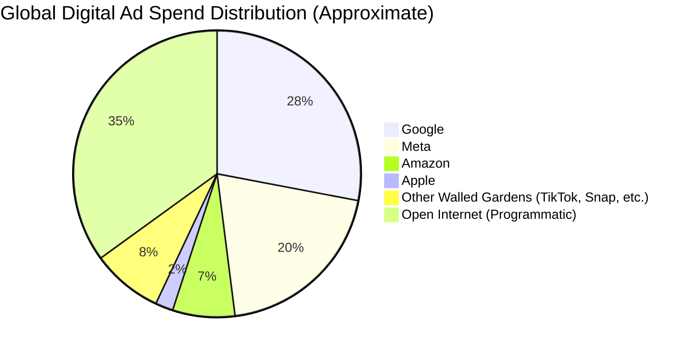
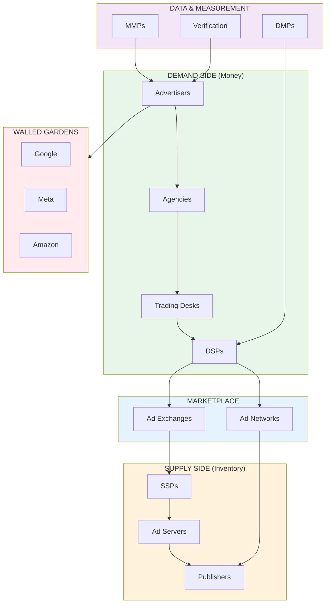

# The Ad Tech Ecosystem

Before we dive into protocols and algorithms, you need to understand **who** the players are and **how money flows** between them. The ad tech ecosystem is like a complex microservices architecture -- many specialized components communicating through well-defined interfaces.

## The Two Fundamental Sides

Every advertising transaction has two sides:

Everything in ad tech exists to connect these two sides more efficiently.

## Advertisers

An **advertiser** is any entity that pays money to show messages to an audience. This ranges from a solo developer promoting their indie app to multinational corporations spending billions annually.

### Types of Advertisers

| Type | Examples | Typical Annual Spend |
|---|---|---|
| Global Enterprise | Procter & Gamble, Samsung, Unilever | $1B - $10B+ |
| Large Brand | Nike, Coca-Cola, Toyota | $100M - $1B |
| Mid-Market | Regional retailers, SaaS companies | $1M - $100M |
| Small Business | Local restaurants, indie developers | $1K - $1M |
| Performance Marketers | App developers, e-commerce, D2C | Varies widely |

<Accordion title="For the curious: The world's biggest advertisers">
The top global advertisers by annual ad spend (approximate):

1. **Procter & Gamble**: ~$8B/year -- yes, the company that makes Tide and Pampers is the world's largest advertiser
2. **Amazon**: ~$7B/year -- spending heavily to promote Prime, AWS, and marketplace sellers
3. **Unilever**: ~$6B/year -- Dove, Axe, Ben & Jerry's
4. **Samsung**: ~$5B/year
5. **Google (Alphabet)**: ~$5B/year -- even Google advertises (mostly on its own platforms)

The interesting thing: most of the world's largest advertisers are **consumer packaged goods (CPG)** companies. They sell low-margin, high-volume products where brand recognition is everything.
</Accordion>

### What Advertisers Want

Advertisers have different objectives, and these map directly to how ad tech systems optimize:

<Tabs>
  <Tab title="Brand Awareness">
    **Goal**: Get as many people as possible to see the ad.
    **Key Metric**: Impressions, Reach, CPM (Cost Per Mille / 1,000 impressions)
    **Analogy**: Like broadcasting a message to a Kafka topic -- you want maximum subscribers to consume it.
  </Tab>
  <Tab title="Consideration">
    **Goal**: Get people to engage with the brand (visit website, watch video).
    **Key Metric**: Clicks, CTR (Click-Through Rate), CPC (Cost Per Click), Video Completion Rate
    **Analogy**: Like optimizing for API engagement -- not just sending requests, but getting meaningful responses.
  </Tab>
  <Tab title="Conversion">
    **Goal**: Get people to take a specific action (purchase, sign up, install app).
    **Key Metric**: Conversions, CPA (Cost Per Acquisition), ROAS (Return on Ad Spend)
    **Analogy**: Like optimizing a funnel -- you track from first touch to final conversion.
  </Tab>
</Tabs>

## Publishers

A **publisher** is any entity that has an audience and can display ads to them. If advertisers are the demand side, publishers are the supply side.

### Types of Publishers

| Type | Examples | How They Monetize |
|---|---|---|
| Premium Publishers | NYTimes.com, ESPN.com, CNN.com | High-CPM direct deals + programmatic |
| Social Platforms | Facebook, Instagram, TikTok, X | Native ad formats within feeds |
| Search Engines | Google Search, Bing | Search ads (intent-based, highest CPMs) |
| App Developers | Game developers, utility apps | In-app ads (banners, interstitials, rewarded video) |
| Content Creators | YouTubers, bloggers, podcasters | Revenue share from platform ads |
| Long-tail Publishers | Millions of small websites and apps | Programmatic-only, lower CPMs |

<Tip>
**Software engineering analogy**: Think of publishers as API providers. They have a valuable resource (user attention), and they expose it through standardized interfaces (ad slots) that advertisers can consume. Premium publishers are like enterprise APIs with SLAs -- they offer guaranteed quality and direct support. Long-tail publishers are like public APIs -- high volume, lower individual quality, accessed through aggregators.
</Tip>

### Publisher Inventory Types

Publishers categorize their ad space (called **inventory**) into tiers:

<Steps>
  <Step title="Premium Inventory">
    The most valuable ad placements -- homepage takeovers, above-the-fold positions on major sites. Typically sold through **direct deals** with advertisers. Think of this as reserved capacity -- pre-allocated and guaranteed.
  </Step>
  <Step title="Remnant Inventory">
    Ad slots that weren't sold through direct deals. This is where **ad networks** and **programmatic** come in -- they fill unsold inventory automatically. Like spot instances in cloud computing -- available but not guaranteed.
  </Step>
  <Step title="Long-tail Inventory">
    Ad space on millions of small websites and apps. Individually low value, but massive in aggregate. Only accessible through **programmatic** channels. Like the long tail of microservices -- each one is small, but together they handle enormous traffic.
  </Step>
</Steps>

## Ad Agencies

Between advertisers and the ad tech stack sits a crucial intermediary: the **advertising agency**.

### What Agencies Do

Agencies act as outsourced marketing departments. Most advertisers -- even huge ones -- don't have the internal expertise to manage all aspects of advertising. Agencies provide:

1. **Creative Services**: Designing the actual ads (images, videos, copy)
2. **Media Planning**: Deciding *where* to place ads (which channels, platforms, audiences)
3. **Media Buying**: Actually purchasing the ad space (negotiating deals, operating DSPs)
4. **Strategy**: Developing the overall advertising approach
5. **Measurement & Analytics**: Tracking results and optimizing campaigns

### The Agency Holding Companies

The agency world is consolidated into a few massive holding companies, each owning dozens of specialized agencies:

| Holding Company | Headquarters | Major Agencies | Revenue |
|---|---|---|---|
| **WPP** | London | GroupM, Ogilvy, Wunderman Thompson | ~$17B |
| **Omnicom** | New York | BBDO, DDB, OMD, Hearts & Science | ~$14B |
| **Publicis Groupe** | Paris | Starcom, Zenith, Sapient, Epsilon | ~$14B |
| **Interpublic Group (IPG)** | New York | McCann, UM, Mediabrands | ~$10B |
| **Dentsu** | Tokyo | Carat, iProspect, Merkle | ~$9B |

<Accordion title="For the curious: Why agencies are structured this way">
You might wonder: why do these holding companies own so many agencies instead of consolidating them?

The answer is **conflict management**. A single agency can't simultaneously serve Coca-Cola and Pepsi -- they'd have access to each other's confidential strategies. By maintaining separate agencies under one corporate umbrella, holding companies can serve competing clients through different subsidiaries while sharing back-office operations (finance, HR, technology platforms).

This is similar to how a cloud provider might run separate dedicated clusters for competing enterprise clients -- shared infrastructure, strict isolation at the application layer.
</Accordion>

### The Agency Fee Structure

Agencies typically charge advertisers through one of these models:

- **Commission**: Historically 15% of media spend (declining)
- **Fee-based**: Fixed retainer or hourly rates
- **Performance-based**: Tied to campaign outcomes (growing trend)
- **Hybrid**: Combination of the above

## How Money Flows Through the Ecosystem

This is where it gets interesting -- and controversial. Let's trace a dollar from advertiser to publisher.

### The PwC/ISBA "Programmatic Supply Chain Transparency" Study

In 2020, the **ISBA** (Incorporated Society of British Advertisers) commissioned **PwC** to trace how money flows through the programmatic advertising supply chain. The findings were sobering:

<Warning>
**For every $1.00 an advertiser spends**, only about **$0.51** reaches the publisher. The other $0.49 is consumed by intermediaries -- and **$0.15** (15%) couldn't even be attributed to any specific entity. It simply vanished into the supply chain as an "unknown delta."**
</Warning>

| Component | Share of Advertiser Dollar |
|---|---|
| Publisher (content creator) | ~51% |
| DSP fees | ~10% |
| SSP fees | ~8% |
| Ad Exchange fees | ~5% |
| Agency/trading desk fees | ~7% |
| Data & verification fees | ~4% |
| **Unknown / unattributable** | **~15%** |

<Tip>
**Software engineering analogy**: Imagine if 15% of your API requests disappeared without any trace in your observability stack. No logs, no metrics, no traces. That's essentially what's happening in the programmatic supply chain. It's as if someone built a complex microservices architecture without proper distributed tracing -- and significant value leaks through the cracks.
</Tip>

This study was a wake-up call for the industry and drove significant efforts toward **supply path optimization (SPO)** -- essentially reducing the number of intermediaries between advertiser and publisher.

## Walled Gardens

The biggest players in ad tech don't operate in the open ecosystem at all. They've built **walled gardens** -- closed platforms where they control the entire advertising experience.

### What Is a Walled Garden?

A walled garden is a platform that:

1. **Owns the user relationship** (login, identity, behavior data)
2. **Owns the ad inventory** (the actual surfaces where ads appear)
3. **Owns the ad buying tools** (you must use their interface/API to buy ads)
4. **Controls measurement** (they tell you how your ads performed -- trust them!)

<Tabs>
  <Tab title="Google">
    **Properties**: Google Search, YouTube, Gmail, Google Maps, Google Play, Chrome, Android
    **Ad Platform**: Google Ads (formerly AdWords + DoubleClick)
    **Revenue**: ~$225B/year in ad revenue (2023)
    **Superpower**: **Intent data**. When someone searches "buy running shoes," Google knows they want to buy running shoes. This makes search ads the highest-ROI advertising format.
    **Also operates**: The largest open ad tech stack (DV360, Google Ad Manager, AdMob, AdSense)
  </Tab>
  <Tab title="Meta">
    **Properties**: Facebook, Instagram, WhatsApp, Messenger, Threads
    **Ad Platform**: Meta Ads (formerly Facebook Ads)
    **Revenue**: ~$130B/year in ad revenue (2023)
    **Superpower**: **Social graph + engagement data**. Meta knows your friends, interests, demographics, and behavior patterns. This enables remarkably precise audience targeting.
    **Vulnerability**: Heavily impacted by Apple's iOS ATT (App Tracking Transparency) -- lost ~$10B in 2022 alone.
  </Tab>
  <Tab title="Amazon">
    **Properties**: Amazon.com, Prime Video, Twitch, Alexa, AWS
    **Ad Platform**: Amazon Ads
    **Revenue**: ~$47B/year in ad revenue (2023)
    **Superpower**: **Purchase data**. Amazon knows what you actually *buy*, not just what you click on. This makes their targeting and attribution more concrete than any other platform.
    **Growth**: The fastest-growing major ad platform, with ad revenue growing 20%+ year-over-year.
  </Tab>
  <Tab title="Apple">
    **Properties**: App Store, Apple News, Apple Maps, Apple TV+
    **Ad Platform**: Apple Search Ads
    **Revenue**: ~$7B/year in ad revenue (estimated, Apple doesn't break this out)
    **Superpower**: **Device-level control + privacy positioning**. Apple controls the hardware, OS, and app distribution. With ATT, they've kneecapped competitors' tracking while building their own ad business.
    **Controversy**: Many in the industry see Apple's privacy moves as strategically self-serving -- weakening competitors while growing their own ad platform.
  </Tab>
</Tabs>

### Walled Gardens vs. The Open Internet

The open internet -- all the ad tech infrastructure we'll discuss in the following pages -- accounts for roughly 35% of digital ad spend. The walled gardens capture the rest. This concentration is a source of ongoing tension, regulation, and antitrust action.

## Self-Reporting Networks (SRNs)

Also called **Self-Attributing Networks (SANs)**, these are platforms that:

1. **Run ads** on their own properties
2. **Measure results** of those ads themselves
3. **Report performance** back to advertisers using their own data

<Warning>
The fundamental conflict of interest is obvious: the platform selling you ads is also the one grading their own homework. It's like if AWS told you how many requests your competitor's service handled -- you'd want independent verification.
</Warning>

### Major SRNs

The most significant SRNs include:

- **Google** (Google Ads, YouTube)
- **Meta** (Facebook, Instagram)
- **Apple** (Apple Search Ads)
- **Amazon** (Amazon Ads)
- **Snap** (Snapchat Ads)
- **TikTok** (TikTok For Business)
- **X/Twitter**
- **Pinterest**

### How SRNs Work with MMPs

SRNs don't share raw user-level data with external measurement platforms. Instead, they operate through a **claim-based system**:

<Steps>
  <Step title="User Sees/Clicks Ad">
    The SRN records the impression or click internally using its own user identity.
  </Step>
  <Step title="Conversion Happens">
    The advertiser's MMP (Mobile Measurement Partner) detects a conversion (app install, purchase, etc.).
  </Step>
  <Step title="MMP Queries SRNs">
    The MMP sends the conversion event to all active SRNs asking: "Did you show an ad to this user?"
  </Step>
  <Step title="SRNs Respond with Claims">
    Each SRN that believes it contributed to the conversion responds with a claim, including timestamp data.
  </Step>
  <Step title="MMP Deduplicates">
    The MMP applies attribution logic (typically last-touch) to determine which SRN gets credit.
  </Step>
</Steps>

<Accordion title="For the curious: Why SRN partnerships are limited">
Not every measurement company can integrate with every SRN. Google and Meta, in particular, maintain **limited partnership programs** -- only about 6 MMPs have certified integrations with both Google and Meta. This creates a significant competitive moat for established MMPs.

To become a certified partner, an MMP must:
- Meet strict technical requirements (privacy, security, data handling)
- Have significant advertiser scale (the SRNs don't bother with small players)
- Agree to the SRN's terms (which often favor the SRN)
- Submit to regular audits

This is why the MMP market has consolidated around a handful of players -- the SRN partnerships are an enormous barrier to entry. We'll cover this in detail in the [Attribution & Measurement](/adtech/attribution-deep-dive) section.
</Accordion>

## The Complete Ecosystem Map

Here's how all the pieces fit together:

<Note>
Don't worry if this looks overwhelming. We'll break down each component in the following pages. By the time you finish this section, you'll be able to redraw this diagram from memory.
</Note>

## Key Takeaways

1. **Two-sided market**: Advertisers have money, publishers have attention. Everything else is infrastructure connecting them.
2. **The "ad tech tax"**: Nearly half of every advertising dollar goes to intermediaries, not content creators.
3. **Walled gardens dominate**: Google, Meta, Amazon, and Apple control ~57% of digital ad spend and don't play by the same rules as the open ecosystem.
4. **Self-reporting conflict**: The biggest platforms grade their own homework -- independent measurement is critical but limited.
5. **Consolidation is real**: From agencies to ad tech to measurement, the ecosystem is dominated by a handful of major players.

---

**Next up**: [Ad Servers & Ad Networks](/adtech/ad-servers-and-networks) -- the foundational infrastructure that started it all.
