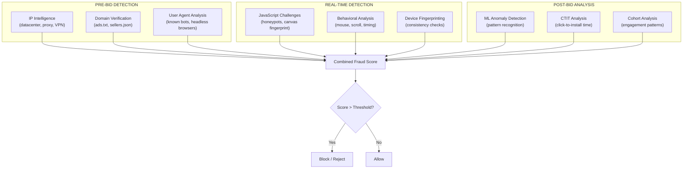
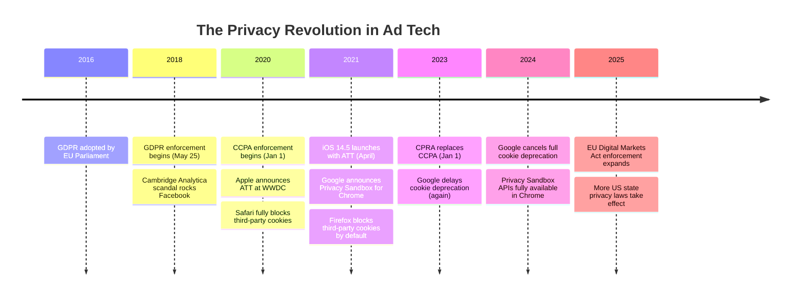
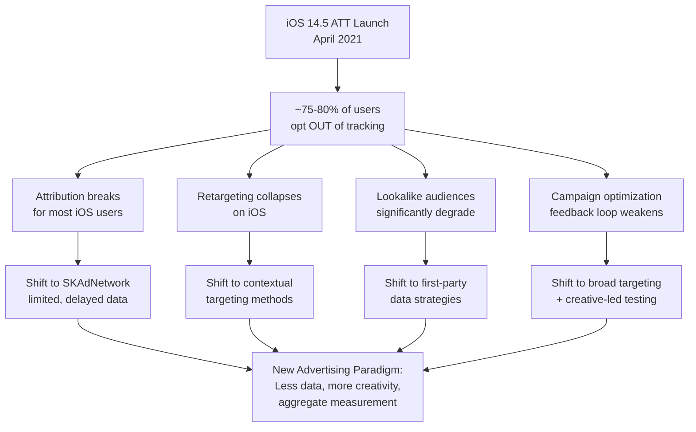
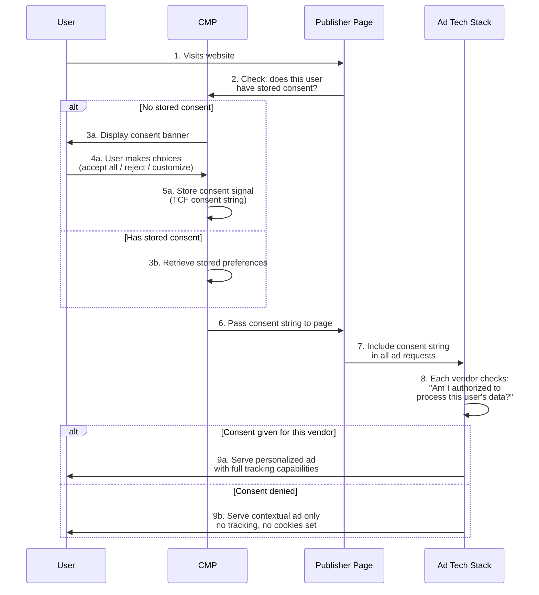

# Ad Fraud & Privacy

Ad tech has a double problem. On one side, fraudsters siphon billions of dollars from advertisers through fake clicks, fake installs, and fake traffic. On the other side, the very tracking mechanisms used to fight fraud and measure ads are being dismantled by privacy regulations.

Welcome to the dark side of ad tech -- where the bad guys are sophisticated, the stakes are enormous, and the rules are changing faster than anyone can keep up.

<Tip>
**Think of it this way**: Ad fraud is the cybersecurity of advertising. Just as security engineers deal with an ever-evolving threat landscape -- where attackers adapt to every defense -- ad fraud fighters face adversaries who constantly develop new techniques to bypass detection. And just like cybersecurity, the cost of doing nothing is catastrophic.
</Tip>

---

## Part 1: Ad Fraud

### The Scale of the Problem

Ad fraud is not a niche issue. It is one of the largest categories of organized criminal activity in the world.

| Metric | Value |
|---|---|
| **Global ad fraud losses (2024)** | Approximately $84 billion |
| **Projected losses (2028)** | Approximately $170 billion |
| **% of digital ad spend lost to fraud** | 15-30% depending on channel |
| **Mobile app install fraud rate** | 10-25% of installs |
| **Display ad fraud rate** | 5-20% of impressions |
| **Video ad fraud rate** | Up to 25% of views |

To put this in perspective: ad fraud generates more revenue than many countries' GDP. It is incredibly lucrative, hard to prosecute (often cross-border), and relatively low-risk for criminals compared to other forms of organized crime.

<Note>
**A real-world wake-up call**: In 2017, Uber's former head of performance marketing discovered that up to two-thirds of Uber's $100M+ annual mobile ad budget was being wasted on fraudulent activity. When they cut the suspicious spend, install volume barely changed. The "performance" those networks claimed to deliver was almost entirely fraud -- stealing credit for organic installs that would have happened anyway.
</Note>

---

### Types of Ad Fraud

Let us walk through each major fraud type, from the simple to the sophisticated.

<Tabs>
  <Tab title="Click Fraud">
    **What it is**: Generating fake clicks on ads to drain an advertiser's budget or inflate a publisher's revenue.

    **How it works**:
    - **Manual click farms**: Rooms of low-wage workers clicking ads all day on real devices
    - **Automated bots**: Software that mimics human clicking behavior using scripted browsers
    - **Competitor fraud**: A business's competitor clicks their ads to waste their CPC budget (especially common in search advertising for competitive keywords)

    **Who profits**: Publishers (more click revenue), competitors (drain rival's budget), fraudsters (arbitrage between cheap traffic sources and CPC payouts)

    ```mermaid
    graph LR
        A[Fraudster] --> B[Creates bot network<br/>or click farm]
        B --> C[Clicks on ads<br/>on their own sites]
        C --> D[Ad network pays<br/>publisher per click]
        D --> E[Fraudster collects<br/>publisher revenue]
    ```

    **Real-world example**: In 2018, Google removed 2.3 billion bad ads and terminated nearly 1 million advertiser accounts for policy violations, many related to click fraud schemes.
  </Tab>
  <Tab title="Impression Fraud">
    **What it is**: Generating fake ad views that no human ever sees.

    **Techniques**:
    - **Ad stacking**: Placing multiple ads on top of each other in the same ad slot. Only the top ad is visible, but all record an impression and all networks get billed
    - **Pixel stuffing**: Rendering ads in a 1x1 pixel iframe. Technically "loaded" but completely invisible to any human eye
    - **Hidden ads**: Ads placed behind page content, in invisible iframes, or positioned off-screen
    - **Auto-refresh**: Automatically refreshing ads at high frequency (every few seconds) to rack up impressions while the user stares at the same page

    **Ad Stacking Example:**

    ```mermaid
    graph TD
        Slot["Ad Slot on Web Page"] --- L1["Ad 1 — TOP (visible to user)"]
        L1 --- L2["Ad 2 — Hidden layer (invisible)"]
        L2 --- L3["Ad 3 — Hidden layer (invisible)"]
        L3 --- L4["Ad 4 — Hidden layer (invisible)"]

        style L1 fill:#e8f5e9,stroke:#4caf50,stroke-width:2px
        style L2 fill:#ffcdd2,stroke:#e57373
        style L3 fill:#ffcdd2,stroke:#e57373
        style L4 fill:#ffcdd2,stroke:#e57373
    ```

    All 4 ads report impressions and bill advertisers. Only 1 was actually seen by a human.
  </Tab>
  <Tab title="Install Fraud (Mobile)">
    **What it is**: Generating fake app installs to steal CPI (cost-per-install) payouts.

    **This is the big one for mobile advertisers.** Types include:

    1. **Device farms**: Warehouses full of real devices that repeatedly install apps, interact briefly, then reset and repeat
    2. **Emulator farms**: Virtual devices running on servers that simulate real installs at massive scale
    3. **SDK spoofing**: Intercepting and replicating SDK communication protocols to fake installs without any real device involved

    ```mermaid
    sequenceDiagram
        participant F as Fraudster
        participant MMP as MMP SDK Protocol
        participant AD as Ad Network

        F->>F: 1. Reverse-engineer MMP SDK<br/>network protocol
        F->>MMP: 2. Send fake "install" signal<br/>(spoofed device ID, forged SDK hash)
        MMP->>MMP: 3. Records as legitimate install
        MMP->>AD: 4. Postback: "install attributed"
        AD->>F: 5. CPI payout ($1-$20 per install)
        Note over F: No real user, no real device,<br/>no real install ever happened
    ```

    SDK spoofing is particularly dangerous because it does not require any physical infrastructure -- just knowledge of the SDK protocol and a server to send forged requests.
  </Tab>
</Tabs>

### Click Injection and Click Spamming

These two techniques deserve special attention because they are among the most sophisticated and financially damaging mobile fraud types.

<Tabs>
  <Tab title="Click Injection">
    **The concept**: A malicious app on a user's device detects when a *different* app is being installed, then fires a fake click just before the install completes -- stealing attribution credit for what was actually an organic install.

    **How it works on Android**:

    <Steps>
      <Step title="Fraudster publishes a trojan app">
        They create a seemingly innocent app (flashlight, wallpaper, battery optimizer) and publish it to the Play Store.
      </Step>
      <Step title="App listens for install broadcasts">
        On Android, the system broadcasts when new apps are being downloaded. The malicious app listens for these broadcasts using Android APIs.
      </Step>
      <Step title="Fake click fires milliseconds before install">
        When the malicious app detects that "Cool Game" is being downloaded, it immediately fires a click to the MMP tracking server for Cool Game's ad campaign.
      </Step>
      <Step title="MMP attributes the organic install to the fake click">
        The click arrives milliseconds before the install completes. Since last-click wins, the MMP attributes this organic install to the fraudster's click.
      </Step>
      <Step title="Fraudster collects CPI payout">
        The ad network pays the CPI fee for what was actually an organic install. The user was going to download Cool Game regardless -- the fraudster just injected a click to steal credit.
      </Step>
    </Steps>

    ```mermaid
    sequenceDiagram
        participant U as User
        participant MAPP as Malicious App<br/>(on user's device)
        participant STORE as Play Store
        participant MMP as MMP

        U->>STORE: 1. Decides to download<br/>"Cool Game" (organic)
        STORE->>MAPP: 2. Broadcast: "Cool Game"<br/>is being installed
        MAPP->>MMP: 3. Fires fake click<br/>(milliseconds before install)
        STORE->>U: 4. App installed
        U->>MMP: 5. First app open triggers SDK
        MMP->>MMP: 6. Matches install to<br/>recent click from step 3
        Note over MMP: Organic install stolen!<br/>Fraudster gets CPI payout
    ```

    **Detection**: Click-to-install time (CTIT) analysis. Legitimate clicks have a CTIT of 30 seconds to hours. Click injection shows CTIT of 0-5 seconds -- suspiciously fast because the click was fired *after* the download started.
  </Tab>
  <Tab title="Click Spamming (Click Flooding)">
    **The concept**: Send thousands of fake clicks for random device IDs. When any of those users later install the app organically, the fraudster's click is sitting in the MMP's database and "wins" attribution.

    **How it works**:
    1. Fraudster controls a mobile website or app with real traffic
    2. Without the user knowing, the app or site fires background clicks to dozens of MMP tracking links for popular apps
    3. Users never see or intend these clicks -- they happen silently in the background
    4. When 1% of those users later install one of those apps organically, the fraudster's click is matched

    It is a pure numbers game: send 1 million fake clicks, capture 1,000 organic installs at $2 CPI = $2,000 in stolen revenue. Scale this across hundreds of apps and the numbers become significant.

    **Detection**: Click-to-install time distribution analysis. Legitimate campaigns have a natural CTIT distribution (peak at 30 min to 2 hours). Click spamming shows a flat, uniform distribution because the clicks have no actual relationship to the install decision.

    ```
    Legitimate CTIT Distribution:
    ||||||||......................  0-30 min  (some)
    ||||||||||||||||||............  30-60 min (peak)
    ||||||||||||..................  1-2 hours (declining)
    ||||..........................  2-6 hours (low)
    ||............................  6+ hours  (very low)

    Click Spamming CTIT Distribution:
    ||||..........................  0-30 min  (uniform)
    ||||..........................  30-60 min (uniform)
    ||||..........................  1-2 hours (uniform)
    ||||..........................  2-6 hours (uniform)
    ||||..........................  6+ hours  (uniform!)
    ```

    The flat distribution is the giveaway -- real user behavior creates a curve, not a flat line.
  </Tab>
</Tabs>

<Tip>
**Pro Tip**: The easiest way to spot fraud as a beginner is to look at your downstream metrics. If a traffic source drives lots of installs but zero revenue, zero Day 7 retention, or zero in-app actions, something is wrong. Real users do things after installing. Fraudulent "users" do not. Always correlate install volume with post-install quality metrics.
</Tip>

### More Fraud Techniques

<Accordion title="SDK Spoofing">
**What**: The most technically sophisticated mobile fraud. Fraudsters reverse-engineer the communication protocol between an MMP's SDK and its servers, then send forged install and event signals without any real device or user.

**How it works**:
1. Fraudster decompiles the MMP SDK and studies its network traffic
2. They identify the API endpoints, request formats, and any authentication tokens
3. They build a server that generates fake but properly formatted install signals
4. These signals include realistic-looking device IDs, device models, and OS versions
5. The MMP's servers receive what appears to be a legitimate install

**Why it is devastating**: No real device is involved. Device farm detection is useless because there is no physical device to fingerprint. The only defense is SDK-level cryptographic verification -- which is why modern MMPs use SDK signature verification to authenticate that signals actually originate from a real SDK running on a real device.
</Accordion>

<Accordion title="Device Farms">
**What**: Physical locations (often in Southeast Asia, Eastern Europe, or South America) with racks of hundreds or thousands of real mobile devices. Workers or automated systems install apps, complete basic actions (to pass quality checks), then factory-reset devices and repeat.

**Why real devices matter**: They bypass many fraud detection systems because the device signals are genuine -- real hardware IDs, real touchscreen interactions, real IP addresses, real GPS coordinates.

**Scale**: A single device farm can generate 10,000-50,000 fake installs per day across hundreds of apps.

**Detection clues**:
- Clusters of installs from the same IP range or geographic area
- Device IDs that appear across many unrelated apps in short timeframes
- Abnormal session patterns: install, complete minimum required actions, abandon. Never return.
- Near-zero lifetime value (LTV) -- farm users never make real purchases
- Device IDs that get "born" and "die" frequently (factory resets)
</Accordion>

<Accordion title="Bot Traffic">
**What**: Automated software that simulates human web browsing and ad interactions at scale.

**Sophistication levels**:
1. **Simple bots**: Scripts that send HTTP requests. Easy to detect via missing JavaScript execution, no cookies, and browser fingerprint anomalies
2. **Headless browsers**: Real browsers (Puppeteer, Playwright, Selenium) running without a GUI. Harder to detect because they execute JavaScript properly and have real browser fingerprints
3. **Sophisticated bots**: Use residential proxies to appear as home users, randomized behavior patterns to mimic humans, and even ML-generated mouse movements and scroll patterns. Can pass many bot detection tests

**The Methbot case study**: In 2016, the FBI uncovered "Methbot," a Russian-operated bot network that generated 300 million fake video ad views per day, stealing $3-5 million daily from advertisers. The operation used 571,000 spoofed IP addresses registered to legitimate US ISPs and thousands of domains impersonating premium publishers like ESPN and Vogue. By the time it was shut down, it had stolen over $36 million.

**The 3ve case**: An even larger botnet discovered in 2018, infecting 1.7 million computers. It generated 12 billion fake ad requests daily across 10,000 spoofed domains. The DOJ charged 8 individuals, and the operation was estimated to have stolen over $29 million.
</Accordion>

<Accordion title="Domain Spoofing">
**What**: A low-quality publisher pretends to be a premium publisher in programmatic bid requests.

**How**: A fraudulent site (cheap-clickbait-site.com) sends bid requests to SSPs claiming to be `nytimes.com`. DSPs bid high prices thinking they are buying premium NYT inventory. The ad actually appears on the junk site, but the advertiser pays premium prices.

Before countermeasures like ads.txt, there was essentially no way to verify the claim:

```json
{
  "site": {
    "domain": "nytimes.com",
    "page": "https://nytimes.com/politics/article-123"
  }
}
```

The DSP has no way to know this request actually came from cheap-clickbait-site.com -- the domain field is just a string that anyone can set to anything.

**Impact**: Premium publishers lose revenue (their name is being used to sell cheap inventory), and advertisers pay premium prices for garbage inventory where their brand appears next to low-quality content.
</Accordion>

<Accordion title="Ad Stacking and Pixel Stuffing">
**Ad Stacking**: Multiple ads layered on top of each other in a single ad slot using CSS `z-index` or absolute positioning. The user sees only the top ad, but all ads report impressions and all ad networks get billed. A single ad slot might serve 5-10 stacked ads, multiplying the publisher's impression revenue by 5-10x.

**Pixel Stuffing**: An ad is loaded inside a 1x1 pixel iframe -- technically "rendered" (the pixels exist) but completely invisible to any human. The iframe is so small that not even a single character of the ad is discernible. The advertiser pays for an "impression" that physically could not be seen.

Both exploit the gap between "ad was technically served" and "ad was actually seen by a human." Viewability measurement (DoubleVerify, IAS, MOAT) was created specifically to combat these techniques by verifying that ads meet minimum visibility thresholds.
</Accordion>

---

### Fraud Detection Methods

<Steps>
  <Step title="IP Analysis">
    Identify suspicious patterns in IP addresses:
    - **Data center IPs**: Real users browse from residential or mobile IPs, not AWS or DigitalOcean data centers
    - **IP clustering**: Too many installs from the same IP or narrow IP range suggests a device farm
    - **VPN/Proxy detection**: Fraudsters use VPNs to appear in target geos. Specialized services can identify known VPN exit nodes, Tor exit nodes, and proxy servers
    - **Geographic anomalies**: Click IP in Nigeria but device timezone set to US Eastern and language set to English (US)
    - **IP reputation databases**: Services like MaxMind, Digital Element, and IP2Location maintain databases of suspicious IPs
  </Step>
  <Step title="Click-to-Install Time (CTIT) Analysis">
    The time between ad click and app install follows predictable distributions for legitimate traffic:

    - **Normal CTIT**: 10 seconds to several hours (user clicks ad, goes to store, reads reviews, decides, downloads, opens)
    - **Click injection signature**: 0-5 seconds (impossibly fast -- the click was fired after the download started)
    - **Click spamming signature**: Flat distribution across all time ranges (no correlation between click and install decision)

    CTIT analysis is one of the single most effective fraud detection signals for mobile because it is extremely difficult for fraudsters to fake natural timing distributions.
  </Step>
  <Step title="Device Fingerprint Analysis">
    Look for anomalies in device characteristics:
    - **Emulators**: Missing hardware sensors (accelerometer, gyroscope, barometer), generic device names, root access enabled, debugger attached
    - **Reset devices**: Same hardware fingerprint appearing with fresh advertising IDs (device farm cycling through GAID/IDFA resets)
    - **Impossible combinations**: Device claims to be iPhone 15 but reports iOS 14 (which that hardware cannot run), or claims 4GB RAM on a device model that only has 2GB
    - **SDK signature verification**: Cryptographic verification that the install signal actually originated from a real SDK on a real device, not from a server sending forged requests
  </Step>
  <Step title="Behavioral Analysis">
    Real users behave differently from bots and farm workers:
    - **Session patterns**: Legitimate users have varied session lengths, natural return patterns, and diverse navigation paths. Fraudulent installs show uniform behavior (install, do 3 required actions, abandon forever)
    - **In-app engagement**: Real users scroll at varying speeds, pause to read, tap different UI elements. Bots navigate linearly with robotic precision
    - **Retention curves**: Fraudulent installs show near-zero Day 1 retention. Real users typically have 20-40% Day 1 retention
    - **Revenue correlation**: If a traffic source drives 1,000 installs but generates $0 in lifetime revenue, that is a massive red flag
    - **Funnel completion rates**: Fraudulent traffic often shows either 0% funnel completion (bots that do not engage) or suspiciously uniform completion rates
  </Step>
</Steps>



---

### Fraud Prevention Tools and Industry Standards

The ad industry has developed several collaborative standards and tools to fight fraud:

<Tabs>
  <Tab title="ads.txt / app-ads.txt">
    **What**: A public text file hosted on a publisher's domain that lists all authorized sellers of their ad inventory.

    **How it works**:
    1. `nytimes.com` publishes a file at `nytimes.com/ads.txt`
    2. The file lists every SSP/exchange authorized to sell NYT inventory
    3. DSPs check this file before bidding -- if the seller in the bid request is not listed, the request is likely spoofed

    ```
    # Example ads.txt file for nytimes.com
    google.com, pub-1234567890, DIRECT, f08c47fec0942fa0
    openx.com, 98765, DIRECT, a698e2ec2723a0e7
    appnexus.com, 4567, RESELLER, f5ab79cb980f11d1
    rubiconproject.com, 8910, RESELLER, 0bfd66d529a55807
    ```

    **Format**: `[exchange domain], [seller account ID], [relationship], [TAG ID]`

    - **DIRECT**: The publisher has a direct business relationship with this exchange
    - **RESELLER**: This entity is authorized to resell the publisher's inventory through the exchange

    **`app-ads.txt`** is the mobile equivalent. Since apps do not have a web domain, the file is hosted on the developer's website as listed in the app store entry.

    **Impact**: ads.txt reduced domain spoofing by an estimated 10-15% across the industry after widespread adoption. Simple but remarkably effective.
  </Tab>
  <Tab title="sellers.json">
    **What**: The complement to ads.txt. While ads.txt lists who CAN sell a publisher's inventory, `sellers.json` lists all entities that an exchange DOES business with.

    Published by SSPs/exchanges at their domain root:

    ```json
    {
      "sellers": [
        {
          "seller_id": "pub-1234567890",
          "name": "The New York Times",
          "domain": "nytimes.com",
          "seller_type": "PUBLISHER"
        },
        {
          "seller_id": "reseller-abc",
          "name": "Trusted Ad Network",
          "domain": "trustednetwork.com",
          "seller_type": "INTERMEDIARY"
        }
      ]
    }
    ```

    **Together**: ads.txt (publisher-side) + sellers.json (exchange-side) create a verifiable chain of authorized sellers. Think of it as a certificate chain in TLS -- each link can be verified back to the authoritative source (the publisher's domain).

    **Supply Path Optimization (SPO)**: DSPs use ads.txt + sellers.json data to find the shortest, most transparent path from publisher to buyer, reducing fees paid to unnecessary intermediaries.
  </Tab>
  <Tab title="TAG Certification and IVT Filters">
    **IVT (Invalid Traffic)** classification by the MRC (Media Rating Council):

    | Category | Description | Detection Difficulty | Examples |
    |---|---|---|---|
    | **GIVT** (General IVT) | Known non-human traffic | Easy -- rule-based filters | Known bots (Googlebot), data center IPs, pre-fetch/pre-render |
    | **SIVT** (Sophisticated IVT) | Harder-to-detect fraud | Hard -- requires ML/advanced analysis | Hijacked devices, adware, sophisticated bots, manipulated behavior |

    **TAG (Trustworthy Accountability Group)** certification is an industry seal of approval. The "Certified Against Fraud" seal means a company has:
    - Implemented IVT detection according to MRC guidelines
    - Passed an independent audit
    - Committed to ongoing anti-fraud practices

    Major brands increasingly require TAG certification from their ad partners as a minimum standard.

    **Verification vendors** (the fraud-fighting specialists):
    - **DoubleVerify**: Verification, viewability, brand safety, fraud detection
    - **IAS (Integral Ad Science)**: Similar scope, strong in programmatic
    - **MOAT (Oracle)**: Viewability and attention measurement
    - **HUMAN (formerly White Ops)**: Specialized in bot detection
    - **Pixalate**: Focused on programmatic and CTV fraud
  </Tab>
</Tabs>

### Estimated Fraud Costs by Channel

| Channel | Estimated Fraud Rate | Primary Fraud Types |
|---|---|---|
| **Programmatic Display** | 10-20% | Bots, ad stacking, pixel stuffing, domain spoofing |
| **Programmatic Video** | 15-25% | Bots (video CPMs are high, so fraud is more profitable) |
| **Mobile App Install** | 10-25% | Click injection, click spamming, SDK spoofing, device farms |
| **CTV/OTT** | 15-20% | Server-side ad insertion spoofing, bot traffic |
| **Search (CPC)** | 5-15% | Competitor click fraud, click bots |
| **Social Media** | 2-8% | Lower fraud due to walled garden controls |
| **Direct/Premium** | 1-5% | Lowest fraud due to direct publisher relationships |

<Note>
**The fraud arms race never ends.** Every detection method spawns a new evasion technique. When the industry deployed CTIT analysis, fraudsters adjusted their timing to mimic natural distributions. When IP blacklists emerged, they switched to residential proxies. When SDK signature verification launched, they found ways to extract signatures from real devices. The key is layered defense -- no single technique catches everything, but combining multiple signals creates a much stronger barrier.
</Note>

---

## Part 2: Privacy

The privacy revolution in ad tech is not just about compliance -- it is fundamentally reshaping how digital advertising works. The era of freely tracking users across the internet is ending, and what replaces it will define the next decade of the industry.

### The Privacy Timeline



---

### GDPR: The Law That Changed Everything

The **General Data Protection Regulation** (EU, effective May 25, 2018) set the global standard for data privacy and forced the entire ad tech industry to rethink its practices from the ground up.

<Accordion title="GDPR's core requirements in detail">
1. **Lawful basis for processing**: You must have a legal reason to process personal data. For ad tech, the two relevant bases are:
   - **Consent**: The user explicitly agreed to data processing (opt-in)
   - **Legitimate interest**: You have a business reason that does not override the user's rights (harder to argue for advertising)

2. **Purpose limitation**: Data collected for one purpose (e.g., serving ads) cannot be repurposed (e.g., sold to a data broker) without additional consent

3. **Data minimization**: Collect only what you actually need. If you can serve an ad with 5 data points, do not collect 50

4. **Storage limitation**: Do not keep data longer than necessary. Set and enforce retention policies

5. **Right to access**: Users can request a copy of ALL data you hold about them -- and you must provide it within 30 days

6. **Right to erasure ("Right to be forgotten")**: Users can request deletion of their data. You must comply and propagate the deletion to any third parties you shared data with

7. **Right to portability**: Users can take their data in a machine-readable format and give it to a competitor

8. **Data Protection Officer (DPO)**: Required for organizations processing personal data at scale

9. **Breach notification**: You must notify the supervisory authority within 72 hours of discovering a data breach

10. **Privacy by design and by default**: Privacy considerations must be built into systems from the start, not bolted on afterward
</Accordion>

**What GDPR means for ad tech specifically**:

<CardGroup cols={2}>
  <Card title="Consent must be freely given" icon="check">
    No more pre-checked boxes. No more "by using this site you agree to everything." Consent must be an affirmative, informed, specific action. Users must be able to withdraw consent as easily as they gave it. "Accept all cookies" cannot be a big green button while "reject" is hidden in settings.
  </Card>
  <Card title="Cookie banners everywhere" icon="cookie-bite">
    The infamous cookie consent popups you see on every European website exist because GDPR (combined with the ePrivacy Directive) requires explicit consent before setting non-essential tracking cookies. Love them or hate them, they are legally required.
  </Card>
  <Card title="Fines are massive and real" icon="money-bill">
    Up to **4% of global annual revenue** or 20 million euros (whichever is higher). These are not theoretical: Meta was fined 1.2 billion euros (2023) for transferring EU data to the US. Amazon was fined 746 million euros (2021). The enforcement is real and growing.
  </Card>
  <Card title="Extraterritorial scope" icon="globe">
    GDPR applies to any company processing EU residents' data, regardless of where the company is based. A US ad tech startup targeting EU users must comply fully. There is no hiding behind a different jurisdiction.
  </Card>
</CardGroup>

<Tip>
**Pro Tip**: Even if you are not targeting EU users today, build your systems with GDPR principles from the start. More and more countries and US states are adopting GDPR-like regulations. What is best practice today will be a legal requirement tomorrow. Privacy by design is not just good ethics -- it is good engineering.
</Tip>

### CCPA / CPRA (California)

The **California Consumer Privacy Act** (effective January 2020) and its successor, the **California Privacy Rights Act** (effective January 2023), are the most significant US privacy laws for ad tech.

| Feature | GDPR | CCPA/CPRA |
|---|---|---|
| **Scope** | EU/EEA residents | California residents |
| **Consent model** | **Opt-in** (consent required before tracking) | **Opt-out** (tracking allowed unless user opts out) |
| **"Do Not Sell" right** | Implicit in consent model | Explicit right + required website link |
| **Private right of action** | Limited | Yes (for data breaches) |
| **Enforcement body** | Data Protection Authorities (per country) | California Privacy Protection Agency + Attorney General |
| **Maximum fines** | Up to 4% of global revenue | $2,500/violation, $7,500/intentional violation |
| **Sensitive data** | Special categories with heightened protection | Defined separately with opt-in required |

<Note>
**The US patchwork problem**: Unlike the EU (one regulation for all member states), the US has no federal privacy law. Instead, states are passing their own: California (CCPA/CPRA), Virginia (VCDPA), Colorado (CPA), Connecticut (CTDPA), Utah (UCPA), Texas (TDPSA), Oregon, Montana, and more. Each has slightly different requirements. For ad tech companies operating nationally, this means complying with a growing patchwork of different rules -- a compliance nightmare that is increasing the industry's push for a single federal privacy standard.
</Note>

### ePrivacy Directive (The Cookie Law)

Often confused with GDPR, the **ePrivacy Directive** specifically governs electronic communications and is the actual legal basis requiring cookie consent.

- Requires explicit consent before placing non-essential cookies (tracking, advertising, analytics)
- Essential cookies (authentication, shopping cart, security) are exempt
- Currently being updated to the "ePrivacy Regulation" which will be directly applicable across the EU (like GDPR) rather than requiring each country to implement it separately
- When the ePrivacy Regulation passes, it will likely tighten cookie consent requirements even further

---

### iOS ATT Impact on Advertising

We covered ATT's technical mechanics in the [Attribution Deep Dive](/adtech/attribution-deep-dive). Here, let us focus on its **systemic impact on the advertising ecosystem**:



**Winners and losers from ATT**:

| Winners | Losers |
|---|---|
| Apple Search Ads (privileged data access) | Meta (approximately $10B revenue impact in 2022) |
| Google (massive logged-in user base) | Snap (heavy iOS revenue dependency) |
| Amazon (first-party purchase data) | Small ad networks (lost targeting capability) |
| Large publishers with login walls | Performance marketing companies |
| Contextual advertising companies | Retargeting-dependent businesses |
| Privacy-focused ad tech startups | Mobile gaming UA teams |

---

### Cookie Deprecation: The Slow Death of Third-Party Cookies

**Third-party cookies** have been the backbone of web advertising for 25+ years. They enable cross-site tracking, retargeting, frequency capping, and conversion attribution.

<Accordion title="How third-party cookies work in advertising (a refresher)">
1. You visit `sneaker-shop.com` and browse running shoes
2. `sneaker-shop.com` has an ad pixel from `ad-network.com` embedded on the page
3. `ad-network.com` sets a third-party cookie in your browser: `user_id=abc123`
4. You later visit `news-site.com`, which also has `ad-network.com`'s pixel
5. `ad-network.com` reads its cookie: "This is user abc123 who was looking at running shoes"
6. `ad-network.com` bids on the ad slot and shows you a retargeting ad for those exact running shoes

The cookie follows you across the web, building an increasingly detailed profile of your browsing behavior -- every site you visit that has this network's pixel contributes data to your profile.
</Accordion>

**The deprecation story**:

<Steps>
  <Step title="Safari blocks third-party cookies (2020)">
    Apple's Intelligent Tracking Prevention (ITP) in Safari completely blocked third-party cookies. With Safari holding approximately 20% global browser share (30%+ on mobile), this was the first major blow.
  </Step>
  <Step title="Firefox blocks third-party cookies (2021)">
    Mozilla's Enhanced Tracking Protection blocks third-party cookies by default. Firefox has approximately 3-5% global market share, but its users tend to be privacy-conscious early adopters.
  </Step>
  <Step title="Chrome's evolving approach (2020-2024)">
    Google initially announced third-party cookie deprecation for Chrome (65% market share) by 2022. This deadline was delayed repeatedly: to 2023, then 2024, then 2025. In July 2024, Google pivoted to a **user-choice model** -- offering Chrome users the option to limit cookies rather than removing them entirely.
  </Step>
  <Step title="The practical reality today">
    Even without Chrome's full deprecation, third-party cookies are already unreliable for **40-50% of web traffic** when you combine Safari, Firefox, ad blockers (25-30% of desktop users), and privacy-conscious browser settings. Smart advertisers are building for a cookieless future regardless of Chrome's timeline.
  </Step>
</Steps>

---

### Privacy Sandbox (Chrome)

Google's **Privacy Sandbox** is a collection of APIs designed to support advertising use cases without third-party cookies or cross-site tracking.

<Tabs>
  <Tab title="Topics API (Interest-Based Targeting)">
    Replaces cookie-based behavioral targeting with coarse interest categories:

    1. Chrome classifies each website you visit into topics from a taxonomy of approximately 470 topics
    2. Weekly, Chrome records your top 5 topics based on browsing behavior
    3. When an ad call is made, the API returns a small number of topics (with random noise added for privacy)
    4. Advertisers can target based on these broad interest categories

    **Example topics**: `/Sports/Running`, `/Technology/Mobile Phones`, `/Travel/Hotels`

    **Key limitation**: Very coarse compared to cookie-based profiles. You can target "people interested in running" but not "people who viewed Nike Pegasus 41 in size 10 on three different sites in the last 48 hours."
  </Tab>
  <Tab title="Protected Audiences API (Retargeting)">
    Formerly called FLEDGE. Enables retargeting without cross-site tracking:

    1. When you visit `sneaker-shop.com`, the site adds you to an "interest group" stored **locally in your browser**
    2. Later, on a different site, an on-device auction runs inside your browser
    3. Ads are selected based on your interest group memberships -- but this data **never leaves your device**
    4. The winning ad is displayed without the publisher or ad network knowing your browsing history

    **The key insight**: The auction happens in the browser, not on an ad server. Your browsing data stays on your device. The ad network knows "someone in the running shoes interest group is on this page" but not "user abc123 who visited sneaker-shop.com yesterday is on this page."
  </Tab>
  <Tab title="Attribution Reporting API">
    Measures ad effectiveness without user-level cross-site tracking:

    - **Event-level reports**: Limited data (3 bits / 8 values for clicks, 1 bit / 2 values for views) with delays and noise added
    - **Summary reports**: Aggregate data with differential privacy guarantees -- mathematically proven to protect individual privacy while preserving statistical utility

    More details in the [Attribution Deep Dive](/adtech/attribution-deep-dive#android-privacy-sandbox).
  </Tab>
</Tabs>

---

### Cookieless Targeting Alternatives

With cookies declining, the industry is exploring several alternative approaches to reach the right audiences:

<CardGroup cols={2}>
  <Card title="Contextual Advertising Revival" icon="newspaper">
    **Target the content, not the user.** Show running shoe ads on fitness articles, travel ads on vacation planning content, cooking supply ads on recipe pages. No user tracking needed whatsoever.

    Modern contextual targeting uses NLP, computer vision, and sentiment analysis to understand page content far more deeply than the old keyword matching of the 2000s. Companies like GumGum, Oracle Contextual (Grapeshot), and IAS Context Control lead this space.
  </Card>
  <Card title="First-Party Data Strategy" icon="database">
    **Your own customer data is your most valuable asset.** Purchase history, app behavior, CRM data, email engagement, loyalty program activity -- all collected with direct consent, owned by you, and not dependent on any third party.

    Platforms like Meta and Google let you upload hashed first-party data to create custom audiences and lookalike/similar audiences for targeting.
  </Card>
  <Card title="Universal IDs" icon="id-card">
    Industry alternatives to third-party cookies: **Unified ID 2.0** (The Trade Desk), **RampID** (LiveRamp), **ID5**, and **SharedID**. These typically use hashed email addresses as a cross-site identifier, with explicit user consent.

    Adoption is growing but fragmented -- no single solution has achieved universal acceptance, and each requires publisher and advertiser opt-in.
  </Card>
  <Card title="Cohort-Based Targeting" icon="users">
    Group users into anonymous cohorts based on similar behaviors rather than tracking individuals. Google's Topics API is one implementation. The idea: you do not need to know that Jane Doe likes running shoes -- you just need to know that "cohort #4527" has a 3x higher purchase rate for running shoes than the average user.
  </Card>
</CardGroup>

---

### Data Clean Rooms

**Data clean rooms** are secure environments where two parties can combine their data for analysis without either party seeing the other's raw data. Think of it as a secure conference room where both sides can discuss insights without showing their documents.

```mermaid
graph LR
    subgraph Advertiser["Advertiser (Nike)"]
        A1[Customer data:<br/>Hashed emails<br/>Purchase history<br/>Revenue per customer]
    end

    subgraph CleanRoom["Data Clean Room<br/>(Encrypted Matching)"]
        CR[1. Both datasets uploaded encrypted<br/>2. Records matched on hashed IDs<br/>3. Analysis runs inside clean room<br/>4. Only aggregate results exported<br/>5. Raw data never leaves owner]
    end

    subgraph Publisher["Publisher (ESPN)"]
        P1[Audience data:<br/>Hashed emails<br/>Content preferences<br/>Demographics]
    end

    A1 --> CR
    P1 --> CR
    CR --> R[Aggregate Insights:<br/>"35% of your top customers<br/>read sports content 3x/week.<br/>They index 2.4x on basketball."]
```

**Major clean room solutions**:
- **Google Ads Data Hub**: Analyze Google ad campaign data combined with your own data
- **Meta Advanced Analytics (formerly CAPE)**: Similar capabilities for Meta's ecosystem
- **AWS Clean Rooms**: Infrastructure-level clean room service on AWS
- **Snowflake Data Clean Rooms**: Built on Snowflake's data cloud platform
- **InfoSum**: Decentralized clean room -- data never moves, analysis comes to the data
- **Habu**: Cross-cloud clean room orchestration
- **LiveRamp Data Collaboration**: Built on their identity resolution infrastructure

<Tip>
**Pro Tip**: Clean rooms are becoming essential infrastructure. In a world without third-party cookies and limited device IDs, clean rooms are one of the few ways to safely combine datasets for measurement and targeting. They satisfy privacy requirements while still enabling the data collaboration that makes advertising effective. If you are spending more than $100,000 per month on advertising, data clean rooms should be on your roadmap.
</Tip>

---

### Consent Management Platforms (CMPs)

**CMPs** are the tools that manage user consent for data collection and tracking across your digital properties. They are the companies behind those cookie consent banners.

**What a CMP does**:
- Displays cookie consent banners with legally compliant language and options
- Records and stores each user's consent choices
- Integrates with ad tech vendors to enforce consent (blocks tracking for non-consented users)
- Generates and transmits **TCF consent strings** (the IAB standard for encoding consent)
- Supports GDPR, CCPA, ePrivacy, and other regional regulations
- Provides compliance reporting and audit trails

**Major CMPs**: OneTrust, Cookiebot (Usercentrics), TrustArc, Quantcast Choice, Sourcepoint, Didomi

<Accordion title="How a CMP integrates with the ad tech stack">


The **TCF consent string** is a base64-encoded string containing the user's consent choices for every vendor in the IAB's Global Vendor List (1,000+ ad tech companies). It gets passed through the entire programmatic supply chain -- from publisher to SSP to DSP -- so every participant can check whether they have this specific user's permission to process data.
</Accordion>

---

### Privacy-by-Design Principles

**Privacy by design** means building privacy into your systems from the ground up, not bolting it on as an afterthought when the lawyers get nervous. Here is what that looks like in practice:

<Steps>
  <Step title="Minimize data collection">
    Only collect what you actually need for the specific purpose at hand. If you can make a targeting decision with 5 data points instead of 50, use 5. Every additional data point is a privacy liability and a potential regulatory issue. Ask yourself: "If I had to justify collecting this data point to a regulator, could I?"
  </Step>
  <Step title="Anonymize and aggregate by default">
    Process data in aggregate wherever possible. Instead of "User #12345 bought running shoes at 3:47 PM," report "Users in the running enthusiast segment have a 15% purchase rate this week." Aggregation provides useful business insights while protecting individual privacy.
  </Step>
  <Step title="Implement strict data retention policies">
    Delete data when it is no longer needed. A 30-day attribution window does not need click data from 6 months ago. Set automated retention policies and actually enforce them -- do not just write them in a policy document and forget.
  </Step>
  <Step title="Encrypt everything">
    All personal data should be encrypted in transit (TLS 1.3) and at rest (AES-256). Hash identifiers (emails, phone numbers, device IDs) before sharing with any partners. Use key rotation and access controls.
  </Step>
  <Step title="Build consent into the architecture">
    Do not store data first and check consent later. Make consent the gateway -- if consent is not granted, the data never enters your pipeline in the first place. This is fundamentally different from (and much harder than) deleting data after the fact.
  </Step>
  <Step title="Enable user rights by design">
    Data deletion requests, access requests, and consent withdrawal should be automated and instantaneous -- not a manual process requiring an engineering ticket, a product manager's approval, and 3 weeks of processing time. Build self-service tools for users.
  </Step>
</Steps>

---

### First-Party Data Strategy

With third-party data sources drying up, **first-party data** -- data you collect directly from your users with their informed consent -- has become the single most valuable asset in digital advertising.

<Tabs>
  <Tab title="What counts as first-party data">
    - **Purchase history**: What customers bought, when, how often, average order value
    - **Website/app behavior**: Pages viewed, features used, time spent, search queries
    - **CRM data**: Email addresses, demographics, customer service interactions, account age
    - **Loyalty program data**: Points earned/redeemed, tier status, reward preferences
    - **Survey and feedback data**: Stated preferences, satisfaction scores, NPS
    - **Email engagement**: Open rates, click-through rates, unsubscribe patterns
    - **Subscription data**: Plan type, billing frequency, feature usage
  </Tab>
  <Tab title="How to activate first-party data">
    1. **Custom Audiences**: Upload hashed customer lists to Meta, Google, TikTok to target existing customers or (crucially) exclude them from acquisition campaigns
    2. **Lookalike/Similar Audiences**: Use your best customers as a seed to find statistically similar users on ad platforms
    3. **Personalization**: Use on-site behavioral data to personalize the user experience (product recommendations, dynamic content, personalized offers)
    4. **Predictive modeling**: Build propensity models (likely to churn, likely to upgrade, likely to purchase) using your own data
    5. **Clean room matching**: Combine with publisher data in clean rooms for audience insights without sharing raw data
    6. **Server-side activation**: Send first-party conversion data via Conversions API (Meta) or Enhanced Conversions (Google) for better campaign optimization
  </Tab>
  <Tab title="Building a first-party data moat">
    **The value exchange**: Users share data when they get something clearly valuable in return.

    - **Loyalty programs**: Offer points, discounts, early access, or exclusive perks in exchange for engagement data (Starbucks Rewards is the gold standard)
    - **Personalized experiences**: Show users tangibly that sharing data improves their experience ("Because you liked X, here is Y")
    - **Gated content**: Offer premium content, tools, or calculators in exchange for registration
    - **Transparency and trust**: Be clear and honest about what data you collect and how you use it. Publish a human-readable privacy page, not just legalese. Trust drives data sharing.

    Companies with strong first-party data strategies (Amazon, Nike, Starbucks, Spotify) are significantly less affected by third-party data deprecation than those dependent on cookie-based targeting.
  </Tab>
</Tabs>

---

### The Future of Ad Tech Privacy

<CardGroup cols={2}>
  <Card title="Server-Side Everything" icon="server">
    Ad tech is moving server-side. Server-side tag management, S2S attribution (Meta CAPI, Google Enhanced Conversions), server-side A/B testing, and server-side ad insertion for video. This reduces client-side tracking exposure and works better with privacy restrictions.
  </Card>
  <Card title="AI-Powered Broad Targeting" icon="brain">
    Platforms like Meta's Advantage+ and Google's Performance Max use ML to find the right users with minimal targeting inputs. Instead of precise audience definitions built on tracking data, advertisers provide creative assets and conversion goals, and the algorithm handles targeting. Less data, more AI.
  </Card>
  <Card title="Measurement Triangulation" icon="chart-mixed">
    No single measurement approach will replace what cookies provided. The future is a **triangulation** of methods: MTA where user-level data is available, MMM for aggregate cross-channel measurement, incrementality testing for causal proof, and platform-reported metrics for directional guidance.
  </Card>
  <Card title="Regulation Will Only Increase" icon="gavel">
    More countries and states are passing privacy laws every year. The EU's Digital Markets Act adds new constraints on gatekeepers. India's DPDPA is taking effect. A US federal privacy law is increasingly likely. The direction is unambiguous: more restrictions, not fewer.
  </Card>
</CardGroup>

<Warning>
**The paradox of privacy in ad tech**: Stricter privacy regulations tend to benefit the largest platforms (Google, Meta, Apple, Amazon) because they have the most first-party data, the most logged-in users, and the deepest ML capabilities to work with limited data. Smaller ad tech companies that relied on third-party data are squeezed. Privacy regulations, ironically, may increase market concentration -- the opposite of what regulators originally intended.
</Warning>

---

## Key Takeaways

1. **Ad fraud is an $84B+ problem** and growing. It encompasses click fraud, impression fraud, install fraud, click injection, click spamming, SDK spoofing, device farms, bots, domain spoofing, ad stacking, and pixel stuffing. Layered detection (IP analysis + CTIT + behavioral + device fingerprint + ML) is the only effective defense.

2. **Industry standards help but do not solve the problem completely.** ads.txt, sellers.json, and TAG certification reduce certain fraud types (domain spoofing, unauthorized reselling) but do not address sophisticated techniques like SDK spoofing or click injection. The arms race continues.

3. **GDPR set the global standard** for data privacy. Its core principles (consent, minimization, purpose limitation, user rights) are now reflected in laws worldwide -- CCPA, CPRA, VCDPA, DPDPA, and dozens more.

4. **iOS ATT was an earthquake** -- breaking the feedback loop that powered mobile advertising optimization. It forced the entire industry to adapt to aggregate measurement, contextual targeting, and privacy-preserving attribution.

5. **Third-party cookies are functionally declining** even without Chrome's full deprecation. Between Safari, Firefox, ad blockers, and opt-out settings, cookies are already unreliable for 40-50% of web traffic.

6. **First-party data is the new gold.** Companies that build direct relationships with users and collect consented data have a massive structural advantage in the privacy-first era. The value exchange -- providing genuine benefit in return for data -- is the foundation of sustainable data strategy.

7. **The future is triangulation and aggregation**: No single measurement or targeting approach replaces what the industry is losing. Success requires combining multiple methods -- MTA, MMM, incrementality testing, contextual targeting, first-party data activation, clean rooms, and platform ML. The companies that master this multi-method approach will win.

---

**You have completed the Ad Tech Deep Dive series!** You now understand the full stack: from how [RTB auctions](/adtech/rtb) work in 100ms, to [programmatic](/adtech/programmatic) deal types, to [attribution](/adtech/attribution-deep-dive) mechanics, to fraud and privacy. This knowledge forms the foundation for understanding modern digital advertising infrastructure.

<CardGroup cols={2}>
  <Card title="Back to the beginning" icon="arrow-left" href="/adtech">
    Return to the Ad Tech Deep Dive introduction and reading map.
  </Card>
  <Card title="Start building" icon="rocket" href="/first-campaign">
    Ready to put this knowledge into practice? Start your first campaign.
  </Card>
</CardGroup>
