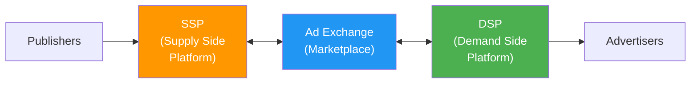
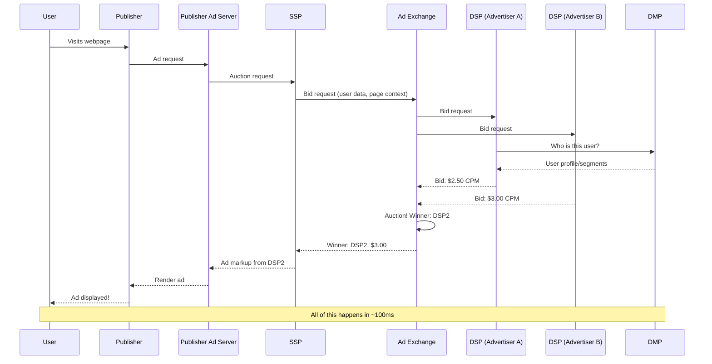
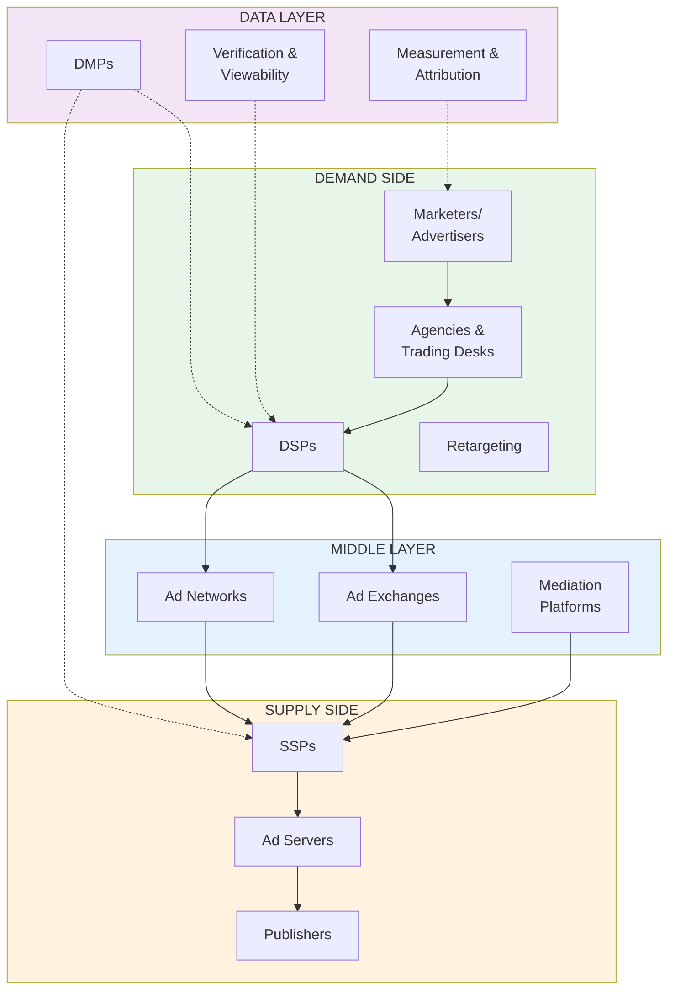
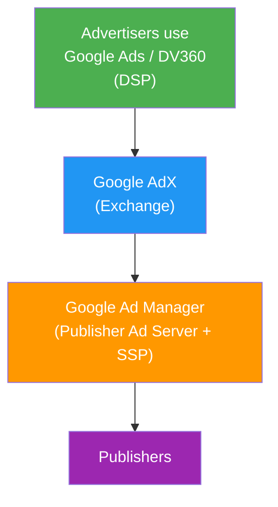

# Programmatic Advertising

**Programmatic advertising** is the automated buying and selling of digital ad space using software. Instead of humans negotiating deals over email, machines evaluate billions of ad opportunities per day and make buying decisions in milliseconds.

<Tip>
**Software engineering analogy**: Programmatic advertising is essentially an **event-driven microservices architecture** for buying and selling ads. When a user loads a page (event), a cascade of API calls flows through SSPs, exchanges, and DSPs -- each service evaluating the opportunity and responding in real-time. The entire round-trip completes in ~100ms. It's high-frequency trading applied to advertising.
</Tip>

## The Three Pillars of Programmatic

Programmatic advertising relies on three core platform types:

Let's break each one down.

---

## SSP (Supply Side Platform)

An SSP is a platform that helps **publishers** maximize revenue from their ad inventory by connecting them to multiple demand sources simultaneously.

### What Does an SSP Do?

1. **Inventory management**: Helps publishers organize and price their ad space
2. **Yield optimization**: Ensures each impression goes to the highest bidder
3. **Demand connection**: Connects to multiple ad exchanges, DSPs, and networks simultaneously
4. **Floor pricing**: Publishers set minimum CPM prices below which they won't sell
5. **Ad quality control**: Filters out malware, inappropriate content, and low-quality ads
6. **Reporting**: Provides publishers with revenue and performance analytics

<Tip>
**Software engineering analogy**: An SSP is like a **reverse proxy / load balancer for ad revenue**. It sits in front of the publisher's inventory, routes each ad request to the highest-paying demand source, and handles failover if one source doesn't respond. Like HAProxy or NGINX Plus, it optimizes for the best "response" (highest bid) from a pool of "backends" (demand sources).
</Tip>

### Brief History of SSPs

<Steps>
  <Step title="2007: The SSP Emerges">
    **Admeld**, **Rubicon Project** (now Magnite), and **PubMatic** launched as the first SSPs. Before this, publishers relied on ad networks with daisy-chained waterfalls. SSPs promised to evaluate all demand sources simultaneously -- a quantum leap in efficiency.
  </Step>
  <Step title="2008-2012: Rapid Growth">
    As real-time bidding (RTB) emerged, SSPs became the critical interface between publishers and the programmatic ecosystem. Major publishers began consolidating from 10+ ad networks to 2-3 SSPs.
  </Step>
  <Step title="2011: Google Enters">
    Google launched **AdX** (Ad Exchange) with tight integration into its publisher ad server (DFP). Because Google controlled both the ad server and the SSP, it could offer publishers an integrated solution nobody else could match -- a key point in the DOJ's antitrust case.
  </Step>
  <Step title="2020s: Consolidation">
    The SSP market consolidated significantly. Magnite acquired SpotX (CTV) and merged with other players. Google's AdX remained dominant, especially for web publishers.
  </Step>
</Steps>

### Major SSPs

| SSP | Parent/Status | Specialty | Notable Fact |
|---|---|---|---|
| **Google AdX** | Google | Web (dominant) | Integrated with Google Ad Manager; processes the most ad impressions globally |
| **Magnite** | Independent (public) | CTV + web | Formed from merger of Rubicon Project and Telaria; largest independent SSP |
| **PubMatic** | Independent (public) | Web + mobile | Strong in header bidding, processes 200B+ ad impressions daily |
| **Index Exchange** | Independent | Web | Known for transparency and exchange-quality focus |
| **OpenX** | Independent | Web + mobile | Pioneer in programmatic, been operating since 2008 |
| **Xandr (Microsoft)** | Microsoft | Web + CTV | Formerly AppNexus; acquired by Microsoft for Xbox/LinkedIn integration |
| **Verve Group** | Independent | Mobile | Strong in mobile and in-app advertising |

---

## DSP (Demand Side Platform)

A DSP is a platform that helps **advertisers** buy ad impressions efficiently across multiple supply sources.

### What Does a DSP Do?

1. **Campaign management**: Advertisers set targeting, budget, bids, and creative
2. **Bid evaluation**: For each available impression, decide whether to bid and how much
3. **Real-time bidding**: Submit bids to ad exchanges in ~50ms
4. **Audience targeting**: Apply first-party and third-party data to target specific users
5. **Budget pacing**: Spread budget across time to avoid overspending early
6. **Optimization**: Machine learning models to maximize campaign goals (CPA, ROAS)
7. **Reporting**: Cross-publisher performance analytics

<Tip>
**Software engineering analogy**: A DSP is like a **high-frequency trading system**. It receives millions of bid requests per second (market data), evaluates each one against campaign objectives and budget constraints (trading strategy), and submits bids within a strict time budget (~50-100ms). The core challenge is the same: make optimal decisions under extreme time pressure with incomplete information.
</Tip>

### Brief History of DSPs

<Steps>
  <Step title="2007: The First DSPs">
    **MediaMath** (founded by Joe Zawadzki) is generally credited as the first DSP. **Turn** (later Amobee, now Tremor Video) and **DataXu** (now Roku) followed shortly after. Before DSPs, advertisers bought through ad networks or manual IO deals -- DSPs automated the buying process.
  </Step>
  <Step title="2009: The Trade Desk Founded">
    **Jeff Green** founded The Trade Desk, which would become the most successful independent DSP. Green previously co-founded AdECN, one of the first ad exchanges.
  </Step>
  <Step title="2012: Google Launches DBM">
    Google launched **DoubleClick Bid Manager (DBM)** -- later renamed **Display & Video 360 (DV360)**. With native integration into Google's exchange and data assets, it quickly became the largest DSP.
  </Step>
  <Step title="2016-Present: The Trade Desk Rises">
    The Trade Desk IPO'd in 2016 at ~$18/share. By 2024, the stock had risen to over $80 (split-adjusted). It became the standard-bearer for the "open internet" -- offering advertisers an alternative to buying exclusively within Google's walled garden.
  </Step>
</Steps>

### Major DSPs

| DSP | Parent/Status | Specialty | Notable Fact |
|---|---|---|---|
| **DV360** | Google | Full-stack (dominant) | Tightly integrated with Google's ecosystem; largest by spend volume |
| **The Trade Desk** | Independent (public) | Open internet champion | ~$50B market cap; seen as the leading independent alternative to Google |
| **Amazon DSP** | Amazon | Amazon + open web | Access to Amazon's purchase data; growing rapidly |
| **Xandr Invest** | Microsoft | Web + CTV | LinkedIn audience data integration |
| **MediaMath** | Defunct (2023) | Was a pioneer | The first DSP; filed for bankruptcy in 2023. A cautionary tale. |
| **Moloco** | Independent | Mobile + ML | Known for advanced ML-based optimization |
| **Liftoff** | Unity | Mobile app install | Specializes in mobile user acquisition |

<Accordion title="For the curious: The MediaMath bankruptcy">
MediaMath's story is a cautionary tale in ad tech. Founded in 2007 as the first DSP, it pioneered the category. At its peak, it processed billions in ad spend. But it was plagued by:

1. **Cash flow problems**: MediaMath paid DSP platforms and publishers upfront but collected from advertisers later. The cash conversion cycle was brutal.
2. **Google's competitive pressure**: DV360's tight integration with Google's ecosystem made it hard for independents to compete.
3. **Failure to differentiate**: As DSPs commoditized, MediaMath couldn't justify its premium pricing.
4. **Operational debt**: Years of acquisitions and pivots left a complex, hard-to-maintain codebase.

MediaMath filed for Chapter 7 bankruptcy in June 2023, owing publishers approximately $100M in unpaid ad placements. The lesson: in a market with a dominant vertically-integrated player (Google), independents must differentiate relentlessly or die.
</Accordion>

---

## Ad Exchange

An ad exchange is a **digital marketplace** where SSPs and DSPs transact. It facilitates the real-time auction for each individual ad impression.

### What Does an Ad Exchange Do?

1. **Accept sell-side inventory**: SSPs send available ad impressions to the exchange
2. **Broadcast bid requests**: The exchange sends bid opportunities to connected DSPs
3. **Run the auction**: Collects bids, determines the winner
4. **Execute the transaction**: Notifies the winning DSP and the SSP
5. **Handle billing**: Tracks financial transactions between buyers and sellers

<Tip>
**Software engineering analogy**: An ad exchange is literally a **matching engine**, just like a stock exchange. It matches buy orders (bids from DSPs) with sell orders (impressions from SSPs) in real-time. The NASDAQ processes about 500,000 messages per second. Google's ad exchange processes millions of auction per second. It's one of the highest-throughput transaction systems in the world.
</Tip>

### Major Ad Exchanges

| Exchange | Parent | Notes |
|---|---|---|
| **Google Ad Exchange (AdX)** | Google | The largest; tightly integrated with Google Ad Manager |
| **OpenX** | Independent | Functions as both SSP and exchange |
| **Index Exchange** | Independent | Known for transparency and "exchange quality" |
| **Xandr** | Microsoft | Formerly AppNexus; pioneered the independent exchange model |

<Note>
In practice, the line between SSPs and ad exchanges has blurred significantly. Most modern SSPs also function as exchanges, and vice versa. The distinction was more meaningful in the early days of programmatic.
</Note>

---

## How They All Fit Together

Here's the complete flow of a programmatic ad transaction:

### The Relationship Chain: SSP ↔ Ad Exchange ↔ DSP

Let's clarify how these components communicate:

| Relationship | Protocol | Data Exchanged |
|---|---|---|
| Publisher → SSP | JavaScript tag / SDK | Ad slot info, page URL, user context |
| SSP → Ad Exchange | OpenRTB | Bid request (impression details, user data) |
| Ad Exchange → DSPs | OpenRTB | Bid request (forwarded with exchange metadata) |
| DSP → Ad Exchange | OpenRTB | Bid response (bid price, ad markup) |
| Ad Exchange → SSP | OpenRTB | Win notification, ad markup |
| SSP → Publisher | HTML/JavaScript | Ad creative to render |

---

## The LUMAscape

The **LUMAscape** is a famous industry map created by investment bank **LUMA Partners** that attempts to visualize every company in the ad tech ecosystem. It's updated regularly and has become the canonical reference for "who does what" in ad tech.

<Note>
The full LUMAscape is notoriously dense -- it contains hundreds of company logos arranged across categories. Industry veterans joke that it looks like a New York City subway map designed by a committee. But it's incredibly useful for understanding the ecosystem's complexity.
</Note>

### Simplified LUMAscape Categories

Here's a simplified view of the major categories:

### Key Companies by Category

<Tabs>
  <Tab title="DSPs">
    - **Google DV360**: The 800-pound gorilla. Integrated with everything Google.
    - **The Trade Desk**: The independent champion. Publicly traded, ~$50B market cap.
    - **Amazon DSP**: Growing fast with Amazon's purchase data moat.
    - **Moloco**: ML-focused DSP, strong in mobile.
    - **Criteo**: Pioneered retargeting; pivoted to broader commerce media.
  </Tab>
  <Tab title="SSPs / Exchanges">
    - **Google AdX**: Largest exchange, integrated with Google Ad Manager.
    - **Magnite**: Largest independent SSP. Strong in CTV.
    - **PubMatic**: Independent SSP focused on publisher value.
    - **Index Exchange**: Transparency-focused independent exchange.
    - **OpenX**: Long-running independent SSP/exchange.
  </Tab>
  <Tab title="Ad Servers">
    - **Google Ad Manager**: Dominant publisher ad server (~90% market share for premium publishers).
    - **Campaign Manager 360**: Dominant advertiser ad server.
    - **Kevel**: API-first ad server for building custom ad platforms.
    - **Flashtalking (Mediaocean)**: Alternative advertiser ad server.
  </Tab>
  <Tab title="DMPs / Data">
    - **Oracle Data Cloud (BlueKai)**: Was the largest third-party DMP. Oracle shut it down in 2024.
    - **Lotame**: Leading independent DMP.
    - **LiveRamp**: Identity resolution and data connectivity.
    - **Segment (Twilio)**: CDP (Customer Data Platform) used for first-party data activation.
  </Tab>
  <Tab title="Measurement">
    - **DoubleVerify**: Ad verification and viewability.
    - **IAS (Integral Ad Science)**: Ad verification and brand safety.
    - **MOAT (Oracle)**: Viewability measurement. Oracle shut it down in 2024.
    - **AppsFlyer**: Leading mobile measurement partner (MMP).
    - **Adjust / Airbridge / Branch**: Other major MMPs.
  </Tab>
</Tabs>

---

## The Blurring of Roles

In practice, the neat category boundaries of the LUMAscape have blurred significantly:

<AccordionGroup>
  <Accordion title="SSPs that are also exchanges">
    Most SSPs now run their own auctions, making them exchanges as well. PubMatic, Magnite, and Index Exchange all function as both SSPs and exchanges. The SSP/exchange distinction is mostly historical.
  </Accordion>
  <Accordion title="Ad servers that are also SSPs">
    Google Ad Manager is both a publisher ad server AND an SSP (with its built-in AdX integration). This dual role gives Google a unique advantage -- it sees all demand before anyone else.
  </Accordion>
  <Accordion title="DSPs that are also ad networks">
    Some DSPs offer managed service campaigns that function like ad networks. Google Ads (the search + display product) is essentially a DSP + ad network hybrid.
  </Accordion>
  <Accordion title="Everyone wants to be a 'platform'">
    The trend is toward full-stack platforms that span multiple categories. The Trade Desk has expanded from pure DSP into identity (UID2), CTV, and retail media. Amazon is a DSP + SSP + exchange + publisher. The neat categories of the LUMAscape are increasingly aspirational rather than descriptive.
  </Accordion>
</AccordionGroup>

---

## The Google Antitrust Context

Understanding programmatic advertising requires understanding Google's unique position:

Google controls:
- The dominant **DSP** (DV360 / Google Ads)
- The dominant **Exchange** (AdX)
- The dominant **Publisher Ad Server** (Google Ad Manager)
- The dominant **SSP** (AdX, integrated into Google Ad Manager)

<Warning>
The U.S. Department of Justice's antitrust case against Google (filed in 2023, trial in 2024) centers on exactly this vertical integration. The DOJ argues that Google leveraged its acquisitions (particularly DoubleClick in 2007 and AdMob in 2009) to create an illegal monopoly over the ad tech stack.

Key allegation: Google's publisher ad server gives preferential access to Google's exchange (AdX), and Google's exchange gives preferential access to Google's DSPs. This creates a closed loop that disadvantages independent competitors at every layer.

The DOJ's proposed remedy: **Force Google to divest** its publisher ad server and/or exchange business. If implemented, this would be the most significant tech antitrust action since the DOJ forced AT&T to break up in 1984.
</Warning>

<Accordion title="For the curious: How Google's integration creates advantages">
Here's a concrete example of how vertical integration helps Google:

1. **Last Look**: Google's AdX historically gave its own DSP a "last look" -- the ability to see competing bids and match them. This is like a poker player who can see everyone else's cards.

2. **Dynamic Allocation**: Google Ad Manager's "dynamic allocation" feature allowed AdX to compete with direct-sold campaigns in real-time, while other SSPs could only compete in a secondary auction. This gave AdX higher priority access to premium inventory.

3. **Data Sharing**: User data flows between Google's properties -- a user's search history on Google.com can inform targeting on DV360 campaigns running on third-party publisher sites. Independent DSPs don't have access to this cross-product data.

4. **Unified Billing**: Advertisers using Google's full stack get simplified billing, reporting, and optimization. Using independent tools at each layer means managing multiple vendor relationships.

These advantages compound. Even if each individual advantage is small, the cumulative effect is that Google's integrated stack is meaningfully better for both buyers and sellers -- which makes it harder for independent alternatives to compete. This is the classic monopoly concern: the product might be good *because* of the monopoly, but the lack of competition ultimately harms the market.
</Accordion>

## Key Takeaways

1. **SSPs help publishers maximize revenue** by connecting to multiple demand sources. Think of them as sell-side load balancers.

2. **DSPs help advertisers buy efficiently** by evaluating billions of impressions and bidding in real-time. Think of them as high-frequency trading systems.

3. **Ad exchanges are matching engines** that run auctions between SSPs and DSPs.

4. **The LUMAscape shows hundreds of companies**, but the market is dominated by a handful of major players, especially Google.

5. **Category boundaries have blurred** -- most modern platforms span multiple categories.

6. **Google's vertical integration** across DSP, exchange, and ad server is the subject of the largest ad tech antitrust case in history.

---

**Next up**: [Real-Time Bidding (RTB)](/adtech/rtb) -- the auction protocol that makes all of this work, processing millions of transactions per second in under 100 milliseconds.
