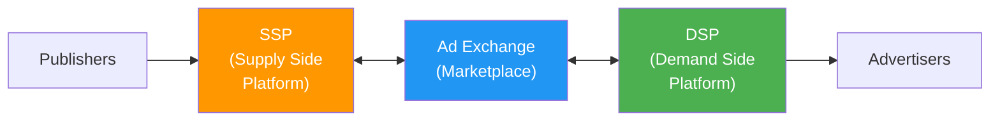
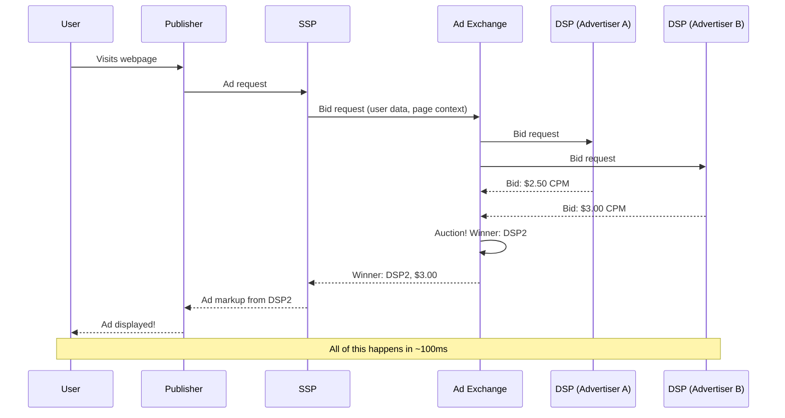
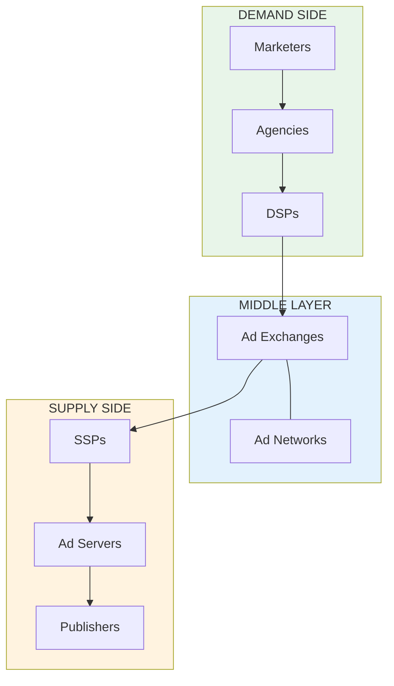
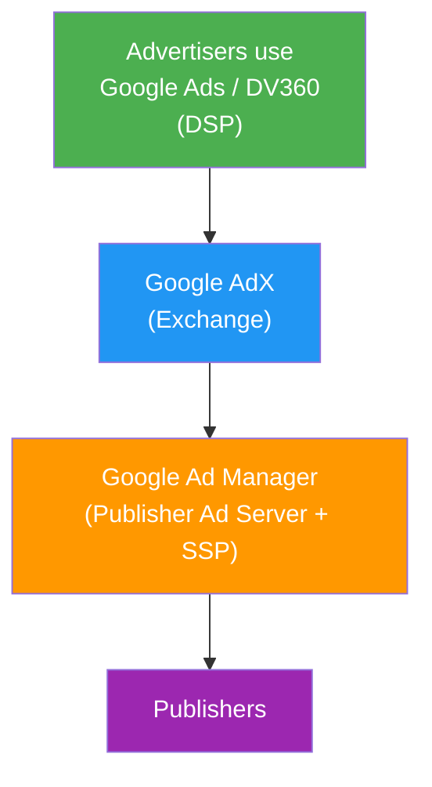

# Programmatic Advertising

**Programmatic advertising** is the automated buying and selling of digital ad space using software. Instead of humans negotiating deals over email, machines evaluate billions of ad opportunities per day and make buying decisions in milliseconds.

<Tip>
**Simple analogy**: Programmatic advertising is like algorithmic stock trading applied to ads. Instead of a human broker manually buying stocks, an algorithm evaluates millions of opportunities per second and makes trades automatically based on predefined rules and real-time data. The entire round-trip completes in ~100ms.
</Tip>

## The Three Pillars of Programmatic

Programmatic advertising relies on three core platform types:

---

## SSP (Supply Side Platform)

An SSP helps **publishers** maximize revenue from their ad inventory by connecting them to multiple demand sources simultaneously.

### What Does an SSP Do?

1. **Inventory management**: Helps publishers organize and price their ad space
2. **Yield optimization**: Ensures each impression goes to the highest bidder
3. **Demand connection**: Connects to multiple ad exchanges, DSPs, and networks simultaneously
4. **Floor pricing**: Publishers set minimum CPM prices below which they will not sell
5. **Ad quality control**: Filters out malware, inappropriate content, and low-quality ads
6. **Reporting**: Provides publishers with revenue and performance analytics

<Tip>
**Simple analogy**: An SSP is like a real estate agent working for the seller. It connects the seller's property (ad space) to many potential buyers (advertisers) simultaneously, ensures the property sells at the best possible price, and filters out unqualified buyers. Unlike a traditional agent who handles one property at a time, an SSP processes millions of "sales" per second.
</Tip>

### Major SSPs

| SSP | Parent/Status | Specialty |
|---|---|---|
| **Google AdX** | Google | Web (dominant). Integrated with Google Ad Manager. |
| **Magnite** | Independent (public) | CTV + web. Largest independent SSP. |
| **PubMatic** | Independent (public) | Web + mobile. 200B+ daily ad impressions. |
| **Index Exchange** | Independent | Known for transparency. |
| **OpenX** | Independent | Pioneer in programmatic. |
| **Xandr (Microsoft)** | Microsoft | Web + CTV. Xbox/LinkedIn integration. |

---

## DSP (Demand Side Platform)

A DSP helps **advertisers** buy ad impressions efficiently across multiple supply sources.

### What Does a DSP Do?

1. **Campaign management**: Advertisers set targeting, budget, bids, and creative
2. **Bid evaluation**: For each available impression, decide whether to bid and how much
3. **Real-time bidding**: Submit bids to ad exchanges in ~50ms
4. **Audience targeting**: Apply first-party and third-party data to target specific users
5. **Budget pacing**: Spread budget across time to avoid overspending early
6. **Optimization**: Machine learning to maximize campaign goals (CPA, ROAS)

<Tip>
**Simple analogy**: A DSP is like an automated stock-trading system. It receives millions of "buy opportunities" per second (bid requests), evaluates each one against your strategy and budget, and places bids on the best ones — all in under 50 milliseconds. Just like algorithmic trading, the quality of the decision-making algorithm is the core competitive advantage.
</Tip>

### Major DSPs

| DSP | Parent/Status | Specialty |
|---|---|---|
| **DV360** | Google | Full-stack, tightly integrated with Google. Largest by spend volume. |
| **The Trade Desk** | Independent (public) | Open internet champion. ~$50B market cap. |
| **Amazon DSP** | Amazon | Access to Amazon's purchase data. Growing rapidly. |
| **Moloco** | Independent | ML-focused, strong in mobile. |
| **Criteo** | Independent | Pioneered retargeting; pivoted to commerce media. |

<Accordion title="The MediaMath bankruptcy: a cautionary tale">
MediaMath, founded in 2007 as the **first DSP**, filed for Chapter 7 bankruptcy in June 2023, owing publishers approximately $100M in unpaid ad placements. Despite pioneering the category and processing billions in ad spend at its peak, it was crushed by:

1. Cash flow problems (paying publishers before collecting from advertisers)
2. Google's competitive pressure (DV360's tight integration made it hard to compete)
3. Failure to differentiate as DSPs commoditized
4. Operational complexity from years of acquisitions

The lesson: in a market with a dominant vertically-integrated player (Google), independents must differentiate relentlessly or die.
</Accordion>

---

## Ad Exchange

An ad exchange is a **digital marketplace** where SSPs and DSPs transact. It facilitates the real-time auction for each individual ad impression.

### What Does an Ad Exchange Do?

1. **Accept sell-side inventory**: SSPs send available ad impressions to the exchange
2. **Broadcast bid requests**: The exchange sends bid opportunities to connected DSPs
3. **Run the auction**: Collects bids, determines the winner
4. **Execute the transaction**: Notifies the winning DSP and the SSP
5. **Handle billing**: Tracks financial transactions between buyers and sellers

<Tip>
**Simple analogy**: An ad exchange is literally like a stock exchange. It matches buy orders (bids from DSPs) with sell orders (impressions from SSPs) in real-time. The difference is scale: while NASDAQ processes about 500,000 messages per second, Google's ad exchange processes millions of auctions per second.
</Tip>

<Note>
In practice, the line between SSPs and ad exchanges has blurred significantly. Most modern SSPs also function as exchanges, and vice versa. The distinction was more meaningful in the early days of programmatic.
</Note>

---

## How They All Fit Together

Here is the complete flow of a programmatic ad transaction:

### The Communication Chain

| Relationship | Protocol | Data Exchanged |
|---|---|---|
| Publisher -> SSP | JavaScript tag / SDK | Ad slot info, page URL, user context |
| SSP -> Ad Exchange | OpenRTB | Bid request (impression details, user data) |
| Ad Exchange -> DSPs | OpenRTB | Bid request (forwarded with exchange metadata) |
| DSP -> Ad Exchange | OpenRTB | Bid response (bid price, ad markup) |
| Ad Exchange -> SSP | OpenRTB | Win notification, ad markup |
| SSP -> Publisher | HTML/JavaScript | Ad creative to render |

---

## The LUMAscape

The **LUMAscape** is a famous industry map created by investment bank **LUMA Partners** that visualizes every company in the ad tech ecosystem. It is notoriously dense — containing hundreds of company logos — but is incredibly useful for understanding the ecosystem's complexity.

### Simplified Category View

### The Blurring of Roles

In practice, the neat category boundaries have blurred significantly:

<AccordionGroup>
  <Accordion title="SSPs that are also exchanges">
    Most SSPs now run their own auctions, making them exchanges as well. PubMatic, Magnite, and Index Exchange all function as both.
  </Accordion>
  <Accordion title="Ad servers that are also SSPs">
    Google Ad Manager is both a publisher ad server AND an SSP (with its built-in AdX integration). This dual role gives Google a unique advantage.
  </Accordion>
  <Accordion title="DSPs that are also ad networks">
    Some DSPs offer managed service campaigns that function like ad networks. Google Ads is essentially a DSP + ad network hybrid.
  </Accordion>
  <Accordion title="Everyone wants to be a 'platform'">
    The trend is toward full-stack platforms spanning multiple categories. The Trade Desk expanded into identity (UID2), CTV, and retail media. Amazon is a DSP + SSP + exchange + publisher.
  </Accordion>
</AccordionGroup>

---

## The Google Antitrust Context

Understanding programmatic advertising requires understanding Google's unique position:

Google controls the dominant **DSP** (DV360), the dominant **Exchange** (AdX), the dominant **Publisher Ad Server** (Google Ad Manager), and the dominant **SSP** (AdX integrated into Ad Manager).

<Warning>
The U.S. DOJ's antitrust case (filed 2023, trial 2024) argues Google leveraged acquisitions (particularly DoubleClick in 2007) to create an illegal monopoly over the ad tech stack. The DOJ's proposed remedy: force Google to divest its publisher ad server and/or exchange business — the most significant tech antitrust action potentially since the AT&T breakup in 1984.
</Warning>

---

## Key Takeaways

1. **SSPs help publishers maximize revenue** by connecting to multiple demand sources
2. **DSPs help advertisers buy efficiently** by evaluating billions of impressions and bidding in real-time
3. **Ad exchanges are matching engines** that run auctions between SSPs and DSPs
4. **The LUMAscape shows hundreds of companies** but the market is dominated by a handful of players
5. **Category boundaries have blurred** — most modern platforms span multiple categories
6. **Google's vertical integration** across DSP, exchange, and ad server is the subject of the largest ad tech antitrust case in history

---

**Next up**: [Real-Time Bidding (RTB)](/adtech/rtb) — the auction protocol that makes all of this work, processing millions of transactions per second in under 100 milliseconds.
