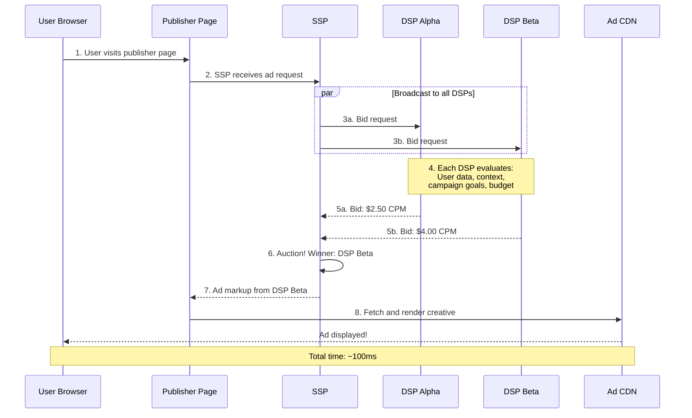
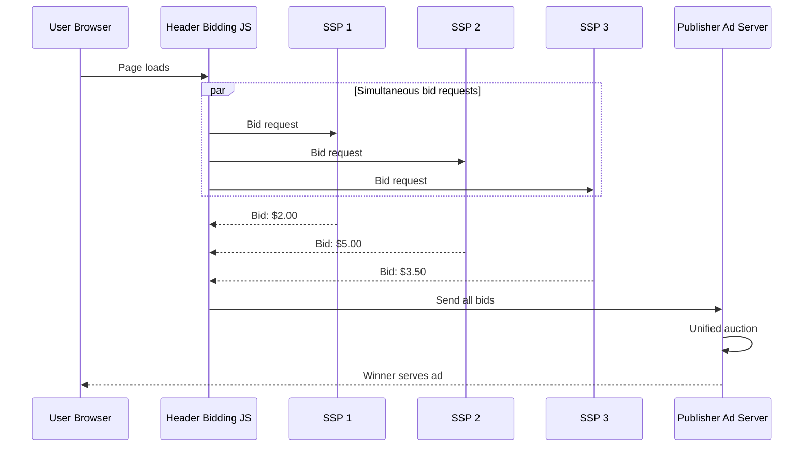

# Real-Time Bidding (RTB)

Every time you load a webpage with ads, an auction happens. Multiple advertisers compete in real-time to show you their ad. The entire process — from the moment the page starts loading to the moment the winning ad appears — takes about **100 milliseconds**. That is faster than a human blink (300-400ms).

<Tip>
**Why this matters**: RTB is the engine that powers most of the display, video, and mobile advertising you see. Understanding how it works helps you understand why ads cost what they cost, why some impressions are more valuable than others, and how platforms decide which ads to show you.
</Tip>

## How RTB Works: The 8-Step Process



<Steps>
  <Step title="1. User Visits a Page">
    A user navigates to a webpage. The page HTML includes ad tags — JavaScript snippets that trigger the ad serving process.
  </Step>
  <Step title="2. SSP Receives the Ad Request">
    The ad tag sends information about: the ad slot (size, position), the page (URL, content category), the user (cookie ID, device info, location), and publisher rules (floor price, blocked categories).
  </Step>
  <Step title="3. SSP Broadcasts Bid Requests">
    The SSP packages this into an OpenRTB bid request and sends it to all connected DSPs simultaneously. A major SSP might send to 20-50+ DSPs. Each DSP has **50-80ms** to respond.
  </Step>
  <Step title="4. DSPs Evaluate">
    Each DSP identifies the user, retrieves their profile, checks which campaigns match, predicts click/conversion probability using ML models, calculates a bid price, and decides: bid or no-bid. All in ~10-30ms.
  </Step>
  <Step title="5. DSPs Send Responses">
    Each bidding DSP sends back a bid price and the ad markup (HTML/JavaScript to render the ad). DSPs that do not want to bid simply do not respond.
  </Step>
  <Step title="6. SSP Runs the Auction">
    The SSP collects all bids, applies auction rules (first-price or second-price), checks against floor prices, and determines the winner.
  </Step>
  <Step title="7-8. Ad Is Served">
    The winning ad's markup is sent to the publisher page, fetched from a CDN, and rendered. The user sees the ad. Total elapsed time: ~100ms.
  </Step>
</Steps>

---

## The OpenRTB Standard

**OpenRTB** is the industry standard protocol for RTB communication. It defines bid requests and responses as JSON objects.

### Simplified Bid Request

```json
{
  "id": "auction-123456789",
  "imp": [{
    "banner": { "w": 300, "h": 250 },
    "bidfloor": 0.50
  }],
  "site": {
    "domain": "example-news.com",
    "cat": ["IAB12"]
  },
  "device": {
    "os": "iOS",
    "geo": { "country": "USA", "city": "San Francisco" }
  },
  "user": { "id": "user-abc-123" },
  "tmax": 80
}
```

| Key Field | What It Is |
|---|---|
| `imp.bidfloor` | Minimum acceptable bid ($0.50 CPM) |
| `site.cat` | Content category (IAB12 = News) |
| `device.geo` | User's location |
| `user.id` | User identifier (from cookie) |
| `tmax` | Maximum response time: 80ms |

### Simplified Bid Response

```json
{
  "seatbid": [{
    "bid": [{
      "price": 3.50,
      "adm": "[ad creative HTML markup]",
      "adomain": ["advertiser-brand.com"]
    }]
  }]
}
```

---

## Auction Types: 1st Price vs. 2nd Price

### Second-Price Auction (Historical Standard)

The winner pays **$0.01 more than the second-highest bid**, not their actual bid.

| Bidder | Bid | Outcome |
|---|---|---|
| DSP Alpha | $2.50 | Loses |
| DSP Beta | $4.00 | **Wins, pays $3.26** ($3.25 + $0.01) |
| DSP Gamma | $3.25 | Loses |

The dominant strategy is to bid your true value — you can never overpay. But this broke down in practice due to multiple intermediaries running nested auctions.

### First-Price Auction (Current Standard)

The winner pays **exactly what they bid**.

| Bidder | Bid | Outcome |
|---|---|---|
| DSP Alpha | $2.50 | Loses |
| DSP Beta | $4.00 | **Wins, pays $4.00** |
| DSP Gamma | $3.25 | Loses |

<Warning>
In first-price auctions, the dominant strategy is no longer to bid your true value. If the impression is worth $4.00 to you, you should bid *less* to get a better deal. But how much less? This is where **bid shading** comes in.
</Warning>

### Bid Shading

DSPs use ML models to predict the minimum bid needed to win, then bid slightly above that:

```
Shaded Bid = Floor Price + Shading Factor x (True Value - Floor Price)

Example: $1.00 + 0.6 x ($4.00 - $1.00) = $2.80
```

<Tip>
**Pro Tip**: The irony of bid shading is that it tries to recreate the effect of second-price auctions. The industry moved from a mechanism that naturally gave fair prices to one that requires sophisticated ML to approximate fair prices.
</Tip>

---

## Programmatic Deal Types

Not all programmatic buying happens through open auctions:

| Deal Type | Inventory | Price | Buyer | Priority |
|---|---|---|---|---|
| **Programmatic Guaranteed** | Reserved | Fixed | One buyer | Highest |
| **Preferred Deal** | Non-reserved | Fixed | One buyer | High |
| **Private Marketplace (PMP)** | Non-reserved | Auction (floor) | Invited buyers | Medium |
| **Open Auction** | Non-reserved | Auction | Anyone | Lowest |

<Tabs>
  <Tab title="Open Auction">
    Any DSP can bid on any impression. No pre-negotiated relationship required. Like a public stock exchange. ~50-60% of programmatic spend.
  </Tab>
  <Tab title="Private Marketplace (PMP)">
    Invitation-only auction. Publisher invites specific DSPs to bid, often with higher floor prices. Like a private auction house — only vetted buyers are invited.
  </Tab>
  <Tab title="Preferred Deal">
    One-to-one deal at a fixed CPM. The buyer gets first right of refusal before inventory goes to auction. Like having a reserved parking spot.
  </Tab>
  <Tab title="Programmatic Guaranteed">
    Direct deal through programmatic pipes. Fixed price, guaranteed impressions, specific inventory. Like a reserved cloud instance — guaranteed capacity at a committed price.
  </Tab>
</Tabs>

---

## Header Bidding: The Revolution

**Header bidding** was invented by publishers around 2015 to level the playing field against Google's ad server advantage.

### The Problem (Waterfall)

Before header bidding, publishers called demand sources **sequentially** based on historical average CPM. Network 1 got first shot, then Network 2, etc. But Network 3 might be willing to pay $10 for *this specific user* while Network 1 only offers $0.50.

### The Solution (Unified Auction)

Header bidding calls all demand sources **simultaneously**:



**Prebid.js** is the dominant open-source header bidding library, supporting 200+ demand partner adapters.

### Client-Side vs. Server-Side

| Aspect | Client-Side | Server-Side |
|---|---|---|
| Where auctions run | User's browser | Server container |
| Latency | Higher | Lower |
| Cookie access | Full | Limited |
| Implementation | Prebid.js | Prebid Server, Amazon TAM |

---

## RTB at Scale

| Metric | Approximate Scale |
|---|---|
| Global bid requests per day | ~500 billion+ |
| Bid requests per second (major SSP) | 10-15 million |
| Bid evaluation time (DSP) | ~10-30ms |
| Total auction latency | ~80-100ms |
| Daily data volume (major DSP) | ~100+ TB |

<Tip>
**Engineering perspective**: Building an RTB system is one of the most demanding distributed systems challenges. Languages like C++, Rust, or Go are used (not Python — GC pauses are fatal at these latencies). User data lives in Redis or Aerospike for microsecond lookups. ML models must evaluate in under 1ms.
</Tip>

---

## Key Takeaways

1. **RTB is a 100ms auction** happening billions of times per day
2. **OpenRTB is the standard protocol** — JSON bid requests and responses
3. **First-price auctions are the current standard**, requiring bid shading algorithms
4. **Four deal types exist** from most to least controlled: Programmatic Guaranteed, Preferred Deal, PMP, Open Auction
5. **Header bidding revolutionized the market** by replacing sequential waterfalls with simultaneous auctions
6. **The engineering challenges are extreme**: millisecond latency, millions of QPS, terabytes of daily data

---

**Next up**: [Targeting Technology Deep Dive](/adtech/targeting-deep-dive) — how ads find the right users through cookies, behavioral data, and privacy-preserving mechanisms.
