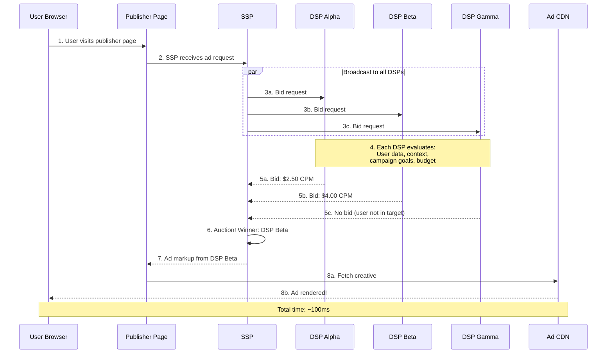
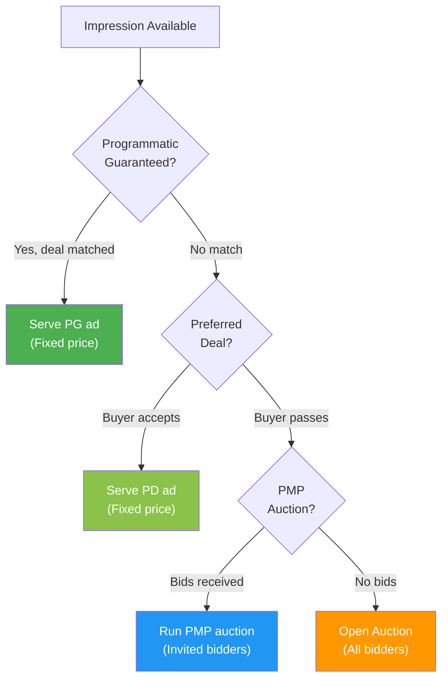
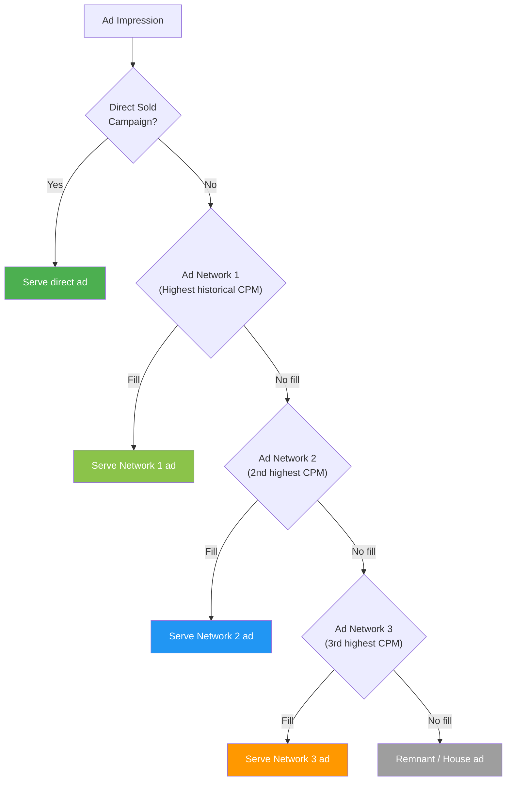
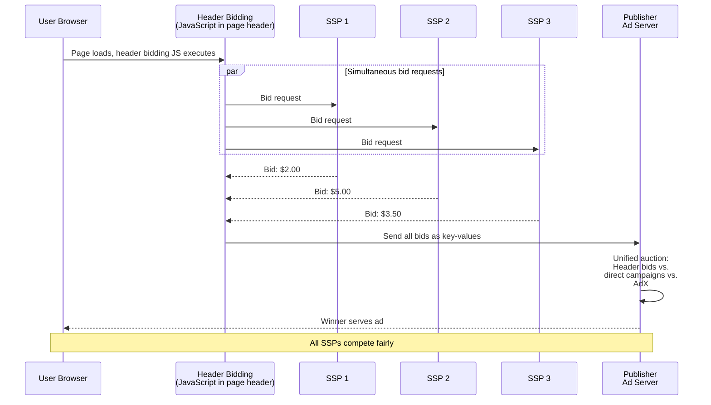

# Real-Time Bidding (RTB)

Every time you load a webpage with ads, an auction happens. Multiple advertisers compete in real-time to show you their ad. The entire process -- from the moment the page starts loading to the moment the winning ad appears -- takes about **100 milliseconds**. That's faster than a human blink (300-400ms).

<Tip>
**Software engineering analogy**: RTB is essentially a **distributed auction protocol** with hard real-time constraints. It's comparable to high-frequency trading (HFT) on financial exchanges, but with even higher throughput. A single SSP might process 10 million+ bid requests per second. The latency budget for the entire round-trip is ~100ms, with individual DSPs typically having ~50-80ms to respond. It's one of the most demanding distributed systems on the internet.
</Tip>

## How RTB Works: The 8-Step Process

Here's what happens every time an ad impression is available:



Let's break down each step:

<Steps>
  <Step title="1. User Visits Publisher Page">
    A user navigates to a webpage (e.g., nytimes.com). The page HTML includes ad tags -- JavaScript snippets that trigger the ad serving process. Each ad slot on the page fires independently.

    ```html
    <!-- Example: A publisher's ad tag -->
    <div id="ad-slot-1">
      <script>
        googletag.cmd.push(function() {
          googletag.display('ad-slot-1');
        });
      </script>
    </div>
    ```
  </Step>
  <Step title="2. SSP Receives Ad Request">
    The ad tag sends a request to the SSP with information about:
    - **The ad slot**: size, position on page, allowed ad types
    - **The page**: URL, content category, referrer
    - **The user**: cookie ID, device info, IP address (for geo), consent status
    - **Publisher rules**: floor price, blocked advertiser categories, preferred deals
  </Step>
  <Step title="3. SSP Sends Bid Requests to DSPs">
    The SSP packages this information into an **OpenRTB bid request** and broadcasts it to all connected DSPs simultaneously. A major SSP might send this request to 20-50+ DSPs. Each DSP typically has **50-80ms** to respond.
  </Step>
  <Step title="4. DSPs Evaluate the Bid Request">
    This is where the magic happens. Each DSP's bid evaluation engine:

    1. **Identifies the user**: Matches the cookie/device ID against its user database
    2. **Retrieves user profile**: Demographics, interests, browsing history, purchase behavior
    3. **Matches campaigns**: Checks which active campaigns target this user
    4. **Predicts outcomes**: ML models predict CTR (click-through rate), conversion probability
    5. **Calculates bid price**: Based on campaign goals, budget remaining, predicted value
    6. **Applies constraints**: Budget pacing, frequency caps, brand safety checks
    7. **Decides**: Bid or no-bid

    All of this happens in ~10-30ms on the DSP side.
  </Step>
  <Step title="5. DSPs Send Bid Responses">
    Each DSP that wants to bid sends back a response containing:
    - **Bid price**: The CPM they're willing to pay
    - **Ad markup**: The HTML/JavaScript to render the ad (or a URL to fetch it)
    - **Advertiser info**: Domain, category, creative ID
    - **Deal ID**: If bidding on a private deal (covered later)

    DSPs that don't want to bid simply don't respond (or send a "no-bid" response).
  </Step>
  <Step title="6. SSP Evaluates Responses and Runs Auction">
    The SSP collects all bids, applies the auction rules (1st price or 2nd price -- we'll explain both), and determines the winner. Factors considered:
    - Bid price (primary factor)
    - Publisher floor price (bids below the floor are rejected)
    - Ad quality score (some SSPs factor in creative quality)
    - Deal priority (private deals may have priority over open auction)
  </Step>
  <Step title="7. Ad Markup Sent to Publisher">
    The SSP sends the winning ad's markup back to the publisher's ad tag. This is typically an HTML snippet or a VAST tag (for video).
  </Step>
  <Step title="8. Ad Rendered in User's Browser">
    The browser executes the ad markup, which typically:
    1. Calls the advertiser's ad server (to log the impression)
    2. Fires tracking pixels (viewability, verification)
    3. Fetches the actual creative asset from a CDN
    4. Renders the ad in the designated slot

    The user sees the ad. The entire process, from page load to ad display, took ~100ms.
  </Step>
</Steps>

## The OpenRTB Standard

The **OpenRTB** (Open Real-Time Bidding) protocol is the industry standard for communication between SSPs and DSPs. Maintained by the **IAB Tech Lab**, it defines the format of bid requests and bid responses as JSON objects.

### Bid Request Example

Here's a simplified OpenRTB bid request -- what an SSP sends to DSPs:

```json
{
  "id": "auction-123456789",
  "imp": [{
    "id": "imp-1",
    "banner": {
      "w": 300,
      "h": 250,
      "pos": 1
    },
    "bidfloor": 0.50,
    "bidfloorcur": "USD"
  }],
  "site": {
    "id": "site-456",
    "domain": "example-news.com",
    "cat": ["IAB12"],
    "page": "https://example-news.com/article/123",
    "publisher": {
      "id": "pub-789",
      "name": "Example News Corp"
    }
  },
  "device": {
    "ua": "Mozilla/5.0 (iPhone; CPU iPhone OS 17_0 like Mac OS X)...",
    "ip": "203.0.113.0",
    "geo": {
      "lat": 37.7749,
      "lon": -122.4194,
      "country": "USA",
      "city": "San Francisco"
    },
    "devicetype": 4,
    "os": "iOS",
    "osv": "17.0"
  },
  "user": {
    "id": "user-abc-123",
    "buyeruid": "dsp-user-xyz",
    "data": [{
      "id": "data-provider-1",
      "segment": [
        {"id": "seg-auto", "name": "Auto Intenders"},
        {"id": "seg-hhi", "name": "HHI $100K+"}
      ]
    }]
  },
  "regs": {
    "gdpr": 1,
    "us_privacy": "1YNN"
  },
  "at": 1,
  "tmax": 80,
  "cur": ["USD"]
}
```

<AccordionGroup>
  <Accordion title="Key fields explained">
    | Field | Description |
    |---|---|
    | `id` | Unique auction ID |
    | `imp` | Array of impression objects (one per ad slot) |
    | `imp.banner.w/h` | Ad slot dimensions (300x250 in this case) |
    | `imp.bidfloor` | Publisher's minimum acceptable bid ($0.50 CPM) |
    | `site` | Information about the publisher's website |
    | `site.cat` | IAB content category (IAB12 = News) |
    | `device` | User's device information |
    | `device.geo` | Geographic location (derived from IP) |
    | `user` | User identity and segment data |
    | `user.buyeruid` | DSP-specific user ID (from cookie sync) |
    | `regs` | Regulatory compliance flags (GDPR, CCPA) |
    | `at` | Auction type: 1 = first price, 2 = second price |
    | `tmax` | Maximum time DSP has to respond (80ms) |
  </Accordion>
  <Accordion title="For the curious: Cookie syncing explained">
    Notice the `user.buyeruid` field? This is the result of **cookie syncing** -- a process where the SSP and DSP map their respective user IDs to each other.

    The SSP knows the user as `user-abc-123`. The DSP knows the same user as `dsp-user-xyz`. Cookie syncing is the process that establishes this mapping:

    1. When a user first visits a page with the SSP's tag, the SSP drops a cookie
    2. The SSP makes a server-to-server call or pixel redirect to the DSP
    3. The DSP drops its own cookie and records the mapping: `SSP:user-abc-123 = DSP:dsp-user-xyz`
    4. In future bid requests, the SSP includes the DSP-specific ID so the DSP can look up its data about this user

    This is essentially a **distributed identity federation** -- like how OAuth maps identities across services. And just like OAuth, it's fragile: clear cookies and the mapping breaks.

    Cookie syncing is one of the mechanisms under threat from privacy changes. Without third-party cookies, this entire identity mapping system breaks down -- which is why the industry is scrambling for alternatives like **UID2** (The Trade Desk's open-source identity framework).
  </Accordion>
</AccordionGroup>

### Bid Response Example

Here's what a DSP sends back if it wants to bid:

```json
{
  "id": "auction-123456789",
  "seatbid": [{
    "bid": [{
      "id": "bid-001",
      "impid": "imp-1",
      "price": 3.50,
      "adid": "creative-456",
      "adm": "<div class='ad'><a href='https://click.tracker.com/redir?...'></a></div>",
      "adomain": ["advertiser-brand.com"],
      "crid": "creative-456",
      "cat": ["IAB2"],
      "w": 300,
      "h": 250
    }]
  }],
  "bidid": "response-789",
  "cur": "USD"
}
```

<Accordion title="Key response fields explained">
| Field | Description |
|---|---|
| `seatbid` | Array of seat bids (a DSP might bid on behalf of multiple advertisers) |
| `bid.price` | The bid price in CPM ($3.50 per 1,000 impressions) |
| `bid.adm` | The **ad markup** -- actual HTML to render. Note the click tracker URL and impression pixel. |
| `bid.adomain` | The advertiser's domain (used for brand safety filtering) |
| `bid.crid` | Creative ID for tracking which specific ad won |
| `bid.cat` | IAB category of the ad content |
</Accordion>

---

## Auction Types: 1st Price vs. 2nd Price

The auction type determines what the winner actually pays. This is one of the most important concepts in programmatic advertising.

### Second-Price Auction (Historical Standard)

In a **second-price auction** (also called a Vickrey auction), the winner pays **$0.01 more than the second-highest bid**, not their actual bid.

<Tabs>
  <Tab title="How It Works">
    | Bidder | Bid Amount |
    |---|---|
    | DSP Alpha | $2.50 |
    | DSP Beta | $4.00 |
    | DSP Gamma | $3.25 |

    **Winner**: DSP Beta (highest bid: $4.00)
    **Clearing Price**: $3.26 ($3.25 + $0.01)

    DSP Beta bid $4.00 but only pays $3.26. They save $0.74.
  </Tab>
  <Tab title="Why It Was Preferred">
    Second-price auctions have a beautiful property from game theory: the **dominant strategy is to bid your true value**.

    - If you bid below your true value, you risk losing auctions you should have won (and you wouldn't have overpaid anyway)
    - If you bid above your true value, you risk winning at a price higher than the impression is worth to you
    - Bidding your true value is always optimal -- you win when the price is right and never overpay

    This is why eBay and Google Search used second-price auctions for years. It simplifies bidder strategy and leads to efficient price discovery.
  </Tab>
  <Tab title="Why It Fell Apart">
    Second-price auctions work beautifully in theory but failed in practice in the ad tech ecosystem because:

    1. **Multiple intermediaries**: In a chain of SSP → Exchange → DSP, each layer might run its own auction. A "second-price" auction at one layer feeds into a "first-price" decision at another. The clean game theory breaks down.

    2. **Floor price manipulation**: Some SSPs would set dynamic floor prices just below the winning bid, effectively converting second-price auctions into first-price ones. Buyers felt cheated.

    3. **Header bidding**: When publishers started running multiple SSP auctions simultaneously (header bidding), the bids from one "second-price" auction would compete in a "first-price" final auction. Again, the clean mechanics broke down.

    By 2019, most of the industry had switched to first-price auctions.
  </Tab>
</Tabs>

### First-Price Auction (Current Standard)

In a **first-price auction**, the winner pays exactly what they bid.

| Bidder | Bid Amount | Outcome |
|---|---|---|
| DSP Alpha | $2.50 | Loses |
| DSP Beta | $4.00 | **Wins, pays $4.00** |
| DSP Gamma | $3.25 | Loses |

<Warning>
The problem with first-price auctions: the dominant strategy is **no longer** to bid your true value. If DSP Beta values the impression at $4.00, they should bid *less* than $4.00 to get a better deal. But how much less? That depends on what others are bidding -- which you don't know. This leads to **bid shading**.
</Warning>

### Bid Shading

**Bid shading** is a technique DSPs use in first-price auctions to avoid overpaying. Instead of bidding the full amount an impression is worth, the DSP bids somewhere between the minimum (floor price) and the maximum (true value).

```
Shaded Bid = Floor Price + Shading Factor × (True Value - Floor Price)
```

For example:
- True value of impression: $4.00
- Floor price: $1.00
- Shading factor: 0.6 (determined by ML model)
- **Shaded bid**: $1.00 + 0.6 × ($4.00 - $1.00) = **$2.80**

<Accordion title="For the curious: How bid shading algorithms work">
Bid shading is essentially a **price prediction problem**. The DSP wants to predict the minimum bid needed to win the auction, then bid slightly above that.

Modern bid shading algorithms use machine learning models that consider:

1. **Historical win rates**: For similar impressions (same publisher, ad size, user segment), what bids won in the past?
2. **Market dynamics**: How many other DSPs typically bid on this type of inventory? What's the competitive density?
3. **Time of day**: Demand fluctuates throughout the day. Late-night inventory is typically cheaper.
4. **Publisher floor prices**: If the floor is $1.00 and you've won at $1.50 before, bidding $4.00 is wasteful.
5. **Campaign urgency**: If a campaign is behind on pacing, bid more aggressively. If it's ahead, shade more.

The models are trained on millions of auction outcomes. The Trade Desk, for example, processes over 13 million ad opportunities per second -- that's a massive training dataset for bid shading models.

The irony: bid shading in first-price auctions is essentially trying to recreate the effect of second-price auctions. The industry moved from a mechanism that naturally gave fair prices to one that requires sophisticated ML to approximate fair prices.
</Accordion>

---

## Programmatic Deal Types

Not all programmatic buying happens through open auctions. There's a spectrum of deal types:

| Deal Type | Inventory | Price | Buyer | Priority |
|---|---|---|---|---|
| **Programmatic Guaranteed** | Reserved | Fixed | One buyer | Highest |
| **Preferred Deal** | Non-reserved | Fixed | One buyer | High |
| **Private Marketplace (PMP)** | Non-reserved | Auction (floor) | Invited buyers | Medium |
| **Open Auction** | Non-reserved | Auction | Anyone | Lowest |

<Tabs>
  <Tab title="Open Auction (Open RTB)">
    **What it is**: The default. Any DSP can bid on any impression. No pre-negotiated relationship required.

    **Analogy**: Like a public stock exchange -- anyone can buy and sell, prices are set by open market dynamics.

    **Pros**: Maximum liquidity, automated, no setup required
    **Cons**: Least transparency, potential for brand safety issues, lower CPMs for publishers

    **Market share**: ~50-60% of programmatic spend
  </Tab>
  <Tab title="Private Marketplace (PMP) Auction">
    **What it is**: An invitation-only auction. The publisher invites specific DSPs/advertisers to bid, often with a higher floor price. Uses a **Deal ID** in the bid request.

    **Analogy**: Like a private sale at an auction house -- only vetted buyers are invited, and there's a minimum bid.

    **Pros**: Publisher gets higher CPMs, buyer gets premium inventory access, more brand safety
    **Cons**: Requires deal setup (publisher and buyer must agree on terms)

    ```json
    // Deal ID in bid request
    {
      "imp": [{
        "pmp": {
          "private_auction": 1,
          "deals": [{
            "id": "deal-premium-sports-q4",
            "bidfloor": 5.00,
            "at": 1
          }]
        }
      }]
    }
    ```
  </Tab>
  <Tab title="Preferred Deal">
    **What it is**: A one-to-one deal between a publisher and an advertiser at a fixed CPM. The buyer gets first right of refusal on inventory before it goes to auction.

    **Analogy**: Like having a reserved parking spot in a garage. You get priority access at a pre-agreed price, but you don't have to park there every time.

    **Pros**: Price predictability, guaranteed access to premium inventory
    **Cons**: Non-reserved (publisher can't guarantee specific volume), buyer must still bid to "accept"
  </Tab>
  <Tab title="Programmatic Guaranteed (PG)">
    **What it is**: A direct deal executed through programmatic pipes. Fixed price, guaranteed impressions, specific inventory. It's essentially an IO (Insertion Order) processed through DSP/SSP technology.

    **Analogy**: Like a reserved instance in AWS -- guaranteed capacity at a committed price. You pay whether you use it or not.

    **Pros**: Maximum control and predictability for both sides
    **Cons**: Requires manual negotiation, less flexible, looks a lot like traditional direct buying

    **Growing fast**: Major brands increasingly prefer PG for premium campaigns because it combines the control of direct buying with the targeting and optimization of programmatic.
  </Tab>
</Tabs>

### Deal Priority Waterfall

When an impression is available, it's evaluated against deals in priority order:



---

## Waterfall vs. Unified Auction (Header Bidding)

One of the most significant innovations in ad tech was the move from **waterfall** auctions to **unified auctions** (header bidding).

### The Waterfall Problem

Before header bidding, publisher ad servers used a **waterfall** (or daisy-chain) approach to fill ad impressions:



**The problem**: Each network is called **sequentially**, based on historical average CPM. But averages hide variance. Network 3 might be willing to pay $10 for *this specific user* while Network 1 only offers $0.50. In a waterfall, Network 1 gets first shot and fills at $0.50 -- the publisher misses out on $9.50.

<Warning>
**Google's advantage in the waterfall era**: Google's AdX had a special privilege called "Dynamic Allocation" in Google Ad Manager. While other networks were called sequentially in the waterfall, AdX could compete in real-time against the direct-sold campaigns. This meant AdX effectively had "first look" at every impression, while everyone else waited in line. This is one of the practices cited in the DOJ antitrust case.
</Warning>

### Header Bidding: The Revolution

**Header bidding** (also called pre-bidding) was invented by publishers around 2015 to level the playing field. The idea: instead of calling demand sources sequentially, call them **all simultaneously** before the ad server makes its decision.



**How it works**:

1. A JavaScript library (like **Prebid.js**) is added to the page's `<head>` section
2. When the page loads, Prebid.js sends bid requests to multiple SSPs **simultaneously**
3. Bids are collected within a timeout window (~1-3 seconds)
4. The highest bids are passed to the publisher's ad server as **key-value pairs**
5. The ad server runs a unified auction: header bids compete against direct campaigns and any other demand

<Accordion title="For the curious: Prebid.js technical details">
**Prebid.js** is the dominant open-source header bidding library. It's maintained by a committee of ad tech companies and has become the industry standard.

Key technical aspects:

```javascript
// Simplified Prebid.js configuration
var adUnits = [{
  code: 'ad-slot-1',
  mediaTypes: {
    banner: { sizes: [[300, 250], [728, 90]] }
  },
  bids: [
    {
      bidder: 'appnexus',
      params: { placementId: '12345' }
    },
    {
      bidder: 'pubmatic',
      params: { publisherId: '67890', adSlot: 'slot-1' }
    },
    {
      bidder: 'rubicon',
      params: { accountId: '11111', siteId: '22222', zoneId: '33333' }
    }
  ]
}];

pbjs.setConfig({
  bidderTimeout: 1500,  // Max 1.5s to wait for bids
  priceGranularity: 'dense'  // Price bucket granularity
});
```

**Performance considerations**:
- Each SSP adapter adds ~10-50KB of JavaScript
- Each bid request is a separate HTTP call
- Typical timeout: 1-3 seconds (after which slow bidders are ignored)
- Publishers typically include 5-15 SSP adapters

**Server-side header bidding**: To address the latency and browser resource issues of client-side header bidding, the industry developed **server-to-server (S2S) header bidding**. Instead of the browser making calls to each SSP, a single call goes to a server-side container (like **Prebid Server**), which then calls all SSPs from the server. This is faster but loses some signal (like first-party cookies).

Prebid.js supports **200+ demand partner adapters**. It's one of the most widely-deployed open-source libraries in ad tech.
</Accordion>

### Client-Side vs. Server-Side Header Bidding

| Aspect | Client-Side | Server-Side |
|---|---|---|
| Where auctions run | User's browser | Server-side container |
| Latency | Higher (many HTTP calls from browser) | Lower (single call to server) |
| Cookie access | Full (first-party cookies available) | Limited (no browser cookie access) |
| Browser resources | Heavy (CPU, bandwidth) | Light (single request) |
| Match rates | Higher (cookie-based user matching) | Lower (limited identity) |
| Implementation | Prebid.js in page header | Prebid Server, Amazon TAM |

<Tip>
**Software engineering analogy**: This is exactly the **client-side rendering vs. server-side rendering** tradeoff in web development. Client-side header bidding is like CSR -- more capability but heavier on the client. Server-side header bidding is like SSR -- faster page loads but with tradeoffs in data access and flexibility. Most publishers today use a **hybrid** approach, just like modern web frameworks use hybrid rendering.
</Tip>

---

## RTB at Scale: The Numbers

To appreciate the engineering challenge of RTB, consider these numbers:

| Metric | Approximate Scale |
|---|---|
| Global bid requests per day | ~500 billion+ |
| Bid requests per second (major SSP) | 10-15 million |
| Bid evaluation time (DSP) | ~10-30ms |
| Total auction latency | ~80-100ms |
| Average bid response rate | ~5-20% (most impressions get "no bid") |
| Data transmitted per bid request | ~1-5 KB |
| Daily data volume (major DSP) | ~100+ TB of bid request data |

<Accordion title="For the curious: Engineering challenges of RTB at scale">
Building an RTB system is one of the most demanding distributed systems challenges:

1. **Latency requirements**: 50-80ms response time, including network transit. This means all processing (user lookup, campaign matching, bid calculation) must happen in ~10-30ms. No room for database round-trips -- everything must be in-memory or cached.

2. **Throughput**: A major DSP processes 10M+ bid requests/second. At 2KB per request, that's 20GB/s of inbound data. You need massive horizontal scaling.

3. **Availability**: If your DSP goes down for 1 minute at 10M QPS, you've missed 600M bid opportunities. RTB systems target 99.99%+ uptime.

4. **Data freshness**: User profiles, campaign budgets, and frequency caps must be updated in near-real-time across all serving nodes. This is a classic distributed state management problem.

5. **Cost efficiency**: At the volumes involved, even small inefficiencies compound. A DSP that wastes 1ms per request wastes 10,000 CPU-seconds per second. Infrastructure costs for major DSPs run into hundreds of millions per year.

Common technical choices:
- **Languages**: C++, Rust, or Go for bid evaluation (not Python or Java -- GC pauses are fatal)
- **Storage**: Redis, Aerospike, or custom in-memory stores for user data
- **Networking**: Custom binary protocols over TCP, not HTTP/JSON (too slow for internal calls)
- **ML inference**: Lightweight models (logistic regression, small neural nets) that can evaluate in <1ms
- **Architecture**: Stateless bid evaluation servers with shared state in fast KV stores
</Accordion>

## Key Takeaways

1. **RTB is a 100ms auction** that happens billions of times per day. It's one of the most demanding distributed systems on the internet.

2. **OpenRTB is the standard protocol** -- JSON-based bid requests and responses between SSPs and DSPs.

3. **First-price auctions are the current standard**, replacing second-price auctions. This shifted complexity to DSPs, who now need sophisticated bid shading algorithms.

4. **Four deal types exist** (from most to least controlled): Programmatic Guaranteed, Preferred Deal, PMP Auction, Open Auction.

5. **Header bidding revolutionized the market** by replacing sequential waterfalls with simultaneous auctions, creating fairer competition and higher publisher revenue.

6. **The engineering challenges are extreme**: millisecond latency, millions of QPS, terabytes of daily data, and 99.99%+ uptime requirements.

---

**Next up**: [Targeting Technology Deep Dive](/adtech/targeting-deep-dive) -- how ads find the right users through cookies, behavioral data, and increasingly privacy-preserving mechanisms.
