# Targeting Technology Deep Dive

Targeting is the reason digital advertising is worth $600B+ per year. The ability to show the right ad to the right person at the right time is what separates digital from traditional advertising. It is also the most controversial aspect of ad tech -- touching privacy, regulation, and the fundamental economics of the internet.

<Tip>
**Think of it this way**: Targeting is essentially a recommendation system at massive scale. Just as Netflix recommends shows and Spotify recommends songs, ad tech recommends ads. The same machine learning techniques apply: collaborative filtering, content-based filtering, and hybrid approaches. The difference is that ad targeting operates under extreme latency constraints (about 10 milliseconds), handles billions of daily decisions, and is subject to increasingly strict regulation.
</Tip>

---

## Types of Targeting: Two Fundamental Approaches

There are two fundamental approaches to targeting ads. Understanding the difference between them is the single most important thing to grasp about how ads find the right users.

| Approach | What It Targets | Data Needed | Privacy Impact |
|---|---|---|---|
| **Contextual** | The content/environment | Page content, keywords | Low (no user data needed) |
| **Behavioral** | The individual user | Browsing history, demographics | High (requires user tracking) |

Think of it like dating: contextual targeting is like going to a running club to find runners (the environment tells you about the people). Behavioral targeting is like looking up someone's dating profile to learn about them individually.

---

## Contextual Targeting

**Contextual targeting** matches ads to the content of the page they appear on. An ad for running shoes appears on an article about marathon training. An ad for financial services appears on a business news page. No user data required.

This is the oldest form of ad targeting -- newspapers have always sold "sports section" ads. But modern technology has made it dramatically more powerful.

### How Contextual Targeting Works Technically

<Steps>
  <Step title="Content Analysis">
    The page content is analyzed using NLP (Natural Language Processing) to determine:
    - **Keywords**: What words and phrases appear on the page
    - **Topics**: What IAB content categories apply (e.g., IAB17 = Sports, IAB13 = Personal Finance)
    - **Sentiment**: Is the content positive, negative, or neutral
    - **Entities**: What brands, people, or places are mentioned
    - **Safety classification**: Is the content brand-safe (not violent, hateful, etc.)
  </Step>
  <Step title="Category Mapping">
    The analysis results are mapped to the **IAB Content Taxonomy** -- a standardized hierarchy of content categories:
    ```
    IAB1: Arts & Entertainment
      IAB1-1: Books & Literature
      IAB1-2: Celebrity Fan/Gossip
      IAB1-3: Fine Art
      ...
    IAB12: News
      IAB12-1: International News
      IAB12-2: National News
      IAB12-3: Local News
    IAB17: Sports
      IAB17-1: Auto Racing
      IAB17-2: Baseball
      ...
    ```
  </Step>
  <Step title="Ad Matching">
    Advertisers specify which content categories they want to target (or avoid). The ad server matches the page's categories against advertiser preferences:
    - Nike targets: IAB17 (Sports), IAB7 (Health & Fitness)
    - Nike blocks: IAB14 (Society) -- too risky for brand safety
    - Result: Nike's ad is eligible for sports and fitness content
  </Step>
</Steps>

### The Contextual Renaissance

Contextual targeting is experiencing a major resurgence because of the privacy revolution:

1. **No user data needed**: It works without cookies, device IDs, or any personal information
2. **Privacy-compliant by design**: GDPR, CCPA, and iOS ATT do not restrict contextual targeting
3. **Improved technology**: Modern NLP (including large language models) can understand page context far better than simple keyword matching
4. **Brand safety**: Understanding what is on the page is essential for ensuring ads do not appear next to inappropriate content

<Accordion title="How modern contextual AI works">
Early contextual targeting was simple keyword matching -- the word "basketball" on a page triggered sports ads. This led to problems: an article about a "basketball player's injury" might trigger ads for a sports brand that does not want to be associated with injury content.

Modern contextual platforms (like Oracle's Grapeshot, Peer39, or DoubleVerify's Semantic Science) use:

1. **Transformer-based NLP models**: Similar to BERT or GPT architectures, these models understand the *meaning* of content, not just keywords. They can distinguish between "basketball game highlights" (positive sports context) and "basketball player arrested" (negative news context).

2. **Multi-signal analysis**: Beyond text, they analyze images, video frames, and page structure to understand context holistically.

3. **Real-time classification**: Pages are classified in real-time as bid requests flow through the system. The SSP includes contextual signals in the bid request; the DSP uses them for targeting decisions.

4. **Custom taxonomy**: Beyond the standard IAB categories, advertisers can create custom contextual segments. A luxury car brand might create a "luxury lifestyle" context that combines specific publications, content themes, and sentiment scores.

The irony: contextual targeting is the oldest form of ad targeting (newspapers have sold "sports section" ads forever) but is now being reinvented with the most modern AI techniques.
</Accordion>

<Tip>
**Pro Tip**: Contextual targeting is your best friend in a privacy-first world. If you are building an ad strategy today, invest in contextual approaches first. They work everywhere, require no consent popups, and are completely future-proof against privacy regulation changes. Start by identifying the content categories where your ideal customers spend their time.
</Tip>

---

## Behavioral Targeting

**Behavioral targeting** targets ads based on a user's past behavior -- websites visited, searches performed, products viewed, apps used. It is far more precise than contextual targeting but requires tracking individual users across the internet.

### How Behavioral Targeting Works

Let us walk through a real example:

```mermaid
graph TD
    subgraph UserActivity["User Activity (Tracked Over Time)"]
        V1["Visits running shoe<br/>review site"]
        V2["Searches 'marathon<br/>training plan'"]
        V3["Browses Nike.com<br/>for 5 minutes"]
        V4["Reads article about<br/>Boston Marathon"]
    end

    subgraph DataCollection["Data Collection"]
        C1["Third-party cookie<br/>tracks cross-site visits"]
        C2["Search engine logs query"]
        C3["Retargeting pixel on Nike.com<br/>fires"]
        C4["DMP collects<br/>interest signal"]
    end

    subgraph Profile["User Profile Built"]
        P["User #abc123:<br/>- Interest: Running/Fitness<br/>- Intent: Buy running shoes<br/>- Visited: Nike.com<br/>- Demo: 25-34, Urban<br/>- Segment: 'Active Runner'"]
    end

    subgraph Targeting["Ad Targeting"]
        T["Nike DSP sees user #abc123<br/>on random news site →<br/>Bids high, shows running shoe ad"]
    end

    V1 --> C1
    V2 --> C2
    V3 --> C3
    V4 --> C4
    C1 --> P
    C2 --> P
    C3 --> P
    C4 --> P
    P --> T

    style Profile fill:#E3F2FD
    style Targeting fill:#E8F5E9
```



The user visited several running-related sites over a few days. Each visit was tracked by various ad tech systems. Those signals were combined into a user profile. Now, when that user visits a completely unrelated news website, Nike's DSP recognizes them and shows them a running shoe ad. That is behavioral targeting in action.

### The Cookie Mechanism

The foundation of behavioral targeting on the web is the **HTTP cookie** -- specifically, **third-party cookies**. Understanding the difference between first-party and third-party cookies is essential.

<Tabs>
  <Tab title="First-Party Cookies">
    **Set by**: The website you are currently visiting
    **Domain**: Same as the site (e.g., `nytimes.com` sets a cookie for `nytimes.com`)
    **Purpose**: Login sessions, preferences, shopping carts, analytics
    **Privacy impact**: Low -- the site you are visiting knows you are visiting it
    **Status**: Universally supported, not under threat

    ```
    Set-Cookie: session_id=abc123; Domain=nytimes.com; Path=/; HttpOnly; Secure
    ```

    First-party cookies are like a restaurant remembering your usual order. The restaurant you are at knows your preferences. That is normal and expected.
  </Tab>
  <Tab title="Third-Party Cookies">
    **Set by**: A different domain than the one you are visiting (the ad tech domain)
    **Domain**: An ad tech domain (e.g., `doubleclick.net` sets a cookie while you are on `nytimes.com`)
    **Purpose**: Cross-site tracking, user identification for ad targeting
    **Privacy impact**: High -- enables tracking across the entire internet
    **Status**: Being phased out. Blocked by Safari (since 2017), Firefox (since 2019). Chrome announced deprecation, then reversed in 2024, but is still adding user controls and restrictions.

    ```
    // You visit nytimes.com, which has an ad tag from doubleclick.net
    // doubleclick.net sets a cookie:
    Set-Cookie: id=user_xyz; Domain=.doubleclick.net; Path=/; SameSite=None; Secure

    // Later, you visit espn.com, which also has a doubleclick.net ad tag
    // doubleclick.net reads the same cookie: id=user_xyz
    // Now doubleclick.net knows you visit both NYT and ESPN
    ```

    Third-party cookies are like a private detective following you to every restaurant in town, noting exactly what you order at each one, and then selling that information to anyone willing to pay.
  </Tab>
</Tabs>

### User Identification Across the Web

Third-party cookies are just one mechanism for tracking users. The full toolkit includes several methods:

| Method | How It Works | Persistence | Privacy Concern |
|---|---|---|---|
| **Third-party cookies** | Ad tech domain sets cookie readable across sites | Until cleared/blocked | High -- cross-site tracking |
| **Device fingerprinting** | Combine browser, OS, screen, fonts, plugins into unique ID | Semi-persistent | High -- invisible to users |
| **Email-based identity** | User logs in with email; hashed email used as ID | Persistent | Medium -- requires user action |
| **Login-based tracking** | Google/Facebook/Apple login tracks across their properties | Very persistent | High -- within walled garden |
| **Mobile advertising ID** | IDFA (iOS) / GAID (Android) | Until reset | High -- being restricted |
| **IP address** | Shared among household/office | Changes frequently | Low-medium -- imprecise |
| **UID2 (Unified ID 2.0)** | Hashed email-based open standard (The Trade Desk) | Email-dependent | Medium -- requires consent |

<Accordion title="How device fingerprinting works">
Device fingerprinting creates a unique identifier by combining dozens of browser and device attributes:

```javascript
// Simplified fingerprinting signals
const fingerprint = {
  userAgent: navigator.userAgent,
  language: navigator.language,
  screenResolution: `${screen.width}x${screen.height}`,
  colorDepth: screen.colorDepth,
  timezone: Intl.DateTimeFormat().resolvedOptions().timeZone,
  platform: navigator.platform,
  plugins: Array.from(navigator.plugins).map(p => p.name),
  canvasHash: getCanvasFingerprint(),  // Render hidden canvas, hash the pixels
  webGLRenderer: getWebGLRenderer(),   // GPU info
  audioContext: getAudioFingerprint(), // Audio processing characteristics
  fonts: detectInstalledFonts(),       // Which fonts are installed
  // ... dozens more signals
};

// Combine all signals into a hash
const deviceId = sha256(JSON.stringify(fingerprint));
// Result: a "unique" identifier even without cookies
```

The **canvas fingerprint** is particularly clever: different GPU and driver combinations render the same canvas content slightly differently at the sub-pixel level. By rendering a complex shape and hashing the result, you get a signal that is surprisingly unique.

Fingerprinting is controversial because it is nearly invisible to users and difficult to prevent. Unlike cookies, you cannot "clear" a fingerprint. Browsers are fighting back: Safari randomizes canvas rendering, Firefox blocks known fingerprinting scripts, and Chrome is adding anti-fingerprinting measures through the Privacy Sandbox.
</Accordion>

<Tip>
**Pro Tip**: As a beginner, the most important thing to understand about user identification is that the entire system is built on a fundamental tension: advertisers need to identify users to show relevant ads and measure results, but users increasingly do not want to be tracked. Every major change in ad tech over the past five years -- ATT, cookie deprecation, Privacy Sandbox -- is about this tension.
</Tip>

---

## DMP (Data Management Platform)

A **DMP** is a platform that collects, organizes, and activates audience data for ad targeting. Think of it as the data warehouse of ad tech -- it is where all the user data gets stored, organized into useful segments, and made available for targeting.

### What a DMP Does

<Steps>
  <Step title="Collect Data">
    DMPs ingest data from multiple sources:
    - **First-party data**: Website visits, app usage, CRM data, purchase history
    - **Second-party data**: Data shared between partners (e.g., a publisher sharing audience data with an advertiser)
    - **Third-party data**: Data purchased from data providers (demographics, interests, purchase intent)
  </Step>
  <Step title="Build Audience Segments">
    Raw data is organized into targetable segments:
    - "Auto Intenders" -- people researching car purchases
    - "Frequent Travelers" -- people who book flights and hotels regularly
    - "High Household Income" -- inferred from browsing and purchase patterns
    - "In-Market for Laptops" -- recently searching for and comparing laptops
  </Step>
  <Step title="Activate for Targeting">
    Segments are made available to DSPs for targeting:
    - The DSP receives a bid request with user ID `xyz`
    - The DSP queries the DMP: "What segments does user `xyz` belong to?"
    - The DMP responds: "Auto Intender, HHI $100K+, Male 25-34"
    - The DSP uses this to decide whether to bid and how much
  </Step>
</Steps>

<Tip>
**Pro Tip**: Think of a DMP like a feature store in machine learning infrastructure. It collects raw signals (data), computes features (audience segments), and serves them at low latency for real-time model inference (bid decisions). The same design patterns apply: batch processing for segment computation, real-time serving for lookup, and careful versioning of segment definitions.
</Tip>

### The Decline of Third-Party DMPs

Traditional third-party DMPs (like Oracle BlueKai, which Oracle shut down in 2024) are in decline because:

1. **Third-party cookie deprecation** removes the primary cross-site tracking mechanism
2. **GDPR and CCPA** limit the collection and sharing of personal data
3. **Data quality concerns**: Third-party segments were often inaccurate and opaque
4. **Rise of CDPs**: Customer Data Platforms (like Segment and mParticle) focus on first-party data, which is more valuable and privacy-compliant

<Note>
The industry is shifting from DMPs (focused on third-party data for targeting) to **CDPs** (focused on first-party data for personalization and activation). This mirrors the broader shift from cookie-based targeting to identity-based and contextual approaches. If you are building a new data strategy today, start with a CDP, not a DMP.
</Note>

---

## The Privacy Revolution

Starting around 2018, a series of regulations and platform changes fundamentally disrupted behavioral targeting. This is not a minor tweak -- it is a complete restructuring of how the advertising industry operates.

### Timeline of Privacy Changes


### GDPR (General Data Protection Regulation)

The EU's GDPR, effective May 2018, established the global standard for data privacy:

- **Consent requirement**: Must get explicit user consent before processing personal data for advertising
- **Right to be forgotten**: Users can request deletion of their data
- **Data portability**: Users can export their data
- **Heavy fines**: Up to 4% of global annual revenue or EUR 20 million, whichever is higher
- **Extraterritorial scope**: Applies to any company processing EU residents' data, regardless of where the company is based

**Impact on ad tech**: The consent requirement fundamentally changed how ad tech operates in Europe. The **TCF (Transparency and Consent Framework)** was created by IAB Europe to standardize how consent is collected and communicated through the programmatic supply chain. Those annoying cookie consent banners you see on every website? That is GDPR in action.

### iOS ATT (App Tracking Transparency)

Apple's ATT, launched with iOS 14.5 in April 2021, requires apps to ask users for explicit permission before tracking them across other apps and websites.

```
"[App Name] would like permission to track you
across apps and websites owned by other companies"

[Ask App Not to Track]    [Allow]
```

<Warning>
The opt-in rate for ATT is approximately **20-25%**. This means roughly 75-80% of iOS users chose NOT to allow tracking. For ad tech, this was seismic -- it meant losing cross-app tracking for the majority of the most valuable mobile users (iOS users tend to have higher income and spending).

**Meta's impact**: Meta (Facebook) estimated ATT cost them approximately **$10 billion** in 2022 revenue. Their entire mobile advertising business relied on cross-app tracking to measure conversions and optimize campaigns.
</Warning>

### Google Topics API

Google's **Topics API** (part of the Privacy Sandbox initiative) is Chrome's replacement for third-party cookie-based interest targeting:

<Steps>
  <Step title="Browser Learns Interests">
    Chrome locally categorizes websites the user visits into approximately 350 predefined topics (from a public taxonomy). Example topics: "Sports/Basketball," "Technology/Computers," "Travel/Hotels."
  </Step>
  <Step title="Weekly Topic Selection">
    Each week, the browser selects 5 topics that best represent the user's interests based on browsing history. One random topic is added for noise (privacy protection).
  </Step>
  <Step title="Topics Shared with Ad Tech">
    When an ad tech script calls the Topics API, Chrome returns up to 3 topics (one from each of the past 3 weeks). The ad tech company uses these topics for interest-based targeting.
  </Step>
  <Step title="No Cross-Site Tracking">
    Topics are computed **locally in the browser**. No browsing history leaves the device. The ad tech company sees "this user is interested in Sports and Technology" but cannot build a detailed cross-site profile.
  </Step>
</Steps>

<Accordion title="Topics API technical details">
```javascript
// Calling the Topics API (JavaScript)
const topics = await document.browsingTopics();

// Example response:
[
  {
    topic: 123,  // IAB topic ID
    configVersion: "chrome.1",
    modelVersion: "2",
    taxonomyVersion: "1",
    version: "chrome.1:1:2"
  },
  {
    topic: 456,
    configVersion: "chrome.1",
    modelVersion: "2",
    taxonomyVersion: "1",
    version: "chrome.1:1:2"
  }
]
```

Privacy safeguards:
- Topics are derived **on-device** -- browsing history never leaves the browser
- Each topic has a **5% random noise** chance of being replaced with a random topic
- Topics are only shared with parties that have **already observed the user** on a relevant site
- Users can see, delete, and disable topics in Chrome settings
- The taxonomy has only about 350 topics -- too coarse for precise individual targeting

**The tradeoff**: Topics API provides far less targeting precision than third-party cookies. An advertiser used to know "this user visited nike.com, searched for running shoes size 10, and browsed 3 comparison articles." With Topics, they only know "this user is interested in Sports." The granularity loss is enormous -- but that is the point. Privacy and precision are on opposite ends of the seesaw.
</Accordion>

---

## Targeting in Mobile Apps vs. Web

Mobile app targeting works differently from web targeting. Here is a side-by-side comparison:

| Aspect | Web | Mobile App |
|---|---|---|
| **User identity** | Cookies (declining) | Advertising ID: IDFA (iOS), GAID (Android) |
| **Cross-app tracking** | Third-party cookies (declining) | Advertising ID (restricted by ATT on iOS) |
| **Data richness** | Page content, URL, referrer | App name, SDK data, device sensors, location |
| **Session data** | Limited (page views) | Rich (in-app events, time spent, levels completed) |
| **Ad formats** | Display, video, native | Banner, interstitial, rewarded video, native, playable |
| **Attribution** | Cookie-based, click redirect | SDK-based, deep links |
| **Privacy controls** | Browser cookie settings | OS-level (ATT on iOS, consent on Android) |

<Tip>
**Pro Tip**: Mobile apps have access to far richer data than websites -- device sensors, precise location, in-app behavior, and purchase data. This is why mobile ad targeting has historically been more effective than web targeting. However, ATT on iOS and evolving restrictions on Android are rapidly closing this gap. If you are a mobile developer, plan for a future where you have significantly less user-level data to work with.
</Tip>

---

## Frequency Capping

**Frequency capping** limits how many times a user sees the same ad within a time period. Without it, a user might see the same retargeting ad hundreds of times -- annoying the user and wasting advertiser budget.

Think of it this way: the first time someone sees your ad, they notice it. The third time, they consider it. The tenth time, they are annoyed. The fiftieth time, they actively dislike your brand. Frequency capping prevents this.

### Technical Implementation

<Tabs>
  <Tab title="Client-Side (Cookie-Based)">
    The ad server stores impression counts in a cookie:

    ```
    Set-Cookie: fc_campaign_123=5; Max-Age=86400; Domain=adserver.com
    // User has seen campaign 123 five times today
    ```

    **Pros**: Simple, fast
    **Cons**: User can clear cookies, does not work cross-device, limited by cookie size
  </Tab>
  <Tab title="Server-Side (ID-Based)">
    Impression counts stored in a fast key-value store (Redis, Aerospike):

    ```
    Key: freq:user_abc123:campaign_456
    Value: { count: 3, window_start: 1705420800 }
    TTL: 86400 (24 hours)
    ```

    **Pros**: Persistent, cross-device (if using unified ID), more reliable
    **Cons**: Requires user identification, adds latency to bid evaluation
  </Tab>
  <Tab title="DSP-Level Frequency Capping">
    DSPs enforce frequency caps during bid evaluation:

    ```python
    # Simplified frequency cap check (runs in ~1ms)
    def should_bid(user_id, campaign):
        key = f"freq:{user_id}:{campaign.id}"
        current_count = redis.get(key) or 0

        if current_count >= campaign.frequency_cap:
            return False  # User has seen this ad enough

        return True  # OK to bid
    ```

    Typical caps:
    - **3-5 impressions per user per day** for brand campaigns
    - **1-2 per day** for retargeting (do not be creepy)
    - **10-15 per day** for performance campaigns (frequency = conversion probability)
  </Tab>
</Tabs>

---

## Purchase Algorithms and Bid Optimization

Advertisers do not just target users -- they optimize *how much* they pay for each impression. The purchase algorithm determines the bid strategy, and this is where the real competitive advantage lies.

### Pricing Models

| Model | Full Name | How It Works | Best For |
|---|---|---|---|
| **Fixed CPM** | Cost Per Mille | Pay a fixed price per 1,000 impressions | Brand awareness, guaranteed delivery |
| **vCPM** | Viewable CPM | Pay only for impressions that are viewable (IAB standard: 50% of pixels visible for 1+ second) | Brand campaigns that care about actual visibility |
| **dCPM** | Dynamic CPM | DSP algorithmically adjusts CPM per impression based on predicted value | Performance optimization |
| **CPC** | Cost Per Click | Pay only when user clicks | Traffic and consideration campaigns |
| **CPA** | Cost Per Acquisition | Pay only when user converts (purchase, install, sign-up) | Performance and direct response |
| **ROAS** | Return on Ad Spend | Optimize for revenue generated per dollar spent | E-commerce and revenue optimization |

### How DSP Optimization Works

Modern DSPs use ML models to optimize bids. Here is the decision pipeline that runs in about 10 milliseconds for every single bid request:


<Accordion title="The bid calculation math">
For a CPA campaign, the bid calculation looks like this:

```
Bid = pCTR x pCVR x Target_CPA x Pacing_Multiplier x Shading_Factor
```

Example:
- **pCTR** (predicted click-through rate): 0.5% (0.005)
- **pCVR** (predicted conversion rate given click): 2% (0.02)
- **Target CPA**: $50 (what the advertiser is willing to pay per conversion)
- **Pacing multiplier**: 1.2 (campaign is behind pace, bid more aggressively)
- **Shading factor**: 0.7 (market dynamics suggest we can win at 70% of true value)

```
Bid = 0.005 x 0.02 x $50 x 1.2 x 0.7 = $0.0042 per impression = $4.20 CPM
```

The DSP bids $4.20 CPM for this impression. If the predicted click and conversion probabilities are accurate, and the DSP wins enough auctions, it should achieve the target $50 CPA on average.

The ML models (pCTR, pCVR) are the core competitive advantage of DSPs. Better models = more accurate bids = better performance = more advertiser spend. This is why DSPs invest heavily in data science teams and ML infrastructure.
</Accordion>

<Tip>
**Pro Tip**: You do not need to understand the math to be an effective advertiser. The key takeaway is that ad platforms use sophisticated machine learning to decide how much to bid for each impression. When you set a "target CPA" or "target ROAS" in your campaign settings, you are feeding this optimization engine. The better your conversion data (tracked via SDK or pixel), the better the engine works. Garbage data in = garbage optimization out.
</Tip>

### Budget Pacing

**Budget pacing** controls how quickly a campaign spends its budget over time. Without pacing, a popular campaign might exhaust its daily budget by 8am, missing all the valuable impressions in the afternoon and evening.

<Tabs>
  <Tab title="ASAP Pacing">
    Spend the budget as fast as possible. Bid on every eligible impression.

    **Use case**: Flash sales, time-sensitive promotions, or when you want maximum exposure quickly.

    **Risk**: Budget exhausted early in the day. You might miss valuable impressions in the afternoon or evening.

    ```
    Budget: $10,000/day
    Result: Spent by 2pm, zero impressions after that
    ```
  </Tab>
  <Tab title="Uniform Pacing (Even)">
    Distribute budget evenly across the day (or campaign flight).

    **Use case**: Most campaigns. Ensures consistent presence throughout the day.

    **How it works**: The DSP calculates a target spend rate (e.g., $10,000 / 24 hours = $416/hour) and adjusts bid aggressiveness to match:
    - Spending too fast? Lower bids or skip some auctions
    - Spending too slow? Raise bids or bid on more auctions

    ```
    Budget: $10,000/day
    Target: ~$416/hour
    Reality: $380/hr mornings (less competition) -> $450/hr evenings (more competition)
    ```
  </Tab>
</Tabs>

<Accordion title="Pacing algorithms explained">
Budget pacing is essentially a **PID controller** applied to ad spend:

1. **Proportional**: How far is current spend from the target? Adjust bid multiplier proportionally.
2. **Integral**: Has the campaign been consistently over or under pacing? Apply a cumulative correction.
3. **Derivative**: Is the spend rate accelerating or decelerating? Dampen oscillations.

More sophisticated approaches use **model predictive control (MPC)** that forecasts future auction volumes and prices:

```python
# Simplified pacing logic
def calculate_pacing_multiplier(campaign):
    time_elapsed_fraction = hours_elapsed / total_hours
    budget_spent_fraction = amount_spent / total_budget

    if budget_spent_fraction > time_elapsed_fraction:
        # Spending too fast - slow down
        return 0.8  # Reduce bids by 20%
    elif budget_spent_fraction < time_elapsed_fraction * 0.9:
        # Spending too slow - speed up
        return 1.3  # Increase bids by 30%
    else:
        # On track
        return 1.0
```

The challenge: auction dynamics are non-stationary. Traffic volumes, competition, and user behavior change throughout the day. A static pacing model will oscillate. Production systems use adaptive algorithms that learn these patterns over time.
</Accordion>

---

## Key Takeaways

1. **Contextual targeting** matches ads to content; **behavioral targeting** matches ads to users. The privacy revolution is shifting the balance back toward contextual.

2. **Third-party cookies** enabled cross-site tracking but are being phased out through browser changes and regulation. They are already unreliable for 40-50% of web traffic.

3. **DMPs are declining** as the data they relied on (third-party cookies, cheap data) disappears. CDPs focusing on first-party data are replacing them.

4. **GDPR, CCPA, and iOS ATT** have fundamentally changed what is possible in ad targeting. The industry is adapting with contextual targeting, first-party data, and privacy-preserving APIs like Topics.

5. **DSP optimization** uses ML models (pCTR, pCVR) to calculate optimal bids for each impression, combined with budget pacing algorithms to control spend.

6. **Mobile targeting is richer than web** (more data signals) but is being increasingly restricted by OS-level privacy controls.

<Tip>
**Pro Tip**: The single most important thing you can do as an advertiser in 2025 and beyond is invest in your first-party data strategy. Collect user data with explicit consent, organize it in a CDP, and use it to build custom and lookalike audiences on ad platforms. Companies with strong first-party data will thrive; those depending on third-party tracking will struggle.
</Tip>

---

**Next up**: [Attribution & Measurement Deep Dive](/adtech/attribution-deep-dive) -- how the industry measures whether ads actually work, from pixel tracking to MMPs.
