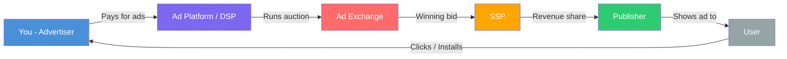
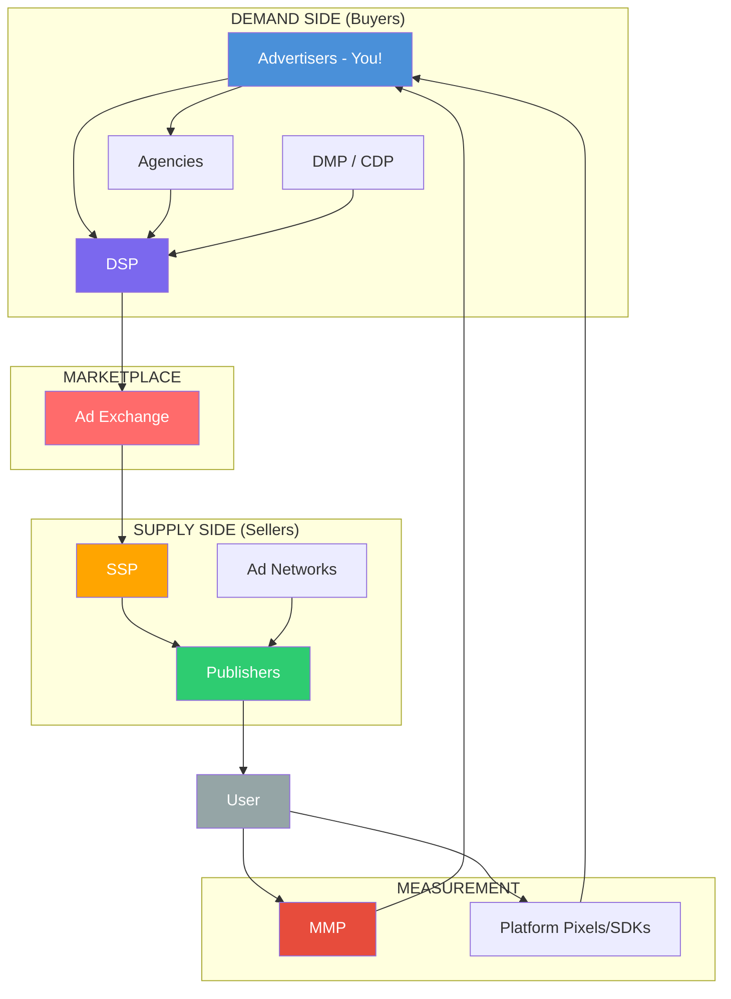

## Welcome to the world of digital advertising

Hey there! So you built an app and now you want people to actually find it. Welcome to the **ad ecosystem** — the entire universe of companies, technologies, and people that work together to show your ad to the right person at the right time.

If this all feels overwhelming, take a deep breath. We are going to break it down using a simple analogy that will make everything click.

<Tip>
  **Think of the ad ecosystem like a food delivery marketplace.** You (the advertiser) are the restaurant. The person hungry at home (the user) wants food. And in between, there is a whole system of apps, drivers, kitchens, and logistics making it all happen. By the end of this page, you will understand every player in that system.
</Tip>

---

## The restaurant analogy: understanding every player

Imagine you just opened a new restaurant. You make amazing food, but nobody knows you exist. You need customers. Here is how the ad ecosystem maps to the restaurant world:

| Ad ecosystem player | Restaurant analogy | What they do |
|---|---|---|
| **Advertiser (You)** | The restaurant owner | Creates ads, sets budgets, pays for visibility |
| **Publisher** | The food magazine / local TV station | Owns the space where ads appear |
| **User** | The hungry person at home | The real human being you want to reach |
| **Ad Platform** | DoorDash / Uber Eats (the big apps) | Connects restaurants with hungry people, runs the whole show |
| **Ad Network** | A food court that bundles many restaurants | Aggregates ad space from multiple publishers, sells it as a package |
| **DSP** | A smart ordering system for restaurants | Technology that lets advertisers buy ad space automatically across many places |
| **SSP** | A smart selling system for magazines | Technology that lets publishers sell their ad space automatically |
| **Ad Exchange** | The stock market, but for food delivery slots | Where buyers (DSPs) and sellers (SSPs) trade ad placements in real time |
| **DMP** | A customer database with everyone's food preferences | Collects and organizes audience data for better targeting |
| **MMP** | An independent food critic who settles disputes | Neutral third-party that measures which ads actually drive results |

<Note>
  If you are brand new to all of this, **do not panic**. You do not need to understand every single player to run your first ad. Focus on the big picture first. Think of this page as a reference guide you can come back to whenever you encounter a new term.
</Note>

---

## The core players: the ones you will interact with

These are the people and companies you will deal with directly when running ads. Let's get to know each one.

<CardGroup cols={2}>
  <Card title="Advertiser (That's You!)" icon="bullhorn">
    You are a company or person who wants to promote an app, product, or service. You create ads, decide who should see them, set how much money to spend, and pay the ad platforms. Advertisers range from solo indie developers spending $5/day to massive corporations spending millions. **No matter your size, you are an advertiser.**
  </Card>
  <Card title="Publisher (The Ad Space Owner)" icon="newspaper">
    A publisher is anyone who owns a digital space where ads can appear. This could be an app developer who shows ads inside their game, a website owner with banner ads, or a content creator. Publishers **make money by renting out their screen real estate** to advertisers. Think of them as landlords of the digital world.
  </Card>
  <Card title="User (Your Future Customer)" icon="user">
    This is a real human being scrolling through their phone, browsing a website, or watching a video. They are the person you want to reach with your message. **Everything in the entire ad ecosystem exists for one purpose: to connect your ad with the right user at the right time.**
  </Card>
  <Card title="Ad Platform (The Matchmaker)" icon="rectangle-ad">
    Companies like Meta, Google, TikTok, and Apple that run large advertising systems. They own both the tools where you create ads (demand side) AND the places where ads appear (supply side). They are like a dating app — they match advertisers with users. More on the major platforms below.
  </Card>
</CardGroup>

<Tip>
  **Pro Tip: As a beginner, the only players you really need to worry about right now are YOU (the advertiser), THE AD PLATFORM (Meta, Google, etc.), and A TRACKER (to measure results).** Everything else in the ecosystem becomes relevant as you grow and scale. Do not let the complexity scare you away from starting.
</Tip>

---

## The technology layer: the behind-the-scenes crew

These are the systems that power **programmatic** (automated) advertising behind the scenes. You probably will not interact with most of them directly when starting out, but understanding them helps you see the full picture — like knowing how a car engine works even if you just want to drive.

<AccordionGroup>
  <Accordion title="DSP — Demand-Side Platform (The Smart Shopper)">
    Imagine you want to put your restaurant flyer in 1,000 different magazines across the country. You could call each magazine individually (exhausting!), OR you could use a single tool that automatically places your flyer in the best magazines for you. That tool is a **DSP**.

    A **DSP** is software that advertisers use to buy ad space automatically across many publishers at once. Instead of negotiating with each website or app, you set your criteria and the DSP bids on placements in real time — often in less than 100 milliseconds.

    **Examples:** Google Display & Video 360 (DV360), The Trade Desk, Amazon DSP

    **Who uses them:** Typically medium-to-large advertisers or agencies spending $25K+ per month. If you are a beginner running ads directly on Meta or Google Ads, those platforms have DSP-like functionality built right in. You do not need a separate DSP.

    <Tip>
      **Pro Tip:** When someone says "programmatic advertising," they usually mean buying ads through a DSP. It sounds fancy, but it just means "automated ad buying." Meta Ads Manager and Google Ads are technically doing programmatic buying for you already.
    </Tip>
  </Accordion>

  <Accordion title="SSP — Supply-Side Platform (The Smart Seller)">
    Now flip the script. If you are the magazine (a publisher) and you have ad space to sell, you want to get the **highest price** for every ad slot. An SSP helps you do that by automatically selling your ad space to the highest bidder.

    An **SSP** is software that publishers use to sell their ad space automatically, maximizing revenue from each ad impression.

    **Examples:** Google Ad Manager, Magnite (formerly Rubicon Project), PubMatic

    **How it works:** A publisher connects their app or website to an SSP. When a user opens the app, the SSP instantly offers that ad slot to multiple DSPs. The highest bidder wins, and their ad is shown — all in milliseconds.
  </Accordion>

  <Accordion title="Ad Exchange (The Stock Market for Ads)">
    An **ad exchange** is the digital marketplace where DSPs (buyers) and SSPs (sellers) meet and trade. Think of it like a stock exchange, but instead of trading Apple shares, they are trading the opportunity to show an ad to a specific person at a specific moment.

    **Examples:** Google Ad Exchange (AdX), OpenX, Xandr (formerly AppNexus)

    **How it works:** When a user loads a page, the SSP sends the ad opportunity to the exchange. Multiple DSPs bid on it simultaneously. The highest bidder wins, their ad is displayed, and the entire process takes less than 100 milliseconds. It is like a lightning-fast auction that happens billions of times per day across the internet.
  </Accordion>

  <Accordion title="Ad Network (The Wholesale Distributor)">
    An **ad network** is like a wholesale distributor. It gathers ad space from many publishers and bundles it into packages that advertisers can buy. Instead of dealing with individual publishers, you buy through the network.

    **Examples:** Google AdMob (for mobile apps), Unity Ads (for games), AppLovin, ironSource

    **How it differs from an exchange:** An ad network typically bundles inventory and sells it at set prices, while an ad exchange runs real-time auctions. That said, many modern ad networks now use real-time bidding too — the lines are blurring.

    <Tip>
      **Pro Tip:** If you make a mobile game, you will likely encounter ad networks like Unity Ads and ironSource. They are especially popular in the gaming world because they offer rewarded video ads (users watch an ad to earn in-game rewards), which is a win-win for everyone.
    </Tip>
  </Accordion>

  <Accordion title="DMP — Data Management Platform (The Giant Rolodex)">
    A **DMP** collects, organizes, and activates audience data from many different sources — websites, apps, offline data, and third-party providers. Advertisers use DMPs to build detailed audience segments for more precise targeting.

    **Examples:** Oracle BlueKai, Lotame, Salesforce DMP

    **Important note:** DMPs are becoming **less central** to the ecosystem. Why? Because third-party cookies are being phased out and privacy regulations (like GDPR and Apple's ATT) are tightening. Many companies are shifting toward CDPs (Customer Data Platforms) instead, which focus on your own first-party data.

    Think of it this way: DMPs used to be like having a huge phone book of everyone's preferences. But now, privacy laws are making that phone book smaller and smaller. The future belongs to the data YOU collect directly from YOUR users.
  </Accordion>

  <Accordion title="CDP — Customer Data Platform (Your Own Customer Database)">
    A **CDP** collects first-party data — data you own — from your app, website, CRM, email system, and other sources to build a unified profile of each of your customers.

    **Examples:** Segment, mParticle, Treasure Data, Tealium

    **DMP vs CDP — what is the difference?**
    - **DMP:** Uses mostly third-party data (other people's data) for targeting strangers. Becoming less relevant due to privacy changes.
    - **CDP:** Uses first-party data (YOUR data) to understand your existing customers. Becoming MORE valuable as privacy tightens.

    <Tip>
      **Pro Tip:** As privacy changes make third-party data harder to use, your own first-party data becomes your most valuable advertising asset. Even if you do not set up a CDP right away, start collecting user data (with consent!) from day one. Your future self will thank you.
    </Tip>
  </Accordion>

  <Accordion title="MMP — Mobile Measurement Partner (The Neutral Referee)">
    This one is **really important** for app advertisers. An **MMP** is a third-party tracking tool that measures which ads drive app installs and in-app actions across ALL your advertising platforms.

    **Why do you need one?** Here is the problem: If you run ads on both Meta and Google, and someone installs your app, BOTH platforms will try to take credit for that install. It is like two friends both claiming they introduced you to your partner. An MMP is the neutral referee that determines who actually deserves credit.

    **Examples:** AppsFlyer, Adjust, Branch, Airbridge, Singular, Kochava

    **When do you need one?** Not on day one. But once you are advertising on 2 or more platforms and spending $1,000+ per month, an MMP becomes essential. Many offer free tiers — AppsFlyer gives you up to 10,000 free conversions per month.

    We cover MMPs in much more detail in the [Tracking & Attribution](/concepts/tracking-and-attribution) section.
  </Accordion>
</AccordionGroup>

---

## How money flows through the ecosystem

This is the big question: **when you spend $1 on ads, where does that dollar go?**

### The money trail, step by step

Let's follow your dollar from your wallet to the user's screen:

<Steps>
  <Step title="You deposit money into an ad platform">
    You put, say, $500 into your Meta Ads account. This money sits in your ad account balance, ready to be spent when your ads start running. Think of it like loading money onto a gift card.
  </Step>
  <Step title="You launch a campaign">
    You create an ad (with an image or video), pick your audience (say, "people aged 18-35 in the US who like fitness"), and set your daily budget (say, "$20/day"). The platform starts entering auctions on your behalf.
  </Step>
  <Step title="The auction happens — in milliseconds">
    Every time a user opens Instagram or scrolls through a webpage, an auction happens in the blink of an eye. Your ad competes against other advertisers' ads. The platform considers your bid, your ad's quality, and how likely THIS specific user is to engage. The best combination wins.
  </Step>
  <Step title="You pay when something happens">
    Depending on the pricing model, you pay when a user sees your ad (CPM), clicks it (CPC), or installs your app (CPI). The money is automatically deducted from your account balance.
  </Step>
  <Step title="The platform takes its cut">
    The ad platform keeps a percentage — typically 30-45% for programmatic ads. If your ad appeared on a third-party publisher's app (like a game that shows ads), the publisher gets their share.
  </Step>
  <Step title="The publisher gets paid">
    If your ad appeared on someone else's app or website (not Meta's own properties), the publisher receives their revenue share — typically 55-70% of what you paid. This is how free apps and websites make money.
  </Step>
</Steps>

<Tip>
  **Pro Tip: On "walled gardens" like Meta's own properties (Facebook, Instagram), Meta keeps 100% of the revenue because they own both the platform AND the ad space.** The publisher revenue share only applies when your ads appear on third-party sites or apps.
</Tip>

### Common pricing models

Here is a quick reference of how you might be charged:

| Model | Stands for | You pay when... | Typical range | Restaurant analogy |
|---|---|---|---|---|
| **CPM** | Cost Per Mille (1,000 impressions) | Your ad is shown 1,000 times | $2 - $30 | Paying for a billboard by the hour |
| **CPC** | Cost Per Click | Someone taps your ad | $0.10 - $5.00 | Paying only when someone walks into your restaurant |
| **CPI** | Cost Per Install | Someone installs your app | iOS ~$3.6, Android ~$1.2 (global avg) | Paying only when someone sits down and orders |
| **CPA** | Cost Per Action | Someone completes a specific action | $1.00 - $50.00+ | Paying only when someone becomes a regular customer |
| **CPV** | Cost Per View | Someone watches your video ad | $0.01 - $0.10 | Paying when someone watches your cooking show |

<Note>
  You do not always get to choose the pricing model directly. Most modern platforms use **CPM-based auctions** internally but let you **optimize toward** a specific goal (like installs or purchases). The platform then automatically figures out what CPM to bid to hit your target CPI or CPA. It is like telling DoorDash "I want to pay $3 per new customer" and letting them figure out the logistics.
</Note>

---

## CPI benchmarks you should know

Since you are here to promote an app, let's talk about what it actually costs to get someone to install it. These numbers vary a LOT based on app category, country, and platform, but here are the key benchmarks:

| Category | Android CPI (Global) | iOS CPI (Global) | Notes |
|---|---|---|---|
| **All apps average** | ~$1.2 | ~$3.6 | iOS is roughly 3x more expensive |
| **Casual games** | ~$1.5 | ~$2.5 | Highest volume category |
| **Finance apps** | $3 - $8+ | $5 - $8+ | Most expensive category on iOS |
| **Social / Communication** | $1 - $3 | $2 - $5 | Competitive but scalable |
| **Health & Fitness** | $1.5 - $4 | $2.5 - $6 | Seasonal spikes in January |
| **E-commerce** | $1.5 - $4 | $2.5 - $6 | Revenue offsets cost |
| **Education** | $1 - $3 | $2 - $5 | Back-to-school seasonality |

<Tip>
  **Pro Tip: iOS installs are almost always more expensive than Android installs.** This is because iOS users tend to spend more money in apps (higher lifetime value), so more advertisers compete to reach them, driving up prices. If you are on a tight budget and your app supports both platforms, consider starting with Android campaigns to get more installs per dollar while you learn.
</Tip>

---

## Supply side vs. demand side

The ecosystem is often split into two halves, just like a marketplace has buyers and sellers:

<Tabs>
  <Tab title="Demand Side (The Buyers)">
    The demand side includes everyone involved in **buying** ad space:

    - **Advertisers** — companies paying for ads (that is you!)
    - **Agencies** — companies that manage ads on behalf of advertisers
    - **DSPs** — technology platforms for automated buying
    - **DMPs / CDPs** — data tools for audience targeting

    **Your goal on the demand side:** Reach the right user at the lowest possible cost.

    When people say "demand-side," they mean the side that creates demand for ad space. More advertisers wanting to show ads = more demand = higher prices. It is basic economics applied to advertising.

    Think of it like this: during Black Friday, every e-commerce brand wants ad space. Demand skyrockets, so ad prices go up — sometimes 2-3x higher than normal.
  </Tab>
  <Tab title="Supply Side (The Sellers)">
    The supply side includes everyone involved in **selling** ad space:

    - **Publishers** — owners of apps, websites, and content
    - **SSPs** — technology platforms for automated selling
    - **Ad Networks** — aggregators of publisher inventory

    **The goal on the supply side:** Maximize revenue from every ad impression.

    When people say "supply-side," they mean the side that supplies the ad space. More apps and websites offering ad slots = more supply = lower prices.

    This is why ad costs can be cheaper on newer platforms or during off-peak hours — there is plenty of supply but less demand.
  </Tab>
</Tabs>

### Supply and demand economics in ads

This is basic economics, and it directly affects how much you pay:

- **High demand + Low supply** = Expensive ads (holiday season, Black Friday, Super Bowl)
- **Low demand + High supply** = Cheap ads (January, early mornings, weekdays)
- **Competitive niches** = Higher CPMs (finance, insurance, legal — everyone wants these users)
- **Broad consumer apps** = More moderate CPMs (entertainment, social, utilities)

<Tip>
  **Pro Tip: Timing matters enormously.** CPMs can be 2-3x higher during Q4 (October-December) because every e-commerce brand is fighting for the same users during holiday shopping season. If your app is not seasonal, consider spending MORE in Q1 (January-March) when ad costs drop significantly. You will get the same users for much less money.
</Tip>

---

## Walled gardens vs. the open web

This is one of the most important concepts in digital advertising. Pay attention!

<Tabs>
  <Tab title="Walled Gardens (The Big Castles)">
    A **walled garden** is a platform that controls the ENTIRE advertising experience — the ad buying tools, the ad placements, the user data, AND the measurement. They do not share their user data with anyone outside their walls.

    Think of it like a theme park: once you are inside Disney World, Disney controls everything — the rides, the food, the merchandise, and the experience. You cannot bring in outside vendors.

    ### The major walled gardens

    | Platform | Properties | What makes them powerful |
    |---|---|---|
    | **Meta** | Facebook, Instagram, WhatsApp, Messenger | Data on 3B+ users, incredible targeting |
    | **Google** | Search, YouTube, Gmail, Maps, Play Store, AdMob | Spans search, video, apps, email — largest ad revenue globally |
    | **Apple** | App Store, Apple News, Stocks app | Controls the iOS ecosystem, high-intent App Store search |
    | **Amazon** | Amazon.com, Twitch, IMDb | Has actual purchase data (incredibly valuable) |
    | **TikTok** | TikTok app | Massive engagement data, especially younger demographics |

    ### Why start with walled gardens

    - **Massive reach** — billions of users in one place
    - **Powerful targeting** — they know so much about their users
    - **Simple interfaces** — designed for self-serve, even beginners
    - **Strong algorithms** — their optimization is incredibly sophisticated

    ### The downside of walled gardens

    - No cross-platform data sharing (Meta will not tell Google about their users)
    - Limited transparency (you cannot see exactly how decisions are made)
    - Each platform "grades its own homework" (they report their own performance metrics)
    - Platform dependency (an algorithm change can tank your performance overnight)
  </Tab>
  <Tab title="Open Web / Programmatic (The Wild West)">
    The **open web** refers to all the websites, apps, and content NOT owned by the big walled gardens. Advertising here happens through **programmatic** channels — DSPs, SSPs, and ad exchanges.

    Think of it like the open road versus a theme park. More freedom, more variety, but also more complexity and risk.

    ### Examples of open web advertising
    - Banner ads on news websites
    - Video ads in independent mobile games
    - Native ads on blogs and content sites
    - Connected TV (CTV) ads on streaming services

    ### Pros
    - Access to huge, diverse inventory
    - More transparency and control over where your ads appear
    - Ability to use your own data (via DMPs/CDPs)
    - Not dependent on a single platform

    ### Cons
    - More complex to manage (DSPs have steep learning curves)
    - Higher risk of ad fraud (fake clicks, bot traffic)
    - Lower targeting precision (less first-party data available)
    - Requires more technical expertise

    <Warning>
      **For beginners: start with walled gardens.** Meta and Google Ads are the easiest to set up and offer the best performance for most app advertisers. Programmatic / open web advertising is an advanced strategy you can explore once you are spending $10K+ per month and want to diversify.
    </Warning>
  </Tab>
</Tabs>

---

## Self-serve vs. managed advertising

There are two ways to buy ads on most platforms:

<CardGroup cols={2}>
  <Card title="Self-Serve (DIY)" icon="laptop">
    **You do everything yourself** through the platform's ad manager. You create campaigns, set budgets, upload creatives, monitor performance, and optimize.

    **Best for:** Small to medium budgets, startups, indie developers, anyone who wants full control and wants to learn.

    **Platforms with self-serve:** Meta Ads Manager, Google Ads, TikTok Ads Manager, Apple Search Ads, Snap Ads, LinkedIn Ads.

    **Minimum spend:** Often as low as $1-5/day. Seriously.
  </Card>
  <Card title="Managed Service (White Glove)" icon="handshake">
    **A dedicated team at the platform manages your campaigns for you.** You get a sales rep, strategic guidance, custom audiences, and premium placements.

    **Best for:** Large budgets ($50K+/month), enterprise companies, brands that want expert help.

    **Examples:** Meta Business Partners, Google Premium Partners, TikTok managed accounts.

    **Minimum spend:** Usually $10K-50K+/month minimum commitments.
  </Card>
</CardGroup>

<Tip>
  **Pro Tip: If you are reading this guide, self-serve is absolutely the way to go.** You will learn faster, maintain full control, and can start with any budget. Do not be intimidated — the platforms are designed for people like you. Managed services are for later, when you are spending at scale and want extra expert help.
</Tip>

---

## The ad ecosystem by platform: a quick comparison

Here is a handy reference table so you know which platform does what:

| Platform | Type | Where ads appear | Best audience | Min budget | Difficulty |
|---|---|---|---|---|---|
| **Meta** (Facebook/Instagram) | Walled garden | Social feeds, Stories, Reels, Messenger | Broad consumer | ~$5/day | Medium |
| **Google Ads** | Walled garden | Search, YouTube, Display, Play Store | Intent-based (search) + broad (display) | ~$10/day | Medium-High |
| **Apple Search Ads** | Walled garden | App Store search results | High-intent iOS users | ~$5/day | Low |
| **TikTok Ads** | Walled garden | TikTok feed, Pangle network | Gen Z and Millennials | ~$20/day | Medium |
| **Unity Ads** | Ad network | Mobile games | Gamers | Varies | Medium |
| **The Trade Desk** | DSP | Open web (display, video, CTV, audio) | Broad | $25K+ min | High |
| **Snap Ads** | Walled garden | Snapchat | Young audience (13-34) | ~$5/day | Medium |

<Tip>
  **Pro Tip for your first campaign: Start with Meta (Facebook/Instagram) or Apple Search Ads.** Meta gives you the best combination of reach, targeting, and ease of use. Apple Search Ads has the highest conversion rates because users are literally searching the App Store for apps — they are ready to install. Both are excellent starting points.
</Tip>

---

## The complete ecosystem map

Here is the full picture of how every player connects. Do not worry about memorizing this — just use it as a reference:

---

## Key takeaways

<Steps>
  <Step title="The ecosystem has two sides">
    The **demand side** (advertisers buying ads) and the **supply side** (publishers selling ad space), connected by exchanges and networks. You are on the demand side.
  </Step>
  <Step title="Walled gardens dominate — start there">
    Meta, Google, Apple, TikTok, and Amazon control most digital advertising. They have the best targeting, the most users, and the easiest interfaces. Start here.
  </Step>
  <Step title="Money flows from you to the platform to the publisher">
    You pay the platform, the platform takes a cut (30-45%), and the publisher gets the rest. On walled gardens where ads appear on the platform's own properties, the platform keeps everything.
  </Step>
  <Step title="Tracking ties it all together">
    Without tracking (pixels, SDKs, MMPs), you have no idea which ads work. Tracking is not optional — it is the foundation of every decision you will make.
  </Step>
  <Step title="Start simple, scale smart">
    You do NOT need a DSP, DMP, CDP, or programmatic strategy to get started. Pick one platform, set up tracking, and launch your first campaign. That is it. The rest comes later.
  </Step>
</Steps>

---

## Glossary of ecosystem terms

Here is a handy glossary you can reference anytime:

| Term | Definition |
|---|---|
| **Advertiser** | The company or person paying for ads (that is you!) |
| **Publisher** | The owner of an app or website where ads appear |
| **Ad Platform** | A company that connects advertisers with users (Meta, Google, etc.) |
| **DSP** | Demand-Side Platform — software for buying ads automatically |
| **SSP** | Supply-Side Platform — software for selling ad space automatically |
| **Ad Exchange** | A digital marketplace where DSPs and SSPs trade ad impressions in real time |
| **Ad Network** | A company that gathers publisher ad space and sells it as a bundle |
| **DMP** | Data Management Platform — organizes audience data from many sources |
| **CDP** | Customer Data Platform — unifies your own first-party customer data |
| **MMP** | Mobile Measurement Partner — neutral referee that tracks app installs across platforms |
| **Walled Garden** | A platform that controls its own data, ads, and measurement (Meta, Google, etc.) |
| **Programmatic** | Automated, real-time buying and selling of ad space |
| **Self-Serve** | Buying ads yourself through a platform's ad manager interface |
| **Impression** | One instance of your ad being shown to a user |
| **Inventory** | The total ad space available for sale |
| **CPI** | Cost Per Install — what you pay when someone installs your app |
| **First-party data** | Data you collect directly from your own users (most valuable) |
| **Third-party data** | Data collected by external companies about people you do not know (becoming less available) |

---

## Next up

Now that you understand the landscape and all the players, let's learn how campaigns are actually organized inside these platforms.

<Card
  title="Campaign Structure"
  icon="arrow-right"
  href="/concepts/campaign-structure"
>
  The 3-level hierarchy every ad platform uses — and how to use it like a pro.
</Card>
