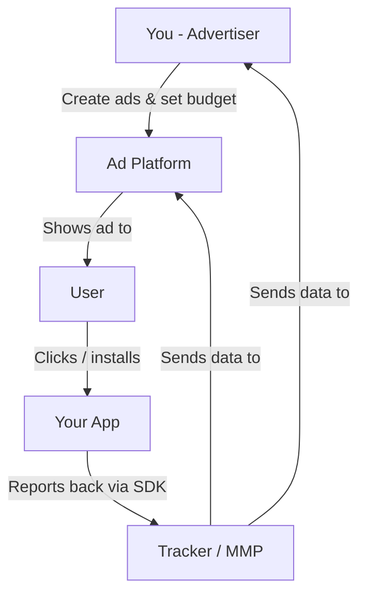

## The players

Digital advertising has a lot of jargon, but there are really only **4 players** you need to know:

<CardGroup cols={2}>
  <Card title="1. You (The Advertiser)" icon="user">
    You have an app. You want people to use it. You're willing to pay money to make that happen.
  </Card>
  <Card title="2. The User" icon="smartphone">
    A real person scrolling their phone. They might need your app — they just don't know it yet.
  </Card>
  <Card title="3. The Platform" icon="layout-dashboard">
    Meta, Google, TikTok, Apple. They own the space where users spend time. They sell access to those users.
  </Card>
  <Card title="4. The Tracker" icon="activity">
    Tools (like AppsFlyer, Adjust, or the platform's own pixel/SDK) that tell you what happened after someone saw your ad.
  </Card>
</CardGroup>

## How they connect

### The flow in plain English:

<Steps>
  <Step title="You create an ad on a platform">
    You upload an image or video, write some text, pick who should see it, and set a budget.
  </Step>
  <Step title="The platform shows your ad to users">
    Based on your targeting, the platform puts your ad in front of the right people.
  </Step>
  <Step title="A user sees your ad and (hopefully) installs your app">
    They tap the ad, go to the App Store / Play Store, and download your app.
  </Step>
  <Step title="The tracker records what happened">
    Your tracking tool (SDK inside your app) detects the install and reports it back.
  </Step>
  <Step title="You see the results">
    You can now see: how many installs, how much each one cost, which ad worked best.
  </Step>
</Steps>

## Why does this matter?

Because **tracking is the backbone of everything**.

Without proper tracking:
- You don't know which ads are working
- You can't optimize (improve) your campaigns
- You're flying blind, burning money

<Warning>
  Setting up tracking **before** you run your first ad is not optional. It's the single most important step.
  We'll walk you through it in the [Set Up Tracking](/first-campaign/set-up-tracking) section.
</Warning>

## The major platforms at a glance

| Platform | Best for | Minimum budget | Difficulty |
|----------|----------|---------------|------------|
| **Meta** (Facebook/Instagram) | Consumer apps, broad reach | $5/day | Medium |
| **Google Ads** | People actively searching | $10/day | Medium-High |
| **Apple Search Ads** | iOS apps, high-intent users | $5/day | Low |
| **TikTok Ads** | Young audience, viral potential | $20/day | Medium |

<Tip>
  **Our recommendation for your first campaign:** Start with **Meta** or **Apple Search Ads**.
  Meta gives you the biggest reach. Apple Search Ads gives you the highest quality users (they're literally searching for apps).
</Tip>

## Next up

Let's understand how campaigns are structured — it's simpler than you think.

<Card
  title="Campaign Structure →"
  icon="arrow-right"
  href="/concepts/campaign-structure"
>
  The 3-level structure every platform uses.
</Card>
