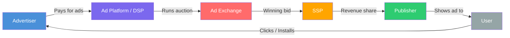

## What is the ad ecosystem?

The "ad ecosystem" is the entire network of companies, technologies, and people involved in getting an ad from an advertiser (that's you) to a user (that's your future customer). Think of it like a city's transportation system — there are roads, traffic lights, drivers, passengers, and a whole infrastructure that makes everything work together.

At its core, digital advertising is a marketplace. One side has people who want to show ads (**demand side**), and the other side has people who have space to show those ads (**supply side**). Everything in between exists to connect these two sides as efficiently as possible.

<Note>
  If you are brand new to advertising, don't worry about memorizing every player right now. Focus on understanding the **big picture** first, and come back to this page as you encounter these terms in the real world.
</Note>

---

## All the players — who does what?

### The core players

These are the people and companies you will interact with directly.

<CardGroup cols={2}>
  <Card title="Advertiser (You)" icon="bullhorn">
    A company or individual that wants to promote a product, app, or service. You create ads, set budgets, choose audiences, and pay money to get your message in front of people. Advertisers range from solo app developers spending $10/day to global brands spending millions.
  </Card>
  <Card title="Publisher" icon="newspaper">
    Anyone who owns a digital property where ads can be shown. This includes app developers (who show ads inside their apps), website owners (who show banner or video ads), and content creators. Publishers make money by renting out their screen space to advertisers.
  </Card>
  <Card title="User (The Audience)" icon="user">
    A real human being scrolling through their phone, browsing a website, or watching a video. They are the person you are trying to reach. Everything in the ecosystem exists to connect your ad with the right user at the right time.
  </Card>
  <Card title="Ad Platform" icon="layout-dashboard">
    Companies like Meta, Google, TikTok, and Apple that operate large advertising systems. They own both the demand side (where advertisers create campaigns) and the supply side (where ads appear on their properties). More on this below.
  </Card>
</CardGroup>

### The technology layer

These are the systems that power programmatic (automated) advertising behind the scenes. You may never interact with them directly, but understanding them helps you see the full picture.

<AccordionGroup>
  <Accordion title="DSP — Demand-Side Platform">
    A **DSP** is software that advertisers (or their agencies) use to buy ad space automatically across many publishers at once. Instead of contacting each website or app individually, you use a DSP to bid on ad placements in real time.

    **Examples:** Google Display & Video 360 (DV360), The Trade Desk, Amazon DSP, MediaMath

    **How it works:** You upload your ads, set your targeting criteria and budget, and the DSP automatically bids on ad placements that match your requirements — often in milliseconds.

    **Who uses them:** Typically medium-to-large advertisers or agencies. If you are a beginner running ads on Meta or Google Ads directly, you are not using a separate DSP — those platforms have DSP functionality built in.
  </Accordion>

  <Accordion title="SSP — Supply-Side Platform">
    An **SSP** is the publisher's equivalent of a DSP. It is software that publishers use to sell their ad space automatically, maximizing the revenue they earn from each impression.

    **Examples:** Google Ad Manager, Magnite (formerly Rubicon Project), PubMatic, OpenX

    **How it works:** A publisher connects their app or website to an SSP. When a user loads a page or opens an app, the SSP offers that ad impression to multiple DSPs simultaneously, and the highest bidder wins.
  </Accordion>

  <Accordion title="Ad Exchange">
    An **ad exchange** is the digital marketplace where DSPs and SSPs meet. Think of it as a stock exchange, but for ad space. Buyers (DSPs) and sellers (SSPs) trade ad impressions in real time through automated auctions.

    **Examples:** Google Ad Exchange (AdX), OpenX, Xandr (formerly AppNexus)

    **How it works:** When a user loads a page, the SSP sends the ad opportunity to the exchange. Multiple DSPs bid on it. The highest bidder wins, their ad is displayed, and the whole process takes less than 100 milliseconds.
  </Accordion>

  <Accordion title="Ad Network">
    An **ad network** aggregates ad space from multiple publishers and sells it to advertisers as a package. They sit between advertisers and publishers, simplifying the buying process.

    **Examples:** Google AdMob (for mobile apps), Unity Ads (for games), ironSource, AppLovin

    **How it differs from an exchange:** An ad network typically bundles inventory and sells it at a set price, while an ad exchange runs real-time auctions. Many modern ad networks now operate like exchanges with real-time bidding.
  </Accordion>

  <Accordion title="DMP — Data Management Platform">
    A **DMP** collects, organizes, and activates audience data from multiple sources (websites, apps, offline data, third-party providers). Advertisers use DMPs to build detailed audience segments for targeting.

    **Examples:** Oracle BlueKai, Lotame, Salesforce DMP (formerly Krux)

    **Important note:** DMPs have become less central as third-party cookies are being phased out and privacy regulations tighten. Many companies are shifting toward CDPs instead.
  </Accordion>

  <Accordion title="CDP — Customer Data Platform">
    A **CDP** collects first-party data (data you own) from your app, website, CRM, and other sources to build a unified customer profile. Unlike a DMP, a CDP focuses on **your own users** rather than third-party data.

    **Examples:** Segment, mParticle, Treasure Data, Tealium

    **Why it matters:** As privacy changes make third-party data less available, your first-party data (from your CDP) becomes your most valuable advertising asset. CDPs help you use that data across ad platforms.
  </Accordion>

  <Accordion title="MMP — Mobile Measurement Partner">
    An **MMP** is a third-party tracking tool that measures which ads drive app installs and in-app actions across all your advertising platforms. Think of it as a neutral referee that determines which ad platform deserves credit for each conversion.

    **Examples:** AppsFlyer, Adjust, Branch, Airbridge, Singular, Kochava

    **Why you need one:** If you run ads on Meta AND Google, both platforms will try to claim credit for the same install. An MMP provides a single source of truth by using standardized attribution methods.
  </Accordion>
</AccordionGroup>

<Tip>
  **If you are just starting out**, the only players you need to worry about are: **you** (the advertiser), **the ad platform** (Meta, Google, etc.), and **a tracker** (platform SDK or MMP). Everything else becomes relevant as you scale.
</Tip>

---

## How money flows through the ecosystem

This is the fundamental question: where does your advertising dollar go?

### The money trail, step by step

<Steps>
  <Step title="You set a budget">
    You deposit money into an ad platform (say, $500 into Meta Ads). This money sits in your ad account, ready to be spent.
  </Step>
  <Step title="You launch a campaign">
    You create an ad, choose your audience, and set how much you are willing to pay per result. The platform starts entering auctions on your behalf.
  </Step>
  <Step title="The auction happens (in milliseconds)">
    Every time a user opens their app or loads a page, an auction runs. Your ad competes against other advertisers' ads. The platform considers your bid, your ad quality, and the estimated action rate to determine the winner.
  </Step>
  <Step title="You pay when something happens">
    Depending on the model, you pay when a user sees your ad (CPM), clicks it (CPC), or installs your app (CPI). The money is deducted from your account balance.
  </Step>
  <Step title="The platform takes its cut">
    The ad platform keeps a percentage (typically 30-45% for programmatic, though this varies). If your ad appeared on a third-party publisher's app, the publisher gets their share of the revenue.
  </Step>
  <Step title="The publisher gets paid">
    If ads appear on third-party apps or websites (not the platform's own properties), the publisher receives their revenue share — typically 55-70% of what the advertiser paid.
  </Step>
</Steps>

### Common pricing models

| Model | What it stands for | You pay when... | Typical cost |
|-------|-------------------|-----------------|--------------|
| **CPM** | Cost Per Mille (1,000 impressions) | Your ad is shown 1,000 times | $2 - $30 |
| **CPC** | Cost Per Click | Someone clicks your ad | $0.10 - $5.00 |
| **CPI** | Cost Per Install | Someone installs your app | $0.50 - $10.00 |
| **CPA** | Cost Per Action | Someone completes a specific action | $1.00 - $50.00+ |
| **CPV** | Cost Per View | Someone watches your video ad | $0.01 - $0.10 |
| **ROAS** | Return On Ad Spend | (Not a pricing model, but a target metric) | Varies |

<Note>
  You do not always get to choose the pricing model. Most modern platforms use **CPM-based auctions** internally but let you **optimize toward** a specific goal (installs, conversions, etc.). The platform then figures out the right CPM bid to hit your target CPI or CPA.
</Note>

---

## Supply side vs. demand side

The ecosystem is often split into two halves:

<Tabs>
  <Tab title="Demand Side (Buyers)">
    The demand side includes everyone involved in **buying** ad space:

    - **Advertisers** — the companies paying for ads
    - **Agencies** — companies that manage ads on behalf of advertisers
    - **DSPs** — the technology for automated buying
    - **DMPs/CDPs** — the data tools for audience targeting

    **Your goal on the demand side:** Reach the right user at the lowest possible cost.

    When people say "demand-side," they mean the side that creates demand for ad space. More advertisers wanting to show ads = more demand = higher prices.
  </Tab>
  <Tab title="Supply Side (Sellers)">
    The supply side includes everyone involved in **selling** ad space:

    - **Publishers** — the owners of apps, websites, and content
    - **SSPs** — the technology for automated selling
    - **Ad Networks** — aggregators of publisher inventory

    **The goal on the supply side:** Maximize revenue from every ad impression.

    When people say "supply-side," they mean the side that supplies the ad space. More apps and websites offering ad slots = more supply = lower prices.
  </Tab>
</Tabs>

### Supply and demand economics in ads

This is basic economics applied to advertising:

- **High demand + Low supply** = Expensive ads (e.g., holiday season, Black Friday)
- **Low demand + High supply** = Cheap ads (e.g., January, early mornings)
- **Competitive niches** = Higher CPMs (finance, insurance, legal)
- **Broad consumer apps** = More moderate CPMs (entertainment, social, utility)

<Tip>
  **Timing matters.** CPMs can be 2-3x higher during Q4 (October-December) because every e-commerce brand is competing for the same users during the holiday shopping season. If your app is not seasonal, consider spending more in Q1 (January-March) when ad costs drop.
</Tip>

---

## Walled gardens vs. the open web

This is one of the most important distinctions in digital advertising.

<Tabs>
  <Tab title="Walled Gardens">
    A **walled garden** is a platform that controls the entire advertising experience — the ad buying tools, the ad placements, the user data, and the measurement. They do not share their user data with anyone outside their ecosystem.

    ### The major walled gardens

    | Platform | Properties | Why it's a walled garden |
    |----------|-----------|------------------------|
    | **Meta** | Facebook, Instagram, WhatsApp, Messenger | Has data on 3B+ users, only lets you target inside their platforms, controls measurement |
    | **Google** | Search, YouTube, Gmail, Maps, Play Store, AdMob | Spans search, video, apps, and email; largest digital ad revenue globally |
    | **Apple** | App Store, Apple News, Stocks app | Controls the iOS ecosystem, requires ATT consent, runs Search Ads |
    | **Amazon** | Amazon.com, Twitch, IMDb | Has purchase data (incredibly valuable), growing ad business |
    | **TikTok** | TikTok app | Massive engagement data on younger demographics |

    ### Pros of walled gardens
    - Massive reach (billions of users)
    - Powerful targeting based on rich first-party data
    - Simple, self-serve ad buying interfaces
    - Strong optimization algorithms

    ### Cons of walled gardens
    - No cross-platform data sharing
    - Limited transparency into how decisions are made
    - Each platform grades its own homework (measurement)
    - Platform dependency (algorithm changes can tank your performance overnight)
  </Tab>
  <Tab title="Open Web / Programmatic">
    The **open web** (or open internet) refers to all the websites, apps, and content that are not owned by the major walled gardens. Advertising on the open web typically happens through **programmatic** channels — DSPs, SSPs, and ad exchanges.

    ### How it works
    You use a DSP to bid on ad placements across thousands of independent websites and apps. The ad inventory flows through SSPs and ad exchanges.

    ### Examples of open web advertising
    - Banner ads on news websites
    - Video ads in independent mobile games
    - Native ads on blogs and content sites
    - Connected TV (CTV) ads on streaming services

    ### Pros of the open web
    - Access to huge and diverse inventory
    - More transparency and control over placements
    - Ability to use your own data (via DMPs/CDPs)
    - Not dependent on a single platform

    ### Cons of the open web
    - More complex to manage (DSPs have steep learning curves)
    - Higher risk of ad fraud
    - Lower targeting precision (less first-party data)
    - Requires more technical expertise

    <Warning>
      **For beginners, start with walled gardens.** Meta and Google Ads are the easiest to set up and offer the best performance for most app advertisers. Programmatic / open web advertising is an advanced strategy you can explore later.
    </Warning>
  </Tab>
</Tabs>

---

## Self-serve vs. managed advertising

There are two ways to buy ads on most platforms:

<CardGroup cols={2}>
  <Card title="Self-Serve" icon="laptop">
    **You do everything yourself** through the platform's ad manager interface. You create campaigns, set budgets, upload creatives, monitor performance, and optimize.

    **Best for:** Small to medium budgets, startups, indie developers, anyone who wants full control.

    **Platforms with self-serve:** Meta Ads Manager, Google Ads, TikTok Ads Manager, Apple Search Ads (Basic and Advanced), Twitter/X Ads, Snap Ads, LinkedIn Ads.

    **Minimum spend:** Often as low as $1-5/day.
  </Card>
  <Card title="Managed Service" icon="handshake">
    **A dedicated team at the platform manages your campaigns for you.** You get a sales rep, strategic guidance, custom audiences, and premium placements.

    **Best for:** Large budgets ($50K+/month), enterprise companies, brands that want white-glove service.

    **Examples:** Meta Business Partners, Google Premium Partners, TikTok managed accounts, programmatic managed service providers.

    **Minimum spend:** Usually $10K-50K+/month minimum commitments.
  </Card>
</CardGroup>

<Tip>
  **If you are reading this guide, self-serve is the way to go.** You will learn faster, maintain full control, and can start with any budget. Managed services are for later, when you are spending at scale and want expert help optimizing.
</Tip>

---

## The ad ecosystem by platform

Here is a quick comparison of the major platforms and where they fit:

| Platform | Type | Supply | Best audience | Minimum budget | Difficulty |
|----------|------|--------|--------------|----------------|------------|
| **Meta** (Facebook/Instagram) | Walled garden | Social feeds, Stories, Reels, Messenger | Broad consumer | ~$5/day | Medium |
| **Google Ads** | Walled garden | Search, YouTube, Display, Play Store | Intent-based (search) + broad (display) | ~$10/day | Medium-High |
| **Apple Search Ads** | Walled garden | App Store search results | High-intent iOS users | ~$5/day | Low |
| **TikTok Ads** | Walled garden | TikTok feed, Pangle network | Gen Z and Millennials | ~$20/day | Medium |
| **Unity Ads** | Ad network | Mobile games | Gamers | Varies | Medium |
| **The Trade Desk** | DSP | Open web (display, video, CTV, audio) | Broad | $25K+ min | High |
| **Twitter/X Ads** | Walled garden | Twitter/X feed | News/tech/crypto/sports fans | ~$1/day | Medium |
| **Snap Ads** | Walled garden | Snapchat | Young audience (13-34) | ~$5/day | Medium |

---

## The complete ecosystem — how it all connects

Here is the full picture of how every player connects:

---

## Key takeaways

<Steps>
  <Step title="The ecosystem has two sides">
    The **demand side** (advertisers buying ads) and the **supply side** (publishers selling ad space), connected by exchanges and networks.
  </Step>
  <Step title="Walled gardens dominate">
    Meta, Google, Apple, TikTok, and Amazon control most of digital advertising. Start here. They have the best targeting, the most users, and the easiest interfaces.
  </Step>
  <Step title="Money flows from advertiser to platform to publisher">
    You pay the platform, the platform takes a cut, and the publisher gets the rest. On walled gardens (where ads appear on the platform's own properties), the platform keeps everything.
  </Step>
  <Step title="Tracking ties it all together">
    Without tracking (pixels, SDKs, MMPs), you cannot know which ads work. Tracking is not optional — it is the foundation of everything.
  </Step>
  <Step title="Start simple, scale smart">
    You do not need a DSP, DMP, CDP, or programmatic strategy to get started. Pick one platform, set up tracking, and launch your first campaign.
  </Step>
</Steps>

---

## Glossary of ecosystem terms

| Term | Definition |
|------|-----------|
| **Advertiser** | The company or person paying for ads |
| **Publisher** | The owner of an app or website where ads appear |
| **Ad Platform** | A company that connects advertisers with users (Meta, Google, etc.) |
| **DSP** | Demand-Side Platform — software for buying ads programmatically |
| **SSP** | Supply-Side Platform — software for selling ad space programmatically |
| **Ad Exchange** | A digital marketplace where DSPs and SSPs trade ad impressions |
| **Ad Network** | A company that aggregates publisher inventory and sells it to advertisers |
| **DMP** | Data Management Platform — organizes audience data from many sources |
| **CDP** | Customer Data Platform — unifies your first-party customer data |
| **MMP** | Mobile Measurement Partner — tracks app installs and events across platforms |
| **Walled Garden** | A platform that controls its own data, ads, and measurement |
| **Programmatic** | Automated, real-time buying and selling of ad space |
| **Self-Serve** | Buying ads yourself through a platform's interface |
| **Managed Service** | Having a team at the platform manage your ads for you |
| **Impression** | One instance of your ad being shown to a user |
| **Inventory** | The total ad space available for sale |

---

## Next up

Now that you understand the landscape, let's learn how campaigns are structured inside these platforms.

<Card
  title="Campaign Structure"
  icon="arrow-right"
  href="/concepts/campaign-structure"
>
  The 3-level hierarchy every ad platform uses — and how to use it strategically.
</Card>
