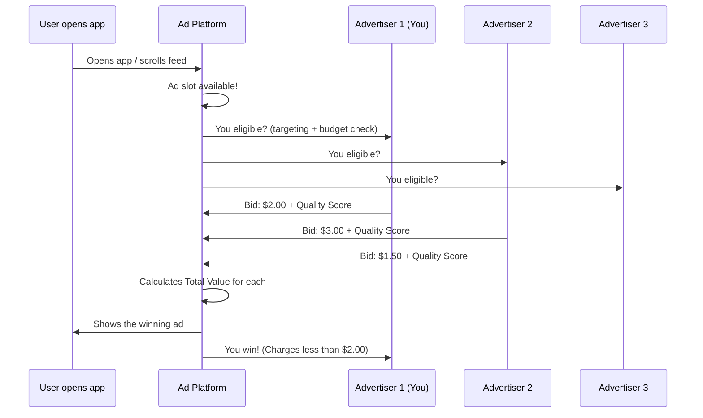
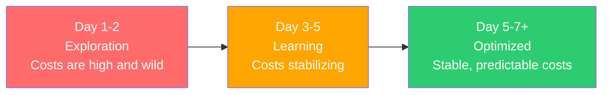
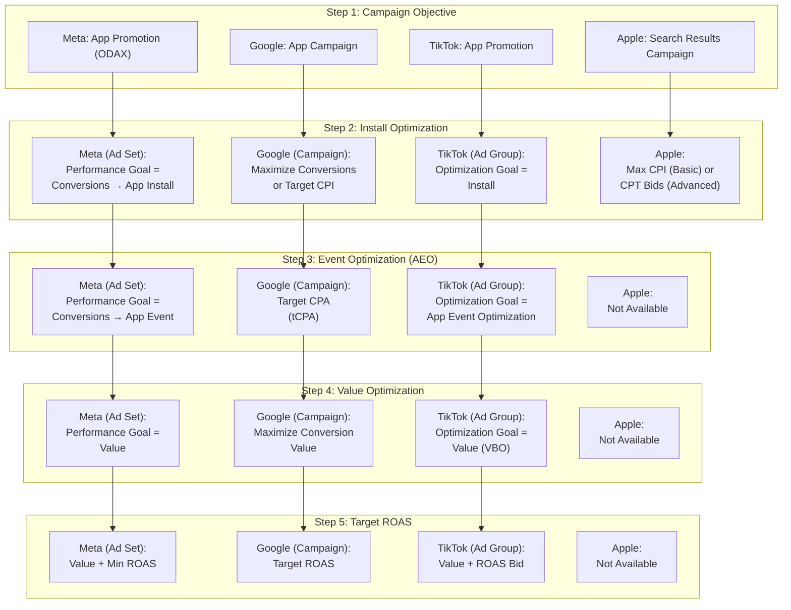

## The two money decisions you always make

Every time you run ads, you make two fundamental decisions:

1. **Budget:** How much total money am I willing to spend?
2. **Bid:** How much am I willing to pay for a single result (a click, an install, a purchase)?

Think of it like going to an auction house. Your **budget** is how much cash you brought in your wallet. Your **bid** is the maximum you will raise your paddle for any single item. Get these right, and your ads become a money-making machine. Get them wrong, and you burn through cash with nothing to show for it.

<Tip>
  **Pro Tip: Do not overthink this as a beginner.** Start with automatic bidding and a reasonable daily budget. You can always fine-tune later once you have real data. The worst thing you can do is get paralyzed by the options and never launch.
</Tip>

---

## How ad auctions actually work

Here is something amazing: every time someone opens Instagram, loads a webpage, or scrolls through TikTok, an **auction** happens in milliseconds. Millions of auctions happen every second, all day, every day. Let's peek behind the curtain.



Wait — the person with the **lowest bid** won? How? That brings us to the most important concept in ad auctions.

### The auction formula: it is NOT just about money

Most platforms do NOT simply pick the highest bidder. They calculate a **Total Value** score:

```
Total Value = Bid Amount x Estimated Action Rate x Ad Quality Score
```

| Component | What it means | How you influence it |
|---|---|---|
| **Bid Amount** | How much you are willing to pay | Set directly or let the platform decide |
| **Estimated Action Rate** | How likely THIS specific user is to take your desired action | Better targeting, historical performance data |
| **Ad Quality Score** | How good, relevant, and engaging your ad is | Create better ads! Better images, videos, copy |

<Tip>
  **Pro Tip: This formula is the reason why great ads literally SAVE you money.** An advertiser bidding $1.50 with an excellent ad quality score can beat an advertiser bidding $3.00 with a boring ad. The platforms WANT to show good ads because good ads keep users on the platform. Investing in creative quality is not just about performance — it directly reduces your costs in every single auction.
</Tip>

### What you actually pay (it is less than you think)

Here is another surprise: you usually pay LESS than your maximum bid.

| Auction type | What you pay | Where it is used |
|---|---|---|
| **Second-price auction** | The second-highest bid + $0.01 | Historically most platforms |
| **VCG auction (modified)** | The minimum needed to win | Meta uses a version of this |
| **First-price auction** | Exactly what you bid | Programmatic / Google Ad Exchange |

**Example:** You bid $5 per install. The next-best advertiser's Total Value only required $2.50 from you to beat. You pay approximately $2.50 — not $5. Your actual CPI is often significantly lower than your bid.

<Note>
  This is why your dashboard might show a CPI of $2.50 even though you set a bid cap of $5. The platform is not overcharging you — it is charging the minimum needed to win each auction. This is how ad auctions are designed.
</Note>

---

## All the pricing models explained

Before we talk about bid strategies, let's make sure you understand HOW you can be charged. These are the "currencies" of digital advertising:

| Model | Full name | You pay when... | Typical range | Best analogy |
|---|---|---|---|---|
| **CPM** | Cost Per Mille (1,000 impressions) | Your ad is shown 1,000 times | $2 - $30 | Paying for a billboard: you pay for eyeballs, whether anyone acts or not |
| **CPC** | Cost Per Click | Someone taps your ad | $0.10 - $5.00 | Paying only when someone walks into your store |
| **CPI** | Cost Per Install | Someone installs your app | iOS ~$3.6, Android ~$1.2 (global avg) | Paying only when someone downloads and opens your app |
| **CPA** | Cost Per Action | Someone takes a specific action | $1 - $50+ | Paying only when someone makes a purchase or signs up |
| **CPV** | Cost Per View | Someone watches your video | $0.01 - $0.10 | Paying only when someone watches your video ad |

### CPI benchmarks by category (know your numbers!)

These are the numbers you need to know to set realistic expectations:

| App category | Android CPI (global) | iOS CPI (global) |
|---|---|---|
| **All apps average** | ~$1.2 | ~$3.6 |
| **Casual games** | ~$1.5 | ~$2.5 |
| **Finance / Fintech** | $3 - $8+ | $5 - $8+ |
| **Social / Communication** | $1 - $3 | $2 - $5 |
| **Health & Fitness** | $1.5 - $4 | $2.5 - $6 |
| **E-commerce** | $1.5 - $4 | $2.5 - $6 |

<Tip>
  **Pro Tip: iOS installs cost about 3x more than Android on average.** If you are budget-constrained, Android campaigns give you more installs per dollar. But iOS users tend to spend more money in apps, so the higher CPI can be worth it. Always consider lifetime value, not just install cost.
</Tip>

---

## All bid strategies explained

Now the main event: how do you tell the platform what to bid? Different strategies give you different levels of control. Let's go through every major option, from simplest to most advanced.

### Automatic strategies (let the machine decide)

<AccordionGroup>
  <Accordion title="Lowest Cost / Maximize Conversions (Start here!)">
    **What it does:** The platform tries to get you the MOST results possible within your budget, at the lowest cost per result.

    **The car analogy:** It is like telling a taxi driver "Take me downtown as fast as possible, I have $20." The driver picks the best route based on traffic conditions.

    **Pros:**
    - Simplest strategy — set budget, press go
    - Great for discovering what a reasonable CPA/CPI looks like
    - Maximizes volume within your budget

    **Cons:**
    - No control over how much each individual result costs
    - Costs can spike during competitive periods (holidays, big events)
    - May find cheap-but-low-quality users

    **Available on:** Meta (Lowest Cost), Google (Maximize Conversions), TikTok (Lowest Cost)

    **Best for:** Beginners, new campaigns, exploring a new market, establishing baselines.
  </Accordion>

  <Accordion title="Maximize Conversion Value (for revenue-focused apps)">
    **What it does:** Instead of maximizing the NUMBER of conversions, this maximizes the total VALUE (revenue) of conversions.

    **The analogy:** Instead of getting the most fish possible, you are fishing for the biggest, most valuable fish.

    **How it works:** The algorithm prioritizes users who are likely to spend more money in your app, even if it means fewer total installs.

    **Available on:** Google Ads, Meta (with value optimization)

    **Best for:** E-commerce apps, subscription apps, gaming apps with in-app purchases — any app where different users have different monetary values.
  </Accordion>
</AccordionGroup>

### Target-based strategies (give the machine a goal)

<AccordionGroup>
  <Accordion title="Target CPA (Cost Per Action)">
    **What it does:** You tell the platform "I want to pay approximately $X per conversion" and it tries to hit that target on average over time.

    **The analogy:** Telling a real estate agent "I want to buy a house for around $300K." Some houses may be $280K, others $330K, but the average should be around $300K.

    **Example:** You set Target CPA = $3.00. Some installs may cost $1.50, others $5.00, but over a week or two the average should converge around $3.00.

    **Pros:**
    - Predictable, stable costs over time
    - Algorithm focuses on efficiency, not just volume
    - Good balance of control and automation

    **Cons:**
    - If your target is too aggressive (too low), the platform will simply not spend your budget
    - Needs historical data to work well (Meta recommends at least **50 conversions per week**)
    - Target is an average, NOT a guarantee — individual conversions will vary

    **Available on:** Meta (Cost Per Result Goal), Google (Target CPA), TikTok (Cost Cap)

    **Best for:** Campaigns where you already know your acceptable CPA from at least 2 weeks of running at "Lowest Cost."
  </Accordion>

  <Accordion title="Target ROAS (Return On Ad Spend)">
    **What it does:** You tell the platform "I want to earn $X in revenue for every $1 I spend on ads" and it optimizes toward that ratio.

    **Example:** You set Target ROAS = 300%. You spend $100, and the platform aims to generate $300 in revenue from those ad-driven users.

    **Pros:**
    - Directly tied to revenue and profitability
    - Platform optimizes for quality of users, not just quantity
    - Ideal when you can measure user spending

    **Cons:**
    - Requires revenue tracking (purchase values must be sent back to the platform)
    - Needs significant data volume (50+ purchases with revenue values)
    - Not suitable for apps without clear purchase events

    **Available on:** Meta (ROAS Goal), Google (Target ROAS), TikTok (ROAS Goal)

    **Best for:** E-commerce, subscription apps, gaming apps with IAP.
  </Accordion>
</AccordionGroup>

### Manual / cap-based strategies (you take the wheel)

<AccordionGroup>
  <Accordion title="Cost Cap">
    **What it does:** You set a MAXIMUM average cost per result. The platform tries to stay at or below this number and will REDUCE spending rather than exceed it.

    **How it differs from Target CPA:** Target CPA is a soft target (an average, can go above sometimes). Cost Cap is more of a hard ceiling — the platform will slow down spending to avoid going over.

    **Available on:** Meta (Cost Per Result Goal), TikTok (Cost Cap)

    **Best for:** When you have strict unit economics — you would rather spend LESS than spend at a higher CPA.
  </Accordion>

  <Accordion title="Bid Cap (advanced)">
    **What it does:** You set the maximum bid in each individual auction. The platform will NEVER bid above this amount, even if it means losing auctions and getting fewer results.

    **The analogy:** At an auction house, you write "$200 maximum" on your paddle. If the bidding goes to $201, you sit down. Even if the item is amazing.

    **Pros:** Maximum cost control at the individual auction level
    **Cons:** Most restrictive strategy — may severely limit your reach and volume

    **Available on:** Meta (Bid Cap), TikTok (Bid Cap)

    **Best for:** Advanced advertisers who deeply understand their unit economics and margins.
  </Accordion>

  <Accordion title="Manual CPC (the old school way)">
    **What it does:** You set the exact maximum amount you will pay per click. The platform bids up to that amount and no more.

    **Pros:** Maximum control over click costs, very predictable
    **Cons:** Requires constant babysitting, does not optimize for conversions (just clicks), being deprecated on many platforms

    **Available on:** Google Ads (Manual CPC), Apple Search Ads

    **Best for:** Apple Search Ads keyword bidding, experienced search advertisers.
  </Accordion>
</AccordionGroup>

### Strategy comparison at a glance

| Strategy | Control level | Risk level | Best for |
|---|---|---|---|
| **Lowest Cost** | Low (fully auto) | Costs may spike | Beginners, exploration |
| **Maximize Conversions** | Low (fully auto) | May spend full budget inefficiently | Getting started on Google |
| **Target CPA** | Medium | Under-delivery if target too low | Known CPA targets (need 50 conv/week) |
| **Target ROAS** | Medium | Under-delivery if target too high | Revenue-focused apps |
| **Cost Cap** | Medium-High | Reduced volume | Strict CPA requirements |
| **Bid Cap** | High | Severely limited reach | Advanced, precise economics |
| **Manual CPC** | Highest | Requires constant management | Search ads, experienced users |

<Warning>
  **Do NOT start with manual bidding or strict caps.** When you first launch, you have no idea what a reasonable CPA or CPC is for your app. Start with **Lowest Cost / Maximize Conversions** to establish baselines for 2-4 weeks. THEN switch to target-based or capped strategies once you have real data. Putting a cap on before you know the market price is like going to a foreign country and not knowing the exchange rate.
</Warning>

---

## Daily budget vs. lifetime budget

<Tabs>
  <Tab title="Daily Budget (Start Here)">
    **How it works:** You set a maximum spend per day. The platform spends up to this amount each day, running indefinitely until you pause.

    **Important detail:** The platform can spend up to **25% more** than your daily budget on high-opportunity days, but it averages out over the week. So if you set $10/day, Monday might be $12 and Tuesday $8, but the weekly total will be around $70.

    **Pros:**
    - Dead simple to understand and manage
    - Easy to adjust anytime (increase or decrease instantly)
    - Continuous delivery — your ads keep running

    **Cons:**
    - Less efficient for time-limited promotions
    - Daily spend can vary (up to 25% higher on any given day)

    **Best for:** Ongoing campaigns, beginners, when you want easy control.
  </Tab>
  <Tab title="Lifetime Budget">
    **How it works:** You set a total spend for the entire campaign duration (e.g., "$500 over 14 days"). The platform distributes that spend across the days, spending more on good days and less on bad ones.

    **Pros:**
    - Exact total spend control (you will never spend more than $500)
    - Platform optimizes daily pacing automatically
    - Enables dayparting (running ads only during specific hours) on some platforms

    **Cons:**
    - Harder to adjust mid-campaign
    - Changing the budget can reset the learning phase
    - Campaign stops when budget is exhausted

    **Best for:** Fixed promotions, events, testing with a set budget.
  </Tab>
</Tabs>

<Tip>
  **Pro Tip: For your first campaign, use a daily budget. Period.** It is simpler, more forgiving, and you can pause anytime without stress. Switch to lifetime budgets later when you have specific promotions with fixed timelines and you want the platform to optimize pacing for you.
</Tip>

---

## Understanding pacing

Pacing is how the platform distributes your budget throughout the day. Think of it like how a runner manages their energy in a marathon.

### Standard pacing (use this)

The platform spreads your budget evenly throughout the day. If your daily budget is $100 and ads run for 20 hours, it spends roughly $5/hour.

Like a marathon runner keeping a steady pace — consistent delivery, reaching users at all times.

### Accelerated pacing (almost never use this)

The platform spends your budget as fast as possible. Once it runs out, ads stop for the rest of the day.

Like a sprinter — blows through all energy in the first few minutes.

<Warning>
  **Accelerated pacing is almost never a good idea.** It leads to higher costs (more aggressive bidding to spend fast) and misses users who are active later in the day. Stick with standard pacing. Meta has actually removed the accelerated option entirely because it was so rarely beneficial.
</Warning>

---

## The learning phase: why patience is everything

When you launch a new campaign (or make significant changes), the platform enters a **learning phase**. During this period, the algorithm experiments with different audiences, placements, and delivery times to figure out the best way to spend your money.

### What happens during learning



| Phase | What the platform does | What you see | What to do |
|---|---|---|---|
| **Exploration (Day 1-2)** | Tests broadly — many different users, placements, times | Expensive, erratic results | **Do nothing. Wait.** |
| **Learning (Day 3-5)** | Starts finding patterns | Results improving but still variable | **Still wait. Do not touch it.** |
| **Optimized (Day 5-7+)** | Focuses on what works | Stable, predictable results | NOW you can evaluate and optimize |

### The magic number: 50 conversions per week

Meta recommends approximately **50 conversion events per week** per ad set to exit the learning phase. Google and TikTok have similar thresholds. This is why budget and structure matter so much — you need enough volume to generate those 50 events.

### What resets the learning phase (be careful!)

| Change | Resets learning? |
|---|---|
| Large budget change (more than 20-30%) | Yes |
| Changing bid strategy | Yes |
| Significant targeting changes | Yes |
| Pausing for more than 7 days | Usually yes |
| Adding new ads to the ad set | Partial (for the new ads) |
| Small budget adjustments (under 20%) | Usually no |

<Warning>
  **The #1 beginner mistake with bidding: panicking on Day 1-2.** You see terrible results — high costs, few installs — and immediately pause the campaign or make drastic changes. This RESTARTS the learning phase and you never reach optimization. **Give every campaign at least 5-7 days and ideally 50 conversions before judging performance.** The first few days are supposed to be ugly.
</Warning>

---

## A real auction example with numbers

Let's walk through an actual auction to make this concrete:

```
User: Sarah, 28, fitness enthusiast, scrolling Instagram in New York

Advertiser A (You - Fitness App):
  Bid: $3.00 per install
  Estimated Action Rate: 2.5% (platform thinks Sarah is very likely to install)
  Ad Quality: High (great engagement history)
  Total Value = $3.00 x 0.025 x 1.2 = 0.090

Advertiser B (Meditation App):
  Bid: $5.00 per install
  Estimated Action Rate: 0.8% (less relevant to Sarah)
  Ad Quality: Medium
  Total Value = $5.00 x 0.008 x 1.0 = 0.040

Advertiser C (E-commerce App):
  Bid: $4.00 per install
  Estimated Action Rate: 1.2%
  Ad Quality: Low (some "hide ad" reports)
  Total Value = $4.00 x 0.012 x 0.7 = 0.034

WINNER: You (Advertiser A)!
You pay: ~$1.80 (enough to beat Advertiser B's Total Value, NOT your full $3.00 bid)
```

You won despite having the **lowest bid** of all three! Your ad's relevance to Sarah (high estimated action rate) and quality score saved you money AND won the auction. This is why creative quality and targeting relevance are so important — they literally put money back in your pocket.

---

## Budget allocation: the 70/20/10 framework

When you have multiple campaigns running, how should you split your total budget?

| Allocation | Percentage | What it funds |
|---|---|---|
| **Proven performers** | 70% | Campaigns delivering results at your target CPA/ROAS |
| **Scaling tests** | 20% | Expanding winners to new geos, audiences, or higher budgets |
| **Experiments** | 10% | New platforms, new creative concepts, wild ideas |

### Example with $100/day

```
Total daily budget: $100

$70/day --> Campaign: "US Installs - Broad" (proven, CPI = $2.50)
$20/day --> Campaign: "UK Installs - Test" (scaling to new country)
$10/day --> Campaign: "TikTok Experiment" (testing new platform)
```

<Tip>
  **Pro Tip: Review your allocation weekly.** If an experiment starts crushing it, graduate it to the 70% bucket and start a new experiment. If a "proven" campaign starts declining, investigate before cutting. The 70/20/10 split is not permanent — it is a dynamic framework.
</Tip>

---

## Scaling budgets without breaking things

When a campaign is working well, the natural instinct is to double or triple the budget. But scaling too fast is like flooring the gas pedal — you might spin out.

### Why scaling too fast breaks performance

When you dramatically increase budget, the platform must suddenly find MANY more users. It shows your ads to less optimal people, your CPA increases, and the learning phase may restart.

### The safe scaling rules

<Steps>
  <Step title="Scale gradually: 20-30% at a time">
    If your daily budget is $50, increase to $60-65. NOT $100. Wait 3-5 days to stabilize, then increase again. Think of it like turning up the heat slowly.
  </Step>
  <Step title="Scale by duplicating, not just increasing">
    Instead of making one ad set's budget huge, duplicate the winning ad set with its own budget. Now you have two ad sets both operating at their comfortable level.
  </Step>
  <Step title="Scale by expanding targeting">
    Instead of spending more on the same people, expand to new audiences, new countries, or new placements. Access new pools of users instead of exhausting the same pool.
  </Step>
  <Step title="Scale horizontally across platforms">
    If Meta is working, try the same creative concept on TikTok or Google. Different platforms have different users — scaling across them avoids audience saturation on any single platform.
  </Step>
  <Step title="Monitor CPA closely during scaling">
    Expect CPA to increase 10-20% during scaling. That is normal. If it increases more than 30%, you are scaling too fast. Pull back and stabilize.
  </Step>
</Steps>

### A realistic scaling timeline

```
Week 1: $20/day --> Baseline CPI of $2.50
Week 2: $26/day (+30%) --> CPI stable at $2.60 (great!)
Week 3: $34/day (+30%) --> CPI at $2.80 (still good)
Week 4: $44/day (+30%) --> CPI at $3.10 (watch closely)
Week 5: $44/day (hold) --> CPI stabilizes at $2.90 (phew)
Week 6: $57/day (+30%) --> Continue scaling
```

Notice: you went from $20/day to $57/day in 6 weeks. That is a nearly 3x increase — but done gradually and safely.

---

## Budget math: the formulas you need

### How much budget to get X installs

```
Monthly budget = Target installs x Expected CPI

Example:
  Want: 1,000 installs/month
  Expected CPI: $2.50
  Budget: 1,000 x $2.50 = $2,500/month (~$83/day)
```

### How to calculate ROAS

```
ROAS = Revenue from ads / Cost of ads x 100%

Example:
  Spent: $1,000 on ads
  Revenue from those users: $3,000
  ROAS: $3,000 / $1,000 x 100% = 300% (you earned 3x what you spent)
```

### Break-even CPA (critical number!)

```
Break-even CPA = Average Revenue Per User (ARPU)

Example:
  Average user generates: $5.00 in lifetime revenue
  Break-even CPA: $5.00
  Target CPA for profitability: $3.00-$4.00 (leave some margin)
```

### Recommended starting budgets

| Platform | Minimum daily | Recommended daily | First test total budget |
|---|---|---|---|
| **Meta** | $5/day | $15-30/day | $200-400 |
| **Google Ads** | $10/day | $20-40/day | $300-500 |
| **TikTok** | $20/day | $30-50/day | $400-700 |
| **Apple Search Ads** | $5/day | $10-20/day | $150-300 |

<Tip>
  **Pro Tip for your first budget: Allocate $200-500 total for your very first campaign.** Run it for 7-14 days. The goal is LEARNING, not scaling. You want to discover your CPI, which creatives resonate, and which audiences convert. That data is worth its weight in gold. Once you have it, you can make smart scaling decisions instead of guessing.
</Tip>

---

## Cross-platform optimization tiers: the complete comparison

One of the most confusing things for beginners is that **every platform uses different names for the same concept.** Meta calls it "Performance Goal," Google calls it "Bidding Strategy," TikTok calls it "Optimization Goal," and Apple Search Ads does not have it at all. But underneath the naming differences, the core idea is the same: you are telling the platform how sophisticated you want its targeting to be.

This section puts all four platforms side by side so you can see the equivalents at a glance.

### Where Optimization Is Set (This Catches Everyone Off Guard)

| Platform | Where You Set It | What This Means |
|---|---|---|
| **Meta** | **Ad Set** level | You can have multiple ad sets in one campaign with different optimization goals. |
| **Google** | **Campaign** level | You need separate campaigns for each optimization tier. Ad Groups can optionally override CPA/ROAS targets. |
| **TikTok** | **Ad Group** level | Like Meta, you can have multiple ad groups in one campaign with different optimization goals. |
| **Apple Search Ads** | N/A (keyword-based) | No algorithm-driven optimization tiers. You optimize manually through keyword bids. |

### The Optimization Ladder Across All Platforms



### Side-by-Side Comparison Table

| Optimization Tier | Meta (Ad Set) | Google (Campaign) | TikTok (Ad Group) | Apple Search Ads |
|---|---|---|---|---|
| **Install Optimization** | Performance Goal = Conversions → App Install | Maximize Conversions or Target CPI | Optimization Goal = Install | Max CPI (Basic) or CPT bids (Advanced) |
| **AEO (Event Optimization)** | Performance Goal = Conversions → App Event (Purchase, Subscribe...) | Target CPA (tCPA) — optimize for in-app events | Optimization Goal = App Event Optimization | Not available |
| **Value Optimization** | Performance Goal = Value (Highest Value bidding) | Maximize Conversion Value | Optimization Goal = Value (VBO) | Not available |
| **Target ROAS** | Performance Goal = Value + Min ROAS goal | Target ROAS (tROAS) | Value + ROAS Bid (Highest Value or Target ROAS bidding) | Not available |
| **Data Requirement** | 50 conversions/week/ad set at each tier | ~50 conversions before moving to next tier; 4 weeks of value data for tROAS | 30+ purchase events with value in 7 days for VBO | N/A |

### The Universal Progression Rule

No matter which platform you use, the progression is the same:

1. **Start with Install Optimization.** Get raw installs. Build data. Learn what your CPI looks like.
2. **Graduate to AEO** once you are getting 50+ installs/day consistently and have in-app event data flowing back to the platform.
3. **Graduate to Value Optimization** once you have enough purchase events with revenue values. The platform needs to see the dollar amounts to optimize for value.
4. **Add Target ROAS** once Value Optimization is running smoothly and you want to lock in a specific return target.

<Warning>
**The number one beginner mistake across ALL platforms:** Jumping straight to AEO or Value Optimization before you have enough data. If you tell Meta "find me high-value purchasers" but you only have 5 purchases per week, Meta has almost no data to learn from. The result? Terrible performance, high costs, and wasted budget. You MUST build a data foundation at each level before advancing.
</Warning>

### Platform-Specific Gotchas

| Gotcha | Details |
|---|---|
| **Meta: Ad Set level control** | You can run Install Optimization and AEO side by side in the same campaign by using different ad sets. Use this to your advantage during transitions. |
| **Google: Campaign level lock-in** | Once you set a campaign to Target CPA, you cannot have an ad group within it optimizing for installs. You need separate campaigns. |
| **TikTok: VBO eligibility threshold** | VBO requires 30+ purchase events with value in any 7-day window. If you do not see the VBO option, you have not hit the threshold yet. |
| **TikTok: Target ROAS OS restriction** | Target ROAS for app VBO is primarily available for Android campaigns. Check TikTok's latest documentation for iOS availability updates. |
| **Apple: Manual optimization only** | Apple Search Ads does not have algorithm-driven optimization tiers. Use an MMP to identify which keywords drive high-value users and adjust bids manually. |
| **Google: tCPA tip** | When switching from install optimization to tCPA, set your initial tCPA target about 20% higher than your observed CPA. This gives Google headroom to learn without choking delivery. |

<Tip>
**Cross-platform strategy:** If you advertise on multiple platforms, run Install Optimization on all of them first. Once each platform has enough data, graduate them independently. Meta might be ready for AEO before TikTok is, and that is perfectly fine. Each platform's algorithm learns at its own pace.
</Tip>

---

## Key takeaways

<Steps>
  <Step title="Auctions reward quality, not just money">
    Higher bids do not guarantee wins. Better ads with higher relevance can beat bigger budgets. Creative quality literally saves you money in every auction.
  </Step>
  <Step title="Start with automatic bidding">
    Use Lowest Cost or Maximize Conversions for your first campaigns. Establish baselines for 2-4 weeks before adding any bid constraints.
  </Step>
  <Step title="Respect the learning phase">
    Give campaigns 5-7 days and 50+ conversions before judging. The first couple of days are SUPPOSED to look bad. Do not panic.
  </Step>
  <Step title="Scale gradually — 20-30% at a time">
    Dramatic budget increases almost always hurt performance. Patience pays off. Go from $20/day to $60/day over 4-6 weeks, not overnight.
  </Step>
  <Step title="Use the 70/20/10 framework">
    70% on proven campaigns, 20% on scaling tests, 10% on experiments. Review and rebalance weekly.
  </Step>
  <Step title="Know your numbers">
    CPI benchmarks: iOS ~$3.6, Android ~$1.2 globally. Finance apps can be $8+ on iOS. Casual games: ~$1.5 Android, ~$2.5 iOS. Know what is normal for YOUR category so you can set realistic expectations.
  </Step>
</Steps>

---

## Next up

Your budget is set and you understand how auctions work. Now let's talk about the single most impactful thing in all of advertising — the creative.

<Card
  title="Creatives"
  icon="arrow-right"
  href="/concepts/creatives"
>
  How to make ads that stop the scroll, capture attention, and drive people to install your app.
</Card>
