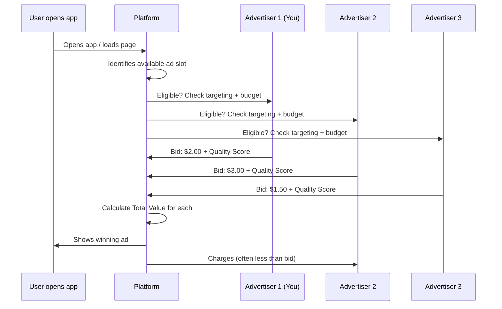
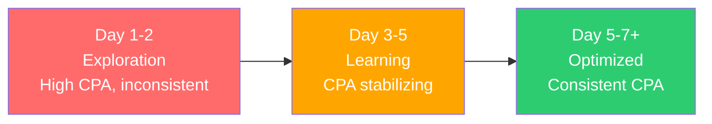

## The two money decisions

Every time you run ads, you make two fundamental decisions:

1. **Budget:** How much total money am I willing to spend?
2. **Bid:** How much am I willing to pay for a single result (a click, an install, a purchase)?

These two levers control everything about your campaign's scale and efficiency. Get them right, and your ads print money. Get them wrong, and you burn through cash with nothing to show for it.

---

## How ad auctions actually work

Every time a user opens an app or loads a webpage with ad space, an **auction** happens in milliseconds. Here is what is really going on behind the scenes:



### The auction formula

Most platforms do **not** simply pick the highest bidder. They calculate a **Total Value** score for each advertiser:

```
Total Value = Bid Amount x Estimated Action Rate x Ad Quality Score
```

| Component | What it means | How you control it |
|-----------|-------------|-------------------|
| **Bid Amount** | How much you are willing to pay | Set directly or let the platform decide |
| **Estimated Action Rate** | How likely THIS user is to take the desired action | Improve with better targeting and historical data |
| **Ad Quality Score** | How good/relevant your ad is (engagement, feedback, landing page) | Create better ads, improve landing pages |

<Tip>
  **This means you do not always need the highest bid to win.** An advertiser bidding $1.50 with an excellent ad quality score can beat an advertiser bidding $3.00 with a poor quality score. Invest in great creatives — they literally save you money in auctions.
</Tip>

### Second-price vs. first-price auctions

| Auction type | What you pay | Used by |
|-------------|-------------|---------|
| **Second-price** | The second-highest bid + $0.01 | Historically used by most platforms |
| **First-price** | Exactly what you bid | Increasingly common (Google Ad Exchange, programmatic) |
| **VCG (Vickrey-Clarke-Groves)** | Based on the marginal value of your participation | Meta (a modified version) |

<Note>
  **You usually pay less than your maximum bid.** On Meta, you are charged the minimum amount needed to win the auction. If you bid $5 but the next highest Total Value required only $2.50, you pay approximately $2.50. This is why your actual CPC or CPI is often lower than your bid cap.
</Note>

---

## All bid strategies explained

Different bid strategies give you different levels of control. Here is every major option:

### Automatic / Algorithm-controlled strategies

<AccordionGroup>
  <Accordion title="Lowest Cost (Maximize Results)">
    **What it does:** The platform tries to get you the most results possible within your budget, at the lowest cost per result.

    **How it works:** The platform sets bids automatically, adjusting up or down to find the cheapest conversions available.

    **Pros:**
    - Simplest strategy — set your budget and go
    - Great for learning what a reasonable CPA is
    - Maximizes volume within your budget

    **Cons:**
    - No control over how much each result costs
    - Costs can spike during competitive periods (holidays, events)
    - May prioritize cheap-but-low-quality users

    **Available on:** Meta (Lowest Cost), Google (Maximize Conversions without target), TikTok (Lowest Cost)

    **Best for:** Beginners, new campaigns, exploring a new market.
  </Accordion>

  <Accordion title="Maximize Conversions">
    **What it does:** Google's version of Lowest Cost. The algorithm tries to get you the most conversions within your daily budget.

    **How it works:** Google's Smart Bidding uses machine learning to set the optimal bid for each auction based on hundreds of real-time signals (device, location, time, browser, demographics, and more).

    **Pros:**
    - Fully automated, no bid management needed
    - Uses Google's vast data to optimize

    **Cons:**
    - May spend your entire daily budget even when results are expensive
    - Less predictable costs

    **Available on:** Google Ads

    **Best for:** Getting started with Google Ads, understanding your baseline conversion volume.
  </Accordion>

  <Accordion title="Maximize Conversion Value">
    **What it does:** Instead of maximizing the number of conversions, this maximizes the total value (revenue) of conversions.

    **How it works:** The algorithm prioritizes users who are likely to generate higher revenue, even if it means fewer total conversions.

    **Available on:** Google Ads

    **Best for:** E-commerce apps, subscription apps, any app where users have varying lifetime values.
  </Accordion>
</AccordionGroup>

### Target-based strategies

<AccordionGroup>
  <Accordion title="Target CPA (Cost Per Action)">
    **What it does:** You tell the platform "I want to pay approximately $X per conversion" and it tries to hit that target on average.

    **How it works:** The algorithm bids higher for users likely to convert cheaply and lower for users likely to be expensive. Over time, the average cost per conversion should approximate your target.

    **Example:** You set Target CPA = $3.00. Some conversions may cost $1.50, others $5.00, but the average over time should be around $3.00.

    **Pros:**
    - Predictable costs
    - Algorithm focuses on efficiency, not just volume
    - Good balance of control and automation

    **Cons:**
    - If target is too low, the platform will not spend your budget (delivery is limited)
    - Needs historical data to work well (at least 30-50 conversions in the past 30 days)
    - Target is an average, not a guarantee — individual conversions can be much higher

    **Available on:** Meta (Cost Per Result Goal), Google (Target CPA), TikTok (Cost Cap)

    **Best for:** Campaigns with established baselines where you know your acceptable CPA.
  </Accordion>

  <Accordion title="Target ROAS (Return On Ad Spend)">
    **What it does:** You tell the platform "I want to earn $X in revenue for every $1 spent on ads" and it optimizes toward that ratio.

    **How it works:** If you set Target ROAS = 400%, the platform aims to generate $4 in revenue for every $1 you spend. It prioritizes high-value users.

    **Example:** Target ROAS = 300%. You spend $100 → the platform aims to generate $300 in revenue from those conversions.

    **Pros:**
    - Directly tied to revenue
    - Platform optimizes for quality of users, not just quantity
    - Ideal for revenue-driven campaigns

    **Cons:**
    - Requires revenue tracking (purchase values sent back to the platform)
    - Needs significant data (usually 50+ conversions with revenue values)
    - Not suitable for apps without clear purchase events

    **Available on:** Meta (ROAS Goal), Google (Target ROAS), TikTok (ROAS Goal)

    **Best for:** E-commerce, subscription apps, gaming apps with IAP (in-app purchases).
  </Accordion>
</AccordionGroup>

### Manual / cap-based strategies

<AccordionGroup>
  <Accordion title="Manual CPC (Cost Per Click)">
    **What it does:** You set the maximum amount you are willing to pay per click. The platform will not bid more than this amount.

    **How it works:** You research keyword or audience CPCs, set a max CPC, and the platform bids up to that amount per click.

    **Pros:**
    - Maximum control over click costs
    - Predictable spend per click
    - Good for testing

    **Cons:**
    - Requires constant monitoring and adjustment
    - You might set bids too low (no traffic) or too high (overpaying)
    - Does not optimize for conversions — just clicks
    - Being deprecated or de-emphasized on many platforms

    **Available on:** Google Ads (Enhanced or Manual CPC), Apple Search Ads

    **Best for:** Experienced advertisers who want granular control, Apple Search Ads keyword bidding.
  </Accordion>

  <Accordion title="Cost Cap">
    **What it does:** You set a maximum average cost per result. The platform tries to get conversions at or below this cost, but will not spend your budget if it cannot find cheap enough conversions.

    **How it works:** Similar to Target CPA, but with a stricter cap. The platform will reduce spend rather than exceed your cost cap.

    **Difference from Target CPA:** Target CPA is a target average (can exceed it sometimes). Cost Cap is more of a ceiling — the platform will slow spend to avoid exceeding it.

    **Available on:** Meta (Cost Per Result Goal), TikTok (Cost Cap)

    **Best for:** When you have strict CPA requirements and would rather not spend than overspend.
  </Accordion>

  <Accordion title="Bid Cap">
    **What it does:** You set the maximum bid in each auction. The platform will never bid more than this amount, even if it means losing auctions.

    **How it works:** You say "never bid more than $2.00." In any auction where the winning price would be above $2.00, you simply do not compete.

    **Pros:**
    - Maximum cost control at the auction level
    - Prevents overspending in competitive moments

    **Cons:**
    - Most restrictive strategy
    - May severely limit reach if set too low
    - Requires deep understanding of auction dynamics

    **Available on:** Meta (Bid Cap), TikTok (Bid Cap)

    **Best for:** Advanced advertisers with strict unit economics who understand their margins precisely.
  </Accordion>
</AccordionGroup>

### Strategy comparison at a glance

| Strategy | Control level | Risk | Best for |
|----------|-------------|------|----------|
| **Lowest Cost** | Low (auto) | Costs may spike | Beginners, exploration |
| **Maximize Conversions** | Low (auto) | May spend full budget inefficiently | Getting started on Google |
| **Target CPA** | Medium | Under-delivery if target too low | Known CPA targets |
| **Target ROAS** | Medium | Under-delivery if target too high | Revenue-focused apps |
| **Cost Cap** | Medium-High | Reduced spend volume | Strict CPA requirements |
| **Bid Cap** | High (manual) | Severely limited reach | Advanced, precise economics |
| **Manual CPC** | Highest | Requires constant management | Search ads, experienced users |

<Warning>
  **Do not start with manual bidding or strict caps.** When you first launch a campaign, you do not know what a reasonable CPA or CPC is. Start with **Lowest Cost / Maximize Conversions** to establish baselines, then switch to target-based or capped strategies once you have data.
</Warning>

---

## Daily budget vs. lifetime budget

<Tabs>
  <Tab title="Daily Budget">
    **How it works:** You set a maximum spend per day. The platform tries to spend up to this amount each day.

    **Important details:**
    - The platform can spend up to **25% more** than your daily budget on high-opportunity days, but averages to your daily budget over the week
    - If you set $10/day, you might see $12 spent on Monday and $8 on Tuesday — but the weekly average will be ~$10/day
    - You can change your daily budget anytime (takes effect immediately)
    - Campaign runs indefinitely until you pause it or set an end date

    **Best for:** Ongoing campaigns, beginners, when you want easy budget control.

    | Advantage | Disadvantage |
    |-----------|-------------|
    | Simple to understand and manage | Less efficient for short campaigns |
    | Easy to adjust on the fly | Cannot control exact total spend |
    | Continuous delivery | Day-to-day variance |
  </Tab>
  <Tab title="Lifetime Budget">
    **How it works:** You set a total spend for the entire campaign duration (e.g., $500 over 14 days). The platform distributes this spend across the days.

    **Important details:**
    - The platform will optimize daily spend based on opportunities (spend more on good days, less on bad)
    - Enables **dayparting** (running ads only during specific hours) on some platforms
    - Cannot increase the budget easily without resetting the learning phase
    - Campaign stops when the budget is exhausted or the end date is reached

    **Best for:** Fixed promotions, events, testing with a set budget.

    | Advantage | Disadvantage |
    |-----------|-------------|
    | Exact total spend control | Harder to adjust mid-campaign |
    | Platform optimizes daily pacing | May not spend evenly |
    | Better for time-limited promotions | Changing budget resets learning |
  </Tab>
</Tabs>

<Tip>
  **For your first campaign, use a daily budget.** It is simpler, more forgiving, and you can pause anytime. Switch to lifetime budgets when you have a specific promotion with a fixed timeline.
</Tip>

---

## Understanding pacing

Pacing is how the platform distributes your budget throughout the day.

### Standard pacing (default)

The platform spreads your budget evenly throughout the day. If your daily budget is $100 and ads run for 20 hours, it spends roughly $5/hour.

**Advantage:** Consistent delivery, reaches users at all times of day.
**Disadvantage:** Might miss high-value moments by holding budget back.

### Accelerated pacing

The platform spends your budget as fast as possible, entering every eligible auction. Once the budget runs out, ads stop for the day.

**Advantage:** Maximum reach early in the day, good for time-sensitive promotions.
**Disadvantage:** Budget runs out quickly (often by noon), missing later audiences.

<Warning>
  **Accelerated pacing is rarely a good idea.** It typically leads to higher CPMs (more aggressive bidding to spend fast) and misses users who are active later in the day. Stick with standard pacing unless you have a specific reason.
</Warning>

### Pacing by platform

| Platform | Standard pacing | Accelerated pacing | Notes |
|----------|----------------|-------------------|-------|
| **Meta** | Default | Not available (removed) | Meta optimizes pacing automatically |
| **Google** | Default | Available (being deprecated) | Google recommends standard |
| **TikTok** | Default | Available | Use with caution |
| **Apple** | Default | Not available | Apple paces automatically |

---

## Auction mechanics deep dive

Let's walk through what happens in a real auction with real numbers:

### Example: Meta auction for an app install

```
User: Sarah, 28, fitness enthusiast, scrolling Instagram Feed in New York

Advertiser A (You - Fitness App):
  Bid: $3.00 per install
  Estimated Action Rate: 2.5% (platform thinks Sarah is likely to install)
  Ad Quality: High (great engagement metrics)
  Total Value = $3.00 × 0.025 × 1.2 = 0.090

Advertiser B (Meditation App):
  Bid: $5.00 per install
  Estimated Action Rate: 0.8% (less relevant to Sarah)
  Ad Quality: Medium
  Total Value = $5.00 × 0.008 × 1.0 = 0.040

Advertiser C (E-commerce App):
  Bid: $4.00 per install
  Estimated Action Rate: 1.2%
  Ad Quality: Low (some negative feedback)
  Total Value = $4.00 × 0.012 × 0.7 = 0.034

Winner: Advertiser A (You!) ✅
You pay: ~$1.80 (enough to beat Advertiser B's Total Value, not your full $3.00 bid)
```

<Note>
  Notice how you won despite having the **lowest bid** of the three. Your ad's relevance (high estimated action rate) and quality score made up for the lower bid. **This is why creative quality and targeting relevance directly reduce your costs.**
</Note>

---

## The learning phase

When you launch a new campaign (or make significant changes), the platform enters a **learning phase** where it experiments with different audiences, placements, and times to figure out the best way to deliver your ads.

### What happens during the learning phase



| Phase | What the platform does | What you see | What to do |
|-------|----------------------|-------------|------------|
| **Exploration (Day 1-2)** | Tests broadly — different users, placements, times | Expensive, inconsistent results | Do nothing. Wait. |
| **Learning (Day 3-5)** | Starts identifying winning patterns | Results improving, still variable | Still wait. |
| **Optimized (Day 5-7+)** | Focuses on what works | Stable, predictable results | Now you can evaluate and optimize |

### What exits the learning phase

The typical requirement is **50 optimization events** (conversions, installs, etc.) within a 7-day window. Once achieved, the platform has enough data to predict performance reliably.

### What resets the learning phase

Be careful — these changes restart the learning phase:

| Change | Resets learning? |
|--------|-----------------|
| Significant budget change (more than 20-30%) | Yes |
| Changing bid strategy | Yes |
| Changing targeting significantly | Yes |
| Pausing for more than 7 days | Usually yes |
| Adding new creatives | Partial (for the new creatives) |
| Minor budget adjustments (under 20%) | Usually no |
| Editing ad text only | Sometimes |

<Warning>
  **The number one beginner mistake:** Seeing poor results on Day 1-2 and immediately pausing the campaign or making big changes. This restarts the learning phase and you never get to the optimized stage. **Give every campaign at least 5-7 days and 50 conversions before judging performance.**
</Warning>

---

## Budget allocation across campaigns

When you have multiple campaigns running, how should you distribute your total budget?

### The 70/20/10 framework

| Allocation | Percentage | What it funds |
|-----------|-----------|---------------|
| **Proven performers** | 70% | Campaigns that are delivering results at your target CPA/ROAS |
| **Scaling tests** | 20% | Expanding winning campaigns — new geos, audiences, or budgets |
| **Experimentation** | 10% | New platforms, creative concepts, audience ideas |

### Example: $100/day total budget

```
Total daily budget: $100

$70/day → Campaign: "US Install - Broad" (proven, CPI = $2.50) ✅
$20/day → Campaign: "UK Install - Test" (scaling to new geo) 🔄
$10/day → Campaign: "TikTok Experiment" (testing new platform) 🧪
```

<Tip>
  **Review allocation weekly.** If an experimental campaign starts outperforming, move it to the 70% bucket and start a new experiment. If a proven campaign starts declining, investigate before cutting it.
</Tip>

---

## Scaling budgets safely

When a campaign is performing well, the natural instinct is to double or triple the budget. But scaling too fast can break performance.

### Why scaling breaks things

When you dramatically increase budget, the platform must suddenly find many more users. It starts showing your ads to less optimal users, and your CPA increases. The learning phase may also reset.

### Safe scaling rules

<Steps>
  <Step title="Scale gradually — 20-30% at a time">
    If your daily budget is $50, increase to $60-65 (not $100). Wait 3-5 days to stabilize, then increase again.
  </Step>
  <Step title="Scale through duplication">
    Instead of increasing one ad set's budget, duplicate the winning ad set and give the duplicate its own budget. This gives you two ad sets both operating at their optimal level.
  </Step>
  <Step title="Scale by expanding targeting">
    Instead of spending more on the same audience, expand to new audiences, geos, or placements. This accesses new pools of users rather than exhausting the same pool.
  </Step>
  <Step title="Scale horizontally across platforms">
    If Meta is working, try the same creative concept on TikTok or Google. Different platforms have different user pools — scaling across them avoids audience saturation.
  </Step>
  <Step title="Monitor CPA closely during scaling">
    Expect CPA to increase 10-20% during scaling. If it increases more than 30%, you are scaling too fast. Pull back and stabilize.
  </Step>
</Steps>

### Scaling timeline example

```
Week 1: $20/day → Establishing baseline CPI of $2.50
Week 2: $26/day (+30%) → CPI stable at $2.60 ✅
Week 3: $34/day (+30%) → CPI at $2.80 ✅
Week 4: $44/day (+30%) → CPI at $3.10 (watch closely)
Week 5: $44/day (hold) → CPI stabilizes at $2.90 ✅
Week 6: $57/day (+30%) → Continue scaling
```

---

## What does it actually cost? Benchmarks

Real-world cost benchmarks vary enormously by category, country, platform, and creative quality. Here are rough guides:

### Cost benchmarks by platform

| Metric | Meta | Google Search | Google App | TikTok | Apple Search Ads |
|--------|------|-------------|-----------|--------|-----------------|
| **CPM** | $5-15 | N/A | $2-8 | $3-10 | N/A |
| **CPC** | $0.30-2.00 | $0.50-5.00 | N/A | $0.20-1.50 | $0.50-3.00 |
| **CPI** | $1.00-5.00 | $1.50-5.00 | $1.00-4.00 | $1.00-4.00 | $1.00-4.00 |
| **CPA** (purchase) | $5-50 | $10-80 | $5-40 | $5-30 | $10-50 |

### Cost benchmarks by app category

| App category | Average CPI (Global) | Average CPI (US) | Notes |
|-------------|---------------------|------------------|-------|
| **Games (casual)** | $0.50-2.00 | $1.50-4.00 | High volume, lower quality |
| **Games (midcore/hardcore)** | $2.00-6.00 | $4.00-10.00 | Higher quality users |
| **Social / Communication** | $1.00-3.00 | $2.00-5.00 | Competitive but scalable |
| **E-commerce / Shopping** | $1.50-4.00 | $2.50-6.00 | Revenue offsets cost |
| **Finance / Fintech** | $3.00-10.00 | $5.00-15.00 | Highest value users |
| **Health & Fitness** | $1.50-4.00 | $2.50-6.00 | Seasonal spikes in January |
| **Education** | $1.00-3.00 | $2.00-5.00 | Back-to-school seasonality |
| **Utilities / Productivity** | $1.00-3.00 | $2.00-5.00 | Broad audience |
| **Entertainment / Streaming** | $2.00-5.00 | $3.00-8.00 | High competition |

<Note>
  **These are rough averages.** Your actual costs depend on your creative quality, targeting, competition level, time of year, and many other factors. Use these as a sanity check, not a guarantee.
</Note>

---

## Budget math: essential formulas

### How much to spend for a given number of installs

```
Monthly budget = Target installs x Expected CPI

Example:
  Want 1,000 installs/month
  Expected CPI = $2.50
  Monthly budget = 1,000 x $2.50 = $2,500/month (~$83/day)
```

### How to calculate ROAS

```
ROAS = Revenue from ads / Cost of ads x 100%

Example:
  Spent $1,000 on ads
  Generated $3,000 in revenue from those users
  ROAS = $3,000 / $1,000 x 100% = 300%
```

### Break-even CPA

```
Break-even CPA = Average Revenue Per User (ARPU)

Example:
  Average user generates $5.00 in lifetime revenue
  Break-even CPA = $5.00
  Target CPA for profitability = $3.00-$4.00 (some margin)
```

### Recommended starting budgets

| Platform | Minimum daily | Recommended daily | First test budget |
|----------|--------------|-------------------|-------------------|
| **Meta** | $5/day | $15-30/day | $200-400 total |
| **Google Ads** | $10/day | $20-40/day | $300-500 total |
| **TikTok** | $20/day | $30-50/day | $400-700 total |
| **Apple Search Ads** | $5/day | $10-20/day | $150-300 total |

<Tip>
  **First-time budget:** Allocate $200-500 for your very first campaign. Run it for 7-14 days. The goal is **learning**, not scaling. You want to understand your CPI, which creatives work, and which audiences convert. Once you have data, you can make informed scaling decisions.
</Tip>

---

## Key takeaways

<Steps>
  <Step title="Auctions reward quality, not just money">
    Higher bids do not guarantee wins. Better ads and higher relevance can beat bigger budgets. Invest in creative quality.
  </Step>
  <Step title="Start with automatic bidding">
    Use Lowest Cost or Maximize Conversions for your first campaigns. Establish baselines before adding bid constraints.
  </Step>
  <Step title="Respect the learning phase">
    Give campaigns 5-7 days and 50+ conversions before judging. Early results are not representative.
  </Step>
  <Step title="Scale gradually">
    Increase budgets by 20-30% at a time. Dramatic increases (doubling or tripling) almost always hurt performance.
  </Step>
  <Step title="Use the 70/20/10 framework">
    70% on proven campaigns, 20% on scaling tests, 10% on experiments. Review weekly.
  </Step>
  <Step title="Track your unit economics">
    Know your CPI, CPA, ROAS, and break-even point. These numbers drive every budget and bidding decision.
  </Step>
</Steps>

---

## Next up

Your money is set. Now let's talk about the thing that makes people actually tap your ad — the creative.

<Card
  title="Creatives"
  icon="arrow-right"
  href="/concepts/creatives"
>
  How to make ads that stop the scroll and drive action.
</Card>
