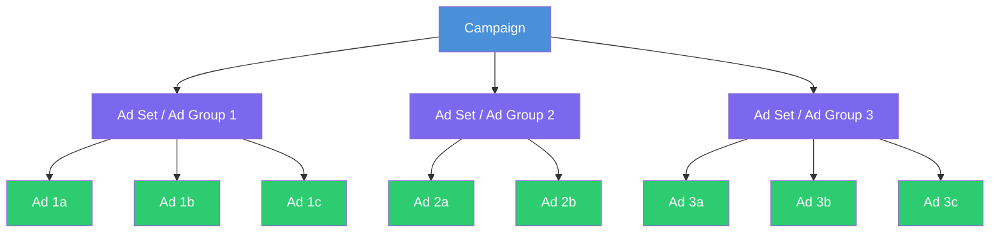
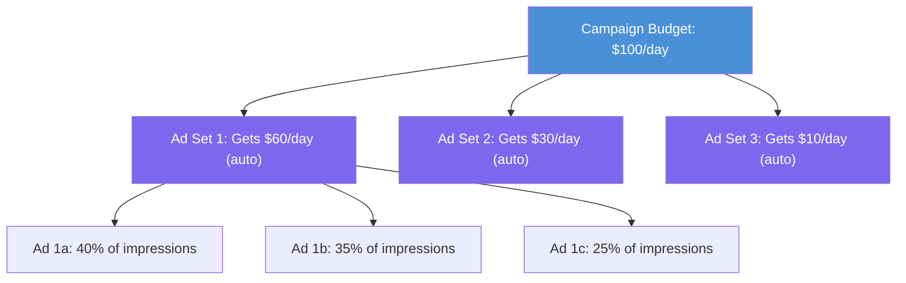

## Why structure matters

Imagine your desk is a mess — papers everywhere, no folders, no labels. You would waste hours finding anything. Campaign structure is the filing system for your ads. A clean structure means:

- You can quickly see what is working and what is not
- The platform's algorithm can optimize more effectively
- You can scale without chaos
- A/B testing becomes straightforward
- Reporting is clear and actionable

<Note>
  Every major ad platform uses the same 3-level hierarchy. Learn it once and you can apply it to Meta, Google, TikTok, Apple, Snap, Twitter/X, LinkedIn — any platform.
</Note>

---

## The 3-level hierarchy

Think of it like a company org chart:



### What each level controls

| Level | What it decides | Think of it as... |
|-------|----------------|-------------------|
| **Campaign** | The overall goal and (optionally) total budget | "What do I want to achieve?" |
| **Ad Set / Ad Group** | Who sees the ads, when, where, and how much to spend | "Who am I talking to?" |
| **Ad** | The actual creative — image, video, text, and call to action | "What am I showing them?" |

---

## Level 1: Campaign — the big picture

The campaign is the top level. Here you set:

### Campaign objective

This tells the platform what you want to achieve. The platform's algorithm will optimize delivery to get you the most of whatever you picked.

<Tabs>
  <Tab title="Meta">
    Meta uses the **Outcome-Driven Ad Experiences (ODAX)** framework with 6 objectives:

    | Objective | What it optimizes for | Use when... |
    |-----------|----------------------|-------------|
    | **Awareness** | Maximum impressions / reach | You want brand visibility |
    | **Traffic** | Link clicks to a destination | You want website or app visits |
    | **Engagement** | Post likes, comments, shares | You want social proof |
    | **Leads** | Form submissions | You want contact information |
    | **App Promotion** | App installs or in-app events | You want app downloads |
    | **Sales** | Purchases or conversions | You want revenue |
  </Tab>
  <Tab title="Google Ads">
    Google Ads objectives vary by campaign type:

    | Campaign Type | Objective | Where ads appear |
    |--------------|-----------|-----------------|
    | **Search** | Clicks / conversions from search queries | Google Search results |
    | **Performance Max** | Conversions across all Google inventory | Search, YouTube, Display, Gmail, Maps, Discover |
    | **Display** | Awareness / clicks on banner ads | Websites and apps in Google Display Network |
    | **Video** | Video views / conversions from YouTube | YouTube and video partners |
    | **App** | App installs / in-app conversions | Search, Play Store, YouTube, Display |
    | **Shopping** | Product sales | Google Shopping, Search |
    | **Demand Gen** | Conversions from visually rich ads | YouTube, Discover, Gmail |
  </Tab>
  <Tab title="TikTok">
    TikTok uses a similar framework:

    | Objective | What it optimizes for | Use when... |
    |-----------|----------------------|-------------|
    | **Reach** | Maximum unique users | You want awareness |
    | **Traffic** | Clicks to your destination | You want visits |
    | **Video Views** | Maximum video plays | You want video engagement |
    | **Community Interaction** | Followers / profile visits | You want TikTok growth |
    | **App Promotion** | App installs / re-engagement | You want app downloads |
    | **Lead Generation** | Form submissions | You want leads |
    | **Website Conversions** | On-site actions | You want purchases/signups |
    | **Product Sales** | Catalog sales | You want e-commerce revenue |
  </Tab>
  <Tab title="Apple Search Ads">
    Apple Search Ads is simpler — it has one primary objective:

    | Tier | Objective | How it works |
    |------|-----------|-------------|
    | **Basic** | App installs | Fully automated, minimal setup |
    | **Advanced** | App installs + in-app events | Full control over keywords, bids, audiences |

    Apple Search Ads only runs in the App Store, so the objective is always related to driving app installs or re-engagement.
  </Tab>
</Tabs>

<Tip>
  **For your first campaign:** Choose **App Installs** (or the equivalent on your platform). It is the most straightforward objective and gives the algorithm a clear signal to optimize toward.
</Tip>

### Campaign budget (optional at this level)

Some platforms let you set a **Campaign Budget Optimization (CBO)** — a single budget that the platform distributes across all ad sets automatically.

| Approach | How it works | Best for |
|----------|-------------|----------|
| **Campaign Budget (CBO)** | One budget, platform distributes across ad sets | Hands-off optimization, testing audiences |
| **Ad Set Budget (ABO)** | Each ad set has its own budget | Precise control, specific audience budgets |

<Note>
  **Meta calls this "Advantage Campaign Budget" (formerly CBO).** Google calls it "Shared Budgets." TikTok calls it "Campaign Budget Optimization." Same concept, different names.
</Note>

---

## Level 2: Ad Set / Ad Group — the targeting layer

This is where you define the audience, placement, schedule, and (optionally) budget.

### What you configure at this level

<CardGroup cols={2}>
  <Card title="Audience" icon="users">
    **Who** sees your ads: age, gender, location, interests, behaviors, custom audiences, lookalike audiences. This is your targeting configuration.
  </Card>
  <Card title="Placements" icon="layout-grid">
    **Where** your ads appear: Instagram Feed, Facebook Stories, Google Search, YouTube, TikTok For You Page, etc. You can choose automatic (recommended) or manual placements.
  </Card>
  <Card title="Schedule" icon="calendar">
    **When** your ads run: start date, end date, time-of-day scheduling (dayparting). You can run ads continuously or during specific hours.
  </Card>
  <Card title="Budget & Bid" icon="dollar-sign">
    **How much** you spend (if not using campaign-level budget) and your bidding strategy. Daily budget or lifetime budget, with optional bid caps.
  </Card>
</CardGroup>

### Example ad set configurations

```
Campaign: "Summer App Launch - Installs"
  │
  ├── Ad Set 1: "US - Young Adults - Broad"
  │     Audience: US, Ages 18-34, All genders
  │     Interests: Broad (let algorithm decide)
  │     Placements: Automatic
  │     Budget: $20/day
  │
  ├── Ad Set 2: "US - Fitness Enthusiasts"
  │     Audience: US, Ages 18-44
  │     Interests: Fitness, Running, Gym, Yoga
  │     Placements: Instagram Feed + Stories
  │     Budget: $15/day
  │
  └── Ad Set 3: "UK + EU - Broad"
        Audience: UK, Germany, France, Ages 18-44
        Interests: Broad
        Placements: Automatic
        Budget: $15/day
```

<Warning>
  **Do not create too many ad sets.** Each ad set needs enough budget to exit the learning phase (typically 50 conversions per week). If you split $50/day across 10 ad sets, each gets only $5/day — not enough data for the algorithm to learn. **Start with 2-4 ad sets maximum.**
</Warning>

---

## Level 3: Ad — the creative

This is what the user actually sees. Each ad consists of:

| Component | Description | Example |
|-----------|------------|---------|
| **Visual** | Image, video, or carousel | A 15-second app demo video |
| **Primary text** | The main copy above the visual | "Track your workouts in 30 seconds" |
| **Headline** | Bold text below the visual | "The #1 Fitness App" |
| **Description** | Supporting text (not always shown) | "Join 50,000+ users" |
| **CTA button** | The action button | "Install Now" |
| **Destination** | Where the click goes | App Store / Play Store link |

### How many ads per ad set?

| Approach | Number of ads | When to use |
|----------|--------------|-------------|
| **Minimum** | 3 ads | Always have at least 3 for the algorithm to compare |
| **Recommended** | 3-6 ads | Good balance of variety and data collection |
| **Advanced** | 6-10+ ads | When you have proven creatives and want to test iterations |

<Tip>
  **Variety matters more than volume.** Three ads with genuinely different approaches (different hooks, different visuals, different formats) will outperform ten ads that are slight variations of the same thing.
</Tip>

---

## Platform comparison: terminology and structure

Every platform uses the same 3-level hierarchy, but the naming differs:

| Feature | Meta | Google Ads | TikTok | Apple Search Ads |
|---------|------|-----------|--------|-----------------|
| **Level 1** | Campaign | Campaign | Campaign | Campaign |
| **Level 2** | Ad Set | Ad Group | Ad Group | Ad Group |
| **Level 3** | Ad | Ad | Ad | Keyword (+ Creative Set) |
| **Objective set at** | Campaign | Campaign | Campaign | Campaign |
| **Budget can be set at** | Campaign or Ad Set | Campaign or Ad Group | Campaign or Ad Group | Campaign or Ad Group |
| **Targeting set at** | Ad Set | Ad Group | Ad Group | Ad Group |
| **Bidding set at** | Ad Set | Ad Group / Campaign | Ad Group | Ad Group / Keyword |
| **Placements set at** | Ad Set | Campaign (by type) | Ad Group | N/A (App Store only) |
| **Campaign budget optimization** | Advantage Campaign Budget | Shared Budget / auto | Campaign Budget Optimization | Balanced distribution |
| **Max campaigns** | 5,000 per account | 10,000 per account | 999 per account | No hard limit |
| **Max ad sets/groups per campaign** | 5,000 | 20,000 | 999 | 2,000 |
| **Max ads per ad set/group** | 50 (6 recommended) | 15 (3+ recommended) | 20 | Keywords (unlimited) |

<Note>
  **Apple Search Ads is unique.** Instead of uploading creative assets, Apple pulls your app icon, screenshots, and metadata from your App Store listing. At the "ad" level, you are mostly managing keywords (search terms you want to bid on) and Creative Sets (combinations of your App Store screenshots).
</Note>

---

## Naming conventions — keep it clean

As you create more campaigns, naming becomes critical. Without a system, you end up with "Campaign 1 copy (3) final FINAL."

### Recommended naming formula

```
[Objective] - [Platform] - [Geo] - [Audience] - [Date]
```

### Examples

| Level | Name | What it tells you |
|-------|------|-------------------|
| Campaign | `Installs - Meta - US - Broad - 2024Q1` | Install campaign on Meta, targeting US, broad audience, Q1 2024 |
| Ad Set | `US_18-34_Fitness_AutoPlace` | US audience, 18-34, fitness interest, auto placements |
| Ad | `VideoDemo_15s_HookA_v2` | 15-second video demo, using Hook A, version 2 |

### Naming conventions by platform

<Tabs>
  <Tab title="Meta">
    ```
    Campaign: [Objective]_[Geo]_[Audience Type]_[Budget Type]_[Date]
    Ad Set:   [Geo]_[Age]_[Interest/Audience]_[Placement]
    Ad:       [Format]_[Hook]_[Version]

    Example:
    Campaign: Installs_US_Prospecting_CBO_Jan2024
    Ad Set:   US_18-34_FitnessInterest_AutoPlace
    Ad:       Video_15s_PainPoint_v3
    ```
  </Tab>
  <Tab title="Google Ads">
    ```
    Campaign: [Type]_[Geo]_[Objective]_[Date]
    Ad Group: [Theme/Keywords]_[Match Type]
    Ad:       [Format]_[Variation]

    Example:
    Campaign: Search_US_AppInstalls_Jan2024
    Ad Group: FitnessApp_BroadMatch
    Ad:       RSA_BenefitFocused_v2
    ```
  </Tab>
  <Tab title="TikTok">
    ```
    Campaign: [Objective]_[Geo]_[Strategy]_[Date]
    Ad Group: [Geo]_[Age]_[Targeting]_[Bid]
    Ad:       [CreatorName/Style]_[Length]_[Hook]_[Version]

    Example:
    Campaign: AppInstall_US_LowestCost_Jan2024
    Ad Group: US_18-34_BroadInterest_Auto
    Ad:       UGC_Sarah_15s_ProblemHook_v1
    ```
  </Tab>
  <Tab title="Apple Search Ads">
    ```
    Campaign: [Geo]_[Type]_[Date]
    Ad Group: [Theme]_[Match Type]
    Keywords: [keyword] - [match type]

    Example:
    Campaign: US_Brand_Jan2024
    Ad Group: CompetitorTerms_Exact
    Keywords: "fitness tracker app" - Exact Match
    ```
  </Tab>
</Tabs>

<Tip>
  **Use a spreadsheet or project management tool** to maintain a naming convention guide for your team. Consistency across team members is more important than the specific format you choose.
</Tip>

---

## How structure affects optimization

Your campaign structure directly impacts how well the platform's algorithm can optimize. Here is why:

### The learning phase and data distribution

Every ad set needs approximately **50 conversion events per week** to exit the learning phase and optimize effectively. Your structure determines how data is distributed:

```
Scenario A: Too granular (bad)
Campaign Budget: $50/day
├── Ad Set 1: $5/day → ~1-2 installs/day → 7-14/week ❌
├── Ad Set 2: $5/day → ~1-2 installs/day → 7-14/week ❌
├── Ad Set 3: $5/day → ~1-2 installs/day → 7-14/week ❌
├── Ad Set 4: $5/day → ~1-2 installs/day → 7-14/week ❌
├── ... (10 ad sets, none learning properly)

Scenario B: Consolidated (good)
Campaign Budget: $50/day
├── Ad Set 1: $25/day → ~8-12 installs/day → 56-84/week ✅
├── Ad Set 2: $25/day → ~8-12 installs/day → 56-84/week ✅
```

<Warning>
  **Fragmentation is the most common structural mistake.** Every time you split your budget into another ad set, you dilute the data each one receives. Fewer ad sets with larger budgets almost always outperform many ad sets with small budgets.
</Warning>

### Structure and algorithmic optimization

| Structure choice | Impact on optimization |
|-----------------|----------------------|
| Too many campaigns | Budget spread thin, no campaign gets enough data |
| Too many ad sets | Each ad set starved of conversions, stuck in learning |
| Too few ads per ad set | Algorithm has nothing to compare, can't find winner |
| One ad per ad set | No creative testing, no optimization possible |
| CBO with uneven ad sets | Algorithm will favor the easiest audience, may ignore niche ones |

---

## A/B testing via structure

Your campaign structure is your A/B testing framework. Test one variable at a time:

<Steps>
  <Step title="Testing different audiences">
    Create **multiple ad sets** within the same campaign, each with a different audience but the **same ads**. This tells you which audience responds best.

    ```
    Campaign: Install_Testing_Audiences
    ├── Ad Set: "Broad 18-34" → [Ad A, Ad B, Ad C]
    ├── Ad Set: "Fitness Interest" → [Ad A, Ad B, Ad C]  (same ads)
    └── Ad Set: "Lookalike 1%" → [Ad A, Ad B, Ad C]  (same ads)
    ```
  </Step>
  <Step title="Testing different creatives">
    Use **one ad set** with **multiple ads** inside it. Same audience, different creatives. This tells you which creative resonates best.

    ```
    Campaign: Install_Testing_Creatives
    └── Ad Set: "US 18-34 Broad"
        ├── Ad: Video - Problem/Solution hook
        ├── Ad: Video - UGC testimonial
        ├── Ad: Image carousel - Features
        └── Ad: Video - App demo
    ```
  </Step>
  <Step title="Testing different objectives or bid strategies">
    Create **separate campaigns** with different settings. This tests fundamental strategic differences.

    ```
    Campaign A: "Installs - Lowest Cost"
    Campaign B: "Installs - Cost Cap $3"
    ```
  </Step>
</Steps>

<Note>
  **Meta's built-in A/B test tool** lets you formally split-test campaigns or ad sets with proper statistical significance. Google has "Experiments." TikTok has "Split Test." Use these when you want clean results — they prevent audience overlap between test groups.
</Note>

---

## Budget inheritance and distribution

Understanding how budget flows through the hierarchy is crucial:



### Campaign-level budget (CBO)

When you set the budget at the campaign level, the platform **automatically distributes** budget across ad sets based on performance. The ad set that delivers the best results gets more budget.

**Pros:**
- Hands-off optimization
- Budget automatically shifts to best performers
- Good for testing multiple audiences simultaneously

**Cons:**
- Less control over individual ad set spend
- Winning ad set may dominate, starving others of data
- Hard to guarantee minimum spend on specific audiences

### Ad-set-level budget (ABO)

When you set the budget at the ad set level, **you control exactly** how much each ad set spends.

**Pros:**
- Full control over budget distribution
- Guaranteed minimum spend per audience
- Better for learning what specific audiences cost

**Cons:**
- Requires more manual management
- You might over-invest in underperforming ad sets
- More time-consuming as you scale

<Tip>
  **Starting out?** Use **ad set level budgets (ABO)** so you can control exactly how much goes where. Switch to **campaign budget optimization (CBO)** once you have proven audiences and want the algorithm to distribute spend for you.
</Tip>

---

## Real-world campaign structures

Here are practical structures for common scenarios:

<Tabs>
  <Tab title="Beginner: First Campaign">
    ```
    Campaign: "App Installs - [Country] - Launch"
    ├── Ad Set 1: "Broad Audience"
    │   ├── Ad: Video - App demo (15s)
    │   ├── Ad: Video - Problem/Solution (15s)
    │   └── Ad: Image - Key feature highlight
    └── Ad Set 2: "Interest-Based"
        ├── Ad: Video - App demo (15s)      (same ads)
        ├── Ad: Video - Problem/Solution (15s)
        └── Ad: Image - Key feature highlight

    Budget: $15-20/day per ad set
    Duration: 7-14 days
    ```
  </Tab>
  <Tab title="Intermediate: Scaling">
    ```
    Campaign 1: "Prospecting - Broad" (CBO: $100/day)
    ├── Ad Set: "US 18-34 Broad"
    │   ├── 4-6 ads (mix of video + image)
    ├── Ad Set: "US 35-54 Broad"
    │   └── 4-6 ads
    └── Ad Set: "Lookalike 1-3%"
        └── 4-6 ads

    Campaign 2: "Retargeting" ($30/day)
    ├── Ad Set: "Visited but didn't install"
    │   └── 3-4 ads (different messaging)
    └── Ad Set: "Installed but inactive"
        └── 3-4 ads (re-engagement focused)

    Campaign 3: "Testing New Creatives" ($20/day)
    └── Ad Set: "Best audience"
        └── 5-8 new creative variations
    ```
  </Tab>
  <Tab title="Advanced: Full Funnel">
    ```
    AWARENESS CAMPAIGNS
    Campaign: "TOF - Video Views - Brand"
    └── Multiple ad sets by audience segment
        └── Brand story / educational videos

    CONSIDERATION CAMPAIGNS
    Campaign: "MOF - Traffic - Features"
    └── Ad sets targeting video viewers + engagers
        └── Feature-focused creatives with CTAs

    CONVERSION CAMPAIGNS
    Campaign: "BOF - Installs - Broad Prospecting" (CBO)
    └── Multiple proven audience ad sets
        └── Best-performing creatives

    Campaign: "BOF - Installs - Retargeting"
    └── Custom audience ad sets
        └── Urgency / social proof creatives

    RETENTION CAMPAIGNS
    Campaign: "Retention - Re-engagement"
    └── Lapsed user audiences
        └── New feature / update creatives
    ```
  </Tab>
</Tabs>

---

## Common structural mistakes

| Mistake | Why it hurts | Fix |
|---------|-------------|-----|
| One campaign per creative | Fragments budget, prevents creative comparison | Put multiple creatives in one ad set |
| 20+ ad sets in one campaign | Each ad set starved of data | Consolidate to 3-5 ad sets |
| Mixing objectives in one campaign | Algorithm confused, poor optimization | One objective per campaign |
| Never pausing underperformers | Wasting budget on losers | Review weekly, pause bottom performers |
| Duplicating campaigns instead of iterating | Loses historical data | Edit existing, create new only for true tests |
| No naming convention | Cannot find or compare anything at scale | Adopt naming system before launching |
| Testing audience AND creative simultaneously | Cannot isolate what worked | Test one variable at a time |

---

## Key takeaways

<Steps>
  <Step title="Three levels, always">
    Campaign (goal) > Ad Set (audience) > Ad (creative). This hierarchy is universal across platforms.
  </Step>
  <Step title="Structure equals strategy">
    How you organize campaigns determines what you can test, how the algorithm learns, and how easily you can scale.
  </Step>
  <Step title="Consolidation beats fragmentation">
    Fewer, well-funded ad sets outperform many starved ones. Give the algorithm enough data to learn.
  </Step>
  <Step title="Test one variable at a time">
    Different audiences = different ad sets. Different creatives = different ads. Different strategies = different campaigns.
  </Step>
  <Step title="Name everything clearly">
    A consistent naming convention saves hours of confusion later. Establish one before you launch.
  </Step>
</Steps>

---

## Next up

Your campaigns are structured. Now let's talk about finding the right people to show your ads to.

<Card
  title="Targeting"
  icon="arrow-right"
  href="/concepts/targeting"
>
  How to find your perfect audience — from demographics to lookalikes.
</Card>
