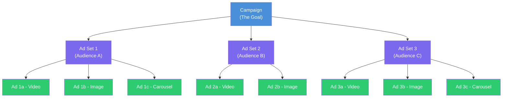

<Tip>
**In a hurry?** Skip to the [Quickstart Guide](/playbook/vibe-coder-quick-start) to launch your first campaign in 30 minutes. You can always come back to learn the theory later.
</Tip>

## Think of it like organizing a school

If you have ever organized anything — a closet, a music library, even a school — you already understand campaign structure. Here is the analogy:

- **Campaign** = The school itself (the big-picture mission: "educate students")
- **Ad Set / Ad Group** = Different classrooms (each has a specific group of students, a teacher, a schedule)
- **Ad** = The actual lessons taught in each classroom (the content students experience)

A school needs a clear structure to function. If you threw all students into one room with random lessons, it would be chaos. The same goes for your ads. Structure is what turns chaos into results.

<Note>
  Here is the beautiful thing: **every major ad platform uses this exact same 3-level hierarchy**. Learn it once and you can apply it to Meta, Google, TikTok, Apple, Snap, LinkedIn — any platform you will ever use.
</Note>

---

## Why structure matters so much

Imagine your desk is covered in papers — no folders, no labels, no system. You would waste hours finding anything. Campaign structure is the filing system for your ads. A clean structure means:

- You can quickly see what is working and what is not
- The platform's algorithm can optimize more effectively
- You can scale without everything falling apart
- A/B testing becomes straightforward
- Reporting is clear and actionable

<Tip>
  **Pro Tip: Bad structure is the #1 reason beginner campaigns fail.** Not bad creatives, not wrong targeting — bad structure. If your campaign is organized well, the algorithm has room to learn and optimize. If it is messy, the algorithm is lost and so are you.
</Tip>

---

## The 3-level hierarchy visualized



### What each level controls

| Level | What it decides | Think of it as... | Example |
|---|---|---|---|
| **Campaign** | The overall goal and (optionally) total budget | "What do I want to achieve?" | "I want app installs in the US" |
| **Ad Set / Ad Group** | Who sees the ads, when, where, and how much to spend | "Who am I talking to?" | "Women aged 25-34 who like yoga" |
| **Ad** | The actual creative — image, video, text, and call to action | "What am I showing them?" | "A 15-second video of the app in action" |

---

## Level 1: Campaign — the big picture

The campaign is the top level, the container for everything. Here is where you make two critical decisions.

### Decision 1: Campaign objective

This tells the platform what you want to achieve. The algorithm will then optimize everything to get you more of whatever you picked. Choosing the wrong objective is like telling a taxi driver the wrong address — you will end up somewhere you do not want to be.

<Tabs>
  <Tab title="Meta (Facebook / Instagram)">
    Meta uses the **ODAX** framework with 6 objectives:

    | Objective | What it optimizes for | Use when... |
    |---|---|---|
    | **Awareness** | Maximum impressions / reach | You want brand visibility |
    | **Traffic** | Link clicks to a destination | You want website or app page visits |
    | **Engagement** | Post likes, comments, shares | You want social proof |
    | **Leads** | Form submissions | You want contact information |
    | **App Promotion** | App installs or in-app events | **You want app downloads (start here!)** |
    | **Sales** | Purchases or conversions | You want revenue |
  </Tab>
  <Tab title="Google Ads">
    Google Ads objectives vary by campaign type:

    | Campaign Type | Objective | Where ads appear |
    |---|---|---|
    | **Search** | Clicks / conversions from search queries | Google Search results |
    | **Performance Max** | Conversions across all Google inventory | Search, YouTube, Display, Gmail, Maps, Discover |
    | **Display** | Awareness / clicks on banner ads | Websites and apps in Google Display Network |
    | **Video** | Video views / conversions from YouTube | YouTube and video partners |
    | **App** | App installs / in-app conversions | Search, Play Store, YouTube, Display |
    | **Shopping** | Product sales | Google Shopping, Search |
    | **Demand Gen** | Conversions from visual ads | YouTube, Discover, Gmail |
  </Tab>
  <Tab title="TikTok">
    | Objective | What it optimizes for | Use when... |
    |---|---|---|
    | **Reach** | Maximum unique users | You want awareness |
    | **Traffic** | Clicks to your destination | You want visits |
    | **Video Views** | Maximum video plays | You want video engagement |
    | **Community Interaction** | Followers / profile visits | You want TikTok growth |
    | **App Promotion** | App installs / re-engagement | **You want app downloads (start here!)** |
    | **Lead Generation** | Form submissions | You want leads |
    | **Website Conversions** | On-site actions | You want purchases/signups |
    | **Product Sales** | Catalog sales | You want e-commerce revenue |
  </Tab>
  <Tab title="Apple Search Ads">
    Apple Search Ads is simpler — ads only appear in the App Store:

    | Tier | Objective | How it works |
    |---|---|---|
    | **Basic** | App installs | Fully automated, just set budget and go |
    | **Advanced** | App installs + in-app events | Full control over keywords, bids, audiences |
  </Tab>
</Tabs>

<Tip>
  **Pro Tip for your first campaign: Choose "App Installs" (or "App Promotion" on Meta).** It is the most straightforward objective and gives the algorithm the clearest signal. Do not overthink it — you can always create new campaigns with different objectives later.
</Tip>

### Decision 2: Campaign budget (optional at this level)

Some platforms let you set a **Campaign Budget Optimization (CBO)** — a single budget that the platform distributes across all ad sets automatically. Or you can set budgets individually at the ad set level.

| Approach | How it works | Best for | Analogy |
|---|---|---|---|
| **Campaign Budget (CBO)** | One budget, platform distributes automatically | Hands-off optimization, testing audiences | Giving the school principal one pot of money and letting them allocate to classrooms |
| **Ad Set Budget (ABO)** | Each ad set has its own budget | Precise control, specific audience budgets | Giving each teacher their own budget directly |

<Note>
  **Different names, same thing:** Meta calls it "Advantage Campaign Budget." Google calls it "Shared Budgets." TikTok calls it "Campaign Budget Optimization." Do not let the naming confuse you — it is the same concept everywhere.
</Note>

---

## Level 2: Ad Set / Ad Group — the targeting layer

This is where you define WHO sees your ads, WHEN they see them, WHERE they appear, and HOW MUCH to spend. This is the most important level for performance.

### What you configure at this level

<CardGroup cols={2}>
  <Card title="Audience (Who)" icon="users">
    Age, gender, location, interests, behaviors, custom audiences, lookalike audiences. This is your targeting configuration. Think of it as choosing which classroom each student goes to.
  </Card>
  <Card title="Placements (Where)" icon="table-layout">
    Instagram Feed, Facebook Stories, Google Search, YouTube, TikTok For You Page, etc. You can choose **automatic** (recommended for beginners) or **manual** placements.
  </Card>
  <Card title="Schedule (When)" icon="calendar">
    Start date, end date, time-of-day scheduling (called "dayparting"). You can run ads 24/7 or only during specific hours.
  </Card>
  <Card title="Budget & Bid (How Much)" icon="dollar-sign">
    If not using campaign-level budget: daily or lifetime budget for this specific ad set, plus your bidding strategy.
  </Card>
</CardGroup>

### A real example with ad sets

Here is what a real campaign structure looks like:

```
Campaign: "Summer App Launch - Installs"
  |
  |-- Ad Set 1: "US - Young Adults - Broad"
  |     Audience: US, Ages 18-34, All genders
  |     Interests: Broad (let algorithm decide)
  |     Placements: Automatic
  |     Budget: $20/day
  |
  |-- Ad Set 2: "US - Fitness Enthusiasts"
  |     Audience: US, Ages 18-44
  |     Interests: Fitness, Running, Gym, Yoga
  |     Placements: Instagram Feed + Stories
  |     Budget: $15/day
  |
  |-- Ad Set 3: "UK + EU - Broad"
  |     Audience: UK, Germany, France, Ages 18-44
  |     Interests: Broad
  |     Placements: Automatic
  |     Budget: $15/day
```

Notice how each ad set targets a DIFFERENT audience. This is how you test which audience works best while keeping everything organized.

<Warning>
  **Do not create too many ad sets.** This is the most common beginner mistake. Each ad set needs enough budget to exit the "learning phase" — Meta recommends about **50 conversions per week** per ad set for optimal learning. If you split $50/day across 10 ad sets, each gets only $5/day — nowhere near enough data for the algorithm to learn. **Start with 2-4 ad sets maximum.**
</Warning>

---

## Level 3: Ad — the creative

This is what the user actually sees. It is the moment of truth — your ad needs to stop someone mid-scroll and make them take action.

Each ad consists of these components:

| Component | What it is | Example |
|---|---|---|
| **Visual** | Image, video, or carousel | A 15-second video showing your app's best feature |
| **Primary text** | The main copy above the visual | "Track your workouts in 30 seconds flat" |
| **Headline** | Bold text below the visual | "The #1 Fitness App" |
| **Description** | Supporting text (not always shown) | "Join 50,000+ users" |
| **CTA button** | The action button | "Install Now" |
| **Destination** | Where the tap goes | App Store or Play Store link |

### How many ads per ad set?

| Approach | Number of ads | When to use |
|---|---|---|
| **Minimum** | 3 ads | Always have at least 3 so the algorithm can compare |
| **Recommended** | 3-6 ads | Sweet spot of variety and data collection |
| **Advanced** | 6-10+ ads | When you have proven winners and want to test iterations |

<Tip>
  **Pro Tip: Variety matters way more than volume.** Three ads with genuinely DIFFERENT approaches (different hooks, different visuals, different formats) will crush ten ads that are minor tweaks of the same thing. Think "video demo vs. user testimonial vs. feature showcase" — not "same video with slightly different thumbnail."
</Tip>

---

## Platform terminology: the same thing with different names

Every platform uses the same 3-level hierarchy, but they call things by different names. Here is your translation guide:

| Feature | Meta | Google Ads | TikTok | Apple Search Ads |
|---|---|---|---|---|
| **Level 1** | Campaign | Campaign | Campaign | Campaign |
| **Level 2** | Ad Set | Ad Group | Ad Group | Ad Group |
| **Level 3** | Ad | Ad | Ad | Keyword + Creative Set |
| **Objective set at** | Campaign | Campaign | Campaign | Campaign |
| **Budget can be set at** | Campaign or Ad Set | Campaign or Ad Group | Campaign or Ad Group | Campaign or Ad Group |
| **Targeting set at** | Ad Set | Ad Group | Ad Group | Ad Group |
| **Max ad sets/groups** | 5,000 per campaign | 20,000 per campaign | 999 per campaign | 2,000 per campaign |
| **Recommended ads per set** | 3-6 | 3-15 | 3-20 | N/A (keyword-based) |

<Note>
  **Apple Search Ads is a bit unique.** Instead of uploading creative assets like images and videos, Apple automatically pulls your app icon, screenshots, and metadata from your App Store listing. At the "ad" level, you are mostly managing keywords (search terms you want to bid on) and Creative Sets (combinations of your App Store screenshots).
</Note>

---

## Naming conventions — save your future self

As you create more campaigns, naming becomes CRITICAL. Without a system, you end up with "Campaign 1 copy (3) final FINAL v2" — and trust us, it happens faster than you think.

### The recommended naming formula

```
[Objective] - [Platform] - [Geo] - [Audience] - [Date]
```

### Examples at each level

| Level | Name | What it tells you instantly |
|---|---|---|
| Campaign | `Installs_Meta_US_Broad_2025Q1` | Install campaign on Meta, US, broad audience, Q1 2025 |
| Ad Set | `US_18-34_Fitness_AutoPlace` | US, ages 18-34, fitness interest, auto placements |
| Ad | `Video_AppDemo_15s_HookA_v2` | 15-second video app demo, using Hook A, version 2 |

<Tabs>
  <Tab title="Meta naming">
    ```
    Campaign: [Objective]_[Geo]_[AudienceType]_[BudgetType]_[Date]
    Ad Set:   [Geo]_[Age]_[Interest]_[Placement]
    Ad:       [Format]_[Hook]_[Version]

    Example:
    Campaign: Installs_US_Prospecting_CBO_Jan2025
    Ad Set:   US_18-34_FitnessInterest_AutoPlace
    Ad:       Video_15s_PainPoint_v3
    ```
  </Tab>
  <Tab title="Google Ads naming">
    ```
    Campaign: [Type]_[Geo]_[Objective]_[Date]
    Ad Group: [Theme/Keywords]_[MatchType]
    Ad:       [Format]_[Variation]

    Example:
    Campaign: Search_US_AppInstalls_Jan2025
    Ad Group: FitnessApp_BroadMatch
    Ad:       RSA_BenefitFocused_v2
    ```
  </Tab>
  <Tab title="TikTok naming">
    ```
    Campaign: [Objective]_[Geo]_[Strategy]_[Date]
    Ad Group: [Geo]_[Age]_[Targeting]_[Bid]
    Ad:       [CreatorName/Style]_[Length]_[Hook]_[Version]

    Example:
    Campaign: AppInstall_US_LowestCost_Jan2025
    Ad Group: US_18-34_BroadInterest_Auto
    Ad:       UGC_Sarah_15s_ProblemHook_v1
    ```
  </Tab>
</Tabs>

<Tip>
  **Pro Tip: Set up your naming convention BEFORE you launch your first campaign.** It is 10x harder to rename everything after the fact. Write it down, share it with your team, and stick to it. Consistency matters more than perfection — pick a format and commit.
</Tip>

---

## How structure affects the algorithm

Here is something most beginners do not realize: your campaign structure directly impacts how well the platform's algorithm can optimize. The algorithm NEEDS data to learn, and your structure determines how that data flows.

### The learning phase and data distribution

Every ad set needs approximately **50 conversion events per week** to exit the "learning phase" and optimize effectively. This is not just a Meta thing — Google and TikTok have similar requirements. Your structure determines whether each ad set gets enough data:

```
Scenario A: Too many ad sets (BAD)
Campaign Budget: $50/day
|-- Ad Set 1: $5/day --> ~1-2 installs/day --> 7-14/week  (Not enough!)
|-- Ad Set 2: $5/day --> ~1-2 installs/day --> 7-14/week  (Not enough!)
|-- Ad Set 3: $5/day --> ~1-2 installs/day --> 7-14/week  (Not enough!)
|-- Ad Set 4: $5/day --> ~1-2 installs/day --> 7-14/week  (Not enough!)
|-- ... (10 ad sets, NONE learning properly)

Scenario B: Consolidated structure (GOOD)
Campaign Budget: $50/day
|-- Ad Set 1: $25/day --> ~8-12 installs/day --> 56-84/week  (Learning!)
|-- Ad Set 2: $25/day --> ~8-12 installs/day --> 56-84/week  (Learning!)
```

<Warning>
  **Fragmentation is the #1 structural mistake.** Every time you split your budget into another ad set, you dilute the data each one receives. Fewer ad sets with larger budgets almost ALWAYS outperform many ad sets with small budgets. When in doubt, consolidate.
</Warning>

### How structure choices impact performance

| Structure choice | Impact on the algorithm |
|---|---|
| Too many campaigns | Budget spread thin, no campaign gets enough data |
| Too many ad sets | Each ad set starved of conversions, stuck in "learning" forever |
| Too few ads per ad set | Algorithm has nothing to compare, cannot find a winner |
| Only one ad per ad set | Zero creative testing, zero optimization |
| CBO with uneven ad sets | Algorithm favors the easiest audience, may ignore niche ones |

---

## A/B testing through structure

Your campaign structure IS your testing framework. The key rule is: **test one variable at a time.** If you change the audience AND the creative simultaneously, you will never know which change caused the results.

<Steps>
  <Step title="Testing different audiences = Multiple ad sets, SAME ads">
    Create multiple ad sets within one campaign, each targeting a different audience, but using the exact same ads in each. This isolates the audience variable.

    ```
    Campaign: Install_Testing_Audiences
    |-- Ad Set: "Broad 18-34"       --> [Ad A, Ad B, Ad C]
    |-- Ad Set: "Fitness Interest"   --> [Ad A, Ad B, Ad C]  (same ads!)
    |-- Ad Set: "Lookalike 1%"       --> [Ad A, Ad B, Ad C]  (same ads!)
    ```
  </Step>
  <Step title="Testing different creatives = ONE ad set, multiple ads">
    Use one ad set with multiple different ads inside it. Same audience, different creatives. This isolates the creative variable.

    ```
    Campaign: Install_Testing_Creatives
    |-- Ad Set: "US 18-34 Broad"
        |-- Ad: Video - Problem/Solution hook
        |-- Ad: Video - UGC testimonial
        |-- Ad: Image carousel - Features
        |-- Ad: Video - App demo
    ```
  </Step>
  <Step title="Testing different strategies = Separate campaigns">
    Create separate campaigns with different objectives or bid strategies. This tests fundamental strategic differences.

    ```
    Campaign A: "Installs - Lowest Cost"
    Campaign B: "Installs - Cost Cap $3"
    ```
  </Step>
</Steps>

<Note>
  **Meta has a built-in A/B test tool** that formally split-tests campaigns or ad sets with proper statistical significance. Google has "Experiments." TikTok has "Split Test." Use these when you want clean, reliable results — they prevent audience overlap between test groups.
</Note>

---

## Budget flow: CBO vs. ABO explained

Understanding how money flows through the hierarchy is crucial. Let's compare the two approaches:


### Campaign Budget Optimization (CBO)

The platform **automatically distributes** budget across ad sets based on performance. The best-performing ad set gets more money.

**Pros:** Hands-off, budget shifts to best performers, great for testing audiences
**Cons:** Less control, winning ad set may dominate and starve others, hard to guarantee minimum spend

### Ad Set Budget (ABO)

**You control exactly** how much each ad set spends.

**Pros:** Full control, guaranteed minimum spend per audience, better for learning individual audience costs
**Cons:** More manual work, you might over-invest in underperformers, more time-consuming

<Tip>
  **Pro Tip for beginners: Start with ABO (ad set level budgets).** This gives you clear visibility into what each audience costs. Once you have identified your winning audiences and want the algorithm to handle distribution, switch to CBO. Think of it as learning to drive with manual transmission first — then switching to automatic once you are comfortable.
</Tip>

---

## Real-world campaign structures

Here are practical, copy-and-use structures for different stages:

<Tabs>
  <Tab title="Beginner: Your First Campaign">
    ```
    Campaign: "App Installs - [Country] - Launch"
    |-- Ad Set 1: "Broad Audience"
    |   |-- Ad: Video - App demo (15s)
    |   |-- Ad: Video - Problem/Solution (15s)
    |   |-- Ad: Image - Key feature highlight
    |
    |-- Ad Set 2: "Interest-Based"
        |-- Ad: Video - App demo (15s)        (same ads!)
        |-- Ad: Video - Problem/Solution (15s)
        |-- Ad: Image - Key feature highlight

    Budget: $15-20/day per ad set
    Duration: 7-14 days
    Goal: Learn your CPI and find what works
    ```

    This structure tests broad vs. interest-based targeting with the same creatives. Simple and effective.
  </Tab>
  <Tab title="Intermediate: Scaling Up">
    ```
    Campaign 1: "Prospecting - Broad" (CBO: $100/day)
    |-- Ad Set: "US 18-34 Broad" --> 4-6 ads (video + image mix)
    |-- Ad Set: "US 35-54 Broad" --> 4-6 ads
    |-- Ad Set: "Lookalike 1-3%" --> 4-6 ads

    Campaign 2: "Retargeting" ($30/day)
    |-- Ad Set: "Visited but didn't install" --> 3-4 ads
    |-- Ad Set: "Installed but inactive"     --> 3-4 ads

    Campaign 3: "Creative Testing" ($20/day)
    |-- Ad Set: "Best audience"              --> 5-8 new variations
    ```
  </Tab>
  <Tab title="Advanced: Full Funnel">
    ```
    TOP OF FUNNEL (Awareness)
    Campaign: "TOF - Video Views - Brand"
    |-- Multiple ad sets by segment
        |-- Brand story / educational videos

    MIDDLE OF FUNNEL (Consideration)
    Campaign: "MOF - Traffic - Features"
    |-- Ad sets targeting video viewers + engagers
        |-- Feature-focused creatives with CTAs

    BOTTOM OF FUNNEL (Conversion)
    Campaign: "BOF - Installs - Prospecting" (CBO)
    |-- Multiple proven audience ad sets
        |-- Best-performing creatives

    Campaign: "BOF - Installs - Retargeting"
    |-- Custom audience ad sets
        |-- Urgency / social proof creatives

    RETENTION
    Campaign: "Retention - Re-engagement"
    |-- Lapsed user audiences
        |-- New feature / update creatives
    ```
  </Tab>
</Tabs>

---

## Common structural mistakes (and how to avoid them)

| Mistake | Why it hurts | What to do instead |
|---|---|---|
| One campaign per creative | Fragments budget, prevents creative comparison | Put multiple creatives in one ad set |
| 20+ ad sets in one campaign | Each ad set starved of data (needs 50 conversions/week!) | Consolidate to 3-5 ad sets max |
| Mixing objectives in one campaign | Algorithm gets confused, poor optimization | One objective per campaign, always |
| Never pausing underperformers | Wasting budget on losers | Review weekly, pause bottom performers |
| Duplicating campaigns instead of iterating | Loses historical data and learnings | Edit existing campaigns, create new ones only for true tests |
| No naming convention | Cannot find or compare anything | Adopt a naming system before you launch |
| Testing audience AND creative at the same time | Cannot isolate what worked | Test one variable at a time |
| Starting with CBO before knowing your audiences | Algorithm picks the "easy" wins, not the best ones | Start with ABO, switch to CBO once you know what works |

---

## Key takeaways

<Steps>
  <Step title="Three levels, always">
    Campaign (goal) > Ad Set (audience) > Ad (creative). This hierarchy is universal across every platform you will ever use.
  </Step>
  <Step title="Structure equals strategy">
    How you organize campaigns determines what you can test, how the algorithm learns, and how easily you can scale. Good structure = good results.
  </Step>
  <Step title="Consolidation beats fragmentation">
    Fewer, well-funded ad sets outperform many starved ones. Each ad set needs about 50 conversions per week to learn. Give the algorithm enough data.
  </Step>
  <Step title="Test one variable at a time">
    Different audiences = different ad sets. Different creatives = different ads within one ad set. Different strategies = different campaigns. Never change everything at once.
  </Step>
  <Step title="Name everything clearly from day one">
    A consistent naming convention saves hours of confusion later. Set it up before you launch your first campaign — not after you have 50 unnamed campaigns.
  </Step>
</Steps>

---

## Next up

Your campaigns are structured and organized. Now let's talk about the most exciting part — finding exactly the right people to show your ads to.

<Card
  title="Targeting"
  icon="arrow-right"
  href="/concepts/targeting"
>
  How to find your perfect audience — from demographics to lookalikes and everything in between.
</Card>
