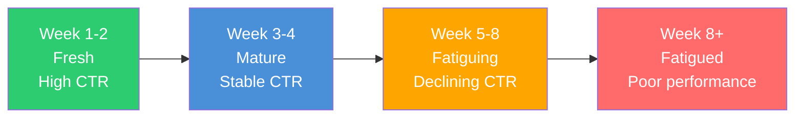

## Why creative is everything

You can target the perfect audience and set the ideal budget, but if your ad looks boring, nobody taps it. Studies and platform data consistently show that **creative quality drives 50-80% of campaign performance** — more than targeting, bidding, or budget combined.

As platforms move toward automated targeting (Meta's Advantage+, Google's Performance Max), the creative becomes your primary lever for differentiation. The algorithm handles who sees your ad. **You handle what they see.**

<Note>
  The term "creative" in advertising refers to all the visual and textual elements of an ad — the image or video, headline, body copy, and call to action. When someone says "test new creatives," they mean try new ad designs and messages.
</Note>

---

## The anatomy of a digital ad

Every ad, regardless of platform, contains these components:

```
┌──────────────────────────────────┐
│  Brand name / Profile             │
│  Sponsored label                  │
│                                   │
│  ┌─────────────────────────────┐  │
│  │                             │  │
│  │     VISUAL ASSET            │  │
│  │     (Image, Video,          │  │
│  │      Carousel, etc.)        │  │
│  │                             │  │
│  └─────────────────────────────┘  │
│                                   │
│  Primary text / Body copy         │
│  "Your main message here..."      │
│                                   │
│  Headline (bold)                  │
│  Description (supporting text)    │
│                                   │
│  [ Call to Action Button ]        │
│                                   │
│  Destination URL / App Store link │
└──────────────────────────────────┘
```

| Component | Purpose | Character limits (Meta) | Tips |
|-----------|---------|------------------------|------|
| **Visual asset** | Stop the scroll, communicate visually | N/A | First 3 seconds are critical for video |
| **Primary text** | Main message, value proposition | 125 chars visible (more with "See more") | Front-load the hook |
| **Headline** | Bold hook below the visual | 40 characters recommended | Keep it punchy and benefit-focused |
| **Description** | Additional context | 30 characters recommended | Not always displayed |
| **CTA button** | Drive the action | Platform-defined options | Match CTA to your objective |

---

## All ad formats explained

### 1. Static image ads

The simplest format. A single image with text overlay and/or surrounding copy.

<CardGroup cols={2}>
  <Card title="Pros" icon="check">
    - Fastest to produce
    - Works on every platform
    - Easy to test variations
    - Low production cost
    - Great for clear, simple messages
  </Card>
  <Card title="Cons" icon="x">
    - Less engaging than video
    - Hard to demonstrate complex products
    - Easily scrolled past
    - Limited storytelling capability
  </Card>
</CardGroup>

**Best for:** Feature highlights, promotions/discounts, social proof (ratings, testimonials), simple value propositions.

**Design tips:**
- Use bold, contrasting colors to stand out in the feed
- Limit text overlay to 20% of the image (Meta's old rule, still a good guideline)
- Show the product or app in use, not just a logo
- Include one clear focal point — do not clutter

---

### 2. Video ads

Video is the highest-performing format on most platforms. It combines motion, sound, and storytelling to capture attention and communicate value.

<Tabs>
  <Tab title="Short-form (6-15 seconds)">
    **Best for:** Awareness, brand recall, retargeting

    **Structure:**
    ```
    0-3s: HOOK - Stop the scroll (bold visual or statement)
    3-10s: VALUE - Show the product/benefit
    10-15s: CTA - Tell them what to do next
    ```

    **Where it works best:** Instagram Stories/Reels, TikTok, YouTube Shorts, Snap
  </Tab>
  <Tab title="Mid-form (15-30 seconds)">
    **Best for:** App demos, feature explanations, UGC testimonials

    **Structure:**
    ```
    0-3s: HOOK - Problem statement or bold claim
    3-10s: PROBLEM - Agitate the pain point
    10-20s: SOLUTION - Show your app solving the problem
    20-25s: PROOF - Results, ratings, or testimonials
    25-30s: CTA - Clear call to action
    ```

    **Where it works best:** Facebook Feed, Instagram Feed, TikTok, YouTube In-Stream
  </Tab>
  <Tab title="Long-form (30-60+ seconds)">
    **Best for:** Complex products, storytelling, documentary-style, tutorials

    **Where it works best:** YouTube (pre-roll and in-stream), Facebook Watch, connected TV

    **Note:** Only 15-25% of users watch past 15 seconds. Front-load your message.
  </Tab>
</Tabs>

<Tip>
  **The 3-second rule:** Users scroll fast. You have approximately 3 seconds to stop their thumb, communicate what your app does, and make them want to learn more. If your video does not hook in 3 seconds, the rest does not matter.
</Tip>

**Video production tips:**
- Add captions/subtitles — 85% of social video is watched without sound
- Film in vertical (9:16) for mobile-first platforms
- Use movement in the first frame (static opening frames get scrolled past)
- Show real app UI/UX — users want to see what they will get
- Keep it authentic — overproduced content often underperforms raw/authentic content

---

### 3. Carousel ads

A swipeable series of 2-10 images or videos, each with its own headline, description, and link.

**Best for:** Showcasing multiple features, step-by-step stories, product catalogs, before/after comparisons.

**Available on:** Meta, Google, TikTok, LinkedIn, Twitter/X, Snap

| Strategy | How to use carousel |
|----------|-------------------|
| **Feature showcase** | Each card highlights a different app feature |
| **Story arc** | Cards tell a sequential story (problem → solution → results) |
| **Social proof** | Each card shows a different user testimonial or review |
| **Comparison** | Card 1: Without your app. Card 2: With your app. |
| **Tutorial** | Step-by-step guide on how to use your app |

<Tip>
  **The first card is everything.** Most users will not swipe, so make Card 1 strong enough to stand alone. Use the swipe action as a bonus engagement opportunity, not a requirement.
</Tip>

---

### 4. Collection ads

A cover image or video with a grid of product images below it. When tapped, it opens a full-screen, fast-loading experience (Instant Experience on Meta).

**Best for:** E-commerce apps, product catalogs, shopping experiences.

**Available on:** Meta (Collection + Instant Experience), Google (Performance Max with product feeds), TikTok (Collection Ads)

---

### 5. Playable ads

Interactive mini-games that let users try a simplified version of your app before installing.

**Best for:** Mobile games (the dominant use case), interactive app previews.

**Available on:** Meta, Google, Unity Ads, ironSource, AppLovin, TikTok

<Note>
  Playable ads have some of the **highest conversion rates** in mobile gaming because they let users experience the product before committing. However, they are the most expensive to produce and require development skills (HTML5).
</Note>

---

### 6. Stories and Reels ads

Full-screen vertical ads that appear between organic Stories or Reels content.

**Format:** 9:16 vertical, full screen

| Platform | Stories | Reels/Short-form |
|----------|---------|-----------------|
| **Meta** | Instagram Stories, Facebook Stories | Instagram Reels, Facebook Reels |
| **TikTok** | N/A | In-Feed (same format as Reels) |
| **Snap** | Snap Ads (between Stories) | Spotlight Ads |
| **YouTube** | N/A | YouTube Shorts |

**Creative tips for Stories/Reels:**
- Film natively on a phone for authentic feel
- Use the first 1-2 seconds as a strong hook
- Add interactive elements (polls, stickers) on Meta Stories
- Keep total length 5-15 seconds for Stories, 15-30 for Reels
- Use trending audio on TikTok and Reels

---

### 7. Other formats

| Format | Description | Available on |
|--------|------------|-------------|
| **App Store screenshots** | Your App Store/Play Store listing screenshots used as ads | Apple Search Ads |
| **Responsive display ads** | Upload multiple assets, Google assembles combinations | Google Display Network |
| **Lead form ads** | Form built into the ad, user never leaves the platform | Meta, Google, TikTok, LinkedIn |
| **Dynamic product ads** | Automatically show products from your catalog to interested users | Meta, Google, TikTok |
| **AR/Camera ads** | Augmented reality filters and effects | Snap, Meta, TikTok |
| **Branded content / Spark Ads** | Promote organic creator posts as ads | TikTok (Spark Ads), Meta (Branded Content) |

---

## Creative specs by platform

### Image ad specs

| Platform | Placement | Recommended size | Aspect ratio | Max file size |
|----------|-----------|-----------------|-------------|--------------|
| **Meta** - Feed | Feed (FB + IG) | 1080 x 1080 | 1:1 | 30 MB |
| **Meta** - Stories | Stories (FB + IG) | 1080 x 1920 | 9:16 | 30 MB |
| **Meta** - Reels | Reels (FB + IG) | 1080 x 1920 | 9:16 | 30 MB |
| **Google** - Display | Display Network | Multiple (300x250, 728x90, etc.) | Various | 150 KB |
| **Google** - Demand Gen | YouTube, Discover, Gmail | 1200 x 628 (landscape), 1080 x 1080 (square) | 1.91:1, 1:1 | 5 MB |
| **TikTok** - Feed | In-Feed | 1080 x 1920 | 9:16 | 500 MB |
| **Apple** - Search | App Store | Auto from App Store listing | N/A | N/A |

### Video ad specs

| Platform | Placement | Recommended resolution | Aspect ratio | Length | Max file size |
|----------|-----------|----------------------|-------------|--------|--------------|
| **Meta** - Feed | Feed | 1080 x 1080 or 1080 x 1350 | 1:1 or 4:5 | Up to 240 min (15-30s recommended) | 4 GB |
| **Meta** - Stories/Reels | Stories/Reels | 1080 x 1920 | 9:16 | Up to 60s (15s recommended for Stories) | 4 GB |
| **Google** - YouTube | In-stream | 1920 x 1080 or 1080 x 1920 | 16:9 or 9:16 | 15s, 30s, or 60s+ | 256 GB |
| **Google** - App | App campaigns | 1080 x 1920 (portrait) | 9:16, 16:9, 1:1 | 10-30s recommended | 100 MB |
| **TikTok** | In-Feed | 1080 x 1920 | 9:16 | 5-60s (15-30s recommended) | 500 MB |
| **Apple** | N/A | N/A | N/A | N/A | N/A |

<Tip>
  **Create vertical (9:16) first.** Mobile users hold their phones vertically 94% of the time. Start with 9:16 for Stories, Reels, and TikTok, then crop to 1:1 or 4:5 for feed placements. Most editing tools can handle this workflow easily.
</Tip>

---

## Headline and copy formulas

Writing ad copy does not require a literature degree. Use these proven formulas:

### Headline formulas

| Formula | Template | Example |
|---------|----------|---------|
| **Benefit-first** | [Benefit] in [Timeframe] | "Learn Spanish in 10 Minutes a Day" |
| **Number-based** | [Number] Ways to [Desired Outcome] | "5 Ways to Save Money Faster" |
| **Question** | Still [Pain Point]? | "Still Forgetting Your Habits?" |
| **How-to** | How to [Desired Outcome] Without [Pain Point] | "How to Get Fit Without a Gym" |
| **Social proof** | Join [Number] People Who [Outcome] | "Join 50K Users Who Track Smarter" |
| **Curiosity gap** | The [Adjective] [Thing] for [Audience] | "The Simplest Budget App for Beginners" |
| **Direct CTA** | [Action] + [Benefit] | "Download Free — Start Tracking Today" |
| **Comparison** | [Your App] vs. [Old Way] | "One App vs. 10 Spreadsheets" |

### Body copy formulas

<AccordionGroup>
  <Accordion title="PAS — Problem, Agitate, Solve">
    **The most reliable ad copy structure:**

    1. **Problem:** State the problem your audience has
    2. **Agitate:** Make it feel worse (consequences of not solving it)
    3. **Solve:** Present your app as the solution

    **Example:**
    ```
    Tired of losing track of your expenses? (Problem)
    Every month, money disappears and you have no idea where it went. (Agitate)
    Budget Buddy tracks every dollar automatically. Download free today. (Solve)
    ```
  </Accordion>

  <Accordion title="AIDA — Attention, Interest, Desire, Action">
    1. **Attention:** Grab their attention with a bold statement
    2. **Interest:** Share something interesting or unexpected
    3. **Desire:** Make them want your product
    4. **Action:** Tell them exactly what to do

    **Example:**
    ```
    People waste 2 hours a day on task management. (Attention)
    TaskFlow uses AI to organize your day in 30 seconds. (Interest)
    Used by 100K+ professionals. 4.8 stars on the App Store. (Desire)
    Try it free — download now. (Action)
    ```
  </Accordion>

  <Accordion title="BAB — Before, After, Bridge">
    1. **Before:** Describe life without your product
    2. **After:** Describe life with your product
    3. **Bridge:** Your product is the bridge between the two

    **Example:**
    ```
    Before: Scattered notes in 5 different apps. (Before)
    After: Everything organized in one beautiful place. (After)
    NoteHub brings all your notes together. Try it free. (Bridge)
    ```
  </Accordion>

  <Accordion title="Feature → Benefit → Proof">
    1. **Feature:** What your app does
    2. **Benefit:** Why that matters to the user
    3. **Proof:** Evidence it works

    **Example:**
    ```
    Auto-sync across all devices. (Feature)
    Never lose a note again, no matter which device you're on. (Benefit)
    Trusted by 200K users. 4.9 stars. (Proof)
    ```
  </Accordion>
</AccordionGroup>

---

## Call-to-action (CTA) types

The CTA button is the last thing a user sees before deciding to tap. Choose the right one:

| CTA | Best for | Tone |
|-----|----------|------|
| **Install Now** | App install campaigns | Direct, action-oriented |
| **Download** | App install campaigns | Simple, clear |
| **Learn More** | Awareness, consideration | Softer, less commitment |
| **Sign Up** | Registration-focused campaigns | Direct |
| **Try Free** | Freemium apps | Reduces risk perception |
| **Get Started** | Onboarding-focused | Forward-looking |
| **Shop Now** | E-commerce | Action-oriented |
| **Book Now** | Services, appointments | Action-oriented |
| **Get Offer** | Promotional campaigns | Creates urgency |
| **Play Game** | Gaming apps | Fun, inviting |
| **Watch More** | Video campaigns | Curiosity-driven |
| **Subscribe** | Subscription services | Clear commitment |

<Tip>
  **"Install Now" and "Try Free" are the best CTAs for app install campaigns.** "Learn More" works better for higher-consideration products where users need more information before converting. Test 2-3 CTA options to see what your audience prefers.
</Tip>

---

## Creative fatigue — what it is and how to fight it

**Creative fatigue** happens when your audience has seen your ad too many times. Performance declines because people stop paying attention to something they have already seen.

### Signs of creative fatigue

| Signal | What to look for |
|--------|-----------------|
| **Rising CPM/CPC** | Costs increasing without changes to budget or targeting |
| **Declining CTR** | Click-through rate dropping week over week |
| **Falling conversion rate** | Same clicks but fewer conversions |
| **Frequency above 3-4** | Average user has seen your ad 3+ times |
| **Negative feedback increase** | More "hide ad" or "not relevant" reports |

### The creative fatigue timeline



### How to combat creative fatigue

<Steps>
  <Step title="Maintain a creative pipeline">
    Always have new creatives in production. Do not wait until performance drops to start making new ads. Aim to introduce 2-3 new creatives every 2-4 weeks.
  </Step>
  <Step title="Rotate creatives proactively">
    Do not run the same 3 ads for months. Add new ads and pause underperformers regularly. Most platforms automatically allocate impressions to the best-performing ads — but even winners eventually fatigue.
  </Step>
  <Step title="Vary your creative angles">
    Do not just change the color of your image. Change the **angle** — different hooks, different value propositions, different emotional appeals, different formats (switch from image to video).
  </Step>
  <Step title="Use dynamic creative optimization (DCO)">
    Platforms like Meta offer Dynamic Creative (now called Advantage+ Creative), where you upload multiple headlines, images, and descriptions, and the platform automatically tests all combinations.
  </Step>
  <Step title="Monitor frequency">
    Set up alerts or check weekly. When frequency exceeds 3-4 for cold audiences (or 8-10 for retargeting), it is time for fresh creative.
  </Step>
</Steps>

---

## Creative testing framework

Random creative testing wastes time and budget. Use a structured framework:

### The iterative testing method

<Steps>
  <Step title="Test concepts first (big swings)">
    Start by testing fundamentally different creative concepts:
    - Concept A: App demo video
    - Concept B: UGC testimonial
    - Concept C: Problem/Solution image
    - Concept D: Social proof carousel

    Run for 7-14 days with equal budget. Identify the winning concept.
  </Step>
  <Step title="Test variations of the winner">
    Take the winning concept and create variations:
    - Different hooks (first 3 seconds for video)
    - Different color schemes
    - Different copy angles
    - Different CTAs

    Run for 7 days. Identify the winning variation.
  </Step>
  <Step title="Test elements within the winning variation">
    Fine-tune specific elements:
    - Headline A vs. Headline B
    - CTA "Install Now" vs. "Try Free"
    - With music vs. without music
    - Short (15s) vs. medium (30s)
  </Step>
  <Step title="Scale the winner, restart the process">
    Push budget to the proven winner. Meanwhile, start testing new concepts again (go back to Step 1). This creates a continuous pipeline.
  </Step>
</Steps>

### Testing budget allocation

| Test phase | Budget allocation | Duration | Success metric |
|-----------|-------------------|----------|----------------|
| **Concept testing** | Equal split across concepts (e.g., $10/each) | 7-14 days | CTR and CPI |
| **Variation testing** | 60% to winner, 40% split among variations | 7 days | CPI and conversion rate |
| **Element testing** | 70% to winner, 30% to test | 5-7 days | CPI, CPA, or ROAS |
| **Scaling** | 80-90% to proven winner | Ongoing | CPA stability at scale |

<Note>
  **Statistical significance matters.** Do not declare a winner after 10 clicks. Each ad variation needs at least 100 clicks or 30-50 conversions to draw reliable conclusions. Use the platform's built-in A/B test tools for formal testing when possible.
</Note>

---

## UGC — User Generated Content

UGC-style ads (content that looks like it was made by a real user, not a brand) are currently the **highest-performing ad format** on Meta and TikTok.

### Why UGC works

- **Authenticity:** Looks like a friend's recommendation, not an advertisement
- **Trust:** Real people talking about real experiences
- **Native feel:** Blends into the feed (users do not immediately recognize it as an ad)
- **Lower production cost:** A phone camera and good lighting is all you need
- **Platform preference:** TikTok and Instagram algorithms favor native-looking content

### Types of UGC ads

| Type | Description | Example |
|------|------------|---------|
| **Talking head** | Creator speaks directly to camera about the product | "I've been using this app for 2 weeks and..." |
| **Unboxing / first use** | Creator shows their first experience with the product | "I just downloaded this and let me show you..." |
| **Before/After** | Creator shows transformation or improvement | "Before this app, I was... Now I..." |
| **Day-in-the-life** | Creator integrates the product into their daily routine | "How I use [app] every morning" |
| **Reaction** | Creator reacts to a feature or result | "Wait, this actually works?!" |
| **Tutorial** | Creator teaches how to use the product | "3 features in [app] you need to know" |

### How to get UGC

<AccordionGroup>
  <Accordion title="Option 1: UGC platforms">
    Platforms that connect brands with creators who produce content for a flat fee.

    | Platform | Price range | Turnaround |
    |----------|-----------|-----------|
    | **Billo** | $100-300 per video | 5-10 days |
    | **Insense** | $200-500 per video | 7-14 days |
    | **Trend** | $100-250 per video | 7 days |
    | **JoinBrands** | $50-200 per video | 5-10 days |
    | **Clip** | $150-400 per video | 5-14 days |
  </Accordion>
  <Accordion title="Option 2: Direct outreach to creators">
    Find micro-influencers (1K-50K followers) in your niche on TikTok or Instagram. DM them with a collaboration offer. Typically $100-500 for a short UGC video, depending on their audience size.
  </Accordion>
  <Accordion title="Option 3: Create it yourself">
    You or your team can film UGC-style content. The key ingredients:
    - Good natural lighting (near a window)
    - Phone camera (no professional equipment needed)
    - Authentic, conversational script (not corporate-speak)
    - Vertical format (9:16)
    - Captions/subtitles
  </Accordion>
  <Accordion title="Option 4: Repurpose real user content">
    Ask existing users for permission to use their reviews, screenshots, or videos in ads. Real user content is the most authentic UGC possible.
  </Accordion>
</AccordionGroup>

---

## AI tools for creative production

AI is transforming how ads are created. Here are the categories and leading tools:

### AI creative tools

| Category | Tools | What it does | Cost |
|----------|-------|-------------|------|
| **Image generation** | Midjourney, DALL-E 3, Adobe Firefly, Stable Diffusion | Generate ad images from text prompts | Free-$30/month |
| **Video generation** | Runway, Pika, Synthesia, HeyGen | Generate or edit video content | $15-100/month |
| **Copywriting** | ChatGPT, Claude, Jasper, Copy.ai | Write ad headlines, body copy, scripts | Free-$50/month |
| **Design automation** | Canva AI, Adobe Express, Figma AI | Auto-layout, background removal, resize | Free-$15/month |
| **Video editing** | CapCut, Descript, Opus Clip | Edit, caption, and repurpose video | Free-$30/month |
| **Creative analytics** | Motion, Atria, Foreplay | Analyze competitor ads, track creative performance | $50-200/month |
| **Ad spy tools** | Meta Ad Library, TikTok Creative Center, Foreplay | See competitors' live ads for inspiration | Free-$100/month |

<Tip>
  **Start with free tools.** Meta Ad Library (free) lets you see every active ad from any brand. TikTok Creative Center (free) shows top-performing ads. CapCut (free) handles video editing. Canva free tier covers basic design. You can create professional ads without spending on tools.
</Tip>

### AI creative workflow

<Steps>
  <Step title="Research competitors">
    Use Meta Ad Library and TikTok Creative Center to study what competitors are running. Note formats, hooks, and messaging that appear across multiple competitors (likely working).
  </Step>
  <Step title="Generate concepts with AI">
    Use ChatGPT/Claude to brainstorm ad angles, write scripts, and generate headline variations. Provide context about your app, audience, and goals.
  </Step>
  <Step title="Create visuals">
    Use Canva or Adobe Express for images. Use CapCut for video editing. Use AI image generators for backgrounds or conceptual images (but not for faces — AI faces reduce trust).
  </Step>
  <Step title="Produce at scale">
    Create 5-10 variations by mixing and matching hooks, visuals, copy, and CTAs. Dynamic Creative on Meta can test combinations automatically.
  </Step>
  <Step title="Analyze and iterate">
    Use platform analytics or tools like Motion to understand which creative elements drive performance. Feed insights back into step 2.
  </Step>
</Steps>

---

## Free and low-cost tools to make ads

You do not need to hire a designer or a video production team:

| Tool | What it does | Cost | Best for |
|------|-------------|------|----------|
| **Canva** | Image and video design, templates | Free tier available | Beginners, images, simple videos |
| **CapCut** | Video editing with effects and captions | Free | TikTok/Reels style videos |
| **Adobe Express** | Quick graphic design | Free tier available | Social media graphics |
| **Figma** | Advanced design and prototyping | Free tier available | Polished designs |
| **Screen recorder** | Record your app in action | Built into phone | App demo videos |
| **Meta Ad Library** | View all active Meta ads | Free | Competitor research |
| **TikTok Creative Center** | Top-performing TikTok ads | Free | TikTok ad inspiration |
| **Descript** | Video editing, auto-captions, filler word removal | Free tier available | Polishing UGC videos |
| **Remove.bg** | Remove image backgrounds | Free (limited) | Clean product images |

---

## Creative best practices summary

<CardGroup cols={2}>
  <Card title="Do" icon="check">
    - Hook in the first 3 seconds
    - Show the app in action (screen recordings)
    - Add captions to all videos
    - Test 3-5 creative variations minimum
    - Refresh creatives every 2-4 weeks
    - Film vertical (9:16) first
    - Use real user testimonials when possible
    - Address a specific pain point
    - Keep text short and scannable
    - Use platform-native styles (look like organic content)
  </Card>
  <Card title="Don't" icon="x">
    - Use generic stock photos
    - Write long paragraphs of copy
    - Run only one ad with no variations
    - Ignore creative fatigue signals
    - Use the same creative across all platforms without adapting
    - Make false or misleading claims
    - Use tiny, unreadable text in images
    - Forget a clear call to action
    - Over-produce content (authenticity wins)
    - Ignore platform ad specs (cropped or distorted ads perform terribly)
  </Card>
</CardGroup>

---

## Key takeaways

<Steps>
  <Step title="Creative drives performance">
    Creative quality is the number one factor in ad success — more than targeting, bidding, or budget. Invest your time here.
  </Step>
  <Step title="Video and UGC dominate">
    Video (especially short-form, 15-30 seconds) and UGC-style content are the top-performing formats on Meta and TikTok in 2024-2025.
  </Step>
  <Step title="Follow the 3-second rule">
    Hook viewers in the first 3 seconds or lose them forever. Lead with your strongest visual or most compelling statement.
  </Step>
  <Step title="Test systematically">
    Use the concept > variation > element testing framework. Always have multiple creatives running. Never rely on a single ad.
  </Step>
  <Step title="Fight creative fatigue proactively">
    Monitor frequency and CTR. Refresh creatives every 2-4 weeks. Maintain a production pipeline so new ads are always ready.
  </Step>
  <Step title="Use AI and free tools">
    You do not need a big budget to create great ads. Free tools like Canva, CapCut, and Meta Ad Library give you everything you need to start.
  </Step>
</Steps>

---

## Next up

Your creative gets people to tap. Now you need to know what happens after the tap — that is tracking and attribution.

<Card
  title="Tracking & Attribution"
  icon="arrow-right"
  href="/concepts/tracking-and-attribution"
>
  How to know which ads are actually bringing you users — and how to measure everything.
</Card>
