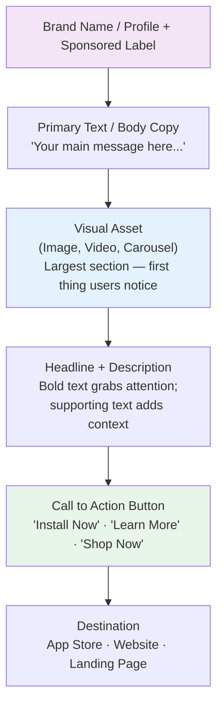
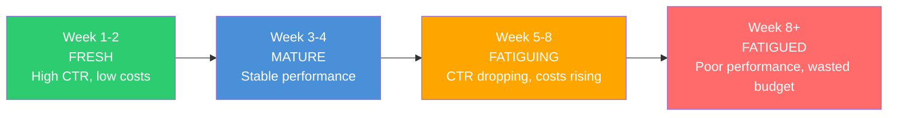

<Tip>
**In a hurry?** Skip to the [Quickstart Guide](/playbook/vibe-coder-quick-start) to launch your first campaign in 30 minutes. You can always come back to learn the theory later.
</Tip>

## Why creative is the single most important thing

Here is a truth that surprises most beginners: **creative quality drives 50-80% of your campaign performance.** More than targeting. More than bidding. More than budget. More than anything else.

You can target the perfect audience and set the ideal budget, but if your ad looks boring or confusing, nobody taps on it. It is like owning the best restaurant in town but having a blank sign outside — people just walk right past.

As platforms move toward automated targeting (Meta's Advantage+, Google's Performance Max), the creative becomes your primary lever. The algorithm decides WHO sees your ad. **You decide WHAT they see.** That is your superpower.

<Note>
  Quick vocab note: In advertising, the word "creative" refers to all the visual and textual elements of an ad — the image or video, headline, body copy, and call to action. When someone says "test new creatives," they mean try new ad designs and messages.
</Note>

<Tip>
  **Pro Tip: Think of your creative as a 3-second audition.** Users scroll FAST. You have about 3 seconds to convince someone to stop scrolling, process what they are seeing, and decide to learn more. If your ad does not hook in 3 seconds, everything else is irrelevant.
</Tip>

---

## The anatomy of a digital ad

Every ad, regardless of platform, has these building blocks:



| Component | Purpose | Meta character limits | Key tip |
|---|---|---|---|
| **Visual asset** | Stop the scroll, communicate value visually | N/A (specs below) | First 3 seconds of video are everything |
| **Primary text** | Main message above the visual | 125 chars visible (more behind "See more") | Front-load the hook — most people will not tap "See more" |
| **Headline** | Bold text below the visual | 40 characters recommended | Keep it punchy, benefit-focused |
| **Description** | Additional context | 30 characters recommended | Not always displayed — do not rely on it |
| **CTA button** | Drive the desired action | Platform-defined options | Match CTA to your objective (Install Now, Try Free, etc.) |

---

## All ad formats explained

### 1. Static image ads

The simplest format. One image, some text. Done.

<CardGroup cols={2}>
  <Card title="Why images are great" icon="check">
    - Fastest to create (minutes, not hours)
    - Works on every platform
    - Easy to test many variations quickly
    - Virtually zero production cost
    - Perfect for clear, simple messages
  </Card>
  <Card title="Limitations" icon="x">
    - Less engaging than video
    - Hard to demonstrate complex apps
    - Easily scrolled past in busy feeds
    - Limited storytelling ability
  </Card>
</CardGroup>

**Best for:** Feature highlights, promotions/discounts, social proof (ratings, testimonials), simple value propositions.

**Design tips:**
- Use bold, contrasting colors to stand out in the feed
- Limit text overlay to about 20% of the image area (Meta's old rule, still a good guideline)
- Show the app IN USE — screenshots of the actual UI — not just a logo
- One clear focal point per image — do not clutter

---

### 2. Video ads (the performance king)

Video is the highest-performing format on most platforms. It combines motion, sound, and storytelling to capture attention in ways a static image simply cannot.

<Tabs>
  <Tab title="Short-form (6-15 seconds)">
    **Best for:** Awareness, brand recall, retargeting

    **The structure that works:**
    ```
    0-3s: HOOK - Stop the scroll (bold visual or surprising statement)
    3-10s: VALUE - Show the product/benefit in action
    10-15s: CTA - Tell them exactly what to do next
    ```

    **Where it works best:** Instagram Stories/Reels, TikTok, YouTube Shorts, Snapchat
  </Tab>
  <Tab title="Mid-form (15-30 seconds)">
    **Best for:** App demos, feature explanations, UGC testimonials

    **The structure that works:**
    ```
    0-3s: HOOK - Problem statement or bold claim
    3-10s: PROBLEM - Agitate the pain point
    10-20s: SOLUTION - Show your app solving the problem
    20-25s: PROOF - Results, ratings, or testimonials
    25-30s: CTA - Clear call to action
    ```

    **Where it works best:** Facebook Feed, Instagram Feed, TikTok, YouTube
  </Tab>
  <Tab title="Long-form (30-60+ seconds)">
    **Best for:** Complex products, detailed storytelling, tutorials

    **Where it works best:** YouTube pre-roll/in-stream, Facebook Watch, connected TV

    **Reality check:** Only 15-25% of users watch past 15 seconds. Always front-load your key message.
  </Tab>
</Tabs>

**Essential video production tips:**
- **Add captions/subtitles always.** 85% of social video is watched WITHOUT sound. If your message requires audio to understand, you are losing most of your audience.
- **Film vertical (9:16) first.** Mobile users hold their phones vertically 94% of the time.
- **Use movement in the first frame.** A static opening frame gets scrolled past. Start with motion.
- **Show real app UI.** Screen recordings of your actual app are incredibly effective — users want to see what they are getting.
- **Keep it authentic.** Overproduced, "corporate" content often UNDERPERFORMS raw, authentic content. Imperfection can actually be a strength.

<Tip>
  **Pro Tip: The 3-second rule is non-negotiable.** You have approximately 3 seconds to hook a user before they scroll. Test different hooks obsessively — change the first 3 seconds of your video and keep everything else the same. You will be amazed at how much the hook alone affects performance.
</Tip>

---

### 3. Carousel ads

A swipeable series of 2-10 images or videos, each with its own headline, description, and link.

**Best for:** Showcasing multiple features, step-by-step stories, product catalogs, before/after comparisons.

| Strategy | How to use the carousel |
|---|---|
| **Feature showcase** | Each card highlights a different app feature |
| **Story arc** | Cards tell a sequential story (problem, solution, results) |
| **Social proof** | Each card shows a different user testimonial |
| **Before/After** | Card 1: Life without your app. Card 2: Life WITH your app. |
| **Tutorial** | Step-by-step guide on how to use your app |

<Tip>
  **Pro Tip: Card 1 is everything.** Most users will NOT swipe. Make the first card strong enough to stand completely on its own. The swipe is a bonus, not a requirement. If Card 1 does not hook them, Cards 2-10 do not matter.
</Tip>

---

### 4. Other formats worth knowing

| Format | Description | Best for | Available on |
|---|---|---|---|
| **Collection ads** | Cover image/video + product grid below | E-commerce apps | Meta, Google, TikTok |
| **Playable ads** | Interactive mini-games to try before installing | Mobile games | Meta, Google, Unity, AppLovin |
| **Stories/Reels ads** | Full-screen vertical ads between organic content | Mobile-first apps | Meta, TikTok, Snap, YouTube |
| **Responsive display** | Upload multiple assets, Google assembles combinations | Broad reach | Google Display Network |
| **Spark Ads** | Promote organic TikTok posts as ads | TikTok growth | TikTok |
| **Lead form ads** | Form built into the ad (user never leaves platform) | Lead generation | Meta, Google, TikTok, LinkedIn |

<Note>
  **Playable ads** have some of the highest conversion rates in mobile gaming because users experience the game before installing. However, they are the most expensive to produce and require HTML5 development skills. Save these for when you have budget and proven game mechanics.
</Note>

---

## Creative specs by platform (your cheat sheet)

### Image specs

| Platform | Placement | Size | Aspect ratio | Max file |
|---|---|---|---|---|
| **Meta** - Feed | Facebook + Instagram Feed | 1080 x 1080 | 1:1 | 30 MB |
| **Meta** - Stories/Reels | Stories + Reels | 1080 x 1920 | 9:16 | 30 MB |
| **Google** - Display | Display Network | Various (300x250, 728x90, etc.) | Various | 150 KB |
| **Google** - Demand Gen | YouTube, Discover, Gmail | 1200 x 628 (landscape), 1080 x 1080 (square) | 1.91:1, 1:1 | 5 MB |
| **TikTok** - Feed | In-Feed | 1080 x 1920 | 9:16 | 500 MB |
| **Apple** - Search | App Store | Auto from your listing | N/A | N/A |

### Video specs

| Platform | Placement | Resolution | Aspect ratio | Recommended length | Max file |
|---|---|---|---|---|---|
| **Meta** - Feed | Feed | 1080 x 1080 or 1080 x 1350 | 1:1 or 4:5 | 15-30 seconds | 4 GB |
| **Meta** - Stories/Reels | Stories/Reels | 1080 x 1920 | 9:16 | 15s (Stories), 30s (Reels) | 4 GB |
| **Google** - YouTube | In-stream | 1920 x 1080 or 1080 x 1920 | 16:9 or 9:16 | 15s, 30s, or 60s | 256 GB |
| **TikTok** | In-Feed | 1080 x 1920 | 9:16 | 15-30 seconds | 500 MB |

<Tip>
  **Pro Tip: Create vertical (9:16) FIRST, then adapt.** Since most ad impressions happen on mobile and users hold their phones vertically 94% of the time, start with 9:16 for Stories, Reels, and TikTok. Then crop to 1:1 or 4:5 for feed placements. This workflow is much easier than going the other direction.
</Tip>

---

## Ad copy that actually works (formulas you can steal)

Writing ad copy does not require a creative writing degree. Use these proven formulas.

### Headline formulas

| Formula | Template | Real example |
|---|---|---|
| **Benefit-first** | [Benefit] in [Timeframe] | "Learn Spanish in 10 Minutes a Day" |
| **Number-based** | [Number] Ways to [Outcome] | "5 Ways to Save Money Faster" |
| **Question** | Still [Pain Point]? | "Still Forgetting Your Habits?" |
| **How-to** | How to [Outcome] Without [Pain] | "How to Get Fit Without a Gym" |
| **Social proof** | Join [Number] People Who [Outcome] | "Join 50K Users Who Track Smarter" |
| **Curiosity gap** | The [Adjective] [Thing] for [Audience] | "The Simplest Budget App for Beginners" |
| **Direct CTA** | [Action] + [Benefit] | "Download Free — Start Tracking Today" |
| **Comparison** | [Your App] vs. [Old Way] | "One App vs. 10 Spreadsheets" |

### Body copy formulas

<AccordionGroup>
  <Accordion title="PAS — Problem, Agitate, Solve (the most reliable formula)">
    1. **Problem:** State the problem your audience has
    2. **Agitate:** Make it feel real and urgent
    3. **Solve:** Present your app as the answer

    **Example:**
    ```
    Tired of losing track of your expenses? (Problem)
    Every month, money disappears and you have no idea where it went.
    Bills sneak up on you. Savings goals slip away. (Agitate)
    Budget Buddy tracks every dollar automatically — no spreadsheets needed.
    Download free today. (Solve)
    ```
  </Accordion>

  <Accordion title="AIDA — Attention, Interest, Desire, Action">
    1. **Attention:** Bold statement to grab them
    2. **Interest:** Share something interesting or unexpected
    3. **Desire:** Make them want your product
    4. **Action:** Tell them exactly what to do

    **Example:**
    ```
    People waste 2 hours a day on task management. (Attention)
    TaskFlow uses AI to organize your entire day in 30 seconds. (Interest)
    Used by 100K+ professionals. 4.8 stars on the App Store. (Desire)
    Try it free — download now. (Action)
    ```
  </Accordion>

  <Accordion title="BAB — Before, After, Bridge">
    1. **Before:** Describe life without your product
    2. **After:** Describe life with your product
    3. **Bridge:** Your product connects the two

    **Example:**
    ```
    Before: Scattered notes in 5 different apps. Chaos. (Before)
    After: Everything organized in one beautiful place. Peace of mind. (After)
    NoteHub brings it all together. Try it free. (Bridge)
    ```
  </Accordion>

  <Accordion title="Feature > Benefit > Proof">
    1. **Feature:** What your app does (factual)
    2. **Benefit:** Why that matters to the user (emotional)
    3. **Proof:** Evidence it works (credible)

    **Example:**
    ```
    Auto-syncs across all your devices. (Feature)
    Never lose a note again, no matter which device you are on. (Benefit)
    Trusted by 200K users. 4.9 stars. (Proof)
    ```
  </Accordion>
</AccordionGroup>

---

## Call-to-action (CTA) buttons

The CTA button is the last thing a user sees before deciding to tap. Choose wisely:

| CTA | Best for | Psychological effect |
|---|---|---|
| **Install Now** | App install campaigns | Direct, action-oriented, no ambiguity |
| **Download** | App install campaigns | Simple, universally understood |
| **Try Free** | Freemium apps | Reduces perceived risk ("I can try it!") |
| **Get Started** | Onboarding-focused apps | Forward-looking, inviting |
| **Learn More** | Higher-consideration products | Softer, lower commitment, good for awareness |
| **Shop Now** | E-commerce apps | Action-oriented for shoppers |
| **Play Game** | Gaming apps | Fun, inviting |
| **Subscribe** | Subscription services | Clear commitment signal |

<Tip>
  **Pro Tip: "Install Now" and "Try Free" consistently perform best for app install campaigns.** "Try Free" is especially powerful for paid apps or apps with premium tiers because it reduces the perceived risk. Test 2-3 CTA options — small differences can move the needle significantly.
</Tip>

---

## Creative fatigue: the silent performance killer

**Creative fatigue** happens when your audience has seen your ad too many times. Performance declines because people stop noticing something they have already seen. It is like hearing your favorite song on repeat — eventually, you tune it out.

### How to spot creative fatigue

| Signal | What to look for |
|---|---|
| **Rising CPM/CPC** | Costs increasing without any other changes |
| **Declining CTR** | Click-through rate dropping week over week |
| **Falling conversion rate** | Same clicks but fewer installs |
| **Frequency above 3-4** | Average user has seen your ad 3+ times (for cold audiences) |
| **Negative feedback** | More "hide ad" or "not relevant" reports |

### The creative fatigue lifecycle



Average CTR for Facebook ads is approximately **0.9-1.5%**. If your CTR drops significantly below 0.9%, creative fatigue is likely a factor.

### How to fight creative fatigue

<Steps>
  <Step title="Maintain a creative pipeline (always be producing)">
    Do not wait until performance drops to start making new ads. Always have new creatives in production. Aim to introduce 2-3 new ads every 2-4 weeks.
  </Step>
  <Step title="Rotate creatives proactively">
    Add new ads and pause underperformers regularly. Even winners eventually fatigue. Think of it like rotating the tires on a car — regular maintenance prevents breakdown.
  </Step>
  <Step title="Vary your creative ANGLES, not just details">
    Do not just change the color of your background. Change the entire approach — different hooks, different value propositions, different emotional appeals, different formats (switch from image to video to UGC).
  </Step>
  <Step title="Use Dynamic Creative Optimization">
    Meta's Advantage+ Creative lets you upload multiple headlines, images, and descriptions. The platform automatically tests all combinations and serves the best-performing mix to each user.
  </Step>
  <Step title="Monitor frequency religiously">
    When frequency exceeds 3-4 for cold audiences (or 8-10 for retargeting), it is time for fresh creative. Set up a weekly check for this metric.
  </Step>
</Steps>

<Tip>
  **Pro Tip: The best advertisers treat creative production like a factory, not a one-time event.** They have a continuous pipeline: always researching, always producing, always testing. Even when current ads are performing well, the next batch is already being made. This mindset separates good advertisers from great ones.
</Tip>

---

## Creative testing framework (the systematic approach)

Random creative testing wastes time and budget. Use this structured framework instead:

<Steps>
  <Step title="Step 1: Test CONCEPTS first (big swings)">
    Start by testing fundamentally different creative approaches:
    - Concept A: App demo video (screen recording with voiceover)
    - Concept B: UGC testimonial (real person talking to camera)
    - Concept C: Problem/Solution image (before/after style)
    - Concept D: Social proof carousel (reviews and ratings)

    Run for 7-14 days with equal budget. Identify the winning concept.
  </Step>
  <Step title="Step 2: Test VARIATIONS of the winner">
    Take the winning concept and create variations:
    - Different hooks (first 3 seconds for video)
    - Different color schemes or visual styles
    - Different copy angles (emotional vs. logical)
    - Different CTAs

    Run for 7 days. Identify the winning variation.
  </Step>
  <Step title="Step 3: Test individual ELEMENTS">
    Fine-tune specific elements of the winning variation:
    - Headline A vs. Headline B
    - CTA "Install Now" vs. "Try Free"
    - With background music vs. without
    - Short version (15s) vs. medium (30s)
  </Step>
  <Step title="Step 4: Scale the winner, restart the process">
    Push budget to the proven winner. Meanwhile, go back to Step 1 and start testing new concepts. This creates a continuous improvement cycle.
  </Step>
</Steps>

<Note>
  **Statistical significance matters.** Do not declare a winner after 10 clicks. Each ad variation needs at least **100 clicks or 30-50 conversions** to draw reliable conclusions. Platforms also have built-in A/B test tools — use them when available for cleaner results.
</Note>

---

## UGC — the format that is dominating right now

**UGC (User Generated Content)** style ads — content that looks like it was made by a real person, not a brand — are currently the **highest-performing ad format** on Meta and TikTok. Let's talk about why and how to use them.

### Why UGC works so well

- **Authenticity:** Looks like a friend's recommendation, not a corporate ad
- **Trust:** Real people talking about real experiences builds credibility
- **Native feel:** Blends into the feed — users do not immediately realize it is an ad
- **Lower production cost:** A phone camera and good lighting is all you need
- **Platform preference:** TikTok and Instagram algorithms favor native-looking content

### Types of UGC ads

| Type | Description | Example script opener |
|---|---|---|
| **Talking head** | Creator speaks directly to camera | "OK, I have to tell you about this app..." |
| **Unboxing / First use** | Creator shows first experience | "I just downloaded this and let me show you..." |
| **Before/After** | Creator shows transformation | "Before this app, I was... Now I..." |
| **Day-in-the-life** | Product integrated into daily routine | "How I use [app] every morning..." |
| **Reaction** | Creator reacts to a feature | "Wait, this actually works?!" |
| **Tutorial** | Creator teaches how to use it | "3 features you absolutely need to know..." |

### How to get UGC content

<AccordionGroup>
  <Accordion title="Option 1: UGC platforms (easiest)">
    Platforms that connect brands with creators who produce content for a flat fee:

    | Platform | Price range | Turnaround |
    |---|---|---|
    | **Billo** | $100-300 per video | 5-10 days |
    | **Insense** | $200-500 per video | 7-14 days |
    | **Trend** | $100-250 per video | 7 days |
    | **JoinBrands** | $50-200 per video | 5-10 days |
  </Accordion>
  <Accordion title="Option 2: Direct outreach to micro-creators">
    Find micro-influencers (1K-50K followers) in your niche on TikTok or Instagram. DM them with a collaboration offer. Typically $100-500 for a short UGC video, depending on audience size.
  </Accordion>
  <Accordion title="Option 3: Film it yourself (free!)">
    You or your team can create UGC-style content. The secret ingredients:
    - Good natural lighting (near a window works perfectly)
    - Phone camera (seriously, no professional equipment needed)
    - Authentic, conversational script (NOT corporate-speak)
    - Vertical format (9:16)
    - Captions/subtitles (85% watch without sound)

    The "imperfect" quality actually HELPS. Overproduced content looks like an ad. UGC is supposed to look real.
  </Accordion>
  <Accordion title="Option 4: Repurpose real user content">
    Ask existing users for permission to use their reviews, screenshots, or videos in ads. Real user content is the most authentic UGC possible. Offer them a discount code or feature in exchange.
  </Accordion>
</AccordionGroup>

<Tip>
  **Pro Tip: The best UGC follows the "scroll-stopper" formula: Hook in 1 second, problem in 3 seconds, solution in 10 seconds, CTA at the end.** The hook is EVERYTHING. "Stop scrolling if you..." or "I wish I knew about this sooner..." or "POV: you finally find an app that actually works" — these hooks pattern-interrupt and make people pause.
</Tip>

---

## AI tools for creative production

AI is transforming ad creation. Here is your toolkit:

| Category | Tools | What it does | Cost |
|---|---|---|---|
| **Image generation** | Midjourney, DALL-E 3, Adobe Firefly | Generate ad images from text prompts | Free-$30/month |
| **Video generation** | Runway, Pika, Synthesia, HeyGen | Generate or edit video content | $15-100/month |
| **Copywriting** | ChatGPT, Claude, Jasper | Write headlines, body copy, scripts | Free-$50/month |
| **Design** | Canva AI, Adobe Express, Figma AI | Auto-layout, background removal, resize | Free-$15/month |
| **Video editing** | CapCut, Descript, Opus Clip | Edit, caption, and repurpose video | Free-$30/month |
| **Ad research** | Meta Ad Library, TikTok Creative Center | See competitors' live ads | Free |

### The free creative toolkit (everything you need to start)

You do NOT need to spend money on tools to create professional ads:

| Tool | What it does | Cost | Why you need it |
|---|---|---|---|
| **Canva** | Design images, simple videos, templates | Free tier | Your go-to design tool |
| **CapCut** | Video editing with effects and auto-captions | Free | Perfect for TikTok/Reels style |
| **Meta Ad Library** | See every active ad from any brand on Meta | Free | Competitor research goldmine |
| **TikTok Creative Center** | Top-performing TikTok ads and trends | Free | TikTok ad inspiration |
| **Screen recorder** | Record your app in action | Built into your phone | App demo videos |
| **Remove.bg** | Remove image backgrounds instantly | Free (limited) | Clean product images |

<Tip>
  **Pro Tip: Before making ANY ad, spend 30 minutes in Meta Ad Library and TikTok Creative Center.** Search for competitors in your category. Study what they are running. Note the formats, hooks, and messaging that appear across multiple competitors (if everyone is using it, it is probably working). Do not copy — but absolutely get inspired.
</Tip>

---

## Platform-specific creative tips

<Tabs>
  <Tab title="Meta (Facebook / Instagram)">
    - **Feed:** 1:1 or 4:5 ratio works best. Show the app, not just the logo.
    - **Stories:** Full-screen 9:16. Keep to 15 seconds. Add interactive elements (polls, stickers).
    - **Reels:** Native-looking vertical video. Use trending audio if relevant. 15-30 seconds.
    - **General:** Average CTR for Facebook ads is ~0.9-1.5%. If you are above 1.5%, you have a winner. Below 0.9%, iterate on the creative.
    - Use Advantage+ Creative to auto-test combinations of your assets.
  </Tab>
  <Tab title="Google Ads">
    - **Search:** No visual creative needed — it is all text (headlines + descriptions). Focus on strong keywords and compelling copy.
    - **Average CTR for Google Search: ~3-5%** (much higher than display because of intent).
    - **Display:** Average CTR: ~0.5%. Multiple sizes needed (300x250, 728x90, etc.). Use Responsive Display Ads.
    - **YouTube:** Hook in 5 seconds (users can skip after 5s for skippable ads). Vertical for Shorts.
    - **App campaigns:** Upload diverse assets (images, videos, text). Google mixes and matches automatically.
  </Tab>
  <Tab title="TikTok">
    - **The golden rule:** Make TikToks, not ads. Content that looks like organic TikTok content crushes traditional ad formats.
    - Use trending sounds and effects when they fit your brand.
    - UGC performs exceptionally well here.
    - Vertical only (9:16). Horizontal video looks out of place and performs poorly.
    - Spark Ads (promoting organic posts) often outperform traditional in-feed ads.
    - 15-30 seconds is the sweet spot.
  </Tab>
  <Tab title="Apple Search Ads">
    - You do NOT upload creative — Apple pulls from your App Store listing.
    - Your **App Store screenshots are your ad creative.** Make them incredible.
    - Use Custom Product Pages to show different screenshot sets for different keyword themes.
    - Creative testing on Apple means testing different Creative Sets (different screenshot combinations).
  </Tab>
</Tabs>

---

## Creative do's and don'ts

<CardGroup cols={2}>
  <Card title="Do" icon="check">
    - Hook in the first 3 seconds (non-negotiable)
    - Show the app in action (screen recordings)
    - Add captions to ALL videos (85% watch muted)
    - Test 3-5+ creative variations minimum
    - Refresh creatives every 2-4 weeks
    - Film vertical (9:16) first, adapt to other ratios
    - Use real user testimonials when possible
    - Address a specific pain point (not "our app is great")
    - Keep text short and scannable
    - Look at competitor ads for inspiration
  </Card>
  <Card title="Don't" icon="x">
    - Use generic stock photos (people can tell)
    - Write long paragraphs nobody will read
    - Run only one ad with no variations (the algorithm needs options)
    - Ignore creative fatigue signals (monitor frequency + CTR)
    - Use the same creative across all platforms without adapting
    - Make false or misleading claims (will get your account banned)
    - Use tiny, unreadable text in images
    - Forget a clear call to action
    - Over-produce content (authenticity beats polish)
    - Ignore platform ad specs (cropped/distorted ads perform terribly)
  </Card>
</CardGroup>

---

## Key takeaways

<Steps>
  <Step title="Creative drives 50-80% of performance">
    More than targeting, bidding, or budget. If you have limited time and resources, spend them on creative. It is the highest-leverage activity.
  </Step>
  <Step title="Video and UGC are dominating">
    Short-form video (15-30 seconds) and UGC-style content are the top-performing formats on Meta and TikTok right now. If you are only making static images, you are leaving performance on the table.
  </Step>
  <Step title="The 3-second rule is law">
    Hook viewers in 3 seconds or lose them forever. Test different hooks obsessively — the first 3 seconds have more impact on performance than anything else in your video.
  </Step>
  <Step title="Test systematically: Concept > Variation > Element">
    Start with big creative swings (different concepts). Find the winning concept. Then test variations of that winner. Then fine-tune elements. Always be testing.
  </Step>
  <Step title="Fight creative fatigue before it fights you">
    Monitor frequency and CTR weekly. Refresh creatives every 2-4 weeks. Maintain a production pipeline so new ads are always ready. When Facebook ad CTR drops below 0.9%, it is time for fresh creative.
  </Step>
  <Step title="You do not need a big budget for great creative">
    Free tools (Canva, CapCut, Meta Ad Library) give you everything you need. A phone camera, good lighting, and an authentic message can outperform a $50K production.
  </Step>
</Steps>

---

## Next up

Your creative gets people to tap. But how do you know WHICH ads are actually working? That is where tracking and attribution come in — the measurement backbone of everything.

<Card
  title="Tracking & Attribution"
  icon="arrow-right"
  href="/concepts/tracking-and-attribution"
>
  How to measure which ads bring you real users — pixels, SDKs, attribution models, and privacy changes explained.
</Card>
