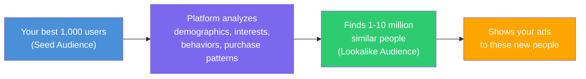

<Tip>
**In a hurry?** Skip to the [Quickstart Guide](/playbook/vibe-coder-quick-start) to launch your first campaign in 30 minutes. You can always come back to learn the theory later.
</Tip>

## What is targeting? (And why it matters so much)

Targeting is the art of telling an ad platform **exactly who** should see your ad. Instead of showing your ad to the entire internet (7+ billion people!), you narrow it down to the people who are most likely to actually care about your product.

Here is a simple way to think about it:

- **No targeting:** Standing in the middle of Times Square screaming "Download my app!" at millions of random people. Some might be interested. Most are not. You are wasting 99% of your energy (and money).
- **Good targeting:** Walking into a yoga studio and saying "Hey, I built a meditation app — want to try it?" Everyone in that room is already interested in wellness. Your "ad" is 10x more effective.

The better your targeting, the less money you waste on people who will never become your users. It is that simple.

<Note>
  **An important heads-up:** Modern ad platforms (especially Meta) have gotten incredibly smart at finding the right users automatically. In many cases, **broad targeting with great creatives** outperforms hyper-specific manual targeting. But you still need to understand targeting to make informed decisions. Think of it like a GPS — even if you let it navigate, you should know how to read a map.
</Note>

---

## All targeting types explained (with real examples)

Let's walk through every type of targeting available to you. For each one, we will explain what it is, how it works, and when to use it — with real examples you can relate to.

### 1. Demographic targeting — who people ARE

The most basic form of targeting. You filter by personal characteristics.

| Parameter | Description | Available on | Example |
|---|---|---|---|
| **Age** | Age ranges | Meta, Google, TikTok | 18-24, 25-34, 35-44 |
| **Gender** | Male, Female, All | Meta, Google, TikTok | All genders for a cooking app |
| **Location** | Country, state, city, zip, radius | All platforms | United States only |
| **Language** | Device or profile language | Meta, Google, TikTok | English speakers |
| **Income** | Household income brackets | Google (US only), Meta (limited) | Top 25% income |
| **Education** | Education level | Meta | College graduates |
| **Job title** | Professional information | Meta, LinkedIn | "Software Engineer" |
| **Parental status** | Has children, age of children | Meta, Google | Parents with toddlers |

<Tip>
  **Pro Tip: Location targeting is by far the most important demographic setting.** If your app only works in the US, showing ads to people in countries where they cannot use it is literally throwing money away. Always double-check your location settings before launching.
</Tip>

#### Location targeting modes

Most platforms offer several ways to target locations:

| Mode | What it means | Best for |
|---|---|---|
| **People living in** | Permanent residents of the area | Most campaigns (this should be your default) |
| **People recently in** | Anyone who was recently there | Local businesses, events |
| **People traveling to** | Visitors, not residents | Tourism apps, travel apps |
| **Radius targeting** | Everyone within X miles of a specific point | Local services |

<Warning>
  **Common beginner mistake:** Leaving location set to "All countries." This will spend your budget on users in countries with very cheap impressions who may never convert, or who cannot even use your app. Always set specific countries or regions.
</Warning>

**Real-world example:** Say you built a fitness app that only has content in English and only processes payments in USD. Your targeting should be: **United States, Canada, United Kingdom, Australia** — English-speaking countries where your app fully works. Not "All countries."

---

### 2. Interest-based targeting — what people LIKE

Interest targeting lets you reach people based on their hobbies, preferences, and passions — as the platform infers from their behavior.

#### How do platforms know what you are interested in?

The platform builds an interest profile for each user based on:
- Pages and accounts they follow
- Content they engage with (likes, comments, shares, saves)
- Apps they have installed
- Websites they visit (via tracking pixels)
- Ads they have clicked on before
- Groups they belong to
- Videos they watch and for how long

#### Interest categories and examples

| Category | Example interests | Good for advertising... |
|---|---|---|
| **Fitness & Wellness** | Yoga, running, gym, meditation | Health apps, workout trackers |
| **Technology** | Smartphones, AI, gaming, startups | Tech apps, productivity tools |
| **Entertainment** | Music, movies, streaming, memes | Entertainment apps, games |
| **Business** | Entrepreneurship, marketing, investing | Finance apps, B2B tools |
| **Food & Drink** | Cooking, restaurants, veganism | Food/recipe apps |
| **Shopping** | Fashion, deals, online shopping | E-commerce apps |
| **Travel** | Adventure, backpacking, luxury travel | Travel apps, booking apps |
| **Education** | Online learning, languages, science | Education apps, language apps |

**Real-world example:** You built a meditation app. You could target people interested in: Yoga, Meditation, Mindfulness, Wellness, Self-improvement, Mental Health. These people are already thinking about what your app offers.

<Note>
  **Interest targeting is a signal, not a guarantee.** Someone categorized as "interested in fitness" might have liked one gym post three months ago. The algorithm uses interests as a starting signal and then refines based on how people actually respond to your ads.
</Note>

---

### 3. Behavioral targeting — what people DO

While interest targeting is about what people claim to like, behavioral targeting is about what people **actually do**. It targets users based on real actions and patterns.

| Behavior | Description | Platform |
|---|---|---|
| **Recent purchasers** | People who bought something online recently | Meta, Google |
| **Frequent travelers** | People who travel often (based on location data) | Meta |
| **Device switchers** | People who recently got a new phone | Meta |
| **Early adopters** | People who install new apps quickly | Meta |
| **Online shoppers** | People who frequently buy online | Meta, Google |
| **Mobile gamers** | People who actively play mobile games | Meta, TikTok |
| **High-value purchasers** | People who spend more than average in apps | Google, Meta |

**Real-world example:** You built a shopping app. Targeting "frequent online shoppers" (a behavior) will likely perform better than targeting people "interested in shopping" (an interest). The first group has proven they actually buy things online. The second group just likes browsing.

<Tip>
  **Pro Tip: Behavioral targeting is often more powerful than interest targeting** because it is based on what people actually do, not what they say they like. A "frequent online shopper" is statistically much more likely to make a purchase in your app than someone merely "interested in shopping."
</Tip>

---

### 4. Keyword / contextual targeting — matching the moment

Instead of targeting people based on who they ARE, contextual targeting places your ad next to **relevant content**. And keyword targeting shows your ad when someone **actively searches** for something.

#### Search keyword targeting (Google and Apple)

This is the most powerful form of targeting for one reason: the user is **actively searching** for something. They are telling you exactly what they want.

<Tabs>
  <Tab title="Google Search Ads">
    Google offers three keyword match types:

    | Match type | Syntax | What it matches | Example keyword: `meditation app` |
    |---|---|---|---|
    | **Broad match** | `meditation app` | Related searches, synonyms, related concepts | Triggers for: "mindfulness tool," "calm app," "stress relief app" |
    | **Phrase match** | `"meditation app"` | Searches containing the phrase or close variants | Triggers for: "best meditation app," "meditation app for beginners" |
    | **Exact match** | `[meditation app]` | The exact term or very close variants | Triggers for: "meditation app," "meditation apps" |

    Average CTR for Google Search ads is around **3-5%** — much higher than display ads (~0.5%) because the user already has intent.

    <Tip>
      **Pro Tip: Start with phrase match and exact match.** Broad match can spend your budget on loosely related searches you did not intend. As you get more data and use smart bidding, you can expand to broad match.
    </Tip>
  </Tab>
  <Tab title="Apple Search Ads">
    Apple offers keyword targeting directly in the App Store:

    | Match type | What it does |
    |---|---|
    | **Search Match** | Apple automatically matches your ad to relevant searches based on your app metadata |
    | **Broad Match** | Your ad appears for the keyword and related terms |
    | **Exact Match** | Your ad appears only for the specific keyword you chose |

    Apple Search Ads also lets you add **negative keywords** — terms you do NOT want your ad to appear for. For example, if you have a paid meditation app, add "free" as a negative keyword to avoid people looking for free alternatives.
  </Tab>
</Tabs>

#### Other contextual targeting methods

| Method | How it works | Platform |
|---|---|---|
| **Topic targeting** | Your ad appears on pages about specific topics | Google Display |
| **Content category** | Your ad appears in specific app or content categories | Ad networks, TikTok |
| **Channel targeting** | Your ad appears on specific YouTube channels or websites | Google (YouTube + Display) |

---

### 5. Custom audiences — people you ALREADY know

Custom audiences let you target people who have already interacted with your brand. This is your **most valuable targeting tool** because these people already know you exist.

<AccordionGroup>
  <Accordion title="Customer list upload">
    Upload a list of email addresses, phone numbers, or device IDs. The platform matches them to user accounts and shows your ads to those specific people.

    **Real-world examples:**
    - Re-engage users who have not opened your app in 30 days: "We miss you! Check out our new features"
    - Upsell premium features to free users: "Upgrade to Pro — 50% off this week"
    - **Exclude** existing users from install campaigns (so you do not waste money targeting people who already have your app)

    **Minimum list size:** Usually 100-1,000 users, depending on the platform. Match rates vary from 30-70% (not every email can be matched to a platform account).
  </Accordion>

  <Accordion title="Website / App activity audiences">
    Create audiences based on what people did on your website or in your app:

    - Visited your website in the last 7 days
    - Added to cart but did not buy
    - Viewed a specific product page
    - Completed the tutorial but did not subscribe
    - Reached level 5 in your game but did not come back
    - Opened the app in the last 3 days but did not make a purchase

    **Requires:** A pixel (for web) or SDK (for app) installed and sending events. This is why [tracking setup](/concepts/tracking-and-attribution) is so important.
  </Accordion>

  <Accordion title="Engagement audiences">
    Target people who have engaged with your content ON the platform:

    - Watched 50%+ of your video ad
    - Engaged with your Instagram profile
    - Opened a lead form but did not submit
    - Interacted with your Facebook page

    **The advantage:** No pixel or SDK needed — the platform tracks this natively. It is the easiest custom audience to create.
  </Accordion>
</AccordionGroup>

<Warning>
  **Privacy regulations matter.** When uploading customer lists, make sure you have proper consent (GDPR, CCPA compliance). The platform will hash the data before matching, but you need legal basis to use the data. If in doubt, consult your company's privacy policy or a legal advisor.
</Warning>

---

### 6. Lookalike / similar audiences — finding your twins

This is one of the most powerful targeting tools in all of digital advertising. Here is the concept: you give the platform a "seed" audience (your best customers), and it uses its massive data to find **new people who share similar characteristics**.

It is like saying "Here are 1,000 of my best users. Go find me a million more people just like them."

#### Lookalike sizes by platform

| Platform | Name | Size options |
|---|---|---|
| **Meta** | Lookalike Audience | 1% to 10% of a country's population (1% = most similar and smallest) |
| **Google** | Optimized Targeting / Similar Segments | Automatic (Google expands automatically) |
| **TikTok** | Lookalike Audience | Narrow, Balanced, or Broad |
| **Apple** | Not directly available | Apple uses keyword relevance instead |

#### Best practices for lookalikes

<Steps>
  <Step title="Use HIGH-QUALITY seed audiences">
    Your seed should be your BEST users, not just any users. Use purchasers, highly engaged users, or users with high lifetime value. The quality of the output depends entirely on the quality of the input. Garbage in = garbage out.
  </Step>
  <Step title="Seed size: the sweet spot is 1,000-10,000 users">
    **Minimum:** 100 users (platform requirement), but results are poor below 500.
    **Sweet spot:** 1,000-10,000 users for the best quality.
    **Too large:** 50,000+ users dilute the pattern — the algorithm cannot find what makes these users special.
  </Step>
  <Step title="Start small with 1% lookalike">
    On Meta, start with a **1% lookalike** (the most similar people). This will be your highest-quality, most expensive audience. Expand to 2-5% as you need more scale.
  </Step>
  <Step title="Refresh your seed audience monthly">
    Your best users evolve over time. Update your seed audience regularly to keep the lookalike fresh and relevant. A lookalike built on data from 6 months ago may not reflect your current user base.
  </Step>
</Steps>

<Tip>
  **Pro Tip: Your lookalike audience is only as good as your seed.** A lookalike based on "all users who installed" will perform okay. A lookalike based on "users who made a purchase in the first 7 days" will perform dramatically better. Always use your highest-value users as the seed.
</Tip>

---

### 7. Retargeting (remarketing) — the second chance

Retargeting shows ads to people who have **already interacted with your brand** but did not convert yet. They visited your site, opened your app, or engaged with your content — but left before completing the action you wanted.

Think of it like a friendly follow-up. Someone walked into your store, looked around, and left. Retargeting is you saying "Hey, you seemed interested! Here's 10% off if you come back."

| Retargeting type | Who you target | Real-world example |
|---|---|---|
| **Website retargeting** | People who visited your site | "You checked out our pricing page — ready to start?" |
| **App retargeting** | People who installed but are not active | "Come back! We just added dark mode" |
| **Cart abandonment** | People who added items but did not buy | "You left something in your cart — finish checkout" |
| **Video viewers** | People who watched your video ad | "Liked our video? Download the app" |
| **Engagement retargeting** | People who engaged with your social content | "You liked our post — here's a special offer" |

<Note>
  **Retargeting typically has the lowest CPA (cost per acquisition) of any targeting method.** Why? Because these users already know your brand. They are "warm" leads. Expect retargeting CPAs to be **30-60% lower** than cold prospecting campaigns. It is some of the best money you will ever spend on ads.
</Note>

#### Retargeting best practices

- **Set frequency caps.** Do not bombard someone with the same ad 20 times. 3-7 impressions per user per week is a reasonable range. Nobody wants to be stalked.
- **Use different creatives.** Do not show them the same ad they already saw. Address their objections, offer an incentive, or highlight a different feature.
- **Set recency windows.** Someone who visited 3 days ago is WAY more valuable than someone who visited 60 days ago. Create separate audiences by recency.
- **Always exclude converters.** If someone already installed your app, stop showing them install ads. This sounds obvious but it is shockingly common to forget.

---

## How each platform handles targeting differently

<Tabs>
  <Tab title="Meta (Facebook / Instagram)">
    **Meta's approach:** The most granular manual targeting options available, but increasingly pushing toward **Advantage+ Audience** (automated targeting where Meta makes the decisions).

    **What makes Meta special:**
    - Thousands of interest and behavior categories
    - Advantage+ Audience: You provide targeting "suggestions," but Meta can go way beyond them
    - Cross-platform targeting: Facebook + Instagram + Messenger + Audience Network — all in one ad set
    - Data on 3B+ users globally

    **Meta's recommendation:** Use broad targeting and let the algorithm find converters. Meta knows more about its users than any interest category can express.

    <Tip>
      **Pro Tip: On Meta, broad targeting + strong creative often outperforms hyper-specific interest targeting.** This sounds counterintuitive, but Meta's algorithm is incredibly good at finding the right users within a broad audience. Test both approaches and compare — you might be surprised.
    </Tip>
  </Tab>
  <Tab title="Google Ads">
    **Google's approach:** Different targeting methods for different campaign types.

    - **Search campaigns:** Keyword-based (you target search queries, not people). Average CTR: ~3-5%.
    - **Display campaigns:** Audience segments, demographics, topics, placements. Average CTR: ~0.5%.
    - **Performance Max:** Minimal manual targeting — Google's AI handles everything. You just provide "signals."
    - **App campaigns:** Very limited targeting — you provide creatives, budget, and geo settings. Google does the rest.

    **What makes Google special:**
    - **In-market audiences** — people actively researching a purchase (incredibly powerful)
    - **Affinity audiences** — long-term interest categories
    - **Custom intent audiences** — based on search keywords and URLs people visit
    - Search intent data from billions of queries
  </Tab>
  <Tab title="TikTok">
    **TikTok's approach:** Interest and behavior targeting combined with strong creative-driven optimization.

    **What makes TikTok special:**
    - Interest categories based on TikTok content engagement
    - Behavior targeting: video interactions, creator interactions, hashtag interactions
    - Smart Targeting: TikTok automatically broadens your audience if it is too narrow
    - Spark Ads: promote organic TikTok posts to targeted audiences

    **TikTok's golden rule:** Creative quality matters MORE than targeting on TikTok. A great TikTok-native ad with broad targeting will destroy a mediocre ad with "perfect" targeting.
  </Tab>
  <Tab title="Apple Search Ads">
    **Apple's approach:** Entirely keyword-based. No interest or behavior targeting.

    **Targeting options:**
    - Keywords (exact and broad match)
    - Search Match (automatic keyword matching)
    - Demographics: Age, Gender (limited)
    - Device: iPhone, iPad
    - Customer type: New users, returning users, users of your other apps

    **What makes Apple special:** The HIGHEST intent targeting available anywhere. Users are literally searching the App Store for apps — they are ready to install right now. This is why Apple Search Ads often has the best conversion rates.
  </Tab>
</Tabs>

---

## Audience size guidelines

Getting the right audience size is critical. Too small and the platform's algorithm cannot learn. Too large and you dilute performance.

| Platform | Minimum recommended | Sweet spot | Too large |
|---|---|---|---|
| **Meta** | 500K people | 2M - 20M people | 100M+ (unless truly broad) |
| **Google Display** | 100K people | 500K - 5M people | 50M+ |
| **Google Search** | N/A (keyword volume matters) | 1K - 100K monthly searches per keyword | N/A |
| **TikTok** | 500K people | 5M - 50M people | 200M+ |
| **Apple Search Ads** | N/A (keyword-based) | Keywords with 100+ monthly searches | N/A |

<Warning>
  **If a platform shows your estimated audience size below 500K:** Your targeting is too narrow. The algorithm will struggle to find enough people, your costs will be high, and results will be inconsistent. Broaden your targeting by removing some interest layers or expanding your age range or geography.
</Warning>

---

## Targeting strategies that work

<AccordionGroup>
  <Accordion title="Strategy 1: Start broad, then narrow">
    Launch with broad targeting (just geo + age + OS). Let the campaign run for 7-14 days. Analyze which demographics, placements, and segments performed best. Then create narrower ad sets targeting those winning segments.

    This is the **"cast a wide net, then refine"** approach, and it is the most reliable method when you have no idea who your audience is yet.

    **Example:** Launch targeting "US, 18-44, all interests." After 2 weeks, you discover that women aged 25-34 on Instagram convert at 3x the rate of other segments. Create a new ad set specifically for that group.
  </Accordion>

  <Accordion title="Strategy 2: Funnel-based targeting">
    Create different campaigns for different stages of the customer journey:

    | Funnel stage | Audience | Ad message | Budget allocation |
    |---|---|---|---|
    | **Top (Awareness)** | Broad or interest-based | "Did you know...?" / Educational content | 20% |
    | **Middle (Consideration)** | Video viewers, website visitors | "Here's how it works..." / Feature-focused | 20% |
    | **Bottom (Conversion)** | Retargeting, engaged users | "Download today" / Direct CTA with incentive | 60% |

    This strategy works best with larger budgets ($50+/day) because you need enough to fund all three stages.
  </Accordion>

  <Accordion title="Strategy 3: Competitor targeting">
    Target users who are interested in or actively using competing apps.

    - **Meta:** Use interest targeting for competitor brand names (if available)
    - **Google Search:** Bid on competitor brand keywords (legal but often expensive)
    - **Apple Search Ads:** Bid on competitor app names as keywords
    - **TikTok:** Target users who engage with competitor-related content

    <Tip>
      **Pro Tip: Apple Search Ads competitor targeting is one of the highest-ROI strategies in app marketing.** When someone searches for a competitor's app by name, your ad can appear as an alternative. These users have high intent AND are already looking for solutions in your category. It is incredibly effective.
    </Tip>
  </Accordion>

  <Accordion title="Strategy 4: Exclusion targeting">
    Sometimes who you EXCLUDE is as important as who you include:

    - **Exclude existing customers** from install campaigns (do not pay to re-acquire people you already have)
    - **Exclude users under 18** if your app is not for minors
    - **Exclude countries** where your app is not available
    - **Exclude recent converters** from retargeting (give them a break!)
    - **Exclude low-performing placements** (e.g., remove Audience Network on Meta if it underperforms)

    This is free money. Every excluded irrelevant user means your budget goes further for relevant ones.
  </Accordion>
</AccordionGroup>

---

## Common targeting mistakes

| Mistake | Why it hurts | What to do instead |
|---|---|---|
| **Targeting too narrow** | Not enough people for the algorithm to learn | Start with 1M+ audience, narrow later with data |
| **Stacking too many interests** | Conflicting signals confuse the algorithm | Pick 2-3 closely related interests or just go broad |
| **Only targeting your own demographic** | Your real users might surprise you | Let data reveal your best audience |
| **Forgetting to exclude existing users** | Paying to acquire users you already have | Always create exclusion audiences |
| **Not setting location targeting** | Spending budget in irrelevant countries | Set specific countries/regions |
| **Ignoring device targeting** | Showing iOS app ads to Android users | Match device targeting to your app's platform |
| **Never refreshing audiences** | Lookalike and custom audiences go stale | Update seed audiences monthly |
| **Over-relying on manual targeting** | Fighting the algorithm instead of working with it | Try broad targeting — the algorithm might surprise you |

---

## The future of targeting (and why it matters now)

Targeting is changing fast because of privacy regulations. Here is what is happening:

| Trend | What it means for you |
|---|---|
| **iOS App Tracking Transparency (ATT)** | Only ~25-35% of iOS users allow tracking. Less audience data available on iOS. |
| **Google Privacy Sandbox** | Android tracking is changing too. Less granular device-level targeting coming. |
| **Third-party cookie deprecation** | Less cross-site tracking for web ads. First-party data becomes critical. |
| **AI-powered targeting** | Platforms are doing more targeting automatically. Your job shifts to providing good creative and data signals. |
| **First-party data importance** | Your own data (from your app, website, CRM) becomes your biggest competitive advantage. |

<Tip>
  **Pro Tip: The direction is crystal clear. Manual, granular targeting is becoming LESS important. Creative quality and first-party data are becoming MORE important.** The platforms are moving toward a world where you provide audience signals and great creative, and the algorithm handles everything else. Start building your first-party data advantage now — collect user data (with consent), set up proper tracking, and invest in creative quality.
</Tip>

---

## Key takeaways

<Steps>
  <Step title="Understand all targeting types">
    Demographic, interest, behavioral, contextual/keyword, custom audiences, lookalikes, and retargeting. Each has its place and purpose.
  </Step>
  <Step title="Start broad, narrow with data">
    Do not over-target on day one. Launch broad, collect data for 7-14 days, then refine based on what the data tells you.
  </Step>
  <Step title="Different platforms, different approaches">
    Meta excels at interest/behavior targeting. Google Search wins on intent (keywords) with ~3-5% CTR. Apple Search Ads has the highest install intent. TikTok is creative-driven. Adapt your approach to each.
  </Step>
  <Step title="Audience size matters">
    Below 500K = algorithm starved. Above 100M = diluted. The sweet spot for Meta is 2M-20M.
  </Step>
  <Step title="Build your first-party data advantage early">
    Custom audiences and lookalikes from your OWN data are your most powerful targeting tools. Start collecting quality data from day one.
  </Step>
</Steps>

---

## Next up

You know who to target. Now let's talk about the money — how much to spend and how the auction system decides which ads get shown.

<Card
  title="Bidding & Budget"
  icon="arrow-right"
  href="/concepts/bidding-and-budget"
>
  How ad auctions work, what bid strategies to use, and how to manage your budget wisely.
</Card>
