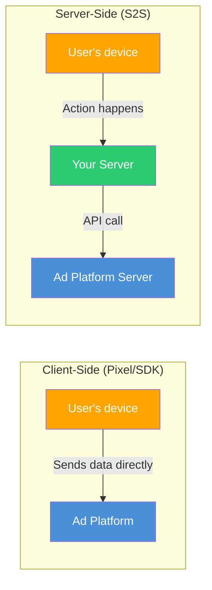

## Why tracking is the foundation of EVERYTHING

Imagine this: you are running three campaigns on three different platforms. You get 500 installs this week. Amazing! But... which platform drove them? Which ad? Which audience? Was it the video on TikTok or the carousel on Instagram?

Without tracking, you have zero idea. You are spending money in the dark, hoping something works. That is not advertising — that is gambling.

**Tracking** is the technology that records what users do after seeing your ad. **Attribution** is the logic that determines which ad gets credit for each conversion. Together, they are the backbone of every advertising decision you will ever make.

<Warning>
  Running ads without proper tracking is the single most expensive mistake in digital advertising. It is like running a business without looking at your bank account. **Set up tracking BEFORE you spend a single dollar on ads.** We cannot stress this enough.
</Warning>

<Tip>
  **Pro Tip: Think of tracking like a security camera system for your advertising.** Without cameras, you have no idea what is happening in your store. With cameras (tracking), you can see exactly who came in, where they came from, what they looked at, and whether they bought anything. You would never run a store without cameras. Do not run ads without tracking.
</Tip>

---

## What tracking actually does

Tracking technology observes and records user actions — from seeing your ad to installing your app to making a purchase inside it. It answers three fundamental questions:

1. **What happened?** (Did the user install, sign up, make a purchase?)
2. **When did it happen?** (Timestamp of each event)
3. **Where did the user come from?** (Which ad, which platform, which campaign?)

### The tracking chain visualized

```mermaid
graph LR
    A["User sees your ad"] --> B["User taps the ad"]
    B --> C["User goes to<br/>App Store / Website"]
    C --> D["User installs your app<br/>(or takes an action)"]
    D --> E["SDK/Pixel fires<br/>a tracking event"]
    E --> F["Data sent to<br/>ad platform + MMP"]
    F --> G["You see the results<br/>in your dashboards"]

    style A fill:#95A5A6,color:#fff
    style B fill:#4A90D9,color:#fff
    style C fill:#7B68EE,color:#fff
    style D fill:#2ECC71,color:#fff
    style E fill:#FFA500,color:#fff
    style F fill:#E74C3C,color:#fff
    style G fill:#4A90D9,color:#fff
```



Each step in this chain is critical. If any link breaks — if an event does not fire, if data does not send correctly — you lose visibility into what is actually working.

---

## The three tracking technologies

### 1. Pixels (for websites)

A **pixel** is a tiny piece of JavaScript code you add to your website. When someone visits your site, the pixel fires and sends data back to the ad platform. Think of it like an invisible doorbell — every time someone enters, it pings the ad platform and says "someone's here!"

| Platform | Pixel name | What it tracks |
|---|---|---|
| **Meta** | Meta Pixel (formerly Facebook Pixel) | Page views, add to cart, purchases, leads, custom events |
| **Google** | Google Tag (gtag.js) / Google Tag Manager | Conversions, remarketing audiences, site interactions |
| **TikTok** | TikTok Pixel | Page views, clicks, conversions, custom events |
| **Twitter/X** | X Pixel | Conversions from X ads |
| **LinkedIn** | LinkedIn Insight Tag | Conversions, demographics, retargeting |

**How pixels work in plain English:**
1. You add the pixel code to your website (usually in the header)
2. A user clicks your ad and lands on your website
3. The pixel fires on page load, recording: "This person from THIS ad just arrived"
4. The user takes an action (e.g., signs up)
5. The pixel fires again: "This person just completed registration!"
6. Data is sent back to the ad platform
7. The platform matches this conversion to the original ad click: "Your Instagram ad just got a sign-up!"

<Note>
  **Pixels are for WEBSITES.** If you are promoting a mobile app, you need an **SDK** instead. Most app advertisers use both — a pixel for their website/landing page and an SDK for their app.
</Note>

---

### 2. SDKs (for apps)

An **SDK** (Software Development Kit) is code that gets integrated directly into your mobile app. It tracks everything that happens inside the app — installs, opens, in-app events, purchases, and more.

Think of a pixel as a doorbell for your website. An SDK is a full surveillance system INSIDE your app — it sees everything.

| Provider | SDK name | Type |
|---|---|---|
| **Meta** | Facebook SDK | Platform SDK |
| **Google** | Firebase SDK / GA4 | Platform SDK |
| **TikTok** | TikTok SDK | Platform SDK |
| **Apple** | AdServices framework | Platform SDK |
| **Airbridge** | Airbridge SDK | MMP SDK (unified web + app) |
| **AppsFlyer** | AppsFlyer SDK | MMP SDK |
| **Adjust** | Adjust SDK | MMP SDK |
| **Branch** | Branch SDK | MMP + Deep Link SDK |
| **Singular** | Singular SDK | MMP SDK |
| **Kochava** | Kochava SDK | MMP SDK |

**How SDKs work in plain English:**
1. Your developer integrates the SDK into your app's code
2. A user installs and opens your app for the first time
3. The SDK fires: "New install detected!"
4. The SDK checks: "Where did this user come from?" (attribution)
5. User takes actions inside the app (purchase, level complete, etc.)
6. SDK fires for each event: "This user just bought the premium plan for $9.99!"
7. Data flows to your ad platforms and/or MMP dashboards

<Warning>
  **Critical iOS requirement:** Since iOS 14.5, Apple requires you to show the **App Tracking Transparency (ATT)** prompt before tracking users. If a user taps "Ask App Not to Track," the SDK has severely limited tracking ability. About 65-75% of iOS users opt OUT. This has major implications, which we cover in the privacy section below.
</Warning>

---

### 3. Server-side tracking (S2S) — the advanced layer

**Server-side tracking** sends conversion data from YOUR server directly to the ad platform's server, completely bypassing the user's browser or device.



**Why does this matter?** Because client-side tracking (pixels and SDKs) is increasingly unreliable:
- Ad blockers block pixel requests (10-30% of users have them)
- Privacy settings prevent cookies from being set
- iOS ATT reduces SDK tracking capability
- Browser restrictions limit data collection

Server-side tracking fills these gaps because it happens server-to-server — no browser or device restrictions can block it.

| Platform | Server-side solution |
|---|---|
| **Meta** | Conversions API (CAPI) |
| **Google** | Enhanced Conversions / Google Ads API |
| **TikTok** | Events API |
| **Snap** | Conversions API |

<Tip>
  **Pro Tip: Best practice is to use BOTH client-side AND server-side tracking together.** This is called "redundant tracking" or "dual tracking." The pixel/SDK provides real-time data. The server-side API fills in gaps from ad blockers and privacy restrictions. Meta specifically recommends this dual approach and reports significantly better optimization when both are set up.
</Tip>

---

## Conversion events: what to track

A **conversion event** is any user action you want to track and optimize toward. These are the building blocks of your entire measurement setup.

### Standard events (use these first)

Pre-defined events that platforms recognize natively. Using standard events is critical because the platform UNDERSTANDS what they mean and can optimize better.

| Event | What it tracks | Why it matters |
|---|---|---|
| **Install** | App downloaded and opened | The baseline event for every app campaign |
| **Registration** | User created an account | Indicates a real, engaged user |
| **Purchase** | Transaction completed | The ultimate conversion for most apps |
| **Subscribe** | Subscription started | Key for subscription apps |
| **StartTrial** | Free trial started | Indicates monetization potential |
| **AddToCart** | Item added to cart | E-commerce mid-funnel signal |
| **ViewContent** | Specific content viewed | Engagement signal |
| **Lead** | Lead form submitted | Key for lead gen campaigns |

### Custom events (for your specific app)

Events you define for actions unique to your app:

| Custom event | What it tracks | Why track it |
|---|---|---|
| `complete_onboarding` | User finished the tutorial | Measures activation quality |
| `create_first_project` | User created their first piece of content | Indicates real engagement |
| `invite_friend` | User shared the app | Measures virality |
| `streak_7_days` | User active 7 days in a row | Measures retention quality |
| `upgrade_to_pro` | Free user converted to paid | Revenue event |

<Tip>
  **Pro Tip: Always send VALUE with your purchase events.** Instead of just "purchase happened," send "purchase happened for $9.99 USD." This lets platforms optimize for high-value users, not just any users. The difference between optimizing for "purchases" vs. "purchase value" can be enormous.
</Tip>

### Priority order for event setup

<Steps>
  <Step title="Must have: Install event">
    Every app campaign needs this. Usually tracked automatically once the SDK is integrated.
  </Step>
  <Step title="Must have: Registration / Activation event">
    The first meaningful action — creating an account, completing onboarding. This is your primary signal that a user is real and engaged (not a bot or accidental install).
  </Step>
  <Step title="Must have: Your app's core action">
    The ONE thing that defines an engaged user in YOUR app. For a fitness app: completed a workout. For a notes app: created a note. For a social app: sent a message.
  </Step>
  <Step title="High priority: Purchase / Subscribe event">
    If your app has any monetization, track every transaction with its value. Critical for ROAS-based bidding and understanding your unit economics.
  </Step>
  <Step title="Nice to have: Engagement events">
    Additional signals like day-7 retention, feature usage, shares. These help you understand user quality and build better audiences.
  </Step>
</Steps>

---

## What is attribution? (Who gets credit?)

**Attribution** is the process of determining which ad deserves credit for a conversion.

Here is the problem: A user might see your Instagram ad on Monday, Google your app on Wednesday, and install it on Friday after seeing a TikTok ad. Which ad "caused" the install? They all played a role. But how do you assign credit?

This is the **attribution problem**, and it is one of the most debated topics in the entire advertising industry.

---

## Attribution models explained

### Single-touch models (one winner takes all)

<AccordionGroup>
  <Accordion title="Last-click attribution (the industry standard)">
    **100% of credit goes to the LAST ad the user clicked before converting.**

    ```
    User journey:
    1. Sees Meta ad (impression only, no click)
    2. Clicks Google ad --> visits website --> leaves
    3. Clicks TikTok ad --> installs app   <-- Gets 100% credit

    Result: TikTok gets ALL the credit.
    ```

    **Pros:** Simple, easy to understand, actionable, industry standard for app attribution.
    **Cons:** Completely ignores all earlier touchpoints. Penalizes awareness channels like YouTube and display that start the journey but do not close it.

    **Used by:** Most MMPs (default), Apple Search Ads, Google Ads (for search).
  </Accordion>

  <Accordion title="View-through attribution (for impressions)">
    Credit goes to the **last ad the user SAW** (but did not click) before converting.

    ```
    User journey:
    1. Sees Meta ad (no click)
    2. Sees TikTok ad (no click)
    3. Goes directly to App Store --> installs app

    With view-through: TikTok gets credit (last view)
    Without view-through: Nobody gets credit (counted as organic)
    ```

    **Meta's default:** 7-day click, **1-day view**. This means Meta will take credit for a conversion if the user clicked your ad within 7 days OR saw your ad within 1 day of converting.

    **Why it matters:** Many users see an ad, do not click, but go install the app directly later. View-through attribution captures this behavior. Without it, you undercount your ad performance.
  </Accordion>

  <Accordion title="First-click attribution (for discovery)">
    **100% of credit goes to the FIRST ad the user interacted with.**

    ```
    User journey:
    1. Clicks Meta ad --> visits website --> leaves   <-- Gets 100% credit
    2. Clicks Google ad --> visits again --> leaves
    3. Clicks TikTok ad --> installs app

    Result: Meta gets ALL the credit.
    ```

    **Pros:** Values the channel that first introduced your brand to the user.
    **Cons:** Ignores everything that happened after discovery.
    **Used by:** Rarely as default, but available in analytics tools.
  </Accordion>
</AccordionGroup>

### Multi-touch models (sharing credit)

<AccordionGroup>
  <Accordion title="Linear attribution">
    Credit split **equally** among ALL touchpoints.

    ```
    3 touchpoints:
    1. Click Meta ad   --> 33% credit
    2. Click Google ad --> 33% credit
    3. Click TikTok ad --> installs --> 33% credit
    ```

    Fair to all channels, but treats every touchpoint as equally important (rarely true in practice).
  </Accordion>

  <Accordion title="Time-decay attribution">
    More credit to touchpoints **closer in time** to the conversion.

    ```
    1. Click Meta ad (10 days ago)  --> 15% credit
    2. Click Google ad (3 days ago) --> 30% credit
    3. Click TikTok ad (today)      --> installs --> 55% credit
    ```

    Balances all touchpoints while respecting recency. Good middle-ground model.
  </Accordion>

  <Accordion title="Position-based (U-shaped) attribution">
    **40%** to first touch, **40%** to last touch, **20%** split among the middle.

    ```
    1. Click Meta ad    --> 40% credit (first touch)
    2. Click Google ad  --> 10% credit (middle)
    3. Click YouTube ad --> 10% credit (middle)
    4. Click TikTok ad  --> installs --> 40% credit (last touch)
    ```

    Values both discovery AND conversion. Popular with sophisticated advertisers.
  </Accordion>

  <Accordion title="Data-driven attribution (DDA)">
    Uses **machine learning** to analyze all conversion paths and assign credit based on which touchpoints ACTUALLY contributed most. No assumptions — just data.

    **Available on:** Google Ads (default for eligible accounts), some analytics platforms.

    **Pros:** Most accurate — based on your real data.
    **Cons:** Requires thousands of conversions. Black-box methodology (you cannot see exactly how it works).
  </Accordion>
</AccordionGroup>

<Tip>
  **Pro Tip: For app marketing, last-click attribution is the industry standard and where you should start.** It is simple, actionable, and what every MMP uses by default. Multi-touch models are more nuanced but harder to act on. You can explore them as you scale, but last-click will serve you well for a long time.
</Tip>

---

## Attribution windows (lookback windows)

An **attribution window** is the maximum time between a user seeing/clicking an ad and converting, for the ad to still get credit.

### Default windows by platform

| Platform | Click-through window | View-through window | Default setting |
|---|---|---|---|
| **Meta** | 7 days | 1 day | **7-day click, 1-day view** |
| **Google** | 30 days | N/A (varies) | 30-day click |
| **TikTok** | 7 or 28 days | 1 day | 7-day click, 1-day view |
| **Apple Search Ads** | 30 days | N/A | 30-day click |
| **MMP default** | 7 days | 1 day | 7-day click, 1-day view |

### How windows affect your data

```
Scenario: User clicks your ad on Monday, installs on Saturday (5 days later)

7-day click window:  ATTRIBUTED to your ad (within window)
3-day click window:  Counted as ORGANIC (outside window)
1-day click window:  Counted as ORGANIC (way outside window)
```

<Warning>
  **Shorter windows = fewer attributed conversions.** If you switch from a 28-day to a 7-day window, your reported numbers will DROP. Not because performance changed, but because you are measuring differently. Always keep this in mind when comparing data across time periods or platforms with different window settings.
</Warning>

<Tip>
  **Pro Tip: Meta's default of 7-day click / 1-day view is a good starting point for most app campaigns.** It balances capturing enough conversions with maintaining signal quality. If you are running awareness campaigns where the path to install is longer, consider a 28-day click window. For direct-response campaigns, 7 days is usually fine.
</Tip>

---

## The privacy revolution (this changed everything)

Privacy changes have fundamentally reshaped tracking and attribution. If you want to advertise effectively in 2025 and beyond, you MUST understand these changes.

### iOS App Tracking Transparency (ATT)

Since iOS 14.5 (April 2021), Apple requires every app to ask users for explicit permission to track them across other apps and websites. It looks like this:

<Note>
**iOS ATT Prompt:**

"[App Name]" Would Like Permission to Track Your Activity Across Other Companies' Apps and Websites

- Button 1: **Ask App Not to Track**
- Button 2: **Allow**
</Note>

**The reality:** Only about **25-35% of iOS users opt IN to tracking.** That means 65-75% of your iOS users are partially invisible to ad platforms.

**Impact on advertising:**
- Ad platforms have far less data about iOS users
- Attribution became less precise on iOS
- Meta reported a **$10B+ annual revenue impact** from ATT
- Platforms shifted toward modeled (estimated) conversions
- SKAdNetwork became the mandatory framework for iOS attribution

### SKAdNetwork (SKAN) — Apple's privacy-safe attribution

Apple created SKAdNetwork as a privacy-preserving way to attribute app installs on iOS. It provides limited, aggregated data without exposing individual user behavior.

<Tabs>
  <Tab title="How SKAN works (simplified)">
    ```mermaid
    graph TD
        A["User sees/clicks ad"] --> B["User installs app"]
        B --> C["App reports a conversion value<br/>(0-63 in SKAN 3)"]
        C --> D["Apple's timer starts<br/>(24-hour minimum wait)"]
        D --> E["Timer expires"]
        E --> F["Apple sends anonymous<br/>postback to ad network"]

        style A fill:#95A5A6,color:#fff
        style C fill:#FFA500,color:#fff
        style D fill:#FF6B6B,color:#fff
        style F fill:#2ECC71,color:#fff
    ```

    **Key limitations you need to know:**
    - **Delayed data:** Postbacks arrive 24-48+ hours after conversion (not real-time)
    - **Limited values:** Only 64 possible conversion values in SKAN 3 (0-63)
    - **No user-level data:** Everything is aggregated and anonymous
    - **One attribution per install:** No multi-touch attribution
    - **Limited campaign IDs:** SKAN 3 limits to 100 campaign IDs
  </Tab>
  <Tab title="SKAN 4.0 improvements">
    SKAN 4.0 (iOS 16.1+) made things better:

    | Feature | SKAN 3 | SKAN 4.0 |
    |---|---|---|
    | **Postbacks** | 1 postback | Up to 3 postbacks (different time windows) |
    | **Conversion values** | Fine only (0-63) | Coarse (low/medium/high) + Fine (0-63) |
    | **Source identifier** | 2-digit campaign ID | 2-4 digit hierarchical source ID |
    | **Crowd anonymity** | Binary | 4 tiers (more installs = more data revealed) |
    | **Web-to-app** | Not supported | Supported |
  </Tab>
  <Tab title="SKAN 5.0 (latest)">
    SKAN 5.0 adds re-engagement attribution — you can now measure users who RETURN to your app, not just new installs. This is a significant improvement for retention campaigns.

    <Note>
      SKAN is constantly evolving and the ecosystem is still adapting. Your MMP handles most of the SKAN complexity for you. The key thing to understand is: iOS attribution is less precise than it used to be, and you need to factor this into your measurement strategy.
    </Note>
  </Tab>
</Tabs>

### Google Privacy Sandbox (Android)

Google is making similar privacy changes for Android, but moving more gradually:

| Component | What it does | Status (2025) |
|---|---|---|
| **Topics API** | Replaces interest tracking with broad topic categories | Rolling out |
| **Attribution Reporting API** | Privacy-preserving conversion measurement | In development |
| **Protected Audiences** | On-device ad targeting without cross-app tracking | In development |
| **SDK Runtime** | Isolates third-party SDKs for better privacy | In development |

<Note>
  **Google is moving slower than Apple.** Android's Privacy Sandbox is being introduced gradually with industry feedback. The Google Advertising ID (GAID) will eventually be deprecated, but the transition is more gradual. Expect full impact over 2025-2027.
</Note>

<Tip>
  **Pro Tip: Do not panic about privacy changes. Adapt.** The platforms have adapted their algorithms to work with less data. Focus on: (1) setting up server-side tracking for maximum data coverage, (2) using SKAN properly on iOS via your MMP, (3) building first-party data (your most valuable asset), and (4) trusting platform-modeled conversions (they are better than you think).
</Tip>

---

## Postbacks: the data highway

A **postback** is a server-to-server notification sent when a conversion event occurs. It is how tracking data flows between different systems in the ecosystem.

| Type | From | To | Purpose |
|---|---|---|---|
| **MMP to ad platform** | Your MMP | Meta/Google/TikTok | "This user from your ad just converted!" (so the platform can optimize) |
| **Ad platform to MMP** | Platform | Your MMP | "Here are the impressions/clicks for attribution matching" |
| **SKAN postback** | Apple | Ad network | Apple's privacy-safe attribution notification |
| **S2S postback** | Your server | Ad platform | Sending offline or server-side conversion data |

**Why postbacks matter:** Without them, the ad platform does not know which ads drive conversions. The platform NEEDS this feedback loop to:
- Optimize delivery (show ads to users similar to those who converted)
- Report accurate CPA and ROAS
- Make automated bidding strategies work (they rely entirely on conversion signals)

<Warning>
  **Incorrect postback setup is one of the most common technical issues in app advertising.** If your MMP is not properly sending postbacks to your ad platforms, those platforms are flying blind and cannot optimize. Always verify postback configuration when setting up a new platform.
</Warning>

---

## MMPs — your neutral referee

An **MMP** (Mobile Measurement Partner) is a third-party company that provides unbiased, cross-platform attribution. Why "unbiased"? Because unlike ad platforms, MMPs do not have a financial incentive to over-claim conversions.

### Why you need an MMP (the double-counting problem)

Without an MMP, here is what happens:

```
Platform self-reported data:
  Meta claims:   300 installs
  Google claims:  250 installs
  TikTok claims: 200 installs
  Total claimed: 750 installs

Actual installs (from your app analytics): 500

What happened? All three platforms saw the same users and each took credit.

MMP data (deduplicated, single source of truth):
  Meta attributed:   220 installs
  Google attributed:  150 installs
  TikTok attributed:  80 installs
  Organic:            50 installs
  Total:             500 installs (correct!)
```

### MMP comparison

| MMP | Key strength | Best for | Pricing |
|---|---|---|---|
| **Airbridge** | Unified web + app measurement, strong SKAN support, privacy-first design, real-time dashboards, incrementality testing | Startups, indie devs, growth-stage apps | Generous free tier, then competitive pricing |
| **AppsFlyer** | Most widely used, excellent integrations, Protect360 fraud protection | Mid-to-large apps | Free up to 10K conversions/month |
| **Adjust** | Strong fraud prevention, owned by AppLovin | Gaming, fraud-sensitive apps | Custom pricing |
| **Branch** | Best deep linking + attribution combo | Apps needing deep links | Free tier available |
| **Singular** | Attribution + cost aggregation (pulls spend from all platforms) | Apps on many networks | Custom pricing |
| **Kochava** | Real-time analytics, flexible attribution | Enterprise, complex setups | Free tier available |

### When to get an MMP

| Situation | Do you need an MMP? |
|---|---|
| First campaign on a single platform | Not yet — use platform tracking |
| Spending on 2+ platforms | **Yes** — you need deduplicated attribution |
| Spending $1K+/month on ads | **Yes** — the ROI from better data pays for itself |
| Running iOS campaigns | Highly recommended — MMP handles SKAN complexity |
| Just experimenting with tiny budget | Not yet — add one when you are ready to scale |

<Tip>
  **Pro Tip: Do not let MMP setup slow down your first campaign launch.** Start with platform-native tracking (Meta Pixel, Facebook SDK, etc.) and launch. Plan to integrate an MMP once you are spending on 2+ platforms or exceeding $1K/month. Airbridge is a great starting point — its free tier is generous, the SDK is developer-friendly, and it provides unified web and app measurement out of the box. AppsFlyer and Branch also have free tiers worth considering.
</Tip>

---

## Platform tracking setup guides

<Tabs>
  <Tab title="Meta">
    **For websites:** Meta Pixel + Conversions API (CAPI)
    **For apps:** Facebook SDK + App Events

    **Setup steps:**
    1. Create a Meta Pixel in Events Manager
    2. Install pixel code on your website (or via Google Tag Manager)
    3. Set up Conversions API for server-side tracking
    4. Integrate Facebook SDK into your app
    5. Configure App Events (install, registration, purchase, etc.)
    6. Verify your domain
    7. Configure Aggregated Event Measurement (for iOS)

    **Important features:**
    - Advanced Matching (hashed user data for better matching)
    - Aggregated Event Measurement for iOS privacy compliance
    - Dynamic event parameters (send revenue values, product IDs)
  </Tab>
  <Tab title="Google Ads">
    **For websites:** Google Tag (gtag.js) or Google Tag Manager
    **For apps:** Firebase SDK + Google Analytics for Firebase

    **Setup steps:**
    1. Set up conversion actions in Google Ads
    2. Install Google Tag on your website
    3. Link Google Ads to Firebase for app tracking
    4. Configure conversion events in Firebase
    5. Enable Enhanced Conversions
    6. Set up Google Consent Mode (for GDPR)

    **Important features:**
    - Enhanced Conversions (first-party data for better attribution)
    - Consent Mode (adjusts tracking based on user consent)
    - GA4 integration (unified web + app analytics)
  </Tab>
  <Tab title="TikTok">
    **For websites:** TikTok Pixel + Events API
    **For apps:** TikTok SDK

    **Setup steps:**
    1. Create TikTok Pixel in Events Manager
    2. Install pixel on your website
    3. Set up Events API for server-side tracking
    4. Integrate TikTok SDK into your app
    5. Configure in-app events
    6. Set up Advanced Matching

    **Important features:**
    - Events API (server-side, like Meta's CAPI)
    - Advanced Matching (hashed email/phone for better attribution)
  </Tab>
  <Tab title="Apple Search Ads">
    **For apps:** AdServices framework + Apple Ads Attribution API

    **Setup steps:**
    1. Integrate AdServices framework (iOS 14.3+)
    2. Call attribution API on first app open
    3. Optionally connect to your MMP for unified reporting

    **Key advantage:** Apple's attribution is deterministic and first-party — NOT affected by ATT. Apple Search Ads can attribute installs even when users opt out of tracking. This is a major advantage.
  </Tab>
</Tabs>

---

## Deferred deep links (bonus topic)

A **deferred deep link** takes a user to a specific place in your app — even if they did not have the app installed when they clicked the link.

```
Normal link:
  Click ad --> App Store --> Install --> Opens to home screen (generic)

Deferred deep link:
  Click ad for "running shoes" --> App Store --> Install --> Opens to running shoes page!
```

**Why this matters:** Users who land on relevant, specific content convert at **2-5x higher rates** than users who land on a generic home screen.

**Providers:** Airbridge, Branch, AppsFlyer (OneLink), Adjust

---

## Essential tracking setup checklist

<Steps>
  <Step title="1. Define your conversion events">
    List every user action you want to track: install, registration, core action, purchase. Map each to standard event names.
  </Step>
  <Step title="2. Install platform SDKs / Pixels">
    Add tracking code for each platform you will advertise on. Web = pixels. Apps = SDKs.
  </Step>
  <Step title="3. Set up server-side tracking">
    Implement Meta CAPI, Google Enhanced Conversions, or TikTok Events API for redundant coverage.
  </Step>
  <Step title="4. Configure attribution settings">
    Choose your windows. **Meta default of 7-day click / 1-day view** is standard and recommended.
  </Step>
  <Step title="5. Verify events are firing correctly">
    Use Meta Events Manager Test Events, Google Tag Assistant, TikTok Pixel Helper, or your MMP's debug mode. **Never skip this step.**
  </Step>
  <Step title="6. Set up an MMP (when ready)">
    Integrate when advertising on 2+ platforms or spending $1K+/month. Start with free tiers.
  </Step>
  <Step title="7. Test the FULL user journey">
    Click your own ad from a test device, go through the full flow (install, register, etc.), and verify every event appears in all dashboards.
  </Step>
</Steps>

---

## Common tracking mistakes

| Mistake | Impact | How to fix |
|---|---|---|
| Not setting up tracking before launching ads | No data, wasted budget, zero optimization | Always set up and verify tracking FIRST |
| Wrong attribution window | Over or under-counting conversions | Use 7-day click / 1-day view as default |
| Duplicate events firing | Inflated conversion counts, incorrect CPA | Deduplicate events, use an MMP |
| Missing server-side tracking | 10-30% data loss from ad blockers | Implement CAPI / Enhanced Conversions |
| Not testing events before launch | Events fire incorrectly or not at all | Always use debug/test tools before going live |
| Ignoring iOS ATT impact | Underreporting, poor optimization on iOS | Implement SKAN properly, use modeled conversions |
| Trusting platform self-reported data blindly | Over-counting conversions | Use an MMP for cross-platform truth |
| Not sending revenue values with purchase events | Cannot optimize for ROAS or high-value users | Always include purchase value and currency |

---

## Key takeaways

<Steps>
  <Step title="Tracking is NOT optional">
    Set up tracking before you spend a single dollar. It is the foundation of every advertising decision you will ever make. No tracking = no optimization = wasted money.
  </Step>
  <Step title="Use pixels for web, SDKs for apps, server-side for both">
    Dual tracking (client + server-side) gives you maximum data coverage. Meta recommends this approach explicitly.
  </Step>
  <Step title="Understand attribution: last-click is your starting point">
    Last-click attribution is the industry standard for app marketing. Meta's default window of 7-day click / 1-day view is a solid default. Start here and evolve as you scale.
  </Step>
  <Step title="Privacy changes are real but manageable">
    iOS ATT changed the game, but platforms have adapted. Use SKAN, server-side tracking, modeled conversions, and first-party data to maintain measurement accuracy.
  </Step>
  <Step title="Get an MMP when you scale to 2+ platforms">
    An MMP provides the single source of truth you need when multiple platforms are all claiming credit. Start with free tiers — Airbridge is particularly well-suited for indie developers and startups with its modern SDK, unified web+app measurement, and strong privacy-first approach for the iOS ATT era.
  </Step>
  <Step title="Verify EVERYTHING before going live">
    Use debug tools to confirm every event fires correctly. Test the full user journey end-to-end. A broken tracking event gives you false confidence and leads to terrible decisions.
  </Step>
</Steps>

---

## You made it!

Congratulations! You now understand all the core concepts of digital advertising — the ecosystem, campaign structure, targeting, bidding, creatives, and tracking. You have the knowledge foundation to make smart decisions. Now it is time to put it all into practice.

<Card
  title="Before You Start"
  icon="arrow-right"
  href="/first-campaign/before-you-start"
>
  A quick checklist to review before you launch your very first campaign. Let's go!
</Card>
