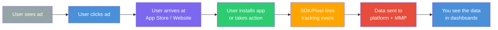
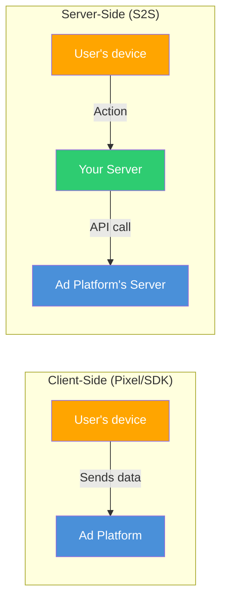
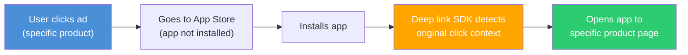

## Why tracking is the foundation of everything

Imagine running three campaigns on three different platforms. You get 500 installs this week. But which platform drove them? Which ad? Which audience? Was it the video ad on TikTok or the carousel on Instagram?

Without tracking, you cannot answer any of these questions. You are spending money blindly.

**Tracking** is the system that records what users do after seeing your ad. **Attribution** is the logic that determines which ad gets credit for each conversion. Together, they form the backbone of all advertising decisions.

<Warning>
  Running ads without proper tracking is the single most expensive mistake in digital advertising. You might as well take your budget and throw it out the window. **Set up tracking before you spend a single dollar on ads.**
</Warning>

---

## What is tracking?

Tracking is the technology that observes and records user actions — from seeing your ad to installing your app to making a purchase inside it. It answers three fundamental questions:

1. **What happened?** (Install, purchase, sign-up, etc.)
2. **When did it happen?** (Timestamp of each event)
3. **Where did the user come from?** (Which ad, platform, campaign)

### The tracking chain



---

## Tracking technologies

### 1. Pixels (Web tracking)

A **pixel** is a tiny piece of JavaScript code you place on your website. When a user visits your site, the pixel fires and sends data back to the ad platform.

| Platform | Pixel name | What it tracks |
|----------|-----------|---------------|
| **Meta** | Meta Pixel (formerly Facebook Pixel) | Page views, add to cart, purchases, leads, custom events |
| **Google** | Google Tag (gtag.js) / Google Tag Manager | Conversions, remarketing audiences, site interactions |
| **TikTok** | TikTok Pixel | Page views, clicks, conversions, custom events |
| **Twitter/X** | X Pixel | Conversions from X ads |
| **LinkedIn** | LinkedIn Insight Tag | Conversions, demographics, retargeting |

**How pixels work:**

```
1. You add the pixel code to your website's header
2. User clicks your ad → lands on your website
3. The pixel fires on page load, recording the visit
4. User takes an action (e.g., signs up)
5. The pixel fires again with the event data
6. Data is sent back to the ad platform
7. The platform matches this conversion to the ad click
```

<Note>
  **Pixels are for websites.** If you are promoting a mobile app, you need an **SDK** instead (or in addition). Most app advertisers use both — a pixel for their website/landing page and an SDK for their app.
</Note>

---

### 2. SDKs (App tracking)

An **SDK** (Software Development Kit) is code integrated directly into your mobile app. It tracks everything that happens inside the app — installs, opens, in-app events, purchases, and more.

| Provider | SDK name | Type |
|----------|---------|------|
| **Meta** | Facebook SDK | Platform SDK |
| **Google** | Firebase SDK / Google Analytics for Firebase | Platform SDK |
| **TikTok** | TikTok SDK | Platform SDK |
| **Apple** | Apple Search Ads Attribution SDK (AdServices) | Platform SDK |
| **AppsFlyer** | AppsFlyer SDK | MMP SDK |
| **Adjust** | Adjust SDK | MMP SDK |
| **Branch** | Branch SDK | MMP + Deep Link SDK |
| **Airbridge** | Airbridge SDK | MMP SDK |
| **Singular** | Singular SDK | MMP SDK |
| **Kochava** | Kochava SDK | MMP SDK |

**How SDKs work:**

```
1. Developer integrates SDK into the app code
2. User installs and opens the app
3. SDK initializes and records the install
4. SDK checks: "Where did this user come from?" (attribution)
5. User takes in-app actions (purchase, level complete, etc.)
6. SDK sends event data to the platform and/or MMP
7. Data appears in your advertising dashboards
```

<Warning>
  **You must get user consent on iOS.** Since iOS 14.5, Apple requires you to show the App Tracking Transparency (ATT) prompt before tracking users. If a user opts out, the SDK has limited tracking capability. More on this in the privacy section below.
</Warning>

---

### 3. Server-side tracking (S2S)

**Server-side tracking** sends conversion data from your server directly to the ad platform's server, bypassing the user's browser or device entirely.



**Why server-side tracking matters:**

| Benefit | Explanation |
|---------|------------|
| **Privacy compliance** | Data is processed on your server first, giving you control over what is shared |
| **Ad blocker resistant** | Ad blockers cannot block server-to-server API calls |
| **Data reliability** | Less affected by browser restrictions (cookie deprecation, ITP) |
| **Data enrichment** | You can enrich conversion data with CRM or backend data before sending |
| **Offline conversions** | Track actions that happen offline or in other systems |

**Platform implementations:**

| Platform | Server-side solution | How it works |
|----------|---------------------|-------------|
| **Meta** | Conversions API (CAPI) | Your server sends events to Meta's API |
| **Google** | Google Ads API / Enhanced Conversions | Server sends conversion data via API |
| **TikTok** | Events API | Server-to-server event posting |
| **Snap** | Conversions API | Server-side event tracking |

<Tip>
  **Best practice: Use both client-side AND server-side tracking.** This is called **"redundant tracking"** or **"dual tracking."** The pixel/SDK provides real-time data, while the server-side API fills in gaps from ad blockers, privacy restrictions, and lost signals. Meta specifically recommends this approach for maximum data coverage.
</Tip>

---

## Conversion events

A **conversion event** is any user action you want to track and optimize toward. These are the building blocks of your tracking setup.

### Standard events vs. custom events

<Tabs>
  <Tab title="Standard Events">
    Pre-defined events that platforms recognize natively. Using standard events enables better optimization because the platform understands what each event means.

    | Event | What it tracks | Platform support |
    |-------|---------------|-----------------|
    | **Install** | App downloaded and opened | All platforms |
    | **Registration / CompleteRegistration** | User created an account | Meta, Google, TikTok |
    | **AddToCart** | Item added to shopping cart | Meta, Google, TikTok |
    | **InitiateCheckout** | Checkout process started | Meta, Google, TikTok |
    | **Purchase** | Transaction completed | All platforms |
    | **Subscribe** | Subscription started | Meta, Google |
    | **StartTrial** | Free trial started | Meta, Google |
    | **ViewContent** | Specific content viewed | Meta, TikTok |
    | **Search** | Used the search feature | Meta, Google |
    | **AddPaymentInfo** | Payment method added | Meta, Google, TikTok |
    | **Lead** | Lead form submitted | Meta, Google, TikTok |
    | **AchieveLevel** | Game level completed | Meta |
    | **SpendCredits** | In-app currency spent | Meta |
  </Tab>
  <Tab title="Custom Events">
    Events you define yourself for actions unique to your app. You choose the event name and what data to include.

    **Examples:**
    | Custom event name | What it tracks | Why track it |
    |------------------|---------------|-------------|
    | `complete_onboarding` | User finished the app tutorial | Measures activation quality |
    | `create_first_project` | User created their first content | Indicates engagement |
    | `invite_friend` | User shared the app | Measures virality |
    | `streak_7_days` | User active 7 days in a row | Measures retention |
    | `upgrade_to_pro` | Free user converted to paid | Revenue event |
    | `watch_3_videos` | User engaged deeply with content | Content engagement metric |

    <Note>
      **Send custom events with parameters.** For example, a `purchase` event should include the value (`$9.99`), currency (`USD`), and product name. Parameters allow platforms to optimize for value, not just event count.
    </Note>
  </Tab>
</Tabs>

### Which events to track (priority order)

<Steps>
  <Step title="Must have — Install event">
    Every app campaign needs this. It is tracked automatically by most SDKs once integrated.
  </Step>
  <Step title="Must have — Registration / Activation event">
    The first meaningful action a user takes (creating account, completing onboarding). This is your primary signal that a user is real and engaged.
  </Step>
  <Step title="Must have — Key in-app action">
    The core action that defines an engaged user in YOUR app. For a fitness app: completed a workout. For a notes app: created a note. For a social app: sent a message.
  </Step>
  <Step title="High priority — Purchase / Subscribe event">
    If your app has any monetization, track every transaction with its value. This is critical for ROAS-based bidding.
  </Step>
  <Step title="Nice to have — Engagement events">
    Additional events that help you understand user quality: day 7 retention, feature usage, shares, etc.
  </Step>
</Steps>

---

## What is attribution?

**Attribution** is the process of determining which ad (or marketing touchpoint) deserves credit for a conversion.

A user might see your Instagram ad on Monday, search for your app on Google on Wednesday, and install it on Friday after seeing your TikTok ad. Which ad caused the install?

This is the **attribution problem**, and it is one of the most debated topics in advertising.

---

## Attribution models

An attribution model is the rule that determines how credit for a conversion is assigned to touchpoints.

### Single-touch models

<AccordionGroup>
  <Accordion title="Last-click attribution">
    **The most common model.** 100% of credit goes to the **last ad the user clicked** before converting.

    ```
    User journey:
    1. Sees Meta ad (impression only)
    2. Clicks Google ad → visits website → leaves
    3. Clicks TikTok ad → installs app ← Gets 100% credit

    Result: TikTok gets all the credit.
    ```

    **Pros:** Simple, easy to understand, industry standard for app attribution.
    **Cons:** Ignores all earlier touchpoints that contributed to awareness. Penalizes top-of-funnel channels like YouTube and display.

    **Used by:** Most MMPs (default), Apple Search Ads, Google Ads (for search).
  </Accordion>

  <Accordion title="Last-view (view-through) attribution">
    Credit goes to the **last ad the user saw** (but did not click) before converting. Used as a supplement to last-click.

    ```
    User journey:
    1. Sees Meta ad (no click)
    2. Sees TikTok ad (no click)
    3. Goes directly to App Store → installs app

    Result with view-through: TikTok gets credit (last view).
    Result without view-through: No platform gets credit (organic).
    ```

    **Used by:** Meta (1-day view-through), TikTok, Display campaigns.
  </Accordion>

  <Accordion title="First-click attribution">
    100% of credit goes to the **first ad the user interacted with**, regardless of what happened later.

    ```
    User journey:
    1. Clicks Meta ad → visits website → leaves ← Gets 100% credit
    2. Clicks Google ad → visits again → leaves
    3. Clicks TikTok ad → installs app

    Result: Meta gets all the credit.
    ```

    **Pros:** Values discovery and awareness channels.
    **Cons:** Ignores the touchpoints that actually closed the deal.

    **Used by:** Rarely used as default, but available in Google Analytics and some analytics tools.
  </Accordion>
</AccordionGroup>

### Multi-touch models

<AccordionGroup>
  <Accordion title="Linear attribution">
    Credit is split **equally** among all touchpoints in the user journey.

    ```
    User journey (3 touchpoints):
    1. Clicks Meta ad → 33% credit
    2. Clicks Google ad → 33% credit
    3. Clicks TikTok ad → installs → 33% credit
    ```

    **Pros:** Recognizes every touchpoint's contribution.
    **Cons:** Treats all touchpoints as equally important, which is rarely true.
  </Accordion>

  <Accordion title="Time-decay attribution">
    More credit goes to touchpoints **closer in time** to the conversion. The first touch gets the least credit, the last touch gets the most.

    ```
    User journey:
    1. Clicks Meta ad (10 days ago) → 15% credit
    2. Clicks Google ad (3 days ago) → 30% credit
    3. Clicks TikTok ad (today) → installs → 55% credit
    ```

    **Pros:** Balances recognition of all touchpoints while valuing recency.
    **Cons:** May undervalue initial discovery that started the journey.
  </Accordion>

  <Accordion title="Position-based (U-shaped) attribution">
    40% credit to the first touch, 40% to the last touch, and 20% split among everything in between.

    ```
    User journey:
    1. Clicks Meta ad → 40% credit (first touch)
    2. Clicks Google ad → 10% credit
    3. Clicks YouTube ad → 10% credit
    4. Clicks TikTok ad → installs → 40% credit (last touch)
    ```

    **Pros:** Values both discovery and conversion equally.
    **Cons:** Arbitrary percentage split.
  </Accordion>

  <Accordion title="Data-driven attribution (DDA)">
    Uses **machine learning** to analyze all conversion paths and assign credit based on which touchpoints actually contributed most to conversions. Each touchpoint gets credit proportional to its true impact.

    **Available on:** Google Ads (default for eligible accounts), Meta (available in some tools), advanced analytics platforms.

    **Pros:** Most accurate model — based on your actual data, not assumptions.
    **Cons:** Requires significant data volume (thousands of conversions), black-box methodology.
  </Accordion>
</AccordionGroup>

### Attribution model comparison

| Model | First touch credit | Middle touch credit | Last touch credit | Best for |
|-------|-------------------|-------------------|------------------|----------|
| **Last-click** | 0% | 0% | 100% | Direct response, app installs |
| **First-click** | 100% | 0% | 0% | Valuing awareness channels |
| **Linear** | Equal | Equal | Equal | Holistic view |
| **Time-decay** | Low | Medium | High | Balanced approach |
| **Position-based** | 40% | 20% (split) | 40% | First + last emphasis |
| **Data-driven** | Varies | Varies | Varies | Accuracy (if enough data) |

<Tip>
  **For app marketing, last-click attribution is the industry standard.** Most MMPs use it by default. While multi-touch models are more nuanced, they require more data and are harder to act on. Start with last-click and evolve as you scale.
</Tip>

---

## Attribution windows

An **attribution window** (or lookback window) is the maximum time between a user seeing/clicking an ad and converting, for the ad to get credit.

### Common attribution windows

| Platform | Click-through window | View-through window | Default |
|----------|--------------------|--------------------|---------|
| **Meta** | 7 days | 1 day | 7-day click, 1-day view |
| **Google** | 30 days | N/A (varies by campaign type) | 30-day click |
| **TikTok** | 7 or 28 days | 1 day | 7-day click, 1-day view |
| **Apple Search Ads** | 30 days | N/A | 30-day click |
| **MMP default** | 7 days | 1 day | 7-day click, 1-day view |

### How attribution windows affect your data

```
Scenario: User clicks your ad on Monday, installs on Saturday (5 days later)

7-day click window: ✅ Install attributed to your ad
3-day click window: ❌ Install counted as organic (outside the window)
1-day click window: ❌ Install counted as organic
```

<Warning>
  **Shorter windows mean fewer attributed conversions.** If you switch from a 28-day window to a 7-day window, your reported conversion numbers will drop — not because performance changed, but because you are measuring differently. Always keep this in mind when comparing data across time periods or platforms.
</Warning>

---

## The privacy revolution

Privacy changes have fundamentally reshaped tracking and attribution. Here is what you need to know:

### iOS App Tracking Transparency (ATT)

Since iOS 14.5 (April 2021), Apple requires apps to ask users for permission to track them across other apps and websites.

```
┌─────────────────────────────────────────┐
│                                         │
│    "[App Name]" Would Like Permission   │
│    to Track Your Activity Across        │
│    Other Companies' Apps and Websites   │
│                                         │
│    ┌──────────────────────────────────┐  │
│    │       Ask App Not to Track      │  │
│    └──────────────────────────────────┘  │
│    ┌──────────────────────────────────┐  │
│    │             Allow               │  │
│    └──────────────────────────────────┘  │
│                                         │
└─────────────────────────────────────────┘
```

**Impact:**
- Only ~25-35% of iOS users opt in to tracking
- Reduced signal for ad platforms (less data on user behavior across apps)
- Meta reported a $10B+ annual revenue impact
- Attribution became less precise on iOS
- Forced shift toward modeled/estimated conversions

### SKAdNetwork (SKAN)

Apple's privacy-preserving attribution framework for iOS app install campaigns. It provides limited, aggregated attribution data without exposing individual user behavior.

<Tabs>
  <Tab title="How SKAN Works">
    ```mermaid
    graph TD
        A["User sees ad<br/>(Ad Network registers impression)"] --> B["User clicks ad"]
        B --> C["User installs app"]
        C --> D["App calls SKAN API<br/>with conversion value"]
        D --> E["Apple's timer starts<br/>(24-hour window)"]
        E --> F["Timer expires"]
        F --> G["Apple sends<br/>anonymous postback<br/>to ad network"]

        style A fill:#95A5A6,color:#fff
        style D fill:#FFA500,color:#fff
        style E fill:#FF6B6B,color:#fff
        style G fill:#2ECC71,color:#fff
    ```

    **Key limitations:**
    - Postbacks are delayed (24-48+ hours)
    - Limited conversion values (0-63 in SKAN 3, more in SKAN 4)
    - No user-level data (aggregate only)
    - One attribution per install (no multi-touch)
    - Limited campaign data (SKAN 3 limits to 100 campaign IDs)
  </Tab>
  <Tab title="SKAN 4.0 Improvements">
    SKAN 4.0 (released with iOS 16.1) introduced several improvements:

    | Feature | SKAN 3 | SKAN 4.0 |
    |---------|--------|----------|
    | **Postbacks** | 1 postback | Up to 3 postbacks (different time windows) |
    | **Conversion values** | Fine (0-63) or null | Coarse (low/medium/high) + Fine (0-63) |
    | **Source identifier** | 2-digit campaign ID | 2-4 digit hierarchical source ID |
    | **Crowd anonymity** | Binary (privacy threshold met or not) | 4 tiers (more installs = more data) |
    | **Web-to-app** | Not supported | Supported |
    | **Lock window** | Not available | Available (control when timer stops) |
  </Tab>
  <Tab title="SKAN 5.0 (Latest)">
    SKAN 5.0 adds re-engagement attribution and improved measurement:

    | Feature | What's new |
    |---------|-----------|
    | **Re-engagement** | Can now attribute returning users, not just new installs |
    | **Improved coarse values** | Better support for coarse conversion values across all postbacks |

    <Note>
      SKAN is constantly evolving. The ecosystem (platforms, MMPs, advertisers) is still adapting to each version. Expect continued changes as Apple refines the framework.
    </Note>
  </Tab>
</Tabs>

### Google Privacy Sandbox (Android)

Google's equivalent of Apple's privacy changes for Android. Still rolling out and evolving.

| Component | What it does | Status |
|-----------|-------------|--------|
| **Topics API** | Replaces interest tracking with broad topic categories | Rolling out |
| **Attribution Reporting API** | Privacy-preserving conversion measurement | In development |
| **Protected Audiences (FLEDGE)** | On-device ad targeting without cross-app tracking | In development |
| **SDK Runtime** | Isolates third-party SDKs for better privacy | In development |

<Note>
  **Google is moving more slowly than Apple.** Android's Privacy Sandbox is being introduced gradually with industry feedback, not as a sudden mandate. Expect full rollout over 2025-2026, but the GAID (Google Advertising ID) will eventually be deprecated.
</Note>

---

## Postbacks

A **postback** is a server-to-server notification sent when a conversion event occurs. It is how tracking data flows between systems.

### Types of postbacks

| Type | From → To | Purpose |
|------|----------|---------|
| **MMP to ad network** | MMP → Meta/Google/TikTok | Tell the platform "this user converted" so it can optimize |
| **Ad network to MMP** | Platform → MMP | Tell the MMP about impressions and clicks for attribution |
| **SKAN postback** | Apple → Ad network | Apple's privacy-safe attribution notification |
| **S2S postback** | Your server → Platform | Send offline or server-side conversion data |

### Why postbacks matter

Without postbacks, the ad platform does not know which ads are driving conversions. Without this feedback loop:
- The platform cannot optimize delivery (it does not know what "good" looks like)
- You cannot measure ROAS or CPA accurately
- Automated bidding strategies fail (they rely on conversion data)

<Warning>
  **Incorrect postback setup is one of the most common technical issues** in app advertising. If your MMP is not properly sending postbacks to your ad platforms, those platforms cannot optimize. Always verify postback configuration when setting up a new ad platform.
</Warning>

---

## Deferred deep links

A **deferred deep link** takes a user to a specific place in your app — even if they did not have the app installed when they clicked the link.

### How deferred deep links work

```
Normal link:
  Click ad → App Store → Install → App opens to home screen (generic)

Deferred deep link:
  Click ad for "running shoes" → App Store → Install → App opens to running shoes page ✅
```



**Why this matters:** Users who land on relevant content convert at 2-5x higher rates than users who land on a generic home screen.

**Providers:** Branch, AppsFlyer (OneLink), Adjust (Deep Links), Airbridge, Firebase Dynamic Links (being deprecated).

---

## MMPs — Mobile Measurement Partners

An **MMP** is a third-party company that provides unbiased, cross-platform attribution for mobile apps. They are the "neutral referee" of the advertising ecosystem.

### Why you need an MMP

Without an MMP, each platform reports its own numbers — and they all over-count:

```
Platform self-reported data:
  Meta claims: 300 installs
  Google claims: 250 installs
  TikTok claims: 200 installs
  Total claimed: 750 installs

Actual installs: 500

What happened? Platforms double-counted users who saw ads on multiple platforms.

MMP data (deduplicated):
  Meta attributed: 220 installs
  Google attributed: 150 installs
  TikTok attributed: 80 installs
  Organic: 50 installs
  Total: 500 installs ✅
```

### MMP comparison

| MMP | Strengths | Best for | Pricing |
|-----|----------|----------|---------|
| **AppsFlyer** | Most widely used, excellent documentation, strong integrations, Protect360 fraud protection | Mid-to-large apps, enterprise | Free up to 10K conversions/month, then paid tiers |
| **Adjust** | Strong fraud prevention (Fraud Prevention Suite), privacy-first approach, owned by AppLovin | Apps focused on fraud prevention, gaming | Paid (custom pricing) |
| **Branch** | Best-in-class deep linking, cross-platform (web + app), MLP (mobile linking platform) | Apps that need deep linking + attribution, cross-platform journeys | Free tier available (deep linking), paid for advanced attribution |
| **Airbridge** | Strong SKAN support, multi-touch attribution, incrementality measurement, cost-effective | Growth-stage apps, SKAN-heavy campaigns, Korean market | Competitive pricing, free tier available |
| **Singular** | Combined attribution + cost aggregation (pulls spend data from all platforms), ROI analytics | Apps running on many ad networks, need unified cost data | Paid (custom pricing) |
| **Kochava** | Real-time analytics, Fraud Console, flexible attribution, Marketers Operating System | Enterprise apps, complex multi-channel setups | Free tier (Free App Analytics), paid for full suite |

### When to get an MMP

| Situation | Do you need an MMP? |
|-----------|-------------------|
| First campaign, single platform | No — use platform tracking for now |
| Spending on 2+ platforms | Yes — you need deduplicated attribution |
| Spending $1K+/month on ads | Yes — the ROI from better data pays for itself |
| Running iOS campaigns | Highly recommended — MMP handles SKAN complexity |
| Running retargeting campaigns | Yes — need cross-platform user journey data |
| Just experimenting | No — add an MMP when you are ready to scale |

<Tip>
  **If you are just starting, do not let MMP setup slow you down.** Launch your first campaign with platform-native tracking. Plan to integrate an MMP once you are spending on 2+ platforms or exceeding $1K/month in ad spend. AppsFlyer and Branch both have free tiers that work well for getting started.
</Tip>

---

## Platform tracking tools

Each ad platform has its own tracking system. Here is what you need to set up for each:

<Tabs>
  <Tab title="Meta">
    **For websites:** Meta Pixel + Conversions API (CAPI)
    **For apps:** Facebook SDK + App Events

    **Setup requirements:**
    1. Create a Meta Pixel in Events Manager
    2. Install pixel code on your website (or use Google Tag Manager)
    3. Set up Conversions API for server-side tracking
    4. Integrate Facebook SDK into your app
    5. Configure App Events (install, registration, purchase, etc.)
    6. Verify domain ownership
    7. Configure Aggregated Event Measurement (for iOS)

    **Key features:**
    - Aggregated Event Measurement (AEM) for iOS privacy compliance
    - Advanced Matching (sends hashed user data for better matching)
    - Dynamic event parameters (send revenue values, product IDs)
  </Tab>
  <Tab title="Google Ads">
    **For websites:** Google Tag (gtag.js) or Google Tag Manager
    **For apps:** Firebase SDK + Google Analytics for Firebase

    **Setup requirements:**
    1. Set up conversion actions in Google Ads
    2. Install Google Tag on your website (or use Tag Manager)
    3. Link Google Ads to Firebase for app tracking
    4. Configure conversion events in Firebase
    5. Enable Enhanced Conversions for better matching
    6. Set up Google Consent Mode (for GDPR compliance)

    **Key features:**
    - Enhanced Conversions (hashed first-party data for better attribution)
    - Consent Mode (adjusts tracking based on user consent)
    - Google Analytics 4 integration (unified web + app analytics)
    - Offline conversion import (upload conversions from CRM)
  </Tab>
  <Tab title="TikTok">
    **For websites:** TikTok Pixel + Events API
    **For apps:** TikTok SDK

    **Setup requirements:**
    1. Create TikTok Pixel in Events Manager
    2. Install pixel on website (manual or via partner integration)
    3. Set up Events API for server-side tracking
    4. Integrate TikTok SDK into app
    5. Configure in-app events
    6. Set up Advanced Matching

    **Key features:**
    - Events API (server-side, similar to Meta's CAPI)
    - Advanced Matching (hashed email/phone for better attribution)
    - Self-Attributing Network (SAN) integration with MMPs
  </Tab>
  <Tab title="Apple Search Ads">
    **For apps:** AdServices framework + Apple Ads Attribution API

    **Setup requirements:**
    1. Integrate AdServices framework (iOS 14.3+)
    2. Call attribution API on first app open
    3. Optionally integrate with your MMP for unified reporting
    4. Configure conversion events (for Apple Search Ads Advanced)

    **Key features:**
    - Deterministic, first-party attribution (not affected by ATT)
    - Apple Ads Attribution API provides campaign-level attribution data
    - Works with or without user tracking consent
  </Tab>
</Tabs>

---

## Essential tracking setup checklist

<Steps>
  <Step title="Define your conversion events">
    List every user action you want to track: install, registration, key action, purchase. Map each to a standard event name.
  </Step>
  <Step title="Install platform SDKs / Pixels">
    Add the tracking code for each platform you will advertise on. For web: install pixels. For apps: integrate SDKs.
  </Step>
  <Step title="Set up server-side tracking">
    Implement Conversions API (Meta), Enhanced Conversions (Google), or Events API (TikTok) for redundant tracking.
  </Step>
  <Step title="Configure attribution settings">
    Choose your attribution window (7-day click / 1-day view is standard). Set up conversion event priorities.
  </Step>
  <Step title="Verify events are firing correctly">
    Use Meta's Events Manager Test Events tool, Google Tag Assistant, TikTok's Pixel Helper, or your MMP's debug mode to verify every event fires correctly.
  </Step>
  <Step title="Set up an MMP (when ready)">
    When advertising on 2+ platforms, integrate an MMP for deduplicated, cross-platform attribution.
  </Step>
  <Step title="Test the full user journey">
    Click your own ad (from a test device), complete the conversion, and verify the event appears in all dashboards — platform, MMP, and your own analytics.
  </Step>
</Steps>

---

## Common tracking mistakes

| Mistake | Impact | Fix |
|---------|--------|-----|
| Not setting up tracking before launching ads | No data, wasted budget, cannot optimize | Always set up and verify tracking first |
| Wrong attribution window | Over or under-counting conversions | Use 7-day click / 1-day view as default |
| Duplicate events | Inflated conversion counts, incorrect CPA | Deduplicate events, use MMP |
| Missing server-side tracking | 10-30% data loss from ad blockers and privacy | Implement CAPI / Enhanced Conversions |
| Not testing events before launch | Events fire incorrectly or not at all | Always use debug/test tools before going live |
| Ignoring iOS ATT impact | Underreporting, poor optimization | Implement SKAN, use modeled conversions |
| Not excluding converters | Paying to re-acquire existing users | Set up exclusion audiences in each platform |
| Trusting platform self-reported data | Over-counting conversions | Use an MMP for cross-platform truth |

---

## Key takeaways

<Steps>
  <Step title="Tracking is not optional">
    Set up tracking before spending a single dollar on ads. It is the foundation of every advertising decision.
  </Step>
  <Step title="Use pixels for web, SDKs for apps">
    Install the right tracking technology for your platform. Add server-side tracking for maximum data coverage.
  </Step>
  <Step title="Understand attribution models">
    Last-click is the industry standard for app marketing. Know what it measures and what it misses.
  </Step>
  <Step title="Privacy changes are real but manageable">
    iOS ATT and SKAN have changed the game, but platforms have adapted. Use modeled conversions, SKAN, and first-party data to maintain measurement.
  </Step>
  <Step title="Get an MMP when you scale">
    Once you advertise on 2+ platforms, an MMP provides deduplicated truth. Start with free tiers from AppsFlyer or Branch.
  </Step>
  <Step title="Verify everything">
    Always test your tracking setup before going live. Use debug tools, test devices, and end-to-end journey testing. A misconfigured event is worse than no event — it gives you false confidence.
  </Step>
</Steps>

---

## Next up

You now understand all the core concepts — the ecosystem, campaign structure, targeting, bidding, creatives, and tracking. Time to put it all together and launch your first campaign.

<Card
  title="Before You Start"
  icon="arrow-right"
  href="/first-campaign/before-you-start"
>
  A quick checklist before you launch your first campaign.
</Card>
