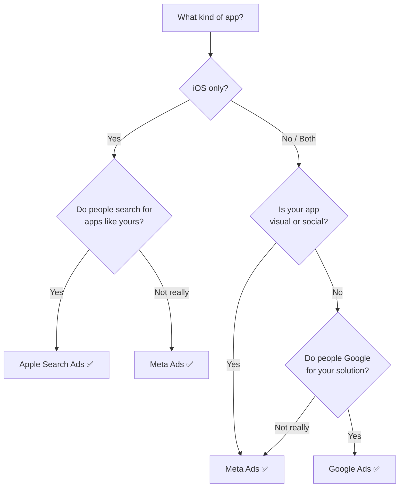

## Don't overthink this

You'll eventually run ads on multiple platforms. For now, **pick one and learn it well.**

## The decision tree

## Platform comparison

| | Meta Ads | Google Ads | Apple Search Ads | TikTok Ads |
|--|---------|-----------|-----------------|------------|
| **Best for** | Consumer apps, broad reach | High-intent searches | iOS apps | Young audience |
| **Reach** | 3B+ users | 8.5B searches/day | App Store only | 1B+ users |
| **Targeting** | Interest + behavior | Keywords + intent | Keywords | Interest + behavior |
| **Min. budget** | $5/day | $10/day | $5/day | $20/day |
| **Difficulty** | ⭐⭐ | ⭐⭐⭐ | ⭐ | ⭐⭐ |
| **CPI range** | $1-5 | $1-4 | $0.50-3 | $1-5 |
| **Learning curve** | Medium | Medium-High | Low | Medium |

## Our recommendation

<Tip>
  **If you had to pick just one, go with Meta (Facebook/Instagram).**

  Why:
  - Biggest audience
  - Best algorithm for finding the right users
  - Most creative flexibility
  - Tons of tutorials and community support
  - Works for almost every type of app

  **Runner-up: Apple Search Ads** — if your app is iOS-only and people would search for it.
</Tip>

## Quick profiles

### Meta Ads — The all-rounder
- Great for: Any consumer app
- You'll spend most time on: Creative testing
- Superpowers: Lookalike audiences, detailed interest targeting

### Google Ads — The intent catcher
- Great for: Apps that solve a searchable problem ("best budget app")
- You'll spend most time on: Keyword research
- Superpowers: Catching people at the moment they need you

### Apple Search Ads — The easy win
- Great for: Any iOS app
- You'll spend most time on: Picking the right keywords
- Superpowers: Highest intent (they're IN the App Store!), easiest to set up

### TikTok Ads — The wild card
- Great for: Fun, visual, or young-audience apps
- You'll spend most time on: Making engaging videos
- Superpowers: Viral potential, cheap impressions

## Next step

You've picked your platform. Now let's set up tracking so you can measure what happens.

<Card
  title="Set Up Tracking →"
  icon="arrow-right"
  href="/first-campaign/set-up-tracking"
>
  Install the tracking tools before you spend a single dollar.
</Card>
