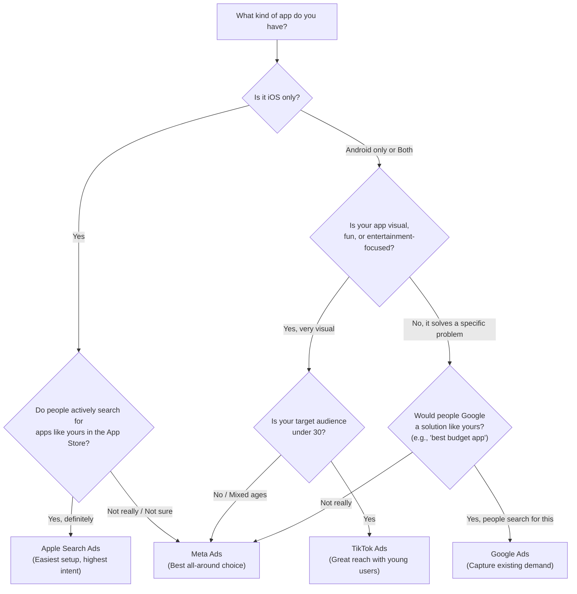

## Don't overthink this (but do think a little)

Here is the truth: you will eventually run ads on multiple platforms. But right now, you need to **pick ONE platform and learn it well**. Trying to learn Meta, Google, TikTok, and Apple all at the same time is like trying to learn four languages simultaneously. You will end up speaking none of them.

This page will help you make that decision with confidence. Let's go.

---

## The big four platforms at a glance

Before we dive deep, here is a quick overview of the four major platforms for mobile app advertising:

| | **Meta Ads** | **Google Ads** | **Apple Search Ads** | **TikTok Ads** |
|--|---------|-----------|-----------------|------------|
| **What it is** | Ads on Facebook, Instagram, Messenger, WhatsApp | Ads on Google Search, YouTube, Play Store, millions of apps | Ads at the top of App Store search results | Ads in the TikTok feed |
| **Best for** | Almost any consumer app | Apps that solve a searchable problem | iOS apps (iPhone/iPad only) | Fun, visual, or Gen-Z-focused apps |
| **Total reach** | 3.0B+ monthly active users | 8.5B+ searches per day | App Store visitors only | 1.5B+ monthly active users |
| **Targeting style** | Interest + behavior based | Keyword + intent based | Keyword based | Interest + behavior based |
| **Min. daily budget** | $5/day (recommend $10-20/day) | No official minimum (recommend $10-50/day) | No minimum (pay per tap) | $20/day per ad group, $500 campaign minimum |
| **Avg. CPI** | $1-5 | $1-4 | Avg CPT $2.50, Avg CPI $1.80 | $1-5 |
| **Learning curve** | Medium | Medium-High | Low | Medium |
| **Creative needed** | Images or video | Text + images (Google assembles ads) | None (uses App Store listing) | Video (required) |
| **Best feature** | Best algorithm for finding users | Catches people with high intent | Highest-intent users (already in App Store) | Viral potential, cheap impressions |
| **Biggest challenge** | Creative testing takes time | Less control over targeting | iOS only, limited scale | Requires video content |

---

## The decision tree

Not sure where to start? Walk through these questions:

<Tip>
  **Pro Tip:** Notice how many paths lead to Meta Ads? That is not a coincidence. Meta is the most versatile platform and the safest first choice for most apps. If you are unsure after the decision tree, go with Meta.
</Tip>

---

## Deep dive into each platform

Let's look at each platform in detail so you know exactly what you are getting into.

### Meta Ads (Facebook and Instagram) — The all-rounder

<Card title="Meta Ads at a glance" icon="meta">
  **Best for:** Almost any consumer app, especially social, lifestyle, health, productivity, and entertainment apps.
</Card>

**Why Meta is often the best first choice:**

1. **Largest audience on earth.** Over 3 billion people use Meta's platforms monthly. No matter who your users are, they are on Facebook or Instagram.

2. **The best algorithm.** Meta's ad delivery algorithm is genuinely impressive. You give it a goal ("find people who will install my app"), and it gets eerily good at finding them. The more data it gets, the better it performs.

3. **Creative flexibility.** You can run image ads, video ads, carousel ads (multiple images that swipe), and more. This gives you lots of room to experiment.

4. **Massive community.** Because Meta Ads is the most popular platform, there are thousands of tutorials, YouTube videos, Reddit threads, and communities to help you. When you get stuck, help is easy to find.

5. **Reasonable minimums.** The technical minimum is $5/day, but we recommend starting with $10-20/day for meaningful results.

**The downsides:**

- Creative quality matters a LOT. Boring images = wasted money.
- The dashboard can be overwhelming at first (so many buttons and options).
- iOS tracking has gotten harder since Apple's ATT privacy changes (but Meta has adapted).
- Ad review can take 24-48 hours for new advertiser accounts.

**Ideal budget to start:** $15/day for 7 days = $105 total

**You will spend most time on:** Creating and testing different images/videos

<Tip>
  **Pro Tip from Meta advertising experts:** When starting out, use **Advantage+ placements** (the default). This lets Meta show your ad wherever it will perform best — Facebook Feed, Instagram Stories, Reels, etc. Fighting this by selecting specific placements is a common beginner mistake.
</Tip>

---

### Google Ads — The intent catcher

<Card title="Google Ads at a glance" icon="google">
  **Best for:** Utility apps, productivity tools, apps that solve a specific searchable problem (e.g., "best budget tracker app").
</Card>

**Why Google Ads can be great:**

1. **Intent-based targeting.** When someone searches "best meditation app" on Google, they WANT a meditation app right now. This is the highest-intent traffic you can get.

2. **Massive distribution.** Google App campaigns show your ads across Google Search, Google Play Store, YouTube, Gmail, and millions of apps in the Google Display Network. One campaign covers many surfaces.

3. **Automated optimization.** Google's App campaigns use AI to automatically combine your text and images into ads. Less work for you.

4. **No official minimum budget.** You can technically start with very little, though we recommend $10-50/day.

**The downsides:**

- **Less control.** Google App campaigns do not let you choose specific keywords, placements, or audiences. Google's AI handles it all. This can feel frustrating when you want to test specific things.
- The dashboard is complex and has a steep learning curve.
- Reporting can be confusing.
- Ad review typically takes within 1 business day.
- The learning phase is longer: 2-3 weeks and about 100 conversions before the algorithm fully optimizes.

**Ideal budget to start:** $20/day for 14 days = $280 total

**You will spend most time on:** Writing good headlines and descriptions, then waiting

<Tip>
  **Pro Tip:** Google App campaigns need more patience than Meta. The algorithm takes 2-3 weeks to really hit its stride. If you are the type of person who wants to see results in 3 days, start with Meta instead and come back to Google later.
</Tip>

---

### Apple Search Ads — The easy win

<Card title="Apple Search Ads at a glance" icon="apple">
  **Best for:** Any iOS app, especially if people actively search for apps in your category.
</Card>

**Why Apple Search Ads is special:**

1. **Highest intent in the world.** The person seeing your ad is literally in the App Store, searching for something. They are as close to installing as a user can get.

2. **Easiest setup.** Apple Search Ads Basic takes about 5 minutes. You pick your app, set a budget, set a max cost-per-tap, and Apple does the rest. No creative needed — it uses your existing App Store listing.

3. **No SDK required.** For basic campaigns, Apple tracks installs automatically. Zero technical setup.

4. **Great for competitive research.** Even if Apple Search Ads is not your main platform, running a small campaign shows you what keywords people use to find apps like yours.

**The downsides:**

- **iOS only.** If your app is on Android or both platforms, this only covers half your market.
- **Limited scale.** You can only reach people searching in the App Store. Once you have captured that demand, there is nowhere else to go on this platform.
- **Costs can be high for competitive categories.** Average cost-per-tap (CPT) is around $2.50, and average CPI is about $1.80 — but in competitive categories like finance or dating, costs can be much higher.
- **Less creative control.** You cannot upload custom ad images. Apple uses your store listing screenshots.

**Ideal budget to start:** $200-500/month total

**You will spend most time on:** Picking the right keywords and optimizing your App Store listing

<Tip>
  **Pro Tip:** Apple Search Ads is an excellent "second platform" even if it is not your first. Run a $5-10/day Basic campaign alongside your Meta or Google campaign. The high-intent installs you get from Apple Search Ads are often your most valuable users.
</Tip>

---

### TikTok Ads — The wild card

<Card title="TikTok Ads at a glance" icon="tiktok">
  **Best for:** Entertainment, gaming, social, dating, and lifestyle apps targeting users under 35.
</Card>

**Why TikTok Ads can be powerful:**

1. **Massive engagement.** TikTok users spend an average of 95 minutes per day on the app. They are highly engaged and open to discovering new things.

2. **Authentic-looking ads win.** Unlike other platforms where polished creatives perform best, TikTok rewards ads that look like regular TikTok videos. This means your phone-recorded screen capture might outperform a professionally produced ad.

3. **Cheap impressions.** CPMs (cost per 1,000 views) on TikTok tend to be lower than Meta, which means more eyeballs for your money.

4. **Viral potential.** If your ad resonates, TikTok's algorithm can amplify it dramatically.

**The downsides:**

- **Higher minimum budget.** TikTok requires $20/day minimum per ad group and $500 minimum per campaign (lifetime budget). This is significantly higher than other platforms.
- **Video required.** You cannot run image ads. You need video content, and it needs to feel native to TikTok.
- **Audience skews young.** If your target users are over 40, TikTok may not be efficient.
- **Shorter ad lifespan.** TikTok ads tend to "burn out" faster than Meta or Google ads. You will need to refresh your video creative more often.

**Ideal budget to start:** $20-50/day for 7-14 days = $140-700 total

**You will spend most time on:** Creating short, engaging videos that feel like TikTok content

<Warning>
  Because of TikTok's $20/day ad group minimum and $500 campaign minimum, it is NOT the cheapest platform to start on. If your total budget is under $500, start with Meta or Apple Search Ads instead and save TikTok for later.
</Warning>

---

## Our clear recommendation

<Note>
  **If you are reading this and still unsure, start with Meta (Facebook/Instagram).**

  Here is why:
  - It works for virtually every type of app
  - The algorithm is the best in the business at finding your ideal users
  - You can start with just $10-20/day
  - There is more community support and tutorials than any other platform
  - You can run both images and video, giving you flexibility
  - The skills you learn on Meta transfer well to other platforms

  **Runner-up: Apple Search Ads** — if your app is iOS-only and people search for apps like yours. It is the easiest to set up and gives you the highest-intent users.
</Note>

---

## Side-by-side: "Should I start with..." decision helper

Still not sure? Here are common scenarios:

<AccordionGroup>
  <Accordion title="I have a fitness/health app">
    **Start with: Meta Ads**

    Health and fitness is one of the biggest categories on Meta. People discover health apps through social media constantly. Use before/after style creatives (following platform policies), motivational messaging, and lifestyle imagery.
  </Accordion>

  <Accordion title="I have a productivity/utility app">
    **Start with: Google Ads**

    People actively search for productivity tools. "Best to-do list app" or "time tracking app" are high-intent searches. Google will capture these searchers when they are ready to download.

    **Also consider:** Apple Search Ads if iOS-only.
  </Accordion>

  <Accordion title="I have a game">
    **Start with: Meta Ads**

    Gaming ads on Meta and Instagram perform very well, especially short video clips showing gameplay. The targeting algorithm is great at finding gamers.

    **Also consider:** TikTok if your game has visual appeal and targets under-30.
  </Accordion>

  <Accordion title="I have a social/dating app">
    **Start with: TikTok Ads (if budget allows) or Meta Ads**

    Social and dating apps thrive on TikTok because the content is inherently social. But if budget is tight, Meta is the safer choice.
  </Accordion>

  <Accordion title="I have a niche/professional app">
    **Start with: Google Ads or Apple Search Ads**

    For niche apps, intent-based platforms work best. People searching for very specific tools ("HVAC calculator app" or "guitar tuner app") are your ideal audience.
  </Accordion>

  <Accordion title="I have a kids/education app">
    **Start with: Apple Search Ads**

    Parents search the App Store for educational apps for their kids. Apple Search Ads captures this intent perfectly. Meta is a good second choice for reaching parents through interest targeting.
  </Accordion>

  <Accordion title="My budget is under $200 total">
    **Start with: Apple Search Ads Basic or Meta Ads**

    With a very small budget, Apple Search Ads Basic gives you the most efficient spend because every person who sees your ad is already in the App Store looking for apps. Meta at $10/day for 2 weeks also works.

    **Avoid TikTok** — the $20/day minimum and $500 campaign minimum will eat your entire budget too fast.
  </Accordion>
</AccordionGroup>

---

## Platform budget summary

Here is what you should budget for each platform as a beginner:

| Platform | Minimum to Learn Anything | Sweet Spot for First Campaign | Our Pick for Tight Budget |
|----------|--------------------------|-------------------------------|---------------------------|
| **Meta** | $70 ($10/day x 7 days) | $105-210 ($15-30/day x 7 days) | $10-20/day |
| **Google** | $140 ($10/day x 14 days) | $280-700 ($20-50/day x 14 days) | $10-20/day |
| **Apple Search Ads** | $50 total | $200-500/month | $5-10/day |
| **TikTok** | $500 (campaign minimum) | $500-1,000 | $20/day minimum |

<Tip>
  **Pro Tip from paid acquisition managers:** Your first $100-200 is "learning budget" no matter which platform you pick. Do not evaluate success based on your first week of results. The real optimization starts after you have data from that first campaign.
</Tip>

---

## You've picked your platform. Great!

Now comes the slightly technical (but very important) part: setting up tracking so you actually know which ads bring you installs.

<Card
  title="Set Up Tracking"
  icon="arrow-right"
  href="/first-campaign/set-up-tracking"
>
  Next up: Install tracking tools before you spend a single dollar. This 15-minute setup saves you from flying blind.
</Card>
