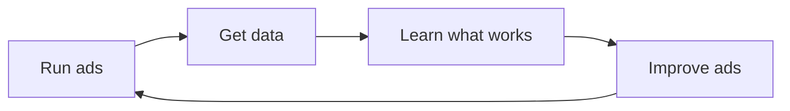

## The auction — the one concept that explains everything

Here's the most important thing we'll teach you in this entire guide. Ready?

**Every single ad you've ever seen was the winner of an auction.**

Every time you open Instagram, search something on Google, scroll through TikTok, or browse the App Store — an auction happens. Not a slow, dramatic auction with a person holding a gavel. A lightning-fast, algorithmic auction that happens in the background, millions of times per second, all over the world.

And here's the mind-blowing part: **each auction takes about 100 milliseconds.** That's 0.1 seconds. Less time than it takes you to blink. In the time it took you to read this sentence, thousands of ad auctions were completed globally.

Let's break down exactly what happens in those 100 milliseconds.

---

## Step by step: what happens when someone sees an ad

<Steps>
  <Step title="A user does something (Time: 0ms)">
    Someone picks up their phone and opens Instagram. Or types "best running app" into Google. Or launches TikTok during their lunch break. Or searches "meditation" in the App Store.

    The moment they do this, they create what's called an **ad opportunity** (or "ad request"). The platform now has a slot to fill — a space on the screen where an ad could appear.

    Think of it like a tiny billboard that just appeared on this person's screen, and the platform needs to decide what goes on it.
  </Step>

  <Step title="The platform gathers context (Time: 1-5ms)">
    In the first few milliseconds, the platform collects everything it knows about this specific moment:

    **About the user:**
    - Demographics (age range, gender, location)
    - Interests and behaviors (what they've liked, searched for, engaged with)
    - Device information (iPhone 15 Pro, Android tablet, etc.)
    - Time and context (morning commute, late-night browsing, etc.)
    - Past ad interactions (what they've clicked on before, what they've ignored)

    **About the opportunity:**
    - Where on the screen the ad will appear (Feed, Stories, Search results, etc.)
    - What format is available (image, video, carousel, etc.)
    - What content surrounds the ad slot

    This is all anonymized and aggregated data. The platform doesn't "know" the person — it knows a profile of behaviors and preferences.
  </Step>

  <Step title="The platform finds eligible advertisers (Time: 5-15ms)">
    Now the platform checks: "Which advertisers want to reach this type of person?"

    Remember, you (as an advertiser) already told the platform something like: "I want to reach 18-35 year olds in the United States who are interested in productivity and self-improvement."

    If the user on their phone matches your targeting criteria, you're in the running. But you're probably not the only one. There might be **hundreds or even thousands of advertisers** who also want to reach this person.

    All of these eligible advertisers are gathered into a pool. This is where the auction begins.
  </Step>

  <Step title="The auction happens (Time: 15-80ms)">
    This is the big moment. The platform needs to pick one ad (or a few ads) to show. But it doesn't just pick the advertiser willing to pay the most. That would result in a terrible user experience — you'd only see ads from the biggest companies with the deepest pockets, and they might not even be relevant to you.

    Instead, the platform calculates something called **Ad Rank** (or "Total Value") for each eligible advertiser. The formula varies by platform, but here's the core concept:

    ```
    Ad Rank = Your Bid × Ad Quality Score × Estimated Relevance
    ```

    Let's break that down:

    - **Your Bid**: How much you're willing to pay. This might be a maximum CPC (cost per click), a target CPI (cost per install), or a budget-based automatic bid.
    - **Ad Quality Score**: How good is your ad? Is it visually appealing? Does it have high engagement? Is the landing page (your app store listing) relevant and well-made?
    - **Estimated Relevance**: How likely is this specific user to find your ad relevant? Based on their past behavior, is this the kind of thing they'd engage with?

    The **highest Ad Rank wins**, not necessarily the highest bid. This is crucial to understand.
  </Step>

  <Step title="The winner is chosen and the ad is shown (Time: 80-100ms)">
    The platform selects the winning ad (or ads, if there are multiple slots) and renders it on the user's screen. The entire process — from the user opening the app to seeing the ad — took about 100 milliseconds. The user has no idea any of this happened.

    The ad appears naturally in their feed, search results, or story. From the user's perspective, it just... showed up.
  </Step>

  <Step title="Something happens (or doesn't) (Time: varies)">
    Now the user reacts to your ad:

    - **They scroll past** — This is an impression. You might or might not pay for this, depending on your billing model.
    - **They look at it for a moment, then scroll** — Still just an impression, but the platform notes the pause.
    - **They tap/click on it** — This is a click. Your ad was compelling enough to earn attention. You might pay for this.
    - **They visit your app store page** — Getting warmer. They're considering your app.
    - **They install your app** — This is the goal. A conversion. You definitely pay for this (if you chose CPI billing).

    Regardless of what happens, the platform records the outcome. This data feeds back into the system, helping the algorithm get smarter about which ads to show to which people.
  </Step>
</Steps>

<Tip>
**Pro Tip from the engineering perspective:** If you're thinking "wait, this is basically a real-time bidding system with machine learning," you're exactly right. Ad platforms are some of the most sophisticated distributed systems in the world. They process millions of auctions per second with sub-100ms latency requirements. It's genuinely impressive engineering. And now, you get to benefit from all of that infrastructure for the cost of a coffee per day.
</Tip>

---

## Understanding Ad Rank: why the highest bid doesn't always win

This is one of the most important concepts in advertising, and it's actually great news for indie developers with small budgets.

Let's say three advertisers want to show an ad to the same user:

| Advertiser | Bid (per click) | Quality Score (1-10) | Relevance Score (1-10) | Ad Rank |
|-----------|----------------|---------------------|----------------------|---------|
| Big Corp Inc. | $5.00 | 4 | 3 | 5.00 × 4 × 3 = **60** |
| Medium Startup | $2.00 | 7 | 8 | 2.00 × 7 × 8 = **112** |
| You (indie dev) | $1.50 | 9 | 9 | 1.50 × 9 × 9 = **121.5** |

**You win!** Even though Big Corp is bidding 3x more per click, your ad wins because it's higher quality and more relevant to the user.

<Note>
**Why do platforms do this?** Because they want users to have a good experience. If platforms only showed ads from the highest bidder, users would see irrelevant, low-quality ads, get annoyed, and use the platform less. Fewer users = less ad revenue for the platform. So the platform's incentive is perfectly aligned with your incentive: show relevant, high-quality ads to the right people.
</Note>

### How Ad Rank works on each major platform

While the core concept is the same, each platform has its own terminology:

<AccordionGroup>
  <Accordion title="Meta (Facebook/Instagram): Total Value">
    Meta calculates what they call **Total Value** for each ad:

    ```
    Total Value = Advertiser Bid × Estimated Action Rate × Ad Quality
    ```

    - **Advertiser Bid**: What you're willing to pay for a result
    - **Estimated Action Rate**: Meta's prediction of how likely this user is to take your desired action (click, install, etc.)
    - **Ad Quality**: Based on feedback from users (hiding ads, reporting ads) and overall engagement signals

    Meta's machine learning is exceptionally good at predicting user behavior. After about 50 conversion events (called the "learning phase"), Meta's algorithm has a strong model of who your ideal user is and will actively seek them out.
  </Accordion>

  <Accordion title="Google Ads: Ad Rank">
    Google uses a score they literally call **Ad Rank**:

    ```
    Ad Rank = Bid × Quality Score × Expected Impact of Extensions
    ```

    - **Bid**: Your maximum cost-per-click or target CPA
    - **Quality Score**: A 1-10 score based on expected click-through rate, ad relevance, and landing page experience
    - **Expected Impact of Extensions**: Additional information you provide (like app ratings, screenshots, etc.)

    Google is transparent about Quality Score — you can actually see it in your dashboard. A Quality Score of 8+ means you're paying less per click than competitors with lower scores.
  </Accordion>

  <Accordion title="TikTok Ads: Ad Relevance and Quality">
    TikTok uses a similar system:

    ```
    Ad Score = Bid × Estimated Engagement Rate × Ad Quality Signals
    ```

    TikTok places heavy emphasis on creative quality. Ads that feel like native TikTok content (entertaining, authentic, vertical video) get significantly better scores. This is actually great for indie developers — a genuine, authentic video of you showing your app often outperforms a polished corporate ad.
  </Accordion>

  <Accordion title="Apple Search Ads: Relevance-Based">
    Apple Search Ads works a bit differently because it's focused on search:

    ```
    Ad Placement = Bid × Relevance to Search Query
    ```

    Apple determines relevance based on your app's metadata (title, subtitle, keywords) and how well it matches the user's search query. The average Cost Per Tap (CPT) for Apple Search Ads is around **$2.50** (2024 data), but this varies significantly by keyword competitiveness.

    Apple Search Ads is unique because users are already actively looking for an app — they have high intent. This often results in better conversion rates than other platforms.
  </Accordion>
</AccordionGroup>

---

## The three things you control

As an advertiser, you have exactly three levers to pull. Everything else — the auction, the algorithm, the user behavior — is outside your control. But these three things are entirely up to you:

<CardGroup cols={3}>
  <Card title="1. Who sees it" icon="users">
    **Targeting**

    Who do you want to reach? You define this through:
    - **Demographics**: Age, gender, location, language
    - **Interests**: What they're interested in (fitness, cooking, tech, etc.)
    - **Behaviors**: What they've done (installed similar apps, made purchases, etc.)
    - **Keywords**: What they search for (on Google and Apple Search Ads)
    - **Custom audiences**: People who've visited your website or used your app before
    - **Lookalike audiences**: People who are similar to your existing users

    Think of targeting as choosing which room to walk into at a party. You want to find the room where people are most likely to be interested in what you've built.
  </Card>
  <Card title="2. What they see" icon="image">
    **Creative**

    This is your ad itself — the thing people actually see. It includes:
    - **The visual**: Image, video, or carousel
    - **The headline**: The first text they read
    - **The body copy**: Supporting text
    - **The call-to-action**: "Download," "Learn More," "Get the App"

    Creative is the single biggest factor in whether your ad succeeds or fails. A great creative with mediocre targeting will outperform mediocre creative with perfect targeting, almost every time.
  </Card>
  <Card title="3. How much you pay" icon="dollar-sign">
    **Budget and Bidding**

    How much are you willing to spend, and how do you want to pay?
    - **Daily budget**: The maximum you'll spend per day
    - **Bid strategy**: Automatic (let the platform decide) or manual (you set the max bid)
    - **Billing event**: Pay per impression (CPM), per click (CPC), or per install (CPI)

    For beginners, we strongly recommend starting with automatic bidding and a daily budget you're comfortable with. Let the platform's algorithm do the heavy lifting.
  </Card>
</CardGroup>

<Tip>
**Pro Tip from Facebook's own advertising guidelines:** "When starting a new campaign, use automatic bidding (called 'Lowest Cost' on Meta). Our algorithm has more data about auction dynamics than any individual advertiser. Manual bidding is a tool for experienced advertisers who have a specific reason to cap their bids. For most advertisers, automatic bidding delivers more results at a lower cost."
</Tip>

That's it. Every decision you'll ever make in advertising comes down to adjusting one of these three things. Everything else in this guide is just getting more specific about *how* to adjust them.

---

## Every metric explained (with analogies)

When you look at an ad dashboard for the first time, it can feel like staring at a cockpit. Numbers everywhere. Let's demystify every metric you'll encounter.

### The fundamental metrics

<AccordionGroup>
  <Accordion title="Impressions — 'How many people saw my ad?'">
    **What it is**: The number of times your ad was displayed on someone's screen.

    **Analogy**: Imagine you put up a poster on a busy street. Every person who walks past and could see it counts as an impression. They might not stop to read it. They might not even notice it. But it was *there*.

    **What's a good number?** This varies wildly. For a $20/day campaign, expect anywhere from 2,000 to 20,000 impressions per day, depending on your targeting and platform.

    **When to worry**: If your impressions are very low (under 500/day), your targeting might be too narrow, or your bid too low.
  </Accordion>

  <Accordion title="Clicks — 'How many people tapped on my ad?'">
    **What it is**: The number of times someone actively tapped or clicked on your ad to learn more.

    **Analogy**: Same poster on the street, but now you're counting the people who stop, walk up to the poster, and take a closer look (or scan the QR code, or write down the URL).

    **What's a good number?** For app install campaigns, expect 1-5% of impressions to turn into clicks (this is your CTR — see below).

    **When to worry**: If you're getting plenty of impressions but almost no clicks, your creative isn't compelling enough. Time to try a different image, video, or headline.
  </Accordion>

  <Accordion title="CTR (Click-Through Rate) — 'Is my ad interesting?'">
    **What it is**: The percentage of people who saw your ad and clicked on it. Calculated as: Clicks ÷ Impressions × 100.

    **Analogy**: If 100 people walk past your poster and 3 stop to take a closer look, your CTR is 3%.

    **What's a good number?**
    - Facebook/Instagram Feed ads: 0.9-1.5% is average, 2%+ is good
    - Google Search ads: 3-5% is average, 8%+ is good
    - TikTok ads: 0.5-1.5% is average
    - Apple Search Ads: varies widely by keyword

    **Why it matters**: CTR is one of the strongest signals of ad quality. A high CTR tells the platform "people find this ad relevant," which improves your Ad Rank and often lowers your costs.
  </Accordion>

  <Accordion title="CPC (Cost Per Click) — 'How much am I paying for attention?'">
    **What it is**: How much you pay, on average, for each click on your ad. Calculated as: Total Spend ÷ Total Clicks.

    **Analogy**: If you hired someone to hand out flyers on the street, CPC is like the cost per person who actually takes a flyer (not just walks past).

    **What's a good number?** For app campaigns:
    - $0.20-0.80 for Facebook/Instagram (varies by targeting)
    - $0.50-2.00 for Google Search (highly competitive keywords can be much higher)
    - $0.10-0.50 for TikTok
    - Varies widely for Apple Search Ads

    **When to worry**: If your CPC is high but your conversion rate is also high, that's fine — you're paying more for higher-quality clicks. If CPC is high AND conversion is low, you're paying a lot for clicks that don't convert.
  </Accordion>

  <Accordion title="CPI (Cost Per Install) — 'The metric that matters most'">
    **What it is**: How much you pay, on average, for each app install. Calculated as: Total Spend ÷ Total Installs. This is your **north star metric** as an app developer.

    **Analogy**: If you're selling lemonade, CPI is the cost of acquiring each new customer who actually buys a cup. Not the cost of a person walking past your stand (impression), not the cost of someone reading your menu (click), but the cost of someone actually buying.

    **What's a good number?** Global averages (2024-2025):
    - iOS: ~$3.6 per install
    - Android: ~$1.2 per install

    But these vary enormously by category, country, and creative quality. Gaming apps can see CPIs under $1. Finance apps might see CPIs over $10.

    **The golden rule**: Your CPI should be significantly less than your user's Lifetime Value (LTV). If a user is worth $10 to you over their lifetime, and you can acquire them for $2, you have a sustainable growth engine.
  </Accordion>

  <Accordion title="CPM (Cost Per Mille/Thousand) — 'The cost of eyeballs'">
    **What it is**: How much you pay per 1,000 impressions. "Mille" is Latin for thousand. Calculated as: (Total Spend ÷ Impressions) × 1,000.

    **Analogy**: If you're buying a TV commercial, CPM is the cost per 1,000 viewers. It tells you how expensive it is to get your ad in front of people, before you even know if they'll engage.

    **What's a good number?**
    - Facebook/Instagram: $5-15 CPM (varies by audience and competition)
    - TikTok: $3-10 CPM
    - Google Display: $2-8 CPM

    **When it matters**: CPM is mostly a platform-level metric. You can't control it directly (it's set by the auction), but it gives you a sense of how competitive your targeting audience is. If CPM is very high, your audience might be too competitive, and you should consider broadening your targeting.
  </Accordion>

  <Accordion title="ROAS (Return on Ad Spend) — 'Am I making money?'">
    **What it is**: The revenue you earn divided by the amount you spend on ads. Calculated as: Revenue from Ad Users ÷ Ad Spend.

    **Analogy**: If you invest $100 in the stock market and get back $300, your ROAS is 3x (or 300%). For every dollar you put in, you got three dollars back.

    **What's a good number?**
    - ROAS of 1x = break even (you're getting back exactly what you spent)
    - ROAS of 2x+ = profitable
    - ROAS of 3x+ = very healthy

    **Important caveat**: ROAS only works if your app has direct monetization (in-app purchases, subscriptions, ads). If your app is free with no revenue, ROAS doesn't apply — you'd focus on CPI and retention instead.

    **When to worry**: If ROAS is below 1x, you're losing money on every user. Either your CPI is too high, or your monetization needs improvement.
  </Accordion>

  <Accordion title="Conversion Rate — 'How many clickers become users?'">
    **What it is**: The percentage of people who clicked your ad and then completed the desired action (usually installing your app). Calculated as: Installs ÷ Clicks × 100.

    **Analogy**: If 100 people walk into a car dealership (clicks), and 20 buy a car (conversions), the conversion rate is 20%.

    **What's a good number?** For app installs from ad clicks:
    - 20-40% is typical (meaning 2-4 out of every 10 people who click your ad end up installing)
    - Below 15% suggests your app store page needs improvement
    - Above 50% is excellent

    **Key insight**: If people are clicking your ad but not installing, the problem usually isn't your ad — it's your app store listing. Your screenshots, description, ratings, or reviews might not be convincing enough. This is actually a very actionable insight.
  </Accordion>
</AccordionGroup>

---

## The learning phase: why patience matters

This is something every beginner needs to understand, and it can save you from making an expensive mistake.

When you launch a new campaign, the platform's algorithm doesn't know anything about your app yet. It doesn't know who's most likely to install it. It doesn't know which of your targeting options will work best. It's starting from scratch.

So for the first few days, it **experiments**. It shows your ad to different types of people within your target audience, observes who engages, and gradually builds a model of your ideal user. This is called the **learning phase**.

### What the learning phase looks like

<Steps>
  <Step title="Day 1-2: The scatter phase">
    The algorithm casts a wide net. Your CPI might be all over the place — $5 one hour, $0.50 the next. This is normal. The algorithm is testing.

    **What you'll feel:** "This isn't working! The costs are too high!"
    **What's actually happening:** The algorithm is collecting data about who responds to your ad.
  </Step>
  <Step title="Day 3-5: The pattern-finding phase">
    The algorithm starts to identify patterns. "Ah, 25-34 year old women in urban areas who are interested in wellness are 4x more likely to install this app." It starts concentrating delivery on these high-potential users.

    **What you'll see:** Costs starting to stabilize. CPI getting more consistent.
  </Step>
  <Step title="Day 5-7+: The optimization phase">
    The algorithm has a working model. It knows who to target, what time of day works best, and which placements perform well. Your metrics stabilize and (ideally) improve.

    **What you'll see:** Consistent CPI, steady daily installs, predictable spending.
  </Step>
</Steps>

<Warning>
**The #1 beginner mistake: killing campaigns too early.** If you launch a campaign, see high costs on Day 1, panic, and turn it off — you just wasted your money. The algorithm never got a chance to learn. You paid for data collection without getting the benefit of optimization.

**The rule of thumb**: Give a campaign at least **3-5 days and 50+ conversion events** before making any judgment. On Meta specifically, the learning phase requires approximately 50 conversion events (installs, in this case) per week per ad set to complete.
</Warning>

<Tip>
**Pro Tip from Meta's own Business Help Center:** "During the learning phase, performance is less stable and cost per result is usually worse. Don't make significant changes to your ad set during the learning phase, as this resets the learning. Significant changes include adjusting your budget by more than 20%, changing your targeting, or swapping creative. Patience during this phase leads to better long-term performance."
</Tip>

### What makes the algorithm favor your ads

The platforms' algorithms are sophisticated machine learning systems, and understanding what they optimize for gives you a real edge. Here's what makes the algorithm work harder for you:

1. **High engagement rates**: If people click, comment on, save, or share your ad, the platform sees it as high-quality content and shows it to more people at lower cost.

2. **Good post-click experience**: If people click your ad, visit the app store, and install quickly — the algorithm loves this signal. It means your entire funnel is working.

3. **Positive user feedback**: If users don't hide, report, or "not interested" your ad, that's a positive signal.

4. **Consistent budget**: Sudden budget changes confuse the algorithm. Steady daily budgets give it the best chance to optimize.

5. **Fresh creative**: Ad fatigue is real. When the same people see the same ad too many times, engagement drops. Refreshing your creative every 2-4 weeks keeps the algorithm performing well.

6. **Broad targeting (counterintuitively)**: Giving the algorithm a larger audience to explore often results in better performance than hyper-narrow targeting. The algorithm is better at finding your users within a broad audience than you are at manually defining that audience.

<Tip>
**Pro Tip from experienced media buyers:** "Trust the algorithm more than you trust your instincts. New advertisers often create very narrow audiences — '25-30 year olds in San Francisco who like yoga AND meditation AND mindfulness.' That's too narrow. Give the algorithm a broader audience like '18-45 year olds in the US interested in wellness' and let it figure out who converts best. It will almost always outperform your manual targeting."
</Tip>

---

## A real example with actual numbers

Let's walk through a complete, realistic example so you can see how all of this fits together.

### The setup

You built a **habit tracking app** called "DailyStreak." You want to run ads on Instagram to get your first users.

```
Platform:     Meta (Instagram Feed + Stories)
Target:       18-45 year olds in the US
              Interests: "productivity," "self-improvement," "habits"
Creative:     A 15-second video showing the app in action
              Headline: "Build habits that actually stick"
              CTA: "Download"
Budget:       $20/day
Bid strategy: Automatic (Lowest Cost)
Billing:      Optimized for app installs
```

### Week 1 results (learning phase + early optimization)

```
Day 1 (Learning):
  Impressions:  6,200
  Clicks:       124 (CTR: 2.0%)
  Installs:     18 (Conversion rate: 14.5%)
  Spend:        $20.00
  CPI:          $1.11
  Notes:        Algorithm is exploring. CPI fluctuated from $0.50 to $3.00 throughout the day.

Day 2 (Learning):
  Impressions:  7,800
  Clicks:       195 (CTR: 2.5%)
  Installs:     28 (Conversion rate: 14.4%)
  Spend:        $20.00
  CPI:          $0.71
  Notes:        Getting better. Algorithm found a promising segment.

Day 3 (Stabilizing):
  Impressions:  8,100
  Clicks:       210 (CTR: 2.6%)
  Installs:     32 (Conversion rate: 15.2%)
  Spend:        $20.00
  CPI:          $0.63
  Notes:        Costs stabilizing. Most installs from 25-34 age group.

Day 4-7 (Optimized):
  Average daily impressions: 8,500
  Average daily clicks:      220 (CTR: 2.6%)
  Average daily installs:    34 (Conversion rate: 15.5%)
  Average daily spend:       $20.00
  Average CPI:               $0.59
```

### Week 1 totals

```
Total impressions:   54,400
Total clicks:        1,383
Total installs:      210
Total spend:         $140.00
Overall CPI:         $0.67
Overall CTR:         2.5%
Conversion rate:     15.2%
```

**210 new users in one week, for $140.** That's the cost of a nice dinner for two.

<Note>
These numbers are realistic but optimistic for a well-crafted ad creative targeting a broad audience on Meta. Your actual results will vary — maybe you get 150 installs for $140, or maybe you get 300. The point is that even the "worst case" scenario here gives you meaningful user data within a week, which is dramatically faster than organic growth.
</Note>

### What you learned from this data

Beyond the installs, here's the goldmine of information you now have:

- **Your best audience**: 25-34 year olds responded 2x better than other age groups. You can create a focused campaign for them.
- **Your best placement**: Instagram Stories drove 40% of installs at a lower CPI than Feed. Interesting.
- **Your conversion rate is 15.2%**: That means 85% of people who click don't install. Your app store page might need work — better screenshots, a more compelling description, or more reviews.
- **Your CPI of $0.67 is well below average**: The global average for iOS is ~$3.6 and Android is ~$1.2. Your ad creative is resonating.

This is data you could never get from organic growth. And you got it in 7 days for $140.

---

## The flywheel: how ads create a learning loop

Here's the beautiful thing about advertising: **it's not a one-time expense, it's a learning system.** Every campaign makes the next one better.



**Cycle 1**: You run your first campaign. You learn that productivity-focused messaging works better than feature-focused messaging. CPI: $0.67.

**Cycle 2**: You create new ads focused on productivity benefits. You also improve your app store screenshots. CPI drops to $0.45.

**Cycle 3**: You test video vs. image ads. Video wins by 30%. You also create a lookalike audience based on your best users. CPI drops to $0.35.

**Cycle 4**: Your CPI is now $0.35, your LTV is $3.00. Every $1 you spend returns $8.57 in lifetime value. You have a growth engine. Time to scale.

Every dollar you spend teaches you something. Bad campaigns aren't failures — they're tuition. The data always has a lesson if you're willing to look for it.

---

## Quick reference: the metrics cheat sheet

Bookmark this. You'll come back to it.

| Metric | Formula | What it tells you | Good benchmark |
|--------|---------|------------------|----------------|
| **Impressions** | (platform-reported) | How many people saw your ad | Varies by budget |
| **Clicks** | (platform-reported) | How many people tapped your ad | Higher = better creative |
| **CTR** | Clicks ÷ Impressions | Is your ad compelling? | 1-3% (social), 3-8% (search) |
| **CPC** | Spend ÷ Clicks | Cost of each click | $0.20-2.00 |
| **CPI** | Spend ÷ Installs | Cost of each install | iOS ~$3.6, Android ~$1.2 (avg) |
| **CPM** | (Spend ÷ Impressions) × 1,000 | Cost per 1,000 views | $5-15 (social) |
| **Conversion Rate** | Installs ÷ Clicks | App store page effectiveness | 20-40% |
| **ROAS** | Revenue ÷ Ad Spend | Are you making money? | 2x+ is good |

---

## What's next?

You now understand the fundamental mechanics of how digital advertising works. You know what happens in those 100 milliseconds, you understand why quality matters more than budget, and you can read a metrics dashboard without panicking.

Now let's go deeper into the building blocks — starting with the ecosystem of players involved in getting your ad from your account to a user's screen.

<Card
  title="The Ad Ecosystem →"
  icon="arrow-right"
  href="/concepts/ad-ecosystem"
>
  Understanding who the players are and how they connect. Platforms, ad networks, attribution tools — and where you fit in.
</Card>
