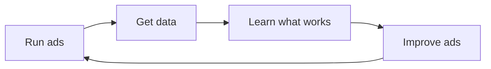

## The auction — the one concept that explains everything

Every time someone opens Instagram, searches Google, or scrolls TikTok, an **auction** happens in milliseconds.

Here's what happens in those milliseconds:

<Steps>
  <Step title="A user does something">
    Someone opens Instagram. Or searches "best running app" on Google. Or opens TikTok.
  </Step>
  <Step title="The platform checks: who wants to show an ad to this person?">
    Hundreds of advertisers have said "I want to reach people like this." You could be one of them.
  </Step>
  <Step title="An auction happens (in ~100ms)">
    The platform picks the winning ad based on: **your bid × your ad quality × relevance to the user**.
  </Step>
  <Step title="The winner's ad is shown">
    The user sees the ad. They might tap it, ignore it, or scroll past.
  </Step>
  <Step title="You only pay if something happens">
    Depending on your setup, you pay when someone **sees** your ad, **clicks** it, or **installs** your app.
  </Step>
</Steps>

<Note>
  This is literally how every major ad platform works — Meta, Google, TikTok, Apple Search Ads.
  The UI is different, the terminology varies, but the core is always this auction.
</Note>

## The three things you control

As an advertiser, you decide three things:

<CardGroup cols={3}>
  <Card title="Who sees it" icon="users">
    **Targeting**: Age, location, interests, behaviors, or keywords they search for.
  </Card>
  <Card title="What they see" icon="image">
    **Creative**: The image, video, or text of your ad. This is what makes people stop scrolling.
  </Card>
  <Card title="How much you pay" icon="dollar-sign">
    **Budget & Bid**: Your daily budget and how much you're willing to pay per result.
  </Card>
</CardGroup>

That's it. Everything else in advertising is just optimizing these three things.

## The metrics that matter

You'll see a lot of numbers. Here are the only ones you need to care about at first:

| Metric | What it means | Why it matters |
|--------|---------------|----------------|
| **Impressions** | How many times your ad was shown | Are people seeing your ad? |
| **Clicks** | How many people tapped your ad | Is your ad interesting? |
| **CTR** (Click-Through Rate) | Clicks ÷ Impressions | How compelling is your ad? |
| **CPC** (Cost Per Click) | How much each click costs | Are you paying too much? |
| **CPI** (Cost Per Install) | How much each app install costs | The ultimate metric for apps |
| **ROAS** (Return on Ad Spend) | Revenue ÷ Ad spend | Are you making money? |

<Tip>
  **Don't memorize these.** We have a [full glossary](/glossary/index) you can reference anytime.
  For now, just know that **CPI** (Cost Per Install) is your north star metric as an app developer.
</Tip>

## A real example

Let's say you built a habit tracking app and you want to run ads on Instagram.

```
Your setup:
  - Target: 18-35 year olds interested in "productivity" and "self-improvement"
  - Creative: A short video showing the app in action
  - Budget: $20/day

What happens:
  - Day 1: 5,000 people see your ad (impressions)
  - 150 people tap it (clicks) → CTR = 3% ✅
  - 30 people install your app → CPI = $0.67 ✅
  - You spent $20 and got 30 new users

In one week:
  - 210 new users for $140
  - You now know your app resonates with productivity-minded people
  - You have data to make your next campaign even better
```

<Note>
  These are realistic numbers for a well-made ad. Your first campaign might do better or worse — and that's fine.
  The point is: **you learn fast**.
</Note>

## The flywheel

Here's the beautiful thing: ads create a **learning loop**.



Every dollar you spend teaches you something. Bad campaigns aren't failures — they're data.

## What's next?

Now that you have the mental model, let's dive into the building blocks.

<Card
  title="The Ad Ecosystem →"
  icon="arrow-right"
  href="/concepts/ad-ecosystem"
>
  Understanding who the players are and how they connect.
</Card>
