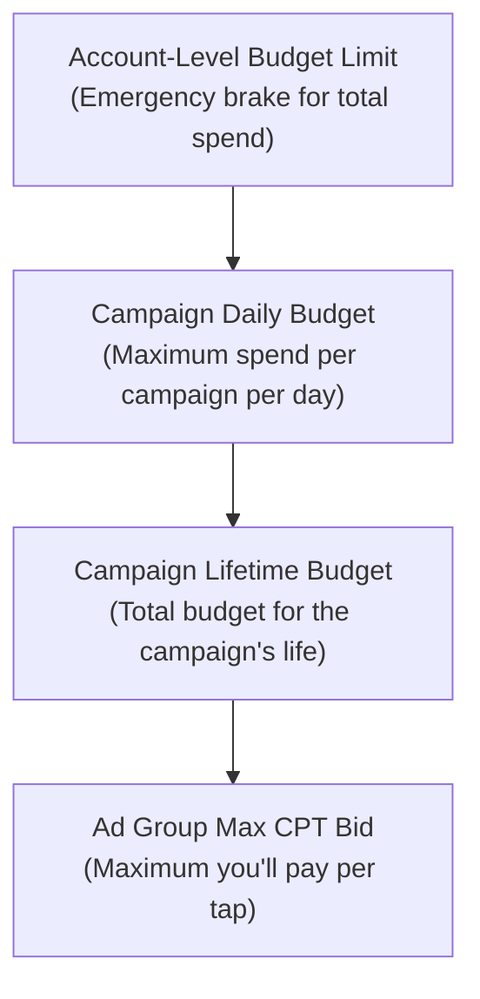

# Apple Search Ads Account Setup

This page walks you through every step of setting up your Apple Search Ads account — from creating your account to adding payment, inviting team members, and even integrating the Attribution API into your app. Follow along step by step, and you will be ready to launch your first campaign.

<Tip>
**Before you start**: You need an Apple ID and an app already published on the App Store. If your app is not live yet, you cannot run ads for it. Apple Search Ads promotes existing App Store listings — it does not help you launch a new app.
</Tip>

---

## Step 1: Create Your Apple Search Ads Account

<Steps>
  <Step title="Go to searchads.apple.com">
    Open your browser and navigate to [searchads.apple.com](https://searchads.apple.com). Click the **"Start Now"** button in the top right corner.
  </Step>
  <Step title="Sign in with your Apple ID">
    Use the same Apple ID that is associated with your App Store Connect account. This is important because Apple Search Ads needs to access your app listings.

    If you use a different Apple ID for personal stuff and for your developer account, make sure you sign in with the **developer** one.
  </Step>
  <Step title="Choose Basic or Advanced">
    You will be asked to select which version you want:

    - **Basic**: If you want simplicity and spend less than $5,000/month per app
    - **Advanced**: If you want full control over keywords, bids, and audiences

    You can always switch later or run both simultaneously, so do not stress over this choice.
  </Step>
  <Step title="Accept the Terms of Service">
    Read and accept Apple's advertising terms. This is a standard legal agreement covering payment terms, content policies, and usage rules.
  </Step>
  <Step title="Select your app">
    After signing in, you will see a list of apps associated with your Apple ID. Select the app you want to promote. If you manage multiple apps, you can add more later.
  </Step>
</Steps>

<Tip>
**Pro Tip**: If you are the sole developer, your personal Apple ID and developer Apple ID are probably the same. But if you work at a company, ask your App Store Connect admin which Apple ID has the right permissions. The person who creates the Apple Search Ads account should have Admin or App Manager role in App Store Connect.
</Tip>

---

## Step 2: Set Up Payment

Apple Search Ads charges you based on how many taps (Basic) or impressions/taps (Advanced) your ads receive. You need a valid payment method before you can run any campaigns.

### Payment Options

| Payment Method | Basic | Advanced | Notes |
|---|---|---|---|
| **Credit Card** | Yes | Yes | Visa, Mastercard, American Express |
| **Debit Card** | Yes | Yes | Must be able to process recurring charges |
| **Monthly Invoicing** | No | Yes (with approval) | For large spenders, requires credit check |

<Steps>
  <Step title="Navigate to Account Settings">
    In your Apple Search Ads dashboard, click the **gear icon** or go to **Account Settings** in the top navigation.
  </Step>
  <Step title="Click on Billing">
    Select the **Billing** tab. This is where you add and manage payment methods.
  </Step>
  <Step title="Add a payment method">
    Click **"Add Payment Method"** and enter your credit or debit card information. Apple will make a small temporary authorization charge to verify the card (this is refunded immediately).
  </Step>
  <Step title="Set your billing country and currency">
    Choose the country where your business is registered and your preferred currency. Apple supports many currencies, but once set, this is difficult to change.
  </Step>
  <Step title="Set a budget limit (Advanced only)">
    In Advanced, you can set an **account-level budget limit**. This is a safety net — if your total spend across all campaigns reaches this amount, Apple will pause all ads. Think of it as an emergency brake.

    For beginners, set this to an amount you are comfortable losing entirely. Start conservative.
  </Step>
</Steps>

<Tip>
**Pro Tip for beginners**: Set a modest account-level budget limit when you are starting out. Something like $500 or $1,000. This protects you from accidentally overspending while you learn. You can always increase it later. It is much better to hit a budget limit and pause than to wake up to a surprise bill.
</Tip>

---

## Step 3: Configure Budget Controls

Beyond the account-level limit, Apple Search Ads gives you multiple layers of budget control. Understanding these layers helps you sleep at night knowing your spend is under control.

### Budget Hierarchy



### Detailed Budget Controls

| Control | Where to Set It | What It Does | Recommended Starting Point |
|---|---|---|---|
| **Account budget** | Account Settings | Total spend limit across all campaigns | $500 - $1,000 |
| **Campaign daily budget** | Campaign Settings | Max spend per day for this campaign | $20 - $50 |
| **Campaign lifetime budget** | Campaign Settings | Total budget for the campaign's entire run | $500 - $1,500 |
| **Max CPT bid** | Ad Group Settings | Most you will pay for a single tap | Apple's suggestion or 20% below |

<Tip>
**Pro Tip**: Apple will suggest a "recommended bid" when you create a campaign. Start at about **80% of the suggested bid** and increase gradually if you are not getting enough impressions. Apple's suggestions tend to be on the higher side because Apple benefits from higher bids.
</Tip>

---

## Step 4: Set Up Team Roles (For Teams)

If you work with other people, you can invite team members with different permission levels. This is important for keeping your account secure while still allowing collaboration.

### Available Roles

| Role | What They Can Do | Best For |
|---|---|---|
| **Account Admin** | Everything — billing, campaigns, settings, user management | Account owner, head of marketing |
| **Campaign Manager** | Create and edit campaigns, keywords, bids | Marketing team members |
| **Limited Access - Read & Write** | Edit campaigns but cannot manage billing or users | External agencies, contractors |
| **Limited Access - Read Only** | View reports and data but cannot change anything | Executives, stakeholders, analysts |

<Steps>
  <Step title="Go to Account Settings">
    Click the gear icon in the top right of your dashboard and select **Account Settings**.
  </Step>
  <Step title="Navigate to User Management">
    Click the **"User Management"** tab or section.
  </Step>
  <Step title="Invite a team member">
    Click **"Invite User"**, enter their Apple ID email address, and select the appropriate role from the dropdown.
  </Step>
  <Step title="They accept the invitation">
    The invited person will receive an email with a link to accept the invitation. Once they accept, they can access your account with the permissions you assigned.
  </Step>
</Steps>

<Tip>
**Pro Tip**: Give external agencies or freelancers **"Limited Access - Read & Write"** — never Account Admin. This lets them manage campaigns without being able to change billing information or invite other users. Always maintain control of your own account.
</Tip>

---

## Step 5: Optimize Your App Store Listing First

Before you spend a single dollar on ads, make sure your App Store listing is as good as possible. Your ad sends people to your App Store page. If that page is not compelling, you are paying for taps that do not convert to installs.

### Your Pre-Launch Checklist

<Steps>
  <Step title="App name and subtitle">
    Your app name should be clear and include your primary keyword naturally. The subtitle (30 characters) is prime real estate for a secondary keyword.

    **Good example**: "Calm - Sleep & Meditation"
    **Bad example**: "Calm"

    The good example tells Apple (for ad relevance) and users (for conversion) exactly what the app does.
  </Step>
  <Step title="Screenshots (critical for conversion)">
    Your first three screenshots are the most important visual asset in your entire marketing. They appear in search results and on your product page.

    - Use **all available screenshot slots** (up to 10)
    - Make the **first 3 screenshots count** — they show in search results without the user tapping
    - Include **text overlays** that explain key features and benefits
    - Show the **actual app interface**, not abstract graphics
    - Test different screenshot orders — the first one matters most
  </Step>
  <Step title="App preview video (optional but powerful)">
    A short video (15-30 seconds) that autoplays in search results. If you have one, it appears before your screenshots and dramatically increases engagement.
  </Step>
  <Step title="Description">
    Write a clear, benefit-focused description. The first 2-3 lines are most important because that is all users see before tapping "more."

    Focus on: What problem does your app solve? Why should someone download it? What makes it different?
  </Step>
  <Step title="Ratings and reviews">
    Apps with fewer than 10 ratings or a rating below 4.0 stars will struggle with ads. The ad might get taps, but people will not install an app with poor reviews.

    If your rating is below 4.0, prioritize fixing bugs and improving user experience before investing heavily in ads.
  </Step>
  <Step title="Keywords (App Store Connect)">
    The 100-character keyword field in App Store Connect directly affects your ad relevance. Research keywords carefully:

    - Use all 100 characters
    - Separate keywords with commas, no spaces
    - Do not repeat words that are already in your title or subtitle
    - Include common misspellings and variations
    - Think about what your target user would search for
  </Step>
</Steps>

<Tip>
**Pro Tip**: Your App Store listing is the "landing page" for your ads. In web advertising, people obsess over landing page optimization. In app advertising, your App Store page IS your landing page. A 10% improvement in your conversion rate means you get 10% more installs for the exact same ad spend.
</Tip>

---

## Step 6: Install the Attribution API (For Developers)

If you want to track which installs came from Apple Search Ads (and which keywords drove them), you need to integrate Apple's Attribution API into your app. This is optional but highly recommended.

### Why the Attribution API Matters

- Know exactly which keywords are driving your best users
- Understand which campaigns generate the most revenue
- Feed attribution data to your analytics tools and MMPs
- Make data-driven decisions about keyword bids

### Implementation

<Tabs>
  <Tab title="Swift (iOS Native)">
    ```swift
    import AdServices
    import iAd

    func fetchAttributionData() {
        // iOS 14.3+ Attribution Token approach
        if #available(iOS 14.3, *) {
            do {
                let token = try AAAttribution.attributionToken()
                // Send this token to Apple's attribution API
                fetchAttributionFromApple(token: token)
            } catch {
                print("Failed to get attribution token: \(error)")
            }
        }
    }

    func fetchAttributionFromApple(token: String) {
        guard let url = URL(string: "https://api-adservices.apple.com/api/v1/") else { return }

        var request = URLRequest(url: url)
        request.httpMethod = "POST"
        request.setValue("text/plain", forHTTPHeaderField: "Content-Type")
        request.httpBody = Data(token.utf8)

        URLSession.shared.dataTask(with: request) { data, response, error in
            guard let data = data,
                  let attribution = try? JSONDecoder().decode(
                    AttributionResponse.self, from: data
                  ) else {
                print("Attribution fetch failed")
                return
            }

            // Use the attribution data
            print("Campaign ID: \(attribution.campaignId)")
            print("Keyword: \(attribution.keyword ?? "N/A")")
            print("Ad Group: \(attribution.adGroupId)")
        }.resume()
    }

    struct AttributionResponse: Codable {
        let attribution: Bool
        let orgId: Int?
        let campaignId: Int?
        let adGroupId: Int?
        let keyword: String?
        let keywordId: Int?
        let clickDate: String?
        let conversionType: String?
    }
    ```
  </Tab>
  <Tab title="React Native">
    ```typescript
    import { Platform, NativeModules } from 'react-native';

    // Option 1: Use a library like react-native-apple-ads-attribution
    // npm install react-native-apple-ads-attribution

    import AppleAdsAttribution from 'react-native-apple-ads-attribution';

    async function getAttribution() {
      if (Platform.OS !== 'ios') return null;

      try {
        const attributionData = await AppleAdsAttribution.getAttributionData();
        console.log('Attribution data:', attributionData);

        // Send to your analytics backend
        await fetch('https://your-api.com/attribution', {
          method: 'POST',
          headers: { 'Content-Type': 'application/json' },
          body: JSON.stringify(attributionData),
        });

        return attributionData;
      } catch (error) {
        console.log('Attribution not available:', error);
        return null;
      }
    }
    ```
  </Tab>
  <Tab title="Flutter">
    ```dart
    // Add to pubspec.yaml:
    // dependencies:
    //   apple_search_ads_attribution: ^1.0.0

    import 'package:apple_search_ads_attribution/apple_search_ads_attribution.dart';
    import 'dart:io';

    Future<void> fetchAttribution() async {
      if (!Platform.isIOS) return;

      try {
        final attribution = AppleSearchAdsAttribution();
        final data = await attribution.getAttributionData();

        if (data != null) {
          print('Campaign ID: ${data['campaignId']}');
          print('Keyword: ${data['keyword']}');

          // Send to your analytics backend
          // await yourAnalyticsService.trackAttribution(data);
        }
      } catch (e) {
        print('Attribution error: $e');
      }
    }
    ```
  </Tab>
</Tabs>

<Tip>
**Pro Tip**: Call the Attribution API on the **first app launch after install**. Do not call it on every launch — you only need the data once. Store the result locally and send it to your backend for analysis. If you use an MMP like Airbridge, AppsFlyer, or Adjust, they handle Apple Search Ads attribution automatically.
</Tip>

---

## Step 7: Set Up API Access (Optional, For Automation)

If you want to automate campaign management — creating campaigns, adjusting bids, pulling reports via code — Apple offers a Campaign Management API.

### When to Use the API

- You manage many campaigns across many apps
- You want to automate bid adjustments based on performance data
- You want to build custom reporting dashboards
- You want to integrate Apple Search Ads data with your other systems

### API Setup

<Steps>
  <Step title="Generate API credentials">
    In your Apple Search Ads dashboard, go to **Account Settings > API**. Generate a new set of API credentials (client ID and client secret).
  </Step>
  <Step title="Create a service account">
    The API uses OAuth 2.0. You will need to create a private key and use it to generate access tokens for API calls.
  </Step>
  <Step title="Make your first API call">
    Test with a simple campaign list request:

    ```bash
    curl -X GET \
      "https://api.searchads.apple.com/api/v5/campaigns" \
      -H "Authorization: Bearer YOUR_ACCESS_TOKEN" \
      -H "X-AP-Context: orgId=YOUR_ORG_ID"
    ```
  </Step>
</Steps>

<Tip>
**Pro Tip**: The API is powerful but not necessary for beginners. If you are just starting out, the web dashboard is perfectly fine. Consider the API when you are spending $5,000+ per month and want to automate bid management or reporting.
</Tip>

---

## Pre-Flight Checklist

Before you move on to creating your first campaign, make sure everything is in order:

| Item | Status | Notes |
|---|---|---|
| Apple Search Ads account created | Required | At searchads.apple.com |
| Payment method added | Required | Credit or debit card |
| Account budget limit set | Recommended | Safety net against overspending |
| App Store listing optimized | Strongly recommended | Screenshots, description, ratings |
| Attribution API integrated | Optional | For tracking keyword performance |
| Team members invited | Optional | If working with others |
| API access configured | Optional | For automation |

---

## Common Setup Issues and How to Fix Them

<AccordionGroup>
  <Accordion title="I can't find my app in Apple Search Ads">
    Your app must be **published and live** on the App Store. Apps in review, TestFlight-only, or removed from sale will not appear. Also make sure you are signed in with the same Apple ID that owns the app in App Store Connect.
  </Accordion>
  <Accordion title="My credit card keeps getting declined">
    Apple authorizes a small test charge. Make sure your card allows international transactions (Apple processes payments from Ireland for many regions). Also check that the billing address matches what your bank has on file.
  </Accordion>
  <Accordion title="I want to run ads in a country where my app isn't available">
    Your app must be available in the App Store for that specific country. Check your app's **Pricing and Availability** settings in App Store Connect to confirm it is enabled for the countries you want to advertise in.
  </Accordion>
  <Accordion title="I see 'No permission' or 'Access denied' errors">
    Ask the account admin to check your role in User Management. You need at least **Campaign Manager** role to create and edit campaigns. Read Only access will not let you create anything.
  </Accordion>
  <Accordion title="Should I start with Basic or Advanced?">
    If you are reading this guide as a beginner: start with **Basic**. It takes 5 minutes to set up and delivers good results with zero keyword research. You can always switch to Advanced later when you want more control. Many people run both simultaneously — Basic for simplicity and Advanced for fine-tuned campaigns.
  </Accordion>
</AccordionGroup>

---

## Next Step

Your account is set up and ready to go. Head to the next page to create and launch your first campaign:

**[Your First Apple Search Ads Campaign](/platforms/apple/first-campaign)** — Step-by-step walkthrough for both Basic and Advanced campaigns, including keyword research, bid strategy, and what to do in the first week.
