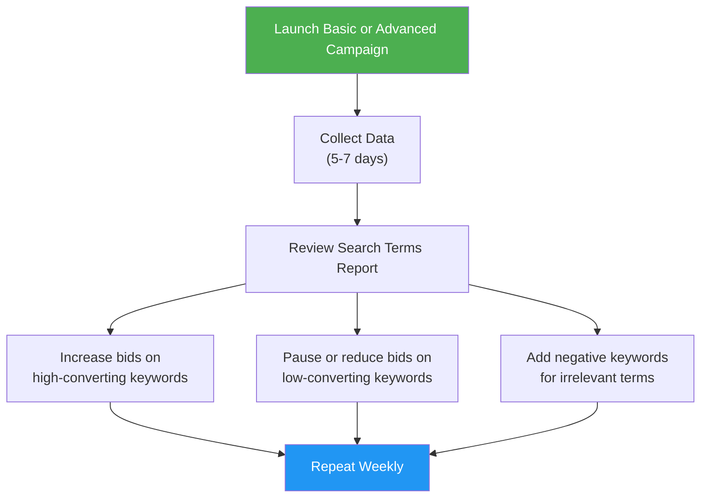

# Your First Apple Search Ads Campaign

You have your account set up and your App Store listing polished. Now it is time to create your first campaign. This guide walks you through both **Basic** and **Advanced** campaign creation, step by step.

If you are a complete beginner, start with Basic. It takes about 10 minutes and Apple does most of the work. If you want more control from day one, jump to the Advanced section.

---

## Option A: Your First Basic Campaign

Basic is the fastest way to start advertising on the App Store. You make a few choices, Apple handles the rest.

<Steps>
  <Step title="Log in and click 'Create Campaign'">
    Go to [searchads.apple.com](https://searchads.apple.com), log into your Basic account, and click **"Create Campaign"** or **"Promote this App"** next to the app you want to advertise.
  </Step>
  <Step title="Select your app">
    Choose the app you want to promote from the dropdown list. Only apps you own (or have access to via App Store Connect) will appear here.
  </Step>
  <Step title="Choose your countries">
    Select the countries or regions where you want your ad to appear. Start with your **primary market** — the country where most of your users are.

    If you are a US-based developer with an English-language app, start with the **United States** only. You can expand to other countries later once you understand your costs.
  </Step>
  <Step title="Set your monthly budget">
    This is the maximum Apple will spend per month on this campaign. Remember, the cap is $5,000 per app per month for Basic.

    **For beginners**: Start with **$100 - $300 per month**. This gives you enough data to learn without a big financial commitment. You can always increase it once you see results.
  </Step>
  <Step title="Set your Max Cost-Per-Install (CPI)">
    This is the most you are willing to pay for a single install. Apple will try to get installs for less than this amount, but will never exceed it.

    **How to choose your max CPI**:
    - If you do not know your user's lifetime value (LTV): start with **$2.00 - $3.00**
    - If you know your LTV: set your CPI to **30-50% of your LTV** (so if a user is worth $10, set CPI to $3-$5)
    - If Apple's suggested CPI seems too high, start lower and increase if you get no impressions
  </Step>
  <Step title="Review and launch">
    Review your settings and click **"Start Campaign"**. Your campaign will go through a brief review (usually minutes, sometimes hours) and then start running.

    That is it. You are done. Apple will automatically choose keywords, target audiences, and optimize your bids.
  </Step>
</Steps>

<Tip>
**Pro Tip**: After launching your Basic campaign, resist the urge to make changes for at least **3-5 days**. Apple's algorithm needs time to learn. Frequent changes reset the learning process and lead to worse results. Be patient, let the data accumulate, then evaluate.
</Tip>

---

## Option B: Your First Advanced Campaign

Advanced gives you full control. This walkthrough covers the entire process: campaign creation, keyword research, ad group setup, bid strategy, and Creative Sets.

### Part 1: Campaign Creation

<Steps>
  <Step title="Log in and click 'Create Campaign'">
    Go to [searchads.apple.com](https://searchads.apple.com), sign into your Advanced account, and click the blue **"+ Create Campaign"** button.
  </Step>
  <Step title="Choose your campaign type">
    Select **"Search Results"** for your first campaign. This is the most straightforward and effective placement — your ad appears when people search relevant keywords.

    (Search Tab, Today Tab, and Product Pages campaigns are great additions later, but Search Results should be your starting point.)
  </Step>
  <Step title="Select your app">
    Choose the app you want to promote.
  </Step>
  <Step title="Choose countries or regions">
    Select where you want your ads to appear. For your first campaign, stick to **one country** (your primary market). Multi-country campaigns make it harder to analyze data because costs and competition vary by country.
  </Step>
  <Step title="Name your campaign">
    Use a descriptive name that you will understand later. Include the campaign type and country.

    Good names: `US - Category Keywords`, `US - Brand Defense`, `US - Discovery`

    Bad names: `Campaign 1`, `Test`, `My Campaign`
  </Step>
  <Step title="Set your campaign budget">
    - **Daily budget**: The maximum Apple will spend per day. Start with **$20-$50/day** for beginners.
    - **Lifetime budget** (optional): The total amount for the entire campaign. Useful if you have a fixed budget.

    Apple may spend up to 2x your daily budget on any given day if it finds good opportunities, but it will average out over the month. This is normal.
  </Step>
</Steps>

### Part 2: Keyword Research

Before creating your ad group, you need keywords. Here is how to find good ones.

#### Method 1: Start with What You Know

Write down every word or phrase someone might use to find an app like yours:

| Category | Example Keywords (for a meditation app) |
|---|---|
| **Direct descriptions** | meditation app, meditation, meditate |
| **Related activities** | mindfulness, breathing exercises, relaxation |
| **Problems you solve** | can't sleep, stress relief, anxiety help |
| **Competitor names** | headspace, calm, insight timer |
| **Feature-specific** | guided meditation, sleep sounds, daily meditation |

#### Method 2: Use Apple's Keyword Suggestions

When you add keywords to your ad group, Apple suggests related keywords and shows their **search popularity** (a 1-100 score). This is invaluable data you cannot get anywhere else.

| Search Popularity | What It Means | Strategy |
|---|---|---|
| 70-100 | Very popular, very competitive | Worth bidding if relevant, expect higher CPT |
| 40-69 | Moderate popularity | Sweet spot for many advertisers |
| 1-39 | Lower popularity | Cheaper, less traffic, can be very targeted |

#### Method 3: Check Your App Store Connect Search Terms Report

If your app has been live for a while, App Store Connect shows which search terms are driving organic traffic. These are great candidates for paid keywords because you already know they are relevant to your app.

<Tip>
**Pro Tip**: Start with 20-40 keywords maximum. It is tempting to add hundreds, but a smaller, focused set is easier to manage and optimize. You can always add more later as you learn what works.
</Tip>

### Part 3: Ad Group Setup

<Steps>
  <Step title="Create your first ad group">
    Within your campaign, click **"Create Ad Group"**. Name it descriptively: `Exact Match - Category Terms` or `Broad Match - Discovery`.
  </Step>
  <Step title="Set your max CPT bid">
    This is the most you will pay for a single tap. Apple will suggest a bid — start at about **80% of the suggestion** and adjust based on results.

    For beginners: **$1.50 - $3.00** is a reasonable starting range for most categories. You can always adjust up or down.
  </Step>
  <Step title="Add your keywords">
    Add the keywords you researched. For each keyword, choose a **match type**:

    - **Exact Match**: Add keywords you are confident about. These give you the most control.
    - **Broad Match**: Add the same keywords (or new ones) in a separate ad group for discovery.

    A good starting structure is two ad groups:
    1. `Exact Match - Core Keywords` — Your 10-20 best keywords
    2. `Broad Match - Discovery` — Same or additional keywords to find new search terms
  </Step>
  <Step title="Add negative keywords">
    **Negative keywords** prevent your ad from showing for irrelevant searches. For example, if your meditation app is paid, add "free" as a negative keyword so you do not pay for taps from people who only want free apps.

    Common negative keywords to consider:
    - "free" (if your app is paid)
    - Competitor names (add these to their own campaign instead)
    - Irrelevant variations (if "meditation" matches to "medication," add "medication" as negative)
  </Step>
  <Step title="Configure audience targeting (optional)">
    In Advanced, you can refine who sees your ads:

    - **Device type**: iPhone, iPad, or both
    - **Customer type**: New users, returning users, users of your other apps, or all users
    - **Demographics**: Age range, gender (only available in select countries)
    - **Location**: Specific states, cities, or regions within a country

    For beginners: Start with **All users, all devices** in your country. Narrowing too early limits your data and may cause you to miss good audiences. You can always narrow later once you have data.
  </Step>
</Steps>

### Part 4: Creative Sets (Optional but Recommended)

**Creative Sets** let you customize which screenshots and app preview videos appear in your ad. Different searches might call for different screenshots.

<Steps>
  <Step title="Why use Creative Sets">
    Imagine someone searches "sleep sounds." Your default screenshots show meditation features. A Creative Set showing your sleep-related screenshots would be more relevant and convert better.
  </Step>
  <Step title="Create a Creative Set">
    In your ad group, click **"Create Creative Set."** Choose up to 3 screenshots and 1 app preview video from your App Store assets.
  </Step>
  <Step title="Match Creative Sets to keyword themes">
    Create different Creative Sets for different ad groups:
    - `Sleep Keywords` ad group shows sleep-focused screenshots
    - `Meditation Keywords` ad group shows meditation-focused screenshots
    - `Stress Relief Keywords` ad group shows relaxation-focused screenshots
  </Step>
</Steps>

<Tip>
**Pro Tip**: Creative Sets are one of the most underused features in Apple Search Ads. Most advertisers just use their default screenshots for everything. By matching your visuals to the searcher's intent, you can significantly improve your conversion rate — which means more installs for the same spend.
</Tip>

---

## Campaign Optimization Tiers: How Apple Search Ads Is Different

If you are coming from Meta, Google, or TikTok, you might expect Apple Search Ads to have a similar optimization ladder (Install Optimization → AEO → VO → tROAS). **It does not.** Apple Search Ads works fundamentally differently because it is keyword-based, not algorithm-based.

### Why Apple Search Ads Has No AEO/VO/ROAS Tiers

On Meta, Google, and TikTok, the algorithm decides WHO sees your ad based on behavioral predictions. You can tell those platforms "find me people who will purchase" and they use machine learning to identify those users.

Apple Search Ads does not work that way. Your ad shows up when someone **searches a specific keyword** in the App Store. Apple does not predict which searcher will make an in-app purchase or which searcher is a high-value user. It simply matches your ad to search queries and charges you for taps.

### What Apple Search Ads Offers Instead

| Tier | What It Is | How It Works | When to Use It |
|---|---|---|---|
| **Basic** | Set a max CPI (Cost Per Install). Apple optimizes everything else automatically. | You set the maximum you will pay per install. Apple chooses keywords, targets audiences, and manages bids for you. | Beginners. You want the simplest possible setup and are okay with less control. |
| **Advanced (CPT Bidding)** | Keyword-level bidding with CPT (Cost Per Tap). You control every detail. | You choose specific keywords, set max CPT bids for each, target specific audiences, and use Creative Sets. Optimization is manual — you adjust bids based on performance data. | When you want full control. You optimize by adjusting keyword bids, adding negatives, and testing Creative Sets. |

### The Apple Search Ads "Optimization" Is Manual

Instead of telling an algorithm "optimize for purchases," you optimize Apple Search Ads manually by:

1. **Finding high-converting keywords** — Keywords where people search, tap, install, AND spend money in your app
2. **Increasing bids on winners** — Spend more on keywords that drive quality installs
3. **Decreasing bids or pausing losers** — Stop spending on keywords that drive installs but no revenue
4. **Adding negative keywords** — Block irrelevant searches from eating your budget
5. **Using Creative Sets** — Show different screenshots for different keyword themes to improve conversion rates

### Compared to Other Platforms

| Feature | Meta / Google / TikTok | Apple Search Ads |
|---|---|---|
| **Optimization Goal** | Algorithm-driven (Install → AEO → VO → tROAS) | Manual keyword bidding |
| **Who Sees Your Ad** | Algorithm chooses based on user behavior | People who search specific keywords |
| **AEO (Event Optimization)** | Available | Not available |
| **Value Optimization** | Available | Not available |
| **Target ROAS** | Available | Not available |
| **Primary Optimization Lever** | Choosing the right optimization goal | Choosing the right keywords and bids |

<Tip>
**The upside of Apple Search Ads' simplicity:** Because it is keyword-based, Apple Search Ads captures users with extremely high intent. Someone who types "meditation app" into the App Store is ready to install RIGHT NOW. This is why Apple Search Ads often has the highest conversion rates (40-60% tap-to-install) of any ad platform. You do not need AEO or VO because the user intent is already baked in.
</Tip>

<Tip>
**If you want post-install optimization on Apple Search Ads**, connect it to a Mobile Measurement Partner (MMP) like Airbridge, AppsFlyer, or Adjust. Your MMP can show you which keywords drive the highest-value users, and you can then manually adjust bids accordingly. This is the closest you get to "value optimization" on Apple Search Ads.
</Tip>

---

## Your First Week: What to Expect

### Day 1-2: Learning Phase

- Your campaign may show limited impressions as Apple calibrates
- You might see high CPT as the auction finds its equilibrium
- **Do not change anything yet.** Let the data accumulate.

### Day 3-5: Initial Data

- You should start seeing meaningful data: impressions, taps, and (hopefully) installs
- Look at your **Search Terms report** to see exactly what people searched before seeing your ad
- Note any irrelevant search terms and add them as **negative keywords**

### Day 5-7: First Optimization

Now you have enough data to make informed decisions:

<Steps>
  <Step title="Check your key metrics">
    | Metric | Healthy Range | If Below | If Above |
    |---|---|---|---|
    | **Impression Share** | 20-50%+ | Increase bids or budget | You are doing well |
    | **Tap-Through Rate (TTR)** | 5-10%+ | Improve screenshots/Creative Sets | Very good |
    | **Conversion Rate** | 40-60% | Optimize App Store listing | Excellent |
    | **Cost Per Install** | Below your target | You can scale | Reduce bids or pause poor keywords |
  </Step>
  <Step title="Review Search Terms report">
    This is the most valuable report in Apple Search Ads. It shows you **exactly what people searched** that triggered your ad.

    - **Good performers**: Search terms that drove installs at a good CPI. Add these as **Exact Match** keywords if they are not already.
    - **Irrelevant terms**: Search terms that got taps but no installs, or are not relevant to your app. Add these as **negative keywords**.
    - **Surprises**: Search terms you did not expect. These are gold — they reveal how real people think about and search for apps like yours.
  </Step>
  <Step title="Adjust bids based on performance">
    - **Keywords with good CPI**: Consider increasing the bid slightly to get more volume
    - **Keywords with high CPI**: Lower the bid or pause if they are consistently too expensive
    - **Keywords with no impressions**: Your bid might be too low. Increase by 20-30% and check again in a few days
  </Step>
  <Step title="Pause underperformers">
    If a keyword has spent a meaningful amount (at least 10-20x your target CPI) with zero installs, pause it. Not every keyword works, and that is okay.
  </Step>
</Steps>

<Tip>
**Pro Tip**: The Search Terms report is the single most valuable tool in Apple Search Ads. Check it at least once a week. It tells you exactly what real humans are typing into the App Store search bar. This data is priceless for both your paid campaigns and your ASO strategy.
</Tip>

---

## Recommended Campaign Structure for Beginners

Here is a proven structure that scales well from $50/day to $500/day:

### Campaign 1: Brand Defense

| Setting | Value |
|---|---|
| **Keywords** | Your app name, common misspellings, abbreviations |
| **Match type** | Exact Match |
| **Daily budget** | $5-$10 |
| **Goal** | Prevent competitors from stealing your brand traffic |
| **Expected CPI** | Very low ($0.50-$1.50) |

### Campaign 2: Category Keywords

| Setting | Value |
|---|---|
| **Keywords** | Generic terms describing your app type |
| **Match type** | Exact Match (main ad group) + Broad Match (discovery ad group) |
| **Daily budget** | $20-$30 |
| **Goal** | Acquire new users who are looking for your type of app |
| **Expected CPI** | Medium ($2.00-$5.00) |

### Campaign 3: Competitor Keywords

| Setting | Value |
|---|---|
| **Keywords** | Competitor app names |
| **Match type** | Exact Match |
| **Daily budget** | $10-$20 |
| **Goal** | Win users who are considering a competitor |
| **Expected CPI** | Higher ($3.00-$8.00) |

### Campaign 4: Discovery

| Setting | Value |
|---|---|
| **Keywords** | None (Search Match enabled) |
| **Match type** | Search Match automatic |
| **Daily budget** | $10-$15 |
| **Goal** | Find new keywords you have not thought of |
| **Expected CPI** | Variable |

<Tip>
**Pro Tip**: Run the Discovery campaign continuously and check the Search Terms report weekly. Move good-performing search terms into your Category or Brand campaigns as Exact Match keywords. This creates a virtuous cycle where your keyword list continuously improves.
</Tip>

---

## Common Beginner Mistakes to Avoid

<AccordionGroup>
  <Accordion title="Changing bids every day">
    The auction needs time to stabilize. Changing bids daily creates volatility and makes it impossible to know what is actually working. Make changes no more than once per week, and change one thing at a time.
  </Accordion>
  <Accordion title="Setting CPT bids too low">
    If your bids are significantly below the competition, you will get zero impressions. It is better to start at Apple's suggested bid (or slightly below) and reduce gradually than to start too low and assume the platform does not work.
  </Accordion>
  <Accordion title="Ignoring negative keywords">
    Without negative keywords, your Broad Match and Search Match campaigns will waste money on irrelevant searches. Check the Search Terms report weekly and add irrelevant terms as negatives.
  </Accordion>
  <Accordion title="Not having a brand campaign">
    Even if you rank #1 organically for your app name, competitors can bid on your brand name. A brand campaign is cheap insurance — your brand keywords will have very low CPT and very high conversion rates.
  </Accordion>
  <Accordion title="Targeting too many countries at once">
    Different countries have wildly different costs and competition levels. A keyword that costs $1 in the US might cost $0.10 in India. Run separate campaigns per country (or per country group) so you can analyze and optimize each one independently.
  </Accordion>
  <Accordion title="Judging results too quickly">
    Apple Search Ads needs at least 5-7 days to gather meaningful data. Decisions based on 1-2 days of data are almost certainly wrong because the sample size is too small. Be patient.
  </Accordion>
  <Accordion title="Not optimizing your App Store listing">
    No amount of ad spend can fix a poor App Store page. If your screenshots are bland, your description is unclear, or your ratings are below 4.0 stars, work on those first. Ads bring traffic; your listing converts it.
  </Accordion>
</AccordionGroup>

---

## Scaling Your Apple Search Ads

Once your campaigns are running profitably, here is how to scale:

<Steps>
  <Step title="Increase budget on winners">
    If a campaign is hitting your CPI target and has room to grow (impression share below 50%), increase the daily budget by 20-30%.
  </Step>
  <Step title="Expand keywords">
    Add more Exact Match keywords from your Discovery campaign's Search Terms report. Every week should bring new keyword ideas.
  </Step>
  <Step title="Expand to new countries">
    Once your primary market is profitable, duplicate your campaign structure in new countries. Start with English-speaking markets (UK, Australia, Canada) if your app is in English.
  </Step>
  <Step title="Try new placements">
    Add **Search Tab** and **Today Tab** campaigns for brand awareness. These placements are less intent-driven but help build familiarity with your brand.
  </Step>
  <Step title="Test Creative Sets">
    Create and test different screenshot combinations for different keyword themes. Even small improvements in conversion rate compound over time.
  </Step>
</Steps>

---

## Key Metrics Cheat Sheet

| Metric | What It Means | Good Target |
|---|---|---|
| **Impressions** | How many times your ad was shown | More is generally better |
| **Taps** | How many people tapped your ad | N/A (look at TTR instead) |
| **TTR (Tap-Through Rate)** | Taps / Impressions | 5-10%+ |
| **Installs** | How many people installed after tapping | N/A (look at CR instead) |
| **CR (Conversion Rate)** | Installs / Taps | 40-60% |
| **CPT (Cost Per Tap)** | Average cost of each tap | Varies by category |
| **CPI (Cost Per Install)** | Average cost of each install | Below your target |
| **Spend** | Total amount spent | Within your budget |
| **Impression Share** | % of eligible auctions you won | 20-50%+ for growth |

---

## Next Steps

Congratulations — you have launched your first Apple Search Ads campaign! Here is what to do now:

1. **Wait 5-7 days** before making any changes
2. **Check the Search Terms report** to find new keywords and negative keywords
3. **Review your CPI** against your target — are you profitable?
4. **Read the [Budget Planning guide](/playbook/budget-planning)** to understand how Apple Search Ads fits into your overall ad budget
5. **Read the [Analytics Setup guide](/playbook/analytics-setup)** to track what happens after users install your app

<Tip>
**Final encouragement**: Every successful app marketer started exactly where you are now — launching a first campaign, not sure if it would work, hoping for the best. The beauty of Apple Search Ads is that the data comes quickly (high intent means fast installs) and the optimization cycle is straightforward. Give yourself permission to experiment, learn from the data, and iterate. You have got this.
</Tip>
