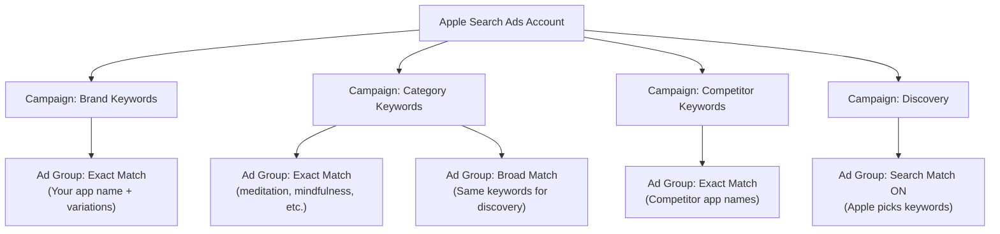

# Apple Search Ads Overview

Welcome to Apple Search Ads — the **only** advertising platform that lets you promote your app directly inside the App Store. When someone searches for "fitness tracker" or "budget app" on the App Store, your ad can appear right at the top of the results. That is incredibly powerful, because these people are already looking for an app to download.

Think about it this way: if someone is searching the App Store, they **already have their phone in hand and are ready to install something**. You are not interrupting them while they scroll social media. You are showing up exactly when they want what you offer. That is why Apple Search Ads has some of the highest conversion rates in all of digital advertising.

<Tip>
**Why this matters for beginners**: Most ad platforms (like Meta or Google) show ads to people who are doing something else — watching videos, reading news, scrolling social feeds. Apple Search Ads is different. You are reaching people at the exact moment they are searching for an app. This "high intent" is why conversion rates are so impressive.
</Tip>

---

## What Is Apple Search Ads?

Apple Search Ads is Apple's own advertising platform. You can find it at [searchads.apple.com](https://searchads.apple.com). It allows app developers and marketers to bid on keywords so their app appears at the top of App Store search results.

Here is what makes it unique:

1. **It lives inside the App Store** — Your ad looks like a regular search result, just with a blue "Ad" badge
2. **It is run by Apple** — The same company that controls the App Store also runs the ads
3. **It uses a second-price auction** — You bid on keywords, but you only pay what is needed to beat the next-highest bidder (plus $0.01)
4. **It works on iPhone, iPad, and Mac App Store** — Wherever people search for apps

### Where Do Apple Search Ads Appear?

Apple Search Ads can show your app in several placements across the App Store:

| Placement | Description | Available In |
|---|---|---|
| **Search Results** | Top of search results when someone searches a keyword | Basic & Advanced |
| **Search Tab** | The "Suggested" area users see before they even type a search | Advanced only |
| **Today Tab** | The curated editorial page users see when they open the App Store | Advanced only |
| **Product Pages** | "You Might Also Like" section on other apps' pages | Advanced only |

<Tip>
**For beginners**: If you are just starting out, focus on **Search Results** ads. This is the most straightforward placement — someone searches a keyword, your app shows up. The other placements (Search Tab, Today Tab, Product Pages) are great for brand awareness but are more advanced.
</Tip>

---

## Two Tiers: Basic vs. Advanced

Apple Search Ads comes in two versions. Think of them as the "easy mode" and the "full control mode."

### Apple Search Ads Basic

**Basic** is designed for people who want simplicity. You set a few things, and Apple handles the rest.

- **Monthly budget cap**: **$5,000 per app per month** — you cannot spend more than this
- **How it works**: You pick your app, set a maximum cost-per-install (CPI) you are willing to pay, choose the countries where you want to advertise, and Apple does everything else
- **Keyword selection**: Apple automatically chooses keywords for you based on your app's metadata
- **Audience targeting**: Apple automatically decides who sees your ads
- **Reporting**: Simple dashboard showing installs and spend

**Who should use Basic?**
- Solo developers or very small teams
- Anyone who wants to try Apple Search Ads without learning a complex system
- Apps with a marketing budget under $5,000/month

<Tip>
**Pro Tip**: Basic is genuinely good for beginners. You do not need to feel bad about starting here. Many successful indie developers use Basic exclusively because it saves time and still delivers great results. You can always upgrade to Advanced later.
</Tip>

### Apple Search Ads Advanced

**Advanced** gives you full control over everything.

- **No monthly budget cap** — spend as much as you want
- **Keyword-level bidding** — you choose exactly which keywords to bid on and how much to bid for each one
- **Audience refinement** — target by age, gender, location, device type, and even whether someone has downloaded your app before
- **Multiple ad groups** — organize your campaigns into groups with different keywords and bids
- **Creative Sets** — test different screenshots and preview videos to see which performs best
- **Full API access** — automate campaign management with code

**Who should use Advanced?**
- Growth teams at app companies
- Anyone spending more than $5,000/month
- Marketers who want granular control over keywords and bids
- Developers who want to automate campaign management via API

### Side-by-Side Comparison

| Feature | Basic | Advanced |
|---|---|---|
| Monthly budget cap | $5,000 per app | No cap |
| Keyword selection | Automatic (Apple chooses) | Manual (you choose) |
| Bidding | Set max CPI | Set max CPT per keyword |
| Audience targeting | Automatic | Manual (age, gender, device, etc.) |
| Ad placements | Search Results only | All four placements |
| Creative testing | Not available | Custom Creative Sets |
| API access | Not available | Full API access |
| Reporting depth | Basic metrics | Detailed keyword-level analytics |
| Difficulty level | Very easy | Moderate to advanced |

---

## How the Auction Works

When someone searches the App Store, an auction happens behind the scenes in milliseconds. Here is how it works:

<Steps>
  <Step title="User searches a keyword">
    Someone opens the App Store and types "meditation app" in the search bar.
  </Step>
  <Step title="Apple finds all eligible ads">
    Apple looks at all advertisers who are bidding on the keyword "meditation app" (or related keywords). It checks which ads are eligible based on budget, targeting settings, and relevance.
  </Step>
  <Step title="Relevance plays a huge role">
    Apple does not just pick the highest bidder. Your app must be **relevant** to the search query. If your app is a calculator and you bid on "meditation app," Apple will not show your ad regardless of how much you bid. Relevance is determined by your app's title, subtitle, keywords, description, and category.
  </Step>
  <Step title="Second-price auction determines the winner">
    The winner pays the **second-highest bid plus $0.01**, not their actual bid. So if you bid $3.00 and the next-highest bidder bid $2.00, you win but only pay $2.01. This means you should bid what the keyword is truly worth to you — you will never overpay.
  </Step>
  <Step title="Ad is displayed">
    The winning ad appears at the top of the search results with a small blue "Ad" badge. It looks almost identical to an organic search result.
  </Step>
</Steps>

<Tip>
**Why the second-price auction is great for beginners**: You do not need to stress about bidding too high. The system automatically ensures you pay only slightly more than the competition. Just bid what a new user is actually worth to you, and the auction handles the rest.
</Tip>

---

## Cost Benchmarks: What Should You Expect to Pay?

Here are typical cost benchmarks for Apple Search Ads (2024 data):

| Metric | Average | Range | Notes |
|---|---|---|---|
| **Cost Per Tap (CPT)** | ~$2.50 | $0.50 - $10+ | Varies hugely by category |
| **Conversion Rate (Tap to Install)** | ~50% | 30% - 70% | Very high because of high user intent |
| **Cost Per Install (CPI)** | ~$2.00 - $5.00 | $1.00 - $20+ | Depends on category and competition |

### Why Categories Matter So Much

The cost of Apple Search Ads varies enormously depending on your app category:

| Category | Typical CPT | Why |
|---|---|---|
| Finance / Banking | $5.00 - $15.00+ | Extremely high LTV users |
| Insurance | $8.00 - $20.00+ | Very high value per customer |
| Games (Casual) | $0.50 - $2.00 | Lots of inventory, lower LTV |
| Utilities | $1.00 - $3.00 | Moderate competition |
| Health & Fitness | $2.00 - $5.00 | Growing category, competitive |
| Shopping / E-commerce | $2.00 - $6.00 | High purchase intent |
| Education | $1.00 - $3.00 | Moderate competition |

<Tip>
**Pro Tip**: Do not be scared by high CPT numbers. What matters is **Cost Per Install (CPI)** and ultimately **return on ad spend (ROAS)**. A $10 CPT with a 50% conversion rate means a $20 CPI. If that user generates $100 in lifetime revenue, that is a 5x return — excellent! Always think about the complete picture, not just the cost of a single tap.
</Tip>

### Why Is the Conversion Rate So High?

Apple Search Ads has a conversion rate of approximately **50%** — meaning half of the people who tap your ad actually install your app. Compare that to other platforms:

| Platform | Typical Conversion Rate | Why |
|---|---|---|
| **Apple Search Ads** | ~50% | User is actively searching for an app |
| **Google Search Ads** | 2-5% | User is searching but may not want an app |
| **Meta (Facebook/Instagram)** | 1-3% | User is scrolling social media, not searching |
| **TikTok Ads** | 0.5-2% | User is watching videos for entertainment |

The reason Apple Search Ads converts so much better is simple: **intent**. When someone searches the App Store, they already want to download an app. Your ad just needs to convince them that *your* app is the right one.

---

## Match Types: How Keywords Work

When you use Apple Search Ads Advanced, you need to understand **match types**. These control how broadly or narrowly your keywords trigger your ad.

### Exact Match

Your ad shows **only** when someone searches for that exact keyword (or very close variants like plural forms).

- Keyword: `meditation app`
- Triggers: "meditation app", "meditation apps"
- Does NOT trigger: "best meditation app", "free meditation", "mindfulness app"

**When to use**: When you know exactly which searches you want to appear in and want maximum control.

### Broad Match

Your ad shows for the keyword you chose **and** related keywords that Apple thinks are relevant.

- Keyword: `meditation app`
- Triggers: "meditation app", "mindfulness app", "calm app", "relaxation app", "guided meditation", "sleep meditation"

**When to use**: When you want to discover new keywords and reach a wider audience. Great for finding search terms you had not thought of.

### Search Match

This is an **automatic** setting (not a keyword you add). When enabled, Apple automatically matches your ad to relevant search terms based on your app's metadata.

- You do not choose any keywords
- Apple reads your app title, subtitle, description, and keyword field
- Apple decides which searches are relevant and shows your ad

**When to use**: Great for discovery. Turn it on in a separate ad group to find keywords you had not considered. Then move the best-performing ones into Exact Match campaigns for more control.

<Tip>
**Pro Tip for beginners**: Start with **Search Match** turned on in one ad group and **Broad Match** keywords in another. After 1-2 weeks, look at which search terms actually drove installs. Take the winners and add them as **Exact Match** keywords in a new, dedicated ad group. This is the classic "keyword discovery" workflow that the pros use.
</Tip>

---

## The Relationship Between ASO and Apple Search Ads

**ASO (App Store Optimization)** is the practice of optimizing your App Store listing to rank higher in organic (unpaid) search results. Apple Search Ads and ASO are deeply connected:

### How ASO Helps Your Ads

1. **Relevance scores improve** — Apple uses your app's metadata (title, subtitle, keywords) to determine ad relevance. Better ASO means better relevance scores, which means lower costs
2. **Conversion rates increase** — Your ad drives people to your App Store page. If that page has compelling screenshots, a clear description, and good ratings, more people will install. ASO makes your paid campaigns more effective
3. **Better keywords to bid on** — ASO research reveals which keywords users actually search for, which directly informs your ad campaign keyword strategy

### How Apple Search Ads Helps Your ASO

1. **Keyword validation** — Apple Search Ads shows you exactly which keywords drive installs. This is priceless data for ASO
2. **Search popularity data** — The Ads dashboard shows keyword search volume data you cannot get anywhere else
3. **Install velocity** — Paid installs contribute to your app's overall download momentum, which can indirectly help organic rankings

<Tip>
**Pro Tip**: Think of ASO and Apple Search Ads as two sides of the same coin. Investing in ASO (great screenshots, compelling description, strong ratings) makes your paid campaigns cheaper and more effective. And running paid campaigns generates data that makes your ASO better. They amplify each other.
</Tip>

---

## Campaign Structure: How to Organize

When you use Advanced, here is a recommended way to organize your campaigns:

### Why This Structure?

| Campaign | Purpose | Typical CPI | Priority |
|---|---|---|---|
| **Brand** | Capture people searching for your app name | Very low ($0.50-$1.00) | Highest — protect your brand |
| **Category** | Capture people searching for your app type | Medium ($2.00-$5.00) | High — core growth driver |
| **Competitor** | Capture people searching for rival apps | Higher ($3.00-$8.00) | Medium — conquest strategy |
| **Discovery** | Find new keywords you have not thought of | Varies | Medium — feeds other campaigns |

<Tip>
**Pro Tip**: Always run a **Brand campaign**. Even if your app ranks #1 organically for your own name, competitors can bid on your brand name and steal your users. A brand campaign defends against this and is usually very cheap.
</Tip>

---

## Key Facts to Remember

Here is a quick reference of the most important Apple Search Ads facts:

<CardGroup cols={2}>
  <Card title="Platform URL" icon="link">
    [searchads.apple.com](https://searchads.apple.com)
  </Card>
  <Card title="Two Tiers" icon="layer-group">
    **Basic** ($5,000/mo cap per app) and **Advanced** (no cap)
  </Card>
  <Card title="Auction Type" icon="gavel">
    Second-price auction (you pay $0.01 more than the second-highest bid)
  </Card>
  <Card title="Average CPT" icon="dollar-sign">
    ~$2.50 (2024), varies hugely by category
  </Card>
  <Card title="Conversion Rate" icon="chart-line">
    ~50% tap-to-install (very high due to user intent)
  </Card>
  <Card title="Match Types" icon="bullseye">
    Exact Match, Broad Match, Search Match
  </Card>
</CardGroup>

---

## What You Will Learn Next

Now that you understand what Apple Search Ads is and how it works at a high level, the next pages will walk you through:

1. **[Account Setup](/platforms/apple/account-setup)** — Step-by-step instructions to create your account, set up payment, and configure everything correctly
2. **[Your First Campaign](/platforms/apple/first-campaign)** — A complete walkthrough of creating and launching your first Apple Search Ads campaign

<Tip>
**Encouragement for beginners**: If all of this feels like a lot, do not worry. Apple Search Ads is one of the most beginner-friendly ad platforms out there. Basic mode is genuinely simple — you can have your first campaign running in under 15 minutes. Start there, learn from the data, and graduate to Advanced when you are ready.
</Tip>
