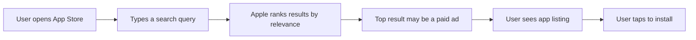
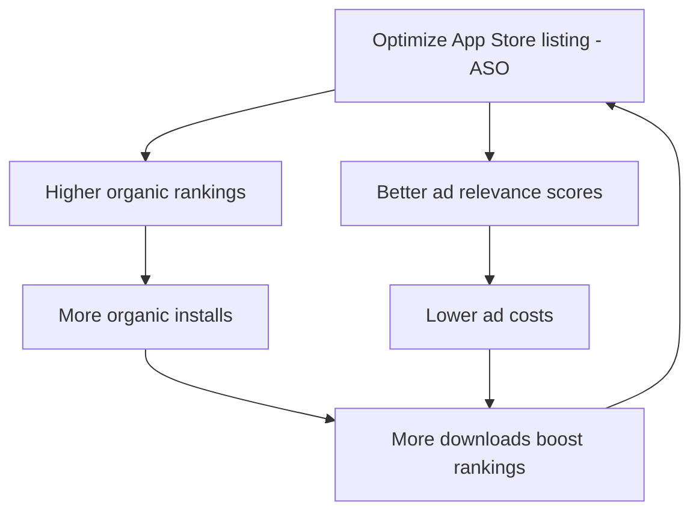

## The highest-intent ad platform that exists

Imagine someone walks into a store, goes to the search counter, and types exactly what they want. That is Apple Search Ads. Your ad appears at the exact moment someone is actively looking for an app like yours — in the App Store, ready to download.

No other ad platform comes close to this level of intent. On Meta or TikTok, you are interrupting someone who is scrolling through entertainment. On Apple Search Ads, you are answering someone who is already searching.

## How App Store search actually works

Before we talk about ads, you need to understand how people find apps:



About **70% of App Store visitors use search** to find apps. When someone searches "meditation app," Apple returns a ranked list based on:

- **App title and subtitle** — does it match the query?
- **Keywords field** — the hidden 100-character keyword field you set in App Store Connect
- **Ratings and reviews** — higher-rated apps rank better
- **Download velocity** — apps with more recent downloads get a boost
- **Engagement signals** — retention, usage, and crash rates

Apple Search Ads lets you **pay to appear at the very top of these search results**, above all the organic listings. Your ad looks almost identical to a regular search result — just with a small blue "Ad" badge.

## Why Apple Search Ads has the highest conversion rates

Let's compare what happens on different platforms:

| Platform | User mindset | Typical conversion rate |
|----------|-------------|----------------------|
| **Apple Search Ads** | "I want to download a meditation app right now" | **50-60%** |
| **Google Search Ads** | "I'm looking for information about meditation" | 3-5% |
| **Meta (Facebook/Instagram)** | "I'm scrolling through my feed" | 1-3% |
| **TikTok** | "I'm watching entertaining videos" | 1-2% |

The conversion rate difference is staggering. A 50%+ conversion rate means that **more than half the people who tap your ad will actually install your app**. This happens because:

1. **They are already in the App Store** — the only place where apps can be installed
2. **They are actively searching** — they have a specific need right now
3. **The install button is right there** — one tap and they have your app
4. **No redirect needed** — unlike other platforms where users must leave the app, navigate to the store, then install

<Note>
  **What is a "conversion rate"?** In this context, it means the percentage of people who see or tap your ad and then install your app. A 50% conversion rate means 50 out of every 100 people who tap your ad will install it.
</Note>

## Ad placements — where your ads can appear

Apple Search Ads offers four different placements. Each reaches users at a different point in their App Store journey.

<CardGroup cols={2}>
  <Card title="Search Results (Most Important)" icon="magnifying-glass">
    Your ad appears at the top of search results when someone searches a relevant keyword. This is the primary placement and where you should start. It captures the highest intent.
  </Card>
  <Card title="Search Tab" icon="rectangle-list">
    Your ad appears on the Search tab before the user types anything — in the "Suggested" section. Good for brand awareness and reaching users who are browsing but haven't searched yet.
  </Card>
  <Card title="Today Tab" icon="newspaper">
    Your ad appears on the App Store's front page (the Today tab). This is a premium, high-visibility placement focused on brand awareness rather than direct response.
  </Card>
  <Card title="Product Pages — You Might Also Like" icon="grid-2">
    Your ad appears at the bottom of other apps' product pages, in the "You Might Also Like" section. Good for reaching people who are browsing competitor or related apps.
  </Card>
</CardGroup>

<Tip>
  **Start with Search Results ads only.** They have the highest intent, the best conversion rates, and are the easiest to measure. Add other placements later once you are profitable with search.
</Tip>

## Basic vs. Advanced — two completely different products

Apple offers two tiers of Search Ads, and they are almost like different products. Understanding the difference is critical.

### Search Ads Basic

Basic is the "set it and forget it" option. You tell Apple your app, your budget, and the maximum you will pay per install. Apple handles everything else — keywords, bidding, audience targeting, all of it.

**How it works behind the scenes:** Apple looks at your app's metadata (title, description, keywords), figures out which searches are relevant, and automatically bids on those searches for you. You never see which keywords Apple chose.

**The tradeoff:** You get simplicity, but you give up control. You cannot see which keywords triggered your ads, you cannot adjust bids on individual keywords, and you cannot target specific audiences.

### Search Ads Advanced

Advanced gives you full control over every aspect of your campaign. You choose the keywords, set individual bids, define audiences, and see detailed reporting on what is working.

**How it works:** You manually add keywords (or use Apple's suggestions), set a bid for each one, and Apple enters your ad into the auction whenever someone searches those terms. You get full reporting on impressions, taps, installs, and cost for every keyword.

**The tradeoff:** More work to set up and manage, but vastly more data and optimization potential.

### Side-by-side comparison

| Feature | Search Ads Basic | Search Ads Advanced |
|---------|-----------------|-------------------|
| **Setup time** | 5 minutes | 30-60 minutes |
| **Keyword control** | Apple chooses automatically | You choose every keyword |
| **Keyword visibility** | Cannot see which keywords are used | Full keyword-level reporting |
| **Match types** | Not available | Exact Match and Broad Match |
| **Negative keywords** | Not available | Full support |
| **Audience targeting** | None | Age, gender, location, device, customer type |
| **Bidding** | Set a max CPI (cost per install) | Set CPT (cost per tap) bids per keyword |
| **Creative Sets** | Not available | Create multiple ad variations |
| **Custom Product Pages** | Not available | Link different App Store pages to different ads |
| **Reporting** | Basic dashboard with installs and spend | Full keyword, audience, and creative analytics |
| **Campaign structure** | One campaign per app per country | Unlimited campaigns, ad groups, keywords |
| **API access** | Not available | Full API for automation |
| **Monthly budget cap** | $10,000 per app per month | No cap |
| **Best for** | Solo developers, testing the waters, small budgets | Scaling, detailed optimization, larger budgets |
| **Min. spend** | Any amount | Any amount |

<Tip>
  **Recommendation: Start with Basic if you are brand new to ads.** Run it for 2-4 weeks. If your CPI (cost per install) is acceptable, switch to Advanced so you can see exactly which keywords drive installs and optimize further. Many developers skip this and go straight to Advanced — that is fine too, but Basic is a great way to validate that Apple Search Ads works for your app before investing time in keyword research.
</Tip>

## How Apple's ad auction works

Every time someone searches in the App Store, Apple runs a real-time auction to decide which ad to show. Understanding this auction is key to getting good results.

### The second-price auction

Apple uses a **second-price auction**, which means:

<Steps>
  <Step title="User searches a keyword">
    Someone types "budget tracker" in the App Store.
  </Step>
  <Step title="Apple gathers all eligible ads">
    Apple looks at all advertisers who are bidding on "budget tracker" (or have it as a broad match).
  </Step>
  <Step title="Apple scores each ad">
    Each ad gets a score based on two factors: **your bid amount** and **your app's relevance** to the search term.
  </Step>
  <Step title="The highest-scoring ad wins">
    The ad with the best combination of bid and relevance wins the top spot.
  </Step>
  <Step title="The winner pays just enough to beat second place">
    You do NOT pay your maximum bid. You pay **one cent more than what the second-highest bidder would have needed to beat you**. This is the "second-price" part.
  </Step>
</Steps>

**Why this matters:** You should not be afraid to set higher bids. If no one else is bidding on your keyword, you might bid $2.00 but only pay $0.15. The second-price system protects you from overpaying.

### Relevance is a multiplier

Apple does not just pick the highest bidder. Your app must be **relevant** to the search term. This means:

- Your app's metadata (title, subtitle, keyword field) should match the terms you bid on
- Your app should be in a relevant category
- Your app should have decent ratings and reviews
- Apple may reject your bid entirely if your app is not relevant to the keyword

<Warning>
  **You cannot bid your way to irrelevant searches.** If you make a fitness app and bid on "photo editor," Apple will not show your ad — no matter how high you bid. This is actually good: it keeps the platform useful for users and fair for advertisers.
</Warning>

## Cost benchmarks

How much does Apple Search Ads actually cost? Here are realistic benchmarks based on industry data:

### Overall averages

| Metric | What it means | Average range |
|--------|--------------|--------------|
| **CPT (Cost Per Tap)** | What you pay each time someone taps your ad | $0.50 - $2.00 |
| **CPI (Cost Per Install)** | What you pay each time someone installs after tapping | $1.00 - $4.00 |
| **TTR (Tap-Through Rate)** | Percentage of people who see your ad and tap it | 5 - 15% |
| **CR (Conversion Rate)** | Percentage of tappers who install | 40 - 65% |

### Cost by category

| App category | Avg CPT | Avg CPI | Notes |
|-------------|---------|---------|-------|
| **Games** | $0.60 - $1.50 | $1.50 - $4.00 | Very competitive, high volume |
| **Health & Fitness** | $0.80 - $2.50 | $2.00 - $5.00 | Growing competition |
| **Finance** | $1.50 - $5.00 | $3.00 - $10.00 | Most expensive category |
| **Education** | $0.50 - $1.50 | $1.00 - $3.00 | Moderate competition |
| **Productivity** | $0.70 - $2.00 | $1.50 - $4.00 | Steady competition |
| **Social** | $0.50 - $1.50 | $1.00 - $3.50 | Variable |
| **Utilities** | $0.40 - $1.00 | $0.80 - $2.50 | Lower competition |
| **Shopping** | $1.00 - $3.00 | $2.00 - $6.00 | High competition during holidays |

<Note>
  These costs vary significantly by country. The US is the most expensive market. Countries like India, Brazil, and Southeast Asian markets can be 50-80% cheaper. If your app works globally, consider testing cheaper markets first to learn the platform.
</Note>

### Cost by keyword type

| Keyword type | Example | Typical CPI | Why |
|-------------|---------|------------|-----|
| **Brand (your app name)** | "MyApp" | $0.30 - $1.00 | Very cheap because your app is highly relevant |
| **Category (generic)** | "meditation app" | $1.00 - $4.00 | Moderate competition, good intent |
| **Competitor (rival names)** | "Headspace" | $2.00 - $8.00 | Expensive because your relevance is lower |

## Discovery campaigns vs. brand campaigns

When you set up Apple Search Ads Advanced, you will hear about two core strategies. Understanding these is fundamental.

### Brand campaigns — defend your name

A brand campaign bids on **your own app name** and close variations. Why would you pay for searches where people are already looking for you?

Because **your competitors will bid on your name.** If someone searches "YourApp" and a competitor's ad appears at the top, they might install the competitor instead. Brand campaigns are cheap (because your app is maximally relevant to your own name) and critical for protecting your traffic.

### Discovery campaigns — find new keywords

A discovery campaign uses **Search Match** (Apple's automatic keyword matching) or **Broad Match** keywords to find search terms you did not think of. The goal is exploration.

You run a discovery campaign, let it find converting search terms, then "graduate" those terms into dedicated ad groups with exact match targeting and optimized bids.

### Category campaigns — capture intent

Category campaigns bid on **generic keywords** that describe what your app does: "meditation app," "budget tracker," "workout planner." These are the bread and butter of Apple Search Ads — they capture users who know what they want but have not chosen an app yet.

### Competitor campaigns — steal market share

Competitor campaigns bid on **rival app names.** When someone searches "Headspace," your meditation app can appear at the top. These are more expensive (your relevance to a competitor's name is lower), but they can be effective if your app offers a compelling alternative.

## ASO and Search Ads — the relationship you must understand

**ASO (App Store Optimization)** is the practice of optimizing your App Store listing to rank higher in organic search results. Here is why it matters for Search Ads:

### Your App Store page IS your ad creative

Unlike every other ad platform, **you cannot upload custom ad images or videos to Apple Search Ads.** Your ad is automatically generated from your App Store listing:

- **App icon** — the thumbnail in the ad
- **App name** — the headline
- **Subtitle** — the secondary text
- **First 3 screenshots** — displayed in the expanded ad
- **Star rating** — shown next to the name

This means improving your App Store page improves your ad performance automatically.

### ASO keywords feed your Search Ads strategy

The keywords you target in ASO (your keyword field, title, subtitle) directly affect which search terms Apple considers you "relevant" for. A strong ASO foundation means:

- Lower CPT bids needed (higher relevance = lower cost)
- Higher conversion rates (better listing = more installs)
- More keywords available to bid on

### The flywheel effect



<Tip>
  **Do ASO before running Search Ads.** Spend a few hours optimizing your app title, subtitle, keyword field, screenshots, and description. This single effort improves both your organic visibility AND your paid ad performance. It is the highest-leverage thing you can do.
</Tip>

## The complete campaign structure

Here is how a well-organized Apple Search Ads Advanced account looks:

```
Account
└── Campaign Group (optional organizational layer)
    ├── Campaign: US - Brand Defense
    │   └── Ad Group: Brand - Exact Match
    │       Keywords: [your app name], [misspellings], [abbreviations]
    │       Bid: $1.50 (bid high, you'll pay low)
    │
    ├── Campaign: US - Category
    │   ├── Ad Group: Category - Exact Match
    │   │   Keywords: [meditation app], [mindfulness app], [calm app]
    │   │   Bid: $1.00
    │   └── Ad Group: Category - Broad Match
    │       Keywords: meditation, mindfulness, calm
    │       Bid: $0.75
    │
    ├── Campaign: US - Competitors
    │   └── Ad Group: Competitor Names - Exact Match
    │       Keywords: [Headspace], [Calm], [Insight Timer]
    │       Bid: $0.80
    │
    └── Campaign: US - Discovery
        └── Ad Group: Search Match ON
            Keywords: none (Search Match handles it)
            Bid: $0.50
            Negative keywords: all terms from other campaigns
```

<Note>
  **Why separate campaigns instead of just ad groups?** Each campaign has its own daily budget cap. By separating brand, category, competitor, and discovery into different campaigns, you ensure each strategy gets its own budget and does not cannibalize the others.
</Note>

## Requirements to get started

Before you start, you need:

| Requirement | Details |
|------------|---------|
| **A live iOS app** | Your app must be published and available in the App Store |
| **An Apple ID** | Ideally the same one that manages the app in App Store Connect |
| **A credit or debit card** | For payment; Apple charges based on actual spend |
| **Optimized App Store listing** | Since your listing IS your ad, make it compelling |
| **Apple Developer account** | Required to have an app in the store ($99/year) |

**Nice to have but not required:**
- App rating of 4.0+ stars
- At least 10-20 ratings/reviews
- Multiple screenshot sets for different device sizes
- Custom product pages (for Advanced Creative Sets)

## Typical performance timeline

| Phase | Timeframe | What to expect |
|-------|-----------|---------------|
| **Setup** | Day 1 | Account created, first campaign launched |
| **Learning** | Days 1-3 | Low volume as Apple calibrates who to show your ads to |
| **Early data** | Days 4-7 | First meaningful data. You can see which keywords get taps and installs |
| **Initial optimization** | Week 2 | Pause underperforming keywords, increase bids on winners |
| **Steady state** | Weeks 3-4 | Performance stabilizes. You know your baseline CPI |
| **Scaling** | Month 2+ | Expand keywords, test new countries, add budget to winners |

## The path through this section

<Steps>
  <Step title="Set up your account">
    Create your Apple Search Ads account, configure billing, and prepare your App Store listing.
  </Step>
  <Step title="Launch your first campaign">
    Follow our screen-by-screen guide to go live with both Basic and Advanced campaigns.
  </Step>
</Steps>

<Card
  title="Apple Search Ads Account Setup"
  icon="arrow-right"
  href="/platforms/apple/account-setup"
>
  Let's get your Apple Search Ads account ready — step by step.
</Card>
