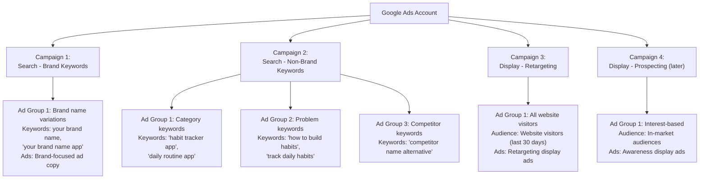

## What You Will Set Up in This Guide

Before you can run any Google Ads, you need to create and properly configure your account. Google tries to make this easy by defaulting to a simplified "Smart Mode," but we are going to set up a proper "Expert Mode" account that gives you full control.

Here is what we will do together:

1. **Create a Google Ads account** at ads.google.com
2. **Switch to Expert Mode** (critical — do not skip this)
3. **Configure your billing and payment method**
4. **Set up your account structure**
5. **Link Google Analytics** (recommended)
6. **Configure your conversion tracking** (preview — detailed in next guide)

Let us get started, one click at a time.

<Tip>
You need a Google account (Gmail) to create a Google Ads account. If you already have a Gmail address, you are ready to go. If not, create one at [accounts.google.com](https://accounts.google.com) before continuing. Use a business email if possible — the same Google account can manage multiple Google Ads accounts later.
</Tip>

---

## Step 1: Go to Google Ads

1. Open your web browser
2. Go to **[ads.google.com](https://ads.google.com)**
3. If you are already signed into your Google account, you will see a "Get started" or "Start now" button
4. If you are not signed in, click **Sign in** and enter your Google account email and password
5. Click the **"Start now"** or **"Get started"** button

---

## Step 2: CRITICAL — Escape Smart Mode

This is the most important step in the entire setup. When you first visit Google Ads, Google will try to get you to create a campaign immediately using "Smart Mode." Smart Mode is a stripped-down version of Google Ads with very limited controls. You do NOT want this.

### How to Switch to Expert Mode:

6. After clicking "Get started," Google will ask you to create your first campaign right away
7. Look for a link that says **"Switch to Expert Mode"** — it is usually a small text link, not a big button. Google does not make it obvious because they want you to stay in Smart Mode
8. Click **"Switch to Expert Mode"**
9. If you do not see "Switch to Expert Mode" on the first screen, look for it on subsequent screens. It might say "Are you a professional marketer?" or similar

### Why Expert Mode Matters:

| Feature | Smart Mode | Expert Mode |
|---|---|---|
| Campaign types available | 1-2 | All 7+ types |
| Keyword control | Almost none | Full control |
| Bidding strategies | Limited | All strategies |
| Ad extensions | Limited | All extensions |
| Audience targeting | Basic | Advanced |
| Negative keywords | Not available | Available |
| Ad scheduling | Not available | Available |
| Reporting detail | Minimal | Comprehensive |

<Tip>
If you accidentally set up your account in Smart Mode, do not worry. You can switch to Expert Mode later by clicking the **wrench icon** (Tools) in Google Ads and looking for **"Switch to Expert Mode."** But it is much easier to start in Expert Mode from the beginning, so look carefully for that link during setup.
</Tip>

---

## Step 3: Skip the Initial Campaign Creation

After switching to Expert Mode, Google may still try to get you to create a campaign immediately. We are going to skip this for now because we want to set up the account properly first.

10. If Google asks you to choose a campaign goal, look for an option that says **"Create an account without a campaign"** — this is usually a small link at the bottom of the page
11. Click **"Create an account without a campaign"**
12. Google will ask you to confirm your business information:
    - **Country:** Select your country
    - **Time zone:** Choose the time zone of your primary audience (this affects when your daily budget resets, and it cannot be changed later)
    - **Currency:** Choose your billing currency (this also cannot be changed later)
13. Click **Submit** or **Continue**

---

## Step 4: Configure Your Billing

Before you can run any ads, you need to set up billing.

### How to Access Billing Settings:

14. Once you are inside the Google Ads dashboard, click the **wrench icon** (Tools and Settings) in the top navigation bar
15. Under **Billing**, click **Billing Summary** or **Settings**
16. Click **Payment methods**

### Adding a Payment Method:

17. Click **Add payment method**
18. Choose your payment type:
    - **Credit or debit card** (Visa, Mastercard, American Express, Discover) — Most common
    - **Bank account** — Available in some countries
    - **PayPal** — Available in certain countries
19. Enter your payment information:
    - Card number
    - Expiration date
    - CVV
    - Billing name and address
20. Click **Submit**

### Understanding Google Ads Billing:

- **Automatic payments:** Google charges you AFTER you accumulate ad spend. You get charged when you hit your billing threshold or on your monthly billing date
- **Manual payments:** You prepay for ads. Available in some countries but not all
- **Billing threshold:** Starts at a low amount (often $50) and increases as your account builds payment history
- **Monthly billing date:** If you do not reach your threshold, you are billed on this date

<Tip>
Google will never spend more than your **daily budget x 30.4** (the average days in a month) in a calendar month. On any given day, Google may spend up to 2x your daily budget if it sees good opportunities, but it will compensate by spending less on other days. Over the month, you will not exceed your monthly limit.
</Tip>

---

## Step 5: Explore the Google Ads Dashboard

Now that your account is set up, let us get familiar with the interface.

### The Main Navigation:

21. **Overview page** — A dashboard showing your account performance at a glance (it will be empty since you have not run any ads yet)
22. **Campaigns** — Where you create, view, and manage your campaigns
23. **Ad groups** — Where you manage ad groups within campaigns
24. **Ads & assets** — Where you manage your ad text, images, and extensions
25. **Keywords** — Where you manage your search keywords
26. **Audiences** — Where you manage audience targeting
27. **Tools and Settings (wrench icon)** — Where you access advanced tools:
    - **Keyword Planner** — For keyword research
    - **Conversion tracking** — For setting up conversion measurement
    - **Audience Manager** — For creating and managing audiences
    - **Billing** — For payment and invoice management

### Customizing Your View:

28. Click on **Campaigns** in the left sidebar
29. You will see a table (empty for now) with columns for metrics
30. Click the **Columns** icon to customize which metrics you see
31. We recommend adding these columns:
    - Clicks
    - Impressions
    - CTR (click-through rate)
    - Average CPC (cost per click)
    - Cost
    - Conversions
    - Cost per conversion
    - Conversion rate

---

## Step 6: Set Up Google Ads Conversion Tracking (Preview)

Conversion tracking is essential for measuring what happens after someone clicks your ad. We will cover this in detail in the Conversion Tracking guide, but here is a quick overview of what you will set up:

### What Is a Conversion?

A conversion is any valuable action you want people to take after clicking your ad:
- Making a purchase
- Signing up for a free trial
- Filling out a contact form
- Downloading your app
- Calling your business

### How Google Tracks Conversions:

Google uses **Google Tag (gtag.js)** — a small piece of JavaScript code you place on your website (similar to Meta Pixel). When someone clicks your ad and then completes a conversion on your website, the Google Tag records it and reports it back to Google Ads.

### Quick Setup (We Will Cover This in Detail Later):

32. Click the **wrench icon** → **Measurement** → **Conversions**
33. Click **+ New conversion action**
34. Choose the type:
    - **Website** — Track actions on your website
    - **App** — Track actions in your mobile app
    - **Phone calls** — Track calls from your ads
    - **Import** — Import conversions from other sources

We will walk through the complete setup in the Conversion Tracking guide.

<Tip>
Do NOT skip conversion tracking. Without it, Google Ads is essentially guessing who to show your ads to. With proper conversion tracking, Google's algorithm can identify which clicks lead to actual business results and automatically optimize to find more people like your converters. It is the difference between throwing darts blindfolded and using a laser-guided targeting system.
</Tip>

---

## Step 7: Link Google Analytics (Recommended)

Linking Google Analytics to Google Ads gives you deeper insights into what people do on your website after clicking your ads.

### Why Link Google Analytics:

- See user behavior after the click (pages visited, time on site, bounce rate)
- Import Google Analytics goals and audiences into Google Ads
- Get a more complete picture of your customer journey
- Identify which landing pages convert best

### How to Link Google Analytics:

35. Click the **wrench icon** → **Setup** → **Linked accounts**
36. Find **Google Analytics (GA4)** and click **Details**
37. You will see a list of Google Analytics properties you have access to
38. Click **Link** next to the property you want to connect
39. Review the settings and click **Link**

### If You Do Not Have Google Analytics Yet:

40. Go to **[analytics.google.com](https://analytics.google.com)**
41. Sign in with the same Google account you used for Google Ads
42. Click **Start measuring**
43. Follow the setup wizard:
    - Enter your **account name** (your business name)
    - Enter your **property name** (your website name)
    - Configure your data settings
44. Google Analytics will give you a **Measurement ID** (starts with "G-")
45. Add the Google Analytics code to your website (similar to how you added Meta Pixel)
46. Return to Google Ads and link the accounts using the steps above

---

## Step 8: Set Up Your Account Structure

A well-organized account structure makes optimization much easier down the road. Here is the recommended structure for beginners:

### Recommended Campaign Structure:



### Why Separate Campaigns:

- **Brand vs. Non-Brand Search** should be in separate campaigns because:
  - Brand keywords have very different performance metrics (much higher CTR, much lower CPC)
  - Mixing them makes it impossible to see true performance for each type
  - Budget allocation is easier when separated

- **Search vs. Display** should be in separate campaigns because:
  - They serve different purposes (intent capture vs. awareness)
  - They have very different performance metrics
  - Budget allocation needs differ significantly

<Tip>
Do not create too many campaigns when starting out. Two to three campaigns is plenty. You can always add more later as you learn. Over-segmenting your account when you have a small budget spreads your data too thin and prevents Google from optimizing effectively. Start simple, add complexity as you grow.
</Tip>

---

## Step 9: Configure Account-Level Settings

Before creating any campaigns, configure these account-level settings:

### Auto-Applied Recommendations:

47. Click the **wrench icon** → **Setup** → **Auto-apply recommendations**
48. Google Ads will suggest automatically applying certain "recommendations" to your account
49. **For beginners, we recommend turning most of these OFF.** Google's recommendations often benefit Google's revenue more than your ROI
50. Keep these OFF especially:
    - "Add broad match keywords" — This can dramatically increase spending
    - "Increase your budgets" — Only you should decide budget changes
    - "Set target ROAS" — Wait until you have enough data
51. You can review recommendations manually in the **Recommendations** tab and apply ones that make sense

### Ad Suggestions:

52. Google may auto-create ad suggestions for you
53. We recommend turning this OFF initially so you maintain full control over your ad copy
54. You can find this setting in **wrench icon** → **Account settings** → **Ad suggestions**

---

## Step 10: Install the Google Ads Tag (Preview)

The Google Ads tag (also called Google Tag or gtag.js) needs to be installed on your website for conversion tracking to work. We will cover this fully in the Conversion Tracking guide, but here is what you need to know:

### The Google Tag Code:

```html
<!-- Google tag (gtag.js) -->
<script async src="https://www.googletagmanager.com/gtag/js?id=AW-XXXXXXXXX"></script>
<script>
  window.dataLayer = window.dataLayer || [];
  function gtag(){dataLayer.push(arguments);}
  gtag('js', new Date());
  gtag('config', 'AW-XXXXXXXXX');
</script>
```

Replace `AW-XXXXXXXXX` with your Google Ads conversion ID. We will get this ID in the Conversion Tracking guide.

55. This code goes in the `<head>` section of every page on your website (just like Meta Pixel)
56. If you are already using Google Tag Manager, you can add Google Ads tracking through GTM instead

---

## Troubleshooting Common Setup Issues

### "I am stuck in Smart Mode and cannot find Expert Mode"

**What to do:**
1. Click the **wrench icon** (if available) in the top navigation
2. Look for **"Switch to Expert Mode"** in the settings
3. If you cannot find it, try the direct URL: ads.google.com, then look for the settings gear
4. As a last resort, create a new account and look for the Expert Mode link during the initial setup

### "My account was suspended"

**What to do:**
1. Check your email for a message from Google explaining why
2. Common reasons: suspicious payment method, policy violations, or incomplete billing info
3. Go to [ads.google.com/nav/login](https://ads.google.com/nav/login) and look for appeal options
4. Fix the issue and submit an appeal
5. Google usually reviews appeals within 3-7 business days

### "I chose the wrong time zone or currency"

**Unfortunately:**
- Time zone and currency cannot be changed after account creation
- You will need to create a new Google Ads account with the correct settings
- This is why we emphasized choosing carefully during setup

### "My payment method was declined"

**What to do:**
1. Verify the card number, expiration, and CVV are correct
2. Make sure the billing address matches your bank records
3. Contact your bank — they may be blocking the charge
4. Try a different payment method
5. Check if your card issuer blocks international transactions (Google may charge from Ireland)

---

## Your Account Setup Checklist

- [ ] Google Ads account created at ads.google.com
- [ ] Expert Mode activated (NOT Smart Mode)
- [ ] Initial campaign creation skipped
- [ ] Correct time zone selected
- [ ] Correct currency selected
- [ ] Payment method added and verified
- [ ] Dashboard explored and custom columns configured
- [ ] Google Analytics linked (if available)
- [ ] Account structure planned (brand vs. non-brand, search vs. display)
- [ ] Auto-applied recommendations reviewed and mostly turned off
- [ ] Ad suggestions turned off

---

## Understanding Google Ads Policies

Before creating your first campaign, it helps to understand what Google allows and does not allow in ads. Knowing the rules upfront prevents frustrating ad rejections later.

### Common Reasons Ads Get Rejected:

- **Misleading claims:** Promising guaranteed results, using exaggerated language ("Best app in the world")
- **Trademark violations:** Using another company's trademarked name in your ad text without permission
- **Prohibited content:** Ads for products or services Google does not allow (counterfeit goods, dangerous products, etc.)
- **Destination mismatch:** Your ad talks about one thing but the landing page shows something different
- **Broken URLs:** Your landing page returns an error or does not load
- **Punctuation and symbols:** Excessive use of exclamation points, all caps, or special characters
- **Phone numbers in ad text:** Phone numbers should be added through call assets, not in the ad text itself

### Restricted Categories:

Some product categories have additional requirements:

- **Healthcare and medicines:** May require certification
- **Financial services:** Must comply with local regulations
- **Alcohol:** Restricted in many countries
- **Gambling:** Requires licensing and varies by country
- **Political advertising:** Requires verification in many countries

### What Happens When an Ad Is Rejected:

1. The ad will show a "Disapproved" status in Ads Manager
2. Google will tell you which policy was violated
3. You can edit the ad to fix the issue and resubmit
4. If you believe the rejection was a mistake, you can appeal
5. Appeals are usually reviewed within 1-3 business days

<Tip>
Before writing your ads, quickly scan the [Google Ads policies page](https://support.google.com/adspolicy/answer/6008942). It takes 10 minutes and saves you hours of frustration from unexpected rejections. The most common beginner mistakes are using all caps in headlines, making unsubstantiated claims, and having landing pages that do not match the ad content.
</Tip>

---

## What Comes Next

Your Google Ads account is now properly set up in Expert Mode with full access to all features and controls. You have your billing configured, your dashboard customized, and your account structure planned.

In the **Conversion Tracking** guide, we will install the Google Tag on your website and set up proper conversion tracking. This is the next essential step before creating your first campaign — without conversion tracking, Google cannot optimize your ads effectively.

<Tip>
Bookmark **[ads.google.com](https://ads.google.com)** right now. You will be visiting this URL frequently. Also bookmark the **Google Ads Help Center** at [support.google.com/google-ads](https://support.google.com/google-ads) — it is an excellent resource for answering specific questions as they come up.
</Tip>
