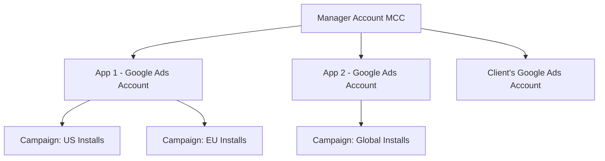
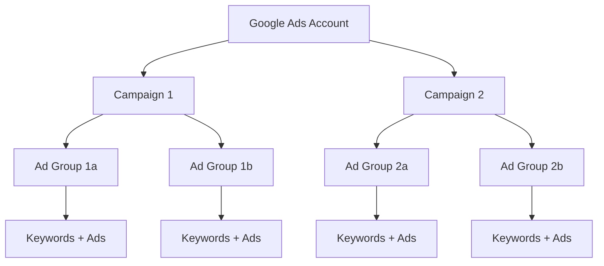

## Setting up for success

Google Ads has hundreds of settings, toggles, and options. Most of them can wait. This guide walks you through every setting that actually matters -- in order -- so you can get from zero to ready-to-advertise without any detours.

<Note>
  **This entire setup process takes about 45-60 minutes.** Don't rush it. Getting the foundation right means you won't have to redo things later (some settings, like timezone and currency, can never be changed).
</Note>

## Step 1: Create your Google Ads account

<Steps>
  <Step title="Go to ads.google.com">
    Visit [ads.google.com](https://ads.google.com) and click **Start Now**. Sign in with the Google account you want to manage your ads. This should be a business email, not your personal Gmail.

    <Tip>
      If you already have a Google account for your app's Google Play Console or Firebase, use that same account. It makes linking everything easier.
    </Tip>
  </Step>
  <Step title="CRITICAL: Escape Smart Mode">
    Google will immediately try to create your first campaign using "Smart Mode." This is Google's simplified, fully-automated ad experience. **Do NOT proceed with this.**

    Look for one of these options (the exact wording changes, but it's always near the bottom of the page):
    - "Switch to Expert Mode"
    - "Create an account without a campaign"
    - "Are you a professional marketer? Switch to Expert Mode"
    - A small link at the very bottom of the guided setup page

    Click whichever option you see to escape the guided setup.
  </Step>
  <Step title="Choose 'Create an account without a campaign'">
    After switching to Expert Mode, you may be asked to choose a campaign goal. Instead, look for **"Create an account without a campaign"** at the bottom. Click it. You'll set up campaigns later after everything is properly configured.
  </Step>
  <Step title="Configure your account settings">
    You'll now set three things that **cannot be changed later**:

    - **Billing country:** The country where your business is registered. This determines tax treatment and available payment methods.
    - **Time zone:** Choose the timezone of your primary market (where most of your users are). All reporting will use this timezone. If you're targeting the US, use US Eastern or Pacific.
    - **Currency:** The currency you'll pay in and see in all reports. Usually matches your billing country.

    <Warning>
      **Time zone and currency are permanent.** If you pick the wrong one, you'll need to create an entirely new account. Double-check before confirming.
    </Warning>
  </Step>
  <Step title="Submit and explore your account">
    Click **Submit** to create your account. You'll land on an empty Google Ads dashboard in Expert Mode. Take a moment to explore -- you'll see the main navigation:
    - **Campaigns** -- where you create and manage ad campaigns
    - **Ad groups** -- subgroups within campaigns
    - **Ads & assets** -- your actual ad creative
    - **Keywords** -- the search terms you're targeting (for Search campaigns)
    - **Tools & Settings** (wrench icon) -- account configuration, billing, conversions, linked accounts
  </Step>
</Steps>

<Warning>
  **Why Smart Mode is a trap for app developers:**
  - You can't see or control which keywords you're targeting
  - You can't set up proper conversion tracking
  - You can't structure campaigns and ad groups
  - Reporting is extremely limited
  - You can't use advanced bidding strategies
  - Switching from Smart to Expert later causes data gaps

  Always use Expert Mode from day one.
</Warning>

## Step 2: Understand Manager Accounts (MCC)

If you're managing ads for more than one app, or if you work at an agency, you should know about Manager Accounts.

### What is an MCC?

**MCC (My Client Center)** is a "parent" account that can manage multiple Google Ads accounts. Think of it like a folder that contains individual ad accounts.



### When you need an MCC

| Situation | Need MCC? |
|-----------|-----------|
| One app, one team | No -- a single account is fine |
| Multiple apps from the same company | Yes -- separate accounts per app, managed under one MCC |
| Agency managing client accounts | Yes -- essential for managing multiple clients |
| Want consolidated billing across accounts | Yes -- MCC enables shared billing |
| Want shared remarketing lists across apps | Yes -- MCC enables cross-account audience sharing |

### How to create an MCC

1. Go to [ads.google.com/home/tools/manager-accounts](https://ads.google.com/home/tools/manager-accounts)
2. Click **Create a manager account**
3. Set a name (your company name)
4. Choose the same timezone and currency as your child accounts
5. You can then create new accounts under it or link existing accounts

<Tip>
  **Even if you only have one app now, creating an MCC is a good habit.** It costs nothing and gives you flexibility to add more accounts later. You can also grant agency or contractor access at the MCC level without sharing individual account credentials.
</Tip>

## Step 3: Link your app

Google Ads needs to know about your app. The linking process is different for Android and iOS.

<Tabs>
  <Tab title="Android (Google Play)">
    ### Link Google Play to Google Ads

    <Steps>
      <Step title="Open Linked Accounts">
        In Google Ads, click the **Tools & Settings** icon (wrench) in the top menu. Under "Setup," click **Linked accounts**.
      </Step>
      <Step title="Find Google Play">
        Scroll to **Google Play** and click **Details**, then **Link**.
      </Step>
      <Step title="Authorize the connection">
        Sign in with the Google account that owns your Google Play Developer Console. If it's the same account you're using for Google Ads, you'll see your apps automatically.
      </Step>
      <Step title="Select your app">
        Choose the app you want to advertise from the list. Click **Link**.
      </Step>
      <Step title="Verify the link">
        Go back to **Linked accounts** > **Google Play** and confirm the status shows "Linked."
      </Step>
    </Steps>

    <Note>
      **The Google Play link gives Google Ads access to:**
      - Your app's listing information (icon, screenshots, description)
      - Install and in-app event data
      - Deep linking capabilities
      - The ability to run App Campaigns that show ads directly in the Play Store
    </Note>
  </Tab>
  <Tab title="iOS (App Store)">
    ### Set up iOS app tracking

    iOS apps require a different approach because Apple doesn't integrate directly with Google. You have two options:

    **Option A: Firebase (recommended)**
    1. Set up Firebase for your iOS app (covered in Step 4 below)
    2. Link Firebase to Google Ads
    3. Import Firebase events as conversions

    **Option B: Third-party app analytics**
    1. In Google Ads, go to **Tools & Settings** > **Linked accounts**
    2. Click **Third-party app analytics** > **Details**
    3. Click **+** to add a new link
    4. Select your third-party provider (Adjust, AppsFlyer, Branch, Kochava, etc.)
    5. Follow their specific linking instructions

    **Option C: Direct App Store ID entry**
    1. When creating an App Campaign, you can enter your App Store ID directly
    2. Google will pull your app listing information from the App Store
    3. You'll still need Firebase or a third-party for conversion tracking beyond installs

    <Tip>
      **For iOS apps, Firebase is the most straightforward free option.** If you're already using a Mobile Measurement Partner (MMP) like Adjust or AppsFlyer, use that instead -- they handle cross-platform attribution better than Firebase alone.
    </Tip>
  </Tab>
</Tabs>

## Step 4: Firebase setup

Firebase is Google's free app development platform, and it's the recommended way to track conversions from Google Ads. Even if you're not using other Firebase features, the Analytics SDK is worth installing.

### Create and configure a Firebase project

<Steps>
  <Step title="Create a Firebase project">
    Go to [console.firebase.google.com](https://console.firebase.google.com). Click **Create a project** (or select an existing one).

    - Enter your project name (usually your app name)
    - Accept the terms
    - **Enable Google Analytics** when prompted -- this is required for ad tracking
    - Select or create a Google Analytics account
    - Click **Create project**
  </Step>
  <Step title="Add your Android app">
    In the Firebase Console, click the **Android icon** to add an app.

    - **Android package name:** Your app's package name (e.g., `com.yourcompany.yourapp`). Must exactly match what's in your `build.gradle`.
    - **App nickname:** A friendly name (optional)
    - **Debug signing certificate SHA-1:** Optional for now, needed later for some features

    Click **Register app**.
  </Step>
  <Step title="Download the config file (Android)">
    Download `google-services.json` and place it in your app's `app/` directory:

    ```
    your-project/
    ├── app/
    │   ├── google-services.json  ← place it here
    │   ├── src/
    │   └── build.gradle
    └── build.gradle
    ```
  </Step>
  <Step title="Add your iOS app">
    Back in the Firebase Console, click **Add app** > **iOS**.

    - **Apple bundle ID:** Your app's bundle identifier (e.g., `com.yourcompany.yourapp`). Must match your Xcode project.
    - **App nickname:** Optional
    - **App Store ID:** Your numeric App Store ID (found in your App Store URL)

    Click **Register app**.
  </Step>
  <Step title="Download the config file (iOS)">
    Download `GoogleService-Info.plist` and add it to your Xcode project:

    1. Open your Xcode project
    2. Drag `GoogleService-Info.plist` into the root of your project navigator
    3. Make sure **"Copy items if needed"** is checked
    4. Make sure your app target is selected
  </Step>
  <Step title="Link Firebase to Google Ads">
    This is the critical step that connects your app data to your ad campaigns.

    **In Firebase Console:**
    1. Go to **Project Settings** (gear icon)
    2. Click the **Integrations** tab
    3. Find **Google Ads** and click **Link**
    4. Select your Google Ads account from the list
    5. Click **Link**

    **In Google Ads (verify the link):**
    1. Go to **Tools & Settings** > **Linked accounts**
    2. Find **Firebase** and click **Details**
    3. Confirm your Firebase project shows as "Linked"

    <Warning>
      **Both directions must be linked.** The link in Firebase AND the link in Google Ads must both be active. If either side is missing, conversion data won't flow properly.
    </Warning>
  </Step>
</Steps>

## Step 5: Set up billing

You can't run ads without a payment method. Google Ads charges you as you spend (no upfront payment required for most countries).

<Steps>
  <Step title="Navigate to Billing">
    Click **Tools & Settings** (wrench) > **Billing** > **Settings**.
  </Step>
  <Step title="Add a payment method">
    Click **Add payment method**. Options vary by country but typically include:
    - **Credit card** (Visa, Mastercard, Amex) -- most common
    - **Debit card** -- works in most countries
    - **Bank account (ACH)** -- available in the US and some other countries
    - **PayPal** -- available in some countries

    Enter your payment details and billing address.
  </Step>
  <Step title="Understand how billing works">
    Google Ads uses **automatic payments** in most countries:
    - You're charged when your spending reaches your **billing threshold** (starts at $50, increases over time)
    - OR at the end of the month, whichever comes first
    - The threshold increases automatically as you build payment history ($50 → $200 → $350 → $500)
  </Step>
  <Step title="Set up billing alerts">
    Go to **Tools & Settings** > **Billing** > **Settings** and set up email notifications:
    - Payment processed notifications
    - Budget overspend warnings
    - Payment method expiration reminders
  </Step>
</Steps>

### Budget safety tips

<CardGroup cols={2}>
  <Card title="Start small" icon="shield">
    Set your first campaign's daily budget to **$10-20**. You can always increase it later. There's no benefit to starting big before you understand what's working.
  </Card>
  <Card title="Set campaign budgets, not account budgets" icon="wallet">
    Unlike Meta, Google Ads doesn't have a global account spending limit. Your safety net is the **daily campaign budget** on each campaign. Set it conservatively.
  </Card>
  <Card title="Use shared budgets for flexibility" icon="share">
    Under **Tools & Settings** > **Shared Library** > **Shared Budgets**, you can create a single budget that's shared across multiple campaigns. Google allocates spending to whichever campaign is performing best.
  </Card>
  <Card title="Monitor weekly" icon="calendar">
    Review your **Billing summary** weekly during your first month. Make sure actual spending matches your expectations.
  </Card>
</CardGroup>

<Tip>
  **Monthly budget math:** Google may spend up to 2x your daily budget on a given day, but will never exceed your daily budget x 30.4 in a calendar month. If your daily budget is $20, your maximum monthly spend is $608. Google explains this as "making up for days with less traffic."
</Tip>

## Step 6: Account structure best practices

A well-organized account is easier to manage, report on, and optimize. Plan your structure before creating campaigns.

### The hierarchy



| Level | What it controls | Key decisions |
|-------|-----------------|---------------|
| **Account** | Billing, linked accounts, access | One account per app (or use MCC for multiple) |
| **Campaign** | Budget, bidding strategy, targeting (geo, device, schedule) | Separate campaigns by goal, geo, or campaign type |
| **Ad Group** | Keywords, audience segments, and which ads to show | Group tightly themed keywords together |
| **Ads** | The actual creative (text, images, videos) | 2-3 ads per ad group for testing |
| **Keywords** | (Search only) Which search terms trigger your ads | 10-20 closely related keywords per ad group |

### Recommended account structure for apps

```
Google Ads Account: [YourApp]
│
├── Campaign: UAC - US - Installs
│   (App Campaign, targeting US, optimizing for installs)
│
├── Campaign: UAC - EU - Installs
│   (App Campaign, targeting EU countries, optimizing for installs)
│
├── Campaign: Search - US - Brand Keywords
│   ├── Ad Group: Brand terms ("yourapp", "yourapp app")
│   └── Ad Group: Brand misspellings
│
├── Campaign: Search - US - Category Keywords
│   ├── Ad Group: Direct keywords ("habit tracker app")
│   ├── Ad Group: Problem keywords ("how to build habits")
│   └── Ad Group: Competitor keywords ("[competitor] alternative")
│
├── Campaign: Display - Global - Remarketing
│   └── Ad Group: Past website visitors
│
└── Campaign: YouTube - US - Awareness
    └── Ad Group: In-market audiences
```

### Naming conventions

Consistent naming saves you hours of confusion later. Use a structured format:

```
[Campaign Type] - [Geo] - [Targeting/Goal] - [Date]
```

**Examples:**
```
UAC - US - Installs - 2026-02
Search - US - Brand Keywords - 2026-02
Search - UK - Competitor Keywords - 2026-02
Display - Global - Remarketing - 2026-02
YouTube - US - Awareness - 2026-02
```

<Tip>
  **Include the date** in your campaign names. When you create new versions of campaigns (which you will), the date helps you know which is which. Some teams also add a version number: `Search - US - Brand v2 - 2026-03`.
</Tip>

## Step 7: Conversion tracking setup overview

Before you launch any campaign, you need conversion tracking. Without it, Google Ads is flying blind -- it can't optimize because it doesn't know what success looks like.

There are two types of conversions to set up:

### App conversions (Firebase)

1. In Google Ads, go to **Tools & Settings** > **Conversions**
2. Click **+ New conversion action**
3. Select **App**
4. Choose **Firebase**
5. Select the events you want to track as conversions (details in the next guide)

### Website conversions (Google Tag)

If you have a website or landing page:

1. In Google Ads, go to **Tools & Settings** > **Conversions**
2. Click **+ New conversion action**
3. Select **Website**
4. Follow the Google Tag setup (details in the next guide)

<Note>
  **The full conversion tracking setup is covered in the next guide.** This step is just to make you aware that it exists and that it must be done before launching campaigns. We'll walk through Firebase SDK installation, event configuration, and verification in detail.
</Note>

## Step 8: Team access and permissions

### Invite team members

<Steps>
  <Step title="Open Access settings">
    Click **Tools & Settings** (wrench) > **Access and Security**.
  </Step>
  <Step title="Add a new user">
    Click the **+** button to invite someone.
  </Step>
  <Step title="Enter their email">
    Enter the Google account email of the person you want to invite. They must have a Google account.
  </Step>
  <Step title="Choose the right access level">
    Select the appropriate permission level from the table below.
  </Step>
  <Step title="Send the invitation">
    Click **Send invitation**. The person will receive an email and must accept before they can access the account.
  </Step>
</Steps>

### Access levels explained

| Access Level | What they can do | What they can't do | Best for |
|-------------|-----------------|-------------------|----------|
| **Admin** | Everything: create campaigns, manage billing, invite/remove users, link accounts | Nothing is restricted | Account owner, CTO, lead marketer |
| **Standard** | Create and edit campaigns, manage keywords and ads, view all reports | Manage billing, invite/remove users, change account settings | Marketing team members, ad managers |
| **Read only** | View all campaigns, reports, and performance data | Make any changes | Stakeholders, executives, investors |
| **Billing** | View and manage payment methods, billing settings, invoices | View or edit campaigns or reports | Finance team, accountant |
| **Email only** | Receive email notifications and reports | Access the Google Ads interface at all | People who just need periodic updates |

<Warning>
  **Be careful with Admin access.** Anyone with Admin access can change billing, remove other users, or delete campaigns. Limit Admin to 1-2 trusted people. Use Standard access for day-to-day ad management.
</Warning>

### Security best practices

- **Enable 2-factor authentication** on all Google accounts with Ads access
- **Audit access quarterly** -- remove people who no longer need it
- **Use Standard access by default** -- only grant Admin when necessary
- **Never share your Google account credentials** -- always invite people with their own accounts
- If using an agency, grant them **Standard access** (not Admin) and set a clear end date

## Your complete setup checklist

Before moving to conversion tracking:

- [ ] Google Ads account created in **Expert Mode** (not Smart Mode)
- [ ] Time zone set to primary market timezone
- [ ] Currency set correctly
- [ ] MCC created (if managing multiple apps/accounts)
- [ ] Android app linked via Google Play (if applicable)
- [ ] iOS app added via Firebase (if applicable)
- [ ] Firebase project created with Google Analytics enabled
- [ ] Firebase linked to Google Ads (both directions)
- [ ] Payment method added
- [ ] Billing alerts configured
- [ ] Account structure planned with naming conventions
- [ ] Team members invited with appropriate access levels
- [ ] 2-factor authentication enabled

<Card
  title="Google Conversion Tracking"
  icon="arrow-right"
  href="/platforms/google/conversion-tracking"
>
  Account ready? Let's set up conversion tracking -- the foundation of all Google Ads optimization.
</Card>
