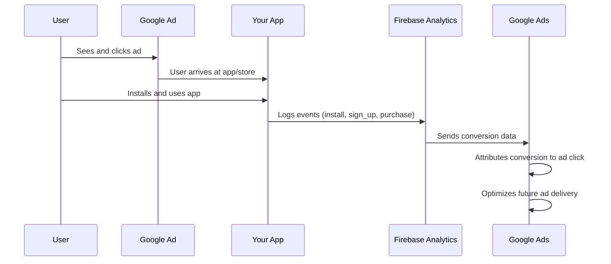
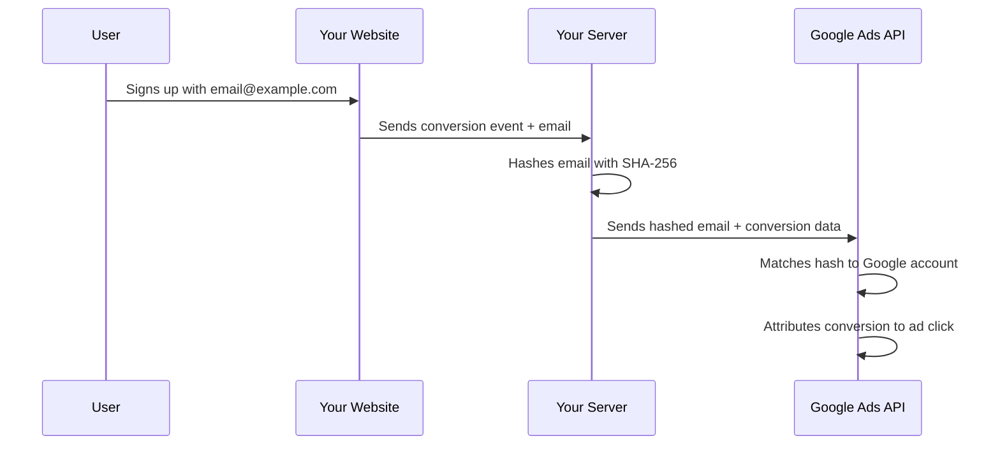

## Measure it or it didn't happen

Google's ad algorithm optimizes toward conversions -- but only if it can see them. Without proper conversion tracking, Google is flying blind, spending your money with no signal about what's working. This guide covers every tracking method in detail.

## How Google Ads conversion tracking works

Here's the flow at a high level:



## Tracking options comparison

| Method | Best for | Tracks | Complexity | Cost |
|--------|---------|--------|------------|------|
| **Firebase SDK** | Android & iOS apps | Installs, in-app events, revenue | Medium | Free |
| **Google Play integration** | Android only | Installs only (no in-app events) | Low | Free |
| **Third-party MMP** (Adjust, AppsFlyer, Branch) | Multi-platform attribution, large-scale apps | Everything + cross-platform | Medium-High | Paid ($$$) |
| **Google Tag (gtag.js)** | Websites and web apps | Page views, clicks, form submissions | Low | Free |
| **Google Tag Manager (GTM)** | Complex web tracking with many events | Everything on web | Medium | Free |
| **Server-side tagging** | Privacy-focused tracking, enhanced accuracy | Server events, offline conversions | High | Free (hosting costs) |

<Tip>
  **Decision guide:**
  - **Have a mobile app only?** Use Firebase SDK.
  - **Have a website that links to the app store?** Use Firebase SDK for the app + Google Tag for the website.
  - **Already using Adjust, AppsFlyer, or Branch?** Use your existing MMP. No need to add Firebase just for Google Ads.
  - **Building a web app (not native)?** Use Google Tag or Google Tag Manager.
</Tip>

## Firebase SDK installation

Firebase Analytics (also called Google Analytics for Firebase) is the recommended tracking solution for mobile apps. Here's how to install it on every major platform.

<Tabs>
  <Tab title="Android (Kotlin)">
    ### Step 1: Add Firebase to your project

    Add the Google services plugin to your **project-level** `build.gradle`:

    ```kotlin
    // build.gradle (project-level)
    plugins {
        id("com.google.gms.google-services") version "4.4.0" apply false
    }
    ```

    Apply the plugin in your **app-level** `build.gradle`:

    ```kotlin
    // app/build.gradle
    plugins {
        id("com.android.application")
        id("com.google.gms.google-services")
    }
    ```

    ### Step 2: Add Firebase Analytics dependency

    ```kotlin
    // app/build.gradle
    dependencies {
        // Firebase BOM (Bill of Materials) - manages all Firebase version numbers
        implementation(platform("com.google.firebase:firebase-bom:33.0.0"))

        // Firebase Analytics (no version number needed when using BOM)
        implementation("com.google.firebase:firebase-analytics")
    }
    ```

    ### Step 3: Place the config file

    Make sure `google-services.json` (downloaded from Firebase Console) is in your `app/` directory.

    ### Step 4: Initialize and log events

    Firebase Analytics initializes automatically. You can log custom events anywhere in your app:

    ```kotlin
    import com.google.firebase.analytics.FirebaseAnalytics
    import com.google.firebase.analytics.logEvent

    class MainActivity : AppCompatActivity() {

        private lateinit var firebaseAnalytics: FirebaseAnalytics

        override fun onCreate(savedInstanceState: Bundle?) {
            super.onCreate(savedInstanceState)
            firebaseAnalytics = FirebaseAnalytics.getInstance(this)
        }

        // Log a sign-up event
        fun onUserSignUp(method: String) {
            firebaseAnalytics.logEvent(FirebaseAnalytics.Event.SIGN_UP) {
                param(FirebaseAnalytics.Param.METHOD, method)
            }
        }

        // Log a purchase event with revenue
        fun onPurchase(itemId: String, price: Double, currency: String) {
            firebaseAnalytics.logEvent(FirebaseAnalytics.Event.PURCHASE) {
                param(FirebaseAnalytics.Param.ITEM_ID, itemId)
                param(FirebaseAnalytics.Param.VALUE, price)
                param(FirebaseAnalytics.Param.CURRENCY, currency)
            }
        }

        // Log a custom event
        fun onFeatureUsed(featureName: String) {
            firebaseAnalytics.logEvent("feature_used") {
                param("feature_name", featureName)
            }
        }
    }
    ```

    ### Step 5: Enable debug mode

    To see events in real-time in Firebase DebugView:

    ```bash
    # Enable debug mode on a connected Android device
    adb shell setprop debug.firebase.analytics.app com.yourcompany.yourapp

    # Disable debug mode when done
    adb shell setprop debug.firebase.analytics.app .none.
    ```
  </Tab>
  <Tab title="iOS (Swift)">
    ### Step 1: Add Firebase via Swift Package Manager

    1. In Xcode, go to **File** > **Add Package Dependencies**
    2. Enter the URL: `https://github.com/firebase/firebase-ios-sdk`
    3. Select version **11.0.0** or later
    4. Choose **FirebaseAnalytics** from the package products
    5. Click **Add Package**

    Alternatively, using CocoaPods:

    ```ruby
    # Podfile
    pod 'FirebaseAnalytics'
    ```

    Then run `pod install`.

    ### Step 2: Place the config file

    Make sure `GoogleService-Info.plist` (downloaded from Firebase Console) is added to your Xcode project root.

    ### Step 3: Initialize Firebase

    ```swift
    // AppDelegate.swift
    import UIKit
    import FirebaseCore

    @main
    class AppDelegate: UIResponder, UIApplicationDelegate {
        func application(
            _ application: UIApplication,
            didFinishLaunchingWithOptions launchOptions: [UIApplication.LaunchOptionsKey: Any]?
        ) -> Bool {
            FirebaseApp.configure()
            return true
        }
    }
    ```

    If using SwiftUI with no AppDelegate:

    ```swift
    // YourApp.swift
    import SwiftUI
    import FirebaseCore

    @main
    struct YourApp: App {
        init() {
            FirebaseApp.configure()
        }

        var body: some Scene {
            WindowGroup {
                ContentView()
            }
        }
    }
    ```

    ### Step 4: Log events

    ```swift
    import FirebaseAnalytics

    // Log a sign-up event
    func logSignUp(method: String) {
        Analytics.logEvent(AnalyticsEventSignUp, parameters: [
            AnalyticsParameterMethod: method
        ])
    }

    // Log a purchase event with revenue
    func logPurchase(itemId: String, price: Double, currency: String) {
        Analytics.logEvent(AnalyticsEventPurchase, parameters: [
            AnalyticsParameterItemID: itemId,
            AnalyticsParameterValue: price,
            AnalyticsParameterCurrency: currency
        ])
    }

    // Log a custom event
    func logFeatureUsed(featureName: String) {
        Analytics.logEvent("feature_used", parameters: [
            "feature_name": featureName
        ])
    }
    ```

    ### Step 5: Enable debug mode

    In Xcode, edit your scheme:
    1. **Product** > **Scheme** > **Edit Scheme**
    2. Select **Run** > **Arguments**
    3. Add `-FIRDebugEnabled` to **Arguments Passed On Launch**

    To disable: add `-FIRDebugDisabled` instead.
  </Tab>
  <Tab title="React Native">
    ### Step 1: Install React Native Firebase

    ```bash
    # Install the core module
    npm install @react-native-firebase/app

    # Install the analytics module
    npm install @react-native-firebase/analytics
    ```

    ### Step 2: Native configuration

    **Android:**
    Place `google-services.json` in `android/app/`.

    Add to `android/build.gradle`:
    ```groovy
    buildscript {
        dependencies {
            classpath 'com.google.gms:google-services:4.4.0'
        }
    }
    ```

    Add to `android/app/build.gradle`:
    ```groovy
    apply plugin: 'com.google.gms.google-services'
    ```

    **iOS:**
    Place `GoogleService-Info.plist` in `ios/YourApp/`.

    ```bash
    cd ios && pod install && cd ..
    ```

    Initialize Firebase in `ios/YourApp/AppDelegate.mm`:
    ```objectivec
    #import <Firebase.h>

    - (BOOL)application:(UIApplication *)application
        didFinishLaunchingWithOptions:(NSDictionary *)launchOptions {
        [FIRApp configure];
        // ... existing code
        return YES;
    }
    ```

    ### Step 3: Log events in your React Native code

    ```tsx
    import analytics from '@react-native-firebase/analytics';

    // Log a sign-up event
    async function onSignUp(method: string) {
      await analytics().logSignUp({ method });
    }

    // Log a purchase event with revenue
    async function onPurchase(
      itemId: string,
      price: number,
      currency: string
    ) {
      await analytics().logPurchase({
        value: price,
        currency: currency,
        items: [{ item_id: itemId }],
      });
    }

    // Log a custom event
    async function onFeatureUsed(featureName: string) {
      await analytics().logEvent('feature_used', {
        feature_name: featureName,
      });
    }

    // Log screen views (important for analytics)
    async function onScreenView(screenName: string) {
      await analytics().logScreenView({
        screen_name: screenName,
        screen_class: screenName,
      });
    }
    ```

    ### Step 4: Enable debug mode

    **Android:**
    ```bash
    adb shell setprop debug.firebase.analytics.app com.yourcompany.yourapp
    ```

    **iOS:**
    Add `-FIRDebugEnabled` to your Xcode scheme's launch arguments.

    <Tip>
      **React Native Firebase documentation** is excellent. Visit [rnfirebase.io](https://rnfirebase.io) for the latest installation guides if you run into platform-specific issues.
    </Tip>
  </Tab>
  <Tab title="Flutter">
    ### Step 1: Install the plugin

    ```bash
    flutter pub add firebase_core
    flutter pub add firebase_analytics
    ```

    ### Step 2: Configure with FlutterFire CLI

    ```bash
    # Install FlutterFire CLI
    dart pub global activate flutterfire_cli

    # Configure Firebase for your project
    flutterfire configure
    ```

    This will automatically create and place config files for Android and iOS.

    ### Step 3: Initialize and log events

    ```dart
    import 'package:firebase_core/firebase_core.dart';
    import 'package:firebase_analytics/firebase_analytics.dart';
    import 'firebase_options.dart';

    // Initialize in main()
    void main() async {
      WidgetsFlutterBinding.ensureInitialized();
      await Firebase.initializeApp(
        options: DefaultFirebaseOptions.currentPlatform,
      );
      runApp(MyApp());
    }

    // Log events anywhere
    final analytics = FirebaseAnalytics.instance;

    // Sign-up event
    await analytics.logSignUp(signUpMethod: 'email');

    // Purchase event
    await analytics.logPurchase(
      currency: 'USD',
      value: 9.99,
      items: [AnalyticsEventItem(itemId: 'premium_monthly')],
    );

    // Custom event
    await analytics.logEvent(
      name: 'feature_used',
      parameters: {'feature_name': 'dark_mode'},
    );
    ```
  </Tab>
</Tabs>

## Key Firebase events for Google Ads

Not every event should be imported as a "conversion" in Google Ads. Too many conversions dilute the optimization signal. Here's what to track and what to import:

### Standard Firebase events (recommended)

These events are predefined by Firebase and understood by Google Ads:

| Event Name | When to log | Import as conversion? | Why |
|-----------|------------|----------------------|-----|
| `first_open` | Automatically logged on first app launch | **Yes** | Your primary install event |
| `sign_up` | User creates an account | **Yes** | High-value engagement signal |
| `login` | User logs in | No | Too frequent, not a conversion |
| `tutorial_complete` | User finishes onboarding | Maybe | Good signal if onboarding is a funnel step |
| `purchase` | User makes a purchase | **Yes (primary)** | Your highest-value event |
| `in_app_purchase` | User buys via in-app purchase | **Yes** | Revenue event |
| `add_to_cart` | User adds item to cart | Optional | Mid-funnel signal |
| `begin_checkout` | User starts checkout | Optional | Late-funnel signal |
| `ad_impression` | User sees an in-app ad | No | Only relevant for ad-monetized apps |
| `screen_view` | User views a screen | No | Too frequent |
| `app_exception` | App crashes | No | Diagnostic, not a conversion |

### Custom events for your app

You can log any custom event name. Keep these rules in mind:

```
Event naming rules:
- Lowercase with underscores: feature_used (not FeatureUsed)
- Max 40 characters
- Max 500 distinct event names per app
- Max 25 parameters per event
- Don't prefix with "firebase_", "google_", or "ga_" (reserved)
```

**Examples of useful custom events:**

```
subscription_started     → User starts a paid subscription
free_trial_started       → User begins a free trial
level_completed          → User completes a game level (with level_number parameter)
content_created          → User creates content in your app
invite_sent              → User invites a friend
rating_submitted         → User rates something in your app
profile_completed        → User fills out their profile
notification_enabled     → User enables push notifications
```

<Warning>
  **Pick ONE primary conversion event for Google Ads optimization.** This should be the event that best represents a valuable user for your business. Usually it's `purchase` (for paid apps) or `sign_up` (for free apps). Google Ads works best when it has one clear target to optimize toward.
</Warning>

## Importing conversions to Google Ads

After your Firebase SDK is logging events, you need to tell Google Ads which events to use for optimization.

<Steps>
  <Step title="Open Conversions in Google Ads">
    Go to **Tools & Settings** (wrench) > **Measurement** > **Conversions**.
  </Step>
  <Step title="Create a new conversion action">
    Click **+ New conversion action** > **App** > Select your app platform (Android/iOS) > **Firebase**.
  </Step>
  <Step title="Select events to import">
    You'll see a list of Firebase events that have been logged at least once. Select the events you want to track as conversions.

    For each event, configure:
    - **Conversion name:** A descriptive name (e.g., "App Install," "In-App Purchase")
    - **Value:** Choose "Use the value from Firebase" for purchase events, or set a fixed value
    - **Count:** "One" for sign_up/install (count once per user), "Every" for purchases (count each one)
  </Step>
  <Step title="Set your primary conversion">
    In the conversion list, click on your most important conversion (usually purchase or sign_up). Under **Goal and action optimization**, set it as **Primary**. Set others as **Secondary**.

    - **Primary conversions:** Google Ads actively optimizes campaigns toward these
    - **Secondary conversions:** Tracked and reported but not used for bid optimization
  </Step>
  <Step title="Wait for data to flow">
    It can take **up to 24 hours** for Firebase events to appear in Google Ads as conversions. Don't panic if you don't see them immediately.
  </Step>
</Steps>

### Conversion value setup for revenue tracking

If your app makes money, you should pass revenue values with your conversion events:

```kotlin
// Android (Kotlin) - Log purchase with value
firebaseAnalytics.logEvent(FirebaseAnalytics.Event.PURCHASE) {
    param(FirebaseAnalytics.Param.VALUE, 9.99)
    param(FirebaseAnalytics.Param.CURRENCY, "USD")
    param(FirebaseAnalytics.Param.TRANSACTION_ID, "txn_12345")
}
```

```swift
// iOS (Swift) - Log purchase with value
Analytics.logEvent(AnalyticsEventPurchase, parameters: [
    AnalyticsParameterValue: 9.99,
    AnalyticsParameterCurrency: "USD",
    AnalyticsParameterTransactionID: "txn_12345"
])
```

In Google Ads, when importing this conversion, select **"Use the value from Firebase"** to pass through the actual revenue amount. This enables ROAS-based bidding strategies later.

## Google Tag for web conversions

If you have a website or landing page that drives users to the app store, you need the Google Tag installed there too.

### Basic Google Tag installation

<Tabs>
  <Tab title="Direct HTML">
    Add this to the `<head>` of every page on your site:

    ```html
    <!-- Google Tag (gtag.js) -->
    <script async
      src="https://www.googletagmanager.com/gtag/js?id=AW-XXXXXXXXX">
    </script>
    <script>
      window.dataLayer = window.dataLayer || [];
      function gtag(){dataLayer.push(arguments);}
      gtag('js', new Date());
      gtag('config', 'AW-XXXXXXXXX');
    </script>
    ```

    Replace `AW-XXXXXXXXX` with your Google Ads conversion ID. Find it in **Tools & Settings** > **Conversions** > click any conversion > **Tag setup**.
  </Tab>
  <Tab title="Next.js / React">
    For Next.js apps, use the Script component:

    ```tsx
    // app/layout.tsx (Next.js App Router)
    import Script from 'next/script';

    export default function RootLayout({
      children,
    }: {
      children: React.ReactNode;
    }) {
      return (
        <html lang="en">
          <head>
            <Script
              src="https://www.googletagmanager.com/gtag/js?id=AW-XXXXXXXXX"
              strategy="afterInteractive"
            />
            <Script id="google-analytics" strategy="afterInteractive">
              {`
                window.dataLayer = window.dataLayer || [];
                function gtag(){dataLayer.push(arguments);}
                gtag('js', new Date());
                gtag('config', 'AW-XXXXXXXXX');
              `}
            </Script>
          </head>
          <body>{children}</body>
        </html>
      );
    }
    ```
  </Tab>
  <Tab title="Google Tag Manager">
    If you're using Google Tag Manager (GTM):

    1. Log in to [tagmanager.google.com](https://tagmanager.google.com)
    2. Create a new Tag > **Google Ads Conversion Tracking**
    3. Enter your Conversion ID and Conversion Label
    4. Set the trigger (e.g., "All Pages" for the base tag, or specific events)
    5. Preview, test, and publish

    GTM is recommended if you have multiple tracking scripts or need to manage tags without code changes.
  </Tab>
</Tabs>

### Tracking specific web conversions

```javascript
// Track when someone clicks "Download on App Store"
function onAppStoreClick() {
  gtag('event', 'conversion', {
    'send_to': 'AW-XXXXXXXXX/AbCdEf123',
    'event_callback': function() {
      window.location = 'https://apps.apple.com/app/your-app/id123456789';
    }
  });
}

// Track when someone clicks "Get it on Google Play"
function onPlayStoreClick() {
  gtag('event', 'conversion', {
    'send_to': 'AW-XXXXXXXXX/GhIjKl456',
    'event_callback': function() {
      window.location = 'https://play.google.com/store/apps/details?id=com.yourapp';
    }
  });
}

// Track a sign-up form submission
function onSignUpSubmit() {
  gtag('event', 'conversion', {
    'send_to': 'AW-XXXXXXXXX/MnOpQr789',
    'value': 5.0,
    'currency': 'USD'
  });
}
```

Find the `send_to` value (Conversion ID / Conversion Label) in **Tools & Settings** > **Conversions** > click the conversion > **Tag setup** > **Use Google Tag Manager** (even if you're not using GTM, this page shows the values).

## Enhanced conversions (server-side tracking)

Enhanced conversions improve tracking accuracy by sending hashed first-party data (like email addresses) from your server to Google. This is especially important as browser cookies become less reliable.

### How enhanced conversions work



### Setting up enhanced conversions

<Steps>
  <Step title="Enable enhanced conversions in Google Ads">
    Go to **Tools & Settings** > **Conversions** > click on your conversion action > **Enhanced conversions** > turn it **On**.
  </Step>
  <Step title="Choose your implementation method">
    - **Google Tag (automatic):** The Google Tag automatically collects and hashes user data from form fields. Easiest option.
    - **Google Tag (manual):** You specify which data fields to send. More control.
    - **API:** Send conversion data server-to-server. Most reliable.
  </Step>
  <Step title="For API implementation (recommended for apps)">
    ```javascript
    // Node.js example: Send enhanced conversion via Google Ads API
    const crypto = require('crypto');

    function hashEmail(email) {
      return crypto
        .createHash('sha256')
        .update(email.trim().toLowerCase())
        .digest('hex');
    }

    // Send to Google Ads Conversion API
    const conversionData = {
      conversion_action: 'customers/1234567890/conversionActions/987654321',
      conversion_date_time: '2026-02-19 12:00:00-05:00',
      conversion_value: 9.99,
      currency_code: 'USD',
      user_identifiers: [
        {
          hashed_email: hashEmail('user@example.com')
        }
      ]
    };
    ```
  </Step>
</Steps>

<Tip>
  **Enhanced conversions typically recover 5-15% of conversions** that would otherwise be lost due to cookie restrictions, browser privacy features, and cross-device journeys. It's especially valuable for iOS users where tracking is most limited.
</Tip>

## Offline conversion tracking

If your app's most valuable events happen long after the initial click (like a subscription purchase 7 days after install), you can upload conversions later.

### When to use offline conversion imports

- Free trial that converts to paid after 7-14 days
- In-app purchases that happen days/weeks after install
- Revenue data that comes from your backend, not the app
- CRM data (user became a paying customer)

### How to import offline conversions

<Steps>
  <Step title="Capture the Google Click ID (GCLID)">
    When someone clicks your Google ad and arrives at your website, the URL will contain a `gclid` parameter:
    ```
    https://yoursite.com/landing?gclid=CjwKCAjw_example_click_id
    ```
    Store this GCLID alongside the user record in your database.
  </Step>
  <Step title="Create an offline conversion action">
    In Google Ads: **Tools & Settings** > **Conversions** > **+ New conversion action** > **Import** > **Other data sources or CRMs** > **Track conversions from clicks**.
  </Step>
  <Step title="Upload conversions">
    Prepare a CSV with:
    ```csv
    Google Click ID,Conversion Name,Conversion Time,Conversion Value,Conversion Currency
    CjwKCAjw_example,Subscription Purchase,2026-02-19 14:30:00,29.99,USD
    ```

    Upload via **Tools & Settings** > **Conversions** > **Uploads** > **+** > upload your CSV.
  </Step>
</Steps>

You can also automate this using the Google Ads API for scheduled uploads.

## Conversion windows and counting

### Conversion windows

A conversion window is how long after a click (or view) Google will attribute a conversion to an ad. Configure this per conversion action:

| Window Type | Default | Range | When to change |
|------------|---------|-------|---------------|
| **Click-through window** | 30 days | 1-90 days | Shorten if your app has a quick decision cycle, lengthen for complex purchases |
| **View-through window** | 1 day | 1-30 days | Keep at 1 day for conservative attribution |
| **Engaged-view window** | 3 days | 1-30 days | For YouTube ads (user watched 10+ seconds) |

**To change:** Go to **Tools & Settings** > **Conversions** > click a conversion action > **Edit settings** > **Conversion window**.

<Note>
  **Longer windows = more attributed conversions.** A 90-day window will show more conversions than a 7-day window because it captures users who took longer to convert. But those delayed conversions are often lower quality. Start with 30 days (the default) and adjust based on your data.
</Note>

### Conversion counting

| Setting | When a user converts 3 times | Best for |
|---------|----------------------------|----------|
| **One** | Counts as 1 conversion | Install, sign-up (once per user) |
| **Every** | Counts as 3 conversions | Purchases (each has value) |

**Rule of thumb:** Use "One" for milestone events (install, sign-up), "Every" for revenue events (purchase, subscription renewal).

## Debugging with Firebase DebugView

Firebase DebugView shows events in real-time (instead of the usual hours-long delay). This is essential for verifying your tracking works before spending money on ads.

<Steps>
  <Step title="Enable debug mode on your device">
    **Android:**
    ```bash
    adb shell setprop debug.firebase.analytics.app com.yourcompany.yourapp
    ```

    **iOS:**
    Add `-FIRDebugEnabled` to your Xcode scheme's launch arguments.
  </Step>
  <Step title="Open DebugView">
    In the Firebase Console, go to **Analytics** > **DebugView**.
  </Step>
  <Step title="Trigger events in your app">
    Open your app on the debug device and perform the actions you're tracking (sign up, make a test purchase, etc.).
  </Step>
  <Step title="Verify events appear">
    Events should appear in DebugView within seconds. Check:
    - The event name matches what you expect
    - Parameters are present and correct (value, currency, item_id, etc.)
    - There are no duplicate events
    - Events fire at the right moment (not too early, not too late)
  </Step>
  <Step title="Check the full pipeline">
    After verifying in DebugView:
    1. Wait 24 hours
    2. Check **Firebase Console** > **Analytics** > **Events** for your events
    3. Check **Google Ads** > **Tools & Settings** > **Conversions** to confirm data is flowing
  </Step>
</Steps>

### Common debugging issues

<AccordionGroup>
  <Accordion title="Events show in DebugView but not in Google Ads">
    - Wait at least 24 hours. Firebase-to-Google Ads data transfer is not real-time.
    - Verify the Firebase-to-Google Ads link is active in BOTH Firebase Console and Google Ads.
    - Make sure you've imported the specific event as a conversion in Google Ads.
  </Accordion>
  <Accordion title="Events are not appearing in DebugView">
    - Verify debug mode is enabled (check the ADB command or Xcode arguments).
    - Make sure you're looking at the correct Firebase project.
    - Confirm the Firebase SDK is initialized before logging events.
    - Check that `google-services.json` (Android) or `GoogleService-Info.plist` (iOS) is in the correct location.
  </Accordion>
  <Accordion title="Duplicate events are appearing">
    - Check that you're not logging the same event from multiple places in your code.
    - If using both Firebase SDK and a third-party MMP, they may both log `first_open`.
    - In React Native, check that Firebase isn't initializing twice (common with hot reload).
  </Accordion>
  <Accordion title="Purchase values are showing as $0">
    - Make sure you're passing `value` AND `currency` parameters. Both are required for revenue tracking.
    - Verify the value is a number, not a string.
    - In Google Ads conversion settings, confirm "Use the value from Firebase" is selected.
  </Accordion>
  <Accordion title="Google Tag not firing on website">
    - Install the **Tag Assistant** Chrome extension to debug.
    - Check that the Google Tag script is in the `<head>` and loads on every page.
    - Verify your Conversion ID (AW-XXXXXXXXX) is correct.
    - Check for ad blockers or privacy extensions that may block the tag.
  </Accordion>
</AccordionGroup>

## Conversion tracking checklist

Before launching any campaigns, verify:

- [ ] Firebase SDK installed and initialized in your app
- [ ] Firebase project linked to Google Ads (both directions verified)
- [ ] Key events logging correctly (verified in DebugView)
- [ ] Events imported as conversions in Google Ads
- [ ] ONE primary conversion set (the event you want Google to optimize toward)
- [ ] Conversion values configured for revenue events
- [ ] Conversion windows set appropriately (30 days default is fine for most)
- [ ] Conversion counting set correctly (One vs. Every)
- [ ] Google Tag installed on website (if applicable)
- [ ] Enhanced conversions enabled (if collecting user emails)
- [ ] DebugView confirmed events are flowing
- [ ] 24-hour check confirmed conversions appear in Google Ads

<Card
  title="Google Search Ads"
  icon="arrow-right"
  href="/platforms/google/search-ads"
>
  Conversion tracking verified? Let's create your first Search Ads campaign and start capturing high-intent users.
</Card>
