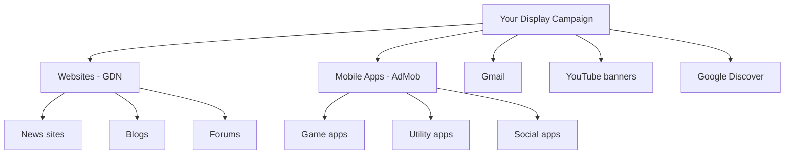

## Reach people everywhere they browse

Google's Display Network spans over **35 million websites and apps**, reaching more than 90% of internet users worldwide. Display Ads let you show visual ads to people as they read news, check email, watch videos, and use other apps. Unlike Search Ads (where people are actively looking), Display Ads are **interruptive** -- you're inserting your message into someone's browsing experience.

This means the rules are different. Creative quality matters more. Targeting precision matters more. And expectations should be different -- lower click-through rates but much broader reach and lower costs.

## Where Display Ads appear

Your ads can show across an enormous variety of surfaces:

| Surface | What it looks like | Reach |
|---------|-------------------|-------|
| **News and content websites** | Banner ads between articles, sidebar ads, in-article ads | Millions of sites (NYT, CNN, niche blogs, forums) |
| **Mobile apps** | Interstitial ads, banner ads, native ads within apps via AdMob | 2 million+ apps |
| **Gmail** | Collapsible ads in the Promotions tab | 1.8 billion users |
| **YouTube** | Banner overlays, sidebar ads, in-feed ads | 2.5 billion users |
| **Google Discover** | Native-looking cards in the Discover feed | Android users + Google app |
| **Google Finance, Maps, etc.** | Various ad placements | Varies |



<Note>
  **Display Ads are like digital billboards.** People aren't searching for your app -- they're doing something else. Your ad must earn attention in 1-3 seconds. The creative must communicate "what this is" and "why you should care" at a glance.
</Note>

## Display ad formats

### Responsive Display Ads (recommended default)

Responsive Display Ads (RDAs) are Google's smartest display format. You provide building blocks, and Google automatically creates ads in every size needed.

**What you provide:**

| Asset | Specs | How many |
|-------|-------|----------|
| **Landscape images** | 1200x628 px (1.91:1 ratio), max 5MB | 3-5 recommended |
| **Square images** | 1200x1200 px (1:1 ratio), max 5MB | 3-5 recommended |
| **Landscape logo** | 1200x300 px (4:1 ratio), max 5MB | 1 required |
| **Square logo** | 1200x1200 px (1:1 ratio), max 5MB | 1 required |
| **Short headlines** | 30 characters max | Up to 5 |
| **Long headline** | 90 characters max | 1 required |
| **Descriptions** | 90 characters max | Up to 5 |
| **Business name** | 25 characters max | 1 required |
| **Final URL** | Your landing page | 1 required |
| **Videos** | YouTube video URL (optional) | Up to 5 |

<Tip>
  **Always use Responsive Display Ads as your default format.** They automatically resize and reformat to fit any ad slot on any website or app. Google tests different combinations of your headlines, images, and descriptions and shows the best performers. It's less work than creating dozens of fixed-size banners, and usually performs equally well or better.
</Tip>

### Uploaded image ads (fixed-size banners)

If you have a designer and want full creative control, you can upload custom banner ads in specific sizes.

**All supported image ad sizes:**

| Size (pixels) | Name | Where it appears | Priority |
|------|------|-----------------|----------|
| **300x250** | Medium Rectangle | Most common. Appears inline on websites and in apps | **Must have** |
| **336x280** | Large Rectangle | Similar to 300x250 but larger. Common on content sites | High |
| **728x90** | Leaderboard | Top of web pages | **Must have** |
| **300x600** | Half Page | Sidebar on desktop sites | High |
| **320x50** | Mobile Banner | Standard mobile banner | **Must have** |
| **320x100** | Large Mobile Banner | Larger mobile banner, more visible | High |
| **160x600** | Wide Skyscraper | Sidebar on desktop sites | Medium |
| **468x60** | Banner | Older desktop sites | Low |
| **250x250** | Square | Fits various placements | Medium |
| **200x200** | Small Square | Smaller placements | Low |
| **970x90** | Large Leaderboard | Wide desktop sites | Medium |
| **970x250** | Billboard | Premium desktop placements | Medium |

**File requirements:**
- Format: JPG, PNG, or GIF (animated GIFs supported, max 30 seconds, 5 FPS)
- Max file size: 150KB per image
- No misleading content (fake buttons, system alerts, etc.)

<Note>
  **If you can only create a few sizes, prioritize:** 300x250, 728x90, 320x50, and 300x600. These four sizes cover the vast majority of available ad placements. Add Responsive Display Ads to fill in the rest.
</Note>

### HTML5 ads

For animated or interactive ads, you can create HTML5 ads using Google Web Designer (free tool) or upload your own HTML5 files. Requirements:
- Max 150KB (all files combined)
- Must use Google-approved ad framework
- Created in Google Web Designer or uploaded as .zip

## Audience targeting

Display targeting is all about reaching the right people. Google offers multiple targeting methods that you can layer together.

### Audience-based targeting (who you want to reach)

<AccordionGroup>
  <Accordion title="Affinity Audiences — People with specific interests">
    Affinity audiences target people based on their long-term interests and habits. Google builds these profiles from browsing history, app usage, YouTube viewing, and search behavior.

    **Examples relevant to apps:**
    - "Health & Fitness Buffs" -- for fitness/wellness apps
    - "Technophiles" -- for tech/productivity apps
    - "Mobile Enthusiasts" -- for any app
    - "Value Shoppers" -- for deal/coupon apps
    - "Cooking Enthusiasts" -- for recipe/food apps

    **Best for:** Brand awareness. Reaches large audiences with a general interest in your category. Lower intent but enormous reach.
  </Accordion>
  <Accordion title="In-Market Audiences — People actively researching">
    In-market audiences target people who are actively researching or comparing products in a category. Google detects this from recent search behavior, website visits, and content consumption.

    **Examples:**
    - "App & Mobile Accessories" -- people researching apps
    - "Software/Productivity" -- people looking for productivity tools
    - "Health & Wellness" -- people comparing fitness options
    - "Financial Services" -- people shopping for finance tools

    **Best for:** Conversion-focused campaigns. These people are further along the decision journey. Higher intent than affinity audiences.
  </Accordion>
  <Accordion title="Custom Audiences — People who searched for specific terms">
    Create custom audiences based on:
    - **Search terms people have used:** Enter keywords like "habit tracker app," "best productivity tool." Google targets people who've recently searched for these on Google.
    - **Websites people have visited:** Enter competitor URLs. Google targets people who've visited those sites.
    - **Apps people use:** Enter competitor app names. Google targets people using similar apps.

    **Best for:** Highly targeted campaigns. Custom audiences let you essentially create "Search Ad targeting" for Display Ads.
  </Accordion>
  <Accordion title="Your Data (Remarketing) — People who already know you">
    Target people who have previously interacted with your business:
    - **Website visitors** -- people who visited your site but didn't install
    - **App users** -- people who installed but didn't convert (e.g., didn't sign up)
    - **Customer lists** -- upload email lists of customers for targeting

    **Best for:** Highest conversion rates. These people already know your app. Remarketing is usually the most efficient Display campaign you can run.
  </Accordion>
  <Accordion title="Similar Audiences / Lookalike Segments — People like your customers">
    Google analyzes your remarketing lists and finds new people with similar characteristics. Like Meta's Lookalike Audiences.

    **Best for:** Scaling. Once you've found what works with remarketing, similar audiences help you find more people like your converters.
  </Accordion>
</AccordionGroup>

### Content-based targeting (where you want to appear)

<AccordionGroup>
  <Accordion title="Topic Targeting — Pages about specific subjects">
    Show ads on web pages about particular topics:
    - "Health/Health Conditions" -- for health apps
    - "Computers & Electronics/Software" -- for tech apps
    - "Finance/Personal Finance" -- for finance apps
    - "Sports/Fitness" -- for fitness apps

    Google categorizes every webpage by topic and shows your ads on matching pages.
  </Accordion>
  <Accordion title="Placement Targeting — Specific websites and apps">
    Hand-pick exactly which websites, YouTube channels, or apps you want your ads on:
    - `lifehacker.com` -- for productivity apps
    - `reddit.com/r/getdisciplined` -- for habit-building apps
    - Specific YouTube channels in your niche
    - Specific mobile apps

    **Best for:** Maximum control over where your brand appears. Higher effort but more predictable quality.
  </Accordion>
  <Accordion title="Keyword Targeting (Content Keywords) — Pages with specific words">
    Show ads on pages that contain specific keywords:
    - "building habits" -- your ad appears on articles about building habits
    - "productivity tips" -- your ad appears on productivity content
    - "morning routine" -- your ad appears on morning routine articles

    Google scans page content and matches your keywords. This is different from Search keyword targeting -- here you're matching page content, not user search queries.
  </Accordion>
</AccordionGroup>

### Layering targeting for precision

You can combine audience and content targeting. For example:

```
Target: In-Market for "Software/Productivity"
  AND Topic: "Health/Health Conditions/Mental Health"
  = People actively looking for productivity tools
    who are reading about mental health
  = Perfect target for a mindfulness/habit app
```

<Warning>
  **Don't over-layer targeting when starting out.** Each layer narrows your audience. Start with one audience type OR one content type. Add layers after you have performance data to guide decisions. Over-targeting leads to tiny audiences and slow learning.
</Warning>

## Remarketing setup

Remarketing (retargeting) is showing ads to people who already visited your website or used your app. It's the highest-converting Display strategy because these people already know you.

### Website remarketing

<Steps>
  <Step title="Install the Google Tag on your website">
    If you followed the conversion tracking guide, you already have this installed. The Google Tag automatically builds remarketing lists.
  </Step>
  <Step title="Create remarketing lists">
    Go to **Tools & Settings** > **Shared Library** > **Audience Manager** > **Your data segments** > **+**.

    Create lists based on visitor behavior:
    - **All website visitors** (last 30 days)
    - **Visited pricing page** (high intent)
    - **Started signup but didn't finish** (cart abandonment equivalent)
    - **Visited 3+ pages** (engaged visitors)
  </Step>
  <Step title="Set membership duration">
    How long someone stays in your remarketing list after their last visit:
    - **7 days** -- very recent, high intent, small audience
    - **30 days** -- balanced (recommended default)
    - **90 days** -- larger audience, lower intent
    - **540 days** -- maximum (very broad)
  </Step>
  <Step title="Create a remarketing campaign">
    Create a new Display campaign and in the audience targeting section, select your remarketing lists instead of affinity/in-market audiences.
  </Step>
</Steps>

### App remarketing

Target people who installed your app but haven't taken a desired action:

- **Installed but never opened** -- remind them to try the app
- **Opened once but didn't sign up** -- encourage account creation
- **Signed up but didn't complete onboarding** -- guide them through setup
- **Active users who haven't purchased** -- promote premium features
- **Lapsed users (inactive 14+ days)** -- win them back

Set these up in Firebase under **Audiences**, then import them into Google Ads.

<Tip>
  **Remarketing campaigns typically have 2-5x higher conversion rates than prospecting campaigns.** Even a small budget ($5-10/day) on remarketing can be highly profitable. Set up remarketing as your second Display campaign, right after your first prospecting campaign.
</Tip>

## Creating effective display creative

### The 3-second rule

Display ads must communicate their message in 3 seconds or less. People are not paying attention to your ad -- they're reading an article, checking email, or playing a game. You need to interrupt and inform simultaneously.

### Anatomy of a great display ad

```
┌─────────────────────────────┐
│  [App screenshot / visual]  │  ← 60% of the ad: compelling visual
│                             │
│  Build Better Habits        │  ← Clear, benefit-focused headline
│  in Just 5 Minutes a Day    │
│                             │
│  ⭐ 4.8 stars · 500K users │  ← Social proof
│                             │
│  [Download Free →]          │  ← Clear CTA button
│                             │
│  🟢 HabitFlow              │  ← Logo/brand
└─────────────────────────────┘
```

### What works for app display ads

| Creative approach | When to use | Example |
|------------------|------------|---------|
| **App screenshot** | Show the actual app interface | Screenshot of your app's main screen |
| **Before/after** | Show the transformation your app creates | "Before: scattered habits" / "After: organized streaks" |
| **Social proof** | Build trust quickly | "Join 500K+ users" or "4.8-star rating" |
| **Problem → Solution** | Hook with the problem | "Can't stick to habits?" → "HabitFlow makes it easy" |
| **Feature highlight** | Show a specific compelling feature | Screenshot of the streak tracker or analytics |
| **Lifestyle** | Show the aspirational outcome | Person peacefully meditating, achieved through your app |

### Design tips

- **Keep text minimal:** 5-7 words on the image maximum. Display ads aren't for long copy.
- **High contrast:** Your ad must stand out from the page content. Use bold colors, clear boundaries.
- **Readable at small sizes:** Your ad might render at 320x50 (tiny mobile banner). Text must be legible.
- **Show your app:** Screenshots and UI mockups perform well because people can see what they're getting.
- **Clear CTA:** "Download Free," "Try Now," "Get Started" -- don't leave people wondering what to do.
- **Brand consistently:** Same colors, fonts, and style across all ad sizes.

<Warning>
  **Avoid these common display ad mistakes:**
  - Cramming too much text (it won't be readable)
  - Using stock photos with no connection to your app
  - Missing a CTA (what should people do?)
  - Clickbait or misleading imagery (violates Google's policies and destroys trust)
  - Fake UI elements like "Close" buttons (instant disapproval)
</Warning>

## Setting up a Display campaign: step by step

<Steps>
  <Step title="Create a new campaign">
    Click **+ New Campaign** in Google Ads.
    - **Goal:** Choose "App promotion" (for installs) or "Sales/Leads" (for web conversions), or no goal for full control
    - **Campaign type:** Select **Display**
    - **Campaign subtype:** "Standard display campaign" (not Smart)
  </Step>
  <Step title="Configure campaign settings">
    - **Campaign name:** "Display - US - InMarket - 2026-02"
    - **Locations:** Your target market, using "Presence" option
    - **Language:** Match your audience
    - **Budget:** $10-15/day to start
    - **Bidding:** "Maximize Conversions" (if you have conversion tracking)

    **Important settings to check:**
    - **Optimized targeting:** Turn OFF for your first campaign (it expands beyond your chosen audience)
    - **Content exclusions:** Set up brand safety (covered below)
  </Step>
  <Step title="Set up audience targeting">
    Choose ONE of these to start:
    - **Prospecting:** In-market audience for your app category
    - **Remarketing:** Your website visitors or app users
    - **Custom audience:** People who searched for your keywords

    You can create separate campaigns for each later.
  </Step>
  <Step title="Create your Responsive Display Ad">
    Upload your assets:
    - 3-5 landscape images (1200x628)
    - 3-5 square images (1200x1200)
    - Logos (landscape and square)
    - 5 short headlines, 1 long headline, 5 descriptions
    - Your business name and final URL
    - Optional: YouTube video URL

    Preview how your ad looks in different sizes and placements.
  </Step>
  <Step title="Review and launch">
    Check all settings. Preview your ads in different formats. Hit **Create campaign**.
  </Step>
</Steps>

## Placement exclusions and brand safety

One of the biggest risks with Display Ads is your brand appearing on low-quality or inappropriate websites. Active management of placements is essential.

### Content exclusions (set before launch)

In your campaign settings under **Content exclusions**, exclude:

| Category | Why exclude |
|----------|-----------|
| **Parked domains** | Non-functional websites with no real content |
| **Below the fold** | Ads hidden at the bottom of pages (low visibility) |
| **Sensitive content** | Tragedy, conflict, sexually suggestive, crime |
| **Games** (consider) | Children often accidentally click ads in games, wasting budget |
| **DL-MA: Mature audiences** | Unless your app is specifically for mature audiences |

### Placement report review (do weekly)

<Steps>
  <Step title="Open your placement report">
    Go to your Display campaign > **Content** > **Where ads showed** (or **Placements** > **Where ads showed**).
  </Step>
  <Step title="Sort by cost or impressions">
    Find which websites and apps are getting the most of your budget.
  </Step>
  <Step title="Exclude bad placements">
    Look for:
    - Websites you've never heard of with high spend but no conversions
    - Apps (especially children's games) with high click rates but no conversions
    - Sites with content that doesn't match your brand
    - Extremely high CTR (often indicates accidental clicks, especially on mobile apps)

    Click the checkbox next to bad placements and select **Exclude from campaign**.
  </Step>
  <Step title="Build an exclusion list">
    Under **Tools & Settings** > **Shared library** > **Placement exclusion lists**, create a shared list. Common exclusions:
    - `adsenseformobileapps.com` (excludes all in-app ads -- useful if apps perform badly)
    - Specific low-quality domains you've identified
    - Categories of sites (games, dating, etc.)
  </Step>
</Steps>

<Tip>
  **After 2 weeks, check which placements actually drive conversions.** You might find that 80% of your conversions come from 20% of placements. Consider creating a separate campaign targeting ONLY your best-performing placements with a higher budget.
</Tip>

## Display campaign types compared

| Type | Automation | Control | Best for |
|------|-----------|---------|----------|
| **Standard Display** | Medium -- you set targeting, Google optimizes within it | Medium-High | Most advertisers, specific targeting goals |
| **Smart Display** | High -- Google controls targeting, bidding, and creative | Low | Beginners with conversion tracking and limited time |
| **Gmail Campaign** | Medium | Medium | Reaching users in their inbox |
| **App Campaign (Display component)** | Very High -- part of UAC | Very Low | App installs (runs automatically within App Campaigns) |

<Note>
  **Smart Display campaigns** automatically optimize targeting, bidding, and even create ad combinations. They can work well if you have strong conversion tracking and at least 50 conversions in the last 30 days. But they give you almost no control over where your ads appear, so start with Standard Display to learn, then test Smart Display later.
</Note>

## Key metrics for Display Ads

| Metric | What it means | Healthy range | Red flag |
|--------|--------------|---------------|----------|
| **CTR** | Percentage of impressions that get clicked | 0.3% - 1.0% | Below 0.1% |
| **CPC** | Cost per click | $0.10 - $1.50 | Above $3.00 |
| **Conversion rate** | Clicks that become conversions | 1% - 5% | Below 0.5% |
| **CPA** | Cost per conversion/install | Varies by app | 3x+ your target |
| **View-through conversions** | People who saw your ad, didn't click, but converted later | Track but don't optimize solely on this | N/A |
| **Frequency** | Average times each person sees your ad | 3-7 per week | Above 15 (ad fatigue) |
| **Invalid click rate** | Percentage of clicks Google flagged as invalid | Under 5% | Above 10% |

<Warning>
  **Display CTR will be MUCH lower than Search CTR.** A 0.5% CTR is actually decent for Display. Don't compare Display metrics to Search metrics -- they serve completely different purposes. Display is about awareness and remarketing at scale.
</Warning>

<Card
  title="Optimizing Google Campaigns"
  icon="arrow-right"
  href="/platforms/google/optimization"
>
  Display campaigns running? Learn how to optimize all your Google Ads for better performance.
</Card>
