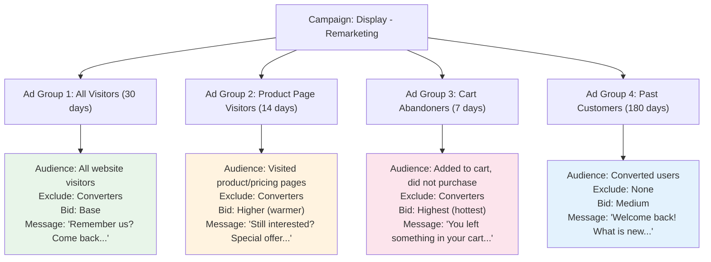

## What Are Google Display Ads?

While Google Search Ads reach people who are actively searching, Google Display Ads reach people while they are browsing websites, reading articles, watching videos, or using apps. Think of Display Ads as digital billboards that appear across the internet — except these billboards can be precisely targeted to specific audiences.

The **Google Display Network (GDN)** is one of the largest advertising networks in the world. It reaches **over 90% of internet users worldwide** through more than 2 million websites and 650,000 apps. When you create a Display campaign, your ads can appear on news sites, blogs, YouTube, Gmail, and hundreds of thousands of other websites and apps that show Google ads.

Display Ads serve a different purpose than Search Ads:

- **Search Ads** capture existing demand — people who are already looking for your product
- **Display Ads** create new demand — reaching people who might be interested but are not actively searching

Both are valuable, and they work best together as part of a complete advertising strategy.

<Tip>
The two most effective uses of Google Display Ads are: (1) **Remarketing** — showing ads to people who have already visited your website to bring them back, and (2) **Brand awareness** — introducing your product to new audiences at a low cost per impression. If you are just starting with Display, begin with remarketing first because it targets an audience that already knows you.
</Tip>

---

## Display Ads vs. Search Ads: Key Differences

Before diving in, let us be clear about how Display differs from Search:

| Factor | Search Ads | Display Ads |
|---|---|---|
| **User intent** | High — actively searching | Low — passively browsing |
| **Ad format** | Text-based | Visual (images, banners, video) |
| **Where they appear** | Google Search results | Websites, apps, YouTube, Gmail |
| **Average CTR** | 3-5% | 0.5-1% |
| **Average CPC** | $1-5 (varies widely) | $0.50-2 |
| **Best for** | Driving immediate conversions | Awareness, retargeting |
| **Targeting** | Keywords | Audiences, demographics, placements |
| **Reach** | Based on search volume | 90%+ of internet users |

### Why Display CTR Is Lower (And Why That Is Okay)

Display Ads have a much lower click-through rate than Search Ads because people are not actively looking for your product when they see a Display Ad. They are reading an article or watching a video. A 0.5% CTR on Display is perfectly normal and can still be very profitable, especially for remarketing.

Do not compare Display metrics to Search metrics — they are different tools for different purposes.

---

## Step 1: Create a Display Campaign

### Starting the Campaign:

1. Log into **[ads.google.com](https://ads.google.com)**
2. Click **Campaigns** in the left sidebar
3. Click the **blue "+" button** → **New campaign**
4. Choose your campaign goal:
   - **Sales** — For retargeting campaigns aimed at driving purchases
   - **Leads** — For campaigns aimed at generating sign-ups
   - **Website traffic** — For driving visitors to your site
   - **Awareness and consideration** — For brand awareness campaigns
5. Select **Display** as the campaign type
6. Click **Continue**

### Campaign Settings:

7. **Campaign name:** Enter a descriptive name like "Display - Remarketing - US" or "Display - Awareness - Fitness Audience"

8. **Locations:** Set your target geographic area
   - Select **Presence: People in or regularly in your targeted locations**

9. **Languages:** Select the languages your audience speaks

10. **Budget:** Enter your daily budget
    - For Display, you can start with **$5-$20/day** since CPCs are typically lower than Search
    - Remarketing campaigns can be effective even at $5-$10/day if your audience is small

11. **Bidding:** Choose your bid strategy:
    - **Maximize conversions** — Best for remarketing campaigns where you have conversion tracking set up
    - **Target CPA** — Set a specific cost per conversion target (use after you have conversion data)
    - **Maximize clicks** — Best for awareness campaigns where you want to drive traffic
    - **Viewable CPM (vCPM)** — Pay per 1,000 viewable impressions (best for pure awareness)

For remarketing: Use **Maximize conversions**
For awareness: Use **Maximize clicks** or **Viewable CPM**

12. Click **Next** to proceed to targeting

<Tip>
Keep your Display campaigns separate from your Search campaigns. Never combine them in the same campaign. They have completely different performance metrics, targeting methods, and optimization strategies. Running them separately lets you set appropriate budgets and bid strategies for each.
</Tip>

---

## Step 2: Set Up Your Targeting

Display targeting determines who sees your ads. You have several options, and they can be combined.

### Audience Targeting Options:

#### A. Remarketing (Your Website Visitors)

This is the most powerful Display targeting option. You show ads to people who have already visited your website.

13. In the **Audiences** section, click **Browse**
14. Expand **How they have interacted with your business**
15. Select your remarketing audiences (the ones you created in the Conversion Tracking guide):
    - All website visitors (last 30 days)
    - Product page visitors (last 14 days)
    - Cart abandoners (last 7 days)
16. Click **Done**

#### B. In-Market Audiences

Target people who are actively researching or comparing products in your category.

17. Under **Audiences**, click **Browse**
18. Expand **What they are actively researching or planning (In-Market)**
19. Browse categories relevant to your business:
    - Software → Productivity Software
    - Health & Fitness → Fitness Products
    - Technology → Mobile Apps
20. Select relevant in-market segments

#### C. Affinity Audiences

Target people based on their long-term interests and habits.

21. Under **Audiences**, click **Browse**
22. Expand **What their interests and habits are (Affinity)**
23. Browse categories:
    - Health & Fitness Buffs
    - Technology Enthusiasts
    - Mobile Enthusiasts
24. Select relevant affinity segments

#### D. Custom Audiences

Create your own audience based on keywords, URLs, or apps that your ideal customers interact with.

25. Under **Audiences**, click **Browse** → **Your custom audiences**
26. Click **+ Custom audience**
27. Give it a name (e.g., "Fitness App Enthusiasts")
28. Add targeting signals:
    - **Keywords:** Terms your ideal customers search for (e.g., "habit tracker app," "fitness routine")
    - **URLs:** Websites your ideal customers visit (e.g., competitor websites, relevant blogs)
    - **Apps:** Apps your ideal customers use (e.g., similar fitness or productivity apps)
29. Click **Save**

#### E. Demographic Targeting

Narrow your audience by demographics.

30. Under **Demographics**, configure:
    - **Age:** Select age ranges
    - **Gender:** All, Male, Female, Unknown
    - **Household income:** Top 10%, 11-20%, etc. (available in some countries)
    - **Parental status:** Parents, Not parents

### Combining Targeting Methods:

You can combine audience targeting with demographic targeting for more precision:

- **Remarketing + age 25-44** = Website visitors in your target age range
- **In-market fitness + women 18-34** = Women actively researching fitness products
- **Custom audience + US only** = People matching your custom signals in the US

<Tip>
For your first Display campaign, start with **remarketing your website visitors**. This audience already knows your brand, so conversion rates will be much higher than cold audiences. Once your remarketing campaign is running successfully, create a second campaign targeting in-market or custom audiences for prospecting.
</Tip>

---

## Step 3: Placement Targeting (Optional)

Placements let you choose SPECIFIC websites, apps, or YouTube channels where you want your ads to appear. This is optional — by default, Google shows your ads across the entire Display Network.

### How to Add Managed Placements:

31. In the **Content** section, look for **Placements**
32. Click **Add placements**
33. You can search for:
    - **Websites:** Enter URLs of specific sites (e.g., nytimes.com, techcrunch.com)
    - **YouTube channels:** Enter specific channels
    - **YouTube videos:** Enter specific video URLs
    - **Apps:** Enter specific apps
    - **App categories:** Select categories of apps
34. Add the placements you want
35. Click **Done**

### When to Use Managed Placements:

- When you want absolute control over where your ads appear
- When you know specific websites your audience visits
- When you want to appear alongside specific content
- When brand safety is a concern

### When NOT to Use Managed Placements:

- When you are just starting out and do not know where your audience is
- When you want maximum reach
- When using remarketing (remarketing targets people, not websites)

---

## Step 4: Content Exclusions and Brand Safety

You may not want your ads appearing on certain types of content. Google lets you exclude content categories.

### Setting Up Content Exclusions:

36. In campaign settings, look for **Content exclusions**
37. You can exclude:
    - **Sensitive content categories:** Tragedy, conflict, sexually suggestive, sensational, profanity
    - **Content types:** Parked domains, error pages, below-the-fold ads
    - **Specific placements:** Websites or apps you want to block

### Recommended Exclusions:

- **Parked domains** — Expired domain pages with no real content
- **Error pages** — 404 pages and similar errors
- **Below-the-fold ad slots** — Ads that require scrolling to see (lower visibility)
- **Sensitive content** — Unless your product specifically relates to these topics

---

## Step 5: Create Your Display Ads

Google Display campaigns use **Responsive Display Ads (RDAs)** as the primary ad format. Similar to Responsive Search Ads, you provide multiple assets and Google automatically combines them.

### What You Need to Provide:

**Images:**

| Type | Size | Use |
|---|---|---|
| Landscape image | 1200 x 628 pixels (min 600 x 314) | Main ad image for horizontal placements |
| Square image | 1200 x 1200 pixels (min 300 x 300) | Main ad image for square placements |
| Logo (landscape) | 1200 x 300 pixels (min 512 x 128) | Your brand logo in horizontal format |
| Logo (square) | 1200 x 1200 pixels (min 128 x 128) | Your brand logo in square format |

**Text:**

| Element | Length | Quantity |
|---|---|---|
| Short headline | 30 characters max | Up to 5 |
| Long headline | 90 characters max | 1 |
| Description | 90 characters max | Up to 5 |
| Business name | 25 characters max | 1 |

**Optional:**

| Element | Details |
|---|---|
| Video | YouTube video URL (adds video to your ad mix) |
| Call to action | Choose from preset options (Shop Now, Learn More, etc.) |

### Creating Your Responsive Display Ad:

38. In your ad group, click **+ New ad** → **Responsive display ad**
39. **Upload images:**
    - Click **+ Images** and upload at least one landscape and one square image
    - Aim for 3-5 images of each type for better optimization
    - Google can also scan your website for images to suggest

40. **Upload logos:**
    - Click **+ Logos** and upload your business logo
    - Provide both landscape and square versions

41. **Write your headlines:**

Short headlines (30 characters each, up to 5):
```
"Build Better Habits Today"
"#1 Habit Tracker App"
"Track Your Daily Habits"
"Simple Habit Building"
"Start Free Today"
```

Long headline (90 characters, 1):
```
"Build lasting habits with smart reminders, streak tracking, and beautiful progress charts"
```

42. **Write your descriptions** (90 characters each, up to 5):
```
"Join 50,000+ people building better habits. Track streaks, set reminders, and celebrate progress."

"The simple, beautiful habit tracker that actually works. Download free on iOS and Android."

"Build the routines that change your life. Set goals, track daily habits, and see your progress."

"Rated 4.8 stars. Smart reminders, streak tracking, and community support to keep you motivated."

"Start your habit tracking journey today. No credit card required. Available on all devices."
```

43. **Business name:** Enter your business or app name

44. **Final URL:** Enter the landing page URL

45. **Call to action:** Select the most appropriate option (e.g., "Download," "Learn More," "Sign Up")

46. **Preview your ad:** Google shows previews of how your ad will look in different sizes and placements. Review them carefully.

47. Click **Save**

<Tip>
Your Display Ad images should be eye-catching, clear, and simple. Remember that many Display Ad placements are quite small (like a sidebar on a website), so complex images with lots of detail will be hard to read. Use bold colors, clear product shots, and minimal text on the image. Let the ad text (headlines and descriptions) do the talking, not the image itself.
</Tip>

---

## Step 6: Create Upload Display Ads (Optional)

In addition to Responsive Display Ads, you can create **Upload Display Ads** — custom-designed banner ads in specific sizes. This gives you complete creative control but requires design skills.

### Common Display Ad Sizes:

| Size (pixels) | Name | Where It Appears |
|---|---|---|
| 300 x 250 | Medium Rectangle | Most common. Sidebars and within content. |
| 728 x 90 | Leaderboard | Top of web pages |
| 160 x 600 | Wide Skyscraper | Page sidebars |
| 320 x 50 | Mobile Leaderboard | Mobile websites and apps |
| 300 x 600 | Half Page | Large sidebar placement |
| 336 x 280 | Large Rectangle | Within content |
| 970 x 90 | Large Leaderboard | Top of page (desktop) |
| 320 x 100 | Large Mobile Banner | Mobile websites |

### Design Best Practices:

- **File formats:** JPG, PNG, or GIF (animated GIFs allowed, max 150KB)
- **Keep text minimal** — Focus on one clear message
- **Use your brand colors** for consistency
- **Include a clear CTA** ("Download Now," "Learn More")
- **Include your logo** for brand recognition
- **Design for the smallest size first** — If it works at 320x50, it works everywhere

### How to Upload:

48. In your ad group, click **+ New ad** → **Upload display ads**
49. Upload your designed banner files
50. Enter the **Final URL** for each ad
51. Click **Save**

---

## Step 7: Set Up Remarketing Display Campaigns

Remarketing deserves special attention because it is the highest-converting Display strategy.

### The Remarketing Display Funnel:

Create separate ad groups for different remarketing segments:

**Campaign: Display - Remarketing**



### Remarketing Best Practices:

- **Always exclude converters** from non-customer ad groups (so people who already bought do not see "come back" ads)
- **Set frequency caps** — Limit how often each person sees your ad (3-5 times per day is a good maximum)
- **Tailor your message** to each audience segment (do not show the same generic ad to everyone)
- **Use dynamic remarketing** if you have an e-commerce product feed (shows people the exact products they viewed)

### Setting a Frequency Cap:

49. In campaign settings, click **Additional settings**
50. Find **Frequency capping**
51. Set a cap like:
    - **5 impressions per day per user** (aggressive)
    - **3 impressions per day per user** (moderate, recommended)
    - **1 impression per day per user** (conservative)

<Tip>
Frequency capping is critical for remarketing. Without it, your ads can follow someone around the internet dozens of times per day, which is annoying and damaging to your brand. Set a cap of **3-5 impressions per day per user**. If someone sees your ad 3 times a day and has not clicked, showing it 20 more times is unlikely to change their mind — and more likely to make them dislike your brand.
</Tip>

---

## Step 8: Placement Reports and Optimization

After your Display campaign runs for a few days, review where your ads are appearing.

### Checking Placement Reports:

52. In your Display campaign, click **Placements** in the left sidebar
53. Click **Where ads showed** to see the actual websites and apps where your ads appeared
54. Review the data:
    - **Impressions:** How many times your ad was shown on each placement
    - **Clicks:** How many clicks from each placement
    - **Conversions:** How many conversions from each placement
    - **Cost:** How much you spent on each placement

### What to Look For:

- **High-performing placements:** Websites with good CTR and conversions. Consider adding these as managed placements.
- **Low-performing placements:** Websites with lots of impressions but zero clicks or conversions. Exclude these.
- **Suspicious placements:** Unknown app names or websites that look like they might be click farms. Exclude these immediately.

### How to Exclude Bad Placements:

55. Select the placements you want to exclude
56. Click the **three dots (...)** menu
57. Click **Exclude from campaign** or **Exclude from ad group**

### Common Placements to Exclude:

- **Mobile game apps** — Often have accidental clicks from people trying to close ads
- **Parked domains** — No real content, just ads
- **Anonymous apps** — Unnamed apps in the placement report
- **Irrelevant websites** — Sites completely unrelated to your audience

---

## Step 9: Dynamic Display Ads (For E-Commerce)

If you sell products online, Dynamic Display Ads automatically show people the specific products they viewed on your website.

### How Dynamic Display Ads Work:

1. A person visits your website and views specific products
2. They leave without purchasing
3. Your Dynamic Display Ad shows them the EXACT products they viewed, with images and prices
4. They click the ad and return to your website to complete the purchase

### Setting Up Dynamic Display Ads:

58. Upload a **product feed** to Google Merchant Center
59. Link Google Merchant Center to your Google Ads account
60. Create a Display campaign and select **"Use a product feed for personalized ads"**
61. Google will automatically generate ads using your product images, names, and prices
62. The ads will show people the specific products they viewed

---

## Troubleshooting Common Display Ad Issues

### "My ads are not getting impressions"

**Possible causes:**
- Your audience is too narrow
- Your bids are too low
- Your ads are under review

**Fixes:**
1. Broaden your audience targeting
2. Increase your bids or switch to a less restrictive bidding strategy
3. Check ad approval status

### "I am getting lots of impressions but almost no clicks"

**Possible causes:**
- Your ad creative is not compelling enough
- Your ads are appearing on low-quality placements
- Your targeting is too broad (reaching people who are not interested)

**Fixes:**
1. Improve your ad images and headlines
2. Review the placement report and exclude low-quality sites
3. Narrow your audience targeting

### "I am getting clicks but they seem fake"

**Possible causes:**
- Your ads are on click-farm websites or apps
- Bot traffic from low-quality placements

**Fixes:**
1. Review the placement report immediately
2. Exclude suspicious placements
3. Exclude mobile gaming apps (major source of accidental clicks)
4. Add content exclusions for low-quality content types

---

## Your Display Campaign Checklist

- [ ] Campaign created with correct goal and Display type
- [ ] Targeting configured (remarketing, in-market, custom, or affinity audiences)
- [ ] Content exclusions set up for brand safety
- [ ] Responsive Display Ad created with:
  - [ ] At least 2 landscape images (1200 x 628)
  - [ ] At least 2 square images (1200 x 1200)
  - [ ] Logo uploaded (landscape and square)
  - [ ] 5 short headlines (30 chars each)
  - [ ] 1 long headline (90 chars)
  - [ ] 5 descriptions (90 chars each)
- [ ] Frequency cap set (3-5 impressions per day)
- [ ] Remarketing audiences applied (if running remarketing)
- [ ] Converters excluded from prospecting audiences
- [ ] Budget set to $5-$20/day
- [ ] Placement report reviewed within first week

---

## What Comes Next

Your Display campaigns are now set up to complement your Search campaigns. Together, they create a powerful combination: Search captures people who are actively looking for your product, while Display builds awareness with new audiences and brings back people who visited your website but did not convert.

In the **Optimization** guide, we will cover advanced strategies for improving both your Search and Display campaigns — including bid management, A/B testing, negative keyword refinement, and scaling techniques.

<Tip>
Review your Display placement reports at least once a week. The Google Display Network is enormous, and not all of it is high quality. Regularly excluding bad placements and doubling down on good ones is the key to profitable Display advertising. Think of it as gardening — you need to pull weeds regularly to let the flowers grow.
</Tip>
