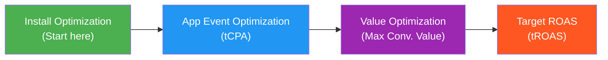

## App Campaign Optimization Tiers: The Optimization Ladder

If you are running **Google App Campaigns** (formerly Universal App Campaigns or UAC), this section is for you. Google App Campaigns have their own optimization ladder, and the key difference from other platforms is that **optimization is set at the Campaign level**, not the ad group level.

Think of it like choosing a difficulty level for Google's AI. At the easiest level, you just ask for installs. At the hardest level, you ask Google to find users who will generate the highest revenue — but Google needs a lot of data to pull that off.

### The Optimization Ladder (You Graduate Up Over Time)



### Optimization Tiers Comparison Table

| Optimization Tier | Where to Set It | What It Does | When to Use It | Pro Tip |
|---|---|---|---|---|
| **Install Optimization** | Campaign level → Bidding: Maximize Conversions or Target CPI | Tells Google: "Get me the most app installs possible." Google shows your ads across Search, Play Store, YouTube, and Display to people most likely to install. | Your first app campaign. You need installs to generate data. | Set a Target CPI if you know your target cost. Otherwise, use Maximize Conversions to let Google figure out the right CPI first. |
| **App Event Optimization (tCPA)** | Campaign level → Bidding: Target CPA | Tells Google: "Find people who will install AND perform a specific in-app action (purchase, sign-up, level 10)." | Once your install campaign has enough data (Google recommends running installs for at least a few weeks first). | Set your tCPA at about 20% higher than your observed CPA to give Google room to learn. You can tighten it gradually. |
| **Value Optimization** | Campaign level → Bidding: Maximize Conversion Value | Tells Google: "Find users who will generate the most revenue." Google prioritizes high-spending users. | Once you have purchase events with revenue values reporting back via Firebase/SDK for at least 4 weeks. | Make sure you are sending accurate revenue values back to Google via the Firebase SDK. Garbage in, garbage out. |
| **Target ROAS (tROAS)** | Campaign level → Bidding: Target ROAS | Tells Google: "Find high-value users AND hit this specific return target." | After running Maximize Conversion Value for 4+ weeks and having a clear ROAS baseline. | Use your historically achieved ROAS as your initial target. Do not set an aspirational target — start realistic and tighten over time. |

### Key Difference: Campaign-Level Control

Unlike Meta (Ad Set level) and TikTok (Ad Group level), Google App Campaigns set the optimization goal at the **Campaign level**. This means:

- You need **separate campaigns** for different optimization tiers (one campaign for installs, another for tCPA, etc.)
- You **cannot** mix Install Optimization and AEO within the same campaign
- You **can** optionally set different CPA or ROAS targets at the **Ad Group level** to override the campaign-level target

### The Progression Explained Like Talking to a Friend

Imagine you run a restaurant and Google is your marketing agency:

1. **Install Optimization** = "Just get people through the door." Google puts up signs everywhere — on billboards, in search results, on YouTube. Anyone who might visit, they target. Some people eat, some just grab a free breadstick and leave.

2. **tCPA (App Event Optimization)** = "Get me people who actually order a meal, and try to keep the cost of acquiring each diner under $5." Google gets smarter — it starts targeting people who look like they will actually sit down and order food, not just browse the menu.

3. **Maximize Conversion Value** = "Forget the number of diners — get me the ones who order the most expensive items." Google now targets the big spenders. Fewer total diners, but each one orders the steak and wine.

4. **Target ROAS** = "Get me big spenders, and make sure I earn $4 in revenue for every $1 I spend on marketing." The most precise instruction. Google has to balance finding the right people with hitting your exact profitability target.

<Tip>
**The data progression rule:** Google recommends running each tier for at least a few weeks before moving up. For Target ROAS specifically, report revenue values across all relevant campaigns for **4 weeks or 3 conversion cycles** (whichever is longer) before setting your ROAS target. Rushing through the tiers is the fastest way to waste money.
</Tip>

<Tip>
**Key platform difference:** On Google, you set optimization at the **Campaign level**. This means you need separate campaigns for Install Optimization vs. AEO vs. VO. However, you can set different CPA/ROAS targets at the **Ad Group level** to fine-tune within a campaign.
</Tip>

---

## Why Optimization Separates Winners from Losers

The difference between a profitable Google Ads account and a money pit is not the starting budget or the initial setup — it is what happens after launch. Optimization is the ongoing process of analyzing your data, identifying what works, fixing what does not, and continuously improving your results.

Think of your Google Ads campaigns as a garden. Planting the seeds (launching campaigns) is just the beginning. Optimization is watering, weeding, pruning, and fertilizing. Without consistent care, even the best garden will wither. With consistent care, even a modest garden can produce incredible results.

This guide will teach you exactly how to optimize your Google Ads campaigns, step by step, with practical strategies you can apply immediately.

<Tip>
The single most important optimization habit is **checking your Search Terms report weekly**. This report shows you the actual searches that triggered your ads. Adding irrelevant searches as negative keywords and discovering new profitable search terms is the foundation of all Google Ads optimization. Set a recurring calendar reminder to review this report every Monday.
</Tip>

---

## Step 1: Understand Your Dashboard and Key Reports

Before you can optimize anything, you need to know where to find your data and what it means.

### Key Reports in Google Ads:

#### Campaign Overview

1. Go to **[ads.google.com](https://ads.google.com)**
2. Click **Campaigns** in the left sidebar
3. You will see a table showing all your campaigns with performance metrics
4. Customize your columns by clicking the **Columns** icon and selecting:
   - Clicks
   - Impressions
   - CTR
   - Average CPC
   - Cost
   - Conversions
   - Cost/conversion
   - Conversion rate
   - Search impression share (for Search campaigns)
   - Quality Score (for keywords)

#### Search Terms Report

This is your most important report for Search campaign optimization.

5. Click on your Search campaign
6. Click **Keywords** in the left sidebar
7. Click **Search terms** at the top
8. This shows every actual search query that triggered your ads
9. For each search term, you can see: impressions, clicks, cost, conversions, and cost/conversion

#### Auction Insights Report

See how your ads compare to competitors.

10. In your campaign or ad group, click **Keywords**
11. Select one or more keywords
12. Click the **three dots (...)** menu → **Auction insights**
13. This shows:
    - **Impression share:** How often your ad showed vs. how often it could have shown
    - **Overlap rate:** How often competitor ads appeared alongside yours
    - **Position above rate:** How often competitors appeared above you
    - **Top of page rate:** How often your ad appeared at the top of the page

#### Ad Performance Report

14. Click **Ads & assets** in the left sidebar
15. Review each ad's:
    - CTR (which ads get clicked the most?)
    - Conversion rate (which ads drive the most conversions?)
    - Cost per conversion (which ads are most efficient?)

<Tip>
Create a **saved report** with your key metrics so you do not have to customize columns every time. Go to Reports → click the save icon → name it something like "Weekly Performance Review." You can access saved reports from the Reports tab with one click.
</Tip>

---

## Step 2: Quality Score Optimization

As we covered in the Search Ads guide, Quality Score (1-10) directly affects your cost per click and ad position. Improving Quality Score is the highest-ROI optimization you can do because it lowers your costs on every single click.

### How to Diagnose Quality Score Issues:

15. Go to **Keywords** in your campaign
16. Add the Quality Score columns (Quality Score, Expected CTR, Ad Relevance, Landing Page Experience)
17. Sort by Quality Score ascending to find your worst-performing keywords

### Fixing Low Expected CTR:

The "Expected CTR" component predicts how likely people are to click your ad.

**Strategies to improve:**
- **Rewrite your headlines** to be more compelling and action-oriented
- **Include the keyword** in at least 2 of your RSA headlines
- **Add a strong call to action** ("Download Free," "Start Today," "Get a Quote")
- **Use numbers and specifics** ("Save 30%," "4.8 Stars," "50,000+ Users")
- **Test emotional hooks** ("Frustrated with...?," "Finally, a solution that...")
- **Add more ad assets** (sitelinks, callouts) — they make your ad larger and more clickable

### Fixing Low Ad Relevance:

The "Ad Relevance" component measures how closely your ad matches the search query.

**Strategies to improve:**
- **Create tighter ad groups** — If an ad group has keywords like "habit tracker" AND "fitness planner," split them into two ad groups with dedicated ads for each topic
- **Mirror the keyword language in your ad** — If the keyword is "daily habit tracker," your headline should say "Daily Habit Tracker"
- **Write ad-group-specific copy** — Do not use the same generic ad across all ad groups
- **Match search intent** — If someone searches "best habit tracker app review," they want information. If they search "download habit tracker," they want to take action. Write your ads accordingly.

### Fixing Low Landing Page Experience:

The "Landing Page Experience" component evaluates your website after the click.

**Strategies to improve:**
- **Match the landing page to the ad** — If your ad promotes a "free habit tracker," the landing page should feature your free habit tracker prominently
- **Improve page speed** — Test with [Google PageSpeed Insights](https://pagespeed.web.dev). Aim for a score above 80 on mobile
- **Make it mobile-friendly** — Over 60% of Google searches are on mobile. If your page is not responsive, you are losing conversions AND Quality Score
- **Add relevant content** — The page should have enough text and information to be genuinely useful
- **Clear navigation** — Make it easy for visitors to find what they need
- **Prominent CTA** — The action you want visitors to take should be obvious and above the fold

<Tip>
The fastest way to improve Quality Score is to create **more specific ad groups**. If you have 20 keywords in one ad group, split them into 3-4 themed ad groups of 5 keywords each, with ads specifically written for each theme. This single change can improve Quality Scores from 4-5 to 7-8, which can cut your costs nearly in half.
</Tip>

---

## Step 3: Search Terms Analysis and Negative Keywords

This is the bread and butter of Search campaign optimization. Your Search Terms report reveals exactly what people are typing when they see your ads.

### Weekly Search Terms Review Process:

18. Go to your Search campaign → **Keywords** → **Search terms**
19. Set the date range to the last 7 days
20. Review every search term:

**For each search term, ask yourself:**
- Is this search relevant to my product? (If no → add as negative keyword)
- Does this search show buying intent? (If yes and it is not already a keyword → add it)
- Is this search wasting money with no conversions? (If yes → add as negative keyword)

### Common Types of Irrelevant Searches to Block:

```
Informational searches: "what is habit tracking," "history of habit building"
Job searches: "habit tracker app developer jobs," "hiring"
Free searches: "free habit tracker download" (if you sell a paid product)
Competitor searches: "competitor name login" (people looking for the competitor, not you)
Unrelated: Anything completely off-topic
DIY searches: "make your own habit tracker spreadsheet"
Review searches: "habit tracker app review" (sometimes worth keeping if you have good reviews)
```

### How to Add Negative Keywords from Search Terms:

21. Select the irrelevant search terms by checking the boxes
22. Click **Add as negative keyword**
23. Choose the match type for the negative keyword:
    - **Negative exact match** — Blocks only that exact search
    - **Negative phrase match** — Blocks any search containing that phrase
    - **Negative broad match** — Blocks any search containing all those words (in any order)
24. Choose the level: campaign or ad group
25. Click **Save**

### Negative Keyword Lists:

Create reusable negative keyword lists that you can apply to multiple campaigns.

26. Click the **wrench icon** → **Shared library** → **Negative keyword lists**
27. Click **+ New list**
28. Name it (e.g., "Universal Negatives" or "Free-Seekers Block")
29. Add your negative keywords
30. Apply the list to relevant campaigns

---

## Step 4: Bid Strategy Optimization

Your bid strategy determines how Google spends your budget in the ad auction. Choosing and adjusting the right strategy is crucial for profitability.

### Understanding Smart Bidding Strategies:

| Strategy | How It Works | Best For |
|---|---|---|
| **Maximize Clicks** | Gets the most clicks within your budget | Awareness, traffic campaigns |
| **Maximize Conversions** | Gets the most conversions within your budget | Campaigns with conversion tracking, enough data |
| **Target CPA** | Maintains a specific cost per conversion | After you know your acceptable CPA |
| **Maximize Conversion Value** | Gets the highest total conversion value | E-commerce with varying product values |
| **Target ROAS** | Maintains a specific return on ad spend | E-commerce with enough conversion data |
| **Manual CPC** | You set bids manually for each keyword | Maximum control, small accounts |

### The Recommended Bidding Journey for Beginners:

**Phase 1 (Week 1-2): Maximize Clicks or Manual CPC**
- Start here if you have no conversion data yet
- Focus on getting impressions and clicks to collect data
- Monitor which keywords and ads get clicks

**Phase 2 (Week 2-4): Maximize Conversions**
- Switch once you have at least 15-20 conversions
- Google starts optimizing for conversions instead of just clicks
- Performance should improve as Google learns

**Phase 3 (Month 2+): Target CPA or Target ROAS**
- Switch once you have 30+ conversions and know your acceptable CPA
- Set your Target CPA at or slightly above your current average CPA
- Gradually lower the Target CPA over time as performance improves

### How to Change Your Bid Strategy:

31. Go to your campaign → **Settings**
32. Click **Bidding**
33. Click **Change bid strategy**
34. Select your new strategy
35. Configure any required settings (CPA target, ROAS target)
36. Click **Save**

<Tip>
When switching bid strategies, expect a **learning period of 1-2 weeks** where performance may fluctuate. Google's algorithm needs time to recalibrate. Do not panic and switch back after 3 days — give it at least 2 weeks before evaluating the new strategy. If you switch strategies too frequently, you are constantly resetting the learning, and performance never stabilizes.
</Tip>

---

## Step 5: Ad Copy A/B Testing

Continuously testing new ad copy is essential for improving CTR and conversion rates.

### How Google Tests Ad Variations:

When you have multiple ads in an ad group, Google automatically rotates them and eventually shows the best-performing one more often. However, you can be more systematic about testing.

### Creating an A/B Test:

37. Go to your ad group
38. Click **Ads & assets** → **Ads**
39. Click **+ New ad** to create a new RSA alongside your existing one
40. Change ONE element compared to the original:
    - **Test 1:** Different headlines (keeping the same descriptions)
    - **Test 2:** Different descriptions (keeping the same headlines)
    - **Test 3:** Different call-to-action approaches
    - **Test 4:** Different landing pages

41. Let both ads run for at least 1,000 impressions each before drawing conclusions
42. Compare:
    - CTR — Which ad gets more clicks?
    - Conversion rate — Which ad drives more conversions?
    - Cost per conversion — Which ad is more cost-efficient?

### What to Test (In Order of Impact):

1. **Headlines** — Test different value propositions, different CTAs, different angles
2. **Landing pages** — Test different page designs, offers, or CTA placements
3. **Descriptions** — Test different benefit-focused vs. feature-focused copy
4. **Display URLs** — Test different display paths (e.g., /pricing vs. /free-trial)

### Using Google Ads Experiments:

For more rigorous testing, use Google Ads Experiments:

43. Click **Experiments** in the left sidebar
44. Click **+ New experiment** → **Custom experiment**
45. Choose what to test (ad copy, bidding, targeting)
46. Set the traffic split (usually 50/50)
47. Set the experiment duration (at least 2 weeks)
48. Google will split traffic evenly and report statistical significance

<Tip>
In ad copy testing, the **headline is 10x more important than the description**. Most people only read the headline before deciding to click or skip. If you only have time to test one thing, test different headlines. Try radically different approaches — not just rearranging the same words, but completely different value propositions or emotional angles.
</Tip>

---

## Step 6: Budget Optimization and Scaling

Once you have profitable campaigns, the question becomes: how do you scale them?

### Finding Your Budget Sweet Spot:

#### Check Search Impression Share:

49. Add the "Search impression share" column to your campaign view
50. This percentage tells you how often your ad showed vs. how often it COULD have shown:
    - **90-100%:** You are capturing nearly all available traffic. To grow further, you need new keywords or broader targeting.
    - **70-89%:** Room to grow by increasing budget
    - **50-69%:** Significant missed opportunity. Increasing budget could nearly double your results.
    - **Below 50%:** You are missing more searches than you are catching. Consider whether your budget is too low.

51. Also check "Search lost IS (budget)" — This tells you what percentage of impressions you lost specifically due to budget constraints

#### Scaling Your Budget:

**Safe scaling approach:**
- Increase budget by **15-25%** every 5-7 days
- Monitor cost per conversion after each increase
- If CPA increases significantly, scale back slightly
- Some keywords are cheaper than others — as you increase budget, Google may start showing your ads for more expensive keywords

**When to scale:**
- Your campaigns are profitable (CPA is below your target)
- You have a healthy Search impression share (meaning there is room to grow)
- You have been stable for at least 2 weeks
- Your conversion tracking is working correctly

**When NOT to scale:**
- Your CPA is above your target
- You have Quality Score issues to fix first
- You do not have enough conversion data to trust the numbers
- You have not reviewed your Search Terms report recently

### Budget Allocation Across Campaigns:

| Campaign Type | Budget Priority | Why |
|---|---|---|
| Brand Search | Highest | Cheapest clicks, highest conversion rate, protect your brand |
| Non-Brand Search (high intent) | High | People actively looking for your product type |
| Remarketing Display | Medium-High | Warm audience, good conversion rates |
| Non-Brand Search (broad) | Medium | Testing new keywords, learning |
| Prospecting Display | Lower | Cold audience, awareness building |

<Tip>
Before scaling your budget, make sure you are not wasting money on bad search terms. Scaling a campaign that wastes 30% of its budget on irrelevant searches means you are also scaling the waste. Clean up your Search Terms report, fix Quality Scores, and eliminate waste FIRST — then scale. A lean, efficient $20/day campaign that doubles to $40/day will produce much better results than a wasteful $20/day campaign that doubles to $40/day.
</Tip>

---

## Step 7: Advanced Optimization Techniques

### Ad Schedule Optimization

Show your ads only during high-performing times.

52. Go to your campaign → **Show more** → **Ad schedule**
53. Click **+ Ad schedule**
54. Analyze your existing data:
    - Which days of the week perform best?
    - Which hours of the day have the lowest CPA?
55. Set bid adjustments:
    - Increase bids during high-performance times (+20%, +30%)
    - Decrease bids during low-performance times (-30%, -50%)
    - Or exclude certain times entirely (e.g., overnight when your support is offline)

### Device Optimization

Adjust bids based on device performance.

56. Go to **Insights and reports** → **When and where ads showed** → **Devices**
57. Compare performance across:
    - **Mobile** — Usually higher volume, sometimes lower conversion rate
    - **Desktop** — Often higher conversion rate, sometimes lower volume
    - **Tablet** — Usually lowest volume
58. Set bid adjustments:
    - If mobile converts well: no adjustment needed
    - If mobile has poor conversion rate: decrease mobile bids (-20% to -50%)
    - If desktop converts much better: increase desktop bids (+10% to +30%)

### Location Bid Adjustments

59. Go to your campaign → **Locations**
60. Review performance by location
61. If certain cities or states perform significantly better or worse:
    - Increase bids for high-performing locations
    - Decrease bids for low-performing locations
    - Exclude locations that consistently waste budget

### Audience Bid Adjustments

62. Go to your campaign → **Audiences**
63. Add audience segments as "Observation" (not "Targeting") to see how they perform:
    - In-market audiences relevant to your product
    - Remarketing audiences (website visitors)
    - Demographic segments
64. After collecting data, set bid adjustments:
    - Increase bids for audiences that convert well
    - Decrease bids for audiences that do not convert

---

## Step 8: Common Problems and Solutions

### Problem: High Cost Per Conversion

**Diagnostic checklist:**
1. Check Quality Scores — low QS means high CPCs
2. Check Search Terms — irrelevant searches waste budget
3. Check conversion tracking — are you tracking correctly?
4. Check landing page — is it converting visitors?
5. Check bid strategy — is it appropriate for your data volume?

**Solutions (in order of impact):**
1. Add negative keywords for irrelevant search terms
2. Improve Quality Scores by tightening ad groups
3. Test new landing pages
4. Switch to a more appropriate bid strategy
5. Pause keywords with consistently high CPA and no conversions
6. Reduce bids on expensive, low-converting keywords

### Problem: Low Click-Through Rate

**Diagnostic checklist:**
1. Ad position — Are you appearing below the fold?
2. Ad relevance — Does your ad match the search query?
3. Ad copy — Is it compelling?
4. Ad assets — Are you using sitelinks, callouts, etc.?

**Solutions:**
1. Rewrite headlines with stronger hooks and CTAs
2. Include keywords in your ad headlines
3. Add all available ad assets
4. Test new ad variations
5. Increase bids to improve ad position

### Problem: Clicks But No Conversions

**Diagnostic checklist:**
1. Landing page match — Does the page deliver on the ad's promise?
2. Page speed — Does it load in under 3 seconds on mobile?
3. Conversion tracking — Is the tag firing correctly?
4. User experience — Is the conversion process simple and clear?
5. Search intent — Are you targeting people who are actually ready to convert?

**Solutions:**
1. Redesign your landing page to match your ad message
2. Simplify the conversion process (fewer form fields, clearer CTA)
3. Verify conversion tracking with Google Tag Assistant
4. Add social proof (testimonials, reviews, trust badges) to the landing page
5. Review search terms for irrelevant traffic

### Problem: Low Search Impression Share

**Possible causes:**
- Budget too low for the keywords you are targeting
- Quality Score too low (losing in the auction)
- Bids too low for competitive keywords

**Solutions:**
1. Check "Search lost IS (budget)" vs. "Search lost IS (rank)"
2. If lost to budget: increase daily budget
3. If lost to rank: improve Quality Score or increase bids
4. Focus budget on your most profitable keywords first

---

## Step 9: Weekly Optimization Routine

Here is a practical weekly checklist to keep your Google Ads account in top shape:

### Every Week (15-20 minutes):

- [ ] Review the Search Terms report and add negative keywords
- [ ] Check cost per conversion for each campaign and ad group
- [ ] Review Quality Scores and note any that dropped
- [ ] Check ad approval status (any disapprovals?)
- [ ] Review impression share to identify growth opportunities
- [ ] Pause any keywords with high spend and zero conversions (after sufficient data)

### Every Two Weeks (30 minutes):

- [ ] Review ad performance and pause underperformers
- [ ] Create new ad variations for testing
- [ ] Check device performance and adjust bids
- [ ] Review placement report for Display campaigns
- [ ] Update negative keyword lists
- [ ] Check competitor activity in Auction Insights

### Monthly (1 hour):

- [ ] Review overall account performance and trends
- [ ] Calculate ROI/ROAS for each campaign
- [ ] Refresh remarketing audiences if needed
- [ ] Review and adjust bid strategies
- [ ] Conduct fresh keyword research for new opportunities
- [ ] Review budget allocation across campaigns
- [ ] Check Google Ads recommendations (apply good ones, dismiss bad ones)
- [ ] Update ad assets (sitelinks, callouts) with fresh messaging

---

## Step 10: Google Ads Recommendations (Use With Caution)

Google provides a "Recommendations" tab with suggestions to improve your account. The **Optimization Score** (0-100%) reflects how many of these recommendations you have applied.

### How to Review Recommendations:

63. Click **Recommendations** in the left sidebar
64. You will see a list of suggestions organized by category:
    - Ads and assets
    - Keywords and targeting
    - Bidding and budgets
    - Repairs (fixing issues)

### Which Recommendations to Follow:

**Usually good to apply:**
- Add responsive search ads (if you do not have enough)
- Fix disapproved ads
- Remove redundant keywords
- Add ad assets (sitelinks, callouts)
- Fix broken URLs

**Review carefully before applying:**
- Raise your budget (only if you can afford it and campaigns are profitable)
- Add new keywords (check if they are relevant before adding)
- Apply bid adjustments (verify with your own data)

**Almost always dismiss:**
- "Switch to broad match" (this usually wastes budget for beginners)
- "Use target impression share bidding" (not conversion-focused)
- "Expand your reach with Google Search Partners" (mixed results)
- Automatically created ads (you should control your ad copy)

<Tip>
Do NOT blindly apply all Google Ads recommendations to get your Optimization Score to 100%. Many recommendations benefit Google's revenue more than your bottom line. A recommendation to "switch all keywords to broad match" will increase your spending significantly without necessarily improving your results. Review each recommendation critically and only apply the ones that genuinely make sense for your business.
</Tip>

---

## Your Optimization Checklist

- [ ] Custom column view set up with key metrics
- [ ] Search Terms report reviewed (weekly habit established)
- [ ] Negative keyword lists created and applied
- [ ] Quality Scores checked and improvement plan in place
- [ ] Bid strategy appropriate for current data volume
- [ ] Ad copy A/B tests running in each ad group
- [ ] Budget scaled appropriately (15-25% increases every 5-7 days)
- [ ] Device bid adjustments set based on performance data
- [ ] Ad schedule optimized for high-performance times
- [ ] Placement report reviewed for Display campaigns
- [ ] Google Ads recommendations reviewed (good ones applied, bad ones dismissed)
- [ ] Weekly optimization routine scheduled on calendar

---

## Summary

Google Ads optimization is a continuous process of analysis, testing, and improvement. The advertisers who see the best results are the ones who:

1. **Review Search Terms weekly** — This is the single most important habit
2. **Improve Quality Scores relentlessly** — Lower costs on every click
3. **Test ad copy continuously** — Always have new variations running
4. **Scale gradually** — Only increase budgets on proven profitable campaigns
5. **Clean up waste first** — Eliminate irrelevant searches before scaling
6. **Use the right bid strategy** — Match your strategy to your data volume
7. **Check placement reports** — Exclude bad Display placements weekly
8. **Be patient** — Give bid strategies 2 weeks to learn before changing

Combined with your Meta advertising knowledge, you now have a complete understanding of the two most powerful advertising platforms on the internet. Use Meta for discovery (finding new potential customers) and Google for capture (reaching people actively searching for your solution). Together, they create a full-funnel advertising strategy that can grow any business.

<Tip>
Treat your Google Ads account like a weekly checkup, not a daily obsession. The data needs time to accumulate before it tells a reliable story. Set aside 30 minutes every Monday morning to review your accounts, make adjustments, and plan tests for the week. This consistent, disciplined approach will produce far better results than checking your account every hour and making panicked changes based on incomplete data.
</Tip>
