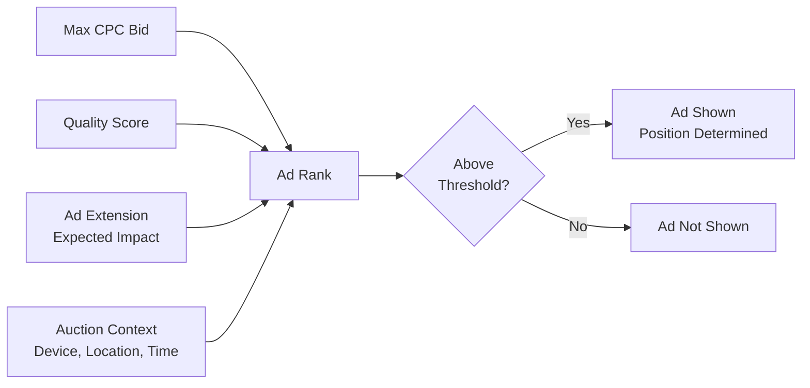
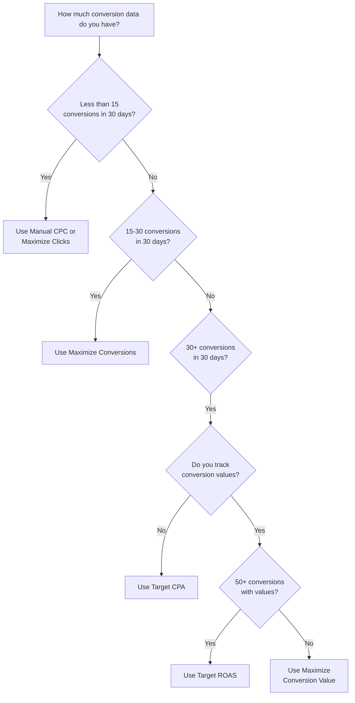
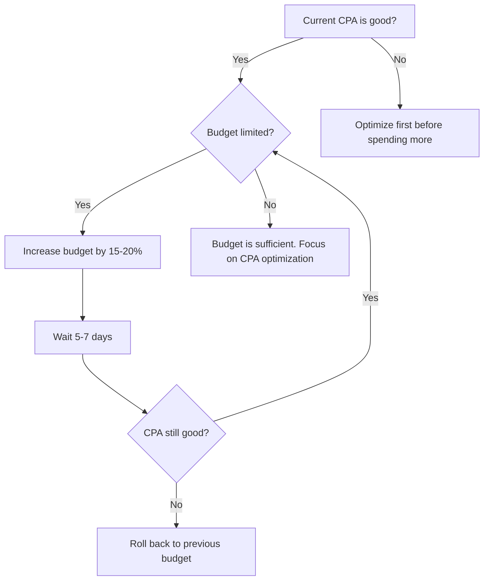
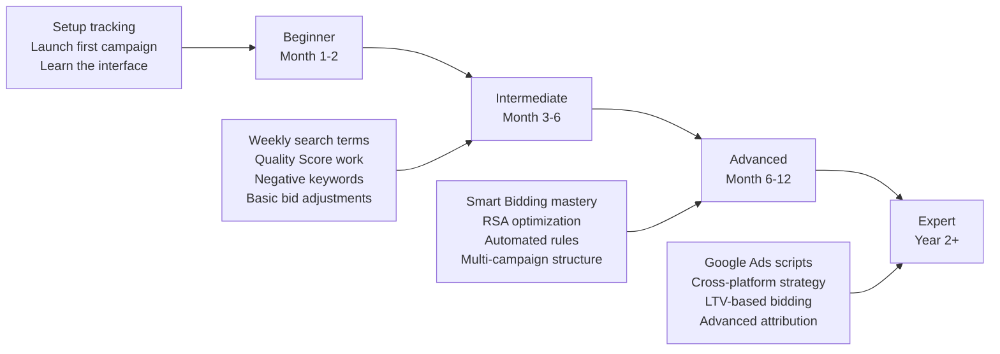

## The optimization mindset

Google Ads rewards precision. Unlike Meta where creative does most of the heavy lifting, Google optimization is about **finding the right keywords, writing relevant ads, bidding strategically, and systematically eliminating waste.** Small improvements compound into significant cost savings -- a 2-point Quality Score increase can reduce your CPC by 30%.

This guide covers everything you need to go from "campaigns are running" to "campaigns are printing money."

## Reading Google Ads reports

Before you can optimize, you need to understand what the numbers mean.

### Key metrics explained

| Metric | What it means | Formula | Why it matters |
|--------|--------------|---------|---------------|
| **Impressions** | Times your ad was shown | -- | Shows your reach |
| **Clicks** | Times someone clicked your ad | -- | Shows interest |
| **CTR** | Click-through rate | Clicks / Impressions | Measures ad relevance and appeal |
| **CPC** | Cost per click | Cost / Clicks | Your unit cost of traffic |
| **Conversions** | Desired actions (installs, sign-ups, purchases) | -- | Measures success |
| **Conversion Rate** | Percentage of clicks that convert | Conversions / Clicks | Measures landing page and offer quality |
| **CPA / CPI** | Cost per acquisition/install | Cost / Conversions | Your unit cost of results |
| **ROAS** | Return on ad spend | Revenue / Cost | Profitability (want above 1.0) |
| **Quality Score** | Google's relevance rating (1-10) | Based on CTR + relevance + landing page | Directly affects cost and position |
| **Impression Share** | Percentage of eligible impressions you won | Your impressions / total eligible impressions | Shows growth opportunity |
| **Search Lost IS (budget)** | Impressions lost due to budget | -- | Tells you if budget is limiting results |
| **Search Lost IS (rank)** | Impressions lost due to ad rank | -- | Tells you if Quality Score or bids need improvement |

### Performance benchmarks by campaign type

| Metric | Search Ads | Display Ads | App Campaigns | YouTube |
|--------|-----------|------------|---------------|---------|
| **Good CTR** | > 3% | > 0.5% | N/A (automated) | > 0.5% (in-feed) |
| **Good CPC** | < $2.00 | < $1.00 | N/A | < $0.10/view |
| **Good Conv. Rate** | > 5% | > 1% | N/A | > 0.5% |
| **Good Quality Score** | > 7 | N/A | N/A | N/A |
| **Target Impression Share** | > 70% | N/A | N/A | N/A |

### Essential reports to check

<AccordionGroup>
  <Accordion title="Campaign Performance Report -- The big picture">
    **Where:** Campaigns tab > default view

    Shows overall performance of each campaign. Check daily for the first month, then weekly.

    **What to look for:**
    - Which campaigns are spending their full budget? (potential scaling opportunity)
    - Which campaigns have the lowest CPA? (your winners)
    - Which campaigns are spending but not converting? (need attention)
    - Day-over-day trends (improving or declining?)
  </Accordion>
  <Accordion title="Search Terms Report -- The gold mine">
    **Where:** Keywords > Search terms

    Shows the actual queries people typed that triggered your ads. This is THE most valuable report for Search campaigns.

    **What to look for:**
    - Irrelevant queries eating budget (add as negative keywords)
    - High-performing queries not in your keyword list (add as keywords)
    - Unexpected queries that convert well (new keyword ideas)
    - Patterns in what converts vs. what does not
  </Accordion>
  <Accordion title="Auction Insights -- Your competitive landscape">
    **Where:** Campaigns or Keywords > Auction insights

    Shows who you are competing against in the ad auction.

    **What to look for:**
    - Who your main competitors are (by overlap rate and impression share)
    - Whether competitors are outranking you (position above rate)
    - How your impression share compares to competitors
    - New competitors entering the auction
  </Accordion>
  <Accordion title="Placement Report (Display) -- Where your ads appeared">
    **Where:** Content > Where ads showed

    Shows which websites and apps displayed your ads.

    **What to look for:**
    - Low-quality placements wasting budget (exclude them)
    - High-performing placements (increase bids or create targeted campaigns)
    - Unexpected placements (apps, games, parked domains)
    - Placement categories driving conversions
  </Accordion>
  <Accordion title="Ad Performance Report -- Which creative works">
    **Where:** Ads & assets

    Shows performance of each ad and its individual assets (headlines, descriptions, images).

    **What to look for:**
    - Which RSA asset combinations perform best
    - Asset performance ratings (Best, Good, Low)
    - Ad Strength vs. actual performance (they do not always correlate)
    - Which headlines get the most impressions
  </Accordion>
  <Accordion title="Geographic Report -- Where conversions come from">
    **Where:** Locations (from the campaign page)

    Shows performance by country, state, city, or metro area.

    **What to look for:**
    - Regions with great CPA (increase bids)
    - Regions spending but not converting (decrease bids or exclude)
    - Unexpected markets that perform well (expansion opportunities)
  </Accordion>
  <Accordion title="Device Report -- Mobile vs. desktop performance">
    **Where:** Devices (from the campaign page)

    **What to look for:**
    - Mobile vs. desktop vs. tablet conversion rates
    - For app campaigns, mobile should dominate (if not, something is wrong)
    - Cost differences by device (mobile CPC is often lower)
    - Whether to add device bid adjustments
  </Accordion>
  <Accordion title="Time of Day Report -- When conversions happen">
    **Where:** Ad schedule (from the campaign page, or use Reports > Predefined > Time)

    **What to look for:**
    - Hours of the day when CPA is lowest (your golden hours)
    - Hours when you spend but do not convert (potential for bid reduction)
    - Day-of-week patterns (weekday vs. weekend performance)
    - Whether to create an ad schedule with bid adjustments
  </Accordion>
</AccordionGroup>

## Quality Score: the complete deep dive

Quality Score is the single biggest lever for reducing your costs in Google Ads. Understanding how it works at a deep level gives you a massive competitive advantage.

### The Ad Rank formula in detail

Every time your ad enters an auction, Google calculates your Ad Rank:



**What most people miss:** Ad Rank is not just bid times Quality Score. Google also factors in the expected impact of your ad extensions and the context of the search (device type, location, time of day, and other signals). Two identical queries from different users can produce different auction results.

**Ad Rank thresholds:** Even if you "win" the auction, your Ad Rank must meet a minimum threshold to appear on the page. This threshold varies by query competitiveness, position on the page (top of page has a higher threshold than bottom), and device.

### The three components of Quality Score

Quality Score is a 1-10 rating based on three components. Each component is rated as "Above average," "Average," or "Below average" relative to other advertisers competing for the same keywords.

<Tabs>
  <Tab title="Expected CTR (approximately 40% weight)">
    **What it is:** Google's prediction of how likely someone is to click your ad when it appears for a given keyword. This uses historical data from your account AND the broader Google Ads ecosystem.

    **Rated independently of position:** Google normalizes for ad position. So a low position does not automatically mean low expected CTR.

    **How to diagnose:**
    - Go to Keywords > add the "Exp. CTR" column
    - Filter for keywords where this is "Below average"
    - These keywords need better ad copy

    **How to improve:**
    1. Include the exact keyword (or close variant) in at least one headline
    2. Use numbers and specifics: "4.8 Stars," "500K Users," "Free 7-Day Trial"
    3. Add a strong call to action: "Download Free," "Start Today," "Try Now"
    4. Use all ad extensions (sitelinks, callouts, structured snippets) -- bigger ads earn more clicks
    5. Test 2-3 RSAs per ad group and let data identify the winner
    6. Consider dynamic keyword insertion (DKI) for ad groups with many similar keywords
    7. Check your ad position -- if impression share is very low, ads might be appearing in low-visibility positions
  </Tab>
  <Tab title="Ad Relevance (approximately 25% weight)">
    **What it is:** How closely your ad copy matches the intent behind the search query. Google analyzes the language in your ad and compares it to the keyword.

    **Common causes of "Below average":**
    - Ad groups with too many unrelated keywords (the "everything bucket" problem)
    - Generic ad copy that does not mention the keyword
    - Mismatched intent (informational keyword with a transactional ad, or vice versa)

    **How to improve:**
    1. Restructure ad groups so each one contains 5-15 keywords that share a tight theme
    2. Write ad headlines that directly include the keywords in that ad group
    3. Match the intent: if someone searches "what is a habit tracker," do not write "Buy Now"
    4. Consider Single Keyword Ad Groups (SKAGs) for your most important keywords
    5. Use dynamic keyword insertion as a fallback to ensure keyword appears in the ad
    6. Review your ad group structure quarterly and split groups that have grown too broad

    **Example of good vs. bad structure:**
    ```
    BAD: Ad Group "All Fitness Keywords"
    Keywords: yoga app, HIIT workout, calorie counter, step tracker, gym finder
    Ad: "Get Fit with Our App"  -- too generic for any one keyword

    GOOD: Ad Group "Yoga"
    Keywords: yoga app, yoga for beginners app, daily yoga
    Ad: "Daily Yoga App -- Guided Sessions for All Levels"
    -- Directly mentions yoga, matches intent
    ```
  </Tab>
  <Tab title="Landing Page Experience (approximately 35% weight)">
    **What it is:** How well your landing page (or app store listing) serves someone who clicked your ad. Google evaluates relevance, usefulness, and navigability.

    **What Google looks for:**
    - **Relevance:** Does the landing page content match the ad and keyword?
    - **Usefulness:** Is the content original and helpful?
    - **Navigation:** Is it easy to find what the user is looking for?
    - **Load speed:** Does the page load in under 3 seconds?
    - **Mobile-friendliness:** Is the experience good on phones?
    - **Trustworthiness:** Is the business transparent about what it does?

    **How to improve:**
    1. Create dedicated landing pages for major ad group themes (do not send everyone to the homepage)
    2. Ensure the headline on the landing page echoes the ad headline
    3. Test page speed at PageSpeed Insights -- aim for a score above 80
    4. Make the primary CTA (download, sign up) immediately visible without scrolling
    5. Add trust signals: reviews, ratings, press logos, security badges
    6. For app campaigns: optimize your app store listing (title, description, screenshots, reviews)
    7. Avoid intrusive interstitials and pop-ups that block content
  </Tab>
</Tabs>

### Diagnosing and fixing Quality Score

Here is a systematic workflow for improving Quality Score across your account:

<Steps>
  <Step title="Add Quality Score columns to your keyword view">
    Go to Keywords > Columns > Modify Columns > Quality Score. Add: Quality Score, Expected CTR, Ad Relevance, Landing Page Experience. Now you can see the breakdown for every keyword.
  </Step>
  <Step title="Sort by Quality Score ascending">
    Find your worst-performing keywords. These are your biggest opportunities for improvement.
  </Step>
  <Step title="Prioritize by spend">
    A keyword with Quality Score 3 that spends $500/month is a much bigger problem than one with Quality Score 3 that spends $5/month. Fix the expensive problems first.
  </Step>
  <Step title="Identify the weakest component">
    For each priority keyword, check which component is "Below average." That is where you focus:
    - **Expected CTR below average:** Rewrite ad copy (see tab above)
    - **Ad Relevance below average:** Restructure ad groups (see tab above)
    - **Landing Page below average:** Improve landing page (see tab above)
  </Step>
  <Step title="Implement changes and wait">
    Quality Score updates are not instant. After making changes, wait 1-2 weeks for Google to re-evaluate. Check the "Quality Score (hist.)" column to track changes over time.
  </Step>
  <Step title="Repeat monthly">
    Make Quality Score improvement a recurring task. Each month, identify the top 10 highest-spend keywords with Quality Score below 7 and work on improving them.
  </Step>
</Steps>

<Tip>
  **Quality Score tip most people miss:** Account-level quality history matters. If your account has a long history of low Quality Scores, new keywords will start with a disadvantage. Conversely, accounts with strong quality history get the benefit of the doubt on new keywords. Clean up your worst performers -- they drag down everything.
</Tip>

## Search Terms Report: step-by-step analysis

This is the single most impactful optimization activity for Search campaigns. Here is a systematic approach:

<Steps>
  <Step title="Open the Search Terms Report">
    Go to your Search campaign > **Keywords** > **Search terms**. Set the date range to the last 7 days (for weekly reviews) or last 14 days (for biweekly).
  </Step>
  <Step title="Sort by cost (highest first)">
    Find the search terms eating the most budget. These are your biggest optimization opportunities.
  </Step>
  <Step title="Evaluate each term">
    For each high-spend search term, check:
    - **Conversions:** Did it convert? If yes, it is working.
    - **Conversion rate:** Is it above or below your average? Below average means inefficient.
    - **CPA:** Is the cost per conversion acceptable?
    - **Relevance:** Does this search term match what your app does?
  </Step>
  <Step title="Take action on each term">
    | Search term | Conversions | CPA vs. target | Action |
    |------------|-------------|----------------|--------|
    | Relevant + converting well | Yes, good CPA | At or below target | Add as exact match keyword |
    | Relevant + converting poorly | Yes, high CPA | Above target | Monitor, or reduce bid |
    | Relevant + not converting yet | 0 but low spend | N/A yet | Let it run another week |
    | Relevant + not converting | 0 after significant spend | N/A | Pause keyword or add as negative |
    | Irrelevant | Any | Any | **Add as negative keyword immediately** |
  </Step>
  <Step title="Document patterns">
    After several reviews, you will notice patterns:
    - Certain word patterns always convert (e.g., "app for [problem]")
    - Certain modifiers never convert (e.g., "free," "online," "tutorial")
    - Certain audiences search differently (mobile vs. desktop queries)

    Use these patterns to inform your keyword strategy and negative keyword lists.
  </Step>
</Steps>

## Negative keyword management

Negative keywords prevent your ads from showing for irrelevant searches. Without them, you will waste 20-40% of your budget on clicks that never convert.

### Building a comprehensive negative keyword strategy

<Steps>
  <Step title="Create negative keyword lists by category">
    Go to **Tools & Settings** > **Shared Library** > **Negative keyword lists**.

    Create these lists:

    **Universal Negatives** (apply to all campaigns):
    ```
    -job, -jobs, -career, -careers, -salary, -hiring
    -resume, -interview, -internship
    -login, -sign in, -password reset
    -complaint, -complaints, -scam
    -wikipedia, -definition, -what is
    -tutorial, -course, -class, -certification
    -template, -spreadsheet, -excel
    ```

    **Brand Protection** (apply to non-brand campaigns):
    ```
    -[your brand name]
    -[your brand name misspellings]
    ```
    This prevents non-brand campaigns from cannibalizing your cheaper brand traffic.

    **Competitor Exclusions** (apply to non-competitor campaigns):
    ```
    -[competitor1 name]
    -[competitor2 name]
    ```
    This ensures competitor keywords only trigger in your competitor-focused campaign.

    **App-Specific Negatives** (common for app advertisers):
    ```
    -review, -reviews, -rating, -ratings
    -hack, -cheat, -mod, -cracked
    -delete, -uninstall, -cancel, -refund
    -stock price, -ipo, -investor
    ```
  </Step>
  <Step title="Apply lists to campaigns">
    In each list, click **Apply to campaigns** and select the relevant campaigns.
  </Step>
  <Step title="Review and update weekly">
    Every week when you review the Search Terms Report, add new irrelevant terms to the appropriate list.
  </Step>
  <Step title="Audit quarterly">
    Review your full negative keyword lists every quarter. Remove any that might be blocking valid traffic. Sometimes your negative keywords become overly aggressive and block relevant searches.
  </Step>
</Steps>

<Warning>
  **Negative keyword match types matter too.** Adding "free" as a broad match negative blocks any query containing "free." Adding [free] as an exact match negative only blocks the query "free" by itself. Be intentional about which match type you use for negatives. Broad match negatives are more aggressive and can block good traffic if you are not careful.
</Warning>

## RSA optimization: getting the most from Responsive Search Ads

Responsive Search Ads (RSAs) are the default ad format for Search campaigns. You provide up to 15 headlines and 4 descriptions, and Google tests combinations to find the best performers.

### RSA best practices

<AccordionGroup>
  <Accordion title="Headline strategy -- fill all 15 slots thoughtfully">
    Do not just write 15 variations of the same message. Diversify your headlines across these categories:

    | Category | Example headlines | How many |
    |----------|-----------------|---------|
    | **Keyword-focused** | "Best Habit Tracker App," "Daily Habit Tracker" | 3-4 |
    | **Benefit-focused** | "Build Lasting Habits in 5 Min/Day," "Achieve Your Goals" | 3-4 |
    | **Social proof** | "500K+ Happy Users," "4.8 Star Rating" | 2-3 |
    | **CTA-focused** | "Download Free Today," "Start Your Free Trial" | 2-3 |
    | **Urgency/offer** | "Limited Time: Premium Free," "Start Free, Upgrade Anytime" | 1-2 |
    | **Differentiator** | "No Ads Ever," "Syncs Across All Devices" | 1-2 |

    This gives Google a diverse set to test. If all 15 headlines say the same thing differently, Google cannot learn which messaging angle resonates.
  </Accordion>
  <Accordion title="Pinning -- when and how to use it">
    Pinning forces a specific headline or description to always appear in a specific position (Headline 1, Headline 2, Headline 3, or Description 1/2).

    **When to pin:**
    - Pin your brand name to Headline 1 if brand visibility is critical
    - Pin a legal disclaimer to Description 2 if required
    - Pin your strongest CTA to Headline 2 if conversion is the priority

    **When NOT to pin:**
    - Do not pin everything. Heavy pinning removes Google's ability to test combinations and reduces Ad Strength
    - Never pin more than 2-3 assets total per RSA
    - If you pin, pin 2-3 options to the same position (e.g., pin 3 different headlines to position 1). This gives Google some flexibility while ensuring one of your preferred headlines always shows

    **Impact on Ad Strength:** Pinning reduces Ad Strength because it limits Google's testing ability. A drop from "Excellent" to "Good" is fine if your pinning improves actual performance metrics (CTR, conversion rate).
  </Accordion>
  <Accordion title="Asset ratings -- how to use them">
    Google rates each headline and description as **Best**, **Good**, or **Low** based on performance.

    **What to do:**
    - **Best:** Keep these. They are your winners.
    - **Good:** Keep these too. They contribute positively.
    - **Low:** Replace with new variations. Test a different angle or message.
    - **Learning:** Not enough data yet. Give it more time.

    **Important nuance:** An asset rated "Low" might perform poorly because it is competing with better alternatives, not because it is bad in absolute terms. Before removing it, check if removing it would leave a gap in your messaging diversity.

    **Review schedule:** Check asset ratings every 2 weeks. Replace 1-2 "Low" assets at a time. Do not replace everything at once since that resets the learning period.
  </Accordion>
</AccordionGroup>

### Ad Strength vs. actual performance

Google gives each RSA an "Ad Strength" score: Poor, Average, Good, or Excellent. This is based on the diversity and relevance of your assets.

<Note>
  **Ad Strength is a guideline, not gospel.** An RSA with "Good" Ad Strength can outperform one with "Excellent" Ad Strength in actual CTR and conversions. Always prioritize real performance metrics (CTR, conversion rate, CPA) over Ad Strength. That said, "Poor" Ad Strength usually does correlate with poor results, so aim for at least "Good."
</Note>

## Smart Bidding strategies: when and how to use each one

Smart Bidding uses Google's ML to set bids in real-time for every auction. Choosing the right strategy is one of the most important decisions you will make.

### Strategy selection guide



### Deep dive into each strategy

<Tabs>
  <Tab title="Target CPA (tCPA)">
    **What it does:** Google automatically sets bids to get you as many conversions as possible at your target cost-per-acquisition.

    **When to use:** You have 30+ conversions in the last 30 days and know what CPA is profitable for your business.

    **How to set your target:**
    1. Look at your last 30 days of data
    2. Find your average CPA
    3. Set your target CPA at or slightly above your current average (do not set it dramatically lower -- the algorithm needs room)
    4. Gradually lower your target by 10-15% every 2 weeks as performance improves

    **Common mistakes:**
    - Setting tCPA too aggressively low -- the algorithm cannot hit an unrealistic target and will simply stop spending
    - Changing tCPA too frequently -- each change resets learning
    - Not having enough conversion volume -- tCPA needs consistent data to work well

    **Pro tip:** If spend drops significantly after switching to tCPA, your target is too low. Raise it by 20%, wait a week, then lower gradually.
  </Tab>
  <Tab title="Target ROAS (tROAS)">
    **What it does:** Google sets bids to maximize conversion value at your target return on ad spend.

    **When to use:** You have 50+ conversions with revenue values in the last 30 days and want to optimize for profitability rather than volume.

    **How to set your target:**
    1. Calculate your current ROAS: total conversion value / total cost
    2. Set target ROAS at or slightly below your current ROAS (e.g., if current is 400%, set target at 350%)
    3. Increase target ROAS by 10% every 2 weeks if you want higher profitability (at the cost of volume)

    **Example:** A target ROAS of 300% means for every $1 spent, you want $3 in conversion value. If your app subscription is $10/month and your LTV is $50, a 300% ROAS means a target CPA of about $16.67.

    **Common mistakes:**
    - Not having accurate conversion values (garbage in, garbage out)
    - Setting tROAS too high -- spend will plummet
    - Forgetting that ROAS is based on attributed revenue, which may differ from actual revenue
  </Tab>
  <Tab title="Maximize Conversions">
    **What it does:** Spends your entire daily budget to get the maximum number of conversions possible. No CPA target -- Google just goes for volume.

    **When to use:**
    - You are building up conversion data and need volume fast
    - You have a fixed budget and want to maximize results within it
    - Transitioning from manual bidding to Smart Bidding (good stepping stone before tCPA)

    **Watch out for:**
    - CPA may be higher than desired since there is no cost control
    - Google WILL spend your full budget -- set daily budget carefully
    - After accumulating 30+ conversions, switch to tCPA for cost control
  </Tab>
  <Tab title="Maximize Conversion Value">
    **What it does:** Spends your entire daily budget to get the maximum total conversion value. Prioritizes high-value conversions over low-value ones.

    **When to use:**
    - You track different conversion values (e.g., trial sign-up = $5, paid subscription = $50)
    - You want Google to prioritize higher-value actions
    - You do not yet have a specific ROAS target in mind

    **Watch out for:**
    - Like Maximize Conversions, this will spend your full budget
    - After accumulating data, switch to tROAS for profitability control
  </Tab>
</Tabs>

### Smart Bidding optimization tips

1. **Do not combine too many conversion actions.** If you are optimizing for both "app installs" and "purchases," the algorithm gets confused. Choose one primary conversion action per campaign.
2. **Give it data.** Smart Bidding needs at least 2 weeks and 30+ conversions to stabilize. Do not judge it before that.
3. **Seasonal adjustments.** Use the "Seasonality adjustments" feature (Tools > Bidding > Seasonality adjustments) to tell Google about expected spikes (Black Friday, app launch) so it does not over-react.
4. **Portfolio bid strategies.** If individual campaigns have low conversion volume, group them into a portfolio bid strategy. This pools conversion data across campaigns, giving the algorithm more to work with.

## Bid adjustments: fine-tuning beyond Smart Bidding

Bid adjustments let you increase or decrease bids based on specific conditions, without creating separate campaigns.

<Note>
  **Important: Bid adjustments work differently with Smart Bidding.** When using Target CPA, Target ROAS, Maximize Conversions, or Maximize Conversion Value, most bid adjustments are ignored because Google is already optimizing in real-time. The only bid adjustment that still works with Smart Bidding is device bid adjustments, and only as a -100% (to completely exclude a device). For all other adjustments, you need Manual CPC or Enhanced CPC.
</Note>

### Where to apply bid adjustments (Manual/Enhanced CPC only)

| Dimension | Where to find | How to analyze | Typical adjustments |
|-----------|--------------|----------------|-------------------|
| **Device** | Campaign > Devices | Compare CPA by device | +20% mobile (for apps), -100% desktop (if app-only) |
| **Location** | Campaign > Locations | Compare CPA by geo | +20% high-converting regions, -30% low-converting |
| **Ad Schedule** | Campaign > Ad schedule | Compare CPA by hour/day | +15% peak hours, -25% overnight |
| **Audience** | Campaign > Audiences | Compare CPA by segment | +30% remarketing lists, +20% in-market |
| **Demographics** | Campaign > Demographics | Compare CPA by age/gender | Adjust based on your user data |

### How to calculate and apply bid adjustments

<Steps>
  <Step title="Gather 2+ weeks of data">
    Let your campaign run without adjustments to establish a baseline. You need enough data in each segment to make meaningful decisions. Aim for at least 100 clicks and 5 conversions per segment.
  </Step>
  <Step title="Segment your data">
    View your campaign performance by device, location, time, etc. Look for segments that significantly outperform or underperform the average.
  </Step>
  <Step title="Calculate adjustments">
    **Formula:** Bid adjustment = (Segment CPA / Average CPA - 1) x -100

    **Example:**
    - Average CPA: $5.00
    - Mobile CPA: $3.50
    - Adjustment: ($3.50 / $5.00 - 1) x -100 = +30%
    - This means mobile is 30% more efficient, so increase mobile bids by 30%

    - Desktop CPA: $8.00
    - Adjustment: ($8.00 / $5.00 - 1) x -100 = -60%
    - Desktop is 60% less efficient, so decrease desktop bids by 60%
  </Step>
  <Step title="Apply gradually">
    Do not apply the full calculated adjustment at once. Start with half the calculated amount, wait a week, then adjust further if the trend holds.
  </Step>
  <Step title="Review and refine monthly">
    Bid adjustments are not set-and-forget. Performance shifts over time. Review your segmented data monthly and update adjustments accordingly.
  </Step>
</Steps>

<Warning>
  **Bid adjustments stack multiplicatively.** If you set +20% for mobile AND +30% for California AND +15% for 6pm-9pm, and all three conditions apply, the total adjustment is: 1.20 x 1.30 x 1.15 = 1.794 = **+79.4% bid increase.** Be careful with multiple adjustments -- they can compound to unexpectedly high bids.
</Warning>

## Campaign-level optimization by type

Different campaign types require different optimization approaches. Here is what to focus on for each.

### Search campaign optimization checklist

<Steps>
  <Step title="Weekly: Search terms review">
    Add negative keywords, promote converting terms to exact match, identify new keyword opportunities.
  </Step>
  <Step title="Weekly: Quality Score check">
    Identify keywords with QS below 7. Focus on the highest-spend ones first.
  </Step>
  <Step title="Biweekly: Ad copy refresh">
    Check RSA asset ratings. Replace "Low" performers. Test new messaging angles.
  </Step>
  <Step title="Monthly: Keyword expansion">
    Use Google Keyword Planner and search terms data to find new keyword opportunities. Add them to relevant ad groups.
  </Step>
  <Step title="Monthly: Match type review">
    Are broad match keywords driving irrelevant traffic? Consider tightening to phrase or exact match. Are exact match keywords limiting volume? Consider adding phrase match variants.
  </Step>
  <Step title="Quarterly: Account structure audit">
    Are ad groups getting too broad? Split them. Are campaigns overlapping? Consolidate or add negative keywords to prevent cannibalization.
  </Step>
</Steps>

### Display and Video campaign optimization

Display and Video campaigns are optimized differently from Search because users are not actively searching -- you are interrupting their browsing.

<CardGroup cols={2}>
  <Card title="Display Optimization" icon="image">
    **Placement exclusions:** Review the placement report weekly. Exclude low-quality sites, mobile games (if not relevant), and parked domains. Create a placement exclusion list and apply it to all Display campaigns.

    **Audience refinement:** Start broad, then narrow. Remove audience segments with high spend and zero conversions. Double down on segments that convert.

    **Creative testing:** Test different image sizes, messages, and styles. Responsive display ads allow Google to mix and match -- provide diverse assets.

    **Frequency capping:** Set a frequency cap (e.g., 3 impressions per user per day) to prevent ad fatigue and wasted spend.
  </Card>
  <Card title="Video/YouTube Optimization" icon="play">
    **View rate optimization:** If view rate is below 15% for skippable ads, your creative is not engaging. Test new hooks in the first 5 seconds.

    **Audience testing:** Test different audience types: in-market, custom intent, affinity, and remarketing. Custom intent audiences (based on search behavior) often perform best for app installs.

    **Video length:** Test 15-second, 30-second, and 60-second versions. Shorter videos often have higher completion rates but less storytelling power.

    **Companion banners:** Always add companion banner images to in-stream ads. They appear next to the video and increase brand visibility at no extra cost.
  </Card>
</CardGroup>

## Performance Max optimization

PMax campaigns are Google's most automated campaign type. You have limited control, but there are still things you can optimize.

### What you CAN control in PMax

| Element | How to optimize |
|---------|----------------|
| **Asset groups** | Create separate asset groups for different themes (features, benefits, audiences). Provide 15+ headlines, 5+ descriptions, 5+ images, and at least 1 video |
| **Audience signals** | Add your best audience segments as "signals" (not targets). PMax uses these as starting points for its AI |
| **Search themes** | Add keyword themes to guide PMax on what searches to target |
| **Final URL expansion** | Turn OFF if you want all traffic to go to one specific URL (otherwise Google sends traffic to various pages on your site) |
| **Budget** | Scale up winning asset groups by increasing budget |
| **Negative keywords** | Request brand exclusions through Google support, or use account-level negatives |

### PMax optimization tips

1. **Check the "Insights" tab** -- it shows which audiences, search terms, and asset groups are driving conversions
2. **Replace low-performing assets** -- in asset details, check performance ratings. Replace anything rated "Low"
3. **Give it enough budget** -- PMax needs at least 10x your target CPA as daily budget to learn effectively
4. **Do not run PMax alongside overlapping Search campaigns** -- PMax will cannibalize your Search campaigns. Either use PMax OR Search for the same keywords
5. **Monitor conversion quality** -- PMax can sometimes optimize for low-quality conversions. Check backend data
6. **Use brand exclusions** -- request brand keyword exclusions through Google support so PMax does not just cannibalize your brand traffic (which would convert anyway)
7. **Segment by audience** -- create separate asset groups for different audience segments with tailored creative

<Warning>
  **PMax is a "black box" intentionally.** Google shows limited reporting. You cannot see keyword-level data, exact placements, or audience breakdowns. If you need granular control, use standard Search and Display campaigns instead.
</Warning>

## App Campaign optimization tips

App Campaigns (UAC) are also heavily automated, but there are specific levers:

### Creative optimization (your biggest lever)

App campaigns rely heavily on your creative assets to find the right users:

| Asset type | How many | Optimization tip |
|-----------|---------|-----------------|
| **Text ideas** | 5 headlines | Test different angles: features, benefits, social proof, CTA, urgency |
| **Images** | 20 (landscape, portrait, square) | Test app screenshots, lifestyle images, feature highlights |
| **Videos** | 5+ (landscape, portrait, square) | 15-30 second videos work best. Show the app in action |
| **HTML5 assets** | Optional | Interactive playable ads for game apps |

**Creative refresh schedule:**
- Review asset performance every 2 weeks
- Replace underperforming assets (Google rates each as Best/Good/Low)
- Add new assets every 3-4 weeks to prevent fatigue
- Never remove all assets at once (gradual rotation)

### Bidding optimization for app campaigns

| Goal | Bidding strategy | When to use |
|------|-----------------|-------------|
| **Volume (installs)** | Target CPI (cost per install) | Starting out, need install volume |
| **Quality (in-app actions)** | Target CPA (cost per action) | After you have in-app event data. Optimizes for sign-ups, purchases, etc. |
| **Value (revenue)** | Target ROAS | After you have revenue data. Gets the highest-value users |

**Progression:**
1. Start with **Target CPI** at a reasonable cost (check benchmarks)
2. After 100+ installs with in-app action data, switch to **Target CPA** for a specific action (e.g., sign-up)
3. After 100+ in-app actions with revenue data, switch to **Target ROAS**

### Geographic expansion

App Campaigns perform differently by market:

| Tier | Markets | Typical CPI | Quality |
|------|---------|------------|---------|
| **Tier 1** | US, UK, Canada, Australia, Germany, Japan | $2.00 - $5.00 | Highest LTV users |
| **Tier 2** | France, Spain, Italy, South Korea, Brazil | $1.00 - $3.00 | Good LTV |
| **Tier 3** | India, Indonesia, Philippines, Vietnam | $0.10 - $0.50 | Lowest LTV but massive volume |

<Tip>
  **Create separate App Campaigns for each tier.** Do not mix Tier 1 and Tier 3 countries in the same campaign -- Google will spend almost everything in Tier 3 because installs are cheaper, even though those users may be less valuable. Separate campaigns let you set different CPI targets per tier.
</Tip>

## A/B testing ads

### How to test Responsive Search Ads

<Steps>
  <Step title="Create the test">
    In an ad group, create 2-3 RSAs with different messaging strategies:
    - **RSA A:** Feature-focused ("Track Habits, Set Reminders, View Streaks")
    - **RSA B:** Benefit-focused ("Build Lasting Habits in Just 5 Minutes a Day")
    - **RSA C:** Social-proof-focused ("Join 500K Users Building Better Habits")
  </Step>
  <Step title="Set ad rotation">
    In campaign settings > **Ad rotation**, choose "Optimize: Prefer best performing ads." Google will automatically shift traffic to the best performer.
  </Step>
  <Step title="Let it run">
    Each RSA needs at least **2,000 impressions** and **30 clicks** before you can make meaningful comparisons. This usually takes 2-4 weeks depending on budget.
  </Step>
  <Step title="Evaluate results">
    Compare RSAs on:
    - CTR (which messaging earns more clicks?)
    - Conversion rate (which messaging leads to more installs?)
    - CPA (which is cheaper per conversion?)

    The best RSA is the one with the best CPA, not necessarily the highest CTR.
  </Step>
  <Step title="Iterate">
    Pause the losing RSA. Create a new challenger based on what you learned. Repeat.

    Also check **asset performance** within each RSA: Google rates each headline and description as Best, Good, or Low. Replace "Low" performers with new variations.
  </Step>
</Steps>

### Testing ad extensions

Extensions can also be A/B tested. Create multiple sitelinks, callouts, and structured snippets. Google will show different combinations and you can see which perform best under **Ads & assets** > **Assets** > view performance.

## Budget optimization

### When to increase budget

| Signal | What it means | Action |
|--------|--------------|--------|
| **"Limited by budget"** status | Campaign consistently hitting daily budget before end of day | Increase budget 15-20% if CPA is good |
| **Search Lost IS (budget) > 30%** | You are missing 30%+ of eligible impressions due to budget | Increase budget or reduce bids |
| **CPA below target** | You are getting conversions cheaper than planned | Scale budget to capture more volume |
| **Strong ROAS** | Campaign is profitable | Increase budget aggressively (20-30%) |

### When to decrease budget

| Signal | What it means | Action |
|--------|--------------|--------|
| **CPA above target for 2+ weeks** | Campaign is too expensive | Reduce budget, optimize, or pause |
| **No conversions after 2 weeks** | Something is fundamentally wrong | Pause, diagnose (keywords? targeting? tracking?) |
| **ROAS below 1.0** | Spending more than you are earning | Reduce budget immediately |
| **Conversion rate declining** | Quality of traffic is dropping | Investigate search terms, placements |

### Budget scaling rules



<Warning>
  **Never more than double your budget in one jump.** Large budget increases reset Google's learning period, causing temporary performance drops. Increase by 15-20% at a time, wait 5-7 days, then increase again if performance holds.
</Warning>

### Shared budgets

If you have multiple campaigns, consider shared budgets (**Tools & Settings** > **Shared Library** > **Shared Budgets**). Google automatically allocates spending to whichever campaign is performing best, ensuring your top campaigns do not run out of budget early.

## Conversion tracking audit

Run this audit monthly to make sure your data is accurate:

| Check | How to verify | Fix if broken |
|-------|--------------|---------------|
| **Conversions are recording** | Tools > Conversions > check "Recording" status | Re-verify Firebase link or Google Tag installation |
| **Conversion count makes sense** | Compare Google Ads conversions to Firebase/backend data | Look for double-counting or missing events |
| **Revenue values are correct** | Check conversion value column against actual revenue | Verify value parameter in event logging |
| **No duplicate conversions** | Check conversion rate (if above 50%, likely duplicates) | Review event firing logic in your app |
| **Attribution window is appropriate** | Tools > Conversions > edit > conversion window | 30 days is default, shorten for impulse purchases |
| **Primary conversion is set correctly** | Tools > Conversions > check "Primary" vs "Secondary" | Only your main goal should be Primary |
| **Cross-device tracking is on** | Built into Google Ads, but verify in conversion settings | Should be enabled by default |

## Automated rules: optimization on autopilot

Google Ads automated rules let you set conditions that trigger actions automatically, without writing scripts.

### Useful automated rules for app advertisers

<AccordionGroup>
  <Accordion title="Pause high-CPA keywords automatically">
    **Rule setup:**
    - Apply to: Keywords
    - Condition: Cost/conversion > $X (your max CPA) AND Conversions > 0 AND Clicks > 50
    - Action: Pause keyword
    - Frequency: Daily
    - Time period: Last 30 days

    This catches keywords that are converting but at an unacceptable cost. The click threshold ensures you have enough data before making a decision.
  </Accordion>
  <Accordion title="Increase budget on high-performing campaigns">
    **Rule setup:**
    - Apply to: Campaigns
    - Condition: Cost/conversion < $X (your target CPA) AND "Limited by budget" status
    - Action: Increase budget by 15%
    - Maximum budget: $Y (set a cap so this does not run away)
    - Frequency: Weekly (Mondays)
    - Time period: Last 14 days

    This scales your winners without manual intervention.
  </Accordion>
  <Accordion title="Alert on conversion tracking issues">
    **Rule setup:**
    - Apply to: Campaigns
    - Condition: Impressions > 1000 AND Conversions = 0
    - Action: Send email alert
    - Frequency: Daily
    - Time period: Last 7 days

    This catches campaigns that are spending but not recording any conversions -- a common sign of tracking issues.
  </Accordion>
  <Accordion title="Enable ads during peak hours only">
    **Rule setup:**
    - Rule 1: Enable campaigns at 8am (your peak start time)
    - Rule 2: Pause campaigns at 11pm (your peak end time)
    - Frequency: Daily

    Useful if you have a very limited budget and want to concentrate spend during your best-performing hours.
  </Accordion>
</AccordionGroup>

<Tip>
  **Where to find automated rules:** Go to **Tools & Settings** > **Bulk Actions** > **Rules** > **+ New Rule**. Always test a rule by running it manually first ("Preview results") before scheduling it.
</Tip>

## Google Ads scripts for automation

Google Ads Scripts let you write JavaScript to automate repetitive tasks. Here are useful scripts for app advertisers:

### Anomaly detection script

Alerts you when spend or CPA deviates significantly from normal:

```javascript
// Google Ads Script: Daily Anomaly Alert
// Sends an email if CPA is 50% above average

function main() {
  var ALERT_EMAIL = 'you@yourcompany.com';
  var CPA_THRESHOLD = 1.5; // Alert if CPA is 150% of average

  var today = new Date();
  var thirtyDaysAgo = new Date(today.getTime() - 30 * 24 * 60 * 60 * 1000);

  // Get last 30 days average CPA
  var report = AdsApp.report(
    'SELECT CostPerConversion ' +
    'FROM CAMPAIGN_PERFORMANCE_REPORT ' +
    'WHERE CampaignStatus = ENABLED ' +
    'DURING ' + formatDate(thirtyDaysAgo) + ',' + formatDate(today)
  );

  var rows = report.rows();
  var totalCPA = 0;
  var count = 0;

  while (rows.hasNext()) {
    var row = rows.next();
    var cpa = parseFloat(row['CostPerConversion']);
    if (cpa > 0) {
      totalCPA += cpa;
      count++;
    }
  }

  var avgCPA = totalCPA / count;

  // Get yesterday's CPA
  var yesterday = new Date(today.getTime() - 24 * 60 * 60 * 1000);
  var yesterdayReport = AdsApp.report(
    'SELECT CostPerConversion, Cost, Conversions ' +
    'FROM CAMPAIGN_PERFORMANCE_REPORT ' +
    'WHERE CampaignStatus = ENABLED ' +
    'DURING ' + formatDate(yesterday) + ',' + formatDate(yesterday)
  );

  var yRows = yesterdayReport.rows();
  while (yRows.hasNext()) {
    var yRow = yRows.next();
    var yesterdayCPA = parseFloat(yRow['CostPerConversion']);

    if (yesterdayCPA > avgCPA * CPA_THRESHOLD) {
      MailApp.sendEmail(
        ALERT_EMAIL,
        'Google Ads Alert: CPA Spike Detected',
        'Yesterday CPA: $' + yesterdayCPA.toFixed(2) +
        '\n30-day average: $' + avgCPA.toFixed(2) +
        '\nThreshold: ' + (CPA_THRESHOLD * 100) + '%' +
        '\n\nCheck your campaigns at ads.google.com'
      );
    }
  }
}

function formatDate(date) {
  return Utilities.formatDate(date, 'America/New_York', 'yyyyMMdd');
}
```

### Auto-pause high-CPA keywords script

```javascript
// Pause keywords with CPA above threshold and enough data
function main() {
  var MAX_CPA = 10.00; // Your maximum acceptable CPA
  var MIN_CLICKS = 50;  // Minimum clicks before making a decision
  var DAYS = 30;        // Lookback period

  var keywordIterator = AdsApp.keywords()
    .withCondition('Status = ENABLED')
    .withCondition('CampaignStatus = ENABLED')
    .withCondition('AdGroupStatus = ENABLED')
    .withCondition('Clicks > ' + MIN_CLICKS)
    .forDateRange('LAST_30_DAYS')
    .get();

  while (keywordIterator.hasNext()) {
    var keyword = keywordIterator.next();
    var stats = keyword.getStatsFor('LAST_30_DAYS');
    var conversions = stats.getConversions();
    var cost = stats.getCost();

    if (conversions > 0) {
      var cpa = cost / conversions;
      if (cpa > MAX_CPA) {
        Logger.log('Pausing: ' + keyword.getText() +
          ' (CPA: $' + cpa.toFixed(2) + ')');
        keyword.pause();
      }
    } else if (cost > MAX_CPA * 3) {
      // No conversions after spending 3x max CPA
      Logger.log('Pausing (no conversions): ' + keyword.getText() +
        ' (Cost: $' + cost.toFixed(2) + ')');
      keyword.pause();
    }
  }
}
```

### Getting started with scripts

<Tip>
  **To add a script:** Go to **Tools & Settings** > **Bulk Actions** > **Scripts** > **+** > paste the code > **Preview** (test first!) > **Save** > set a schedule (e.g., daily at 6am). Always preview scripts before running them live. Start with simple scripts (like the anomaly alert) before moving to scripts that make changes (like auto-pausing keywords).
</Tip>

## Campaign restructuring

When campaigns are not performing and basic optimization is not working, it may be time to restructure.

### Signs you need to restructure

- Quality Scores below 5 across most keywords
- Ad groups with 30+ keywords (too broad)
- Mixed intent keywords in the same ad group
- Campaign has been running for 60+ days with poor performance despite optimization
- Account structure does not match your current product/market

### Restructuring approach

<Steps>
  <Step title="Export your current data">
    Download all keywords, their performance data, search terms, and ad copy. You will use this to plan the new structure.
  </Step>
  <Step title="Identify your best performers">
    Find keywords with good conversion rates and CPA. These are your foundation.
  </Step>
  <Step title="Group by intent">
    Reorganize keywords into tight, intent-based ad groups:
    - Each ad group: 5-15 keywords with the same intent
    - Each keyword: clear match to the ad group's theme
    - Each ad: tailored copy that mirrors the keywords
  </Step>
  <Step title="Create new campaigns (do not edit old ones)">
    Build new campaigns from scratch rather than reorganizing existing ones. This gives you a clean start with fresh learning data. Pause the old campaigns once the new ones are live.
  </Step>
  <Step title="Migrate negative keywords">
    Apply your existing negative keyword lists to the new campaigns. Do not lose months of negative keyword refinement.
  </Step>
</Steps>

## The complete weekly optimization routine

| Day | Task | Time | What to check |
|-----|------|------|---------------|
| **Monday** | Search terms review + negatives | 20 min | Keywords > Search terms. Add negatives, promote good terms |
| **Tuesday** | Ad performance review | 15 min | Ads & assets. Pause low performers, note trends |
| **Wednesday** | Display placement review | 15 min | Where ads showed. Exclude bad placements |
| **Thursday** | Budget and bid review | 15 min | Campaign performance. Adjust budgets, check CPA trends |
| **Friday** | Conversion tracking check | 10 min | Conversions. Verify data flowing, check for anomalies |
| **Biweekly** | Creative refresh | 30 min | Create new ad copy / images for underperforming assets |
| **Monthly** | Full account audit | 60 min | Review all campaigns, restructure if needed, update strategy |

## Common Google Ads mistakes (and how to avoid them)

<CardGroup cols={2}>
  <Card title="Too many broad match keywords" icon="bomb">
    **The mistake:** Using broad match without Smart Bidding, letting Google match your keywords to loosely related queries.

    **The fix:** Start with phrase and exact match. Only use broad match with Target CPA or Target ROAS bidding and ample conversion data.
  </Card>
  <Card title="Ignoring the Search Terms Report" icon="eye-slash">
    **The mistake:** Setting up keywords and never checking what actual searches trigger your ads.

    **The fix:** Review search terms weekly. This is non-negotiable. Minimum 15 minutes per week.
  </Card>
  <Card title="Setting and forgetting" icon="clock">
    **The mistake:** Launching campaigns and not touching them for weeks.

    **The fix:** Follow the weekly optimization routine above. Google Ads requires ongoing management to perform well.
  </Card>
  <Card title="Not using negative keywords" icon="ban">
    **The mistake:** Paying for clicks from "job" seekers, "login" users, and "review" readers.

    **The fix:** Add a starter negative keyword list day one. Build it continuously from search terms data.
  </Card>
  <Card title="Mixing intent in ad groups" icon="blender">
    **The mistake:** Putting "buy habit tracker app" and "what is a habit tracker" in the same ad group.

    **The fix:** Each ad group should have one clear intent theme. Write ad copy that matches that specific intent.
  </Card>
  <Card title="Scaling too fast" icon="rocket">
    **The mistake:** Doubling budget overnight because yesterday was a good day.

    **The fix:** Increase budget by 15-20% max. Wait 5-7 days. Increase again if performance holds. Patience wins.
  </Card>
  <Card title="Wrong location targeting" icon="map-pin">
    **The mistake:** Using default "Presence or interest" location targeting, showing ads to people outside your market.

    **The fix:** Always switch to "Presence" (people physically in your target locations).
  </Card>
  <Card title="Display Network in Search campaigns" icon="toggle-off">
    **The mistake:** Leaving "Include Google Display Network" checked in Search campaign settings.

    **The fix:** Uncheck it. Run Search and Display as separate campaigns with separate budgets and strategies.
  </Card>
  <Card title="Not testing ad copy" icon="flask">
    **The mistake:** Writing one RSA and never testing alternatives.

    **The fix:** Run 2-3 RSAs per ad group. Check asset ratings biweekly. Replace "Low" performers. Always have a challenger running.
  </Card>
  <Card title="Ignoring mobile experience" icon="mobile">
    **The mistake:** Sending mobile users to a desktop-optimized landing page.

    **The fix:** Test your landing page on mobile. Ensure fast load times (under 3 seconds), easy-to-tap buttons, and no horizontal scrolling.
  </Card>
</CardGroup>

## When things go wrong: troubleshooting

<AccordionGroup>
  <Accordion title="Campaign spending nothing / very little">
    **Possible causes:**
    - Budget is too low
    - Bids are too low (especially with Target CPA set too aggressively)
    - Keywords have very low search volume
    - Targeting is too narrow
    - Ad is disapproved (check under Ads & assets for warnings)
    - Billing issue (check payment method)

    **Fix:** Check campaign status for any warnings. Increase bids/budget. Broaden targeting. Review ad approvals.
  </Accordion>
  <Accordion title="Spending budget but no conversions">
    **Possible causes:**
    - Conversion tracking is broken (most common!)
    - Keywords do not match user intent (driving irrelevant traffic)
    - Landing page does not convert (poor experience, wrong message)
    - Budget is too low for Google to learn (need approximately 10x target CPA as daily budget)
    - Too early (algorithm needs 2-3 weeks to learn)

    **Fix:** First, verify conversion tracking in Firebase DebugView. Then check search terms for relevance. Then review landing page experience.
  </Accordion>
  <Accordion title="CPA suddenly spiked">
    **Possible causes:**
    - New competitor entered the auction
    - Seasonal shift in demand
    - Google expanded to new audiences that do not convert well
    - Ad fatigue (creative has been running too long)
    - Conversion tracking issue (recording fewer conversions)

    **Fix:** Check auction insights for new competitors. Review search terms for new query patterns. Verify conversion tracking. Refresh creative.
  </Accordion>
  <Accordion title="Quality Score dropped">
    **Possible causes:**
    - CTR declined (competitors improved their ads)
    - Landing page changed or broke
    - Ad relevance decreased (Google changed what it considers relevant)
    - Account-level quality factors

    **Fix:** Review each Quality Score component (expected CTR, ad relevance, landing page). Address the weakest one first. See the Quality Score section above.
  </Accordion>
  <Accordion title="Smart Bidding is not spending budget">
    **Possible causes:**
    - Target CPA or ROAS is set too aggressively (too low CPA or too high ROAS)
    - Not enough conversion data for the algorithm to predict outcomes
    - Conversion tracking gap (algorithm sees fewer conversions than reality)
    - Budget is too low relative to target CPA

    **Fix:** Raise your target CPA by 20-30% or lower your target ROAS by 20-30%. Ensure conversion tracking is accurate. Increase budget to at least 10x your target CPA. Consider switching to Maximize Conversions temporarily to gather more data.
  </Accordion>
  <Accordion title="Getting lots of clicks but terrible conversion rate">
    **Possible causes:**
    - Keyword intent mismatch (informational queries when you want transactional)
    - Landing page does not match ad promise
    - Audience is wrong (right keywords, wrong people)
    - Slow landing page (users leave before it loads)
    - App store listing is not compelling enough

    **Fix:** Review search terms for intent mismatch. Test landing page speed. Ensure ad message matches landing page headline. For app campaigns, optimize your app store listing (screenshots, description, reviews).
  </Accordion>
</AccordionGroup>

## Your optimization maturity roadmap

Where you are in your Google Ads journey determines what you should focus on:



No matter where you are, the fundamentals never change: relevant keywords, compelling ads, great landing pages, and relentless elimination of waste. Master those, and everything else is refinement.

<Card
  title="Apple Search Ads"
  icon="arrow-right"
  href="/platforms/apple/overview"
>
  Want to reach high-intent iOS users? Check out Apple Search Ads next.
</Card>
