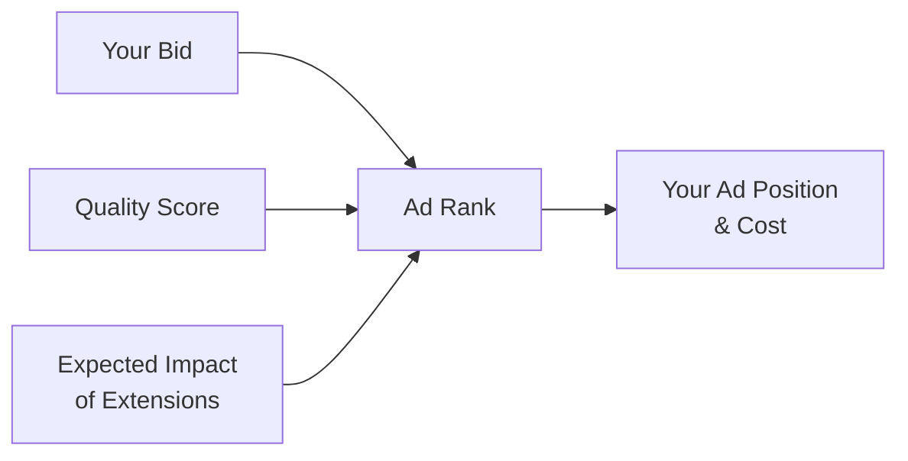
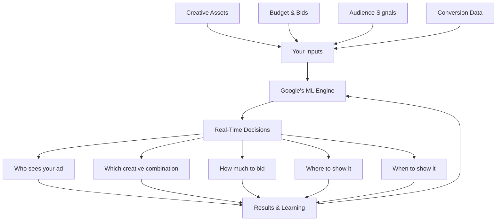
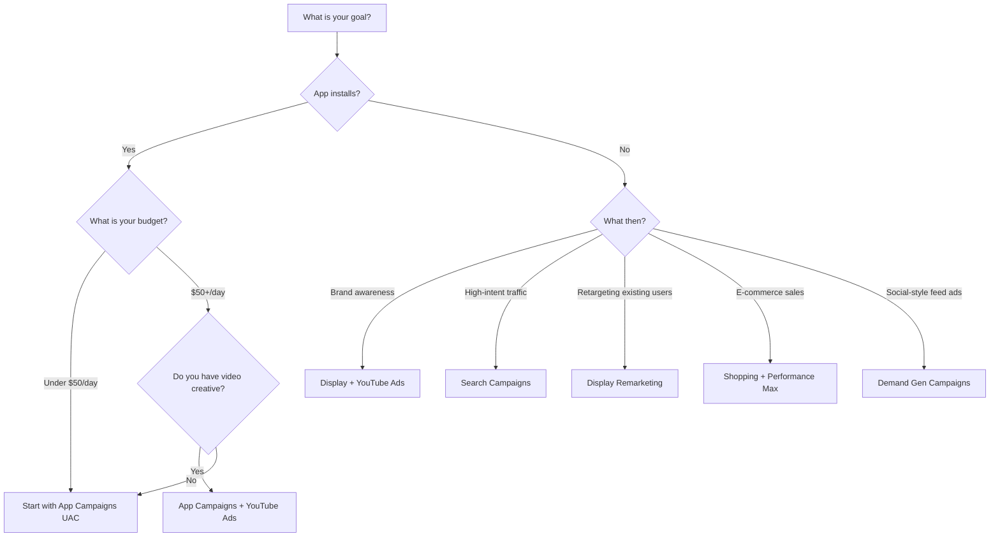
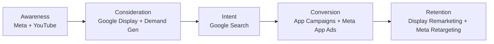

## The intent machine

Meta finds people who *might* want your app. Google finds people who are **actively looking for it.** That is the fundamental difference, and it is a powerful one.

When someone searches "best budget app" or "habit tracker for beginners," they are telling Google exactly what they need. Google Ads lets you show up at that exact moment. But Google is far more than just search -- it is an entire ecosystem of surfaces where your app can reach users across their entire digital life.

Think of it this way: Meta is like a billboard on a busy highway. People see it while doing something else. Google Search is like a salesperson who appears the exact moment someone walks into a store and says, "I need a habit tracker." That timing difference changes everything about how you advertise.

## Google's massive reach

Google Ads gives you access to essentially the entire internet. Here is the full picture of where your ads can appear:

<CardGroup cols={3}>
  <Card title="Google Search" icon="magnifying-glass">
    **8.5 billion searches per day.** People actively looking for solutions, products, and apps. The highest-intent traffic on the internet.
  </Card>
  <Card title="YouTube" icon="youtube">
    **2.5 billion monthly active users.** The world's second-largest search engine and the dominant video platform. People watch over 1 billion hours of video daily.
  </Card>
  <Card title="Google Play Store" icon="google-play">
    **2.5 billion active Android devices.** Your ads can appear directly inside the Play Store when people search for apps.
  </Card>
  <Card title="Gmail" icon="envelope">
    **1.8 billion users.** Ads appear in the Promotions and Social tabs, reaching people while they check email.
  </Card>
  <Card title="Google Display Network" icon="globe">
    **35 million+ websites and apps.** Covers over 90% of global internet users. Banner ads, interstitial ads, native ads -- everywhere.
  </Card>
  <Card title="Google Maps & Discover" icon="map">
    **1 billion+ Maps users.** Ads in Maps, the Discover feed on Android, and the Google app homepage.
  </Card>
</CardGroup>

<Tip>
  **No other advertising platform offers this breadth.** Meta gives you Facebook, Instagram, WhatsApp, and Messenger. Google gives you Search, YouTube, Gmail, Play Store, Maps, Discover, and 35 million partner websites. If someone is online, Google can reach them.
</Tip>

## How the Google Ads auction works

Every time someone searches on Google or visits a page with ad space, an auction happens in milliseconds. Understanding this auction is the key to paying less and getting more.

### The Ad Rank formula



**Ad Rank = Max Bid x Quality Score x Expected Impact of Ad Extensions**

This means you do not need the highest bid to win. A $2 bid with a Quality Score of 9 beats a $5 bid with a Quality Score of 3:

| Advertiser | Max Bid | Quality Score | Ad Rank | Position |
|-----------|---------|---------------|---------|----------|
| You | $2.00 | 9 | 18.0 | **1st** |
| Competitor A | $5.00 | 3 | 15.0 | 2nd |
| Competitor B | $3.00 | 4 | 12.0 | 3rd |

### What you actually pay

You do not pay your maximum bid. You pay the **minimum amount needed to maintain your position**, calculated as:

```
Actual CPC = (Ad Rank of advertiser below you / Your Quality Score) + $0.01
```

In the example above, you would pay roughly ($15.0 / 9) + $0.01 = **$1.68**, not your $2.00 max bid. Higher Quality Score literally saves you money on every click.

### Quality Score deep dive

Quality Score is Google's 1-10 rating of the overall quality and relevance of your keywords and ads. It is made up of three components:

<AccordionGroup>
  <Accordion title="Expected Click-Through Rate (CTR) -- approximately 40% weight">
    Google predicts how likely people are to click your ad when it appears for a given keyword. This is based on the historical performance of your ad (and all ads on Google) for that keyword.

    **How to improve it:**
    - Write compelling ad copy with strong calls to action
    - Include your target keyword in headlines
    - Use numbers and specifics ("500K+ users," "4.8-star rated")
    - Test multiple headline variations in Responsive Search Ads
    - Add all relevant ad extensions (sitelinks, callouts, structured snippets) to increase ad real estate
  </Accordion>
  <Accordion title="Ad Relevance -- approximately 25% weight">
    How closely your ad copy matches the intent behind the user's search query. If someone searches "meditation app for beginners" and your ad talks about "advanced mindfulness techniques," that is a mismatch.

    **How to improve it:**
    - Keep ad groups tightly themed (10-20 related keywords max)
    - Mirror the language of your keywords in your ad headlines
    - Create separate ad groups for different themes rather than mixing everything together
    - Match search intent: informational queries get educational ads, transactional queries get action-oriented ads
  </Accordion>
  <Accordion title="Landing Page Experience -- approximately 35% weight">
    How relevant, useful, and easy-to-navigate your landing page is for someone who clicked your ad. For app ads, this means your app store listing or website landing page.

    **How to improve it:**
    - Make sure the landing page matches the ad's promise
    - Mobile-friendly design is essential (most app searches are mobile)
    - Fast page load time (under 3 seconds)
    - Clear, relevant content that matches the search query
    - Easy-to-find download or action button
    - Minimize pop-ups and interstitials that frustrate users
  </Accordion>
</AccordionGroup>

<Tip>
  **Quality Score is the single most important lever in Google Ads.** An increase from 5 to 8 can reduce your cost-per-click by 37%. Focus on relevance first, then worry about bids and budgets.
</Tip>

### Quality Score impact on costs

Here is exactly how much Quality Score affects what you pay. These are approximate CPC discounts and premiums relative to a "neutral" Quality Score of 5:

| Quality Score | CPC Impact | What it means |
|---------------|-----------|---------------|
| 10 | -50% discount | You pay half the average CPC |
| 9 | -44% discount | Excellent. Your ads are extremely relevant |
| 8 | -37% discount | Very good. Keep doing what you are doing |
| 7 | -28% discount | Good. Room for improvement but solid |
| 6 | -17% discount | Slightly above average |
| 5 | Baseline | Average. No discount or premium |
| 4 | +25% premium | Below average. Needs work |
| 3 | +67% premium | Poor. You are overpaying significantly |
| 2 | +150% premium | Very poor. Pause and fix before spending more |
| 1 | +400% premium | Terrible. Your ad and keyword are badly mismatched |

<Warning>
  A Quality Score of 3 means you are paying 67% more per click than someone with a score of 5 for the same position. And a competitor with a Quality Score of 8 is paying 37% less. That difference compounds across thousands of clicks. Fix Quality Score before scaling budget.
</Warning>

## All Google Ads campaign types explained

Google offers eight major campaign types. Each one works differently and serves a different purpose. Here is the complete breakdown:

### 1. Search Campaigns

<Card title="Search Ads" icon="magnifying-glass">
  **What they are:** Text ads that appear at the top of Google Search results when someone types a query.

  **How they work:** You choose keywords. When people search those keywords, your text ad enters an auction. If you win, your ad appears above the organic results.

  **Best for:** Capturing high-intent users who are actively searching for what your app does. "Best habit tracker," "meditation app free," "budget planner download."

  **Typical cost:** $0.50 - $3.00 per click (varies hugely by industry)

  **Control level:** High -- you choose keywords, write ad copy, set bids per keyword.

  **Ad formats:** Responsive Search Ads (RSAs) with up to 15 headlines and 4 descriptions. Google mixes and matches to find the best combinations.
</Card>

### 2. Display Campaigns

<Card title="Display Ads" icon="image">
  **What they are:** Visual ads (images, banners, responsive ads) that appear across 35 million+ websites and apps in the Google Display Network.

  **How they work:** Instead of keywords, you target audiences (interests, demographics, behaviors) or content (topics, specific websites). Your visual ad appears while people browse the web.

  **Best for:** Brand awareness, retargeting people who visited your site/app but did not convert, reaching large audiences at low cost.

  **Typical cost:** $0.10 - $2.00 per click (much cheaper than Search, but lower intent)

  **Control level:** Medium -- you choose audiences and placements, but Google decides exactly where your ad appears within those parameters.

  **Ad formats:** Responsive display ads (provide images, headlines, descriptions and Google assembles them), uploaded image ads (you control exact design), and HTML5 ads for interactive experiences.
</Card>

### 3. Shopping Campaigns

<Card title="Shopping Ads" icon="cart-shopping">
  **What they are:** Product listing ads that show an image, title, price, and store name. They appear in Google Search, the Shopping tab, YouTube, and Display.

  **How they work:** You upload a product feed to Google Merchant Center. Google matches your products to relevant searches automatically (no keywords needed).

  **Best for:** E-commerce apps and physical products. Not directly useful for app installs, but essential if your app sells physical goods.

  **Typical cost:** $0.25 - $2.00 per click

  **Control level:** Medium -- you control the product feed and bids, but Google matches products to queries.

  **Ad formats:** Standard Shopping ads (single product) and Showcase Shopping ads (grouped products for broader queries).
</Card>

### 4. Video Campaigns (YouTube Ads)

<Card title="Video / YouTube Ads" icon="play">
  **What they are:** Video ads that play on YouTube and Google video partner sites. Multiple formats available.

  **How they work:** You upload a video ad to YouTube, then create a campaign targeting specific audiences, topics, channels, or keywords. You pay per view (CPV) or per impression (CPM) depending on the format.

  **Best for:** Brand storytelling, app demos, building awareness with a visual audience. YouTube is great for showing your app in action.

  **Typical cost:** $0.02 - $0.10 per view (for skippable ads, you only pay if someone watches 30 seconds or clicks)

  **Control level:** Medium-high -- you choose targeting, formats, and bidding. But creative quality matters enormously.
</Card>

**YouTube ad format breakdown:**

| Format | Duration | Skippable? | Payment | Best for |
|--------|---------|-----------|---------|----------|
| **Skippable In-Stream** | Any length | Skip after 5 sec | Pay per view (30 sec or click) | App demos, storytelling |
| **Non-Skippable In-Stream** | 15 seconds max | No | Pay per impression (CPM) | Short, punchy brand messages |
| **Bumper Ads** | 6 seconds max | No | Pay per impression (CPM) | Brand awareness, reach |
| **In-Feed Video** | Any length | N/A (click to play) | Pay per view | Discovery, consideration |
| **YouTube Shorts Ads** | Up to 60 seconds | Skip after a few sec | Pay per view or impression | Reaching younger audiences |

### 5. App Campaigns (Universal App Campaigns / UAC)

<Card title="App Campaigns" icon="mobile">
  **What they are:** Google's automated campaign type designed specifically for app installs and in-app actions. Your ads run across Search, Play Store, YouTube, Display, and Discover all at once.

  **How they work:** You provide text ideas, images, and videos. Google's AI creates ad combinations and decides where to show them. You set a target CPI (cost per install) or target CPA (cost per action), and Google handles the rest.

  **Best for:** App install campaigns. This is the go-to campaign type for most app developers. Google optimizes across all its properties to find the cheapest installs.

  **Typical cost:** $0.50 - $4.00 per install (varies by app category and geo)

  **Control level:** Low -- you give up control of targeting and placement. Google's AI runs the show. You control budget, target cost, and creative assets.
</Card>

<Note>
  **App Campaigns are "black box" by design.** You cannot choose keywords, audiences, or placements. This frustrates experienced advertisers, but for beginners, it is actually a feature -- Google does all the optimization. You focus on creative and budget.
</Note>

**App Campaign sub-types:**

| Sub-type | Optimizes for | When to use |
|----------|--------------|-------------|
| **App Installs** | Maximum installs at target CPI | Starting out, building user base |
| **App Engagement** | Re-engaging existing users | Bringing lapsed users back |
| **App Pre-registration** | Pre-registrations (Android only) | Before app launch |

### 6. Performance Max (PMax)

<Card title="Performance Max" icon="bolt">
  **What they are:** Google's newest, most automated campaign type. Like App Campaigns but for any business goal, not just app installs. Runs across ALL Google surfaces simultaneously.

  **How they work:** You provide "asset groups" (text, images, videos, audience signals). Google's AI distributes your ads across Search, Display, YouTube, Gmail, Maps, and Discover. It uses machine learning to find the best combination of creative, audience, and placement.

  **Best for:** Advertisers who want maximum reach with minimal management. Great for e-commerce and lead generation. For apps, App Campaigns are usually better.

  **Typical cost:** Varies widely depending on goal

  **Control level:** Very low -- even less control than App Campaigns. Google decides almost everything.
</Card>

### 7. Demand Gen Campaigns

<Card title="Demand Gen" icon="sparkles">
  **What they are:** Google's answer to Meta's feed-based ads. Visually rich ads that appear in YouTube (in-feed, Shorts), Discover, and Gmail. Designed to look like organic content.

  **How they work:** You provide images and videos. Google shows them in content feeds where people are browsing and discovering. Uses Google's audience data and lookalike segments (similar to Meta's Advantage+ audiences).

  **Best for:** Top-of-funnel awareness, reaching new audiences with scroll-stopping visual content. Best if you have strong creative assets (especially short-form video for YouTube Shorts).

  **Typical cost:** $0.50 - $3.00 per click

  **Control level:** Medium -- more creative control than PMax, less than standard Display.
</Card>

### 8. Discovery Campaigns (Legacy)

<Card title="Discovery Ads" icon="compass">
  **What they are:** The predecessor to Demand Gen campaigns. Discovery campaigns ran across Gmail, YouTube Home feed, and Discover. Google has migrated most Discovery campaigns to Demand Gen as of 2024.

  **Best for:** If you still have active Discovery campaigns, they continue to work. But for new campaigns, use Demand Gen instead.

  **Note:** Google automatically upgraded existing Discovery campaigns to Demand Gen. You cannot create new Discovery campaigns.
</Card>

## How Google's machine learning powers your campaigns

Google uses AI and machine learning at every level of its ad platform. Understanding this helps you work with the algorithm rather than against it.



**Key ML-powered features:**

| Feature | What it does | Your role |
|---------|-------------|-----------|
| **Smart Bidding** | Adjusts bids in real-time for every auction based on conversion probability | Set target CPA/ROAS, provide conversion data |
| **Responsive Search Ads** | Tests thousands of headline/description combinations | Provide diverse, high-quality headlines and descriptions |
| **Broad Match + Smart Bidding** | Expands keyword matching while keeping CPA on target | Monitor search terms report, add negatives |
| **Optimized Targeting** | Finds new audiences beyond your explicit targeting | Provide audience signals as starting points |
| **Auto-created Assets** | Generates ad copy and images from your landing page | Review and approve, turn off if quality is poor |

<Note>
  **The more conversion data you feed Google, the smarter it gets.** This is why tracking setup is so important, and why campaigns need a "learning period" of 2-3 weeks before you judge performance. Patience with the algorithm is critical.
</Note>

### Smart Bidding strategies overview

Smart Bidding is Google's suite of AI-powered bid strategies. Here is when to use each one:

| Strategy | What it does | Minimum data needed | Best for |
|----------|-------------|-------------------|----------|
| **Maximize Clicks** | Gets the most clicks within budget | None | Brand new campaigns, gathering data |
| **Maximize Conversions** | Gets the most conversions within budget | 15+ conversions in 30 days | Campaigns with conversion tracking ready |
| **Target CPA** | Gets conversions at your target cost-per-acquisition | 30+ conversions in 30 days | Campaigns with stable conversion data |
| **Target ROAS** | Gets conversions at your target return on ad spend | 50+ conversions in 30 days | E-commerce, revenue-focused campaigns |
| **Maximize Conversion Value** | Gets the most revenue within budget | 15+ conversions with values | Revenue optimization without a specific ROAS target |
| **Target Impression Share** | Ensures your ad appears a certain % of the time | None | Brand campaigns, competitive positioning |

<Tip>
  **The typical Smart Bidding progression for new accounts:**
  1. Start with **Maximize Clicks** (first 1-2 weeks, gathering data)
  2. Switch to **Maximize Conversions** (once tracking is verified)
  3. Move to **Target CPA** (once you have 30+ conversions and know your target)
  4. Graduate to **Target ROAS** (once you have revenue data flowing)
</Tip>

## Choosing the right campaign type for your app



<Tip>
  **For most app developers just starting with Google Ads, the recommended order is:**
  1. Start with **App Campaigns** (easiest, designed for installs)
  2. Add **Search Ads** (capture high-intent users searching for your app category)
  3. Add **Display Remarketing** (re-engage people who visited but did not install)
  4. Add **YouTube Ads** (once you have video creative)
  5. Experiment with **Demand Gen** (once you have strong visual/video assets)
</Tip>

## Google Ads vs. Meta Ads: when to use which

This is the question every app marketer asks. Here is a thorough comparison:

| Dimension | Google Ads | Meta Ads |
|-----------|-----------|---------|
| **Targeting model** | Keyword and intent-based (Search), audience-based (Display/YouTube) | Interest, behavior, and lookalike-based |
| **User mindset** | "I need something" (Search) or passive browsing (Display) | "I am scrolling through my feed" |
| **Best for apps** | Capturing people searching for your app category | Finding new audiences who do not know they need your app |
| **Creative focus** | Ad copy and keywords (Search), images (Display), video (YouTube) | Visual creative and short-form video |
| **Audience data** | Search queries, browsing behavior, YouTube history, app usage | Social graph, interests, on-platform behavior |
| **Learning curve** | Medium-high (many campaign types, keyword strategy needed) | Medium (simpler structure, creative-dependent) |
| **Minimum viable budget** | $10-20/day recommended | $5-10/day recommended |
| **Retargeting** | Strong (especially Display remarketing) | Very strong (pixel-based, custom audiences) |
| **iOS impact** | Less affected by ATT (Search is intent-based, not reliant on device tracking) | Significantly affected by iOS 14.5+ privacy changes |
| **Best first campaign** | App Campaigns (UAC) | Advantage+ App Campaigns |
| **Reporting depth** | Very detailed (keyword, placement, auction data) | Moderate (creative and audience level) |
| **Automation level** | Ranges from manual to fully automated | Mostly automated (Advantage+ suite) |

<Note>
  **You do not need to choose one or the other.** The best app growth strategies use both. Google captures demand (people searching for solutions). Meta creates demand (showing your app to people who did not know they wanted it). Together, they cover the full funnel.
</Note>

### When to prioritize Google Ads

- Your app solves a specific, searchable problem ("budget tracker," "meditation timer," "language learning")
- You are targeting Android users (Google Play integration is native)
- Your app category has significant search volume (check Google Keyword Planner)
- You want highly measurable, intent-driven results
- Your creative assets are limited (Search Ads only need text)
- You want granular control over keyword targeting and bids
- Your competitors are investing heavily in Meta (less competition on Google)

### When to prioritize Meta Ads

- Your app is new and people do not know to search for it yet
- Your app is best shown, not described (visual-first products)
- You have strong creative (video, images) but limited keyword ideas
- You are targeting iOS users primarily
- Your app creates a new category that people do not yet search for
- You want to scale quickly with broad targeting and lookalike audiences

### Using both platforms together

The most effective strategy uses Google and Meta together across the funnel:



## Account structure recommendations

How you organize your Google Ads account has a big impact on performance. Here is the recommended structure for app advertisers:

```
Google Ads Account
├── Campaign: Brand Search
│   └── Ad Group: Brand keywords ("[your app name]", "[your app name] app")
├── Campaign: Non-Brand Search (Category)
│   ├── Ad Group: Feature 1 ("habit tracker app", "daily habit tracker")
│   ├── Ad Group: Feature 2 ("meditation app", "guided meditation")
│   └── Ad Group: Feature 3 ("productivity app", "daily planner")
├── Campaign: Non-Brand Search (Competitor)
│   ├── Ad Group: Competitor 1 ("[competitor] alternative")
│   └── Ad Group: Competitor 2 ("[competitor] vs")
├── Campaign: App Campaign - Tier 1 (US, UK, CA, AU)
│   └── Automated by Google
├── Campaign: App Campaign - Tier 2 (EU, LATAM)
│   └── Automated by Google
├── Campaign: App Campaign - Tier 3 (SEA, India)
│   └── Automated by Google
├── Campaign: Display Remarketing
│   ├── Ad Group: Website visitors (did not install)
│   └── Ad Group: Lapsed app users
├── Campaign: YouTube Awareness
│   ├── Ad Group: In-market audiences
│   └── Ad Group: Custom intent audiences
└── Campaign: Demand Gen
    ├── Asset Group: Feature-focused creative
    └── Asset Group: Social-proof creative
```

<Warning>
  **Do not put everything in one campaign.** Each campaign type (Search, Display, App, Video) should be separate because they have different bidding strategies, budgets, and optimization levers. Mixing them together makes it impossible to optimize effectively.
</Warning>

## Budget guidelines by business type

How much should you spend? Here are realistic starting budgets:

<Tabs>
  <Tab title="Bootstrapped / Solo Developer">
    **Monthly budget:** $300 - $1,000

    **Recommended setup:**
    - 1 App Campaign at $10-15/day
    - 1 Brand Search campaign at $5/day (protect your brand name)
    - Focus all effort on App Campaigns since they are the most automated and forgiving for beginners

    **Goal:** Validate that paid acquisition works for your app before investing more.
  </Tab>
  <Tab title="Funded Startup">
    **Monthly budget:** $3,000 - $15,000

    **Recommended setup:**
    - App Campaigns: $50-100/day (split by geo tier)
    - Non-Brand Search: $30-50/day
    - Brand Search: $10-20/day
    - Display Remarketing: $15-30/day
    - YouTube (if you have video): $20-40/day

    **Goal:** Find your best-performing channels and scale them. Build enough conversion data for Smart Bidding to work well.
  </Tab>
  <Tab title="Growth-Stage Company">
    **Monthly budget:** $15,000 - $100,000+

    **Recommended setup:**
    - Full campaign structure (all types above)
    - Separate campaigns per geo market
    - Demand Gen and Performance Max experiments
    - Dedicated budget for creative testing
    - Consider Google Ads scripts for automation

    **Goal:** Maximize profitable volume. Optimize ROAS across the full account. Expand to new markets and campaign types.
  </Tab>
</Tabs>

<Tip>
  **The minimum daily budget for any campaign should be at least 10x your target CPA.** If your target CPI is $2, your daily budget should be at least $20. This gives Google enough room to learn and optimize. Budgets below this threshold cause the algorithm to struggle.
</Tip>

## Cost benchmarks by app category

| App Category | Search CPC | App Campaign CPI | Display CPC | YouTube CPV |
|-------------|------------|-------------------|-------------|-------------|
| **Finance / Banking** | $2.00 - $8.00 | $3.00 - $8.00 | $0.50 - $2.00 | $0.03 - $0.08 |
| **E-commerce / Shopping** | $1.00 - $4.00 | $1.50 - $5.00 | $0.30 - $1.50 | $0.02 - $0.06 |
| **Health & Fitness** | $0.80 - $3.00 | $1.00 - $4.00 | $0.20 - $1.00 | $0.02 - $0.05 |
| **Education / Learning** | $0.50 - $2.50 | $0.80 - $3.00 | $0.15 - $0.80 | $0.02 - $0.05 |
| **Games** | $0.30 - $2.00 | $0.50 - $3.00 | $0.10 - $0.60 | $0.01 - $0.04 |
| **Productivity / Utilities** | $0.50 - $2.00 | $0.50 - $2.50 | $0.15 - $0.80 | $0.02 - $0.05 |
| **Social / Dating** | $0.80 - $3.00 | $1.50 - $5.00 | $0.20 - $1.00 | $0.02 - $0.06 |
| **Travel** | $1.00 - $4.00 | $1.50 - $5.00 | $0.30 - $1.50 | $0.03 - $0.07 |

<Warning>
  These are rough benchmarks for 2025-2026. Actual costs depend on your targeting, geographic market, competition, Quality Score, and time of year. Finance and insurance are historically the most expensive categories. Gaming tends to be the cheapest for installs but hardest for retention.
</Warning>

## What to expect: realistic timeline

| Timeline | What happens | Your focus |
|----------|-------------|------------|
| **Day 1-3** | Account setup, conversion tracking, first campaign launched | Get everything configured correctly |
| **Week 1** | Google's algorithm starts learning. Costs may be high and unstable | Do not change anything. Let it learn |
| **Week 2-3** | Algorithm identifies which queries, placements, and audiences convert | Review search terms, add negative keywords |
| **Week 4** | Data stabilizes. You can start making informed optimization decisions | Optimize bids, pause poor keywords, refresh creative |
| **Month 2** | Enough data to test additional campaign types | Add Search or Display if you started with App Campaigns |
| **Month 3+** | Steady-state optimization. Incremental improvements | A/B test ads, expand geo targeting, scale budget on winners |

<Note>
  **The learning period is real.** Resist the urge to make changes during the first 1-2 weeks. Every time you make a significant change (budget, bidding strategy, targeting), Google re-enters a learning period. Constant tinkering actually hurts performance.
</Note>

## Key Google Ads terminology glossary

If you are new to Google Ads, here are the terms you will see constantly:

<AccordionGroup>
  <Accordion title="Campaign, Ad Group, Ad, Keyword -- the hierarchy">
    - **Campaign:** The top-level container. Sets budget, bidding strategy, targeting settings, and campaign type.
    - **Ad Group:** A sub-container within a campaign. Groups related keywords and ads together.
    - **Ad:** The actual creative (text, image, or video) that users see.
    - **Keyword:** The search terms you want to trigger your ads (Search campaigns only).

    Think of it like: Campaign = a store, Ad Group = a department in the store, Ad = a product display, Keyword = the sign pointing customers to that department.
  </Accordion>
  <Accordion title="Match Types -- how keywords trigger ads">
    - **Exact Match** `[habit tracker]`: Ad shows only for this exact query (or very close variants). Most precise, lowest volume.
    - **Phrase Match** `"habit tracker"`: Ad shows when the query contains this phrase. Medium precision, medium volume.
    - **Broad Match** `habit tracker`: Ad shows for any query Google considers related. Least precise, highest volume. Best used with Smart Bidding.
  </Accordion>
  <Accordion title="Conversion, Conversion Window, Attribution">
    - **Conversion:** A valuable action (app install, sign-up, purchase) that you have defined and are tracking.
    - **Conversion Window:** How long after a click Google will credit that click for a conversion. Default is 30 days.
    - **Attribution Model:** How Google distributes credit for a conversion across multiple touchpoints. "Last click" gives all credit to the last ad clicked. "Data-driven" uses ML to distribute credit.
  </Accordion>
  <Accordion title="Impression Share, Lost IS, Search Terms">
    - **Impression Share:** The percentage of times your ad was shown out of the total times it was eligible to show.
    - **Lost IS (Budget):** Impressions you missed because your budget ran out.
    - **Lost IS (Rank):** Impressions you missed because your Ad Rank was too low.
    - **Search Terms:** The actual words people typed that triggered your ad (different from keywords, which are what you target).
  </Accordion>
</AccordionGroup>

## What you will learn in this section

<Steps>
  <Step title="Set up your account">
    Create your Google Ads account the right way, link your app, configure billing, and set up proper account structure. Avoid the Smart Mode trap.
  </Step>
  <Step title="Install conversion tracking">
    Set up Firebase SDK, import conversions to Google Ads, install Google Tag for web, and verify everything works with DebugView.
  </Step>
  <Step title="Launch Search Ads">
    Research keywords, write Responsive Search Ads, structure ad groups, set up negative keywords, and choose the right bidding strategy.
  </Step>
  <Step title="Launch Display Ads">
    Create visual ads, set up audience targeting, configure remarketing, and manage placements for brand safety.
  </Step>
  <Step title="Optimize everything">
    Read reports, improve Quality Score, refine keywords, A/B test ads, and scale your winning campaigns.
  </Step>
</Steps>

<Card
  title="Google Ads Account Setup"
  icon="arrow-right"
  href="/platforms/google/account-setup"
>
  Let's set up your Google Ads account the right way -- avoiding the common traps that waste beginners' money.
</Card>
