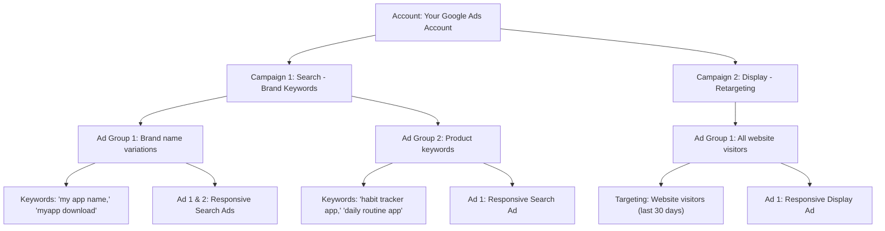

## Welcome to Google Ads

If Meta advertising is like putting up a billboard on a busy highway, Google Ads is like having a salesperson appear at the exact moment someone walks into a store and says, "I need help finding something." That timing difference is what makes Google Ads so powerful.

When someone types "best habit tracker app" into Google, they are telling you exactly what they want. With Google Ads, you can show up at that precise moment with exactly the right answer. No guessing, no hoping they will notice your ad while scrolling through their feed — they are actively looking for what you offer.

This guide will walk you through everything you need to know about Google Ads before you create your first campaign. We will cover what Google Ads is, how it works, what types of campaigns exist, and how to decide if Google is right for your goals.

<Tip>
Google Ads and Meta Ads are not competitors — they are complementary tools. Meta is great at finding people who might want your product (discovery). Google is great at reaching people who are already looking for it (intent). The best advertising strategies use both platforms together.
</Tip>

---

## Why Google Ads? The Big Picture

Google is the dominant search engine, handling roughly **8.5 billion searches per day**. But Google Ads is not just about search — it is an entire ecosystem of advertising surfaces that covers almost every corner of the internet.

### Google's Massive Reach

<CardGroup cols={3}>
  <Card title="Google Search" icon="magnifying-glass">
    **8.5 billion searches per day.** People actively looking for solutions, products, and apps. The highest-intent traffic on the internet.
  </Card>
  <Card title="YouTube" icon="play">
    **2.5 billion monthly active users.** The world's second-largest search engine and the dominant video platform. People watch over 1 billion hours of video daily.
  </Card>
  <Card title="Google Display Network" icon="globe">
    **Reaches 90%+ of internet users worldwide.** Your ads can appear on over 2 million websites and 650,000 apps.
  </Card>
  <Card title="Gmail" icon="envelope">
    **1.8 billion users.** Ads appear in the Promotions and Social tabs, reaching people while they check email.
  </Card>
  <Card title="Google Play Store" icon="mobile">
    **2.5 billion active Android devices.** Your ads can appear directly inside the Play Store when people search for apps.
  </Card>
  <Card title="Google Maps" icon="map">
    **1 billion monthly users.** Local ads can appear when people search for businesses nearby.
  </Card>
</CardGroup>

### What Makes Google Ads Special

#### 1. Intent-Based Advertising

This is Google's superpower. When someone searches for "best project management tool," they are not casually browsing — they are actively trying to solve a problem. Your ad appears at the exact moment they are ready to take action. This intent makes Google Search clicks incredibly valuable compared to other advertising platforms.

#### 2. You Only Pay When People Click

With Google Search Ads, you use a **pay-per-click (PPC)** model. You only pay when someone actually clicks on your ad. If 1,000 people see your ad but nobody clicks, you pay nothing. This makes Google Ads very efficient — you are only paying for actual interest.

#### 3. Transparent Pricing

Google Ads shows you exactly what you are paying for. You can see your cost per click, cost per conversion, and return on investment for every single keyword and ad. This transparency makes it easy to know what is working and what is not.

#### 4. Scalable Budget

Google recommends **$10–$50 per day** for beginners, but you can start with less. There is no minimum spend requirement. You set a daily budget, and Google will never exceed your monthly budget (daily budget x 30.4).

#### 5. Measurable Results

With Google's conversion tracking (using Google Tag, also known as gtag.js), you can track exactly what happens after someone clicks your ad. Every conversion, every purchase, every sign-up can be measured and attributed to specific keywords and ads.

<Tip>
Google Ads has a steeper learning curve than Meta Ads because there are more campaign types and settings to understand. But do not let that intimidate you — this guide series will walk you through everything step by step. And the payoff is worth it: Google Search Ads often have the highest return on investment of any advertising channel because you are reaching people with active intent.
</Tip>

---

## How Google Ads Works: The Ad Auction

Every time someone searches on Google, an automated auction happens in milliseconds to decide which ads appear. Understanding this auction helps you create better campaigns.

### The Three Factors That Determine Your Ad Position:

#### 1. Your Bid

This is the maximum amount you are willing to pay for a click on your ad. If you bid $2.00, you are telling Google "I will pay up to $2.00 for someone to click my ad." In practice, you usually pay less than your maximum bid.

#### 2. Quality Score

Quality Score is a rating from **1 to 10** that Google assigns to each of your keywords. It measures how relevant and useful your ad and landing page are to the person searching. Quality Score is based on three components:

- **Expected Click-Through Rate (CTR):** How likely people are to click your ad when it appears
- **Ad Relevance:** How closely your ad matches the intent behind the search query
- **Landing Page Experience:** How useful and relevant your landing page is after someone clicks

A high Quality Score (7-10) means your ad is relevant and useful. A low Quality Score (1-4) means Google thinks your ad is not a good match for the search.

**Why Quality Score matters enormously:**
- Higher Quality Score = lower cost per click (Google rewards relevance)
- Higher Quality Score = better ad positions (you can appear above competitors who bid more)
- A keyword with a Quality Score of 9 might cost $1 per click, while the same keyword with a Quality Score of 3 might cost $4 per click

#### 3. Ad Extensions (Now Called "Assets")

Ad extensions (additional links, phone numbers, callouts, etc.) improve your ad's visibility and clickability. Google factors these into its auction calculations. More extensions generally improve your chances of winning the auction.

### How the Auction Actually Works:

```
Advertiser A: Bid $3.00 x Quality Score 5 = Ad Rank 15
Advertiser B: Bid $2.00 x Quality Score 8 = Ad Rank 16  ← Winner!
Advertiser C: Bid $4.00 x Quality Score 3 = Ad Rank 12
```

Notice that Advertiser B wins despite having the second-lowest bid. Their higher Quality Score (8) more than compensates for their lower bid. This is why Quality Score optimization is so important — it literally saves you money on every click.

<Tip>
Quality Score is the single most important concept in Google Ads. It determines how much you pay per click and where your ad appears. The best way to improve Quality Score is to make sure your keywords, ad copy, and landing page all tell the same story. If someone searches for "habit tracker app," your ad should say "habit tracker app" and your landing page should be about your habit tracker app. Consistency is key.
</Tip>

---

## Google Ads Campaign Types

Google offers several campaign types, each designed for different goals and reaching different surfaces. Here is every campaign type explained.

### 1. Search Campaigns

**Where ads appear:** At the top and bottom of Google Search results pages

**How it works:** You choose keywords that trigger your ad. When someone searches for those keywords, your ad appears.

**Best for:**
- Products and services people actively search for
- High-intent traffic (people ready to take action)
- Lead generation
- App promotion when people search for related terms

**Example:** You sell a budget tracking app. You bid on keywords like "best budget app," "expense tracker," and "money management app." When someone searches these terms, your ad appears at the top of the results.

**Cost:** Pay-per-click. Average CPC varies widely by industry ($1-$5 for most, but can be $20+ in competitive industries like insurance or legal).

### 2. Display Campaigns

**Where ads appear:** On over 2 million websites and 650,000 apps in the **Google Display Network** (GDN), which reaches **90%+ of internet users** worldwide.

**How it works:** Instead of keywords, you target audiences based on demographics, interests, or the types of websites they visit. Your ads appear as banners, images, or text on participating websites and apps.

**Best for:**
- Brand awareness campaigns
- Reaching people who do not know about your product yet
- Retargeting (showing ads to people who visited your website)
- Visual product advertising

**Example:** Your display ad for a fitness app appears on health and wellness blogs, fitness forums, and workout-related apps.

**Cost:** Usually lower CPC than Search (often $0.50-$2.00) but lower intent, so conversion rates are also lower.

### 3. Video Campaigns (YouTube)

**Where ads appear:** On YouTube — before, during, or after videos, in search results, and on the YouTube homepage.

**How it works:** You create video ads and target them based on demographics, interests, keywords, or specific YouTube channels.

**Best for:**
- Brand storytelling
- Product demonstrations
- App previews and tutorials
- Reaching younger audiences

**Ad formats include:**
- **Skippable in-stream ads** — Play before/during a video, viewer can skip after 5 seconds
- **Non-skippable in-stream ads** — 15-second ads that must be watched
- **Bumper ads** — 6-second non-skippable ads
- **Discovery ads** — Appear in YouTube search results and recommendations

### 4. Shopping Campaigns

**Where ads appear:** At the top of Google Search results with product images, prices, and store names.

**How it works:** Instead of keywords, you upload a product data feed from your online store. Google matches your products to relevant searches.

**Best for:**
- E-commerce businesses with physical or digital products
- Product-based advertising with images and prices
- Driving purchases directly from search results

### 5. App Campaigns

**Where ads appear:** Across Google Search, Google Play, YouTube, Gmail, and the Display Network — automatically.

**How it works:** You provide a few text ideas, images, and videos, and Google's AI automatically creates ad combinations and places them across all Google properties.

**Best for:**
- Driving app installs
- Re-engaging existing app users
- Promoting in-app actions

**What makes it unique:** App campaigns are the most automated campaign type. You do not choose keywords or placements — Google handles everything. You just set a target cost per install and a budget, and Google does the rest.

### 6. Performance Max Campaigns

**Where ads appear:** Across ALL Google properties — Search, Display, YouTube, Gmail, Maps, and Discover — in a single campaign.

**How it works:** You provide creative assets (text, images, videos), audience signals, and a goal. Google's AI creates and places ads across every available surface.

**Best for:**
- Advertisers who want maximum reach across all Google properties
- E-commerce businesses with product feeds
- Campaigns where you trust Google's AI to optimize delivery

**Important note:** Performance Max gives you less control over where your ads appear and who sees them. It is very powerful but can be a "black box" — you get results but limited visibility into what is driving them.

### 7. Demand Gen Campaigns

**Where ads appear:** YouTube, YouTube Shorts, Gmail, and the Google Discover feed.

**How it works:** You create visually engaging ads (similar to social media ads) that appear in Google's discovery and entertainment surfaces.

**Best for:**
- Top-of-funnel awareness
- Visually rich product advertising
- Reaching people in a browsing/discovery mindset (similar to Meta's approach)

<Tip>
If you are new to Google Ads, start with a **Search campaign**. It is the most straightforward campaign type, gives you the most control, and targets the highest-intent users. Once you are comfortable with Search, expand to Display for retargeting, and then explore other campaign types. Trying to learn all campaign types at once is overwhelming — master one at a time.
</Tip>

---

## Key Concepts You Need to Know

### Google Ads Account Structure

Google Ads is organized in three levels (similar to Meta):



- **Account:** Your top-level container. One per business is typical.
- **Campaign:** Where you set campaign type, budget, and targeting settings.
- **Ad Group:** Groups related keywords and ads together. Each ad group should focus on one theme.
- **Keywords/Targeting:** What triggers your ads (keywords for Search, audiences for Display).
- **Ads:** The actual ad text or creative people see.

### Google Ads URL

You manage everything at **[ads.google.com](https://ads.google.com)**. Bookmark this — it is where you will spend most of your time.

### Keyword Match Types

When you choose keywords for Search campaigns, you also choose how closely someone's search must match your keyword:

- **Broad Match:** Your ad may show for related searches. Keyword "running shoes" might trigger for "best sneakers for jogging"
- **Phrase Match:** Your ad shows for searches that include the meaning of your keyword. Written as "running shoes" (in quotes)
- **Exact Match:** Your ad shows only for searches that have the same meaning as your keyword. Written as [running shoes] (in brackets)

### Google Tag (gtag.js)

Google Tag is the tracking code you place on your website to measure conversions. It is Google's equivalent of Meta Pixel. We will cover installation in the Conversion Tracking guide.

### Google Keyword Planner

A free tool (included with any Google Ads account) that helps you:
- Discover new keywords related to your business
- See estimated search volume for keywords
- Get bid estimates for keywords
- Find keyword ideas you might not have thought of

<Tip>
Google Keyword Planner is **free** as long as you have a Google Ads account (you do not even need to run ads to use it). It is one of the most valuable tools in digital marketing. Even if you decide not to run Google Ads right away, use Keyword Planner to research what people are searching for — this information is useful for your website content, blog strategy, and even your Meta ad copy.
</Tip>

---

## Google Ads vs. Meta Ads: When to Use Each

| Factor | Google Ads | Meta Ads |
|---|---|---|
| **User intent** | High — people are searching for solutions | Low — people are scrolling and socializing |
| **Best for** | Capturing existing demand | Creating new demand |
| **Targeting** | Keywords (what people search) | Interests, behaviors, demographics (who people are) |
| **Ad formats** | Mostly text (Search), images (Display), video (YouTube) | Images, video, carousel, stories, reels |
| **Minimum budget** | No minimum (recommend $10-$50/day) | $5/day minimum (recommend $10-$20/day) |
| **Learning curve** | Steeper | Easier for beginners |
| **Best ROI for** | Products people search for | Products people discover |
| **Retargeting** | Good (Display Network) | Excellent (multiple placements) |

### Use Google Ads When:

- People are actively searching for what you offer
- You want to capture high-intent traffic
- You want to appear above organic search results
- You have a product or service with clear search demand
- You want to target specific keywords and search queries

### Use Meta Ads When:

- People do not know they need your product yet
- You want to build brand awareness with visual content
- You want to reach people based on who they are (not what they search)
- You have strong visual assets (images, videos)
- You want to use Lookalike Audiences to find similar customers

### Use Both When (Recommended):

- You want a complete marketing funnel (Meta for awareness, Google for capture)
- You want to maximize your reach across the internet
- You have the budget to support both platforms
- You want to retarget across multiple platforms

---

## What You Will Learn Next

Now that you understand what Google Ads is and how it works, here is what we will cover in the following guides:

1. **Account Setup** — How to create your Google Ads account, avoid Smart Mode, configure billing, and set up your account structure.

2. **Conversion Tracking** — How to install Google Tag on your website and set up conversion tracking to measure results.

3. **Search Ads** — A complete step-by-step guide to creating your first Search campaign, including keyword research, ad writing, and Quality Score optimization.

4. **Display Ads** — How to create Display campaigns for brand awareness and retargeting, including image specs and targeting options.

5. **Optimization** — Advanced strategies for improving your Google Ads performance, including bid management, negative keywords, and A/B testing.

Each guide builds on the previous one. By the end, you will have the knowledge and confidence to run profitable Google Ads campaigns alongside your Meta campaigns.

---

## Quick Reference

| Detail | Value |
|---|---|
| Google Ads URL | [ads.google.com](https://ads.google.com) |
| Recommended starting budget | $10–$50/day |
| Quality Score range | 1–10 |
| Google Display Network reach | 90%+ of internet users |
| Conversion tracking | Google Tag (gtag.js) |
| Keyword research tool | Google Keyword Planner (free with account) |
| Billing model (Search) | Pay-per-click (CPC) |
| Campaign types | Search, Display, Video, Shopping, App, Performance Max, Demand Gen |

---

## Common Google Ads Terms You Will See

Before moving on, here is a glossary of common terms you will encounter throughout the Google Ads guides:

| Term | Meaning |
|---|---|
| **CPC (Cost Per Click)** | The amount you pay each time someone clicks your ad |
| **CPM (Cost Per Mille)** | The cost per 1,000 impressions (views) of your ad |
| **CTR (Click-Through Rate)** | The percentage of people who click your ad after seeing it. Formula: Clicks / Impressions x 100 |
| **Impression** | One instance of your ad being shown to someone |
| **Conversion** | A valuable action someone takes after clicking your ad (purchase, sign-up, etc.) |
| **CPA (Cost Per Acquisition)** | The average cost to get one conversion. Formula: Total cost / Number of conversions |
| **ROAS (Return On Ad Spend)** | Revenue generated divided by ad spend. A 3x ROAS means $3 revenue per $1 spent |
| **Quality Score** | Google's 1-10 rating of your keyword/ad/landing page relevance and quality |
| **Ad Rank** | Your position in the ad auction, determined by bid x Quality Score x extensions |
| **Impression Share** | The percentage of available impressions your ad actually received |
| **Search Terms** | The actual words people typed into Google that triggered your ad |
| **Negative Keywords** | Words that prevent your ad from showing (e.g., "free" if you sell a paid product) |
| **Ad Assets** | Extra information added to your ad (sitelinks, callouts, phone numbers, etc.) |
| **Smart Bidding** | Google's automated bidding strategies that use machine learning |
| **Landing Page** | The web page someone arrives at after clicking your ad |
| **Ad Group** | A container within a campaign that groups related keywords and ads together |
| **GDN** | Google Display Network — the 2 million+ websites and 650,000 apps where Display Ads appear |

<Tip>
You do not need to memorize all these terms right now. Bookmark this page and come back to it whenever you encounter an unfamiliar term in the other guides. As you start running campaigns, these terms will become second nature very quickly.
</Tip>

---

## Summary

Google Ads gives you access to the highest-intent traffic on the internet — people who are actively searching for solutions. With Search campaigns, you appear at the exact moment someone is looking for what you offer. With Display and YouTube campaigns, you can reach over 90% of internet users for brand awareness and retargeting.

The key things to remember:

- **The ad auction** considers your bid, Quality Score, and ad extensions — not just money
- **Quality Score (1-10)** is crucial — higher scores mean lower costs and better positions
- **Start with Search campaigns** for the highest-intent traffic
- **Google Keyword Planner** is free and invaluable for keyword research
- **Google Ads and Meta Ads work best together** — use Meta for discovery and Google for capture

The most important takeaway: Google Ads rewards relevance. The more relevant your ads and landing pages are to what people are searching for, the less you pay and the better you perform. This principle — relevance over budget — is what makes Google Ads accessible to businesses of all sizes.

Ready to get started? Head to the **Account Setup** guide to create your Google Ads account.
