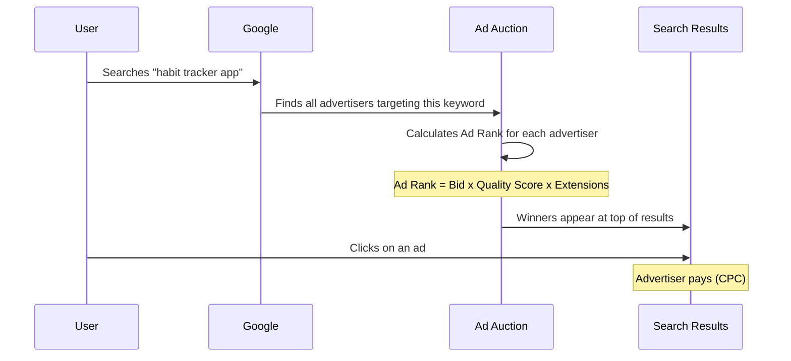
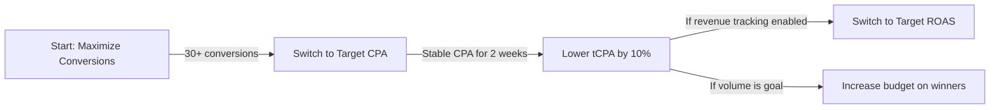

## Catch people at the moment of need

Search Ads are the original Google ad format, and they're still one of the most effective. When someone types "best meditation app" into Google, your ad can be the first thing they see. That's **intent-based advertising** at its finest -- you're not interrupting people, you're answering their question.

## How Search Ads work

Here's what happens in milliseconds every time someone searches on Google:



### What you pay and why

You only pay when someone **clicks** your ad (Cost Per Click / CPC). Impressions (people seeing your ad) are free. Your actual CPC is usually less than your maximum bid because you only pay the minimum needed to beat the advertiser below you.

**Key factors that determine your cost:**

| Factor | Impact | You control? |
|--------|--------|-------------|
| **Keyword competition** | More advertisers bidding = higher cost | No (market-driven) |
| **Quality Score** | Higher score = lower CPC | Yes (relevance + ad quality) |
| **Your max bid** | Your ceiling for what you'll pay | Yes |
| **Ad Rank thresholds** | Google's minimum quality bar | No (Google-set) |
| **Search context** | Device, location, time of day, other signals | Partially (bid adjustments) |

## Keyword research: the foundation of Search Ads

Keywords are the words and phrases you tell Google to target. When someone's search matches your keyword, your ad is eligible to appear. Choosing the right keywords is the single most important decision in Search Ads.

### Where to find keywords

<Steps>
  <Step title="Google Keyword Planner (free, built into Google Ads)">
    Go to **Tools & Settings** > **Planning** > **Keyword Planner**.

    Two options:
    - **Discover new keywords:** Enter words related to your app. Google suggests related keywords with search volume and competition data.
    - **Get search volume and forecasts:** Enter keywords you already have in mind and see estimated traffic.

    **What to look for:**
    - Monthly search volume (higher = more traffic potential)
    - Competition level (low/medium/high)
    - Suggested bid (gives you a cost estimate)
    - Trends (is search volume growing or shrinking?)
  </Step>
  <Step title="Google Search autocomplete">
    Go to Google and start typing your app's category. The autocomplete suggestions are real search queries that people frequently use. These are gold.

    Example: Type "habit tracker" and you might see:
    - habit tracker app
    - habit tracker app free
    - habit tracker for students
    - habit tracker with reminders
    - habit tracker that works

    Each of these is a potential keyword.
  </Step>
  <Step title="Google 'People Also Ask' and 'Related Searches'">
    Search for your main keyword and scroll down. Google shows:
    - **"People Also Ask"** boxes with common questions
    - **"Related searches"** at the bottom of the page

    These reveal how people think about your app category and what language they use.
  </Step>
  <Step title="Competitor research">
    Search for your competitors' app names. Look at:
    - What ads appear? (These are their keywords)
    - What language do they use in ad copy?
    - What keywords do they rank for organically?

    You can also use tools like **SpyFu**, **SEMrush**, or **Ahrefs** (paid) to see competitors' keywords.
  </Step>
  <Step title="App Store search suggestions">
    Go to the App Store or Google Play and start typing your app category. The suggestions show what people search for when looking for apps specifically.
  </Step>
  <Step title="Your own analytics">
    If you have a website or existing app:
    - **Google Search Console** shows what queries people use to find your site
    - **Firebase Analytics** shows search terms that led to installs
    - **Customer support tickets** reveal the language your users use
  </Step>
</Steps>

### Keyword strategy for apps

Organize your keywords into four intent-based categories:

| Category | Examples | Intent Level | Expected CPC | Expected Conversion Rate |
|----------|---------|-------------|-------------|------------------------|
| **Brand** | "yourapp," "yourapp download" | Highest | Lowest ($0.10-0.50) | Highest (20-40%) |
| **Direct / Product** | "habit tracker app," "download habit app" | Very High | Medium ($0.50-2.00) | High (10-20%) |
| **Problem / Solution** | "how to build habits," "stop procrastinating app" | High | Medium ($0.50-2.00) | Medium (5-15%) |
| **Competitor** | "[competitor] alternative," "apps like [competitor]" | High | Higher ($1.00-3.00) | Medium (5-15%) |
| **Category / Broad** | "best productivity apps," "top self-improvement apps" | Medium | Lower ($0.30-1.50) | Lower (3-8%) |

<Tip>
  **Start with Brand + Direct keywords.** These are the easiest wins because people are already looking for what you offer. Expand to Problem and Competitor keywords after you have baseline data. Save Category keywords for when you have budget to spare.
</Tip>

## Match types explained

Match types control how loosely or strictly Google matches your keyword to actual search queries. This is one of the most important concepts in Search Ads.

### The three match types

<AccordionGroup>
  <Accordion title="Exact Match [brackets] — Most restrictive">
    **Syntax:** `[habit tracker app]`

    **Shows your ad for:** The exact keyword and very close variants (misspellings, plurals, reordering).

    **Examples of matching queries:**
    - "habit tracker app" (exact)
    - "habit tracking app" (close variant)
    - "app habit tracker" (reordering)
    - "habit tracker apps" (plural)

    **Does NOT match:**
    - "best habit tracker app" (added word)
    - "free habit tracker" (missing word "app")
    - "daily routine tracker" (different meaning)

    **Best for:** Your highest-value, most proven keywords. Maximum control, but lowest reach.
  </Accordion>
  <Accordion title="Phrase Match &quot;quotes&quot; — Medium restrictive">
    **Syntax:** `"habit tracker app"`

    **Shows your ad for:** Searches that include the meaning of your keyword. Can include words before or after, and can match related meanings.

    **Examples of matching queries:**
    - "habit tracker app" (exact)
    - "best habit tracker app" (added word before)
    - "habit tracker app free download" (added words after)
    - "habit tracking application" (same meaning)
    - "app to track my habits" (same meaning, different wording)

    **Does NOT match:**
    - "daily routine planner" (different enough meaning)
    - "habit breaker app" (opposite intent)

    **Best for:** Your primary keywords. Good balance of reach and relevance.
  </Accordion>
  <Accordion title="Broad Match — Least restrictive (no symbols)">
    **Syntax:** `habit tracker app`

    **Shows your ad for:** Any search that Google considers related to your keyword, even loosely. Google uses AI to determine relevance.

    **Examples of matching queries:**
    - "habit tracker app" (exact)
    - "best daily routine app" (related concept)
    - "productivity tools for building habits" (loosely related)
    - "self improvement app" (broader category)
    - "how to be more disciplined" (very broad interpretation)

    **Best for:** Maximum reach. Works well with Smart Bidding (Target CPA / ROAS) because Google's AI filters for converting queries. Risky without Smart Bidding because you'll pay for a lot of irrelevant clicks.
  </Accordion>
</AccordionGroup>

### Match type strategy for beginners

| Phase | Recommended approach |
|-------|---------------------|
| **Week 1-2** | Start with **Phrase Match** for most keywords, **Exact Match** for your most important 5-10 keywords |
| **Week 3-4** | Review Search Terms Report. Add converting search terms as Exact Match. Add non-converting terms as negative keywords |
| **Month 2+** | Consider testing **Broad Match** on your top-performing keywords with Target CPA bidding. Monitor closely |
| **Ongoing** | Regularly move proven phrases from Phrase to Exact match for tighter control |

<Warning>
  **Broad Match without Smart Bidding is budget suicide.** Google will match your keywords to extremely loose queries and you'll pay for every click. Only use Broad Match if you have conversion tracking set up AND you're using Target CPA or Target ROAS bidding (so Google's AI filters out bad queries automatically).
</Warning>

## Responsive Search Ads (RSAs): how to write them

Google now primarily uses **Responsive Search Ads**. Instead of writing one fixed ad, you provide multiple headlines and descriptions. Google tests combinations and shows the best-performing mix.

### RSA structure

```
You provide:
├── Up to 15 headlines (30 characters each)
├── Up to 4 descriptions (90 characters each)
├── Final URL (your landing page)
└── Display URL path (optional, e.g., yoursite.com/habit-tracker)

Google creates combinations like:
┌──────────────────────────────────────────────────────┐
│ Headline 1 | Headline 2 | Headline 3                │
│ Description 1                                        │
│ Description 2                                        │
│ yoursite.com/habit-tracker                           │
└──────────────────────────────────────────────────────┘
```

### How to write effective RSA headlines

Provide at least **10-15 headlines** covering different angles:

| Angle | Example Headlines | How many |
|-------|-------------------|----------|
| **What it is** | "HabitFlow - Habit Tracker App" | 2-3 |
| **Key benefit** | "Build Better Habits in 5 Min/Day" | 2-3 |
| **Social proof** | "Join 500K+ Happy Users" | 1-2 |
| **Call to action** | "Download Free Today" | 2-3 |
| **Differentiator** | "The Only Tracker With AI Coaching" | 1-2 |
| **Urgency / offer** | "Start Your Free 7-Day Trial" | 1-2 |
| **Keyword inclusion** | "Best Habit Tracker for 2026" | 1-2 |

**Headline writing rules:**
- Each headline should make sense on its own (they can appear in any position)
- Don't repeat the same message in different words
- Include your primary keyword in at least 2-3 headlines
- Use Title Case For Headlines
- Max 30 characters (this is tight -- every character counts)

### How to write effective RSA descriptions

Provide **4 descriptions** covering different value propositions:

```
Description 1 (primary value prop):
"Struggling to stick to new habits? HabitFlow uses science-backed
techniques and daily reminders to help you build lasting routines."

Description 2 (features):
"Track unlimited habits, set custom reminders, view streak charts,
and join a supportive community. Works offline. No account required."

Description 3 (social proof + CTA):
"Rated 4.8 stars by 500K+ users. Named Best Productivity App 2025.
Download free and start building better habits today."

Description 4 (offer / urgency):
"Get started in under 60 seconds. Free forever with optional premium
features. No credit card needed. Try HabitFlow now."
```

### Pinning headlines (use sparingly)

You can "pin" a headline to always appear in a specific position (1, 2, or 3). This is useful when:
- Your brand name should always appear (pin to position 1)
- A disclaimer or offer must always show
- You want to guarantee a specific CTA appears

<Warning>
  **Pinning reduces Google's ability to optimize.** Every pinned headline means fewer combinations Google can test. Only pin when you have a strong business reason. For most advertisers, no pinning produces the best results.
</Warning>

### Ad Strength indicator

Google gives each RSA an "Ad Strength" rating: Poor, Average, Good, or Excellent. To improve it:
- Add more unique headlines (aim for 10+)
- Make headlines distinct from each other
- Include popular keywords in headlines
- Add all 4 descriptions
- Use varied messaging angles

<Note>
  **Ad Strength is a guide, not a performance metric.** An "Average" ad can outperform an "Excellent" one. Use it as a checklist to make sure you're providing enough variety, but don't obsess over it. Actual performance (CTR, conversions) is what matters.
</Note>

## Ad extensions (now called "Assets")

Ad extensions add extra information below your ad, making it bigger and more clickable. They're free to add and can significantly improve CTR.

### Extension types for app advertisers

<AccordionGroup>
  <Accordion title="Sitelink Extensions — Additional links below your ad">
    Add 4-8 sitelinks pointing to different pages:
    - "Features" -> your features page
    - "Pricing" -> your pricing page
    - "Reviews" -> your testimonials page
    - "Download Now" -> direct app store link

    Each sitelink has a headline (25 chars) and optional description (35 chars x 2 lines).
  </Accordion>
  <Accordion title="Callout Extensions — Short highlight phrases">
    Add 4-6 callout phrases (25 chars each):
    - "Free Download"
    - "No Ads"
    - "Works Offline"
    - "4.8 Star Rating"
    - "24/7 Support"
    - "Privacy First"

    These appear as a single line of text below your ad.
  </Accordion>
  <Accordion title="Structured Snippet Extensions — Category highlights">
    Select a header category and list values:
    - **Features:** Reminders, Streaks, Charts, Community, Coaching
    - **Types:** Daily Habits, Weekly Goals, Monthly Challenges
    - **Brands:** (if your app integrates with known services)
  </Accordion>
  <Accordion title="App Extension — Direct app download link">
    Shows a link to download your app directly below the ad. Essential for app advertisers running Search Ads (not App Campaigns, which handle this automatically).
  </Accordion>
  <Accordion title="Call Extension — Phone number">
    Adds your phone number. Only useful if you have phone support. Probably skip this for most apps.
  </Accordion>
  <Accordion title="Price Extension — Pricing information">
    Shows pricing cards below your ad:
    - "Free Plan - $0/month"
    - "Pro Plan - $4.99/month"
    - "Annual Plan - $29.99/year"

    Great for apps with clear pricing tiers.
  </Accordion>
  <Accordion title="Promotion Extension — Special offers">
    Highlights a promotion or discount:
    - "50% off first 3 months"
    - "Free premium trial"
    - "Back to school special"

    Can be scheduled to start and end on specific dates.
  </Accordion>
</AccordionGroup>

<Tip>
  **At minimum, add Sitelinks, Callouts, and Structured Snippets to every campaign.** These three extensions are the easiest to set up and have the biggest impact on CTR. They make your ad take up more space on the page, pushing competitors further down.
</Tip>

## Negative keywords: protecting your budget

Negative keywords prevent your ads from showing on irrelevant searches. They're one of the most underused features in Google Ads, and one of the most powerful for saving money.

### Starter negative keyword list

Add these immediately to every Search campaign:

```
Negative keywords for most app campaigns:

Jobs & careers:
-job, -jobs, -career, -careers, -salary, -hiring, -interview, -resume

Educational/informational (low intent):
-what is, -definition, -wikipedia, -meaning, -tutorial (unless your app teaches)

Wrong intent:
-review, -reviews (people reading reviews, not downloading)
-complaints, -problems, -issues, -broken
-login (existing users, not new installs)

Irrelevant modifiers:
-free (only if your app is paid)
-android (only if you're iOS-only)
-iphone (only if you're Android-only)
-desktop, -windows, -mac (if mobile-only)

Competitors you don't want to target:
-[specific competitor names if you're not running competitor campaigns]
```

### Negative match types

Negative keywords also have match types, but they work differently from regular keywords:

| Negative Match Type | Blocks ads for... | Example: `-free app` |
|-------------------|------------------|---------------------|
| **Negative Broad** | Queries containing ALL negative terms (any order) | Blocks "free habit app" but NOT "free habit tracker" |
| **Negative Phrase** | Queries containing the exact phrase | Blocks "best free app" but NOT "free to use app" |
| **Negative Exact** | Only the exact query | Only blocks "free app" exactly |

<Note>
  **Negative broad match is the safest default for negative keywords.** It blocks the broadest range of irrelevant queries. Use negative exact match only when you need to block a very specific query without affecting related terms.
</Note>

### Negative keyword lists (shared across campaigns)

Create shared negative keyword lists under **Tools & Settings** > **Shared Library** > **Negative keyword lists**. Apply the same list to multiple campaigns:

- **"Universal negatives"** -- terms that are always irrelevant (jobs, free, etc.)
- **"Competitor exclusions"** -- competitors you don't target in non-competitor campaigns
- **"Brand protection"** -- prevent non-brand campaigns from competing with brand campaigns

## Bidding strategies for Search Ads

### All bidding options explained

<AccordionGroup>
  <Accordion title="Maximize Conversions — Best for beginners">
    **How it works:** Google automatically sets bids to get you the most conversions within your daily budget. No target cost.

    **When to use:** When you're starting out and want Google to learn what works. Requires conversion tracking.

    **Pros:** Simple to set up. Google finds conversion opportunities you'd miss manually.

    **Cons:** No cost control. Google may spend aggressively to maximize volume. CPA can be high initially.

    **Recommended starting point for new campaigns.**
  </Accordion>
  <Accordion title="Target CPA (tCPA) — Best for controlled growth">
    **How it works:** You tell Google your target cost per conversion (e.g., $3 per install). Google adjusts bids to hit that target on average.

    **When to use:** After you have 30+ conversions and know your target cost. Switch from Maximize Conversions once you have enough data.

    **Pros:** Cost control. Predictable CPA. Scales efficiently.

    **Cons:** Requires enough historical data. Setting target too low kills volume. Google may underspend if target is too aggressive.

    **Tip:** Start with tCPA equal to or slightly above your current average CPA, then gradually lower it.
  </Accordion>
  <Accordion title="Target ROAS (tROAS) — Best for revenue optimization">
    **How it works:** You set a target return on ad spend (e.g., 300% means $3 revenue for every $1 spent). Google bids higher for users likely to generate more revenue.

    **When to use:** When you're tracking revenue values with your conversions and want to maximize profitability, not just volume.

    **Pros:** Optimizes for value, not just volume. Can be very profitable.

    **Cons:** Requires revenue data in conversions. Needs significant conversion volume. Can dramatically reduce traffic if target is too high.
  </Accordion>
  <Accordion title="Maximize Clicks — Best for traffic/data gathering">
    **How it works:** Google sets bids to get you the most clicks within your budget. No conversion optimization.

    **When to use:** When you don't have conversion tracking yet (not recommended, but sometimes necessary) or when you need raw traffic data quickly.

    **Pros:** Maximum traffic. Simple.

    **Cons:** No conversion optimization. You'll get clicks, but many won't convert. Usually the most expensive strategy per conversion.
  </Accordion>
  <Accordion title="Manual CPC — For full control (advanced)">
    **How it works:** You set the maximum bid for each keyword manually. You can also enable "Enhanced CPC" which lets Google adjust your bids up to 30% in either direction.

    **When to use:** When you want full control over every keyword's bid. Useful for small accounts or when you have deep expertise.

    **Pros:** Complete control. You decide what each click is worth.

    **Cons:** Time-intensive. You'll miss optimization opportunities that automated bidding catches. Doesn't scale well.
  </Accordion>
</AccordionGroup>

### Bidding strategy progression



## Ad scheduling and location targeting

### Ad scheduling (dayparting)

You can choose which days and hours your ads run. Useful for:
- Limiting ads to business hours (if you have a support team)
- Reducing bids during low-converting hours
- Focusing budget on high-performance days

**How to set it up:**
1. Go to your campaign > **Ad schedule**
2. Click **+ Edit** to add day/time blocks
3. Set bid adjustments (e.g., -50% for overnight hours, +20% for peak hours)

<Tip>
  **Don't set a schedule until you have 2+ weeks of data.** Run ads 24/7 initially, then check your performance by day and hour. You might be surprised -- some apps convert best on Sunday evenings or during commute hours.
</Tip>

### Location targeting

Choose where your ads appear geographically:

<Steps>
  <Step title="Set your target locations">
    In your campaign settings > **Locations**, choose:
    - Countries (e.g., United States)
    - States / regions (e.g., California)
    - Cities (e.g., San Francisco)
    - Radius around a point (e.g., 25 miles around New York)
  </Step>
  <Step title="Choose the location option (important!)">
    Under **Location options**, you'll see two choices:
    - **"Presence or interest"** (default) -- Shows ads to people IN the location OR who've shown interest in it
    - **"Presence"** -- Shows ads ONLY to people physically in the location

    **Always choose "Presence" unless you have a reason not to.** "Presence or interest" can show your ads to people in other countries who merely searched about your target location.
  </Step>
  <Step title="Set location bid adjustments">
    After gathering data, increase bids in high-performing locations and decrease in low-performing ones:
    - +20% for states with high conversion rates
    - -30% for regions with low conversion rates
    - Exclude locations that never convert
  </Step>
</Steps>

<Warning>
  **The default "Presence or interest" location targeting is one of Google's biggest hidden traps.** It sounds reasonable but can waste significant budget showing ads to people outside your target market. Always switch to "Presence" (also called "People in or regularly in your targeted locations").
</Warning>

## Complete campaign structure for apps

Here's a full example of how to structure a Search Ads campaign for a habit-tracking app:

```
Campaign: Search - US - Habit Tracker
├── Settings:
│   ├── Budget: $20/day
│   ├── Bidding: Maximize Conversions
│   ├── Networks: Search only (uncheck Display partners)
│   ├── Locations: United States (Presence only)
│   └── Language: English
│
├── Ad Group: Brand Keywords
│   ├── Keywords:
│   │   ├── [habitflow] (exact)
│   │   ├── [habitflow app] (exact)
│   │   └── "habitflow download" (phrase)
│   └── Ads: RSA focused on brand + features
│
├── Ad Group: Direct / Product Keywords
│   ├── Keywords:
│   │   ├── [habit tracker app] (exact)
│   │   ├── "habit tracking app" (phrase)
│   │   ├── "daily habit tracker" (phrase)
│   │   └── "habit tracker with reminders" (phrase)
│   └── Ads: RSA focused on app features + download CTA
│
├── Ad Group: Problem / Solution Keywords
│   ├── Keywords:
│   │   ├── "how to build habits" (phrase)
│   │   ├── "how to stick to habits" (phrase)
│   │   ├── "stop procrastinating app" (phrase)
│   │   └── "build better routines" (phrase)
│   └── Ads: RSA focused on solving the problem
│
├── Ad Group: Competitor Keywords
│   ├── Keywords:
│   │   ├── "[competitor1] alternative" (phrase)
│   │   ├── "[competitor2] vs" (phrase)
│   │   └── "apps like [competitor3]" (phrase)
│   └── Ads: RSA focused on differentiation
│
└── Negative Keywords (campaign level):
    ├── -job, -jobs, -career, -salary
    ├── -review, -reviews
    ├── -login
    └── -free (if app is paid)
```

<Note>
  **Uncheck "Display partners" in your Search campaign settings.** By default, Google includes the Display Network in Search campaigns. This shows your text ads on random websites and usually results in low-quality clicks. Keep Search campaigns Search-only for the best results.
</Note>

## Search Terms Report: your weekly must-do

The Search Terms Report shows the **actual queries** people typed that triggered your ads. This is different from your keywords -- your keywords are what you target, search terms are what users actually searched.

**How to use it:**

1. Go to **Keywords** > **Search terms** (or **Insights** > **Search terms**)
2. Sort by cost or impressions to see the biggest spenders
3. For each search term, make one of three decisions:

| Search term quality | Action | Example |
|--------------------|--------|---------|
| **Relevant + converting** | Add as Exact Match keyword | "habit tracker with streaks" -> add as [habit tracker with streaks] |
| **Relevant + not converting yet** | Keep monitoring | "daily routine app" -> check again next week |
| **Irrelevant** | Add as negative keyword | "habit tracker job openings" -> add "-job openings" as negative |

<Tip>
  **Review your Search Terms Report every week for the first 2 months.** This is the single highest-ROI activity in Search Ads management. You'll find surprising terms that convert well (add them) and budget-wasting terms that don't (block them). After 2 months, shift to biweekly reviews.
</Tip>

## Launching your first Search campaign: step by step

<Steps>
  <Step title="Create a new campaign">
    In Google Ads, click **+ New Campaign**. Choose your goal:
    - **App promotion** (if driving installs)
    - **Sales** or **Leads** (if driving website conversions)
    - **Create a campaign without a goal's guidance** (for full control)

    Select **Search** as the campaign type.
  </Step>
  <Step title="Configure campaign settings">
    - **Campaign name:** Follow your naming convention (e.g., "Search - US - Habit Tracker - 2026-02")
    - **Networks:** UNCHECK "Include Google Display Network" and "Include Google search partners"
    - **Locations:** Your target market, using "Presence" targeting
    - **Language:** Match your target audience
    - **Budget:** $15-20/day to start
    - **Bidding:** "Maximize Conversions" (change to tCPA after 30+ conversions)
  </Step>
  <Step title="Create ad groups and add keywords">
    Create 2-4 ad groups following the structure above. For each:
    - Add 10-20 keywords in phrase and exact match
    - Keep keywords tightly themed within each ad group
  </Step>
  <Step title="Write your Responsive Search Ads">
    Create 1-2 RSAs per ad group:
    - 10+ headlines covering different angles
    - 4 descriptions with different value propositions
    - Set your final URL (app landing page or app store link)
  </Step>
  <Step title="Add extensions">
    At the campaign level, add:
    - 4+ sitelinks
    - 4+ callouts
    - 1+ structured snippets
    - App extension (with your app store link)
  </Step>
  <Step title="Add negative keywords">
    Apply your starter negative keyword list at the campaign level.
  </Step>
  <Step title="Review and launch">
    Preview your ads. Check that everything looks right. Hit **Publish**.

    Then **don't touch anything for 7-14 days** while Google's algorithm learns.
  </Step>
</Steps>

<Card
  title="Google Display Ads"
  icon="arrow-right"
  href="/platforms/google/display-ads"
>
  Search Ads capturing high-intent users? Expand your reach with Display Ads across 35 million websites.
</Card>
