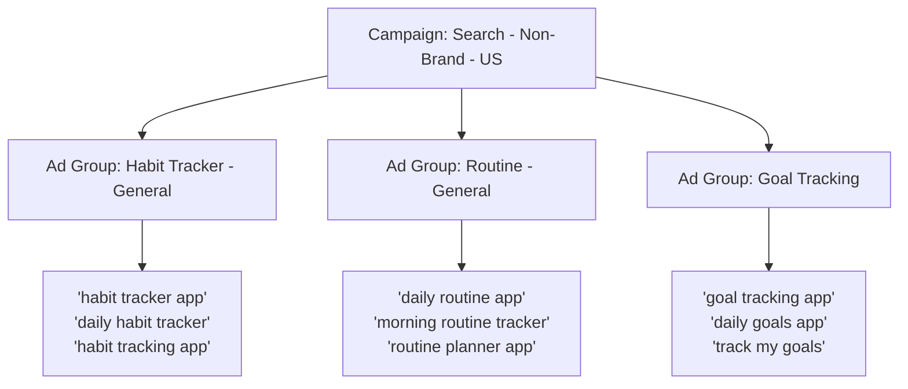

## The Most Powerful Ad Type on the Internet

Google Search Ads are unique in the advertising world because they reach people at their highest moment of intent. Someone types a query into Google because they need something RIGHT NOW. Your ad appears as the answer. No other ad format on any platform offers this level of timing and relevance.

In this guide, we will build a complete Google Search campaign from scratch. We will start with keyword research, move to ad writing, and finish with campaign setup and optimization. Every click, every setting, every decision explained.

<Tip>
A well-optimized Google Search campaign can be the most cost-effective advertising channel in your entire marketing mix. The key is matching the right keywords with the right ads and the right landing pages. We call this the "relevance trifecta" — and this guide will teach you how to nail all three.
</Tip>

---

## Step 1: Keyword Research with Google Keyword Planner

Before you create any ads, you need to know what people are actually searching for. Keyword Planner is a free tool included with every Google Ads account.

### How to Access Keyword Planner:

1. Log into **[ads.google.com](https://ads.google.com)**
2. Click the **wrench icon** (Tools and Settings) in the top navigation
3. Under **Planning**, click **Keyword Planner**
4. You will see two options:
   - **Discover new keywords** — Find new keyword ideas
   - **Get search volume and forecasts** — Check volume for keywords you already have

### Discovering New Keywords:

5. Click **Discover new keywords**
6. Enter a few seed keywords related to your business. For example, if you have a habit tracking app:
   - "habit tracker"
   - "daily routine app"
   - "habit building app"
7. Optionally, enter your **website URL** — Keyword Planner will analyze your site for additional ideas
8. Select your **target location** (e.g., United States)
9. Select your **language** (e.g., English)
10. Click **Get Results**

### Understanding the Results:

Keyword Planner will show you a table with these columns:

| Column | What It Means | What to Look For |
|---|---|---|
| **Keyword** | The search term | Relevance to your business |
| **Avg. monthly searches** | How many times this is searched per month | Higher = more traffic potential |
| **Competition** | How many advertisers bid on this keyword (Low/Medium/High) | Lower competition = potentially cheaper |
| **Top of page bid (low range)** | Estimated CPC to show at the top of results (conservative) | Budget planning |
| **Top of page bid (high range)** | Estimated CPC to show at the top of results (aggressive) | Budget planning |

### Selecting Your Keywords:

11. Look for keywords that are:
    - **Relevant** to your product or service
    - **Have reasonable search volume** (at least 100-500 monthly searches)
    - **Show clear intent** (someone searching this would actually want your product)
    - **Within your budget** (check the estimated CPC)

12. Download your keyword list by clicking **Download keyword ideas** (CSV or Google Sheets)

**Keyword categories to research:**

- **Brand keywords:** Your brand or app name (usually cheapest and highest converting)
- **Category keywords:** General terms for your product type ("habit tracker app," "budget planner")
- **Problem keywords:** What problems your product solves ("how to build habits," "track daily goals")
- **Competitor keywords:** Competitor brand names ("competitor name alternative")
- **Feature keywords:** Specific features of your product ("streak tracking app," "habit reminder app")

<Tip>
Google Keyword Planner is **completely free** with your Google Ads account — you do not need to spend any money on ads to use it. Start by entering 3-5 seed keywords and let Keyword Planner generate hundreds of ideas. Then filter for keywords with at least 100 monthly searches and competition that is not too high. This will give you a strong starting list for your first campaign.
</Tip>

---

## Step 2: Understand Keyword Match Types

When you add keywords to your campaign, you need to choose a **match type** that determines how broadly Google interprets your keyword.

### The Three Match Types:

#### Broad Match (Default)

**Format:** `habit tracker` (just the keywords, no special formatting)

**What it does:** Shows your ad for searches that are RELATED to your keyword, even if they do not contain the exact words. Google uses AI to determine relevance.

**Example keyword:** `habit tracker`
**Could trigger ads for:**
- "best app to build daily habits"
- "routine planner for students"
- "how to track my exercise goals"
- "habit building tips" (informational — might not convert)

**Pros:** Maximum reach, lets Google find relevant searches you might not think of
**Cons:** Can trigger for irrelevant searches, may waste budget

#### Phrase Match

**Format:** `"habit tracker"` (keywords in quotation marks)

**What it does:** Shows your ad for searches that include the MEANING of your keyword. The search must contain the concept of your keyword, but can include additional words before or after.

**Example keyword:** `"habit tracker"`
**Could trigger ads for:**
- "best habit tracker app"
- "free habit tracker for iPhone"
- "habit tracker with reminders"
- "daily habit tracker review"

**Would NOT trigger for:**
- "how to build habits" (different meaning — no tracking)

**Pros:** Good balance between reach and relevance
**Cons:** Less reach than Broad Match

#### Exact Match

**Format:** `[habit tracker]` (keywords in square brackets)

**What it does:** Shows your ad ONLY for searches that have the SAME MEANING as your keyword. May include slight variations (plurals, misspellings, synonyms).

**Example keyword:** `[habit tracker]`
**Could trigger ads for:**
- "habit tracker"
- "habit trackers"
- "habits tracker"

**Would NOT trigger for:**
- "best habit tracker app" (too different from exact keyword)
- "habit building app" (different concept)

**Pros:** Most precise, best for high-intent keywords with proven performance
**Cons:** Lowest reach

### Which Match Type Should You Start With?

For beginners, we recommend this strategy:

1. **Start with Phrase Match** for most keywords — it gives you a good balance of reach and control
2. **Use Exact Match** for your brand keywords — you want maximum precision for your brand name
3. **Use Broad Match sparingly** (or not at all initially) — only add broad match once you have built up a solid negative keyword list (see below)

<Tip>
Many beginners use Broad Match for all their keywords because it is the default. This is usually a mistake — Broad Match can quickly burn through your budget on irrelevant searches. Start with Phrase Match for your main keywords and Exact Match for your brand terms. You can always expand to Broad Match later once you understand which searches convert.
</Tip>

---

## Step 3: Build Your Negative Keyword List

Negative keywords are words or phrases that PREVENT your ad from showing. They are just as important as your regular keywords.

### Why Negative Keywords Matter:

Without negative keywords, your ad for "habit tracker app" might show for:
- "habit tracker **free**" (if you have a paid app)
- "habit tracker **Excel spreadsheet**" (not your product)
- "**how to break bad habits**" (informational, not looking for an app)
- "**job at** habit tracking company" (looking for employment, not your product)

Each of these clicks wastes your money because the searcher does not want what you are offering.

### Common Negative Keywords to Add:

```
free (if you are selling a paid product)
cheap
download free
how to
what is
tutorial
review
jobs
career
salary
template
spreadsheet
excel
pdf
reddit
quora
wikipedia
```

### How to Add Negative Keywords:

13. In your Google Ads campaign, click on **Keywords** in the left sidebar
14. Click **Negative keywords**
15. Click the **+** button
16. Add your negative keywords
17. Choose the level:
    - **Campaign level** — Applies to all ad groups in the campaign
    - **Ad group level** — Applies to a specific ad group only
18. Click **Save**

### Building Your Negative List Over Time:

19. After your campaign runs for a few days, check the **Search Terms report**:
    - Go to your campaign → **Keywords** → **Search terms**
    - This shows you the ACTUAL searches that triggered your ads
    - Look for irrelevant searches and add them as negative keywords
20. Review this report weekly to continuously refine your targeting

---

## Step 4: Create Your Search Campaign

Now let us create the actual campaign in Google Ads.

### Starting the Campaign:

21. Log into **[ads.google.com](https://ads.google.com)**
22. Click **Campaigns** in the left sidebar
23. Click the **blue "+" button** → **New campaign**
24. Choose your campaign goal:
    - **Sales** — If you want website purchases
    - **Leads** — If you want form submissions or sign-ups
    - **Website traffic** — If you want more visitors to your site
25. Select **Search** as the campaign type
26. Select the **conversion actions** you want to optimize for (the ones you created in the Conversion Tracking guide)
27. Click **Continue**

### Campaign Settings:

28. **Campaign name:** Enter a descriptive name like "Search - Non-Brand - US"

29. **Networks:** You will see options for:
    - **Google Search Network** — Keep this ON (this is the core search experience)
    - **Google Search Partners** — Optional. These are other search engines that use Google's ad system. Keep it ON initially; you can turn it off later if it does not perform well.
    - **Google Display Network** — Turn this OFF. If you want Display ads, create a separate Display campaign. Mixing Search and Display in one campaign makes optimization difficult.

30. **Locations:** Click **Enter another location** and type your target country, state, or city
    - Select **Presence: People in or regularly in your targeted locations** (not "Presence or interest" which shows ads to people who are just interested in the location)

31. **Languages:** Select the languages your audience speaks

32. **Budget:** Enter your daily budget
    - Google recommends **$10–$50/day** for beginners
    - Start at the lower end if you are testing; increase once you see results

33. **Bidding:** Choose your bid strategy:
    - **Maximize conversions** — Google automatically sets bids to get the most conversions within your budget (recommended for beginners)
    - **Maximize conversion value** — Google optimizes for the highest total conversion value
    - **Target CPA** — You set a target cost per conversion (use after you have enough data)
    - **Manual CPC** — You set bids manually for each keyword (most control, most work)

For your first campaign, select **Maximize conversions**.

34. Click **Next** to proceed to Ad Group setup

<Tip>
Always uncheck **"Google Display Network"** when creating a Search campaign. If you leave it checked, Google will show your text ads on random websites as Display ads, which performs terribly compared to dedicated Display campaigns. Keep Search and Display campaigns separate for much better results.
</Tip>

---

## Step 5: Create Your Ad Groups

Ad groups organize your keywords and ads into themed groups. Each ad group should focus on one specific topic.

### How to Structure Ad Groups:

35. **Ad Group name:** Give it a descriptive name like "Habit Tracker - General"
36. **Keywords:** Add your keywords with the appropriate match types:

```
"habit tracker app"
"daily habit tracker"
"habit tracking app"
[habit tracker]
"best habit tracker"
```

37. Click **+ New ad group** to create additional ad groups:

**Example structure:**



### Best Practices for Ad Groups:

- **5-15 keywords per ad group** is the sweet spot
- All keywords in an ad group should be closely related
- The ad copy should match the keywords in the ad group
- If a keyword does not match the theme, it belongs in a different ad group

---

## Step 6: Write Your Responsive Search Ads (RSAs)

Responsive Search Ads are Google's standard ad format for Search campaigns. You provide multiple headlines and descriptions, and Google automatically tests different combinations to find the best-performing versions.

### How RSAs Work:

- You provide up to **15 headlines** (30 characters each)
- You provide up to **4 descriptions** (90 characters each)
- Google mixes and matches combinations to create different ad versions
- Over time, Google shows the best-performing combinations more often

### Creating Your RSA:

38. After setting up your ad group, click **+ New ad**
39. You will see the Responsive Search Ad editor

**Headlines (up to 15, at least 3 required):**

Write headlines that cover different angles. Here are examples for a habit tracker app:

```
Headline 1:  "Habit Tracker App"              (keyword match)
Headline 2:  "Build Better Habits Today"       (benefit)
Headline 3:  "Free Habit Tracking App"         (offer)
Headline 4:  "#1 Rated Habit Tracker"          (social proof)
Headline 5:  "Track Habits in 2 Minutes/Day"   (time benefit)
Headline 6:  "10,000+ 5-Star Reviews"          (credibility)
Headline 7:  "Start Your Free Trial Now"       (CTA)
Headline 8:  "Build Streaks & Stay Motivated"  (feature)
Headline 9:  "Simple Daily Habit Tracking"     (simplicity)
Headline 10: "Download Free on iOS & Android"  (availability)
```

**Descriptions (up to 4, at least 2 required):**

```
Description 1: "Track your daily habits, build streaks, and stay motivated with smart reminders. Download free and start building better routines today."

Description 2: "Join 50,000+ people using our app to build positive habits. Simple, beautiful, and backed by behavioral science. Try it free."

Description 3: "Set goals, track progress, and celebrate streaks. Our habit tracker makes it easy to build the routines that change your life."

Description 4: "Rated 4.8 stars with 10,000+ reviews. Build habits that stick with daily reminders, progress charts, and community support."
```

40. Enter your **Final URL** — the landing page people will visit after clicking
41. Enter your **Display path** — the shortened URL shown in the ad (e.g., `yourapp.com/habits`)
42. Click **Save**

### RSA Writing Best Practices:

- **Include your keyword in at least 2-3 headlines** — This improves Quality Score and relevance
- **Make each headline unique** — Do not write 5 variations of the same idea
- **Include at least one headline with a CTA** (Call to Action) — "Download Now," "Start Free Trial," "Get Started"
- **Include numbers and specifics** — "4.8 stars," "50,000+ users," "2 minutes/day"
- **Use "pinning" sparingly** — You can pin specific headlines to specific positions, but this limits Google's ability to test combinations

<Tip>
Write your headlines so that ANY combination of three headlines would make sense together. Google will show three headlines side by side, and you cannot control which three it picks. Read through random combinations of your headlines and make sure they do not contradict each other or repeat the same message. If Headline 1 is "Free Habit Tracker" and Headline 3 is "Start Your Free Trial," showing them together is redundant.
</Tip>

---

## Step 7: Add Ad Assets (Extensions)

Ad assets (previously called "ad extensions") add extra information to your ad, making it larger and more informative. They are free to add and can significantly improve your CTR and Quality Score.

### Sitelink Assets

Additional links below your ad that take people to specific pages on your website.

43. In your campaign, go to **Ads & assets** → **Assets**
44. Click the **+** button → **Sitelink**
45. Add 4-8 sitelinks, each with:
    - **Link text:** Short description (25 characters) — e.g., "Features," "Pricing," "Reviews"
    - **Description 1:** Additional detail (35 characters)
    - **Description 2:** Additional detail (35 characters)
    - **Final URL:** The page this sitelink links to

### Callout Assets

Short phrases that highlight key benefits (no links).

46. Click **+** → **Callout**
47. Add 4-6 callouts (25 characters each):
    - "Free Trial Available"
    - "No Credit Card Required"
    - "4.8 Star Rating"
    - "Available on iOS & Android"
    - "24/7 Customer Support"

### Structured Snippet Assets

Predefined categories with specific values.

48. Click **+** → **Structured snippet**
49. Choose a header (e.g., "Features") and add values:
    - Header: "Features"
    - Values: "Streak Tracking," "Smart Reminders," "Progress Charts," "Habit Templates"

### Call Assets

Add your phone number to ads (great for businesses that handle phone inquiries).

### Price Assets

Show your pricing directly in the ad.

### Image Assets

Add images alongside your text ads.

50. Click **+** → **Image**
51. Upload relevant images (1200 x 1200 for square, 1200 x 628 for landscape)
52. These appear next to your text ad on mobile

<Tip>
Add as many ad assets as possible. They are free, they make your ad larger (taking up more screen space), and they improve your Quality Score. Google does not always show all your assets — it picks the ones most likely to improve performance. But you want to give Google plenty of options. At minimum, add **sitelinks**, **callouts**, and **structured snippets** to every campaign.
</Tip>

---

## Step 8: Understanding and Improving Quality Score

Quality Score is a 1-10 rating that Google assigns to each of your keywords. It directly affects your cost per click and ad position. Improving Quality Score is one of the most impactful things you can do in Google Ads.

### The Three Components of Quality Score:

#### 1. Expected Click-Through Rate (CTR)

Google predicts how likely people are to click your ad when it appears for this keyword.

**How to improve it:**
- Write compelling headlines that match the search intent
- Include the keyword in your headlines
- Use strong CTAs
- Test multiple ad variations

#### 2. Ad Relevance

How closely your ad matches the intent behind the search query.

**How to improve it:**
- Make sure the keyword appears in your ad headlines and descriptions
- Create tightly themed ad groups (all keywords in a group should relate to the same topic)
- Write ad copy that directly addresses what the searcher is looking for

#### 3. Landing Page Experience

How useful and relevant your landing page is after someone clicks.

**How to improve it:**
- Make sure the landing page content matches the ad and keyword
- Ensure the page loads quickly (under 3 seconds on mobile)
- Make the page mobile-friendly
- Have clear navigation and a clear CTA on the landing page
- Include the keyword naturally on the landing page

### How to Check Quality Score:

53. Go to **Keywords** in your campaign
54. Click the **Columns** icon → **Modify columns**
55. Expand **Quality Score** and add:
    - Quality Score
    - Expected CTR
    - Ad Relevance
    - Landing Page Experience
56. Click **Apply**
57. Each keyword will now show its Quality Score and the three component ratings

### What the Scores Mean:

| Quality Score | What It Means | What to Do |
|---|---|---|
| 8-10 | Excellent. You are doing great. | Maintain what you are doing. |
| 6-7 | Good. Room for improvement. | Review the component below average and improve it. |
| 4-5 | Below average. Needs work. | Focus on improving the weakest component. |
| 1-3 | Poor. Significantly hurting performance. | Major changes needed — possibly pause keyword and rewrite ad. |

<Tip>
Quality Score directly affects your cost per click. A keyword with Quality Score 10 might cost $1.00 per click, while the same keyword with Quality Score 3 could cost $3.00 or more. That is a 3x cost difference for the same keyword. Investing time in improving Quality Score literally saves you money on every single click.
</Tip>

---

## Step 9: Launch and Initial Setup Verification

58. Review all your campaign settings one final time:
    - Campaign name, budget, and bidding strategy
    - Location and language targeting
    - Ad group themes and keywords
    - Ad copy and assets
    - Negative keywords

59. Click **Publish campaign**

60. Google will review your ads (usually within a few hours, but can take up to 24 hours)

### Post-Launch Checklist (First 48 Hours):

61. Check that your ads are **Approved** (go to Ads & assets and check the Status column)
62. Check that your keywords are **Eligible** (go to Keywords and check the Status column)
63. Verify that impressions and clicks are being recorded
64. Review the **Search Terms report** for any irrelevant searches to add as negative keywords
65. Check that conversions are being tracked (if someone converts)

---

## Troubleshooting Common Search Ad Issues

### "My ad was disapproved"

**Common reasons:**
- Trademark violations in your ad text
- Misleading claims or exaggerated promises
- Landing page does not match ad content
- Prohibited products or services

**What to do:**
1. Check the disapproval reason in the Status column
2. Fix the issue and resubmit
3. If you believe it was a mistake, request a review

### "I am getting impressions but no clicks"

**Possible causes:**
- Your ad copy is not compelling enough
- Your ad is appearing in low positions (below competitors)
- Your Quality Score is low

**Fixes:**
1. Rewrite your headlines to be more engaging and relevant
2. Increase your bids slightly
3. Add more ad assets to make your ad larger

### "I am getting clicks but no conversions"

**Possible causes:**
- Your landing page does not match the ad promise
- The landing page loads too slowly
- Your conversion tracking is not working
- Your keywords are attracting the wrong audience

**Fixes:**
1. Check that your landing page matches the ad message
2. Test landing page speed on Google PageSpeed Insights
3. Verify conversion tracking with Google Tag Assistant
4. Review the Search Terms report for irrelevant queries

### "My Quality Score is very low"

**Possible causes:**
- Keyword is not in your ad copy
- Ad group has too many unrelated keywords
- Landing page is not relevant to the keyword

**Fixes:**
1. Include the keyword in at least 2 headlines
2. Split large ad groups into smaller, more focused groups
3. Create dedicated landing pages for each ad group theme

---

## Your Search Campaign Checklist

- [ ] Keyword research completed with Keyword Planner
- [ ] Keywords organized into themed ad groups (5-15 per group)
- [ ] Appropriate match types selected (Phrase Match recommended for beginners)
- [ ] Negative keyword list created and applied
- [ ] RSAs created with 10+ headlines and 4 descriptions
- [ ] Ad assets added (sitelinks, callouts, structured snippets at minimum)
- [ ] Landing pages match ad messaging for each ad group
- [ ] Campaign settings verified (Expert Mode, Search only, correct location)
- [ ] Budget set to $10-$50/day
- [ ] Bidding strategy set to Maximize Conversions
- [ ] Campaign published and ads approved
- [ ] Search Terms report reviewed within first 48 hours
- [ ] Quality Score checked and components reviewed

---

## What Comes Next

Your Google Search campaign is now live, reaching people at their highest moment of intent. Over the next few days, you will start seeing data flow in — impressions, clicks, and hopefully conversions.

In the **Display Ads** guide, we will create Display campaigns that complement your Search campaigns. While Search captures people who are actively looking for you, Display reaches people while they browse websites and apps — perfect for building awareness and retargeting website visitors.

<Tip>
Check the **Search Terms report** every day for the first week. This is where you will find the actual searches that triggered your ads. Add irrelevant searches as negative keywords immediately. This daily habit of refining negative keywords is what separates profitable Search campaigns from money-wasting ones. After the first week, weekly reviews are sufficient.
</Tip>
