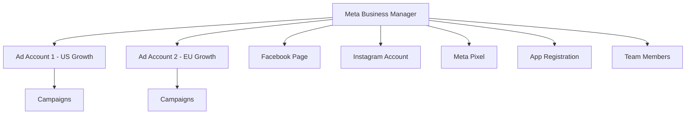
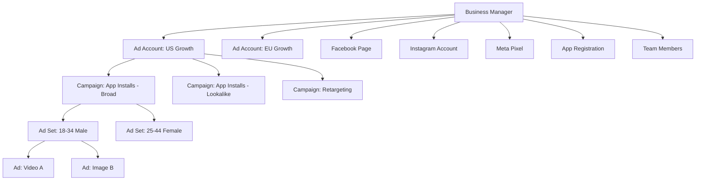

## Before you touch a single ad

You need a proper account structure before you can run Meta ads. Skipping this (or doing it wrong) is the number one reason beginners get their accounts banned, locked out, or disorganized. Let's do it right the first time.

Here is the hierarchy you are building:

**Business Manager** sits at the top. It holds everything: ad accounts, pages, pixels, apps, and people. Inside each ad account, you create campaigns. This structure lets you keep things organized as you grow.

---

## What you will need before starting

Have these ready before you begin:

- A personal Facebook account (required to create a Business Manager — Meta ties business accounts to real people)
- Your business name, address, and website URL
- A credit card or PayPal account for ad payments
- Your app's App Store URL or Google Play package name (if your app is published)
- A business email address (strongly recommended over personal email)

<Warning>
  **Your personal Facebook account must look legitimate.** Meta uses your personal profile to verify you are a real person. Accounts that are brand new, have no friends, no profile photo, or fake names are major red flags that can get your Business Manager permanently banned. Use your real, established Facebook account.
</Warning>

---

## Step 1: Create your Meta Business Manager

<Steps>
  <Step title="Go to business.facebook.com">
    Open [business.facebook.com](https://business.facebook.com) in your browser. Click **Create Account** (or **Create a Business Manager** if you see that option).

    If you are already logged into Facebook, it will use that account. If not, log in first.
  </Step>
  <Step title="Enter your business name">
    This is the name that represents your business, not your personal name. Use your actual company name or your app's brand name. Examples:
    - Good: "Acme Software Inc" or "TaskFlow App"
    - Bad: "John's stuff" or "Test Account 123"

    This name will appear in some ad-related contexts (like ad transparency reports), so keep it professional.
  </Step>
  <Step title="Enter your name and business email">
    **Your name:** Use your real name. This identifies you as the admin.

    **Business email:** Use a team or company email if possible (like ads@yourcompany.com or marketing@yourcompany.com). Avoid using a personal Gmail because:
    - If the person who owns that Gmail leaves the company, you can lose access
    - A business email looks more legitimate to Meta's review team
    - You can set up email forwarding so multiple people see important notifications
  </Step>
  <Step title="Confirm your email">
    Meta will send a confirmation email. Click the link to verify. Check your spam folder if you do not see it within a few minutes.
  </Step>
  <Step title="Complete your business details">
    After email confirmation, Meta will ask for additional details:
    - **Legal business name** (as registered with your government)
    - **Business address** (must be real and verifiable)
    - **Business phone number**
    - **Website URL**
    - **Business type** (select the most accurate option)

    Fill everything out accurately. Meta may verify this information later, and mismatches can trigger account restrictions.
  </Step>
</Steps>

<Note>
  You can have multiple Business Managers, but most companies only need one. A single Business Manager can hold multiple ad accounts (up to 5 initially, more as you spend).
</Note>

---

## Step 2: Enable two-factor authentication

Do this immediately — before anything else. Hacked ad accounts are extremely common, and Meta is slow to help recover them.

<Steps>
  <Step title="Go to Business Settings">
    In Business Manager, click the gear icon or navigate to **Business Settings** from the left sidebar.
  </Step>
  <Step title="Navigate to Security Center">
    Click **Security Center** in the left menu. You will see your current security status.
  </Step>
  <Step title="Enable two-factor authentication">
    Click **Set Up Two-Factor Authentication**. Choose your preferred method:
    - **Authentication app** (recommended): Use Google Authenticator, Authy, or 1Password
    - **SMS**: Text message codes to your phone (less secure but better than nothing)

    Follow the prompts to complete setup.
  </Step>
  <Step title="Require 2FA for all team members">
    Still in Security Center, change the two-factor authentication setting to **Required for everyone**. This ensures anyone with access to your ad account must have 2FA enabled.
  </Step>
</Steps>

<Warning>
  **This is not optional.** Compromised ad accounts can rack up thousands of dollars in fraudulent charges within hours. Two-factor authentication is your best protection. Save your backup codes in a secure location.
</Warning>

---

## Step 3: Create your ad account

<Steps>
  <Step title="Go to Business Settings > Accounts > Ad Accounts">
    In Business Manager, navigate to **Business Settings** (gear icon). In the left sidebar, expand **Accounts** and click **Ad Accounts**.
  </Step>
  <Step title="Click Add > Create a New Ad Account">
    You will see three options:
    - **Add an Ad Account** — for connecting an existing ad account
    - **Request Access to an Ad Account** — for getting access to someone else's account
    - **Create a New Ad Account** — this is what you want

    Click **Create a New Ad Account**.
  </Step>
  <Step title="Configure your ad account details">
    You will see a form with these fields. Fill each one carefully:

    **Ad Account Name:**
    Use something descriptive that helps you identify this account later. Good naming conventions:
    - "[App Name] - [Market]" (e.g., "TaskFlow - US")
    - "[Company] - [Purpose]" (e.g., "Acme - App Growth")

    **Time Zone:**
    Set this to the timezone of your **primary target market**, not your personal location. For example:
    - If you are in Korea but targeting US users, set it to a US timezone
    - This affects when your daily budgets reset and how reporting dates are calculated
    - You will use this timezone when scheduling ads and reading reports

    **Currency:**
    Set this to the currency you want to be charged in. Common choices:
    - USD if your primary market is the US
    - EUR for European markets
    - The currency your company uses for accounting

    <Warning>
      **You cannot change the timezone or currency after creating the ad account.** Triple-check these settings before clicking confirm. If you make a mistake, your only option is to create a new ad account and start over.
    </Warning>
  </Step>
  <Step title="Assign the ad account to your Business Manager">
    When prompted, select **My Business** as the owner. Assign yourself (or another team member) as the admin of this ad account.
  </Step>
</Steps>

### How many ad accounts do you need?

| Situation | Recommendation |
|-----------|---------------|
| Single app, single market | 1 ad account |
| Single app, multiple markets with different currencies | 1 ad account per currency |
| Multiple apps | 1 ad account per app (keeps reporting clean) |
| Agency managing multiple clients | 1 ad account per client |

<Note>
  New Business Managers start with a limit of **5 ad accounts**. As you spend more money and build history with Meta, this limit increases automatically. Some large advertisers have hundreds of ad accounts.
</Note>

---

## Step 4: Connect your Facebook Page

Every Meta ad must be associated with a Facebook Page. If you do not have one yet, create one:

<Steps>
  <Step title="Create a Facebook Page (if needed)">
    Go to [facebook.com/pages/create](https://www.facebook.com/pages/create) and create a page for your app or business. Fill out:
    - **Page name:** Your app or business name
    - **Category:** Search for relevant categories (e.g., "App", "Software", "Technology Company")
    - **Description:** A brief description of what your app does
    - Add a profile picture (your app icon works great) and cover photo
  </Step>
  <Step title="Add your Page to Business Manager">
    In Business Manager, go to **Business Settings** > **Accounts** > **Pages**. Click **Add** and choose:
    - **Add a Page** — if you own the page
    - **Request Access to a Page** — if someone else owns it
    - **Create a New Page** — if you want to create one directly in Business Manager

    Select your page and confirm.
  </Step>
  <Step title="Connect your Instagram account (optional but recommended)">
    If you have an Instagram account for your app, connect it too. Go to **Business Settings** > **Accounts** > **Instagram Accounts** and click **Add**. Log in with your Instagram credentials.

    Connecting Instagram lets you run ads that appear on Instagram using your Instagram identity instead of just your Facebook Page.
  </Step>
</Steps>

---

## Step 5: Register your app

To run app install campaigns, Meta needs to know about your app:

<Steps>
  <Step title="Go to Business Settings > Accounts > Apps">
    In Business Manager, navigate to **Business Settings** > **Accounts** > **Apps**.
  </Step>
  <Step title="Add your app">
    Click **Add** and you will see options:
    - **Add an App ID**: If you already have a Meta (Facebook) App ID from the Meta Developer portal
    - **Request Access to an App ID**: If someone else registered the app
    - **Create a New App ID**: To register your app with Meta for the first time

    For a new app, you will need to go to [developers.facebook.com](https://developers.facebook.com) to create an App ID first, then add it here.
  </Step>
  <Step title="Configure your app's platform settings">
    In the Meta Developer portal, add your platform details:

    **For iOS:**
    - Bundle ID (e.g., com.yourcompany.yourapp)
    - App Store ID (the numeric ID from your App Store URL)
    - URL schemes

    **For Android:**
    - Package name (e.g., com.yourcompany.yourapp)
    - Class name (your main activity)
    - Key hash (for development and release)

    Meta uses these to deep-link users to the correct app store and verify installs.
  </Step>
  <Step title="Verify the app connection">
    After adding your app, go back to **Business Settings** > **Accounts** > **Apps** and confirm your app appears with a green connected status. Assign the app to your ad account so it appears as an option when creating campaigns.
  </Step>
</Steps>

<Note>
  If your app is not yet published in the App Store or Google Play, you can still register it with Meta and set up the SDK. However, you cannot run live app install ads until the app is publicly available.
</Note>

---

## Step 6: Set up payment

<Steps>
  <Step title="Go to Payment Settings">
    In Ads Manager, click the hamburger menu (three horizontal lines) and go to **Billing** > **Payment Settings**. Or in Business Manager, go to **Business Settings** > **Payments**.
  </Step>
  <Step title="Add a payment method">
    Click **Add Payment Method** and choose from:

    | Payment method | Best for | Notes |
    |---------------|----------|-------|
    | **Credit card** | Most advertisers | Simplest option. Visa, Mastercard, and American Express accepted. Meta charges you periodically as you spend. |
    | **Debit card** | Budget-conscious advertisers | Works like a credit card but draws from your bank account directly |
    | **PayPal** | Advertisers in most countries | Links to your PayPal balance or connected bank account |
    | **Bank account (ACH/direct debit)** | Larger advertisers ($10K+/month) | Lower processing fees, but only available after you have established spending history |
    | **Manual payments (prepaid)** | Available in some countries | You add funds in advance and Meta deducts from your balance |

    Enter your payment details and confirm.
  </Step>
  <Step title="Set a backup payment method">
    Add a second payment method as a backup. If your primary payment fails (expired card, insufficient funds), Meta will try the backup. This prevents your campaigns from pausing unexpectedly.
  </Step>
  <Step title="Understand the billing threshold">
    Meta does not charge you at the end of each day. Instead, it uses a **billing threshold** system:
    - You start with a low threshold (e.g., $25)
    - Each time you hit the threshold, Meta charges your payment method
    - The threshold increases as you build spending history (up to $750 or more)
    - Any remaining balance is charged on your monthly billing date

    This means you might see multiple charges per day when spending heavily, or just one monthly charge when spending lightly.
  </Step>
</Steps>

---

## Step 7: Set account spending limits

Spending limits are your safety net against runaway costs or compromised accounts. There are two types:

### Account spending limit

This is a **lifetime cap** on your entire ad account. Once you hit it, all campaigns stop and no new charges occur.

<Steps>
  <Step title="Go to Payment Settings">
    In Ads Manager, go to **Billing** > **Payment Settings**.
  </Step>
  <Step title="Click 'Set Account Spending Limit'">
    Enter the maximum amount you want to spend total. For beginners, we recommend starting with a limit that covers your first month of testing:
    - Very cautious: $200-500
    - Moderate: $500-1,000
    - Aggressive: $1,000-2,000
  </Step>
  <Step title="Adjust as needed">
    You can increase, decrease, or remove the limit at any time. When you approach the limit, Meta sends a notification so your campaigns do not stop unexpectedly.
  </Step>
</Steps>

### Campaign spending limit

Each individual campaign also has an optional spending limit:
- **Daily budget**: Maximum spend per day for the campaign
- **Lifetime budget**: Maximum spend for the entire campaign duration
- **Campaign spending limit**: An overall cap separate from the daily/lifetime budget

<Tip>
  **As a beginner, set both an account spending limit AND use daily budgets on your campaigns.** This creates two layers of protection. The account limit prevents your total spend from exceeding your comfort level, and daily budgets keep each campaign controlled.
</Tip>

---

## Step 8: Verify your business (recommended)

Business verification is not required to start running ads, but it unlocks several benefits and is strongly recommended:

### Why verify

| Benefit | Description |
|---------|-------------|
| **Higher trust score** | Verified businesses are less likely to get their accounts restricted or banned |
| **Access to more features** | Some features (like custom conversions, certain audience types) require verification |
| **Higher spending limits** | Verified businesses may qualify for higher ad account limits |
| **Required for some industries** | Certain regulated industries (finance, health, politics) require verification |
| **Custom domain tracking** | Required for configuring Conversions API with verified domains |

### How to verify

<Steps>
  <Step title="Go to Business Settings > Security Center">
    In Business Manager, navigate to **Business Settings** > **Security Center**. You will see a section about business verification.
  </Step>
  <Step title="Start the verification process">
    Click **Start Verification** and select your business type:
    - **Business**: For registered companies
    - **Individual**: For sole proprietors without a registered business
  </Step>
  <Step title="Provide documentation">
    Meta will ask for documentation to verify your business. Acceptable documents include:
    - Business registration certificate
    - Articles of incorporation
    - Tax identification certificate
    - Utility bill with business name and address
    - Bank statement with business name and address

    Upload a clear photo or scan of the document.
  </Step>
  <Step title="Verify your business phone number or domain">
    Meta may ask you to verify ownership via:
    - **Phone verification**: Receiving a call or SMS at your business phone number
    - **Domain verification**: Adding a meta-tag or DNS record to your website
    - **Email verification**: Receiving a code at an email address matching your domain
  </Step>
  <Step title="Wait for review">
    Verification typically takes 1-5 business days. Meta will email you when the process is complete. If rejected, you can resubmit with different documentation.
  </Step>
</Steps>

---

## Step 9: Add team members

If other people need access to your ad account, here is how to add them with the right permissions:

<Steps>
  <Step title="Go to Business Settings > People">
    In Business Manager, navigate to **Business Settings** > **People**.
  </Step>
  <Step title="Click 'Add People'">
    Enter the email address of the person you want to add. They will receive an invitation email.
  </Step>
  <Step title="Assign Business Manager role">
    Choose their role at the Business Manager level:

    | Role | Permissions | Best for |
    |------|-----------|----------|
    | **Admin** | Full access to everything. Can add/remove people, create ad accounts, change settings, view billing. | Founders, CTOs, Head of Marketing — only people who need full control |
    | **Employee** | Limited access. Can only see and use assets (ad accounts, pages) they have been specifically assigned to. | Everyone else — marketers, analysts, designers |
  </Step>
  <Step title="Assign asset-level permissions">
    After setting the Business Manager role, you need to give them access to specific assets. Click on the person's name, then assign them to:

    **Ad Account access levels:**
    | Level | What they can do |
    |-------|-----------------|
    | **Admin** | Create campaigns, edit campaigns, manage settings, view reports, manage ad account permissions |
    | **Advertiser** | Create campaigns, edit campaigns, view reports |
    | **Analyst** | View reports and data only — cannot create or edit anything |

    **Page access levels:**
    | Level | What they can do |
    |-------|-----------------|
    | **Admin** | Full control over the page, including deleting it |
    | **Editor** | Create posts, respond to comments, create ads from the page |
    | **Moderator** | Respond to comments and messages, view insights |
    | **Analyst** | View page insights only |
  </Step>
</Steps>

### Best practices for team permissions

<CardGroup cols={2}>
  <Card title="Do" icon="check">
    - Give the minimum permissions needed for each person's role
    - Use "Employee" role at the Business Manager level for most people
    - Require two-factor authentication for everyone
    - Remove access immediately when someone leaves the team
    - Have at least two admins so you are not locked out if one loses access
  </Card>
  <Card title="Don't" icon="xmark">
    - Give everyone Admin access "just to be safe"
    - Share login credentials instead of adding people properly
    - Forget to remove former employees
    - Have only one admin (single point of failure)
    - Give external partners admin access — use "Advertiser" for agencies
  </Card>
</CardGroup>

---

## Understanding account structure

Now that everything is set up, here is how the entire structure fits together:

Each level has a specific purpose:

| Level | What it is | Key settings at this level |
|-------|-----------|---------------------------|
| **Business Manager** | Your company's control center | People, permissions, billing, assets |
| **Ad Account** | A container for campaigns | Timezone, currency, spending limit, payment method |
| **Campaign** | A single advertising goal | Objective (installs, traffic, etc.), budget type, special categories |
| **Ad Set** | A group of ads with the same targeting and budget | Audience, placements, budget/schedule, optimization goal, bid strategy |
| **Ad** | The actual creative that people see | Image/video, text, headline, CTA, tracking links |

---

## Common setup mistakes and how to fix them

<AccordionGroup>
  <Accordion title="Account banned immediately after creation">
    **Cause:** Meta's automated system flagged your account as suspicious. This usually happens when:
    - Your personal Facebook profile is new or looks fake
    - Your business information does not match real records
    - You are using a VPN from a different country than your business address
    - You are creating multiple Business Managers rapidly

    **Fix:** Submit an appeal through the link in the ban notification email. Provide your real business documentation. If your personal profile is the issue, build it up with real information and wait a few days before trying again. There is no shortcut — Meta needs to believe you are a legitimate business.
  </Accordion>
  <Accordion title="Wrong timezone or currency on ad account">
    **Cause:** You selected the wrong option during ad account creation.

    **Fix:** Unfortunately, you cannot change these after creation. Create a new ad account with the correct settings. The old account can be deactivated (it will not be deleted, just marked as closed).
  </Accordion>
  <Accordion title="Cannot find Ads Manager or Business Settings">
    **Cause:** Meta's interface changes frequently and menu locations shift.

    **Fix:** Use these direct URLs:
    - Ads Manager: [adsmanager.facebook.com](https://adsmanager.facebook.com)
    - Business Settings: [business.facebook.com/settings](https://business.facebook.com/settings)
    - Events Manager: [facebook.com/events_manager](https://www.facebook.com/events_manager2)
    - Audiences: [adsmanager.facebook.com/audiences](https://adsmanager.facebook.com/audiences)
  </Accordion>
  <Accordion title="Payment method declined">
    **Cause:** Your bank may block the charge because it looks like an international transaction (Meta charges from Ireland in many cases), or your card has insufficient funds or daily limits.

    **Fix:** Contact your bank and authorize charges from "Meta Platforms" or "Facebook". Try a different payment method as a fallback. Some banks require you to pre-authorize recurring international charges.
  </Accordion>
  <Accordion title="Locked out of Business Manager">
    **Cause:** Lost access to the admin's personal Facebook account, or the only admin was removed.

    **Fix:** If you can still access your personal Facebook account, try logging in at [business.facebook.com](https://business.facebook.com). If the admin account was disabled, submit an appeal through [facebook.com/help](https://www.facebook.com/help). Prevention is key: always have at least two admins on your Business Manager.
  </Accordion>
  <Accordion title="Ad account disabled for policy violation">
    **Cause:** Your ads, landing page, or business practices violated Meta's advertising policies. Common violations include misleading claims, prohibited content, or mismatched ad-to-landing-page experiences.

    **Fix:** Read the specific violation notice carefully. Fix the issue. Submit an appeal through the Account Quality dashboard at [facebook.com/accountquality](https://www.facebook.com/accountquality). Be patient — appeals can take 1-7 days. Do not create new accounts to circumvent the ban, as that will result in a permanent ban.
  </Accordion>
</AccordionGroup>

---

## Your account setup checklist

Before moving on, confirm everything is in place:

- [ ] Business Manager created with real, accurate business information
- [ ] Two-factor authentication enabled and required for all team members
- [ ] Ad account created with correct timezone and currency
- [ ] Facebook Page created or connected
- [ ] Instagram account connected (optional but recommended)
- [ ] App registered in Meta Developer portal and added to Business Manager
- [ ] Payment method added with a backup method
- [ ] Account spending limit set (recommended for beginners)
- [ ] Business verification started or completed
- [ ] Team members added with appropriate permission levels

<Card
  title="Pixel & SDK Setup"
  icon="arrow-right"
  href="/platforms/meta/pixel-setup"
>
  Account ready? Now let's install tracking so Meta can measure your results and optimize your campaigns.
</Card>
