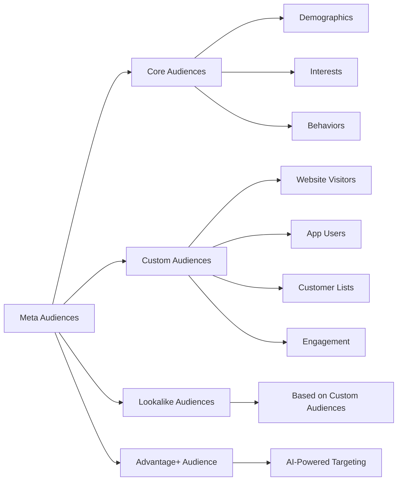
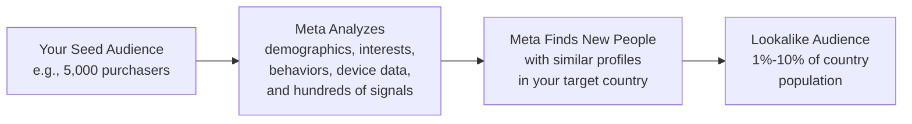
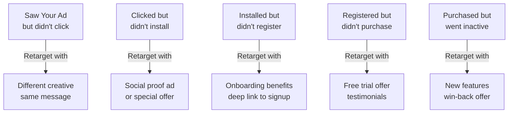

## The audience is everything

You can have the best ad creative in the world, but if it is shown to the wrong people, it will not work. Meta gives you extremely powerful targeting tools, and understanding them is one of the biggest advantages you can have as an advertiser.

This guide covers every audience type in detail, including options you did not know existed.

---

## The four audience types



<CardGroup cols={2}>
  <Card title="Core Audiences" icon="sliders">
    Built from **demographics, interests, and behaviors** you define manually. Your starting point when you have no existing data.
  </Card>
  <Card title="Custom Audiences" icon="database">
    Built from **your own data** — app users, website visitors, email lists, video viewers, and social media engagers. People who already know you.
  </Card>
  <Card title="Lookalike Audiences" icon="clone">
    Meta finds **new people similar** to your best existing users. This is how you scale from thousands to millions.
  </Card>
  <Card title="Advantage+ Audience" icon="wand-magic-sparkles">
    Meta's **AI-powered targeting** that uses your inputs as suggestions and finds the best audience automatically.
  </Card>
</CardGroup>

---

## Core audiences (demographics, interests, and behaviors)

Core audiences are what most people think of when they hear "ad targeting" — you manually define who should see your ads based on their characteristics. These are also called **Saved Audiences** because you can save and reuse them.

### Demographics

Demographics target people based on who they are:

<AccordionGroup>
  <Accordion title="Location">
    **Options:**
    - Countries (target entire countries)
    - States/regions/provinces
    - Cities (with a custom radius, 10-50 miles)
    - ZIP/postal codes
    - DMA (Designated Market Areas, US only)
    - Custom radius around a dropped pin

    **Location types:**
    - People living in or recently in this location (default)
    - People living in this location (permanent residents only)
    - People recently in this location (includes visitors)
    - People traveling in this location (only visitors, not residents)

    **Exclusions:** You can also exclude specific locations. For example, target the US but exclude New York.
  </Accordion>
  <Accordion title="Age">
    Range from 13 to 65+. However, ads in most categories are limited to 18+.

    **Recommendations:**
    - Start broad (18-65+) and let Meta optimize
    - Check your age breakdown after 7 days to see where installs come from
    - Only narrow when you have strong data showing specific age groups perform better
  </Accordion>
  <Accordion title="Gender">
    Options: All, Men, Women.

    **Recommendations:**
    - Start with "All" and check the gender breakdown after 7 days
    - Some apps have a clear gender skew — if 80% of your installs come from one gender, consider targeting accordingly
  </Accordion>
  <Accordion title="Language">
    Target people who use a specific language in their Facebook settings.

    **When to use:** Only when targeting a multilingual region where your ad is in a specific language. For example, targeting Spanish speakers in the US with a Spanish-language ad.
  </Accordion>
  <Accordion title="Detailed demographics">
    Meta provides detailed demographic targeting including:
    - **Education level:** High school, college, graduate school
    - **Field of study:** Business, engineering, arts, etc.
    - **School name:** Specific universities
    - **Life events:** Recently moved, recently engaged, new job, birthday, anniversary
    - **Relationship status:** Single, in a relationship, married, etc.
    - **Work:** Employer, industry, job title
    - **Parents:** New parents, parents with toddlers, parents with teenagers, etc.
    - **Politics (US):** Liberal, conservative, moderate (limited availability)
    - **Generation:** Millennials, Gen X, Baby Boomers
  </Accordion>
</AccordionGroup>

### Interests

Interests target people based on what they are interested in, the pages they like, the content they engage with, and related topics. This is the most commonly used targeting method.

<AccordionGroup>
  <Accordion title="Business and industry">
    - Advertising, agriculture, architecture, aviation, banking, business, construction, design, economics, engineering, entrepreneurship, healthcare, higher education, management, marketing, nursing, online marketing, personal finance, real estate, retail, sales, science, small business
  </Accordion>
  <Accordion title="Entertainment">
    - Games (action, board, browser, card, casino, puzzle, role-playing, simulation, sports, strategy, trivia, video, word)
    - Live events (ballet, bars, clubs, concerts, festivals, nightclubs, parties, theater)
    - Movies (specific genres and titles)
    - Music (specific genres, artists, instruments)
    - Reading (books, comics, e-books, fiction, magazines, manga, newspapers, nonfiction)
    - TV (specific genres and shows)
  </Accordion>
  <Accordion title="Family and relationships">
    - Dating, family, fatherhood, friendship, marriage, motherhood, parenting, weddings
  </Accordion>
  <Accordion title="Fitness and wellness">
    - Bodybuilding, dieting, gyms, meditation, nutrition, physical exercise, physical fitness, running, weight training, yoga, Zumba
  </Accordion>
  <Accordion title="Food and drink">
    - Alcoholic beverages (beer, cocktails, distilled spirits, wine), cooking, cuisine (by type), fast food, food, organic food, recipes, restaurants, seafood, veganism, vegetarianism
  </Accordion>
  <Accordion title="Hobbies and activities">
    - Arts and music, current events, home and garden, pets, politics and social issues, travel, vehicles
  </Accordion>
  <Accordion title="Shopping and fashion">
    - Beauty, clothing, fashion accessories, fashion design, handbags, jewelry, online shopping, shopping, shoes, toys
  </Accordion>
  <Accordion title="Sports and outdoors">
    - Individual sports (cycling, fishing, golf, horseback riding, hunting, running, skiing, swimming, tennis)
    - Team sports (baseball, basketball, cricket, football, hockey, rugby, soccer)
    - Outdoor recreation (camping, hiking, mountaineering, surfing)
  </Accordion>
  <Accordion title="Technology">
    - Computers (specific brands and types), consumer electronics, internet, mobile phones (by brand), social media, software (specific types), tablets (by brand)
  </Accordion>
</AccordionGroup>

### Behaviors

Behaviors target people based on their actions and habits, not just their interests:

<AccordionGroup>
  <Accordion title="Digital activities">
    - Early technology adopters
    - Facebook page admins
    - Canvas gaming
    - Console gamers
    - Facebook Payments users
    - Internet browser used
    - Operating system used
    - Photo uploaders
    - Primary email domain
    - Small business owners
    - Technology early adopters/late adopters
  </Accordion>
  <Accordion title="Mobile device user">
    - All mobile devices by brand (Apple, Samsung, Huawei, Xiaomi, etc.)
    - Device operating system (iOS, Android)
    - Specific device models
    - Network connection (WiFi, 2G, 3G, 4G)
    - New smartphone and tablet owners
    - Feature phone owners vs. smartphone owners
  </Accordion>
  <Accordion title="Purchase behavior">
    - Engaged shoppers
    - Buyer profiles (by spending level)
    - Online buyers
    - Store card holders
  </Accordion>
  <Accordion title="Travel">
    - All frequent travelers
    - Business travelers
    - Commuters
    - Currently traveling
    - Frequent international travelers
    - Returned from travel (1 week, 2 weeks)
  </Accordion>
  <Accordion title="Expats">
    People who live in a different country from their country of origin. Useful for targeting people from a specific country who now live elsewhere.
  </Accordion>
</AccordionGroup>

### Building effective core audiences

<CardGroup cols={2}>
  <Card title="Do" icon="check">
    - Start broad (1M-10M+ audience size)
    - Target interests related to the *problem* your app solves
    - Use competitor brand names as interests
    - Test 3-5 interests per ad set
    - Test interest groups separately (not all stacked together)
    - Let Meta's algorithm narrow within your broad targeting
  </Card>
  <Card title="Don't" icon="xmark">
    - Stack 20+ interests in one ad set (too broad and unfocused)
    - Make your audience smaller than 500K people (too narrow)
    - Only target the obvious interests (every competitor does that)
    - Use both interest AND behavior targeting to narrow excessively
    - Forget to exclude existing customers
    - Change targeting during the learning phase
  </Card>
</CardGroup>

### AND vs OR targeting

This is a subtlety that catches many beginners:

- **Adding interests in the same field** = OR logic (audience expands). Targeting "Running" and "Yoga" means people interested in running **OR** yoga.
- **Using "Narrow Audience" / "Narrow Further"** = AND logic (audience shrinks). Targeting "Running" AND "Fitness Apps" means people interested in BOTH running **AND** fitness apps.

```
OR logic (broader):
Interest: Running, Yoga, Fitness
→ Anyone interested in ANY of these = large audience

AND logic (narrower):
Interest: Running
Narrow: Must also match: Fitness Apps
→ Only people interested in BOTH = smaller, more specific audience
```

<Note>
  **For most app install campaigns, OR logic (broad) works better.** Meta's algorithm is very good at finding the right people within a large audience. Overly narrow targeting limits the algorithm and usually increases costs.
</Note>

---

## Custom audiences

Custom audiences are groups of people who have already interacted with your business in some way. They are your most valuable targeting tool because they are based on real behavior, not inferred interests.

### All custom audience sources

<AccordionGroup>
  <Accordion title="App activity">
    Target people based on what they did (or did not do) in your app:
    - **All app openers** — anyone who opened your app
    - **Most active users** — top 5%, 10%, or 25% by usage time
    - **By purchase amount** — top 5%, 10%, or 25% by spending
    - **By segment** — people who completed specific events (registration, level completion, etc.)
    - **Lapsed users** — people who have not opened your app in X days

    **Time windows:** 1 day, 7 days, 14 days, 30 days, 60 days, 90 days, 180 days (max)

    **Requirements:** Meta SDK must be installed in your app.

    **Example audiences:**
    - "App openers - Last 7 days" (warm retargeting)
    - "Purchasers - Last 30 days" (high-value users)
    - "Installers who never registered - Last 14 days" (onboarding drop-offs)
    - "Lapsed users - 30-90 days" (re-engagement)
  </Accordion>
  <Accordion title="Website traffic">
    Target people based on what they did on your website:
    - **All website visitors** — anyone who visited any page
    - **Specific page visitors** — people who visited specific URLs (e.g., /pricing, /features)
    - **By time spent** — top 5%, 10%, or 25% by time on site
    - **By event** — people who triggered specific Pixel events (Lead, ViewContent, etc.)

    **Time windows:** 1-180 days

    **Requirements:** Meta Pixel must be installed on your website.

    **Example audiences:**
    - "Visited pricing page - Last 30 days" (high intent)
    - "Visited blog but not app store - Last 14 days" (content to install funnel)
    - "Triggered Lead event - Last 7 days" (email signups)
  </Accordion>
  <Accordion title="Customer list">
    Upload a list of your existing customers so Meta can match them to Facebook/Instagram users:
    - **Email addresses** (most common, 60-80% match rate)
    - **Phone numbers** (50-70% match rate)
    - **Mobile Advertiser IDs** (IDFA/GAID, highest accuracy)
    - **First name + last name** (improves match rate when combined with email/phone)

    **Minimum size:** At least 100 people, but 1,000+ recommended for useful targeting.

    **How it works:** You upload a CSV file. Meta hashes the data client-side, matches it against its user database, and creates an audience. You never share raw data with Meta — it is all done through hashing.

    **File format:**
    ```csv
    email,phone,first_name,last_name,country
    user1@example.com,+12025551234,John,Smith,US
    user2@example.com,+447911123456,Jane,Doe,GB
    ```
  </Accordion>
  <Accordion title="Video engagement">
    Target people based on how they interacted with your video ads or organic videos:
    - People who watched at least **3 seconds**
    - People who watched at least **10 seconds**
    - People who watched at least **15 seconds** (ThruPlay)
    - People who watched at least **25%** of your video
    - People who watched at least **50%** of your video
    - People who watched at least **75%** of your video
    - People who watched at least **95%** of your video (completers)

    **Time windows:** 1-365 days

    **Why this is powerful:** Someone who watched 75%+ of your video ad is clearly interested in your app. Retargeting them with a direct install CTA often has very high conversion rates.
  </Accordion>
  <Accordion title="Instagram account engagement">
    Target people who interacted with your Instagram profile:
    - Everyone who engaged with your professional account
    - Anyone who visited your profile
    - People who engaged with a post or ad
    - People who sent a message to your account
    - People who saved a post or ad

    **Time windows:** 1-365 days
  </Accordion>
  <Accordion title="Facebook page engagement">
    Target people who interacted with your Facebook Page:
    - Everyone who engaged with your Page
    - Anyone who visited your Page
    - People who engaged with a post or ad
    - People who clicked a call-to-action button
    - People who sent a message to your Page
    - People who saved your Page or a post

    **Time windows:** 1-365 days
  </Accordion>
  <Accordion title="Lead form engagement">
    Target people who interacted with your lead forms (if you ran Lead Generation campaigns):
    - People who opened the form
    - People who opened but did not submit the form
    - People who submitted the form

    **Time windows:** 1-90 days
  </Accordion>
  <Accordion title="Shopping engagement">
    Target people who interacted with your products on Facebook or Instagram Shops:
    - People who viewed products
    - People who added products to cart
    - People who purchased products

    **Time windows:** 1-365 days
  </Accordion>
  <Accordion title="Instant Experience engagement">
    Target people who interacted with your Instant Experience (full-screen mobile ads):
    - People who opened the Instant Experience
    - People who clicked links in the Instant Experience

    **Time windows:** 1-365 days
  </Accordion>
  <Accordion title="Offline activity">
    Target people based on offline events you uploaded (in-store purchases, phone orders, etc.):
    - People who completed any offline event
    - People who completed specific event types

    **Requirements:** You must set up Offline Event Sets and upload offline data to Meta.
  </Accordion>
</AccordionGroup>

### How to create a custom audience

<Steps>
  <Step title="Go to Audiences">
    Navigate to [adsmanager.facebook.com/audiences](https://adsmanager.facebook.com/audiences) or find it in the Ads Manager hamburger menu under **Audiences**.
  </Step>
  <Step title="Click 'Create Audience' > 'Custom Audience'">
    A modal will open showing all available sources.
  </Step>
  <Step title="Choose your source">
    Select the source type (App Activity, Website Traffic, Customer List, etc.).
  </Step>
  <Step title="Define the parameters">
    Set the specific conditions:
    - **Which events:** Select specific actions (e.g., "Purchase") or all events
    - **Time window:** How far back to include people
    - **Filters:** Additional conditions (e.g., purchase value > $10)
    - **Include/Exclude:** Combine multiple conditions
  </Step>
  <Step title="Name the audience clearly">
    Use a naming convention:
    ```
    [Source] - [Condition] - [Time Window]
    Examples:
    "App - Purchasers - Last 30 Days"
    "Web - Pricing Page Visitors - Last 14 Days"
    "Video - 75% Viewers - Last 60 Days"
    "List - Email Subscribers - 2026-02"
    ```
  </Step>
  <Step title="Click Create Audience">
    Meta will start matching users. This can take a few minutes to a few hours depending on the audience size.
  </Step>
</Steps>

<Tip>
  **Create multiple time-window versions of the same audience.** "Purchasers - Last 7 Days" and "Purchasers - Last 90 Days" have very different characteristics. Recent users are warmer and more responsive. Older users may need more persuasion. Having both gives you flexibility.
</Tip>

---

## Lookalike audiences

Lookalike audiences are one of Meta's most powerful features. You give Meta a "seed" audience of your best users, and Meta finds millions of new people who share similar characteristics.

### How lookalike audiences work



Meta does not just look at basic demographics. It analyzes **hundreds of signals** including:
- Age, gender, location
- Interests and page likes
- Purchase behavior
- Device type and usage patterns
- App usage patterns
- Website browsing behavior
- Ad interaction history
- And many more signals that Meta does not publicly disclose

### Creating a lookalike audience

<Steps>
  <Step title="Go to Audiences > Create Audience > Lookalike Audience">
    Navigate to the Audiences page and select Lookalike Audience.
  </Step>
  <Step title="Select your source (seed) audience">
    Choose a custom audience as the seed. The quality of your seed is the single most important factor:

    | Seed quality | Expected results |
    |-------------|-----------------|
    | **Best:** Purchasers or high-value users | Highest quality lookalike — finds people most likely to pay |
    | **Good:** Users who completed registration | Solid quality — finds people likely to engage |
    | **Okay:** All app installers | Decent quality — good for volume |
    | **Poor:** Website visitors or page engagers | Lower quality — many casual visitors in the seed |
  </Step>
  <Step title="Select location">
    Choose the country where you want to find lookalike users. Lookalike audiences work **within a single country** — if you want lookalikes in 3 countries, create 3 separate lookalike audiences.
  </Step>
  <Step title="Set the percentage">
    The percentage determines how similar the audience is to your seed:

    | Percentage | Audience size (US) | Quality vs. reach |
    |-----------|-------------------|-------------------|
    | **1%** | ~2.7 million | Highest quality, most similar to your seed |
    | **2%** | ~5.4 million | Very good quality, slightly broader |
    | **3%** | ~8.1 million | Good quality, balanced reach |
    | **5%** | ~13.5 million | Moderate quality, high reach |
    | **10%** | ~27 million | Broadest, lowest similarity |

    **Start with 1%.** Only expand when you have saturated the 1% audience (frequency above 3-4) or need more reach.
  </Step>
  <Step title="Create the audience">
    Click **Create Audience**. It takes 6-24 hours for Meta to build the audience. You will see it in your Audiences list with a "Populating" status until it is ready.
  </Step>
</Steps>

### Lookalike strategies by growth stage

| Stage | Seed audience | Lookalike % | Budget allocation |
|-------|-------------|-------------|-------------------|
| **Just starting (< 1,000 installs)** | Not enough data for lookalikes. Use core audiences or broad targeting. | N/A | 100% to core/broad |
| **Early growth (1,000-5,000 installs)** | All installers | 1% | 50% to lookalike, 50% to core |
| **Growing (5,000-20,000 installs)** | Registrations or active users | 1% | 60% to lookalike, 30% to core, 10% to retargeting |
| **Scaling (20,000+ installs)** | Purchasers or high-value users | 1%, then test 2-3% | 40% to 1% LAL, 20% to 2-3% LAL, 20% to broad, 20% to retargeting |

### Advanced lookalike techniques

**Value-based lookalikes:** Instead of finding people similar to all your purchasers equally, Meta can weight the lookalike toward people similar to your *highest-value* purchasers. To use this, your custom audience must include purchase value data.

**Multiple seed audiences:** Create different lookalikes from different seeds and test them against each other:
- LAL 1% from purchasers
- LAL 1% from power users (daily active users)
- LAL 1% from highest LTV users

Each will find a different type of person. Test which one delivers the best results.

**Layered lookalike expansion:**
```
Start: LAL 1% from Purchasers → when saturated...
Then:  LAL 2% from Purchasers (excluding the 1%) → when saturated...
Then:  LAL 1% from Registrations → when saturated...
Then:  Broad targeting
```

---

## Advantage+ audience

Advantage+ Audience is Meta's newest targeting approach. Instead of you defining exactly who should see your ads, you provide **suggestions** and Meta uses its AI to find the best audience automatically.

### How it works

1. You optionally provide audience suggestions (interests, demographics, custom audiences)
2. Meta treats these as **starting points**, not restrictions
3. The algorithm explores beyond your suggestions if it finds better-performing users
4. Over time, it converges on the highest-performing audience

### When to use Advantage+ Audience

| Scenario | Recommendation |
|----------|---------------|
| You have strong conversion data (1,000+ installs) | Use Advantage+ Audience — Meta has enough data to find the right people |
| Your budget is $50+/day | Use Advantage+ — more budget = more data = better AI targeting |
| You are just starting | Use manual core audiences first so you understand who your users are |
| You need to target a very specific niche | Use manual targeting — Advantage+ might go too broad |

### Configuring Advantage+ Audience

In the ad set targeting section, you will see an option to switch to Advantage+ Audience. When enabled, the interface changes:

- **Audience suggestions** replace required targeting settings
- You can add custom audiences, locations, age ranges, interests as *suggestions*
- Meta will prioritize these suggestions but is free to expand beyond them
- You can set minimum age and location as **controls** (hard limits Meta must respect)

<Note>
  Even with Advantage+ Audience, you can still set **audience controls** — hard limits that Meta cannot override. The most common controls are minimum age (e.g., 18+) and location (e.g., must be in the United States). Everything else becomes a suggestion.
</Note>

---

## Exclusion targeting

Exclusion targeting is just as important as inclusion targeting. It prevents you from wasting money showing ads to the wrong people.

### Essential exclusions

| Audience to exclude | Why |
|--------------------|-----|
| **All app installers** | Do not pay to show install ads to people who already installed your app |
| **Purchasers** (from retargeting campaigns) | Do not retarget people who already converted |
| **Employees / team members** | Your team will click ads for fun, wasting budget and skewing data |
| **Other campaign audiences** | Prevent audience overlap between campaigns |

### How to set up exclusions

In the ad set targeting section:
1. Under **Custom Audiences**, click **Exclude**
2. Select the custom audience(s) you want to exclude
3. People in those audiences will never see this ad set

<Warning>
  **Always exclude your existing app installers from prospecting (new user) campaigns.** This is the most common budget waste — paying $3-5 to show an install ad to someone who already has your app. Create a "All Installers" custom audience and add it as an exclusion to every prospecting campaign.
</Warning>

---

## Audience overlap tool

When you run multiple campaigns or ad sets targeting different audiences, those audiences often overlap — the same people might be in multiple audiences. This causes your own ads to compete against each other, driving up costs.

### How to check for overlap

<Steps>
  <Step title="Go to Audiences">
    Navigate to the Audiences page in Ads Manager.
  </Step>
  <Step title="Select 2-5 audiences">
    Check the boxes next to the audiences you want to compare.
  </Step>
  <Step title="Click 'Actions' > 'Show Audience Overlap'">
    Meta will display a Venn diagram showing how much the audiences overlap.
  </Step>
  <Step title="Evaluate the overlap">
    | Overlap % | What it means | Action |
    |-----------|--------------|--------|
    | **Under 20%** | Minimal overlap, audiences are distinct | No action needed |
    | **20-40%** | Moderate overlap, some competition | Consider consolidating or adding exclusions |
    | **Over 40%** | Significant overlap, audiences are competing | Merge into one audience or use exclusions |
  </Step>
</Steps>

---

## Audience insights

Meta provides an Audience Insights tool that helps you understand who your potential audience is before you spend money targeting them.

### How to access

Navigate to **Ads Manager** > **Menu** > **Audience Insights** (or go directly to [facebook.com/ads/audience-insights](https://www.facebook.com/ads/audience-insights)).

### What you can learn

| Insight | What it tells you |
|---------|------------------|
| **Demographics** | Age, gender, education, job title, relationship status breakdown of your audience |
| **Page likes** | Top Facebook Pages liked by your audience (great for finding interests to target) |
| **Location** | Top cities, countries, and languages |
| **Activity** | How active the audience is on Facebook (likes, comments, shares, ad clicks) |
| **Device** | What devices and operating systems your audience uses |

### How to use Audience Insights for targeting

<Steps>
  <Step title="Start with a known interest">
    Enter an interest related to your app (e.g., "Fitness") to see the demographics of people interested in fitness.
  </Step>
  <Step title="Analyze the Page Likes tab">
    This shows which other Pages this audience likes. These are excellent targeting suggestions — if people interested in fitness also like "Nike Running" and "MyFitnessPal," you can target those as interests.
  </Step>
  <Step title="Note the demographic breakdown">
    If 70% of fitness-interested users are 25-44, you now have data-driven evidence for your age targeting.
  </Step>
  <Step title="Build your audience based on insights">
    Use what you learned to create a more informed core audience.
  </Step>
</Steps>

---

## Audience size recommendations

Audience size matters more than most beginners realize. Too small and the algorithm cannot optimize. Too large and your targeting loses meaning.

| Audience type | Recommended minimum | Ideal range | Maximum |
|--------------|--------------------|----|---------|
| **Core (prospecting)** | 500,000 | 1M-20M | No limit |
| **Custom (retargeting)** | 1,000 | 5,000-500,000 | Depends on your data |
| **Lookalike (1%)** | N/A (auto-sized) | 2-5M (varies by country) | Country population |
| **Customer list (for lookalike seed)** | 100 (minimum) | 1,000-50,000 | No limit |

<Tip>
  **When in doubt, go broader.** Meta's algorithm is better at finding good users within a large audience than you are at manually narrowing to the right audience. A 5M-person audience with good creative will almost always outperform a 100K-person audience, even if the smaller one seems "more targeted."
</Tip>

---

## Retargeting strategies

Retargeting means showing ads to people who already interacted with your business but did not complete the desired action. These audiences are "warm" — they already know you — so they convert at much higher rates.

### The retargeting funnel



### Recommended retargeting audiences

| Audience | Source | Time window | Ad message |
|----------|--------|-------------|------------|
| **Video viewers (non-clickers)** | Video 50%+ viewers, exclude clickers | Last 14 days | Different creative, stronger CTA |
| **Website visitors (non-installers)** | Website visitors, exclude installers | Last 7 days | Social proof, reviews, limited offer |
| **Installers (non-registrants)** | App installers, exclude registrations | Last 7 days | Benefits of signing up, deep link to registration |
| **Registrants (non-purchasers)** | Registrations, exclude purchases | Last 14 days | Free trial, discount code, premium features showcase |
| **Lapsed users** | App openers (30+ days ago), exclude recent openers | 30-90 days | New features, "we miss you" messaging, incentive |
| **Past purchasers** | Purchasers, 30+ days ago | 30-180 days | New products, upgrades, loyalty rewards |

### Retargeting budget allocation

A general guideline for budget distribution:

| Campaign type | Budget % | Audience | Expected CPA |
|-------------|----------|---------|--------------|
| **Prospecting** | 70-80% | Lookalike, core, broad | Highest (finding new users is expensive) |
| **Retargeting** | 15-25% | Custom audiences (warm) | 2-5x lower than prospecting |
| **Re-engagement** | 5-10% | Lapsed users | Varies (depends on how lapsed) |

---

## Putting it all together: audience strategy framework

Here is a complete audience strategy that you can implement:

<Steps>
  <Step title="Start with broad prospecting">
    Launch 2-3 ad sets with different targeting approaches:
    - Ad Set 1: Completely broad (no interests, just country + age)
    - Ad Set 2: Interest-based (3-5 relevant interests)
    - Ad Set 3: Lookalike 1% (if you have enough data for a seed audience)

    Exclude all existing app users from every prospecting ad set.
  </Step>
  <Step title="Build retargeting audiences">
    After 1-2 weeks of prospecting, create retargeting custom audiences:
    - Website visitors who did not install (7-day window)
    - Video viewers who did not click (14-day window)
    - Installers who did not register (7-day window)
  </Step>
  <Step title="Launch retargeting campaigns">
    Create a separate campaign for retargeting with 15-25% of your total budget. Use different creative than your prospecting ads — these people already saw your first ads, so show them something new.
  </Step>
  <Step title="Build and test lookalike audiences">
    Once you have 1,000+ installs (or ideally 1,000+ registrations), create your first lookalike audience and test it against your core audiences.
  </Step>
  <Step title="Scale what works">
    Double down on the audiences that deliver the best results. Kill the underperformers. Expand winning lookalikes from 1% to 2-3%. Test new seed audiences.
  </Step>
</Steps>

<Card
  title="Optimizing Meta Campaigns"
  icon="arrow-right"
  href="/platforms/meta/optimization"
>
  Now that you understand audiences, learn how to optimize your campaigns for better results over time.
</Card>
