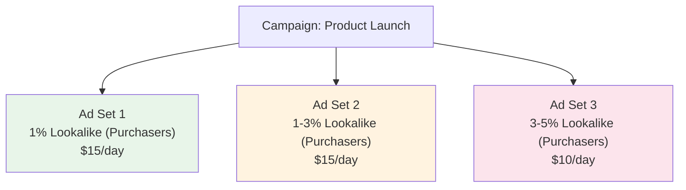

## The Power of Targeting the Right People

You could have the most beautiful ad in the world, but if you show it to the wrong people, it will not work. Imagine trying to sell winter coats to people in the tropics, or promoting a kids' game to retirees. Audience targeting is how you make sure your ads reach the people who actually care about what you are offering.

Meta's audience tools are among the most powerful in digital advertising. They let you target people based on who they are, what they have done, and who they resemble. Understanding these tools will dramatically improve your ad performance.

In this guide, we will cover every audience type available in Meta advertising, explain when to use each one, and walk you through creating them step by step.

<Tip>
Audience targeting is arguably the second most important factor in ad success (after the ad creative itself). Even a mediocre ad shown to the perfect audience will outperform an amazing ad shown to the wrong audience. Take the time to understand these concepts — they are the key to profitable advertising.
</Tip>

---

## The Four Types of Meta Audiences

Meta offers four main ways to define who sees your ads:

1. **Saved Audiences** — You manually define demographics, interests, and behaviors
2. **Custom Audiences** — You target people who have already interacted with your business
3. **Lookalike Audiences** — Meta finds new people who are similar to your existing customers
4. **Advantage+ Audience** — Meta's AI automatically finds the best audience using your suggestions

Let us explore each one in detail.

---

## 1. Saved Audiences (Manual Targeting)

Saved Audiences are the most basic audience type. You manually tell Meta who you want to reach by specifying demographics, interests, and behaviors. Think of it as filling out a "wanted poster" for your ideal customer.

### How to Create a Saved Audience:

1. Go to **[adsmanager.facebook.com](https://adsmanager.facebook.com)**
2. Click the **hamburger menu** and navigate to **Audiences**
3. Click **Create Audience** → **Saved Audience**
4. Give your audience a **name** (be descriptive — like "US Women 25-44 Fitness Enthusiasts")

### Location Targeting

5. Under **Locations**, choose who to include:
   - **People living in or recently in this location** (most common)
   - **People living in this location** (most precise)
   - **People recently in this location** (for tourists or travelers)
   - **People traveling in this location** (specifically travelers)

6. Type in the location you want to target:
   - You can target entire countries, states/provinces, cities, zip codes, or even a radius around a specific address
   - You can add multiple locations
   - You can also **exclude** locations (e.g., target all of the US except Alaska and Hawaii)

### Age and Gender

7. Set the **age range** (minimum 18, maximum 65+)
8. Choose **gender** (All, Men, or Women)

### Detailed Targeting (Interests, Behaviors, and Demographics)

This is where Saved Audiences get interesting. You can target people based on:

**Demographics:**
- Education level (high school, college, graduate degree)
- Job title or industry
- Relationship status
- Life events (recently moved, newly engaged, new job)
- Parental status

**Interests:**
- Hobbies and activities
- Favorite entertainment (movies, music, TV shows)
- Sports and fitness
- Technology interests
- Shopping interests
- Business interests

**Behaviors:**
- Purchase behavior (online shoppers, big spenders)
- Device usage (iPhone users, Android users, tablet users)
- Travel habits (frequent travelers, commuters)
- Digital activities (early technology adopters, gamers)

9. Click **Browse** to explore available categories, or type keywords in the search box
10. Click **Suggestions** to see related interests after adding one
11. Add as many relevant interests as you need

### Narrowing Your Audience

12. Below your initial targeting, you will see an option to **Narrow audience**
13. Click **Narrow further** to add a second layer of targeting with AND logic:
   - The first layer uses OR logic (people must match ANY of the interests)
   - The narrowing layer uses AND logic (people must ALSO match at least one interest from this layer)

**Example:**
- Layer 1: Interested in "Running" OR "Yoga" OR "Gym" (people who like fitness)
- Layer 2 (Narrow): AND interested in "Mobile apps" OR "App Store" (people who also use apps)
- Result: Fitness enthusiasts who also use mobile apps

### Excluding Audiences

14. Click **Exclude** to remove specific groups:
   - Exclude people who have already converted (to avoid wasting money)
   - Exclude existing customers
   - Exclude competitors' followers

### Saving Your Audience

15. Once you are happy with your audience definition, click **Create Saved Audience**
16. You can now select this audience whenever you create a new ad set

<Tip>
Watch the **audience size meter** on the right side of the screen as you add targeting criteria. Meta shows you an estimated audience size. For most campaigns, you want an audience of at least **500,000 to 2,000,000 people**. If your audience is too small (under 100,000), Meta's algorithm may struggle to find enough people to optimize delivery. If it is too large (tens of millions), that is usually fine — Meta's algorithm is good at finding the best people within a large audience.
</Tip>

---

## 2. Custom Audiences

Custom Audiences are one of Meta's most powerful features. Instead of targeting people based on interests, you target people based on their actual relationship with your business. These are people who have already shown interest in what you offer.

### Types of Custom Audiences:

#### A. Website Custom Audiences (Based on Meta Pixel Data)

Target people who have visited your website. This requires the Meta Pixel to be installed and working.

**How to Create a Website Custom Audience:**

1. Go to **Audiences** in Ads Manager
2. Click **Create Audience** → **Custom Audience**
3. Select **Website** as the source
4. Choose your **Pixel**
5. Define who to include:
   - **All website visitors** — Everyone who visited any page in the last X days
   - **People who visited specific pages** — Visitors to specific URLs (like your pricing page or product pages)
   - **Visitors by time spent** — The top 5%, 10%, or 25% of visitors by time on site
6. Set the **retention window** (how far back to go):
   - 1 day to 180 days
   - Shorter windows = smaller but more recent audience
   - Longer windows = larger but includes older visitors
7. Give your audience a **name** (like "Website Visitors - Last 30 Days")
8. Click **Create Audience**

**Best Website Custom Audiences to Create:**

| Audience | What It Is | Best For |
|---|---|---|
| All visitors (last 30 days) | Everyone who visited your site recently | General retargeting |
| Visited product pages (last 14 days) | People who looked at products | Mid-funnel retargeting |
| Added to cart but did not purchase (last 7 days) | Cart abandoners | High-intent retargeting |
| Purchasers (last 180 days) | Existing customers | Upselling or excluding |
| Top 10% by time spent (last 30 days) | Most engaged visitors | High-quality retargeting |

#### B. Customer List Custom Audiences

Upload your own customer data (emails, phone numbers) to match with Meta users.

**How to Create a Customer List Custom Audience:**

1. Go to **Audiences** → **Create Audience** → **Custom Audience**
2. Select **Customer List**
3. Prepare your file:
   - CSV or TXT format
   - Include columns like: email, phone number, first name, last name
   - The more data points you include, the higher the match rate
4. Upload your file
5. Map your columns to Meta's fields (email → Email, phone → Phone, etc.)
6. Click **Import & Create**
7. Meta will hash (encrypt) your data and match it against their users
8. Match rates typically range from 30-70% depending on data quality

<Tip>
Customer list audiences are incredibly powerful for two things: (1) retargeting existing customers with new offers or upsells, and (2) creating Lookalike Audiences based on your best customers. Upload your list of paying customers, and then create a Lookalike Audience from it — this is often the highest-performing audience strategy in all of Meta advertising.
</Tip>

#### C. App Activity Custom Audiences

Target people who have used your mobile app.

**How to Create an App Activity Custom Audience:**

1. Go to **Audiences** → **Create Audience** → **Custom Audience**
2. Select **App Activity**
3. Choose your app from the dropdown
4. Choose the event to target:
   - People who opened your app
   - People who completed a specific action (purchase, registration, etc.)
   - People who are the most active users
   - People who have not opened the app recently (lapsed users)
5. Set the time window (1-180 days)
6. Give it a name and click **Create Audience**

#### D. Engagement Custom Audiences

Target people who have interacted with your Meta content (even if they never visited your website).

**How to Create an Engagement Custom Audience:**

1. Go to **Audiences** → **Create Audience** → **Custom Audience**
2. Select **Meta Sources**
3. Choose the engagement source:
   - **Video** — People who watched your videos (25%, 50%, 75%, or 95% of the video)
   - **Lead Form** — People who opened or submitted your lead forms
   - **Instagram Account** — People who interacted with your Instagram profile
   - **Facebook Page** — People who interacted with your Facebook Page
   - **Events** — People who responded to your Facebook events
   - **Shopping** — People who interacted with your Facebook or Instagram shop
4. Define the specific engagement criteria
5. Set the time window
6. Click **Create Audience**

**Most Useful Engagement Audiences:**

| Source | Criteria | Best For |
|---|---|---|
| Video | Watched 75%+ of any video (last 30 days) | People with strong interest in your content |
| Instagram | Anyone who engaged (last 90 days) | Warm Instagram audience |
| Facebook Page | Anyone who engaged (last 90 days) | Warm Facebook audience |
| Lead Form | Opened but did not submit (last 30 days) | Re-engaging almost-leads |

---

## 3. Lookalike Audiences

Lookalike Audiences are where the real magic happens. You give Meta a "seed" audience (like your best customers), and Meta uses its vast data to find NEW people who share similar characteristics, behaviors, and patterns. These are people who have never interacted with your business but statistically look like your existing customers.

### How Lookalike Audiences Work:

1. You provide a **source audience** (your "seed") — this could be a Custom Audience of purchasers, email subscribers, or app users
2. Meta analyzes the characteristics of people in your source audience
3. Meta searches through its billions of users to find people with similar characteristics
4. You choose a **percentage size** (1% to 10%) — this determines how similar the Lookalike is to your source

### Understanding Lookalike Percentages:

- **1% Lookalike:** The top 1% of people most similar to your source audience. This is the smallest, most precise audience. In the US, 1% is roughly 2.1 million people.
- **2-3% Lookalike:** A bit broader. Still very similar to your source, but includes more people.
- **5% Lookalike:** Moderately similar. Good balance between reach and precision.
- **10% Lookalike:** The broadest option. These people share some characteristics with your source but are less closely matched.

### How to Create a Lookalike Audience:

1. Go to **Audiences** in Ads Manager
2. Click **Create Audience** → **Lookalike Audience**
3. Select your **source audience**:
   - A Custom Audience (best option — use your purchasers or most valuable customers)
   - Your Facebook Page
   - Your Pixel data
4. Select the **location** where you want to find lookalike people (e.g., United States)
5. Choose the **audience size** (1% to 10%):
   - Start with **1%** for the most similar match
   - You can create multiple sizes to test

6. Click **Create Audience**
7. Meta will take a few hours to build the audience (sometimes up to 24 hours)

### Best Source Audiences for Lookalikes:

| Source | Why It Works |
|---|---|
| Purchasers (last 180 days) | Finds people likely to buy |
| High-value purchasers (top 25% by spend) | Finds people likely to spend a lot |
| Email subscribers who opened (last 90 days) | Finds engaged potential customers |
| App users who completed key actions | Finds high-quality app users |
| Video viewers (watched 75%+) | Finds people with strong interest |

<Tip>
The quality of your Lookalike Audience depends entirely on the quality of your source audience. A 1% Lookalike based on your top 100 highest-spending customers will vastly outperform a 1% Lookalike based on all website visitors. Always use the most "valuable" source you can — people who actually spent money, subscribed, or took high-value actions. The source audience should have at least **100 people** (Meta requires this minimum), but **1,000+ is ideal**.
</Tip>

### Advanced Lookalike Strategies:

#### Stacked Lookalikes

Create multiple Lookalike sizes and test them in separate ad sets:

The 1% will usually be the cheapest per conversion but has the smallest reach. The 3-5% has more reach but may cost more per conversion. Testing helps you find the sweet spot.

#### Value-Based Lookalikes

If you send purchase values with your Pixel events (which we set up in the Pixel guide), Meta can create Lookalikes weighted toward higher-value customers:

1. When creating a Custom Audience from customer lists, include a "Value" column
2. Create a Lookalike from this value-based Custom Audience
3. Meta will prioritize finding people who resemble your highest-value customers, not just any customer

#### International Lookalikes

You can use a source audience from one country to find similar people in another:

1. Create a Custom Audience of US purchasers
2. Create a Lookalike targeting the UK
3. Meta will find UK users who match the behavior patterns of your US customers
4. This is incredibly useful for international expansion

---

## 4. Advantage+ Audience

Advantage+ Audience is Meta's newest and most AI-driven audience option. Instead of you manually defining the audience, you provide "suggestions" and Meta's AI does the rest.

### How Advantage+ Audience Works:

1. You provide **audience suggestions** (optional):
   - Custom Audiences to use as starting points
   - Interests or demographics to guide the AI
   - Location and age constraints
2. Meta's AI uses your suggestions as starting points
3. The AI automatically expands beyond your suggestions if it finds better-performing audiences
4. Over time, the AI learns who responds best and shifts delivery toward those people

### When to Use Advantage+ Audience:

- **New campaigns** where you do not have enough data for Custom or Lookalike Audiences
- **Campaigns where you want maximum reach** without worrying about targeting details
- **Testing** to see if Meta's AI can find better audiences than your manual targeting
- **Scaling** existing campaigns when your current audiences are maxed out

### How to Set Up Advantage+ Audience:

1. When creating a new ad set, you will see the Audience section
2. By default, Advantage+ Audience may be selected
3. Add your **audience suggestions**:
   - Click **Add suggestions**
   - Add Custom Audiences you want Meta to use as a starting point
   - Add interests or demographics
4. Set your **audience controls** (hard limits that Meta will NOT expand beyond):
   - **Minimum age** and **maximum age**
   - **Locations** — Meta will only show ads in these locations
   - **Languages** — If you need to restrict to specific languages
5. These controls are strict — Meta will respect them even when expanding the audience

<Tip>
Advantage+ Audience is particularly effective when you pair it with a strong Custom Audience suggestion. For example, add your "Purchasers - Last 180 Days" Custom Audience as a suggestion, and Meta's AI will look for similar people while also exploring new audience segments it thinks will perform well. It is like giving Meta a head start — "Here are my best customers, now go find more people like them, but also look in places I might not have thought of."
</Tip>

---

## Audience Overlap: A Critical Concept

When you run multiple ad sets targeting different audiences, those audiences may overlap — meaning the same person could be in more than one audience. This causes problems:

- **Your ad sets compete against each other** in the auction, driving up your costs
- **The same people see too many of your ads**, leading to ad fatigue
- **Your data gets muddled**, making it hard to know which audience actually works best

### How to Check for Audience Overlap:

1. Go to **Audiences** in Ads Manager
2. Select two or more audiences by checking the boxes next to them
3. Click the **three dots (...)** menu
4. Select **Show Audience Overlap**
5. Meta will show you a Venn diagram with the percentage of overlap

### How to Reduce Audience Overlap:

- **Exclude Custom Audiences** from each other (e.g., exclude "Purchasers" from your "Website Visitors" audience)
- **Use different Lookalike ranges** that do not overlap (1% and 3-5% instead of 1% and 2%)
- **Use Advantage Campaign Budget** so Meta automatically distributes budget and reduces self-competition
- **Consolidate ad sets** when possible — fewer, broader ad sets often perform better than many narrow ones

---

## Audience Strategies by Business Stage

### Just Starting Out (No Data Yet)

If you are brand new and have no website visitors, customers, or app users:

1. Start with **Advantage+ Audience** with broad interest suggestions
2. Use **Saved Audiences** with 3-5 relevant interests
3. Cast a wide net — broad targeting with good creative is better than narrow targeting with bad creative
4. Focus on collecting data (Pixel events, customer lists) as quickly as possible

### Growing (Some Data Available)

If you have been running ads or have a website with some traffic:

1. Create **Website Custom Audiences** for retargeting
2. Build your first **Lookalike Audience** from website visitors or early converters
3. Test Lookalikes against Saved Audiences to see which performs better
4. Start building your email list for future Customer List uploads

### Established (Plenty of Data)

If you have a large customer base and lots of Pixel data:

1. Create **Value-Based Lookalike Audiences** from top customers
2. Build a **full retargeting funnel** (see below)
3. Test **Advantage+ Audience** to discover new audience segments
4. Regularly refresh your Custom Audiences and Lookalike sources

---

## Building a Retargeting Funnel

A retargeting funnel shows different ads to people based on how close they are to converting. Here is a proven structure:

### Stage 1: Cold Audience (Prospecting)

- **Who:** People who have never interacted with your business
- **Audiences:** Lookalike Audiences, Saved Audiences with interests, Advantage+ Audience
- **Ad message:** Introduce your brand and its key benefit
- **Budget allocation:** 60-70% of total budget

### Stage 2: Warm Audience (Consideration)

- **Who:** People who have shown interest but have not converted
- **Audiences:** Website visitors (last 30 days), video viewers (watched 50%+), Instagram/Facebook engagers
- **Ad message:** Show more details, social proof, testimonials, case studies
- **Budget allocation:** 20-25% of total budget

### Stage 3: Hot Audience (Conversion)

- **Who:** People who are very close to converting
- **Audiences:** Added to cart but did not purchase (last 7 days), visited pricing page, started checkout
- **Ad message:** Urgency, limited-time offers, reminders, special discounts
- **Budget allocation:** 10-15% of total budget

### Stage 4: Existing Customers (Retention/Upsell)

- **Who:** People who have already purchased or subscribed
- **Audiences:** Customer list Custom Audience, purchasers (last 180 days)
- **Ad message:** New products, upgrades, complementary products, loyalty rewards
- **Budget allocation:** 5-10% of total budget

<Tip>
When setting up your retargeting funnel, make sure to **exclude** later-stage audiences from earlier stages. For example, exclude "Purchasers" from your Cold and Warm audiences, and exclude "Added to Cart" from your Cold audience. This prevents people from seeing the wrong message and wasting your ad spend on the wrong stage.
</Tip>

---

## Audience Size Guidelines

Here are rough guidelines for audience sizing:

| Campaign Type | Minimum Recommended Size | Ideal Size |
|---|---|---|
| Prospecting (cold) | 500,000 | 1,000,000 - 10,000,000 |
| Lookalike (1%) | Varies by country | ~2,000,000 in the US |
| Retargeting (warm) | 1,000 | 10,000 - 100,000 |
| Retargeting (hot) | 500 | 1,000 - 50,000 |
| Customer list source | 100 (minimum) | 1,000+ |
| Lookalike source | 100 (minimum) | 1,000 - 50,000 |

### What Happens If Your Audience Is Too Small?

- Meta may struggle to deliver your ads consistently
- You may see very high CPMs (cost per 1,000 impressions)
- The algorithm may not have enough data to optimize effectively
- Solution: Broaden your targeting or extend the time window for Custom Audiences

### What Happens If Your Audience Is Too Large?

- Generally this is fine — Meta's algorithm is good at finding the right people within a large group
- You might see higher impression volume but potentially lower relevance
- Solution: This usually is not a problem, but you can narrow if conversions are poor

---

## Troubleshooting Audience Issues

### "My Custom Audience is too small"

**Possible causes:**
- Not enough people have visited your website or used your app
- The time window is too short
- The Pixel or SDK is not installed correctly

**Solutions:**
1. Extend the time window (try 60 or 90 days instead of 30)
2. Broaden the criteria (all visitors instead of specific page visitors)
3. Verify your Pixel is working correctly
4. Run traffic campaigns to build your audience before retargeting

### "My Lookalike Audience is not performing well"

**Possible causes:**
- The source audience is too small or too broad
- The source audience is not representative of your best customers
- The Lookalike percentage is too high

**Solutions:**
1. Use a higher-quality source (purchasers > visitors)
2. Use a smaller source of your BEST customers rather than all customers
3. Try a smaller Lookalike percentage (1% instead of 5%)
4. Make sure your source audience has at least 1,000 people

### "My retargeting audience costs too much"

**Possible causes:**
- The audience is too small, causing frequency to spike
- You are not refreshing your creative often enough
- People are seeing the same ad too many times

**Solutions:**
1. Expand the time window to include more people
2. Rotate your ad creative every 1-2 weeks
3. Monitor frequency (if people see your ad more than 3-4 times per week, refresh creative)
4. Lower the budget for small retargeting audiences

---

## Your Audience Checklist

- [ ] Created at least one Saved Audience with relevant interests
- [ ] Created Website Custom Audience (all visitors, last 30 days)
- [ ] Created Website Custom Audience (key pages or events)
- [ ] Created a Customer List Custom Audience (if you have customer data)
- [ ] Created a Lookalike Audience (1%) from your best source
- [ ] Set up Advantage+ Audience with suggestions for prospecting
- [ ] Checked for audience overlap between ad sets
- [ ] Set up exclusions (exclude purchasers from prospecting audiences)
- [ ] Planned your retargeting funnel (cold → warm → hot)

---

## What Comes Next

You now understand every audience type available in Meta advertising and how to use them strategically. The combination of Custom Audiences for retargeting and Lookalike Audiences for prospecting is the foundation of virtually every successful Meta advertising strategy.

In the **Optimization** guide, we will cover how to analyze your campaign performance, test different approaches, scale what works, and fix what does not. Everything we have covered so far — the account setup, tracking, campaign creation, and audiences — comes together in the optimization phase.

<Tip>
Your audiences are not set-and-forget. As your business grows and you collect more data, your Custom Audiences get richer, your Lookalike Audiences get smarter, and your retargeting funnel gets more effective. Revisit and update your audiences at least once a month — upload fresh customer lists, create new Lookalikes from recent converters, and expand your retargeting windows as your audience grows.
</Tip>
