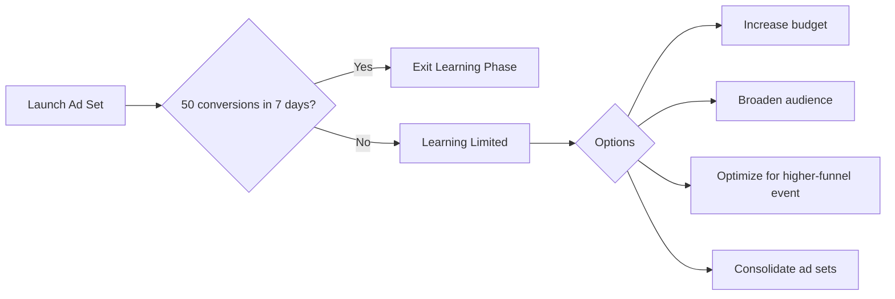
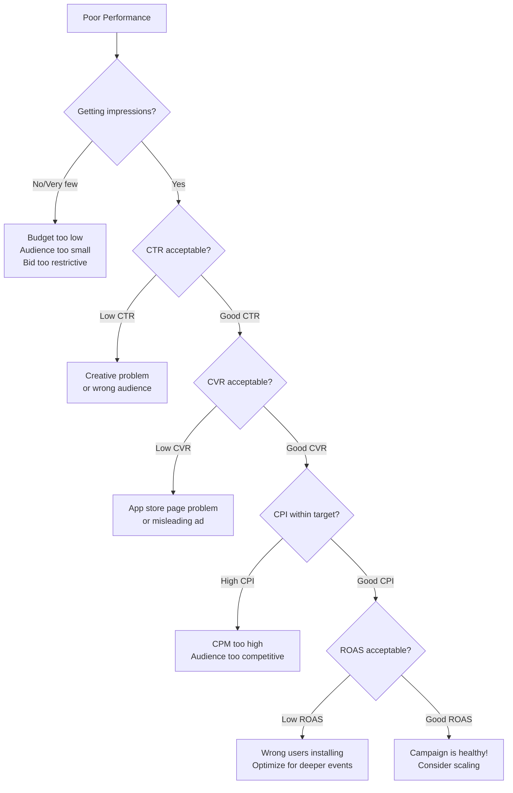
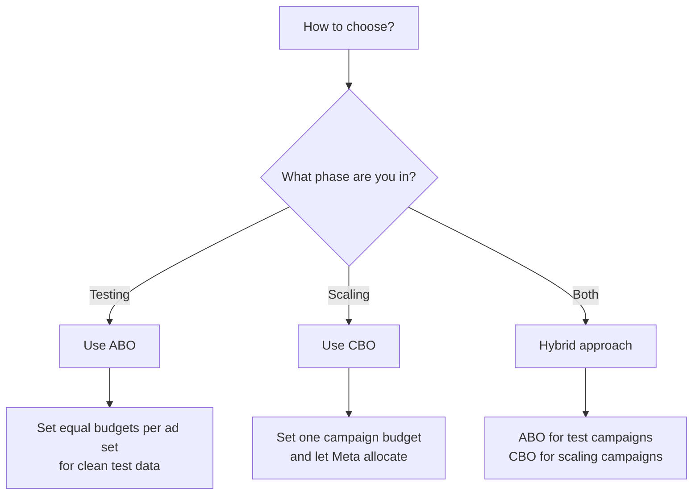
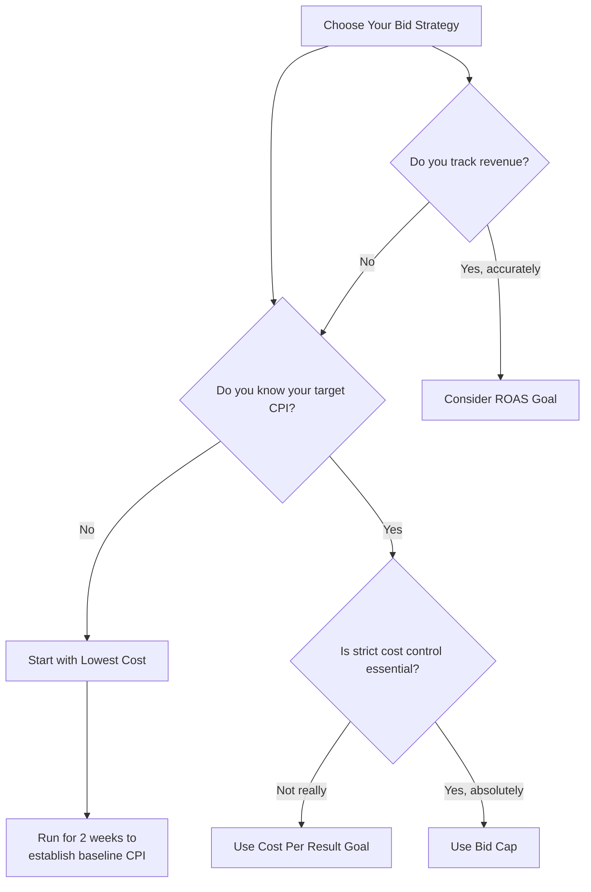

## Good campaigns are not born — they are optimized

Your first campaign will probably not be your best. That is completely expected. The difference between advertisers who succeed and those who waste money is **systematic optimization** — reading the data, making smart changes, and repeating the process.

This guide covers everything you need to turn a mediocre campaign into a profitable one.

---

## Part 1: The learning phase — Meta's most misunderstood feature

Before you optimize anything, you need to understand the learning phase. Mismanaging it is the single most common reason campaigns fail.

### What the learning phase actually is

When you create a new ad set (or make a significant edit to an existing one), Meta's algorithm enters a period of **active experimentation**. During this phase, the system is trying to figure out:

- Which users are most likely to take your desired action
- Which placements perform best for your specific ad
- What time of day yields the best results
- How to balance delivery across your audience

Think of it like a new employee's first week — they need time to learn the job before they can perform at their best.

### How many conversions does it take?

Meta needs approximately **50 conversions per ad set within a 7-day window** to exit the learning phase. This means:

- If you optimize for **app installs** and get 8+ installs per day, you will exit in about a week
- If you optimize for **purchases** and only get 2 per day, you may never exit — consider optimizing for a more frequent event (like "add to cart") first
- If you optimize for **clicks**, you will exit quickly, but the optimization will be less valuable



### What resets the learning phase

Any **significant edit** to an ad set restarts the learning phase. Here is what counts as significant:

<AccordionGroup>
  <Accordion title="Changes that RESET learning">
    - Changing the budget by more than 20% in a single edit
    - Changing the targeting (audience, locations, age, gender)
    - Changing the optimization event (e.g., from installs to purchases)
    - Changing the bid strategy or bid cap
    - Adding new creative to the ad set
    - Pausing the ad set for 7+ days and restarting
  </Accordion>
  <Accordion title="Changes that DO NOT reset learning">
    - Budget changes of 20% or less
    - Changing the ad name (cosmetic only)
    - Changing the campaign name
    - Adjusting the campaign spending limit
    - Adding a new ad set to the campaign (does not affect existing ad sets)
  </Accordion>
</AccordionGroup>

<Warning>
  Here is the golden rule: **if your ad set is in the learning phase, do not touch it.** Set it up correctly from the start, then let Meta do its thing. The temptation to tweak things on day 2 is strong — resist it. Wait at least 5-7 days before making any judgments.
</Warning>

---

## Part 2: Reading the Ads Manager dashboard

Before you can optimize, you need to understand what the numbers mean. Here is a complete guide to the Ads Manager reporting interface.

### Setting up your columns

Ads Manager defaults to a basic set of columns. Customize them for app campaigns:

<Steps>
  <Step title="Click 'Columns' dropdown in Ads Manager">
    You will see preset options like "Performance," "Delivery," "Engagement," etc.
  </Step>
  <Step title="Select 'Customize Columns'">
    This opens a panel where you can pick exactly which metrics to show.
  </Step>
  <Step title="Add these essential columns for app campaigns">
    Search for and add each of these:

    **Core metrics:**
    - Results (installs, or whatever your optimization event is)
    - Cost per result (CPI)
    - Amount spent
    - Impressions
    - Reach
    - Frequency

    **Engagement metrics:**
    - CTR (Click-Through Rate) — all clicks
    - CTR (Link Click-Through Rate) — only link clicks
    - CPC (Cost Per Link Click)
    - Link clicks

    **Conversion metrics:**
    - App installs
    - Cost per app install
    - App events (if tracking in-app events)
    - Purchases (if tracking)
    - Purchase conversion value (if tracking)
    - ROAS (Return on Ad Spend)

    **Delivery metrics:**
    - CPM (Cost Per 1,000 Impressions)
    - Delivery status (learning, active, etc.)
  </Step>
  <Step title="Save as a preset">
    Click **Save as preset** and name it "App Campaign Dashboard." You can load this preset anytime.
  </Step>
</Steps>

### Every key metric explained

| Metric | What it means | What it tells you |
|--------|--------------|-------------------|
| **Impressions** | Total times your ad was shown (same person can see it multiple times) | How much delivery you are getting |
| **Reach** | Number of unique people who saw your ad | How many different people you reached |
| **Frequency** | Average number of times each person saw your ad (Impressions / Reach) | Whether you are over-saturating your audience |
| **CPM** | Cost to show your ad 1,000 times | How competitive the auction is for your audience |
| **Link clicks** | Clicks that go to your destination (app store, website) | How many people took action |
| **CTR (link)** | Percentage of impressions that resulted in a link click | **How compelling your ad is** — most important engagement metric |
| **CPC** | Cost per link click | How much each click costs you |
| **CPI** | Cost per app install | **Your primary efficiency metric** |
| **CVR** | Conversion rate — percentage of link clicks that became installs | How well your app store page converts |
| **ROAS** | Revenue generated per dollar spent on ads | **Whether your ads are profitable** |
| **Hook Rate** | Percentage of video viewers who watch past 3 seconds | How strong your video opening is |
| **Hold Rate** | Percentage of viewers who watch 50%+ of your video | How engaging your full video is |

### What "good" looks like

| Metric | Poor | Acceptable | Good | Great |
|--------|------|------------|------|-------|
| **CTR (link)** | < 0.5% | 0.5-1.0% | 1.0-2.0% | > 2.0% |
| **CPI** (varies by category) | > 2x your target | Within 1.5x target | Within target | Below target |
| **CVR** (click to install) | < 15% | 15-25% | 25-40% | > 40% |
| **Frequency** (prospecting) | > 4 | 3-4 | 1.5-3 | 1-1.5 |
| **CPM** | > $20 | $10-20 | $5-10 | < $5 |
| **ROAS** | < 0.5x | 0.5-1.0x | 1.0-2.0x | > 2.0x |
| **Hook Rate** (video) | < 15% | 15-25% | 25-40% | > 40% |

### Understanding delivery status

Your campaign, ad set, or ad will show one of these statuses:

| Status | What it means | Action |
|--------|--------------|--------|
| **Learning** | Algorithm is still collecting data (needs ~50 conversions) | Do not make changes. Wait. |
| **Learning Limited** | Not getting enough conversions to exit learning phase | See troubleshooting section below |
| **Active** | Running normally, fully optimized | Monitor and optimize as needed |
| **In Review** | Ad is being reviewed by Meta | Wait (usually 15 min - 24 hours) |
| **Rejected** | Ad violated a policy | Read the rejection reason and fix it |
| **Not Delivering** | Campaign is on but not spending | Check budget, bid, audience size, and payment method |
| **Completed** | Campaign reached its end date or lifetime budget | Restart or create a new campaign |
| **Scheduled** | Campaign is set to start in the future | Wait for the start date |

---

## Part 3: The optimization decision tree

When performance is not where you want it, diagnose the problem systematically instead of changing things randomly.



### Diagnosing each problem

<AccordionGroup>
  <Accordion title="Problem: Low impressions / not spending">
    **Symptoms:** Campaign is active but spending little or nothing.

    **Possible causes and fixes:**
    1. **Budget too low:** Increase daily budget. Meta may not deliver at very low budgets ($1-2/day).
    2. **Audience too small:** Expand your targeting. Audience under 500K is too narrow for most objectives.
    3. **Bid cap too low:** If using bid cap strategy, your cap may be below market rate. Raise it or switch to Highest Volume.
    4. **Payment issue:** Check that your payment method is active and not declined.
    5. **Ad still in review:** Some ads take up to 48 hours for review, especially new accounts.
    6. **Account spending limit reached:** Check Payment Settings for any account-level spending limits.
    7. **Schedule conflict:** If using lifetime budget with ad scheduling, you may have blocked the current time window.
  </Accordion>
  <Accordion title="Problem: Low CTR (people see but don't click)">
    **Symptoms:** High impressions but CTR below 0.5%.

    **Possible causes and fixes:**
    1. **Creative is not attention-grabbing:** Your image or video does not stand out in the feed. Test new creative with a stronger hook, brighter colors, a human face, or a bold text overlay.
    2. **Wrong audience:** Your ad is being shown to people who do not care about your product. Try different interests or go broader to let the algorithm find better users.
    3. **Ad fatigue:** If frequency is above 3-4, the same people have seen your ad too many times. Refresh creative or expand your audience.
    4. **Weak primary text:** Your message is not compelling. Test different angles (problem/solution, social proof, curiosity).
    5. **Wrong placement/format fit:** Your square image looks bad in Stories. Provide creative in the correct aspect ratios for each placement.
  </Accordion>
  <Accordion title="Problem: High CTR but low CVR (people click but don't install)">
    **Symptoms:** Good CTR (1%+) but CVR below 15%.

    **Possible causes and fixes:**
    1. **Poor app store page:** Improve your app icon, screenshots, description, and ratings.
    2. **Misleading ad:** Your ad promises something the app does not deliver. Align ad messaging with the actual app experience.
    3. **Large app size:** If your app is over 200MB, many users will not download it on cellular data.
    4. **App not available in user's region:** Double-check that your app is available in the countries you are targeting.
    5. **Tracking issue:** Installs might be happening but not being tracked. Verify your SDK setup in Events Manager.
  </Accordion>
  <Accordion title="Problem: High CPI (expensive installs)">
    **Symptoms:** Getting installs but CPI is 2x or more above your target.

    **Possible causes and fixes:**
    1. **High CPM (expensive audience):** Try broader targeting, different geographic markets, or wait for a less competitive time of year.
    2. **Low CTR driving up CPI:** Since CPI = CPM / (CTR x CVR x 1000), a low CTR directly increases CPI. Fix your creative.
    3. **Low CVR driving up CPI:** Even with good clicks, if people do not install, CPI rises. Fix your app store page.
    4. **Budget too spread out:** Consolidate into fewer ad sets with higher budgets.
    5. **Audience too narrow:** Small audiences have higher competition. Expand your targeting.
  </Accordion>
  <Accordion title="Problem: Good CPI but low ROAS (cheap installs, no revenue)">
    **Symptoms:** CPI is within target but users are not generating revenue.

    **Possible causes and fixes:**
    1. **Targeting the wrong users:** Switch optimization from "App Installs" to "App Events" (like Purchase or Subscribe) if you have enough event data.
    2. **Onboarding/activation problem:** Users install but drop off before experiencing value. This is a product problem, not an ad problem.
    3. **Monetization problem:** Your pricing, paywall timing, or value proposition may need work.
    4. **Attribution window too short:** You might be measuring revenue too quickly. Some apps take weeks for users to convert.
  </Accordion>
</AccordionGroup>

---

## Part 4: Creative optimization

Creative is the single most impactful variable in Meta advertising. The algorithm can only work with what you give it. A brilliant audience strategy with bad creative will always lose to an average audience strategy with great creative.

### The structured testing process

<Steps>
  <Step title="Define your testing variables">
    Only test one variable at a time. Here are the variables in priority order:

    | Priority | Variable | Examples |
    |----------|----------|---------|
    | 1 (highest) | **Visual format** | Image vs. video vs. carousel |
    | 2 | **Hook / concept** | The first 3 seconds of video, or the main image idea |
    | 3 | **Copy angle** | Problem-focused vs. benefit-focused vs. social proof |
    | 4 | **Call to action** | Install Now vs. Try Free vs. Learn More |
    | 5 | **Headline** | Different value propositions |

    Start with high-priority variables. Testing headlines before you have found the right visual format is putting the cart before the horse.
  </Step>
  <Step title="Create 3-5 variations">
    Within a single ad set, create 3-5 ads that differ by your chosen test variable. Keep everything else the same.

    Example — testing visual hooks:
    - Ad 1: Video starting with a person frustrated at their desk
    - Ad 2: Video starting with a satisfying app demo (screen recording)
    - Ad 3: Video starting with a bold text overlay statistic
    - Ad 4: Static image of the app in a phone mockup
    - Ad 5: Static image with user testimonial
  </Step>
  <Step title="Set a fair test budget">
    Each ad needs enough budget to reach **statistical significance**. A rough guideline:
    - At least **1,000 impressions per ad** (bare minimum)
    - Ideally **2,000-5,000 impressions per ad** for reliable results
    - At your expected CPM, calculate: (impressions needed x number of ads x CPM) / 1,000

    Example: 5 ads x 3,000 impressions x $10 CPM / 1,000 = $150 total, or about $20-25/day over 7 days.
  </Step>
  <Step title="Run for 5-7 days">
    Do not look at results on day 1-2. The algorithm needs time to optimize. After 5-7 days, you will have reliable data.
  </Step>
  <Step title="Identify the winner">
    Compare ads by CPI (primary), CTR (secondary), and volume (tertiary). The winner has the best combination of these three.
  </Step>
  <Step title="Iterate on the winner">
    Take the winning concept and create 3-5 new variations of it. If a video with an app demo won, make 3 new app demo videos with different hooks. This "winner iteration" cycle is how you continuously improve over time.
  </Step>
  <Step title="Repeat every 1-2 weeks">
    Creative fatigue is real. Even your best-performing ads will decline after 2-4 weeks as your audience sees them repeatedly. Always have fresh creative in development.
  </Step>
</Steps>

### Dynamic Creative Optimization (DCO)

Dynamic Creative lets you upload multiple versions of each creative element (images, videos, headlines, descriptions, CTAs), and Meta automatically tests every possible combination to find the best performers.

**How to use it effectively:**

| Element | How many to upload | Tips |
|---------|-------------------|------|
| **Images/Videos** | 3-5 | Include a mix of formats (lifestyle, product, UGC-style) |
| **Primary text** | 3-5 | Test different angles: benefit, problem, social proof, urgency |
| **Headlines** | 3-5 | Keep them short. Test value props, questions, and direct statements |
| **Descriptions** | 2-3 | Often hidden on mobile, so less impactful |
| **CTA buttons** | 2-3 | "Install Now," "Learn More," and "Sign Up" are the most common |

<Note>
  Dynamic Creative is great for finding winning combinations quickly, but it has a downside: you cannot see exactly which combination performed best, only which individual element won. Once you identify winning elements, create dedicated ads that combine them manually for cleaner reporting.
</Note>

### Creative format performance benchmarks

| Format | Average CTR | Average CPI | Best use case |
|--------|------------|-------------|---------------|
| **Short video (15-30s)** | 1.5-2.5% | Often lowest | App demos, feature highlights, testimonials |
| **UGC-style video** | 1.8-3.0% | Low-medium | Social proof, authenticity, review-style content |
| **Static image** | 0.8-1.5% | Medium | Simple value propositions, promotional offers |
| **Carousel** | 1.0-2.0% | Medium | Feature showcases, step-by-step tutorials |
| **Playable ad** | 2.0-4.0% | Varies | Gaming apps, interactive app previews |

### Statistical significance

How do you know if one ad is actually better, or if the difference is just random chance?

**Quick rule of thumb:** An ad needs at least **30-50 conversions** before you can trust its CPI is representative. With fewer conversions, the margin of error is too large.

<Warning>
  **Do not declare a winner after 5 installs vs 3 installs.** That is noise, not signal. With small numbers, one lucky (or unlucky) conversion can completely change the CPI. Wait for meaningful sample sizes.
</Warning>

---

## Part 5: A/B testing in Ads Manager

Meta has a built-in A/B testing (split testing) tool that lets you run controlled experiments. This is far more reliable than just launching two ad sets and eyeballing the results.

### How to set up an A/B test

<Steps>
  <Step title="Go to the Experiments section">
    In Ads Manager, click the **A/B Test** button in the toolbar, or go to **All Tools > Experiments**.
  </Step>
  <Step title="Choose what to test">
    You can test one variable at a time: **creative, audience, placement, or delivery optimization.** Meta will split your audience randomly so each group only sees one version.
  </Step>
  <Step title="Set your success metric">
    Choose what defines "winning" — CPI, CPA, CTR, or a custom metric. Meta will calculate statistical significance for you.
  </Step>
  <Step title="Set duration and budget">
    Run the test for at least 7 days. Shorter tests often do not reach statistical significance. Budget should be enough for each version to get 50+ conversions.
  </Step>
  <Step title="Read the results">
    Meta will tell you which version won, the confidence level, and the estimated improvement. Only act on results with 90%+ confidence.
  </Step>
</Steps>

### What to A/B test (in priority order)

| Priority | What to test | Why |
|----------|-------------|-----|
| 1 | **Creative format** (image vs. video vs. carousel) | Format choice has the biggest impact on performance |
| 2 | **Video hook** (first 3 seconds) | Determines whether anyone watches your ad |
| 3 | **Optimization event** (installs vs. purchases vs. add-to-cart) | Affects who Meta shows your ad to |
| 4 | **Audience** (broad vs. lookalike vs. interest) | Determines the pool of potential converters |
| 5 | **Bid strategy** (lowest cost vs. cost cap vs. bid cap) | Affects cost efficiency and delivery volume |

<Warning>
  **Never A/B test more than one variable at a time.** If you change the creative AND the audience, you will not know which change caused the difference in results. Isolate one variable per test.
</Warning>

---

## Part 6: Budget optimization — CBO vs. ABO

One of the biggest decisions you will make is how to allocate your budget across ad sets.

### Comparison at a glance

| Approach | How it works | Best for |
|----------|-------------|----------|
| **CBO** (Campaign Budget Optimization) | One budget for the entire campaign. Meta distributes it across ad sets automatically. | Scaling — let Meta allocate to the best performers |
| **ABO** (Ad Set Budget Optimization) | Each ad set has its own budget. You control spend distribution. | Testing — ensure each audience gets equal spend for fair comparison |

**CBO advantages:**
- Meta allocates more budget to the best-performing ad set automatically
- Less manual management
- Generally better overall results at scale

**CBO disadvantages:**
- Meta may starve new or slower-starting ad sets
- Hard to run fair tests (one ad set might get 80% of the budget)
- Less control over individual ad set spend

**ABO advantages:**
- Each ad set gets equal opportunity to prove itself
- Better for testing where you want controlled comparisons
- You know exactly how much each ad set spends

**ABO disadvantages:**
- Requires more manual management
- You must manually shift budget from losers to winners
- Less efficient overall

### Which should you use?



<Tip>
  **The hybrid approach works best for most advertisers.** Use ABO when testing new audiences or creatives (so each test gets equal budget), then move winners into a CBO campaign for scaling.
</Tip>

---

## Part 7: Bid strategy selection

Your bid strategy tells Meta how aggressively to pursue conversions. Choosing the wrong one can either waste budget or limit delivery.

### The four bid strategies

| Strategy | How it works | Best for | Risk |
|----------|-------------|----------|------|
| **Lowest Cost (default)** | Meta gets as many conversions as possible for your budget, no cost control | Beginners, testing phase, when you just want volume | Costs can spike during competitive periods |
| **Cost Per Result Goal** | You set a target CPI/CPA and Meta tries to hit it on average | Advertisers who know their target CPI and want predictable costs | May limit delivery if your target is too low |
| **Bid Cap** | You set the maximum you will bid in any single auction | Strict cost control, risk-averse advertisers | Can severely limit delivery, may not spend full budget |
| **ROAS Goal** | You set a target return on ad spend and Meta optimizes for revenue | E-commerce and subscription apps with strong revenue tracking | Requires accurate revenue reporting via SDK/CAPI |

### Bid strategy decision flowchart



<Note>
  **Start with Lowest Cost.** It is the default for a reason — it gives Meta maximum flexibility to find conversions. Once you have 2-3 weeks of data and know your baseline CPI, switch to Cost Per Result Goal if you want more cost predictability.
</Note>

---

## Part 8: Audience optimization

### Advantage+ Audience (Meta's recommendation)

Advantage+ Audience is Meta's newest targeting approach. Instead of defining a strict audience, you provide **audience suggestions** (interests, demographics, lookalikes), and Meta uses them as starting points while freely expanding beyond them.

**When to use it:**
- You have a mature pixel/SDK with lots of conversion data
- You trust Meta's algorithm and want maximum scale
- You are using Advantage+ App Campaigns

**When to use traditional targeting instead:**
- You are in the testing phase and want to understand which audiences respond
- You have a very niche product with a clearly defined audience
- You need to exclude specific groups (competitors' employees, existing users, etc.)

### Lookalike Audiences: the scaling secret weapon

Lookalike Audiences are one of Meta's most powerful features. You give Meta a "seed" audience (your best customers), and Meta finds millions of similar people.

**Seed audience best practices:**

| Seed type | Recommended size | Quality |
|-----------|-----------------|---------|
| Purchasers | 1,000-50,000 | Highest — finds people likely to buy |
| High-LTV users (top 25%) | 500-10,000 | Very high — finds valuable users |
| All app installers | 5,000-100,000 | Medium — finds users similar to your average |
| Website visitors | 1,000-50,000 | Lower — less qualified intent signal |
| Video viewers (50%+) | 5,000+ | Medium — finds engaged viewers |

**Lookalike percentage guide:**

| Percentage | Audience size (US) | Trade-off |
|-----------|-------------------|-----------|
| 1% | ~2.3 million | Most similar to seed, smallest reach |
| 2% | ~4.6 million | Still very similar, more reach |
| 3-5% | ~7-12 million | Good balance of similarity and reach |
| 6-10% | ~14-23 million | Broad, better for awareness |

<Tip>
  **Start with 1% lookalike of your best customers (purchasers or high-LTV users).** Once that ad set is performing well and you want more scale, test 2% and 3% lookalikes in separate ad sets.
</Tip>

### Audience expansion checklist

When your current audiences plateau, expand in this order:

<Steps>
  <Step title="Broaden your lookalike percentage">
    Go from 1% to 2%, then 3%. Each step gives you millions more users while maintaining some similarity to your seed.
  </Step>
  <Step title="Create new seed audiences">
    Instead of just "all purchasers," try seeds based on specific behaviors — users who completed onboarding, users who used a specific feature, users with 7-day retention.
  </Step>
  <Step title="Test interest-based audiences">
    Use Meta's interest targeting to find users based on what they follow, like, and engage with.
  </Step>
  <Step title="Go broad">
    Remove all targeting except age, gender, and location. Let Meta's algorithm find the right users from the entire population. This works surprisingly well when you have lots of conversion data.
  </Step>
  <Step title="Expand geographically">
    Once you have saturated your primary market, test new countries that are culturally and linguistically similar to your best market.
  </Step>
</Steps>

---

## Part 9: Scaling strategies

Once you have found a winning combination of audience and creative, it is time to scale. But scaling is not just "increase the budget." Done wrong, you can destroy a winning campaign.

### Vertical scaling (increase budget on existing campaigns)

Vertical scaling means spending more on what already works.

**The 20% rule:**

```
Day 1:   $50/day  (baseline)
Day 4:   $60/day  (+20%)
Day 7:   $72/day  (+20%)
Day 10:  $86/day  (+20%)
Day 13:  $103/day (+20%)
Day 16:  $124/day (+20%)
```

Why only 20%? Larger budget jumps reset the learning phase. A 20% increase is significant enough to show Meta you want more volume but small enough that the algorithm can adjust without starting over.

**When vertical scaling stops working:**
- CPI starts climbing consistently after each increase
- Frequency rises above 3-4 (audience saturation)
- Results plateau despite budget increases

When you hit these signs, it is time for horizontal scaling.

### Horizontal scaling (expand to new audiences and campaigns)

Horizontal scaling means finding new pockets of users.

<Steps>
  <Step title="Duplicate your winning ad set to a new audience">
    Take your best-performing creative and put it in a new ad set targeting a different lookalike percentage, a new interest group, or a new country.
  </Step>
  <Step title="Test new creative angles">
    Different audiences respond to different messages. A video that crushes with 18-24 year olds might flop with 35-44.
  </Step>
  <Step title="Expand to new placements">
    If you have been running mainly in Feed, test Reels-specific creative. If Stories has been your main placement, create Feed-optimized versions.
  </Step>
  <Step title="Launch in new geographies">
    Start with countries that are similar to your best-performing market. Test with a small budget ($20-50/day) before committing.
  </Step>
  <Step title="Try new campaign types">
    If manual campaigns have been your bread and butter, test Advantage+ App Campaigns with your proven creative.
  </Step>
</Steps>

### Scaling decision matrix

| Signal | Vertical scale? | Horizontal scale? |
|--------|----------------|-------------------|
| CPI is stable and within target | Yes — increase budget 20% | Also test new audiences |
| CPI is rising but still profitable | Slow down increases | Yes — find fresh audiences |
| Frequency above 3 | No — audience is saturated | Yes — you need new people |
| Strong creative with low frequency | Yes — room to grow | Also duplicate to new audiences |
| All lookalikes performing well | Yes on best performers | Test broader or new seeds |

<Tip>
  **Alternative scaling method: duplicate instead of increase.** If your campaign is at $20/day and working well, create an identical copy at $20/day instead of increasing the original to $40/day. This often maintains performance better because each campaign has its own learning and optimization.
</Tip>

---

## Part 10: Automated rules

Automated rules let you create if-then conditions that Meta enforces automatically. They save you from needing to check your campaigns constantly.

### How to create automated rules

<Steps>
  <Step title="Go to Ads Manager > Rules">
    Click the three dots menu next to a campaign, ad set, or ad, then select **Create Rule**. Or go to **Ads Manager > Rules** from the navigation menu.
  </Step>
  <Step title="Define the conditions">
    Choose what triggers the rule: the level (Campaign, Ad Set, or Ad), the metric and threshold, and the time range to evaluate.
  </Step>
  <Step title="Choose the action">
    What should happen when the condition is met: turn off, send notification, adjust budget, or adjust bid.
  </Step>
  <Step title="Set the schedule">
    How often Meta checks the rule: continuously (every 30 minutes), daily, or on a custom schedule.
  </Step>
</Steps>

### Recommended automated rules

<AccordionGroup>
  <Accordion title="Rule 1: Pause expensive ads">
    **Condition:** Cost per install > $X (2x your target) AND impressions > 1,000 in the last 3 days
    **Action:** Turn off the ad
    **Why:** Prevents wasting budget on ads that are clearly not working.
  </Accordion>
  <Accordion title="Rule 2: Budget increase on winners">
    **Condition:** CPI < target AND ROAS > 1.0 in the last 7 days AND at least 20 conversions
    **Action:** Increase daily budget by 15%
    **Frequency:** Once per day maximum, with a budget cap
    **Why:** Automatically scales your best performers.
  </Accordion>
  <Accordion title="Rule 3: Alert on high frequency">
    **Condition:** Frequency > 3.5 in the last 7 days
    **Action:** Send notification
    **Why:** Warns you before creative fatigue destroys performance.
  </Accordion>
  <Accordion title="Rule 4: Kill zero performers">
    **Condition:** Impressions > 2,000 AND results = 0 in the last 3 days
    **Action:** Turn off the ad
    **Why:** If an ad has been shown 2,000+ times with zero conversions, it is not going to start working.
  </Accordion>
  <Accordion title="Rule 5: Pause high-frequency ad sets">
    **Condition:** Frequency > 4 in the last 7 days
    **Action:** Send notification (or pause, if you prefer)
    **Why:** Audience saturation means your ads are being shown to the same people too many times.
  </Accordion>
</AccordionGroup>

<Warning>
  **Be very careful with automated budget rules.** A rule that increases budget by 20% every day can escalate quickly: $100 becomes $620 in just 10 days. Always set a maximum budget cap, and start with conservative thresholds.
</Warning>

---

## Part 11: Common optimization mistakes

These are the mistakes we see most often. Avoid them and you are already ahead of 80% of advertisers.

<CardGroup cols={2}>
  <Card title="Editing during learning" icon="rotate">
    Making significant changes during the learning phase (first 50 conversions) resets the algorithm. Be patient. Wait 5-7 days before touching anything.
  </Card>
  <Card title="Too many ad sets" icon="layer-group">
    Running 10 ad sets with $5 each gives worse results than 2 ad sets with $25 each. Each ad set needs enough budget for 50 conversions per week.
  </Card>
  <Card title="Ignoring creative fatigue" icon="battery-quarter">
    Every ad has a shelf life. When CTR drops and frequency rises, it is time for fresh creative — not more budget. Plan new creative every 2-3 weeks.
  </Card>
  <Card title="Optimizing too early" icon="clock">
    Making decisions based on 2 days of data is unreliable. Wait for at least 1,000 impressions and 20+ conversions per variant.
  </Card>
  <Card title="Audience overlap" icon="circle-nodes">
    Running multiple ad sets targeting similar audiences means you are bidding against yourself. Use the Audience Overlap tool to check.
  </Card>
  <Card title="Ignoring post-install metrics" icon="arrow-down-to-line">
    A $2 CPI means nothing if those users never open the app again. Track retention, engagement, and revenue per install.
  </Card>
  <Card title="Copying competitors blindly" icon="copy">
    What works for another app may not work for yours. Use competitor ads for inspiration, but always test with your own data.
  </Card>
  <Card title="Not testing enough creative" icon="flask">
    Most advertisers test 2-3 creatives. The best performers test 10-20 new creatives every month. Creative volume is a competitive advantage.
  </Card>
</CardGroup>

---

## Part 12: Attribution settings

Attribution determines how Meta assigns credit for conversions. Understanding and configuring this correctly has a huge impact on your reported results.

### Available attribution windows

| Window | What it counts |
|--------|---------------|
| **1-day click** | Conversions within 1 day of clicking your ad |
| **7-day click** (default) | Conversions within 7 days of clicking your ad |
| **1-day click or 1-day view** | Conversions within 1 day of clicking OR 1 day of viewing your ad |
| **7-day click or 1-day view** (default for most) | Conversions within 7 days of clicking OR 1 day of viewing your ad |

### Choosing the right attribution window

| Your situation | Recommended window | Why |
|---------------|-------------------|-----|
| App installs (general) | 7-day click, 1-day view | Most people do not install immediately |
| Impulse purchases / games | 1-day click, 1-day view | Short decision cycle |
| Expensive apps / subscriptions | 7-day click, 1-day view | Longer consideration period |
| Strict performance measurement | 7-day click only | View-through can inflate results |

<Note>
  **iOS 14+ changes:** For iOS users who opt out of tracking (ATT), Meta's attribution is limited to SKAdNetwork data, which has its own fixed attribution windows and limitations. Your reported conversions for iOS will be less complete regardless of your attribution settings.
</Note>

---

## Part 13: Weekly optimization routine

Here is a repeatable weekly process for managing your Meta campaigns:

<Tabs>
  <Tab title="Monday — Review">
    **Time: 30-45 minutes**

    - Pull last week's performance report (CPI, ROAS, CTR, frequency by ad set)
    - Identify the top 3 and bottom 3 performing ad sets
    - Pause any ad sets with CPI above 2x your target for 7+ days
    - Check for any ad rejections or account warnings
    - Note creative fatigue signals (rising frequency, falling CTR)
  </Tab>
  <Tab title="Wednesday — Optimize">
    **Time: 45-60 minutes**

    - Launch new creative tests (2-3 new ad variations)
    - Increase budgets on winning ad sets (20% max)
    - Decrease budgets on declining (but not terrible) ad sets
    - Check audience overlap between ad sets
    - Review automated rule activity and adjust thresholds if needed
  </Tab>
  <Tab title="Friday — Plan">
    **Time: 30 minutes**

    - Check frequency trends across all active campaigns
    - Brief your creative team on what is needed for next week
    - Plan any new audience tests for the following Monday
    - Review your monthly budget pacing — are you on track?
    - Document what you learned this week (wins, losses, hypotheses)
  </Tab>
</Tabs>

<Warning>
  **Do not check your campaigns every hour.** It is tempting, especially in the first few weeks, but it leads to anxiety and premature changes. Check once in the morning and once in the evening. Make optimization decisions based on weekly trends, not hourly fluctuations.
</Warning>

---

## Quick reference: optimization cheat sheet

| Situation | Diagnosis | Fix |
|-----------|-----------|-----|
| High CPI, low CTR | Ad is not engaging | New creative, test different hooks and formats |
| High CPI, high CTR, low CVR | App store page is weak | Improve screenshots, description, ratings |
| High CPM, normal CTR | Market competition is high | Broaden audience, test new geos, improve ad quality |
| Low impressions | Budget too low or audience too small | Increase budget or broaden targeting |
| High frequency (>3) | Audience saturation | Expand audience or launch fresh creative |
| Learning Limited | Not enough conversions | Increase budget, broaden audience, or optimize for higher-funnel event |
| Good CPI but bad ROAS | Wrong users are installing | Optimize for purchase/revenue event instead of installs |
| Sudden performance drop | Creative fatigue or competition spike | Check frequency first, then test new creative |
| Great results then plateau | Hit the ceiling of current audience | Horizontal scale: new audiences, geos, campaign types |
| Campaign just launched | Normal volatility | Do not touch anything for 5-7 days |

<Card
  title="Budget Planning"
  icon="arrow-right"
  href="/playbook/budget-planning"
>
  Ready to think bigger? Learn how to plan your overall ad budget strategically across platforms.
</Card>
