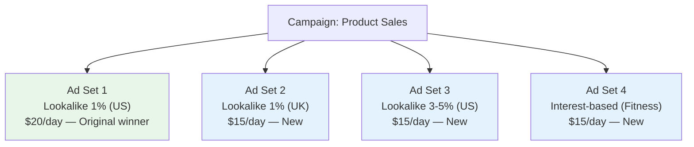

## Why Optimization Is Where the Real Money Is Made

Launching your first campaign is exciting, but optimization is where advertising becomes profitable. Think of it this way: your first campaign is like planting a seed. Optimization is watering it, giving it sunlight, pulling the weeds, and helping it grow into something that produces real results.

Most beginners launch a campaign, check it once or twice, and then either panic and shut it down or just let it run forever without making any changes. Both approaches waste money. The best advertisers check their data regularly, make informed adjustments, and continuously test new ideas.

This guide will teach you exactly how to do that — step by step, with real strategies you can apply today.

<Tip>
The golden rule of optimization: **Change one thing at a time.** If you change your audience, creative, and budget all at once, you will have no idea which change caused the improvement (or decline). Make one change, wait for enough data to evaluate the impact, then make the next change. Patience is the number one optimization skill.
</Tip>

---

## Step 1: Know Your Key Metrics

Before you can optimize anything, you need to understand what you are looking at. Here are the metrics that matter most, explained in plain language.

### The Metrics That Matter

| Metric | What It Means | Why It Matters |
|---|---|---|
| **Cost Per Result (CPR)** | How much you pay for each conversion (purchase, sign-up, install) | This is your single most important metric. It tells you whether your ads are profitable. |
| **Return on Ad Spend (ROAS)** | Revenue generated divided by ad spend. A ROAS of 3x means you made $3 for every $1 spent. | Tells you if your campaign is making money overall. |
| **Click-Through Rate (CTR)** | Percentage of people who clicked your ad after seeing it. Formula: Clicks / Impressions x 100 | Tells you how compelling your ad is. Higher CTR = more engaging ad. |
| **Cost Per Click (CPC)** | How much you pay for each click on your ad | Helps you understand the cost of driving traffic. |
| **CPM (Cost Per 1,000 Impressions)** | How much it costs to show your ad 1,000 times | Reflects audience competition and ad quality. Lower is better. |
| **Conversion Rate** | Percentage of people who clicked your ad and then converted | Tells you how well your landing page converts. |
| **Frequency** | Average number of times each person has seen your ad | High frequency = ad fatigue. Keep below 3-4 for prospecting. |
| **Reach** | Total number of unique people who saw your ad | Shows how many different people you are reaching. |

### How to View These Metrics:

1. Go to **[adsmanager.facebook.com](https://adsmanager.facebook.com)**
2. Click on the **Campaigns** tab
3. You will see a table with columns showing various metrics
4. To customize which columns you see:
   - Click the **Columns** dropdown (usually shows "Performance" by default)
   - Select **Customize Columns**
   - Search for and add the metrics listed above
   - Click **Apply**
5. You can also save your custom column layout by clicking **Save as Preset** and giving it a name like "My Key Metrics"

<Tip>
Create a custom column preset that includes: Cost Per Result, ROAS, CTR (Link Click-Through Rate), CPC, CPM, Frequency, Reach, Impressions, Results, and Amount Spent. Save this as your default view. Having all your key metrics visible at a glance makes optimization decisions much easier and faster.
</Tip>

---

## Step 2: The Optimization Decision Framework

When you look at your data, you need a clear framework for deciding what to do. Here is a simple decision tree you can follow:

### Is Your Campaign Profitable?

**If YES (Cost Per Result is acceptable or ROAS is above your target):**
- Do not make major changes
- Consider gradually scaling the budget (see the Scaling section below)
- Start testing new creative variations to prevent ad fatigue
- Explore new audiences while keeping the profitable one running

**If NO (Cost Per Result is too high or ROAS is below target):**
- Ask: Is the CTR good? (above 1% for most industries)
  - If CTR is low → Your ad creative or targeting is the problem
  - If CTR is good but conversion rate is low → Your landing page is the problem
  - If both are okay but CPM is very high → Your audience is too competitive or too narrow

### Is Your Campaign in the Learning Phase?

Check the **Delivery** column in Ads Manager. If it says "Learning," the algorithm is still optimizing.

**If still learning:**
- Do NOT make changes. Wait until the learning phase ends.
- The learning phase ends after approximately **50 conversions per ad set per week**
- If after 7 days you still have not exited learning, your budget may be too low for your chosen conversion event

**If the learning phase is complete:**
- You can now confidently evaluate performance and make changes
- Results should be more stable and predictable

---

## Step 3: Creative Testing (The Biggest Lever)

Ad creative — your images, videos, and copy — is the single biggest factor in your campaign's success. No amount of budget or audience optimization can fix a bad ad. Great creative, on the other hand, can make even basic targeting work.

### How to Test Ad Creative:

#### Method 1: Multiple Ads in One Ad Set

1. Go to your existing campaign
2. Navigate to the **Ad Set** level
3. Click into your ad set
4. Click **+ Create** to add a new ad within the same ad set
5. Create a variation of your original ad — change ONE element:
   - Different image or video
   - Different headline
   - Different primary text
   - Different call-to-action
6. Let both ads run simultaneously
7. Meta will automatically shift more budget toward the better-performing ad

**What to test (in order of impact):**

1. **Image/Video** — This has the most impact. Test completely different visuals.
2. **Headline** — The second most impactful element. Test different value propositions.
3. **Primary Text** — Try short vs. long copy, different hooks, different angles.
4. **Call to Action** — Sometimes "Learn More" outperforms "Shop Now" or vice versa.

#### Method 2: A/B Testing (Split Test)

Meta offers a formal A/B testing tool for more rigorous testing.

1. When creating a new campaign, toggle on **A/B Test**
2. Choose what variable to test:
   - **Creative** — Different ad versions
   - **Audience** — Different targeting
   - **Placement** — Different placements
3. Meta will split your audience evenly and show each version to a separate group
4. After enough data, Meta will declare a winner

<Tip>
When testing creative, try to have **3-5 ad variations** running in each ad set at all times. This gives Meta options to optimize delivery, and it protects you from ad fatigue. When one ad starts declining in performance, the others can pick up the slack while you create fresh replacements.
</Tip>

### Ad Fatigue: How to Spot It and Fix It

Ad fatigue happens when people see your ad too many times and stop responding to it. Signs of ad fatigue:

- **Frequency climbing above 3-4** (for prospecting campaigns)
- **CTR declining** week over week
- **Cost Per Result increasing** week over week
- **Negative feedback increasing** (ad reactions going down, people hiding the ad)

**How to fix ad fatigue:**

1. Create fresh ad variations with new images/videos
2. Try completely different ad angles (different messaging approach)
3. Expand your audience so the same people do not see your ads as often
4. Increase the number of ads in each ad set so Meta can rotate between them

---

## Step 4: Audience Optimization

If your creative is solid but results are still not great, your audience might be the issue.

### Signs Your Audience Needs Adjustment:

- **High CPM (above $15-20 for most industries)** — Your audience is too competitive or too narrow
- **Low CTR with good creative** — Your ad is being shown to people who do not care about your offer
- **High frequency with low results** — You have exhausted your audience
- **Good engagement but no conversions** — You are reaching interested people who are not ready to buy

### Audience Optimization Strategies:

#### 1. Broaden Your Audience

If your audience is too narrow:
- Remove some detailed targeting criteria
- Increase the age range
- Add more countries or regions
- Use a larger Lookalike (3-5% instead of 1%)
- Try Advantage+ Audience with minimal constraints

#### 2. Narrow Your Audience

If your audience is too broad and you are getting lots of irrelevant clicks:
- Add more specific interests
- Use the "Narrow further" feature for AND targeting
- Create more specific Custom Audiences
- Use a smaller Lookalike (1% instead of 5%)

#### 3. Refresh Your Lookalike Source

If your Lookalike Audiences are declining:
- Update the source Custom Audience with more recent data
- Try a different source (recent purchasers vs. all-time purchasers)
- Create a new Lookalike from a different seed (high-value customers instead of all customers)

#### 4. Layer Your Targeting

Combine audience types for better precision:
- Lookalike Audience + Interest targeting (Lookalike 1% AND interested in "fitness")
- This finds people who look like your customers AND have relevant interests

---

## Step 5: Budget Scaling

You found a winning campaign. It is profitable. Now you want to spend more money on it. But scaling is tricky — increasing the budget too fast can actually hurt performance. Here is how to do it correctly.

### Method 1: Gradual Scaling (Safest)

The safest way to scale is to increase your budget by **no more than 20% every 3-4 days**.

**Example:**
- Day 1: $20/day (starting budget)
- Day 4: $24/day (+20%)
- Day 7: $29/day (+20%)
- Day 10: $35/day (+20%)
- Day 14: $42/day (+20%)

This slow increase gives Meta's algorithm time to adjust without resetting the learning phase.

### Method 2: Horizontal Scaling

Instead of increasing the budget on one ad set, create NEW ad sets targeting different audiences.

**Example:**

Each new ad set gets its own budget, so you are spending more overall without disrupting the original winner.

### Method 3: Campaign Budget Optimization (CBO)

When you have multiple proven ad sets, consider switching to Advantage Campaign Budget:

1. Create a new campaign with **Advantage Campaign Budget** turned ON
2. Set a total daily budget for the entire campaign
3. Add your best-performing ad sets (or duplicates of them)
4. Meta will automatically distribute budget to the best-performing ad sets
5. Start with the total of what you were spending across all ad sets, then gradually increase

<Tip>
When scaling, the learning phase resets if you increase the budget by more than 20% at once. This means Meta goes back to figuring out who to show your ads to, and performance may dip temporarily. That is why gradual scaling (20% every 3-4 days) is the safest approach. It keeps you in the "stable" zone and avoids the performance rollercoaster.
</Tip>

---

## Step 6: Bid Strategy Optimization

Meta offers several bid strategies that control how it spends your budget in the ad auction.

### Available Bid Strategies:

#### Highest Volume (Default)

- Meta tries to get the most results possible within your budget
- No cost cap — Meta will pay whatever it takes to get conversions
- Best for: When you want maximum results and are flexible on cost per result

#### Cost Per Result Goal

- You set a target cost per conversion
- Meta tries to keep your average cost per result around your target
- May spend less of your budget if it cannot find results at your target cost
- Best for: When you have a specific cost target you need to hit

#### Highest Value

- Meta optimizes for the highest total purchase value (not the most conversions)
- Best for: E-commerce when different products have different values

#### ROAS Goal

- You set a minimum ROAS target (e.g., "I want at least 3x return")
- Meta tries to maintain that ROAS
- Best for: E-commerce when you know your target ROAS

### When to Change Your Bid Strategy:

- **Start with Highest Volume** for your first campaigns. It gives Meta the most flexibility to learn.
- **Switch to Cost Per Result Goal** once you have enough data to know your target cost
- **Use ROAS Goal** only after you have at least a few weeks of purchase data

---

## Step 7: Automated Rules

As your advertising grows, manually checking and adjusting campaigns becomes time-consuming. Meta's Automated Rules can handle routine optimizations for you.

### How to Create Automated Rules:

1. Go to **Ads Manager**
2. Select the campaign, ad set, or ad you want to apply a rule to
3. Click the **Rules** dropdown (or navigate to Rules from the main menu)
4. Click **Create a New Rule**

### Useful Automated Rules:

#### Rule 1: Pause Underperforming Ad Sets

- **Apply to:** All active ad sets
- **Condition:** Cost per result is greater than $X (your maximum acceptable cost)
- **Time range:** Last 7 days
- **Action:** Turn off the ad set
- **Additional condition:** AND results are greater than 0 (to avoid pausing ad sets with no data yet)

#### Rule 2: Increase Budget for Winners

- **Apply to:** All active ad sets
- **Condition:** Cost per result is less than $X (your target cost)
- **Time range:** Last 7 days
- **Action:** Increase daily budget by 20%
- **Maximum budget cap:** Set a maximum so it does not run away

#### Rule 3: Get Notified About High Spend with No Results

- **Apply to:** All active ad sets
- **Condition:** Amount spent is greater than $X AND results equals 0
- **Time range:** Today
- **Action:** Send notification only (so you can investigate manually)

#### Rule 4: Prevent Frequency from Getting Too High

- **Apply to:** All active ad sets
- **Condition:** Frequency is greater than 4
- **Time range:** Last 7 days
- **Action:** Send notification (to remind you to refresh creative)

<Tip>
Start with notification-only rules before using automatic action rules. This lets you see what the rule would do without actually making changes. Once you trust that the rule is triggering correctly, switch it to automatic actions. It is much safer to get an email alert saying "this ad set would be paused" than to wake up and find your best campaign was accidentally shut down.
</Tip>

---

## Step 8: Diagnosing and Fixing Common Problems

### Problem: High CPC (Cost Per Click)

**Possible causes:**
- Your ad is not compelling enough to generate clicks
- Your audience is too competitive (other advertisers are targeting the same people)
- Your ad has low relevance scores

**Fixes:**
1. Test new ad creative with more attention-grabbing visuals
2. Improve your headline — make it clearer, more urgent, or more benefit-focused
3. Try a different audience that is less competitive
4. Test different placements (Instagram Stories often has lower CPC than Facebook Feed)

### Problem: Good CTR But Low Conversions

**Possible causes:**
- Your landing page does not match the ad's promise
- Your landing page is slow to load (especially on mobile)
- The conversion process has too many steps or friction
- Your Pixel is not tracking conversions correctly

**Fixes:**
1. Compare your ad message to your landing page — do they tell the same story?
2. Test your landing page speed (use Google PageSpeed Insights)
3. Simplify your conversion process (fewer form fields, fewer steps)
4. Verify your Pixel is firing correctly on the conversion page

### Problem: High Frequency with Declining Results

**Possible causes:**
- Your audience has seen your ads too many times
- You have been running the same creative for too long
- Your audience is too small for your budget

**Fixes:**
1. Create fresh ad creative (new images, new copy, new angles)
2. Expand your audience to include more people
3. Reduce the budget for small audiences
4. Set up an automated rule to alert you when frequency exceeds 3-4

### Problem: Ads Stuck in "Learning Limited"

**What it means:** Meta does not think your ad set will get the 50 conversions per week needed to exit the learning phase.

**Fixes:**
1. Increase the budget so you can afford 50 conversions per week
2. Switch to a higher-funnel event (e.g., "Add to Cart" instead of "Purchase") that happens more frequently
3. Broaden your audience so Meta has more people to work with
4. Combine multiple ad sets into one to consolidate conversion data

---

## Step 9: Attribution Settings and Windows

Understanding attribution is important for reading your data correctly.

### What Is Attribution?

Attribution is how Meta determines which ad gets credit for a conversion. By default, Meta uses a **7-day click, 1-day view** attribution window:

- If someone clicks your ad and converts within **7 days**, the ad gets credit
- If someone views your ad (without clicking) and converts within **1 day**, the ad gets credit

### How to Change Your Attribution Setting:

1. At the ad set level, scroll down to the **Optimization & Delivery** section
2. Click **Show More Options**
3. Under **Attribution Setting**, click **Edit**
4. Choose your preferred window:
   - 1-day click
   - 7-day click (most common)
   - 1-day click, 1-day view
   - 7-day click, 1-day view (default and recommended)

### Why Attribution Settings Matter:

- **Shorter windows** report fewer conversions (only immediate results)
- **Longer windows** report more conversions (including delayed conversions)
- Neither is "wrong" — they just measure different things
- For most businesses, the **7-day click, 1-day view** default is the best choice

<Tip>
Do not change your attribution window mid-campaign. If you switch from 7-day click to 1-day click, your conversion numbers will suddenly drop, and it will look like your campaign got worse — when in reality, you just changed how you are measuring. Pick a window and stick with it so you can compare performance over time.
</Tip>

---

## Step 10: Weekly Optimization Routine

Here is a practical weekly routine you can follow to keep your campaigns optimized:

### Monday: Review Weekend Performance

1. Open Ads Manager and check last 7 days of data
2. Look at Cost Per Result, ROAS, CTR, and Frequency for each ad set
3. Note any ad sets that are significantly above or below your target cost
4. Check for any automated rule notifications you may have missed

### Wednesday: Mid-Week Check

1. Review the data again with a focus on the last 3 days
2. If any ad creative has high frequency (above 3-4), start planning new creative
3. If any ad set is overspending with poor results, consider pausing it
4. If any ad set is performing very well, consider a small budget increase (max 20%)

### Friday: Creative and Audience Planning

1. Review which ads are performing best and worst
2. Create 2-3 new ad variations inspired by your top performers
3. Check your Custom Audiences for any new opportunities
4. Plan any audience changes for the following week

### Monthly: Big Picture Review

1. Look at the full month's data
2. Calculate your overall ROAS and Cost Per Result
3. Update your Customer List Custom Audiences with fresh data
4. Refresh your Lookalike Audiences if needed
5. Evaluate your bid strategy and consider changes
6. Review your retargeting funnel and make sure exclusions are working

---

## Your Optimization Checklist

- [ ] Custom column preset created with key metrics
- [ ] Decision framework understood (profitable → scale; not profitable → diagnose)
- [ ] 3-5 ad creative variations running in each ad set
- [ ] Ad fatigue monitored (frequency, CTR trends)
- [ ] Audiences tested and refreshed regularly
- [ ] Budget scaling done gradually (max 20% every 3-4 days)
- [ ] Automated rules set up for pausing losers and alerting on issues
- [ ] Attribution settings reviewed and set correctly
- [ ] Weekly optimization routine established
- [ ] Landing page speed and conversion flow tested

---

## Summary

Meta campaign optimization is an ongoing process, not a one-time task. The advertisers who see the best results are the ones who consistently:

1. **Monitor key metrics** — Especially Cost Per Result, ROAS, CTR, and Frequency
2. **Test creative constantly** — Always have new ad variations in the pipeline
3. **Scale gradually** — No more than 20% budget increases every 3-4 days
4. **Refresh audiences** — Update Custom Audiences and Lookalikes regularly
5. **Fix problems early** — Use the diagnostic framework to identify and solve issues quickly
6. **Automate routine tasks** — Use automated rules for common optimizations
7. **Be patient** — Give Meta's algorithm time to learn (at least 50 conversions per week per ad set)

With the knowledge from this guide and the previous guides in this series, you have everything you need to run successful, profitable Meta ad campaigns. Start small, test often, and scale what works.

<Tip>
The best Meta advertisers treat advertising like a science experiment. They form hypotheses ("I think video ads will perform better than images for this audience"), test them with controlled experiments, analyze the results, and apply what they learn. Adopt this mindset, and your campaigns will continuously improve over time.
</Tip>
