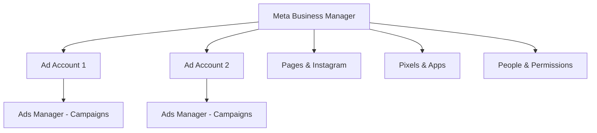
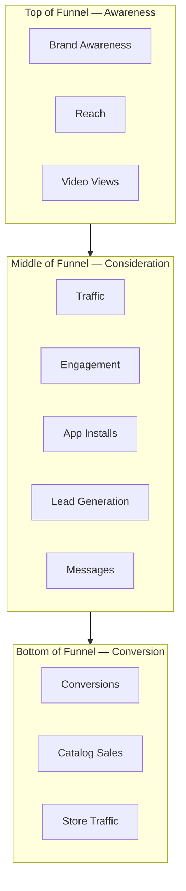
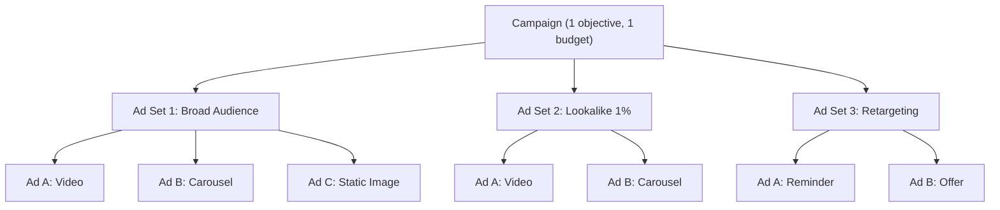

## Why Meta is the number one ad platform for app developers

If you could only pick one place to advertise your app, pick Meta. Here is why:

- **3.07 billion monthly active users** across Facebook, Instagram, Messenger, WhatsApp, and the Audience Network
- The most advanced machine-learning ad delivery system in the industry
- More ad formats than any competitor (images, video, carousels, stories, reels, playable ads, and more)
- Lookalike audiences that find millions of people who look like your best users
- Detailed conversion tracking that ties every dollar to a result

But the real reason developers stick with Meta is simple: **the algorithm is scary good at finding people who will actually use your app.** You tell it what you want (installs, purchases, sign-ups), feed it some creative, set a budget, and it handles the rest. The more data it collects, the smarter it gets.

---

## Meta's ad products: where your ads can appear

Meta is not just Facebook. It is an entire family of apps and services, each with its own audience behavior and ad experience. Understanding each product helps you create the right creative for the right placement.

### Facebook Feed

The classic. Facebook Feed is the main scrolling experience on both mobile and desktop. It is still the single largest ad placement by volume in Meta's network.

- **Audience:** Broadest demographic range — strong with ages 25-54
- **Ad formats:** Single image, video, carousel, collection
- **Best for:** Detailed ads with longer copy, product explanations, app feature highlights
- **Creative tip:** You can write longer primary text here than on any other placement. Use it to tell a story or explain your value proposition.

### Instagram Feed

Instagram Feed is the polished, visual-first scrolling experience. Users here expect beautiful imagery and clean design.

- **Audience:** Slightly younger skew (18-44), highly engaged, design-conscious
- **Ad formats:** Single image, video, carousel, collection
- **Best for:** Lifestyle-oriented creative, aspirational branding, visually stunning app screenshots
- **Creative tip:** Invest in high-quality visuals. Blurry or stock-looking images get scrolled past instantly on Instagram.

### Stories (Facebook & Instagram)

Stories are full-screen, vertical, ephemeral content that appears between organic stories from friends. They are immersive and feel native when done right.

- **Audience:** Heavily mobile, skews younger, high engagement
- **Ad formats:** Single image, video (up to 15 seconds per card), carousel
- **Best for:** Quick, punchy messages — app demos, before/after, countdown offers
- **Creative tip:** Design for vertical (9:16 aspect ratio). Add text overlays since many users watch without sound. Front-load your message in the first 2 seconds.

### Reels (Facebook & Instagram)

Reels is Meta's answer to TikTok — short-form, entertaining video content. Reels ads appear between organic reels and feel native to the experience.

- **Audience:** Youngest skew in Meta's network, entertainment-seekers, trend-followers
- **Ad formats:** Vertical video (up to 90 seconds, but 15-30 seconds performs best)
- **Best for:** Fun, trend-driven creative that does not feel like an ad. App tutorials set to music, user testimonials, humor.
- **Creative tip:** Make it look organic. Overly polished or corporate-looking reels get skipped. Film on a phone, use trending audio, and get to the point fast.

### Messenger

Messenger ads appear in the inbox between conversations and can also drive users into Messenger conversations with your business.

- **Audience:** Broad, high-intent (people checking messages are in an active mindset)
- **Ad formats:** Image or video in inbox, sponsored messages to existing contacts
- **Best for:** Re-engagement campaigns, customer support funnels, high-touch products

### Audience Network

The Audience Network extends your ads to thousands of third-party apps and websites that have partnered with Meta. Think of it as Meta's display network.

- **Audience:** Highly variable — depends on the partner apps
- **Ad formats:** Banner, interstitial, rewarded video, native
- **Best for:** Extending reach at lower CPMs, rewarded video for gaming apps
- **Creative tip:** Quality of traffic can vary. Monitor closely and exclude if you see low-quality installs.

### WhatsApp

WhatsApp ads do not appear inside WhatsApp itself. Instead, you create ads on Facebook or Instagram that open a WhatsApp conversation when clicked.

- **Audience:** Enormous in Latin America, South Asia, Europe, and Africa
- **Ad formats:** Click-to-WhatsApp ads (appear on Facebook/Instagram, land in WhatsApp)
- **Best for:** Businesses with conversational sales processes, local services, markets where WhatsApp is dominant

<Tip>
  You do not need to create separate ads for each placement. When you use **Advantage+ placements** (recommended), Meta automatically adapts and distributes your ads across all these surfaces based on where each user is most likely to convert. Just make sure you upload both square (1:1) and vertical (9:16) creative so Meta has the right assets for each placement.
</Tip>

---

## Understanding Meta's advertising ecosystem

Meta has several tools and platforms, and beginners often confuse them. Here is what each one does and when you would use it.

### The three main tools

<CardGroup cols={3}>
  <Card title="Meta Business Suite" icon="grid-2">
    A unified dashboard for managing your Facebook Page, Instagram account, messaging, and basic ad creation. Think of it as the **simple, all-in-one tool** for small businesses. It includes basic ad creation features, but it is not powerful enough for serious advertising.
  </Card>
  <Card title="Meta Business Manager" icon="building">
    The **control center** for your entire advertising operation. This is where you manage ad accounts, team permissions, pixels, apps, and billing. Every serious advertiser uses Business Manager. You access it at [business.facebook.com](https://business.facebook.com).
  </Card>
  <Card title="Meta Ads Manager" icon="chart-line">
    The **campaign creation and management tool** where you actually build, launch, monitor, and optimize your ad campaigns. This is where you will spend most of your time. You access it at [adsmanager.facebook.com](https://adsmanager.facebook.com).
  </Card>
</CardGroup>

<Tip>
  Here is the simplest way to remember the difference: **Business Manager** is your company's control center (accounts, people, assets). **Ads Manager** is your campaign workspace (create ads, see results). **Business Suite** is the simplified version that combines some features of both, but is less powerful.
</Tip>

### How they relate to each other



You create a **Business Manager** first. Inside that, you create one or more **Ad Accounts**. Each ad account opens in **Ads Manager**, where you build and manage campaigns. You will set up Business Manager once and then spend your day-to-day time in Ads Manager.

---

## How Meta's ad delivery system works

Understanding how Meta decides which ads to show is essential. It is not just about who pays the most.

### The ad auction

Every time someone opens Facebook or Instagram, Meta runs a lightning-fast auction to decide which ad to show. But this is not a simple highest-bidder-wins auction. Meta considers three factors:

| Factor | What it means | Why it matters |
|--------|--------------|----------------|
| **Bid** | How much you are willing to pay for a result (install, click, etc.) | Higher bids get more delivery, but it is not the only factor |
| **Estimated action rate** | How likely Meta thinks *this specific user* will take your desired action | A highly relevant ad can win even with a lower bid |
| **Ad quality** | How good your ad is based on feedback (engagement, reports, landing page quality) | Poor quality ads get penalized, even with high bids |

Meta multiplies these three together to calculate a **Total Value score**:

```
Total Value = Bid x Estimated Action Rate x Ad Quality
```

The ad with the highest Total Value wins the auction. This is why a well-targeted, high-quality ad can outperform a competitor who spends more money but has a worse ad.

### What this means for you

- You do not need the biggest budget to succeed. A great ad shown to the right audience can beat a mediocre ad with twice the budget.
- **Creative quality is the biggest lever you control.** Better creative means higher estimated action rates and higher ad quality scores, which means lower costs.
- Meta's system rewards advertisers who make ads people actually want to see.

### The learning phase

When you launch a new campaign (or make significant changes to an existing one), Meta enters a **learning phase**. During this phase:

- The algorithm is experimenting to figure out the best people, placements, and times to show your ad
- Results will be inconsistent and costs will be higher than normal
- The phase typically lasts until you get about **50 conversions per ad set per week**

<Warning>
  Making significant edits during the learning phase (changing budget by more than 20%, swapping creative, changing audience) **resets the learning phase**. This means the algorithm starts over. Be patient and let it learn.
</Warning>

---

## Campaign objectives mapped to the marketing funnel

When you create a campaign in Ads Manager, the first thing you choose is your **objective** — the goal you want Meta to optimize for. Each objective maps to a stage of the marketing funnel. Here is how they all connect:



### Awareness objectives

These objectives are for getting your brand or app in front of as many relevant people as possible. You pay for impressions (people seeing your ad), not actions.

| Objective | What it does | When to use it | Typical metric |
|-----------|-------------|----------------|----------------|
| **Brand Awareness** | Shows your ad to people most likely to remember it | Building recognition for a new app or brand before asking for installs | Cost per 1,000 impressions (CPM): $5-15 |
| **Reach** | Shows your ad to the maximum number of unique people in your audience | Announcements, launches, or retargeting where you want everyone in the audience to see your message | CPM: $3-10 |
| **Video Views** | Shows your video ad to people most likely to watch it | Building awareness with video content, warming up audiences for later retargeting | Cost per ThruPlay (15s view): $0.01-0.05 |

### Consideration objectives

These drive people to take a middle-funnel action like clicking, engaging, or visiting your app store listing.

| Objective | What it does | When to use it | Typical metric |
|-----------|-------------|----------------|----------------|
| **Traffic** | Sends people to a URL (website, app store, deep link) | Driving visitors to a landing page or app store listing | Cost per click (CPC): $0.30-1.50 |
| **Engagement** | Gets likes, comments, shares, and other interactions on your ad | Building social proof, growing page following, increasing post visibility | Cost per engagement: $0.05-0.30 |
| **App Installs (App Promotion)** | Optimizes for people who are most likely to install your app | **Your primary objective for app growth** | Cost per install (CPI): $1-10 |
| **Lead Generation** | Collects contact information via an in-app form (no landing page needed) | Gathering emails or phone numbers for waitlists or beta signups | Cost per lead: $1-10 |
| **Messages** | Starts conversations in Messenger, WhatsApp, or Instagram DM | Customer support, high-touch sales, community building | Cost per conversation: $1-5 |

### Conversion objectives

These optimize for the most valuable actions — purchases, sign-ups, or other in-app events.

| Objective | What it does | When to use it | Typical metric |
|-----------|-------------|----------------|----------------|
| **Conversions** | Optimizes for a specific conversion event on your website or app | Driving purchases, subscriptions, or sign-ups from users who already have your app | Cost per action varies widely |
| **Catalog Sales** | Dynamically shows products from your catalog to people most likely to buy | E-commerce apps with a product catalog | ROAS target: 2-5x |
| **Store Traffic** | Drives people to physical store locations | Brick-and-mortar businesses with app tie-ins | Cost per store visit: varies |

<Note>
  **For most app developers, start with the App Promotion (App Installs) objective.** It tells Meta's algorithm exactly what you want — new users who will install your app. Once you have enough installs and in-app event data, you can switch to optimizing for deeper events like purchases or subscriptions.
</Note>

### Meta's simplified objective categories (new Ads Manager)

Meta has been rolling out a simplified set of 6 objective categories. If you see this newer interface, here is how the old objectives map:

| New category | Includes | Best for app developers |
|-------------|----------|------------------------|
| **Awareness** | Brand awareness, Reach, Video views | Top-of-funnel campaigns |
| **Traffic** | Link clicks, landing page views | Driving to app store or website |
| **Engagement** | Post engagement, page likes, event responses | Building social proof |
| **Leads** | Lead forms, Messenger, conversions | Collecting signups |
| **App Promotion** | App installs, app events | **Your main objective** |
| **Sales** | Conversions, catalog sales, messages | Revenue-focused campaigns |

---

## Meta's machine learning: how Advantage+ works

**Advantage+** is Meta's suite of AI-powered automation features. Think of it as handing the steering wheel to Meta's algorithm while you focus on creative and strategy. Meta has invested billions of dollars into its ML infrastructure, and Advantage+ is how you tap into it.

### How Meta's ML optimization actually works

Behind the scenes, Meta's algorithm does several things simultaneously:

1. **User modeling** — For every one of its 3+ billion users, Meta maintains a detailed prediction model. It knows what apps they have installed, what ads they have engaged with, their purchase behavior, and thousands of other signals.
2. **Real-time prediction** — When deciding whether to show your ad to a specific user, Meta predicts in real-time the probability that user will take your desired action (install, purchase, etc.).
3. **Exploration vs. exploitation** — The algorithm balances showing your ad to users it already knows will convert (exploitation) with testing new user segments it has not tried yet (exploration). This is the learning phase.
4. **Multi-armed bandit for creative** — When you upload multiple creative assets, Meta runs a multi-armed bandit algorithm to quickly identify winners and shift budget toward them, while still testing underexplored options.

### Advantage+ App Campaigns

This is a simplified, fully automated campaign type specifically for app promotion. You provide:
- Your app
- Your creative assets (images, videos, text variations)
- Your budget
- Your target countries

Meta handles everything else automatically — audience targeting, placements, bid strategy, and creative combinations. It uses machine learning to test thousands of combinations and find what works best.

**When to use Advantage+ App Campaigns:**
- You are spending more than $100/day on app installs
- You have strong creative assets (5+ images/videos, multiple text variations)
- You have enough conversion data for Meta to optimize (50+ installs per week minimum)
- You want to simplify campaign management

**When NOT to use Advantage+ App Campaigns:**
- You are just starting and need to understand which audiences and creatives work
- Your budget is small (under $20/day) — the algorithm needs data volume to work
- You need granular control over who sees your ads

### Advantage+ placements

This is the simpler version: instead of automating the entire campaign, it just automates **where** your ads appear. Instead of manually choosing Facebook Feed, Instagram Stories, Reels, etc., you let Meta place your ads wherever they will perform best.

<Tip>
  **We recommend using Advantage+ placements for all campaigns, even manual ones.** Meta has data on where every user is most receptive to ads, and it uses that data to put your ads in the right spots. Manual placement selection almost always leads to worse results.
</Tip>

### Other Advantage+ features

| Feature | What it automates | When to use it |
|---------|------------------|----------------|
| **Advantage+ Audience** | Meta expands beyond your defined audience if it finds better results elsewhere | When you want Meta to find pockets of users you would not have targeted manually |
| **Advantage+ Creative** | Automatically adjusts your creative (cropping, brightness, text overlays) per placement | Always — it helps your ads look native on every surface |
| **Advantage+ Budget** | Distributes your campaign budget across ad sets based on performance (formerly CBO) | When running 2+ ad sets and you want Meta to allocate spend to the best performer |

---

## Account structure best practices

How you organize your campaigns, ad sets, and ads has a direct impact on performance. The most common beginner mistake is creating too many campaigns and fragmenting your budget.

### The recommended structure



### Key principles

<AccordionGroup>
  <Accordion title="Fewer campaigns, more ad sets">
    Resist the urge to create a new campaign for every test. Instead, use ad sets within a single campaign. This lets Meta's Campaign Budget Optimization (CBO) distribute spend intelligently across your ad sets, and it prevents audience fragmentation.
  </Accordion>
  <Accordion title="2-5 ad sets per campaign is ideal">
    Fewer than 2 means you are not testing anything. More than 5 means your budget is too thin per ad set for the algorithm to learn. If your daily budget is $50, running 10 ad sets means each only gets $5/day — not nearly enough for Meta to optimize.
  </Accordion>
  <Accordion title="3-6 ads per ad set">
    Give Meta enough creative variety to test, but not so many that each ad gets barely any impressions. If you have 20 creative assets, do not put them all in one ad set. Split them across multiple ad sets or test in batches.
  </Accordion>
  <Accordion title="Separate prospecting and retargeting">
    Prospecting (finding new users) and retargeting (re-engaging existing users) should be separate campaigns with separate budgets. They have fundamentally different audiences, costs, and goals. Mixing them makes it impossible to evaluate performance clearly.
  </Accordion>
  <Accordion title="Name things clearly">
    Use a consistent naming convention from day one. You will thank yourself later. A good pattern: `[Objective] - [Audience] - [Date]` for campaigns and `[Audience Detail] - [Geo]` for ad sets. Example: `App Installs - Lookalike 1% - US - 2025-01`.
  </Accordion>
</AccordionGroup>

---

## Budget recommendations by business size

How much should you spend on Meta Ads? It depends on your stage and goals. Here are practical recommendations:

<Tabs>
  <Tab title="Solo / Bootstrapped ($10-30/day)">
    **Total monthly budget:** $300-900

    At this level, you are in learning mode. Your goal is to find what works, not to scale.

    - Run **1 campaign** with **1-2 ad sets**
    - Test **3-4 creative variations** per ad set
    - Focus on a **single country** (your primary market)
    - Use the **App Promotion** objective
    - Expect the learning phase to take 2-3 weeks (since fewer daily conversions)
    - Do not split-test audiences yet — let Meta's broad targeting do the work

    **Realistic expectations:** 50-200 installs per month, enough data to identify your best creative angles but not enough to draw definitive conclusions about audiences.
  </Tab>
  <Tab title="Small Team ($50-200/day)">
    **Total monthly budget:** $1,500-6,000

    You have enough budget to run proper tests and start seeing consistent results.

    - Run **2-3 campaigns** (prospecting + retargeting + possibly a video views campaign for awareness)
    - Test **2-4 ad sets** per campaign with different audiences
    - Upload **5-8 creative variations** and rotate fresh creative every 2 weeks
    - Expand to **2-3 countries**
    - Start building **Lookalike Audiences** once you have 1,000+ installs
    - Consider using **Advantage+ App Campaigns** if your daily spend exceeds $100

    **Realistic expectations:** 300-2,000 installs per month, clear data on winning audiences and creatives, ability to start optimizing for deeper funnel events.
  </Tab>
  <Tab title="Growth Stage ($500-5,000/day)">
    **Total monthly budget:** $15,000-150,000

    At this level, Meta becomes a serious growth engine. You can afford to test aggressively and scale winners.

    - Run **separate campaigns by objective** (installs, in-app events, retargeting, awareness)
    - Use **Advantage+ App Campaigns** for your main prospecting spend
    - Test **10-20 new creatives per month** — creative velocity is your competitive advantage
    - Target **5+ countries** with separate campaigns per geo cluster
    - Implement **automated rules** for budget management
    - Optimize for **post-install events** (purchases, subscriptions) not just installs
    - Run **A/B tests** on audiences, bid strategies, and optimization events

    **Realistic expectations:** 5,000-50,000+ installs per month, deep understanding of unit economics, predictable and scalable growth.
  </Tab>
</Tabs>

---

## Meta vs. other platforms: when to choose what

Meta is the best starting point for most app developers, but it is not always the right choice. Here is how it compares to other major platforms:

| Factor | Meta | Google (UAC) | TikTok | Apple Search Ads |
|--------|------|-------------|--------|-----------------|
| **Audience size** | 3.07B MAU | Entire internet | 1.5B MAU | iOS App Store visitors |
| **Targeting precision** | Excellent — interest, behavior, lookalike | Strong — intent-based (search) + ML | Good — interest + behavior | Excellent — keyword intent |
| **Creative formats** | Most variety (image, video, carousel, stories, reels, playable) | Limited (text, image, video) | Video-only | Text + screenshots |
| **Algorithm quality** | Best in class for finding converters | Very strong, especially for search intent | Improving rapidly, strong for awareness | Very strong for high-intent users |
| **Minimum budget** | $5/day (but $20+ recommended) | $10/day (but $50+ recommended) | $20/day minimum per ad group | $5/day |
| **Best for** | Broad app promotion, lifestyle apps, e-commerce, social apps | High-intent users, utility apps, search-driven categories | Young audience, entertainment, viral apps | iOS-only campaigns, high-intent users |
| **Learning curve** | Moderate | Low (very automated) | Moderate | Low |

### When Meta is the best choice

<CardGroup cols={2}>
  <Card title="You need broad reach" icon="users">
    No other platform matches Meta's 3+ billion users. If your app targets a wide demographic, Meta will find your users.
  </Card>
  <Card title="You have great visual creative" icon="image">
    Meta's ad formats reward beautiful, engaging creative. If your app looks good in screenshots and videos, Meta will amplify that.
  </Card>
  <Card title="You want advanced targeting" icon="crosshairs">
    Lookalike audiences, custom audiences from CRM data, behavior-based targeting — Meta's targeting tools are the most sophisticated available.
  </Card>
  <Card title="You are building a brand" icon="star">
    Meta's awareness and engagement objectives let you build brand recognition alongside direct response. Other platforms are more transactional.
  </Card>
</CardGroup>

### When to consider alternatives

<CardGroup cols={2}>
  <Card title="High-intent search users" icon="magnifying-glass">
    If people actively search for your app category ("best budget app" or "meditation app"), Google Search and Apple Search Ads capture that intent better than Meta.
  </Card>
  <Card title="Gen Z audience" icon="mobile">
    If your primary audience is 16-24, TikTok may outperform Meta on both reach and engagement within that demographic.
  </Card>
  <Card title="Very small budgets" icon="wallet">
    Apple Search Ads can deliver results with as little as $5/day because you are reaching users who are already browsing the App Store. Meta needs more budget to let the algorithm learn.
  </Card>
  <Card title="Privacy-restricted categories" icon="lock">
    Health, finance, and other sensitive categories face more targeting restrictions on Meta due to privacy policies. Google and Apple may offer more flexibility in these verticals.
  </Card>
</CardGroup>

<Note>
  The best advertisers do not choose one platform — they use multiple platforms together. Meta for broad prospecting and retargeting, Google for high-intent search, Apple Search Ads for branded defense, and TikTok for awareness among younger users. Start with Meta, prove your economics, then expand.
</Note>

---

## Cost benchmarks by industry

These are approximate ranges based on industry data. Your actual costs depend on your creative quality, targeting, competition, and seasonality. All figures are in USD.

### App install campaigns (CPI)

| App category | Average CPI | Low end | High end |
|-------------|-------------|---------|----------|
| **Casual Games** | $1.50 | $0.50 | $3.00 |
| **Midcore/Hardcore Games** | $3.50 | $2.00 | $7.00 |
| **E-commerce / Shopping** | $3.00 | $1.50 | $6.00 |
| **Food Delivery** | $4.00 | $2.00 | $8.00 |
| **Fitness & Health** | $3.50 | $2.00 | $7.00 |
| **Finance & Fintech** | $5.00 | $3.00 | $12.00 |
| **Social & Dating** | $2.50 | $1.00 | $5.00 |
| **Education** | $2.50 | $1.50 | $5.00 |
| **Travel** | $3.00 | $1.50 | $6.00 |
| **Utilities / Productivity** | $2.00 | $1.00 | $4.00 |
| **Music & Entertainment** | $2.00 | $1.00 | $4.00 |

### Other key metrics by industry

| Metric | Average across industries | Range |
|--------|--------------------------|-------|
| **CPM** (cost per 1,000 impressions) | $8.50 | $3 - $20 |
| **CPC** (cost per click) | $0.75 | $0.20 - $2.00 |
| **CTR** (click-through rate) | 1.5% | 0.5% - 3.0% |
| **CVR** (click-to-install rate) | 25% | 10% - 50% |

### Factors that affect your costs

<AccordionGroup>
  <Accordion title="Seasonality">
    Costs increase significantly during Q4 (October-December) because of Black Friday, holiday shopping, and year-end budget pushes from large advertisers. January and summer months tend to be cheaper. Plan your budget accordingly.
  </Accordion>
  <Accordion title="Competition">
    The more advertisers targeting the same audience, the higher the auction prices. Finance and insurance are expensive because many well-funded companies compete for the same users. Gaming is cheaper because the audience is enormous.
  </Accordion>
  <Accordion title="Geographic targeting">
    US, UK, Canada, and Australia are the most expensive markets. Southeast Asia, Latin America, and Africa are significantly cheaper. A US install might cost $3 while the same app in India costs $0.30.
  </Accordion>
  <Accordion title="Creative quality">
    High-quality, engaging creative lowers your cost by improving your ad quality score and estimated action rate in the auction. This is the single biggest lever you have for reducing costs.
  </Accordion>
  <Accordion title="Audience size">
    Very narrow audiences (under 500K people) tend to have higher costs because there is more competition for each impression. Broader audiences give Meta more room to find cheap conversions.
  </Accordion>
</AccordionGroup>

<Tip>
  Do not obsess over CPI alone. A $5 install that generates $20 in lifetime revenue is vastly more valuable than a $1 install that never opens the app again. **Focus on the quality of users and your return on ad spend (ROAS), not just the cost of acquisition.**
</Tip>

---

## What to expect as a beginner

Let's set realistic expectations for your first few months:

| Timeline | What happens | What to focus on |
|----------|-------------|------------------|
| **Week 1** | Account setup, pixel/SDK installed, first campaign launched | Getting everything set up correctly |
| **Week 2-3** | Algorithm is in "learning phase" — results are inconsistent, costs are high | Do not panic. Do not make changes. Let it learn. |
| **Week 4** | Data starts stabilizing, you can see early patterns | Identify which creative and audiences are working |
| **Month 2** | You understand what works and can start optimizing | Test new creative, adjust budgets, build lookalikes |
| **Month 3+** | You have a repeatable system and can scale | Increase budgets, expand to new audiences and markets |

<Note>
  Meta's algorithm needs about **50 conversions per week per ad set** to fully exit the learning phase. If your budget is small and you are getting fewer conversions than that, the algorithm will still work — it just takes longer to stabilize. This is completely normal. Start with what you can afford and scale up as you see results.
</Note>

---

## What you will learn in this section

This Meta Ads section is a complete course that takes you from zero to running profitable campaigns:

<Steps>
  <Step title="Account Setup">
    Create your Meta Business Manager, ad account, payment methods, and team access — the right way, avoiding common mistakes that get accounts banned.
  </Step>
  <Step title="Pixel & SDK Setup">
    Install the Meta Pixel (for websites) and Meta SDK (for apps) so you can track installs, purchases, and other events. Includes code examples for iOS, Android, and React Native, plus the Conversions API for server-side tracking.
  </Step>
  <Step title="Your First Campaign">
    A screen-by-screen walkthrough of creating and launching your first app install campaign. Every setting explained, every option covered.
  </Step>
  <Step title="Building Audiences">
    Deep dive into every audience type — core audiences, custom audiences, lookalike audiences, and Advantage+ audience. Learn retargeting strategies and audience sizing.
  </Step>
  <Step title="Optimization">
    How to read your data, decide what to change, test creative systematically, scale your budget safely, and troubleshoot common problems.
  </Step>
</Steps>

<Card
  title="Account Setup"
  icon="arrow-right"
  href="/platforms/meta/account-setup"
>
  Let's start by getting your Meta Business Manager and ad account set up properly.
</Card>
