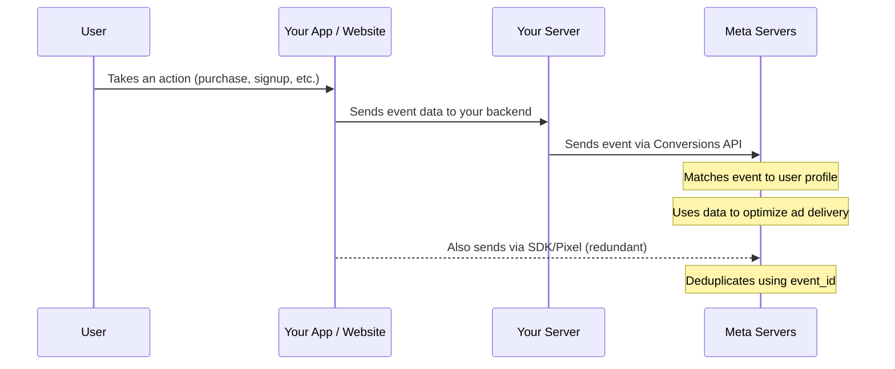

## Why tracking is non-negotiable

Without tracking, running ads is like throwing money into a black hole. You will not know:
- Which ads are driving installs
- Which users are valuable (purchases, subscriptions)
- How to improve your campaigns over time
- Whether your ads are profitable

Meta uses tracking data to power its machine-learning algorithm. The more data you send, the smarter the algorithm gets, and the better your results become. **Tracking is the foundation of everything.**

Meta offers three tracking tools:

| Tool | What it tracks | Where it lives |
|------|---------------|----------------|
| **Meta Pixel** | User actions on your website or landing page | JavaScript code on your website |
| **Meta SDK** | User actions inside your mobile app | Native code in your iOS/Android app |
| **Conversions API (CAPI)** | Server-side events sent from your server | Your backend server |

---

## Which tracking tools do you need?

| Your situation | What to install |
|---------------|----------------|
| Mobile app with direct-to-store ads | Meta SDK |
| Mobile app with a landing page/website | Meta SDK + Meta Pixel |
| Web app only (no mobile app) | Meta Pixel + Conversions API |
| Mobile app and you want the best tracking | Meta SDK + Conversions API (recommended) |

<Tip>
  **For the best results, use both the Meta SDK and the Conversions API together.** The SDK tracks events from the client side (the user's device), while the Conversions API sends events from your server. Using both creates redundancy — if the SDK misses an event (due to ad blockers, network issues, or iOS privacy restrictions), the server-side event still gets through. Meta deduplicates these events automatically.
</Tip>

---

## Part 1: Installing the Meta Pixel (for websites)

The Meta Pixel is a small piece of JavaScript code that you add to your website. It tracks when people visit your site, which pages they view, and what actions they take (like clicking "Download" or filling out a form).

### Creating your Pixel

<Steps>
  <Step title="Go to Events Manager">
    Navigate to [facebook.com/events_manager](https://www.facebook.com/events_manager2) or find it in the Ads Manager menu under **Events Manager**.
  </Step>
  <Step title="Click 'Connect Data Sources'">
    Click the green **Connect Data Sources** button. Select **Web** and click **Connect**.
  </Step>
  <Step title="Name your Pixel">
    Give it a descriptive name (e.g., "TaskFlow Website Pixel"). You can only have one Pixel per ad account, so keep the name general.
  </Step>
  <Step title="Choose installation method">
    You will see several options:
    - **Meta Pixel and Conversions API** (recommended) — installs both client-side and server-side tracking
    - **Meta Pixel only** — just the client-side JavaScript snippet
    - **Conversions API only** — just server-side tracking

    For now, choose **Meta Pixel only** if you want to keep it simple. You can add the Conversions API later.
  </Step>
  <Step title="Get your Pixel base code">
    Meta will generate your unique Pixel code. It looks like this:

    ```html
    <!-- Meta Pixel Code -->
    <script>
      !function(f,b,e,v,n,t,s)
      {if(f.fbq)return;n=f.fbq=function(){n.callMethod?
      n.callMethod.apply(n,arguments):n.queue.push(arguments)};
      if(!f._fbq)f._fbq=n;n.push=n;n.loaded=!0;n.version='2.0';
      n.queue=[];t=b.createElement(e);t.async=!0;
      t.src=v;s=b.getElementsByTagName(e)[0];
      s.parentNode.insertBefore(t,s)}(window, document,'script',
      'https://connect.facebook.net/en_US/fbevents.js');
      fbq('init', 'YOUR_PIXEL_ID');
      fbq('track', 'PageView');
    </script>
    <noscript>
      
    </noscript>
    <!-- End Meta Pixel Code -->
    ```

    Replace `YOUR_PIXEL_ID` with your actual Pixel ID (a 15-16 digit number).
  </Step>
  <Step title="Add the code to your website">
    Paste this code into the `<head>` section of every page on your website. It must load on every page so Meta can track the full user journey.

    **If you use a website builder:**
    - **Next.js / React:** Add it to your `_document.tsx` or use the `next/script` component
    - **WordPress:** Use the "Insert Headers and Scripts" plugin or add to your theme's `header.php`
    - **Shopify:** Go to Online Store > Themes > Edit Code > theme.liquid
    - **Webflow:** Go to Project Settings > Custom Code > Head Code
    - **Squarespace:** Go to Settings > Advanced > Code Injection > Header
  </Step>
</Steps>

### Adding the Pixel to a Next.js / React website

If your landing page uses Next.js, here is the recommended approach:

```tsx
// app/layout.tsx (Next.js App Router)
import Script from 'next/script'

const FB_PIXEL_ID = 'YOUR_PIXEL_ID'

export default function RootLayout({
  children,
}: {
  children: React.ReactNode
}) {
  return (
    <html lang="en">
      <head>
        <Script id="fb-pixel" strategy="afterInteractive">
          {`
            !function(f,b,e,v,n,t,s)
            {if(f.fbq)return;n=f.fbq=function(){n.callMethod?
            n.callMethod.apply(n,arguments):n.queue.push(arguments)};
            if(!f._fbq)f._fbq=n;n.push=n;n.loaded=!0;n.version='2.0';
            n.queue=[];t=b.createElement(e);t.async=!0;
            t.src=v;s=b.getElementsByTagName(e)[0];
            s.parentNode.insertBefore(t,s)}(window, document,'script',
            'https://connect.facebook.net/en_US/fbevents.js');
            fbq('init', '${FB_PIXEL_ID}');
            fbq('track', 'PageView');
          `}
        </Script>
        <noscript>
          
        </noscript>
      </head>
      <body>{children}</body>
    </html>
  )
}
```

To track specific events (like button clicks), create a utility function:

```tsx
// lib/fpixel.ts

export const FB_PIXEL_ID = 'YOUR_PIXEL_ID'

// Track a standard event
export function trackEvent(eventName: string, params?: Record<string, any>) {
  if (typeof window !== 'undefined' && window.fbq) {
    window.fbq('track', eventName, params)
  }
}

// Track a custom event
export function trackCustomEvent(eventName: string, params?: Record<string, any>) {
  if (typeof window !== 'undefined' && window.fbq) {
    window.fbq('trackCustom', eventName, params)
  }
}

// Usage example:
// trackEvent('Lead', { content_name: 'Signup Form' })
// trackCustomEvent('ClickedDownload', { app_version: '2.0' })
```

### Tracking events on your website with the Pixel

After installing the base Pixel code (which automatically tracks `PageView`), you can track specific user actions:

```javascript
// Track when someone clicks a "Download" button
document.getElementById('download-btn').addEventListener('click', () => {
  fbq('track', 'Lead', {
    content_name: 'App Download Click',
    content_category: 'download'
  });
});

// Track when someone submits an email signup form
document.getElementById('signup-form').addEventListener('submit', () => {
  fbq('track', 'CompleteRegistration', {
    content_name: 'Email Signup',
    status: true
  });
});

// Track when someone views a pricing page
// (add this to your pricing page)
fbq('track', 'ViewContent', {
  content_name: 'Pricing Page',
  content_type: 'page'
});
```

---

## Part 2: Installing the Meta SDK (for mobile apps)

The Meta SDK is what you install inside your iOS or Android app. It tracks app installs, opens, and in-app events automatically.

### For iOS (Swift)

<Steps>
  <Step title="Add the SDK via Swift Package Manager">
    In Xcode:
    1. Go to **File** > **Add Package Dependencies**
    2. In the search field, paste: `https://github.com/facebook/facebook-ios-sdk`
    3. Click **Add Package**
    4. Select these libraries at minimum:
       - `FacebookCore` (required — provides base tracking and analytics)
       - `FacebookLogin` (optional — only if you use Facebook Login)
       - `FacebookShare` (optional — only if you use sharing features)
    5. Click **Add Package** to confirm

    **Alternative: CocoaPods**
    ```ruby
    # Podfile
    pod 'FBSDKCoreKit', '~> 17.0'
    ```
    Then run `pod install`.
  </Step>
  <Step title="Configure your Info.plist">
    Add these keys to your `Info.plist` file. You can find your App ID and Client Token in the Meta Developer portal at [developers.facebook.com](https://developers.facebook.com) under your app's settings.

    ```xml
    <key>FacebookAppID</key>
    <string>YOUR_APP_ID</string>

    <key>FacebookClientToken</key>
    <string>YOUR_CLIENT_TOKEN</string>

    <key>FacebookDisplayName</key>
    <string>Your App Name</string>

    <!-- Required for iOS 9+ -->
    <key>LSApplicationQueriesSchemes</key>
    <array>
      <string>fbapi</string>
      <string>fb-messenger-share-api</string>
    </array>

    <!-- URL scheme for deep linking -->
    <key>CFBundleURLTypes</key>
    <array>
      <dict>
        <key>CFBundleURLSchemes</key>
        <array>
          <string>fbYOUR_APP_ID</string>
        </array>
      </dict>
    </array>
    ```

    Replace `YOUR_APP_ID` with your numeric Facebook App ID and `YOUR_CLIENT_TOKEN` with your client token.
  </Step>
  <Step title="Initialize the SDK in AppDelegate">
    ```swift
    import UIKit
    import FacebookCore

    @main
    class AppDelegate: UIResponder, UIApplicationDelegate {

        func application(
            _ application: UIApplication,
            didFinishLaunchingWithOptions launchOptions: [UIApplication.LaunchOptionsKey: Any]?
        ) -> Bool {
            // Initialize the Facebook SDK
            ApplicationDelegate.shared.application(
                application,
                didFinishLaunchingWithOptions: launchOptions
            )

            // Enable automatic event logging (tracks app installs and opens)
            Settings.shared.isAutoLogAppEventsEnabled = true

            // Enable advertiser ID collection (required for attribution)
            Settings.shared.isAdvertiserIDCollectionEnabled = true

            return true
        }

        func application(
            _ app: UIApplication,
            open url: URL,
            options: [UIApplication.OpenURLOptionsKey: Any] = [:]
        ) -> Bool {
            ApplicationDelegate.shared.application(
                app,
                open: url,
                sourceApplication: options[UIApplication.OpenURLOptionsKey.sourceApplication] as? String,
                annotation: options[UIApplication.OpenURLOptionsKey.annotation]
            )
        }
    }
    ```
  </Step>
  <Step title="Log in-app events">
    After initialization, you can track any user action:

    ```swift
    import FacebookCore

    // Track a purchase
    AppEvents.shared.logPurchase(
        amount: 9.99,
        currency: "USD",
        parameters: [
            .contentID: "premium_monthly",
            .contentType: "subscription"
        ]
    )

    // Track registration
    AppEvents.shared.logEvent(.completedRegistration, parameters: [
        .registrationMethod: "email"
    ])

    // Track content view
    AppEvents.shared.logEvent(.viewedContent, parameters: [
        .contentID: "onboarding_screen_3",
        .contentType: "screen"
    ])

    // Track add to cart
    AppEvents.shared.logEvent(.addedToCart, parameters: [
        .contentID: "premium_annual",
        .contentType: "subscription",
        .currency: "USD"
    ])
    AppEvents.shared.logEvent(.addedToCart, valueToSum: 49.99)

    // Track custom event (any event you define)
    AppEvents.shared.logEvent(AppEvents.Name("CompletedOnboarding"), parameters: [
        "onboarding_version": "v2",
        "steps_completed": "5"
    ])
    ```
  </Step>
</Steps>

### For Android (Kotlin)

<Steps>
  <Step title="Add the SDK dependency">
    In your app-level `build.gradle.kts` (or `build.gradle`):

    ```kotlin
    // build.gradle.kts (Module: app)
    dependencies {
        // Meta SDK - Core (required)
        implementation("com.facebook.android:facebook-android-sdk:17.0.1")
    }
    ```

    Or if using Groovy syntax:
    ```groovy
    // build.gradle (Module: app)
    dependencies {
        implementation 'com.facebook.android:facebook-android-sdk:17.0.1'
    }
    ```

    Also add the Maven repository in your project-level `build.gradle.kts`:
    ```kotlin
    // build.gradle.kts (Project)
    allprojects {
        repositories {
            mavenCentral()
        }
    }
    ```

    Sync your project after adding the dependency.
  </Step>
  <Step title="Configure AndroidManifest.xml">
    Add these entries inside the `<application>` tag:

    ```xml
    <application>
        <!-- ... your existing application content ... -->

        <!-- Meta SDK Configuration -->
        <meta-data
            android:name="com.facebook.sdk.ApplicationId"
            android:value="@string/facebook_app_id"/>
        <meta-data
            android:name="com.facebook.sdk.ClientToken"
            android:value="@string/facebook_client_token"/>

        <!-- Required for SDK to work -->
        <provider
            android:name="com.facebook.FacebookContentProvider"
            android:authorities="com.facebook.app.FacebookContentProvider{YOUR_APP_ID}"
            android:exported="true"/>
    </application>

    <!-- Internet permission (you probably already have this) -->
    <uses-permission android:name="android.permission.INTERNET"/>
    <!-- Required for advertiser ID -->
    <uses-permission android:name="com.google.android.gms.permission.AD_ID"/>
    ```

    Add your App ID and Client Token to `res/values/strings.xml`:
    ```xml
    <resources>
        <string name="facebook_app_id">YOUR_APP_ID</string>
        <string name="facebook_client_token">YOUR_CLIENT_TOKEN</string>
    </resources>
    ```
  </Step>
  <Step title="Initialize the SDK in your Application class">
    ```kotlin
    import android.app.Application
    import com.facebook.FacebookSdk
    import com.facebook.appevents.AppEventsLogger

    class MyApplication : Application() {
        override fun onCreate() {
            super.onCreate()

            // Initialize the Facebook SDK
            FacebookSdk.sdkInitialize(applicationContext)

            // Enable automatic event logging
            FacebookSdk.setAutoLogAppEventsEnabled(true)

            // Enable advertiser ID collection
            FacebookSdk.setAdvertiserIDCollectionEnabled(true)

            // Activate the app (tracks app opens)
            AppEventsLogger.activateApp(this)
        }
    }
    ```

    Make sure your `AndroidManifest.xml` references this Application class:
    ```xml
    <application
        android:name=".MyApplication"
        ... >
    ```
  </Step>
  <Step title="Log in-app events">
    ```kotlin
    import com.facebook.appevents.AppEventsConstants
    import com.facebook.appevents.AppEventsLogger
    import android.os.Bundle
    import java.math.BigDecimal
    import java.util.Currency

    class MainActivity : AppCompatActivity() {
        private lateinit var logger: AppEventsLogger

        override fun onCreate(savedInstanceState: Bundle?) {
            super.onCreate(savedInstanceState)
            logger = AppEventsLogger.newLogger(this)
        }

        // Track a purchase
        fun trackPurchase() {
            logger.logPurchase(
                BigDecimal("9.99"),
                Currency.getInstance("USD"),
                Bundle().apply {
                    putString(AppEventsConstants.EVENT_PARAM_CONTENT_ID, "premium_monthly")
                    putString(AppEventsConstants.EVENT_PARAM_CONTENT_TYPE, "subscription")
                }
            )
        }

        // Track registration
        fun trackRegistration() {
            logger.logEvent(
                AppEventsConstants.EVENT_NAME_COMPLETED_REGISTRATION,
                Bundle().apply {
                    putString(
                        AppEventsConstants.EVENT_PARAM_REGISTRATION_METHOD,
                        "email"
                    )
                }
            )
        }

        // Track content view
        fun trackContentView() {
            logger.logEvent(
                AppEventsConstants.EVENT_NAME_VIEWED_CONTENT,
                Bundle().apply {
                    putString(AppEventsConstants.EVENT_PARAM_CONTENT_ID, "premium_plan")
                    putString(AppEventsConstants.EVENT_PARAM_CONTENT_TYPE, "product")
                }
            )
        }

        // Track custom event
        fun trackCustomEvent() {
            logger.logEvent("CompletedOnboarding", Bundle().apply {
                putString("onboarding_version", "v2")
                putInt("steps_completed", 5)
            })
        }
    }
    ```
  </Step>
</Steps>

### For React Native

<Steps>
  <Step title="Install the React Native Facebook SDK">
    ```bash
    npm install react-native-fbsdk-next
    ```

    For iOS, also run:
    ```bash
    cd ios && pod install && cd ..
    ```
  </Step>
  <Step title="Configure native files">
    **iOS:** Follow the same `Info.plist` configuration as the Swift section above. Also update your `AppDelegate.mm` (or `AppDelegate.swift`):

    ```objc
    // AppDelegate.mm
    #import <FBSDKCoreKit/FBSDKCoreKit-Swift.h>

    - (BOOL)application:(UIApplication *)application
        didFinishLaunchingWithOptions:(NSDictionary *)launchOptions
    {
      [[FBSDKApplicationDelegate sharedInstance] application:application
        didFinishLaunchingWithOptions:launchOptions];
      // ... your other initialization code
      return YES;
    }

    - (BOOL)application:(UIApplication *)app
                openURL:(NSURL *)url
                options:(NSDictionary<UIApplicationOpenURLOptionsKey,id> *)options
    {
      return [[FBSDKApplicationDelegate sharedInstance] application:app
        openURL:url
        sourceApplication:options[UIApplicationOpenURLOptionsSourceApplicationKey]
        annotation:options[UIApplicationOpenURLOptionsAnnotationKey]];
    }
    ```

    **Android:** Follow the same `AndroidManifest.xml` and `strings.xml` configuration as the Kotlin section above.
  </Step>
  <Step title="Use the SDK in your React Native code">
    ```tsx
    import { AppEventsLogger, Settings } from 'react-native-fbsdk-next';

    // Initialize (call this once, typically in your App.tsx or index.tsx)
    Settings.initializeSDK();

    // Track a purchase
    AppEventsLogger.logPurchase(9.99, 'USD', {
      fb_content_id: 'premium_monthly',
      fb_content_type: 'subscription',
    });

    // Track registration
    AppEventsLogger.logEvent('fb_mobile_complete_registration', {
      fb_registration_method: 'email',
    });

    // Track content view
    AppEventsLogger.logEvent('fb_mobile_content_view', {
      fb_content_id: 'onboarding_screen_3',
      fb_content_type: 'screen',
    });

    // Track add to cart
    AppEventsLogger.logEvent('fb_mobile_add_to_cart', 49.99, {
      fb_content_id: 'premium_annual',
      fb_content_type: 'subscription',
      fb_currency: 'USD',
    });

    // Track custom event
    AppEventsLogger.logEvent('CompletedOnboarding', {
      onboarding_version: 'v2',
      steps_completed: '5',
    });
    ```
  </Step>
</Steps>

---

## Part 3: Standard events vs custom events

Meta defines a set of **standard events** that it recognizes and can optimize for. You can also create **custom events** for actions specific to your app.

### Complete list of standard events

| Event name | When to fire it | What Meta uses it for |
|-----------|----------------|----------------------|
| `AddPaymentInfo` | User adds a payment method | Optimize for users likely to make purchases |
| `AddToCart` | User adds an item to cart | Optimize for purchase intent |
| `AddToWishlist` | User adds an item to a wishlist | Optimize for high-interest users |
| `CompleteRegistration` | User completes a signup/registration | Optimize for users likely to register |
| `Contact` | User contacts your business | Optimize for lead generation |
| `CustomizeProduct` | User customizes a product | Optimize for engaged shoppers |
| `Donate` | User makes a donation | Optimize for donors |
| `FindLocation` | User searches for a location | Optimize for local actions |
| `InitiateCheckout` | User begins checkout process | Optimize for near-purchase users |
| `Lead` | User submits info (form, signup, trial) | Optimize for lead generation |
| `Purchase` | User completes a purchase | **Most important event for revenue optimization** |
| `Schedule` | User schedules an appointment | Optimize for bookings |
| `Search` | User performs a search | Optimize for engaged users |
| `StartTrial` | User starts a free trial | Optimize for trial signups |
| `SubmitApplication` | User submits an application | Optimize for application completions |
| `Subscribe` | User starts a subscription | Optimize for subscription revenue |
| `ViewContent` | User views a key page or item | Optimize for engaged browsers |

### When to use custom events

Use custom events when you need to track something that does not fit the standard events:

```javascript
// Pixel (website)
fbq('trackCustom', 'CompletedOnboarding', { steps: 5, version: 'v2' });
fbq('trackCustom', 'SharedContent', { content_type: 'article', method: 'twitter' });
fbq('trackCustom', 'AchievedLevel', { level: 10, character: 'warrior' });
```

<Warning>
  **Always prefer standard events over custom events when possible.** Meta's algorithm can only optimize campaigns for standard events (and custom conversions you create from them). Custom events can be used for measurement and audience building, but they give Meta's delivery system less information to work with.
</Warning>

### Event parameters

Every event can include **parameters** — extra data that describes the event in detail. Here are the most commonly used parameters:

| Parameter | Description | Example value |
|-----------|-------------|---------------|
| `content_id` | A unique identifier for the content | "premium_plan_monthly" |
| `content_type` | The category of content | "product", "subscription", "screen" |
| `content_name` | A human-readable name | "Premium Monthly Plan" |
| `currency` | The currency code for monetary values | "USD", "EUR", "KRW" |
| `value` | The monetary value of the event | 9.99 |
| `num_items` | Number of items involved | 3 |
| `search_string` | The search query text | "running shoes" |
| `status` | Whether the event was successful | true, false |

<Tip>
  **Always include `value` and `currency` parameters with purchase events.** Without these, Meta cannot calculate your ROAS (return on ad spend), which is the most important metric for determining if your ads are profitable.
</Tip>

---

## Part 4: Conversions API (server-side tracking)

The Conversions API (CAPI) sends events from your server directly to Meta, bypassing the browser or device entirely. This is increasingly important because:

- **iOS privacy changes** (ATT framework) block many client-side tracking signals
- **Ad blockers** prevent the Meta Pixel from firing on many users' browsers
- **Browser privacy updates** (cookie restrictions) reduce client-side tracking accuracy
- **Server-side events are more reliable** because they are not affected by network issues or app crashes

### How the Conversions API works



### Setting up the Conversions API

<Steps>
  <Step title="Generate an access token">
    In Events Manager, select your Pixel, go to **Settings**, scroll down to **Conversions API**, and click **Generate Access Token**. Save this token securely — treat it like a password.
  </Step>
  <Step title="Send events from your server">
    Here is an example using Node.js:

    ```javascript
    // server/meta-capi.js
    const crypto = require('crypto');

    const PIXEL_ID = 'YOUR_PIXEL_ID';
    const ACCESS_TOKEN = 'YOUR_ACCESS_TOKEN';

    async function sendMetaEvent({
      eventName,
      eventTime,
      userData,
      customData,
      eventSourceUrl,
      eventId, // Important for deduplication
    }) {
      const payload = {
        data: [
          {
            event_name: eventName,
            event_time: eventTime || Math.floor(Date.now() / 1000),
            event_id: eventId, // Must match the event_id sent by Pixel/SDK
            event_source_url: eventSourceUrl,
            action_source: 'website', // or 'app', 'email', 'phone_call', etc.
            user_data: {
              // Hash all PII before sending (SHA-256, lowercase, trimmed)
              em: userData.email
                ? hashSHA256(userData.email.toLowerCase().trim())
                : undefined,
              ph: userData.phone
                ? hashSHA256(userData.phone.replace(/\D/g, ''))
                : undefined,
              fn: userData.firstName
                ? hashSHA256(userData.firstName.toLowerCase().trim())
                : undefined,
              ln: userData.lastName
                ? hashSHA256(userData.lastName.toLowerCase().trim())
                : undefined,
              // These do not need hashing
              client_ip_address: userData.ipAddress,
              client_user_agent: userData.userAgent,
              fbc: userData.fbc, // Facebook click ID (from _fbc cookie)
              fbp: userData.fbp, // Facebook browser ID (from _fbp cookie)
              external_id: userData.externalId
                ? hashSHA256(userData.externalId)
                : undefined,
            },
            custom_data: customData,
          },
        ],
      };

      const response = await fetch(
        `https://graph.facebook.com/v21.0/${PIXEL_ID}/events?access_token=${ACCESS_TOKEN}`,
        {
          method: 'POST',
          headers: { 'Content-Type': 'application/json' },
          body: JSON.stringify(payload),
        }
      );

      return response.json();
    }

    function hashSHA256(value) {
      return crypto.createHash('sha256').update(value).digest('hex');
    }

    // Example: Track a purchase
    sendMetaEvent({
      eventName: 'Purchase',
      eventId: 'purchase_12345', // Unique ID for deduplication
      userData: {
        email: 'user@example.com',
        ipAddress: '203.0.113.1',
        userAgent: 'Mozilla/5.0...',
        fbp: 'fb.1.1612345678.1234567890', // From _fbp cookie
        fbc: 'fb.1.1612345678.AbCdEfGhI', // From _fbc cookie (if available)
      },
      customData: {
        currency: 'USD',
        value: 9.99,
        content_ids: ['premium_monthly'],
        content_type: 'product',
      },
    });
    ```
  </Step>
  <Step title="Set up deduplication">
    When you send the same event through both the Pixel/SDK and the Conversions API, you must include a matching `event_id` so Meta can deduplicate them. Without this, Meta will count the event twice.

    ```javascript
    // Generate a unique event ID
    const eventId = `purchase_${userId}_${Date.now()}`;

    // Send from client (Pixel)
    fbq('track', 'Purchase', { value: 9.99, currency: 'USD' }, { eventID: eventId });

    // Send from server (CAPI) with the same event_id
    sendMetaEvent({
      eventName: 'Purchase',
      eventId: eventId, // Same ID as the Pixel event
      // ... rest of the data
    });
    ```
  </Step>
</Steps>

### Conversions API for mobile apps

For mobile apps, the server-side approach is similar. When a user takes an action in your app, your app sends the event to your server, and your server forwards it to Meta via the Conversions API. Set `action_source` to `'app'` instead of `'website'`.

<Note>
  Many **Mobile Measurement Partners (MMPs)** like Adjust, AppsFlyer, Branch, and Airbridge can handle the Conversions API integration for you. If you use an MMP, check if they support Meta's CAPI — most do, and it saves you from building the server-side integration yourself.
</Note>

---

## Part 5: Handling iOS 14+ (App Tracking Transparency)

Since iOS 14.5, Apple requires all apps to ask user permission before tracking them across apps and websites. This is the **App Tracking Transparency (ATT)** framework, and it significantly impacts Meta ad tracking on iOS.

### What ATT means for your ads

| User choice | Impact on Meta tracking |
|------------|------------------------|
| **Allow tracking** | Full tracking works as before. Meta gets complete data for attribution and optimization. |
| **Ask App Not to Track** | Meta receives very limited data. Attribution is delayed (up to 72 hours) and limited to aggregated data through SKAdNetwork. |

Industry data shows roughly **25-35% of users opt in** to tracking. This means Meta has limited data on 65-75% of iOS users, which is why the Conversions API and good event setup are so important.

### Implementing ATT

<Steps>
  <Step title="Add the ATT usage description to Info.plist">
    ```xml
    <key>NSUserTrackingUsageDescription</key>
    <string>We use this data to show you ads that are more relevant to you and to measure the effectiveness of our advertising.</string>
    ```

    This string appears in the permission prompt. Make it clear and honest — a good description improves opt-in rates.
  </Step>
  <Step title="Request tracking permission in your app">
    **Swift:**
    ```swift
    import AppTrackingTransparency
    import AdSupport

    func requestTrackingPermission() {
        // Wait until the app is active to avoid timing issues
        DispatchQueue.main.asyncAfter(deadline: .now() + 1.0) {
            ATTrackingManager.requestTrackingAuthorization { status in
                switch status {
                case .authorized:
                    // User allowed tracking - Meta SDK works fully
                    print("Tracking authorized")
                    // You can now access the IDFA
                    let idfa = ASIdentifierManager.shared().advertisingIdentifier
                    print("IDFA: \(idfa)")
                case .denied:
                    // User denied tracking - limited data
                    print("Tracking denied")
                case .notDetermined:
                    // User has not made a choice yet
                    print("Tracking not determined")
                case .restricted:
                    // Tracking restricted by system (parental controls, MDM, etc.)
                    print("Tracking restricted")
                @unknown default:
                    break
                }
            }
        }
    }
    ```

    **React Native:**
    ```tsx
    import { requestTrackingPermissionsAsync } from 'expo-tracking-transparency';
    // Or if not using Expo:
    // import { requestTrackingPermission } from 'react-native-tracking-transparency';

    async function requestTracking() {
      const { status } = await requestTrackingPermissionsAsync();
      if (status === 'granted') {
        console.log('Tracking allowed');
      } else {
        console.log('Tracking denied');
      }
    }
    ```
  </Step>
  <Step title="Time the prompt correctly">
    **Do not show ATT on first launch.** Users who have not experienced your app yet have no reason to trust you with tracking permission. Instead:

    1. Let the user experience your app's core value first
    2. Optionally show a "pre-prompt" screen explaining why tracking helps (before the system prompt)
    3. Then show the ATT system prompt

    This approach can increase opt-in rates from 25% to 40-50%.
  </Step>
</Steps>

### Configure Aggregated Event Measurement (AEM)

For users who deny tracking, Meta uses Apple's SKAdNetwork and its own Aggregated Event Measurement to still provide some attribution data:

<Steps>
  <Step title="Verify your domain">
    In Events Manager, go to your Pixel's Settings and complete domain verification by adding a DNS TXT record or meta tag to your website.
  </Step>
  <Step title="Configure your event priority">
    In Events Manager, go to **Aggregated Event Measurement** and configure up to **8 conversion events** in priority order. The highest-priority event that a user completes will be reported.

    Recommended priority order for app developers:
    1. Purchase (highest priority)
    2. Subscribe
    3. StartTrial
    4. CompleteRegistration
    5. AddToCart
    6. ViewContent
    7. Lead
    8. PageView (lowest priority)
  </Step>
</Steps>

---

## Part 6: Verifying your tracking setup

After installing your tracking, you need to verify everything works before spending money on ads.

### Tool 1: Meta Pixel Helper (browser extension)

<Steps>
  <Step title="Install the extension">
    Install the [Meta Pixel Helper](https://chrome.google.com/webstore/detail/meta-pixel-helper/fdgfkebogiimcoedlicjlajpkdmockpc) Chrome extension. It is free and made by Meta.
  </Step>
  <Step title="Visit your website">
    Navigate to your website. The Pixel Helper icon in your toolbar will show a number indicating how many events it detected.
  </Step>
  <Step title="Click the icon to see details">
    You will see:
    - Which events fired (PageView, Lead, Purchase, etc.)
    - What parameters were sent with each event
    - Any errors or warnings (missing parameters, duplicate pixels, etc.)
    - The Pixel ID that received the events
  </Step>
</Steps>

### Tool 2: Test Events in Events Manager

<Steps>
  <Step title="Go to Events Manager">
    Navigate to Events Manager and select your Pixel or App.
  </Step>
  <Step title="Click the 'Test Events' tab">
    You will see a real-time stream of events as they come in.
  </Step>
  <Step title="For web: Enter your website URL">
    Click **Open Website** and enter your URL. Meta will open your site in a new tab and track every event that fires in real time.
  </Step>
  <Step title="For app: Use your test device">
    Open your app on a physical device (not a simulator) and perform the actions you are tracking. Events should appear in the Test Events tab within seconds.

    To add a test device:
    1. In Events Manager, click the **Test Events** tab
    2. Click **Add Test Device**
    3. Enter your device's Advertising ID (IDFA on iOS, GAID on Android)
  </Step>
  <Step title="Verify each event">
    For each event, check:
    - The event name is correct
    - Parameters are present and have correct values
    - No error warnings appear
    - Events fire at the right moment (not too early, not duplicated)
  </Step>
</Steps>

### Tool 3: Events Manager diagnostics

<Steps>
  <Step title="Go to Events Manager > Diagnostics tab">
    Select your data source (Pixel or App) and click the **Diagnostics** tab.
  </Step>
  <Step title="Review any issues">
    Meta groups issues by severity:
    - **Critical**: Events are not working. Fix these immediately.
    - **Priority**: Events are partially working but have issues that affect optimization.
    - **Recommended**: Suggestions for improvement that are not blocking.

    Common issues you might see:
    - "Missing parameter" — an event is firing without required parameters
    - "Inactive events" — events configured but not receiving data
    - "Duplicate events" — the same event is firing multiple times
    - "Pixel not loading" — the base Pixel code is not installed correctly
  </Step>
</Steps>

### Tool 4: Conversions API event testing

If you set up the Conversions API, verify it separately:

<Steps>
  <Step title="Check the Test Events tab">
    Server events appear alongside client events in Test Events, tagged with their source (Browser vs Server).
  </Step>
  <Step title="Verify deduplication">
    Send the same event from both the Pixel/SDK and the Conversions API with matching `event_id` values. In Test Events, you should see the events matched together, not counted separately.
  </Step>
  <Step title="Use the Payload Helper tool">
    Meta provides a [Payload Helper](https://developers.facebook.com/docs/marketing-api/conversions-api/payload-helper) tool that generates test payloads for the Conversions API so you can verify your server integration.
  </Step>
</Steps>

### Verification checklist

Before moving on, confirm:

- [ ] Meta Pixel fires `PageView` on every page of your website (if applicable)
- [ ] Meta SDK fires `Install` events when the app is installed
- [ ] All standard events fire at the correct moments with correct parameters
- [ ] Purchase events include `value` and `currency` parameters
- [ ] Events appear in Events Manager within a few minutes of triggering
- [ ] No critical errors in the Diagnostics tab
- [ ] ATT prompt is implemented for iOS (if applicable)
- [ ] Conversions API is sending events from your server (if applicable)
- [ ] Deduplication is working between client and server events (if using both)

<Card
  title="Your First Meta Campaign"
  icon="arrow-right"
  href="/platforms/meta/first-campaign"
>
  Tracking is live? Let's create your first campaign and start acquiring users.
</Card>
