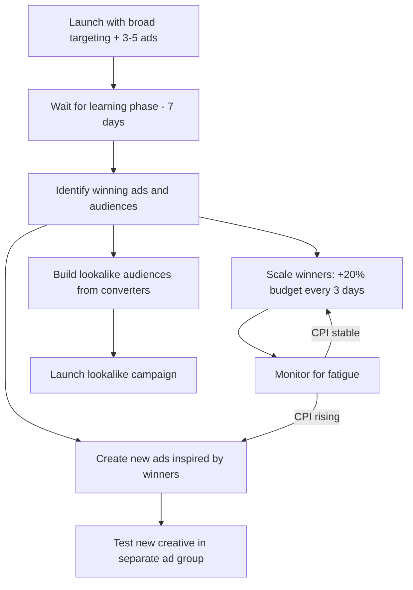

## Time to make your first TikTok ad

TikTok campaigns follow a three-level structure, just like Meta: **Campaign > Ad Group > Ad.** Each level controls different settings. The campaign sets your objective and overall budget. The ad group defines who sees your ad, when, and for how much. The ad is the actual creative — the video people watch.

This guide walks through every screen and every setting, so you never have to guess what to click.

## Before you start — have these ready

| What you need | Details | Why |
|--------------|---------|-----|
| **TikTok Ads Manager account** | Approved and payment method added | Cannot create ads without it |
| **Tracking installed and verified** | SDK, Pixel, or MMP sending events | Required for conversion optimization |
| **1-3 vertical videos** | 9:16 aspect ratio, 15-30 seconds each | Your ad creative |
| **Ad copy** | Short, punchy text (2-3 variations) | Displayed below the video |
| **CTA text** | "Download," "Install Now," "Learn More" | The button users tap |
| **Budget** | At least $50/day for the campaign | TikTok's minimum for campaign budgets |
| **TikTok account** (if using Spark Ads) | With your organic videos posted | For boosting organic content |

<Note>
  **Do not have video yet?** That is okay. Read through this guide first to understand the full setup, then come back when you have creative. We also cover how to create videos quickly at the end of this guide.
</Note>

## The campaign creation walkthrough

### Level 1: Campaign setup

<Steps>
  <Step title="Go to Campaign page">
    In TikTok Ads Manager ([ads.tiktok.com](https://ads.tiktok.com)), click **Campaign** in the top navigation, then click the blue **Create** button.

    TikTok may ask if you want **Simplified Mode** or **Custom Mode**:
    - **Simplified Mode** — fewer options, TikTok makes decisions for you (similar to Apple Search Ads Basic)
    - **Custom Mode** — full control over every setting

    **Choose Custom Mode.** It gives you all the options this guide covers. You can always simplify later.
  </Step>
  <Step title="Choose your advertising objective">
    TikTok asks what you want to achieve. Each objective optimizes for a different outcome.

    **For app install campaigns:**

    | Objective | What it optimizes for | When to use |
    |-----------|---------------------|-------------|
    | **App Promotion** | App installs and in-app events | You want people to install your app |
    | **Website Conversions** | Actions on your website | You want web signups or purchases |
    | **Traffic** | Link clicks | You want visitors to your landing page |
    | **Reach** | Maximum impressions | You want brand awareness (not direct response) |
    | **Video Views** | Video watch time | You want people to watch your video content |
    | **Community Interaction** | Follows, profile visits | You want to grow your TikTok following |
    | **Lead Generation** | Form submissions | You want to collect leads within TikTok |

    **Select "App Promotion"** for app install campaigns. This tells TikTok to find users who are most likely to install your app.
  </Step>
  <Step title="Choose your optimization type (App Promotion only)">
    Under App Promotion, TikTok asks what you want to optimize for:

    | Option | What it means | When to use |
    |--------|-------------|-------------|
    | **App Install** | Optimize for maximum installs | Start here — highest volume |
    | **App Event** | Optimize for specific in-app actions (purchase, registration) | After you have install data, optimize for deeper events |
    | **Value** | Optimize for highest revenue from in-app purchases | Advanced — requires significant purchase data |

    **Select "App Install"** for your first campaign. Once you have 100+ installs, you can test optimizing for deeper events.
  </Step>
  <Step title="Name your campaign">
    Use a clear naming convention:

    **Pattern:** `[Platform] - [Country] - [Objective] - [Creative Type] - [Date]`

    **Examples:**
    - `TikTok - US - Installs - UGC Style - Feb2026`
    - `TikTok - UK - Installs - Screen Recording - Feb2026`
    - `TikTok - US - Purchase Opt - Spark Ads - Mar2026`
  </Step>
  <Step title="Set campaign budget">
    Choose your budget type:

    | Budget type | How it works | Recommendation |
    |------------|-------------|----------------|
    | **Daily budget** | Maximum spend per day across all ad groups in the campaign | Recommended for ongoing campaigns |
    | **Lifetime budget** | Total maximum spend over the campaign's lifetime | Good for time-limited promotions |
    | **No limit** | Budget controlled at the ad group level only | For advanced users with multiple ad groups |

    **Set a daily budget of $50-100/day** for your first campaign.

    <Warning>
      **TikTok's minimum campaign daily budget is $50.** If you set less, TikTok will not let you proceed. If $50/day is too much for your total budget, consider starting with Apple Search Ads or Meta first.
    </Warning>
  </Step>
  <Step title="Campaign settings (optional)">
    - **Create Split Test:** Leave OFF for your first campaign
    - **Campaign Budget Optimization (CBO):** Turn ON — this lets TikTok distribute budget across ad groups to maximize results

    <Tip>
      **Campaign Budget Optimization (CBO) is usually better than manual allocation.** TikTok's algorithm is good at finding which ad group performs best and shifting budget toward it automatically.
    </Tip>
  </Step>
</Steps>

### Level 2: Ad group setup

The ad group level is where you define WHO sees your ad, WHEN they see it, and HOW MUCH you pay.

<Steps>
  <Step title="Select your app">
    Choose your app from the dropdown. If it is not listed, go back to Events Manager and add it (see account setup guide).

    Select the platform: **iOS**, **Android**, or both. If you want separate data, create separate ad groups per platform.
  </Step>
  <Step title="Choose placements">
    Placements determine WHERE your ad appears:

    | Option | Where your ad shows | Recommendation |
    |--------|-------------------|----------------|
    | **Automatic Placement** | TikTok, Pangle (partner network), and other TikTok apps | Gives TikTok maximum flexibility |
    | **Select Placement** | You choose specifically | Choose "TikTok" only for your first campaign |

    **For your first campaign, select "Select Placement" and choose only TikTok.** This gives you the clearest data. Pangle (TikTok's partner ad network) can sometimes dilute performance with lower-quality inventory.

    <Note>
      **What is Pangle?** Pangle is TikTok's ad network for partner apps — similar to Google's Display Network or Meta's Audience Network. Your ads appear in other apps, not in TikTok itself. Quality varies. Test it later once you have baseline TikTok performance.
    </Note>
  </Step>
  <Step title="Turn on/off Automated Creative Optimization">
    **Automated Creative Optimization (ACO)** lets you upload multiple videos, texts, and CTAs. TikTok automatically combines them and tests different variations to find the best performer.

    | ACO setting | When to use |
    |------------|-------------|
    | **ON** | You have 3+ video variations and want TikTok to test combinations |
    | **OFF** | You want to control exactly which video goes with which text |

    **Turn ACO ON for your first campaign** if you have multiple videos. It accelerates learning.
  </Step>
  <Step title="Set up targeting">
    This is where you define your audience. Here are all the targeting options:

    **Demographics:**

    | Setting | Options | First campaign recommendation |
    |---------|---------|------------------------------|
    | **Location** | Countries, states, cities, or radius | One country only (your primary market) |
    | **Age** | 13-17, 18-24, 25-34, 35-44, 45-54, 55+ | 18-44 (or All if unsure) |
    | **Gender** | Male, Female, All | All (unless your app is gender-specific) |
    | **Language** | Specific languages | Leave open (TikTok targets by location already) |

    **Interests and behaviors:**

    | Targeting type | How it works | Example |
    |---------------|-------------|---------|
    | **Interest categories** | Target users based on their content interests | Fitness, Technology, Food, Travel |
    | **Interaction behaviors** | Target based on how they interact with content | Liked fitness videos, shared recipe content |
    | **Creator interactions** | Target followers of specific creator categories | People who follow fitness creators |
    | **Hashtag interactions** | Target users who engaged with specific hashtags | Users who interacted with #workout |
    | **Video interactions** | Target based on video engagement patterns | Users who watch videos to completion |

    **Device targeting:**

    | Setting | Options | When to use |
    |---------|---------|-------------|
    | **Operating system** | iOS, Android | Already set by your app selection |
    | **OS version** | Minimum version | If your app requires a specific OS version |
    | **Device model** | Specific devices | Rarely needed |
    | **Device price** | Price ranges | Target premium device users (higher spending potential) |
    | **Connection type** | Wi-Fi, Cellular | Rarely needed |
    | **Carrier** | Specific carriers | Rarely needed |

    <Tip>
      **For your first campaign, keep targeting BROAD.** Set location and age, and leave everything else open. TikTok's algorithm is very good at finding the right users within a broad audience. Narrow targeting too early limits the algorithm's ability to learn and can result in higher costs.
    </Tip>

    **Custom audiences (advanced — skip for first campaign):**

    | Audience type | What it is | When to use |
    |-------------|-----------|-------------|
    | **Customer File** | Upload a list of emails/phone numbers | Retarget existing users |
    | **App Activity** | Users who performed actions in your app | Retarget engaged users |
    | **Website Traffic** | Users who visited your website | Retarget website visitors |
    | **Engagement** | Users who interacted with your TikTok content | Target warm audiences |
    | **Lead Generation** | Users who submitted a lead form | Follow up with leads |

    **Lookalike audiences (advanced — skip for first campaign):**

    Create audiences that "look like" your best customers:
    1. Upload a source audience (e.g., your paying customers)
    2. Choose the audience size: Narrow (1%), Balanced (5%), or Broad (10%)
    3. TikTok finds new users with similar characteristics

    <Note>
      **Lookalike audiences require a source of at least 1,000 users.** Build this data first with broad targeting campaigns, then create lookalikes to improve performance.
    </Note>
  </Step>
  <Step title="Set budget and schedule">
    **Ad group budget:**
    - Minimum: $20/day
    - Recommended: Set to roughly (campaign budget / number of ad groups)
    - If using CBO (campaign budget optimization), you can skip individual ad group budgets

    **Schedule:**
    - Start date: Today or a future date
    - End date: Leave open for ongoing campaigns (you can always pause manually)
    - Dayparting: Leave as "All day" for your first campaign

    **Optimization goal:**
    - For App Install campaigns: **Install** is automatically selected
    - For App Event campaigns: Choose the event (purchase, registration, etc.)
  </Step>
  <Step title="Choose your bidding strategy">
    | Strategy | How it works | Best for |
    |----------|-------------|----------|
    | **Lowest Cost** | TikTok gets you the most installs at the lowest possible cost. No bid cap. | First campaigns — let TikTok find the market price |
    | **Cost Cap** | You set a target CPI and TikTok tries to stay near it. May get fewer installs. | When you know your target CPI from prior data |
    | **Bid Cap** | You set a maximum CPM/CPC/CPI bid. Strict control. | Advanced optimization when you know exact economics |

    **Select "Lowest Cost" for your first campaign.** This gives TikTok maximum flexibility to find cheap installs while the algorithm learns.

    <Tip>
      **After 1-2 weeks of data, switch to Cost Cap** with a target CPI based on what you learned. This gives you more predictable costs while still letting TikTok optimize.
    </Tip>
  </Step>
</Steps>

### Level 3: Ad creation

This is where you create the actual ad that users see. The quality of your ad creative determines 80%+ of your campaign's performance.

<Tabs>
  <Tab title="Regular In-Feed Ads">
    <Steps>
      <Step title="Choose your identity">
        The "identity" is the TikTok account name and avatar that appears on the ad.

        | Option | What it means |
        |--------|-------------|
        | **Use TikTok account** | Your ad appears to come from your TikTok account. Users can visit your profile. | Recommended if you have a TikTok account |
        | **Custom identity** | Enter a display name and upload an avatar. No linked profile. | Use if you do not have a TikTok account |

        **Use your TikTok account** if you have one. It adds credibility and lets users follow you.
      </Step>
      <Step title="Upload your video">
        Click **Upload** to add your video file.

        **Video specifications:**

        | Spec | Requirement |
        |------|------------|
        | **Aspect ratio** | 9:16 (vertical, full screen) |
        | **Resolution** | 540x960 minimum, 1080x1920 recommended |
        | **Duration** | 5-60 seconds (15-30 seconds recommended) |
        | **File size** | Up to 500 MB |
        | **Format** | MP4, MOV, MPEG, AVI |
        | **Sound** | Required — TikTok is a sound-on platform |

        <Warning>
          **Never use horizontal (16:9) or square (1:1) video on TikTok.** It will appear letterboxed with black bars, and performance will be terrible. Always shoot and export in 9:16 vertical format.
        </Warning>
      </Step>
      <Step title="Write your ad text">
        The ad text appears below the video, near the bottom of the screen. Keep it short.

        **Character limit:** 100 characters (some languages allow more)

        **Good ad text examples:**
        - "Finally, an app that makes budgeting simple"
        - "Track your workouts in 10 seconds"
        - "The sleep app 2M+ people swear by"
        - "Learn a new language in just 5 min/day"

        **Bad ad text examples:**
        - "Download our revolutionary AI-powered productivity enhancement application today" (too long, too corporate)
        - "Best app 2026! Limited time offer! Download NOW!!!" (spammy)
        - "Our app has features including task management, calendar integration, and..." (boring feature list)

        <Tip>
          **Write ad text like a TikTok caption, not like a billboard.** Casual, conversational, maybe a little playful. TikTok users scroll past anything that feels like traditional advertising.
        </Tip>
      </Step>
      <Step title="Choose your CTA (Call to Action)">
        Select the button text that appears at the bottom of your ad:

        | CTA option | Best for |
        |-----------|---------|
        | **Download** | App install campaigns (most common) |
        | **Install Now** | App install with urgency |
        | **Learn More** | When you want to educate before the install |
        | **Shop Now** | E-commerce apps |
        | **Sign Up** | Subscription or registration focused |
        | **Play Game** | Gaming apps |

        **"Download" is the safest choice** for app install campaigns.
      </Step>
      <Step title="Add your destination URL">
        For app install campaigns, enter your app store URL:
        - **iOS:** `https://apps.apple.com/app/yourapp/id12345`
        - **Android:** `https://play.google.com/store/apps/details?id=com.yourapp`

        TikTok will also use your tracking link if you are using an MMP. Enter the MMP tracking URL instead of the direct store link.
      </Step>
      <Step title="Add multiple ads (recommended)">
        Click **Add Ad** or **+ New Ad** to add more video variations. You should launch with at least 3-5 different videos.

        **Why multiple ads matter:**
        - TikTok's algorithm tests each ad against your target audience
        - Within a few days, it identifies which video performs best
        - More variations = faster learning and better results
        - Creative diversity is the #1 lever for TikTok ad performance
      </Step>
    </Steps>
  </Tab>
  <Tab title="Spark Ads (Boosted Organic Posts)">
    Spark Ads let you turn existing TikTok posts into paid ads. The ad links to the real TikTok post, keeping all engagement (likes, comments, shares).

    <Steps>
      <Step title="Post organic content first">
        Create and post TikTok videos from your TikTok account. These should feature your app naturally, following the creative best practices in this guide.
      </Step>
      <Step title="Identify high-performing posts">
        After a few days, check your TikTok analytics. Look for videos with:
        - Above-average watch time
        - Good engagement (likes, comments, shares)
        - Content that showcases your app

        These are your Spark Ad candidates.
      </Step>
      <Step title="Generate an authorization code">
        **If boosting YOUR OWN post:**
        1. Open TikTok and go to the video
        2. Tap the three dots (**...**) > **Ad settings** > **Authorize**
        3. Enable **Ad authorization**
        4. Generate an **authorization code** (valid for 7, 30, or 60 days)
        5. Copy the code

        **If boosting a CREATOR'S post:**
        1. The creator follows the same steps on their video
        2. They send you the authorization code
        3. You use it in Ads Manager
      </Step>
      <Step title="Create the Spark Ad in Ads Manager">
        In your ad group, when creating a new ad:
        1. Under **Identity**, select **Use TikTok account post (Spark Ad)**
        2. Click **Authorization Code**
        3. Paste the code from the previous step
        4. Select the video from the list
        5. Add your CTA button and destination URL
        6. Submit
      </Step>
    </Steps>

    **Why Spark Ads outperform regular ads:**

    | Factor | Regular In-Feed Ad | Spark Ad |
    |--------|-------------------|----------|
    | **Profile link** | Custom identity or brand | Real TikTok profile |
    | **Engagement** | Engagement is on the ad only | Engagement adds to original post |
    | **Credibility** | Users know it is an ad | Feels like organic content |
    | **Music** | Limited to commercial music library | Can use ANY TikTok sound |
    | **Avg CTR** | 0.5-1.5% | 1-3% (typically higher) |
    | **Avg CPI** | Baseline | Often 20-40% lower |

    <Tip>
      **The best TikTok ad strategy: Post organic content regularly, then Spark Ad the winners.** This is essentially free A/B testing. Let organic engagement tell you what works, then put money behind the proven winners.
    </Tip>
  </Tab>
</Tabs>

## Smart Creative features

TikTok offers AI-powered tools to help you create and optimize ads.

### Automated Creative Optimization (ACO)

ACO lets you upload multiple creative elements, and TikTok's AI tests every combination to find the best performer.

**How to use ACO:**

1. Turn on ACO in your ad group settings (during setup)
2. Upload 3-5 different videos
3. Write 3-5 different ad text variations
4. Select 2-3 different CTAs
5. TikTok creates all possible combinations (e.g., 5 videos x 5 texts x 3 CTAs = 75 combinations)
6. The algorithm tests them and shifts budget to winners automatically

| ACO element | How many to provide | Tips |
|------------|-------------------|------|
| **Videos** | 3-5 minimum | Make them visually different, not minor edits |
| **Ad text** | 3-5 variations | Try different angles: benefit, curiosity, social proof |
| **CTA** | 2-3 options | Download, Install Now, Learn More |
| **Display name** | 1-2 | Your brand name vs. a persona name |

<Note>
  **ACO is one of TikTok's strongest features.** It automates the most time-consuming part of advertising — creative testing. Use it whenever you have multiple creative assets.
</Note>

### Smart Video features

TikTok's built-in video editor offers AI-powered tools:

| Feature | What it does |
|---------|-------------|
| **Smart Video** | Automatically generates video from your images and text |
| **Video Templates** | Pre-built templates you can customize |
| **Smart Text** | AI-generated ad copy suggestions |
| **Auto-Subtitles** | Automatically adds captions to your video |
| **Smart Soundtrack** | Suggests trending music that fits your video |

### TikTok Video Editor

TikTok Ads Manager includes a built-in video editor. You do not need external tools.

**To access it:**
1. In the ad creation screen, click **Create a Video** instead of uploading
2. Choose from templates or start from scratch
3. Add clips, text overlays, music, transitions, and effects
4. Export directly as your ad creative

<Tip>
  **The TikTok Video Editor is surprisingly good for quick ad creation.** If you do not have video editing software, this tool can produce TikTok-native content that performs well. Templates are especially useful for your first ads.
</Tip>

## Creative best practices — what actually works

Your creative determines 80%+ of your campaign's performance. Here is exactly what to do.

### The anatomy of a high-performing TikTok ad

```
[0-2 seconds] HOOK — Grab attention immediately
    "Wait, this app actually..."
    "I can't believe I just found..."
    "POV: You discover the app that..."

[2-5 seconds] PROBLEM/RELATABILITY — Connect with the viewer
    "I used to spend hours every week..."
    "Does anyone else struggle with..."
    "I was SO frustrated with..."

[5-15 seconds] SOLUTION — Show your app in action
    - Screen recording of the app
    - Person demonstrating the app
    - Before/after of using the app

[15-25 seconds] PROOF/RESULT — Show the outcome
    "Now I save 2 hours every week"
    "My screen time dropped by 40%"
    Show the end result on screen

[Last 2-3 seconds] CTA — Tell them what to do
    "Link in bio" or "Download below"
    (The CTA button also appears automatically)
```

### Hook formulas that stop the scroll

Your first 2 seconds determine everything. Here are proven hooks:

<AccordionGroup>
  <Accordion title="The Question Hook">
    Ask a question your target user would immediately relate to.

    - "Did you know you can learn a language while you commute?"
    - "Why is no one talking about this app?"
    - "Is it just me, or is budgeting the most boring thing ever?"
  </Accordion>
  <Accordion title="The Bold Claim Hook">
    Make a surprising statement that demands attention.

    - "This app replaced 5 others on my phone"
    - "I made $500 in my first week using this"
    - "This is the only fitness app you'll ever need"
  </Accordion>
  <Accordion title="The Problem Hook">
    Start with a relatable frustration.

    - "I used to waste 3 hours every Sunday meal planning..."
    - "My sleep schedule was completely destroyed until..."
    - "I was spending $200/month on subscriptions I forgot about..."
  </Accordion>
  <Accordion title="The Trending Sound Hook">
    Use a currently trending sound and format, adapted to your app.

    - Check TikTok's Creative Center for trending sounds
    - Use the "trending" tab in TikTok's music library
    - Adapt the format to showcase your app
  </Accordion>
  <Accordion title="The POV Hook">
    Immerse the viewer in a scenario.

    - "POV: You just found the app that fixes your morning routine"
    - "POV: Your friend shows you the budgeting app that changed their life"
    - "POV: You realize you've been studying wrong this whole time"
  </Accordion>
  <Accordion title="The Tutorial Hook">
    Promise to teach something valuable.

    - "Here's how I memorize 50 vocabulary words per day"
    - "The 10-second trick to tracking your spending"
    - "How to build a workout plan in under a minute"
  </Accordion>
</AccordionGroup>

### Video production tips

| Tip | Why it matters |
|-----|---------------|
| **Shoot vertically (9:16)** | Full-screen experience; horizontal video is immediately skipped |
| **Use natural lighting** | Overly produced content feels out of place on TikTok |
| **Film with a phone** | Phone-quality video looks native to the platform |
| **Include sound** | 88% of TikTok users have sound on; it is not optional |
| **Add captions** | Even with sound on, captions increase engagement by 25%+ |
| **Move fast** | Cut every 2-3 seconds. Long static shots lose attention |
| **Show the app on screen** | Do not just talk about it — demonstrate it visually |
| **Face to camera** | Videos with a human face outperform faceless content by 2x on average |
| **Use trending sounds** | The algorithm gives a boost to content using trending audio |
| **Keep it 15-30 seconds** | Completion rate is a key signal; shorter videos complete more often |

### Content types ranked by performance (for app installs)

| Rank | Content type | Why it works | Effort level |
|------|-------------|-------------|-------------|
| 1 | **Person-to-camera testimonial** | Most trusted format; feels like a friend recommending | Medium |
| 2 | **Screen recording with voiceover** | Shows the app in action; very convincing | Low |
| 3 | **Before/after transformation** | Visual proof of value; compelling narrative | Medium |
| 4 | **Trending format adaptation** | Rides algorithm boost from trending content | Medium |
| 5 | **Day-in-my-life featuring app** | Shows app in context of real daily use | Medium |
| 6 | **App review / "honest review"** | Feels authentic and informational | Low |
| 7 | **Creator duet/stitch** | Leverages existing creator credibility | Low |
| 8 | **Tutorial / how-to** | Delivers value while showcasing the app | Medium |

### Creative refresh cadence

TikTok creative fatigues faster than any other platform. Plan for regular refreshes:

| Timeframe | Action |
|-----------|--------|
| **Week 1** | Launch with 3-5 video variations |
| **Week 2** | Identify top 1-2 performers. Create 2-3 new variations inspired by winners |
| **Week 3** | Pause underperformers. Launch new creative. Test a different creative format |
| **Week 4** | Repeat. You should always have fresh creative being tested |
| **Monthly** | Completely refresh your creative approach every 4-6 weeks |

<Warning>
  **Creative fatigue is the #1 reason TikTok campaigns die.** Even your best-performing ad will stop working after 2-4 weeks. Always have new creative in production. Budget time for video creation every single week.
</Warning>

## Recommended first campaign settings

Here is the exact configuration for your first campaign:

| Setting | Recommended value | Notes |
|---------|------------------|-------|
| **Objective** | App Promotion > App Install | Start with installs |
| **Campaign budget** | $50-100/day | TikTok minimum is $50/day |
| **CBO** | ON | Let TikTok allocate budget across ad groups |
| **Placement** | TikTok only | Skip Pangle for now |
| **ACO** | ON (if you have 3+ videos) | Let TikTok test combinations |
| **Location** | One country (your primary market) | Focus for clear data |
| **Age** | 18-44 | Broad to start |
| **Gender** | All | Unless your app is gender-specific |
| **Interests** | None (broad) | Let the algorithm find your audience |
| **Custom audience** | None | Not enough data yet |
| **Bidding** | Lowest Cost | Let TikTok find the market price |
| **Ad group budget** | $20-50/day | If not using CBO |
| **Number of ads** | 3-5 video variations | More variations = faster learning |
| **Video length** | 15-30 seconds | Short enough for high completion |
| **CTA** | Download | Standard for app installs |

## Review and submit

<Steps>
  <Step title="Review all settings">
    Before submitting, review every setting on the summary screen:
    - Campaign: objective, budget, name
    - Ad group: targeting, placements, budget, bidding
    - Ads: videos, text, CTA, destination URL
  </Step>
  <Step title="Submit for review">
    Click **Submit**. TikTok reviews all new ads before they go live.

    **Review timeline:**
    | Scenario | Time |
    |----------|------|
    | Standard review | 15 minutes to 2 hours |
    | Flagged for manual review | 2-24 hours |
    | Rejected | Immediate notification with reason |

    **Common rejection reasons:**
    - Video contains prohibited content (weapons, drugs, misleading claims)
    - Ad text makes unsubstantiated claims ("best app ever," "#1 rated")
    - Landing page does not match the ad
    - Video is too low resolution
    - Music copyright issues (use TikTok's commercial music library)
  </Step>
  <Step title="Ad goes live">
    Once approved, your ad starts serving immediately. You will see impressions, clicks, and installs in the Ads Manager dashboard.
  </Step>
</Steps>

## What to expect after launch

### The learning phase

When a new campaign launches, TikTok enters a **learning phase** where the algorithm experiments with different audiences to find who responds best.

| Learning phase aspect | Details |
|----------------------|---------|
| **Duration** | 3-7 days typically |
| **Events needed** | 50 conversion events (installs) to exit learning |
| **Performance** | Volatile — CPI may be high and inconsistent |
| **What to do** | NOTHING. Do not change settings during learning. |

<Warning>
  **Do not make changes during the learning phase.** Every significant edit (budget change of 30%+, targeting change, new ads) restarts the learning phase. Be patient for the first week.
</Warning>

### Week-by-week expectations

| Time | What happens | What to do |
|------|-------------|-----------|
| **Day 1** | Ads in review, then start serving | Wait |
| **Day 2-3** | First impressions and clicks. CPI may be high. | Check that events are tracking correctly |
| **Day 4-7** | Learning phase continues. Results volatile. | Do not touch settings |
| **Week 2** | Performance stabilizing. Clear winners and losers emerging. | Pause ads with 1,000+ impressions and 0 installs. Do not change anything else yet. |
| **Week 3** | Steady performance. You know your baseline CPI. | Scale winning ads by increasing budget 20%. Add 2-3 new creative variations. |
| **Week 4** | Established campaign. | Test new audiences, new creative formats, consider Spark Ads. |

## Optimization playbook

After the learning phase, here is how to optimize:

### Quick wins

| Action | When to do it | Expected impact |
|--------|-------------|----------------|
| **Pause losing ads** | Ad has 1,000+ impressions, 0 installs | Saves wasted budget |
| **Scale winners** | Ad has CPI below target | Increase budget 20% every 3 days |
| **Add new creative** | Every 1-2 weeks | Prevents fatigue, finds new winners |
| **Check placement breakdown** | Weekly | Pangle may drag down performance — disable if so |
| **Review audience insights** | After 2 weeks | See which demographics convert best, narrow targeting |

### Scaling strategy



### Advanced optimization techniques

<AccordionGroup>
  <Accordion title="Audience segmentation">
    After 2-4 weeks of data, check your audience analytics:
    1. Go to **Reporting** > **Audience**
    2. See performance breakdown by age, gender, interest, device
    3. Create new ad groups targeting your best-performing segments
    4. Exclude poor-performing segments
  </Accordion>
  <Accordion title="Retargeting campaigns">
    Create retargeting campaigns for users who engaged with your content but did not install:
    1. Create a custom audience: users who watched 75%+ of your ad
    2. Create another: users who clicked but did not install
    3. Target these warm audiences with different creative (address objections, show social proof)
    4. Budget: 10-20% of your total TikTok spend
  </Accordion>
  <Accordion title="Lookalike expansion">
    Once you have 1,000+ installs:
    1. Create a custom audience from your installers
    2. Create a lookalike audience (start with 1% - most similar)
    3. Launch a new campaign targeting this lookalike
    4. Test 1%, 3%, 5%, and 10% lookalike sizes
  </Accordion>
  <Accordion title="Event optimization">
    Once you have 100+ of a deeper event (registrations, purchases):
    1. Create a new campaign with "App Event" optimization
    2. Select the event you want to optimize for
    3. TikTok will find users more likely to perform that action (not just install)
    4. CPI may increase, but in-app conversion quality improves significantly
  </Accordion>
  <Accordion title="Creative iteration process">
    The ongoing creative process:
    1. Analyze your top-performing ad — what hook, format, length, and style work?
    2. Create 3-5 new variations that share the winning elements but change something (different hook, different person, different app feature)
    3. Launch in a test ad group with 20% of budget
    4. After 1 week, move winners to your main campaign
    5. Repeat every 2 weeks
  </Accordion>
</AccordionGroup>

## Common mistakes to avoid

| Mistake | Why it hurts | What to do instead |
|---------|-------------|-------------------|
| **Using horizontal or square video** | Gets immediately scrolled past | Always shoot 9:16 vertical |
| **No hook in first 2 seconds** | Users scroll past before seeing your message | Lead with a strong hook every time |
| **Too polished / too corporate** | Feels like an ad, users skip | Make it look native to TikTok |
| **No sound** | 88% of TikTok is sound-on; silence is weird | Always include sound, voiceover, or music |
| **Only 1 ad variation** | No data to compare, slower learning | Always launch with 3-5 variations minimum |
| **Narrow targeting from day 1** | Algorithm cannot learn, higher CPIs | Start broad, narrow after data |
| **Changing settings during learning** | Restarts the learning phase | Wait 7 days before making changes |
| **Not refreshing creative** | Fatigue kills performance after 2-4 weeks | Produce new creative every 1-2 weeks |
| **Ignoring Spark Ads** | Missing the best-performing format | Post organic content and boost winners |
| **Budget too low** | Cannot exit learning phase | At least $50/day campaign, $20/day ad group |

## Quick-start video creation guide

If you do not have video yet, here are three ways to create your first ads quickly:

### Method 1: Screen recording + voiceover (30 minutes)

1. Open your app on your phone
2. Start screen recording (built into iOS and Android)
3. Walk through your app's best feature for 20-30 seconds
4. Stop recording
5. Add a voiceover explaining what you are doing
6. Add captions
7. Export as 9:16

### Method 2: Person-to-camera on your phone (20 minutes)

1. Prop your phone up vertically
2. Sit in a well-lit spot (near a window works great)
3. Talk to the camera like you are telling a friend about your app
4. Show your phone screen briefly when demonstrating the app
5. Keep it under 30 seconds
6. No editing needed — raw is fine

### Method 3: TikTok's built-in video editor (15 minutes)

1. In TikTok Ads Manager, click **Create a Video** during ad creation
2. Choose a template that fits your app's category
3. Upload 5-10 screenshots or screen recordings
4. Add text overlays and music
5. Export and use directly

## Next steps

Once your TikTok campaign is running:

1. **Wait 7 days** — let the learning phase complete
2. **Optimize** — pause losers, scale winners
3. **Create new creative** — start your weekly creative refresh cycle
4. **Explore Spark Ads** — post organic content and boost what works
5. **Build audiences** — create retargeting and lookalike audiences as you gather data

<Card
  title="Budget Planning"
  icon="arrow-right"
  href="/playbook/budget-planning"
>
  Running campaigns on multiple platforms? Learn how to plan and allocate your overall ad budget.
</Card>
