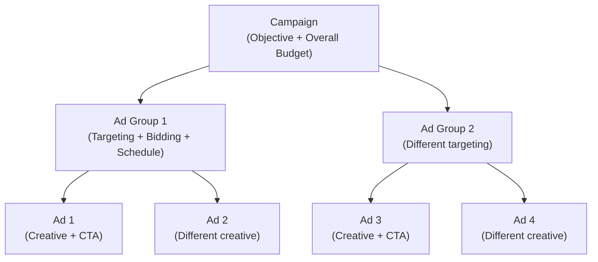
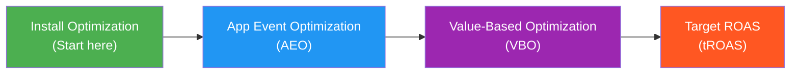

# Your First TikTok Campaign

Your TikTok Ads Manager account is set up, tracking is configured, and you are ready to launch your first campaign. This guide walks you through the entire process — from choosing your objective to creating your ad creative and optimizing in the first week.

Remember TikTok's golden rule: **"Don't make ads, make TikToks."** Keep this in mind throughout the entire process.

---

## Understanding TikTok's Campaign Structure

TikTok Ads uses a three-level structure, just like Meta (Facebook):

| Level | What You Set | Analogy |
|---|---|---|
| **Campaign** | Objective (what you want), overall budget | The "what" and "how much" |
| **Ad Group** | Who sees the ad, when, where, and bidding strategy | The "who" and "when" |
| **Ad** | The actual video creative and call-to-action | The "how" |

---

## Step 1: Create a New Campaign

<Steps>
  <Step title="Click 'Create' in Ads Manager">
    Log into [ads.tiktok.com](https://ads.tiktok.com) and click the **"Create"** button (or **"Campaign > Create"** in the top navigation).
  </Step>
  <Step title="Choose your advertising objective">
    TikTok groups objectives into three categories:

    | Category | Objectives | Best For |
    |---|---|---|
    | **Awareness** | Reach | Brand awareness, getting seen by as many people as possible |
    | **Consideration** | Traffic, Video Views, Community Interaction | Driving website visits, video engagement, follower growth |
    | **Conversion** | App Install, Website Conversion, Lead Generation | Getting people to download your app, make a purchase, or sign up |

    **For beginners**:
    - If you have an app: choose **App Install**
    - If you have a website/online store: choose **Website Conversion**
    - If you just want traffic: choose **Traffic**

    The objective you choose determines how TikTok's algorithm optimizes your campaign. Choose the one that matches your actual business goal.
  </Step>
  <Step title="Name your campaign">
    Use a descriptive name. Include the date, objective, and any other identifying info:

    Good: `2024-03 App Install - US - Broad Targeting`
    Bad: `Campaign 1`
  </Step>
  <Step title="Set campaign budget">
    Remember TikTok's minimums:
    - **Daily budget**: Minimum $50 per day
    - **Lifetime budget**: Minimum $500

    **For beginners**: Start with a **daily budget of $50-$100**. This gives you enough data to learn without a huge financial commitment. You can always increase later.

    Choose **"Daily Budget"** rather than lifetime if you want more control over when you spend.
  </Step>
</Steps>

<Tip>
**Pro Tip**: If you want to test multiple creatives (you should), set your campaign budget high enough to support them. With a $50/day budget and 3-4 ad creatives, each creative gets about $12-$17/day in spend. That is enough for initial testing, but increase to $100-$200/day as soon as you find a winning creative.
</Tip>

---

## Step 2: Configure Your Ad Group

The ad group is where you define who sees your ad and how you bid.

### Targeting Options

<Steps>
  <Step title="Choose your placement">
    TikTok offers several placement options:

    - **Automatic Placement**: TikTok decides where to show your ad (recommended for beginners)
    - **Select Placement**: Choose manually (TikTok, Pangle, etc.)

    **For beginners**: Use **Automatic Placement**. TikTok's algorithm is good at finding where your ads perform best.
  </Step>
  <Step title="Select your target audience">
    You can target by:

    | Targeting Type | Options | Notes |
    |---|---|---|
    | **Location** | Countries, states, cities, DMAs | Start with your primary market |
    | **Age** | 13-17, 18-24, 25-34, 35-44, 45-54, 55+ | Select ranges relevant to your product |
    | **Gender** | All, Male, Female | Start with "All" unless your product is gender-specific |
    | **Language** | Any language | Match your ad creative's language |
    | **Interests** | 15+ categories with subcategories | Based on content users engage with |
    | **Behaviors** | Video interactions, creator interactions | Based on recent actions on TikTok |
    | **Device** | OS, model, carrier, connection type | Useful for app campaigns (iOS vs Android) |

    **For beginners**: Start **broad**. Select your target country, age range (18-44 is a safe starting point for most products), and leave other targeting open. TikTok's algorithm is very good at finding the right people within a broad audience. Over-targeting limits the algorithm's ability to learn and find your best users.
  </Step>
  <Step title="Set your optimization goal">
    This tells TikTok what to optimize for:

    - **App Install campaigns**: Optimize for installs
    - **Conversion campaigns**: Optimize for a specific pixel event (Purchase, AddToCart, Registration)
    - **Traffic campaigns**: Optimize for clicks

    Select the event that matches your actual business goal. If you want purchases, optimize for purchases — not clicks or installs.
  </Step>
  <Step title="Set your bid strategy">
    TikTok offers several bidding options:

    | Strategy | How It Works | Best For |
    |---|---|---|
    | **Lowest Cost** | TikTok gets you the most results at the lowest possible cost | Beginners, scaling |
    | **Cost Cap** | TikTok tries to keep your average cost near your target | Controlling costs |
    | **Bid Cap** | TikTok never exceeds your maximum bid | Strict cost control |

    **For beginners**: Start with **Lowest Cost**. It is the simplest option and lets TikTok's algorithm do the heavy lifting. You can switch to Cost Cap later when you have a clear CPI/CPA target.
  </Step>
  <Step title="Set your schedule">
    Choose when your campaign runs:
    - **Start immediately** or set a specific start date
    - **Run continuously** or set an end date
    - **Dayparting** (optional): Run ads only during specific hours

    **For beginners**: Start immediately and run continuously. You need data as fast as possible to learn what works.
  </Step>
</Steps>

<Tip>
**Pro Tip**: Resist the urge to narrow your targeting too much. TikTok's algorithm works best with **broad audiences** because it needs enough data to learn. A common beginner mistake is targeting "women aged 25-34 in Los Angeles who are interested in yoga." That is too narrow. Start with "women aged 18-44 in the United States" and let TikTok find your ideal customers within that broader group.
</Tip>

---

## Step 3: Create Your Ad

This is the most important step. On TikTok, **creative quality determines 80% of your campaign's success**. The best targeting and bidding strategy cannot save a boring ad.

### Option A: Create a Standard In-Feed Ad

<Steps>
  <Step title="Upload your video">
    Upload a video file or create one using TikTok's built-in video editor.

    **Video requirements**:
    - **Aspect ratio**: 9:16 (vertical) — this is not optional
    - **Resolution**: 720x1280 minimum (1080x1920 recommended)
    - **Length**: 15-60 seconds (15-30 seconds is the sweet spot)
    - **File size**: Up to 500MB
    - **Format**: MP4 or MOV
  </Step>
  <Step title="Write your ad text">
    The text appears above your video. Keep it short (1-2 lines) and compelling:

    Good: "This app helped me sleep in 5 minutes (seriously)"
    Bad: "Download our premium meditation app with 500+ sessions, sleep stories, and breathing exercises. Limited time offer."

    The text should complement your video, not replace it. Most users watch the video first and read the text second.
  </Step>
  <Step title="Choose your call-to-action (CTA)">
    Select from TikTok's CTA options:

    | CTA | Best For |
    |---|---|
    | **Download Now** | App install campaigns |
    | **Shop Now** | E-commerce |
    | **Learn More** | Lead gen, content marketing |
    | **Sign Up** | SaaS, subscriptions |
    | **Contact Us** | Services, lead generation |
  </Step>
  <Step title="Set your landing page">
    - For apps: TikTok automatically links to your App Store/Play Store page
    - For websites: Enter the URL where you want to send traffic
  </Step>
</Steps>

### Option B: Create a Spark Ad (Recommended)

Spark Ads boost existing organic TikToks. They consistently outperform regular ads because they look native.

<Steps>
  <Step title="Find or create an organic TikTok">
    You need either:
    - An organic TikTok on your own Business Account
    - A TikTok from a creator who has authorized you to boost it

    If you do not have organic content yet, post a few TikToks first and see which ones get the best engagement. Then boost the winner.
  </Step>
  <Step title="Get the authorization code (for creator content)">
    If using someone else's TikTok:
    1. The creator goes to their TikTok video settings
    2. They enable **"Ad Authorization"**
    3. They generate an **authorization code** and share it with you
    4. The code is valid for a set number of days
  </Step>
  <Step title="Create the Spark Ad in Ads Manager">
    In the ad creation screen:
    1. Select **"Spark Ad"** as the ad format
    2. Enter the authorization code or select your own organic TikTok
    3. TikTok pulls in the video, caption, and all existing engagement (likes, comments, shares)
  </Step>
  <Step title="Add your CTA and tracking">
    Even though it looks like an organic TikTok, you can still add a CTA button and tracking link. Users see the organic post with a subtle CTA overlay.
  </Step>
</Steps>

<Tip>
**Pro Tip**: Spark Ads are the secret weapon of TikTok advertising. They combine the authenticity of organic content with the reach of paid distribution. Start with Spark Ads whenever possible — boost organic TikToks that already have some engagement (even just a few hundred views). The existing social proof (likes, comments) makes new viewers more likely to watch and engage.
</Tip>

---

## Step 4: Set Up Automated Creative Optimization (ACO)

ACO is TikTok's automated creative testing feature. Instead of manually testing different ads, you provide multiple creative elements and TikTok automatically tests combinations.

<Steps>
  <Step title="Enable ACO in your ad group">
    When creating an ad group, toggle on **"Automated Creative Optimization."**
  </Step>
  <Step title="Upload multiple creative elements">
    Provide:
    - **3-5 different videos** (different hooks, different styles, different lengths)
    - **2-3 different ad texts** (different angles, different CTAs)
    - **Multiple CTA buttons** (Download Now vs. Learn More vs. Shop Now)
  </Step>
  <Step title="TikTok tests all combinations">
    TikTok automatically creates combinations of your videos, texts, and CTAs, then tests them against each other. It allocates more budget to winning combinations and pauses losers.
  </Step>
  <Step title="Review results">
    After a few days, check which creative combinations are performing best. Use these insights to create new creative variations — take the best-performing hook and pair it with new visuals, or take the best-performing visual and try new hooks.
  </Step>
</Steps>

<Tip>
**Pro Tip**: ACO is one of the most powerful features in TikTok Ads Manager. It does in hours what would take you weeks to test manually. Always use ACO when you have multiple creative assets. Your goal is to feed TikTok at least 3-5 video variations per ad group so the algorithm has enough material to test and optimize.
</Tip>

---

## Creative Production: Making Your TikTok Ad

You do not need a professional video studio. Some of the best-performing TikTok ads are filmed on phones. Here is a practical framework for creating your first ad.

### The 3-Part Video Structure

| Part | Duration | Purpose | Example |
|---|---|---|---|
| **Hook** | 0-3 seconds | Stop the scroll | "This one trick changed everything..." |
| **Body** | 3-20 seconds | Deliver your message | Show the product/app in action |
| **CTA** | Last 3-5 seconds | Tell them what to do | "Download free — link below" |

### Hook Formulas That Work

Try these proven hook patterns for your first few ads:

1. **"I just discovered..."** — Personal discovery format
2. **"Stop scrolling if you..."** — Direct address
3. **"POV: You just found the app that..."** — POV format (native TikTok style)
4. **"Here's why everyone is talking about..."** — Social proof
5. **"This vs. That"** — Comparison format
6. **"3 reasons why..."** — List format
7. **"Wait for the end..."** — Curiosity hook

### Production Tips for Non-Video-Makers

If you have never made a TikTok before:

1. **Use your phone**. Seriously. TikTok users expect phone-quality video. A perfectly lit studio video will look out of place.
2. **Film in good lighting**. Natural light (by a window) is free and looks great.
3. **Talk to the camera**. A person talking directly to the viewer is one of the highest-performing ad formats.
4. **Show, do not tell**. Screen recording of your app with a voiceover is simple and effective.
5. **Use TikTok's built-in editor**. It has text overlays, effects, and music that make your content feel native.
6. **Keep it under 30 seconds**. For your first ad, shorter is better.

<Tip>
**Pro Tip**: If you are not comfortable on camera, use **screen recordings with voiceover**. Record yourself using your app while explaining what it does and why it is useful. Add text overlays for key points. This format is easy to produce, works well for app campaigns, and does not require any on-camera presence.
</Tip>

---

## Campaign Optimization Tiers: The Optimization Ladder

Now that you know how to create a campaign, let's talk about the **different levels of optimization** TikTok offers for app campaigns. This is set at the **Ad Group level** and determines what TikTok's algorithm is actually optimizing for.

Think of it as telling TikTok how smart to be. At the basic level, you just say "get me installs." At the advanced level, you say "find me users who will spend the most money." The more advanced the instruction, the more data TikTok needs to deliver.

### The Optimization Ladder (You Graduate Up Over Time)

### Optimization Tiers Comparison Table

| Optimization Tier | Where to Set It | What It Does | When to Use It | Pro Tip |
|---|---|---|---|---|
| **Install Optimization** | Ad Group → Optimization Goal = Install | Tells TikTok: "Find people who will install my app." The algorithm targets users most likely to download. (`optimization_goal = APP_INSTALL`) | Starting out. Your first campaigns. You need installs to build data. | Use Lowest Cost bidding to start. Get stable installs for 1-2 weeks before moving up. |
| **App Event Optimization (AEO)** | Ad Group → Optimization Goal = App Event Optimization | Tells TikTok: "Find people who will install AND perform a specific action (purchase, subscribe, etc.)." (`optimization_goal = PURCHASE`, etc.) | Once you have consistent installs and are sending in-app events back via TikTok SDK. | Pick an event that fires frequently. If purchases are rare, try "Add to Cart" first to give TikTok more learning signals. |
| **Value-Based Optimization (VBO)** | Ad Group → Optimization Goal = Value | Tells TikTok: "Find users who will generate the highest purchase value or ad revenue." Goes beyond AEO by prioritizing high-spenders. | Once you have 30+ purchase events with value data in any consecutive 7-day period. | VBO may reduce install volume but significantly increase revenue per user. Trust the algorithm and measure by ROAS, not CPI. |
| **Target ROAS (tROAS)** | Ad Group → Optimization Goal = Value + ROAS bid | Tells TikTok: "Find high-value users AND hit this specific return target." Available with Highest Value or Target ROAS bidding. | When VBO is running well and you want to lock in a minimum ROAS. Currently available for Android app campaigns. | Start with a Target ROAS at or below your current observed ROAS. Setting it too aggressively will kill delivery. |

### How It Works Under the Hood (API Reference)

| Tier | Campaign Objective | optimization_goal | Bidding Strategy |
|---|---|---|---|
| Install Optimization | App Promotion | `APP_INSTALL` | Lowest Cost / Cost Cap / Bid Cap |
| AEO | App Promotion | `PURCHASE`, `SUBSCRIBE`, etc. | Lowest Cost / Cost Cap |
| VBO | App Promotion | `VALUE` | Highest Value |
| Target ROAS | App Promotion | `VALUE` | Target ROAS |

### The Progression Explained Like Talking to a Friend

Imagine TikTok is a talent scout and you are a music producer:

1. **Install Optimization** = "Go find me singers." TikTok brings you anyone who can carry a tune. Some are great, some are terrible. But you need to see a lot of people to figure out what "great" looks like.

2. **AEO** = "Find me singers who can actually perform on stage." TikTok gets pickier — only brings you people who have performed live before. Fewer candidates, but each one is more likely to succeed.

3. **VBO** = "Find me singers who will sell out stadiums." TikTok is now looking for superstars. You get fewer candidates, but each one has mega-hit potential.

4. **Target ROAS** = "Find me stadium sellers, and make sure I earn $5 for every $1 I invest." The most specific ask. TikTok balances star quality with your budget reality.

<Tip>
**Start with Install Optimization.** Seriously. Every beginner wants to jump straight to AEO or VBO because it sounds smarter. But without enough install data, TikTok's algorithm is flying blind. Get 50+ conversions to exit the learning phase at the install level first. Then graduate up.
</Tip>

<Tip>
**Key platform difference:** On TikTok, optimization tiers are set at the **Ad Group level**. This is similar to Meta (Ad Set level) but different from Google (Campaign level). You can run multiple ad groups within the same campaign with different optimization goals.
</Tip>

<Tip>
**VBO eligibility:** TikTok requires at least **30 purchase conversion events with value** in any consecutive 7-day period before VBO becomes available. If you do not see the VBO option, you have not hit this threshold yet. Keep running AEO campaigns until you do.
</Tip>

---

## Your First Week: What to Expect and Do

### Day 1-2: Learning Phase

- TikTok's algorithm is exploring — showing your ad to different people to learn who responds
- Costs may be higher than average during this phase
- You might see inconsistent results (great one hour, nothing the next)
- **Do NOT change anything.** Let the algorithm learn.

### Day 3-4: Data Accumulates

- You should start seeing consistent impressions and some conversions
- The algorithm is narrowing down who responds best to your ad
- Check your **creative performance** — which video is getting the most engagement?

### Day 5-7: First Optimization

<Steps>
  <Step title="Check your creative performance">
    Go to the ad level and look at each creative's metrics:

    | Metric | What to Look For |
    |---|---|
    | **CTR (Click-Through Rate)** | Which creative gets the most clicks? |
    | **CPA/CPI** | Which creative converts at the lowest cost? |
    | **Video completion rate** | Which creative keeps people watching? |
    | **Engagement rate** | Which creative gets the most likes/comments/shares? |

    The creative with the best combination of completion rate and conversion rate is your winner.
  </Step>
  <Step title="Kill the losers, scale the winners">
    - **Pause** any creative that has spent at least 2x your target CPI with zero conversions
    - **Keep** creatives that are hitting your targets
    - **Increase budget** for the winning ad group by 20-30% if it is performing well
  </Step>
  <Step title="Create new creative variations">
    Based on what you learned:
    - If Hook A worked best, create 2-3 new videos with Hook A but different body content
    - If Video Style B (e.g., screen recording) worked best, make more videos in that style
    - Always be testing new creatives — even winning ads fatigue over time
  </Step>
  <Step title="Check your audience insights">
    TikTok Ads Manager shows you which demographics, interests, and devices are performing best. Use this to inform (but not rigidly constrain) your future targeting.
  </Step>
</Steps>

---

## Ongoing Creative Strategy

TikTok ads **fatigue faster** than ads on other platforms because users scroll through content so quickly. A creative that works great in week 1 might stop working in week 3-4. Plan for continuous creative production.

### Recommended Creative Cadence

| Phase | Frequency | Goal |
|---|---|---|
| **Testing** | 3-5 new creatives per week | Find winning hooks, formats, and styles |
| **Scaling** | 2-3 new creatives per week | Keep feeding winning formulas with fresh content |
| **Maintenance** | 1-2 new creatives per week | Replace fatigued ads, prevent performance decline |

<Tip>
**Pro Tip**: Think of TikTok creative production like content marketing — it is an ongoing process, not a one-time project. The advertisers who succeed on TikTok are the ones who consistently produce new creative. Set up a simple production process: brainstorm hooks on Monday, film on Tuesday, edit on Wednesday, launch on Thursday.
</Tip>

---

## Smart Performance Campaigns (Alternative Approach)

If all of the above feels overwhelming, TikTok offers **Smart Performance Campaigns (SPC)** — an AI-powered campaign type that automates almost everything.

<Steps>
  <Step title="Create a Smart Performance Campaign">
    In the campaign creation screen, select **"Smart Performance Campaign"** instead of the regular workflow.
  </Step>
  <Step title="Provide your basics">
    - Upload 3-5 video creatives
    - Set your daily budget ($50+)
    - Choose your optimization goal (installs, purchases, etc.)
    - Set your target country
  </Step>
  <Step title="Let TikTok handle the rest">
    TikTok's AI handles targeting, bidding, and creative optimization automatically. You do not set any audience targeting, bid amounts, or placements.
  </Step>
</Steps>

<Tip>
**Pro Tip**: Smart Performance Campaigns are genuinely good for beginners. They let you focus on what matters most on TikTok — the **creative** — while the algorithm handles everything else. Start with SPC, learn what creative styles work, and then graduate to manual campaigns when you want more control.
</Tip>

---

## Common Beginner Mistakes to Avoid

<AccordionGroup>
  <Accordion title="Making ads that look like ads">
    The number one mistake. If your video starts with a logo, uses corporate voiceover, and looks like a TV commercial, people will swipe past it in 1 second. Make content that feels like a TikTok first and an ad second.
  </Accordion>
  <Accordion title="Targeting too narrowly">
    TikTok's algorithm needs room to explore. If your audience is too small, the algorithm cannot find enough data to optimize. Start broad and let TikTok narrow down.
  </Accordion>
  <Accordion title="Only making one creative">
    TikTok rewards creative diversity. If you launch with only one video, you are betting everything on that one piece of content. Launch with 3-5 variations minimum so TikTok can test and find the best performer.
  </Accordion>
  <Accordion title="Changing things too quickly">
    The algorithm needs 3-5 days to learn. Making changes every day resets the learning phase and prevents optimization. Be patient.
  </Accordion>
  <Accordion title="Ignoring video completion rate">
    Many beginners focus only on clicks and installs. But video completion rate is the leading indicator of ad success on TikTok. If people are not watching your video, nothing else matters. Improve your hook.
  </Accordion>
  <Accordion title="Using horizontal video">
    TikTok is a vertical platform. Horizontal (16:9) video with black bars above and below looks terrible and performs terribly. Always shoot in 9:16 vertical.
  </Accordion>
  <Accordion title="Setting budget too low">
    With the $50/day minimum at the campaign level and $20/day at the ad group level, you need enough budget to generate meaningful data. If you split $50/day across 5 ad groups, each gets only $10/day — not enough for the algorithm to learn.
  </Accordion>
</AccordionGroup>

---

## Key Metrics Cheat Sheet

| Metric | What It Means | Good Target |
|---|---|---|
| **Impressions** | Times your ad was shown | More is generally better |
| **CTR (Click-Through Rate)** | Clicks / Impressions | 0.5-2%+ for TikTok |
| **CPC (Cost Per Click)** | Average cost per click | $0.35-$1.00 |
| **CPM (Cost Per 1,000 Impressions)** | Cost to reach 1,000 people | $4-$9 |
| **CPI (Cost Per Install)** | Average cost per app install | Varies, below your target |
| **CVR (Conversion Rate)** | Conversions / Clicks | Varies by goal |
| **Video Completion Rate** | % who watched the full video | 15%+ is good for ads |
| **Engagement Rate** | (Likes + Comments + Shares) / Impressions | 2%+ is good |

---

## Scaling Your TikTok Campaigns

Once you find winning creatives and profitable campaigns, here is how to scale:

<Steps>
  <Step title="Increase budget gradually">
    Increase your daily budget by **20-30% every 2-3 days**. Dramatic budget increases (doubling overnight) can reset the learning phase and hurt performance.
  </Step>
  <Step title="Duplicate winning ad groups">
    Create copies of your best-performing ad group with slightly different targeting (different age ranges, different interests, different geos).
  </Step>
  <Step title="Expand to new markets">
    If you are profitable in the US, try UK, Canada, Australia, or other English-speaking markets. Then expand to non-English markets with localized creative.
  </Step>
  <Step title="Test new creative formats">
    If screen recordings work, try talking-head videos. If single-person videos work, try duet-style formats. Continuously experiment with new styles.
  </Step>
  <Step title="Partner with creators">
    Use the TikTok Creator Marketplace to find creators in your niche. Creator content can be boosted as Spark Ads and often outperforms brand-produced content.
  </Step>
</Steps>

---

## Next Steps

Congratulations — you have launched your first TikTok ad campaign! Here is what to do now:

1. **Wait 3-5 days** before making significant changes
2. **Monitor creative performance** and identify winners and losers
3. **Plan your next batch of creatives** based on what you learned
4. **Read the [Creative Testing guide](/playbook/creative-testing)** for a structured approach to testing
5. **Read the [Budget Planning guide](/playbook/budget-planning)** to understand how TikTok fits into your overall ad budget

<Tip>
**Final encouragement**: TikTok is one of the most creative and fun advertising platforms in the world. Unlike other platforms where you compete mainly with money, TikTok rewards authenticity, creativity, and understanding of the culture. The fact that you are taking the time to learn the platform properly already puts you ahead of most advertisers. Have fun with it, experiment fearlessly, and remember: don't make ads, make TikToks.
</Tip>
